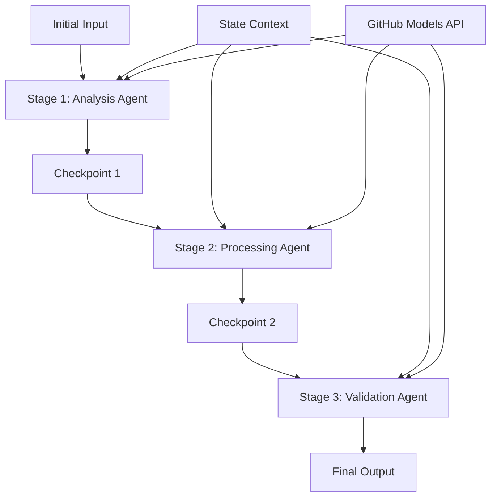

<!--
CO_OP_TRANSLATOR_METADATA:
{
  "original_hash": "1be9c8dcbd79a02d33d2c138684c1394",
  "translation_date": "2025-11-11T13:58:28+00:00",
  "source_file": "08-multi-agent/code_samples/workflows-agent-framework/dotNET/02.dotnet-agent-framework-workflow-ghmodel-sequential.md",
  "language_code": "id"
}
-->
# ⏩ Alur Kerja Agen Berurutan dengan Model GitHub (.NET)

## 📋 Tutorial Pemrosesan Berurutan Lanjutan

Notebook ini menunjukkan **pola alur kerja berurutan** menggunakan Microsoft Agent Framework untuk .NET dan Model GitHub. Anda akan belajar cara membangun pipeline pemrosesan yang canggih dan langkah demi langkah, di mana agen dieksekusi dalam urutan tertentu, dengan setiap tahap membangun hasil dari tahap sebelumnya.

## 🎯 Tujuan Pembelajaran

### 🔄 **Arsitektur Pemrosesan Berurutan**
- **Desain Alur Kerja Linear**: Membuat pipeline pemrosesan langkah demi langkah dengan ketergantungan yang jelas
- **Manajemen Status**: Mempertahankan konteks dan aliran data di seluruh tahap alur kerja berurutan
- **Integrasi Model GitHub**: Memanfaatkan model AI GitHub dalam alur kerja .NET multi-tahap
- **Pola Pipeline Perusahaan**: Membangun sistem pemrosesan berurutan yang siap produksi

### 🏗️ **Pola Berurutan Lanjutan**
- **Pemrosesan Tahap-Gate**: Menerapkan titik validasi antara tahap alur kerja
- **Pelestarian Konteks**: Mempertahankan status dan pengetahuan yang terakumulasi di semua tahap
- **Propagasi Kesalahan**: Menangani kegagalan dengan baik dalam rantai pemrosesan berurutan
- **Optimasi Performa**: Eksekusi berurutan yang efisien dengan overhead minimal

### 🏢 **Aplikasi Berurutan Perusahaan**
- **Pipeline Pemrosesan Dokumen**: Analisis dokumen multi-tahap, transformasi, dan validasi
- **Alur Kerja Jaminan Kualitas**: Tinjauan berurutan, validasi, dan proses persetujuan
- **Pipeline Produksi Konten**: Penelitian → Penulisan → Penyuntingan → Tinjauan → Publikasi
- **Otomasi Proses Bisnis**: Alur kerja bisnis multi-tahap dengan ketergantungan tahap yang jelas

## ⚙️ Prasyarat & Pengaturan

### 📦 **Paket NuGet yang Diperlukan**

Paket penting untuk alur kerja berurutan .NET:

```xml
<!-- Core AI Framework -->
<PackageReference Include="Microsoft.Extensions.AI" Version="9.9.0" />

<!-- Client Model Abstractions -->
<PackageReference Include="System.ClientModel" Version="1.6.1.0" />

<!-- Azure Identity and Async LINQ Support -->
<PackageReference Include="Azure.Identity" Version="1.15.0" />
<PackageReference Include="System.Linq.Async" Version="6.0.3" />

<!-- Local Agent Framework References -->
<!-- Microsoft.Agents.AI.dll - Core agent abstractions -->
<!-- Microsoft.Agents.AI.OpenAI.dll - GitHub Models integration -->
```

### 🔑 **Konfigurasi Model GitHub**

**Pengaturan Lingkungan (.env file):**
```env
GITHUB_TOKEN=your_github_personal_access_token
GITHUB_ENDPOINT=https://models.inference.ai.azure.com
GITHUB_MODEL_ID=gpt-4o-mini
```

**Manajemen Konfigurasi:**
```csharp
// Load environment variables securely
Env.Load("../../../.env");
var githubToken = Environment.GetEnvironmentVariable("GITHUB_TOKEN");
var githubEndpoint = Environment.GetEnvironmentVariable("GITHUB_ENDPOINT");
var modelId = Environment.GetEnvironmentVariable("GITHUB_MODEL_ID");
```

### 🏗️ **Arsitektur Alur Kerja Berurutan**



**Komponen Utama:**
- **Agen Berurutan**: Agen khusus untuk setiap tahap pemrosesan
- **Konteks Status**: Mempertahankan data dan keputusan yang terakumulasi di seluruh tahap
- **Titik Validasi**: Titik validasi antara tahap untuk memastikan kualitas dan konsistensi
- **Klien Model GitHub**: Akses model AI yang konsisten di semua tahap alur kerja

## 🎨 **Pola Desain Alur Kerja Berurutan**

### 📝 **Pipeline Pemrosesan Dokumen**
```
Raw Document → Content Extraction → Analysis → Validation → Structured Output
```

### 🎯 **Alur Kerja Produksi Konten**
```
Brief/Requirements → Research → Content Creation → Review → Final Polish
```

### 🔍 **Pipeline Jaminan Kualitas**
```
Initial Review → Technical Validation → Compliance Check → Final Approval
```

### 💼 **Alur Kerja Intelijen Bisnis**
```
Data Collection → Processing → Analysis → Report Generation → Distribution
```

## 🏢 **Manfaat Berurutan Perusahaan**

### 🎯 **Keandalan & Kualitas**
- **Pemrosesan Deterministik**: Hasil yang konsisten dan dapat diulang melalui tahap yang terstruktur
- **Gerbang Kualitas**: Titik validasi memastikan kualitas di setiap tahap
- **Isolasi Kesalahan**: Masalah di satu tahap tidak menyebar ke tahap berikutnya
- **Jejak Audit**: Pelacakan lengkap keputusan dan transformasi di setiap tahap

### 📈 **Skalabilitas & Performa**
- **Desain Modular**: Setiap tahap dapat dioptimalkan secara independen
- **Manajemen Sumber Daya**: Alokasi sumber daya model AI yang efisien di seluruh tahap
- **Optimasi Status**: Transfer status minimal antar tahap untuk performa optimal
- **Grup Tahap Paralel**: Beberapa alur kerja berurutan dapat berjalan secara paralel

### 🔒 **Keamanan & Kepatuhan**
- **Keamanan Tingkat Tahap**: Kebijakan keamanan yang berbeda untuk tahap pemrosesan yang berbeda
- **Validasi Data**: Memastikan integritas data dan kepatuhan di setiap titik validasi
- **Kontrol Akses**: Izin granular untuk tahap alur kerja yang berbeda
- **Kepatuhan Regulasi**: Memenuhi persyaratan regulasi melalui pemrosesan yang terstruktur

### 📊 **Pemantauan & Analitik**
- **Metrik Tingkat Tahap**: Pemantauan performa untuk setiap tahap alur kerja
- **Identifikasi Hambatan**: Mengidentifikasi dan mengoptimalkan tahap yang lambat
- **Metrik Kualitas**: Melacak kualitas dan tingkat keberhasilan di setiap tahap
- **Optimasi Proses**: Peningkatan berkelanjutan berdasarkan analitik tingkat tahap

Mari kita bangun pipeline pemrosesan AI berurutan yang tangguh! 🚀

## 💻 Menjalankan Kode

Implementasi lengkap tersedia di `02.dotnet-agent-framework-workflow-ghmodel-sequential.cs`. File ini menunjukkan **alur kerja analisis furnitur tiga tahap**:

1. **Tahap 1 - Agen Penjualan**: Menganalisis gambar furnitur dan memberikan saran pembelian
2. **Tahap 2 - Agen Harga**: Memberikan rincian harga dan opsi anggaran
3. **Tahap 3 - Agen Penawaran**: Menghasilkan dokumen penawaran profesional dalam format Markdown

### 🏗️ **Arsitektur Alur Kerja**

```
Image Input → Sales Analysis → Price Estimation → Quote Generation → Final Output
```

Setiap agen:
- Menerima output dari tahap sebelumnya sebagai konteks
- Membangun analisis sebelumnya dengan keahlian khusus
- Mempertahankan kontinuitas alur kerja melalui manajemen status

### 🚀 Menjalankan Contoh

**Prasyarat:**
- Tempatkan gambar furnitur di `../imgs/home.png` (atau perbarui variabel `imgPath`)
- Konfigurasikan file `.env` Anda dengan kredensial Model GitHub

```bash
# Make the script executable (Unix/Linux/macOS)
chmod +x 02.dotnet-agent-framework-workflow-ghmodel-sequential.cs

# Run the sequential workflow
./02.dotnet-agent-framework-workflow-ghmodel-sequential.cs
```

Atau di Windows:
```powershell
dotnet run 02.dotnet-agent-framework-workflow-ghmodel-sequential.cs
```

### 📝 Output yang Diharapkan

Alur kerja akan:
1. **Agen Penjualan**: Mengidentifikasi item furnitur dari gambar dan memberikan rekomendasi
2. **Agen Harga**: Menambahkan analisis harga terperinci dengan tingkatan anggaran dan rekomendasi belanja
3. **Agen Penawaran**: Menghasilkan dokumen penawaran yang diformat dengan semua informasi yang disintesis

Output akhir akan berupa penawaran furnitur profesional yang komprehensif berdasarkan analisis gambar.

### 🔧 Opsi Kustomisasi

**Modifikasi Perilaku Agen:**
```csharp
// Adjust agent instructions to change their focus
const string SalesAgentInstructions = "Your custom instructions...";
```

**Ubah Alur Berurutan:**
```csharp
// Add or reorder workflow stages
var workflow = new WorkflowBuilder(salesagent)
    .AddEdge(salesagent, priceagent)
    .AddEdge(priceagent, quoteagent)
    .AddEdge(quoteagent, newAgent)  // Add another stage
    .Build();
```

**Gunakan Input yang Berbeda:**
```csharp
// Process text instead of images
ChatMessage userMessage = new ChatMessage(ChatRole.User, [
    new TextContent("Analyze pricing for a modern living room set")
]);
```

### 🎯 Aplikasi Dunia Nyata

Pola berurutan ini sangat ideal untuk:
- **E-commerce**: Analisis produk → Penetapan harga → Pembuatan penawaran
- **Real Estat**: Analisis properti → Penilaian → Pembuatan daftar
- **Asuransi**: Analisis klaim → Penilaian → Pembuatan penawaran
- **Pembuatan Konten**: Penelitian → Penulisan → Penyuntingan → Publikasi

### 🔍 Memahami Aliran Status

Setiap agen dalam urutan menerima:
- **Input Awal**: Pesan awal pengguna (gambar + teks)
- **Output Agen Sebelumnya**: Semua respons agen sebelumnya dalam riwayat percakapan
- **Konteks yang Terakumulasi**: Status lengkap yang dipertahankan sepanjang alur kerja

Ini memungkinkan pemrosesan multi-tahap yang canggih di mana setiap agen membangun konteks komprehensif dari semua tahap sebelumnya.

---

<!-- CO-OP TRANSLATOR DISCLAIMER START -->
**Penafian**:  
Dokumen ini telah diterjemahkan menggunakan layanan penerjemahan AI [Co-op Translator](https://github.com/Azure/co-op-translator). Meskipun kami berupaya untuk memberikan hasil yang akurat, harap diketahui bahwa terjemahan otomatis mungkin mengandung kesalahan atau ketidakakuratan. Dokumen asli dalam bahasa aslinya harus dianggap sebagai sumber yang otoritatif. Untuk informasi yang bersifat kritis, disarankan menggunakan jasa penerjemahan manusia profesional. Kami tidak bertanggung jawab atas kesalahpahaman atau interpretasi yang keliru yang timbul dari penggunaan terjemahan ini.
<!-- CO-OP TRANSLATOR DISCLAIMER END -->