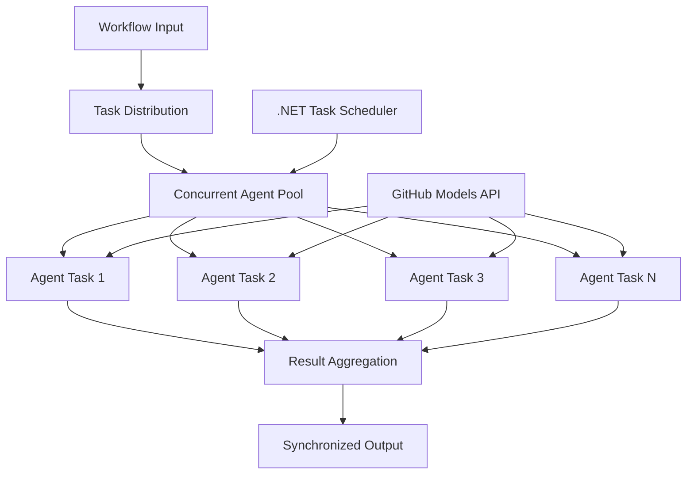

<!--
CO_OP_TRANSLATOR_METADATA:
{
  "original_hash": "b9c6e32c9b5f2fed20b6916984440d88",
  "translation_date": "2025-11-11T13:25:35+00:00",
  "source_file": "08-multi-agent/code_samples/workflows-agent-framework/dotNET/03.dotnet-agent-framework-workflow-ghmodel-concurrent.md",
  "language_code": "id"
}
-->
# ⚡ Alur Kerja Agen Konkuren dengan Model GitHub (.NET)

## 📋 Tutorial Pemrosesan Paralel Berperforma Tinggi

Notebook ini menunjukkan **pola alur kerja konkuren** menggunakan Microsoft Agent Framework untuk .NET dan Model GitHub. Anda akan belajar cara membangun alur kerja pemrosesan paralel berperforma tinggi yang memaksimalkan throughput dengan menjalankan beberapa agen AI secara bersamaan sambil menjaga koordinasi dan konsistensi data.

## 🎯 Tujuan Pembelajaran

### 🚀 **Dasar-Dasar Pemrosesan Konkuren**
- **Eksekusi Agen Paralel**: Jalankan beberapa agen AI secara bersamaan untuk kinerja maksimal
- **Pola Async/Await**: Manfaatkan model pemrograman async .NET untuk efisiensi konkuren
- **Integrasi Model GitHub**: Koordinasikan beberapa panggilan konkuren ke layanan inferensi model AI GitHub
- **Manajemen Sumber Daya**: Kelola sumber daya model AI secara efisien di seluruh operasi konkuren

### 🏗️ **Arsitektur Konkuren Lanjutan**
- **Paralelisme Berbasis Tugas**: Gunakan Task Parallel Library .NET untuk eksekusi konkuren yang optimal
- **Pola Sinkronisasi**: Koordinasikan agen konkuren sambil menghindari kondisi balapan
- **Pembagian Beban Kerja**: Distribusikan pekerjaan secara efisien di seluruh kapasitas pemrosesan konkuren yang tersedia
- **Toleransi Kesalahan**: Tangani kegagalan agen individu tanpa menghentikan seluruh alur kerja

### 🏢 **Aplikasi Konkuren untuk Perusahaan**
- **Pemrosesan Dokumen Volume Tinggi**: Proses beberapa dokumen secara bersamaan
- **Analisis Konten Real-Time**: Analisis konkuren aliran data yang masuk
- **Optimasi Pemrosesan Batch**: Maksimalkan throughput untuk operasi pemrosesan data skala besar
- **Analisis Multi-Modal**: Pemrosesan paralel berbagai jenis dan format konten

## ⚙️ Prasyarat & Pengaturan

### 📦 **Paket NuGet yang Dibutuhkan**

Paket penting untuk alur kerja konkuren berperforma tinggi:

```xml
<!-- Core AI Framework with Async Support -->
<PackageReference Include="Microsoft.Extensions.AI" Version="9.9.0" />

<!-- Client Model Abstractions for API Communication -->
<PackageReference Include="System.ClientModel" Version="1.6.1.0" />

<!-- Azure Identity and Async LINQ for Advanced Operations -->
<PackageReference Include="Azure.Identity" Version="1.15.0" />
<PackageReference Include="System.Linq.Async" Version="6.0.3" />

<!-- Local Agent Framework References -->
<!-- Microsoft.Agents.AI.dll - Core agent abstractions with async support -->
<!-- Microsoft.Agents.AI.OpenAI.dll - GitHub Models integration with concurrency -->
```

### 🔑 **Konfigurasi Model GitHub**

**Pengaturan Lingkungan (.env file):**
```env
GITHUB_TOKEN=your_github_personal_access_token
GITHUB_ENDPOINT=https://models.inference.ai.azure.com
GITHUB_MODEL_ID=gpt-4o-mini
```

**Pertimbangan Pemrosesan Konkuren:**
```csharp
// Configure for concurrent operations
var clientOptions = new OpenAIClientOptions()
{
    Endpoint = new Uri(githubEndpoint),
    // Configure connection pooling for concurrent requests
    NetworkTimeout = TimeSpan.FromMinutes(5)
};
```

### 🏗️ **Arsitektur Alur Kerja Konkuren**



**Komponen Utama:**
- **Task Parallel Library**: Dukungan bawaan .NET untuk operasi konkuren
- **Agent Pool**: Beberapa instance agen untuk pemrosesan paralel
- **Penggabungan Hasil**: Koordinasi dan penggabungan hasil agen konkuren
- **Titik Sinkronisasi**: Pastikan konsistensi data di seluruh operasi konkuren

## 🎨 **Pola Desain Alur Kerja Konkuren**

### 🔍 **Penelitian & Analisis Paralel**
```
Research Topic → Concurrent Research Agents → Result Synthesis → Final Report
```

### 📊 **Pemrosesan Data Multi-Sumber**
```
Data Sources → Parallel Processing Agents → Data Integration → Unified Output
```

### 🎭 **Pipeline Pembuatan Konten**
```
Content Requirements → Concurrent Content Generators → Quality Review → Final Content
```

### 🔄 **Pemrosesan Fan-Out/Fan-In**
```
Single Input → Multiple Concurrent Processors → Result Aggregation → Single Output
```

## 🏢 **Manfaat Performa untuk Perusahaan**

### ⚡ **Throughput & Skalabilitas**
- **Skalabilitas Performa Linear**: Tambahkan lebih banyak agen konkuren untuk meningkatkan throughput
- **Pemanfaatan Sumber Daya**: Efisiensi maksimal kapasitas model AI yang tersedia
- **Pengurangan Waktu Pemrosesan**: Pengurangan waktu signifikan melalui eksekusi paralel
- **Skalabilitas Elastis**: Sesuaikan jumlah agen konkuren secara dinamis berdasarkan beban kerja

### 🛡️ **Keandalan & Ketahanan**
- **Isolasi Kesalahan**: Kegagalan agen individu tidak memengaruhi operasi konkuren lainnya
- **Degradasi yang Lancar**: Sistem tetap beroperasi dengan kapasitas agen yang berkurang
- **Pemulihan Kesalahan**: Mekanisme retry otomatis untuk operasi konkuren yang gagal
- **Distribusi Beban Kerja**: Distribusi pekerjaan yang merata di seluruh agen yang tersedia

### 📊 **Pemantauan Performa**
- **Metrik Eksekusi Konkuren**: Lacak performa semua operasi paralel
- **Analitik Penggunaan Sumber Daya**: Pantau penggunaan CPU, memori, dan jaringan
- **Analisis Throughput**: Ukur efisiensi yang diperoleh dari pemrosesan konkuren
- **Deteksi Bottleneck**: Identifikasi dan atasi kendala performa

### 🔧 **Pengembangan & Operasi**
- **Model Pemrograman Async**: Manfaatkan pola async/await .NET yang matang
- **Koordinasi Tugas**: Kemampuan manajemen dan koordinasi tugas bawaan
- **Penanganan Pengecualian**: Penanganan kesalahan yang komprehensif untuk operasi konkuren
- **Dukungan Debugging**: Alat debugging Visual Studio untuk alur kerja konkuren

Mari kita bangun alur kerja AI konkuren berperforma tinggi dengan .NET! 🚀

## 💻 Menjalankan Kode

Implementasi lengkap tersedia di `03.dotnet-agent-framework-workflow-ghmodel-concurrent.cs`. File ini menunjukkan **alur kerja konkuren Fan-Out/Fan-In** untuk perencanaan perjalanan:

### 🏗️ **Arsitektur Alur Kerja**

```
User Request → ConcurrentStartExecutor → [Researcher Agent || Planner Agent] → ConcurrentAggregationExecutor → Final Output
```

**Komponen Utama:**

1. **ConcurrentStartExecutor**: Menyiarkan permintaan pengguna ke semua agen secara bersamaan
2. **Researcher Agent**: Menganalisis destinasi dan atraksi secara konkuren
3. **Planner Agent**: Membuat rencana perjalanan secara rinci secara konkuren
4. **ConcurrentAggregationExecutor**: Mengumpulkan dan menggabungkan hasil dari kedua agen

### 🎯 **Pola Fan-Out/Fan-In**

Alur kerja ini menunjukkan pola klasik **Fan-Out/Fan-In**:
- **Fan-Out**: Satu pesan input disiarkan ke beberapa agen secara bersamaan
- **Pemrosesan Konkuren**: Beberapa agen bekerja secara paralel pada tugas yang sama
- **Fan-In**: Hasil dari semua agen dikumpulkan dan digabungkan menjadi satu output

### 🚀 Menjalankan Contoh

```bash
# Make the script executable (Unix/Linux/macOS)
chmod +x 03.dotnet-agent-framework-workflow-ghmodel-concurrent.cs

# Run the concurrent workflow
./03.dotnet-agent-framework-workflow-ghmodel-concurrent.cs
```

Atau di Windows:
```powershell
dotnet run 03.dotnet-agent-framework-workflow-ghmodel-concurrent.cs
```

### 📝 Output yang Diharapkan

Alur kerja akan:
1. **Menyiarkan Permintaan**: Kirim "Rencanakan perjalanan ke Seattle pada bulan Desember" ke kedua agen
2. **Pemrosesan Konkuren**: Kedua agen bekerja secara bersamaan:
   - Peneliti mengidentifikasi atraksi dan detail
   - Perencana membuat itinerary dan logistik
3. **Penggabungan**: Gabungkan kedua respons menjadi output yang komprehensif
4. **Tampilkan Hasil**: Tampilkan rencana perjalanan gabungan dengan semua informasi

### 🔧 Opsi Kustomisasi

**Tambahkan Lebih Banyak Agen Konkuren:**
```csharp
// Create additional specialized agents
AIAgent budgetAgent = openAIClient.GetChatClient(github_model_id).CreateAIAgent(
    name: "Budget-Agent", instructions: "Calculate travel costs...");

// Add to fan-out
var workflow = new WorkflowBuilder(startExecutor)
    .AddFanOutEdge(startExecutor, targets: [researcherAgent, plannerAgent, budgetAgent])
    .AddFanInEdge(aggregationExecutor, sources: [researcherAgent, plannerAgent, budgetAgent])
    .WithOutputFrom(aggregationExecutor)
    .Build();

// Update aggregation count
if (this._messages.Count == 3) { ... }
```

**Modifikasi Instruksi Agen:**
```csharp
const string ResearcherAgentInstructions = "Your custom instructions for research...";
const string PlanAgentInstructions = "Your custom instructions for planning...";
```

**Ubah Tugas:**
```csharp
StreamingRun run = await InProcessExecution.StreamAsync(
    workflow, 
    "Plan a European vacation for 2 weeks in summer"
);
```

### 🎯 Aplikasi Dunia Nyata

Pola konkuren ini ideal untuk:
- **Pembuatan Konten**: Beberapa penulis membuat bagian yang berbeda secara bersamaan
- **Review Kode**: Beberapa reviewer menganalisis kode dari perspektif yang berbeda
- **Riset Pasar**: Analisis paralel segmen pasar yang berbeda
- **Pemrosesan Dokumen**: Ekstraksi, analisis, dan validasi secara konkuren
- **Analisis Multi-Perspektif**: Mendapatkan pandangan beragam pada input yang sama

### 🔍 Memahami Executor Kustom

**ConcurrentStartExecutor:**
- Mengimplementasikan `IMessageHandler<string>` untuk menerima input string
- Menyiarkan pesan ke semua agen yang terhubung
- Mengirimkan `TurnToken` untuk memicu pemrosesan konkuren

**ConcurrentAggregationExecutor:**
- Mengimplementasikan `IMessageHandler<ChatMessage>` untuk menerima respons agen
- Mengumpulkan pesan secara thread-safe
- Menggabungkan saat semua respons yang diharapkan tiba
- Memberikan output akhir menggunakan `context.YieldOutputAsync()`

### ⚡ Manfaat Performa

**Konkuren vs Sekuensial:**
- Sekuensial: Agen1 (30s) → Agen2 (30s) = **60 detik total**
- Konkuren: Agen1 (30s) || Agen2 (30s) = **30 detik total**

**Peningkatan Throughput**: Hingga N× lebih cepat untuk N agen konkuren (tergantung pada beban kerja dan sumber daya)

### 🛡️ Penanganan Kesalahan

Alur kerja menangani kegagalan agen individu dengan lancar:
- Jika satu agen gagal, agen lainnya tetap melanjutkan pemrosesan
- Aggregator dapat menerapkan logika timeout
- Hasil parsial dapat dikembalikan jika diperlukan

### 📊 Fitur Lanjutan

**Jumlah Agen Dinamis:**
Modifikasi logika penggabungan untuk mendukung jumlah agen yang bervariasi:

```csharp
private int _expectedAgentCount;
private readonly List<ChatMessage> _messages = [];

public async ValueTask HandleAsync(ChatMessage message, IWorkflowContext context)
{
    this._messages.Add(message);
    if (this._messages.Count == _expectedAgentCount)
    {
        // Process aggregation
    }
}
```

Pola alur kerja konkuren ini sangat penting untuk membangun sistem agen AI yang berperforma tinggi dan skalabel!

---

<!-- CO-OP TRANSLATOR DISCLAIMER START -->
**Penafian**:  
Dokumen ini telah diterjemahkan menggunakan layanan penerjemahan AI [Co-op Translator](https://github.com/Azure/co-op-translator). Meskipun kami berupaya untuk memberikan hasil yang akurat, harap diketahui bahwa terjemahan otomatis mungkin mengandung kesalahan atau ketidakakuratan. Dokumen asli dalam bahasa aslinya harus dianggap sebagai sumber yang otoritatif. Untuk informasi yang penting, disarankan menggunakan jasa penerjemahan manusia profesional. Kami tidak bertanggung jawab atas kesalahpahaman atau interpretasi yang keliru yang timbul dari penggunaan terjemahan ini.
<!-- CO-OP TRANSLATOR DISCLAIMER END -->