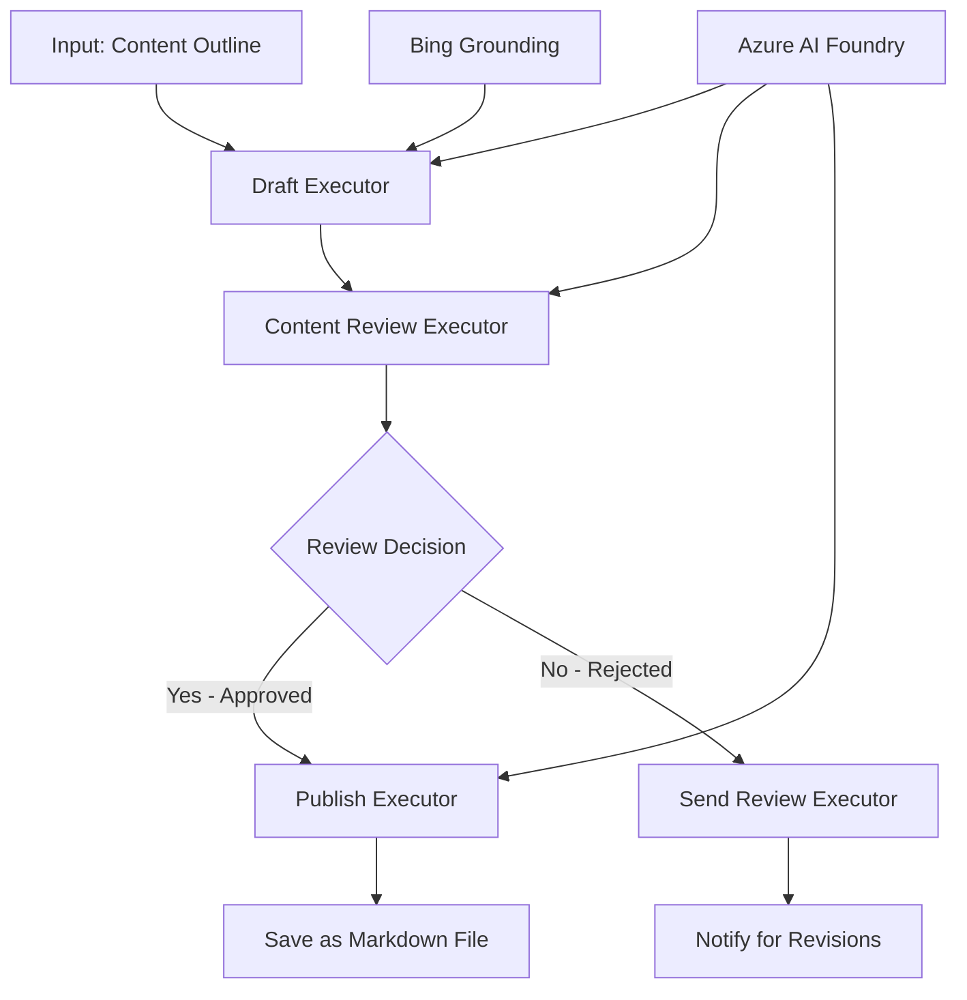

<!--
CO_OP_TRANSLATOR_METADATA:
{
  "original_hash": "8abd335151cee553293b637ee3d80d10",
  "translation_date": "2025-11-11T12:23:40+00:00",
  "source_file": "08-multi-agent/code_samples/workflows-agent-framework/dotNET/04.dotnet-agent-framework-workflow-aifoundry-condition.md",
  "language_code": "id"
}
-->
# 🔀 Alur Kerja Agen Bersyarat dengan Azure AI Foundry (.NET)

## 📋 Tutorial Alur Kerja Berbasis Keputusan Cerdas

Notebook ini menunjukkan **pola alur kerja bersyarat** menggunakan Azure AI Foundry dan Microsoft Agent Framework untuk .NET. Anda akan belajar cara membangun alur kerja canggih yang digerakkan oleh keputusan, yang secara cerdas mengarahkan pemrosesan berdasarkan analisis AI, aturan bisnis, dan kondisi dinamis untuk otomatisasi tingkat perusahaan.

## 🎯 Tujuan Pembelajaran

### 🧠 **Arsitektur Keputusan Cerdas**
- **Implementasi Logika Bersyarat**: Bangun pohon keputusan kompleks dengan banyak titik percabangan
- **Pengarahan Berbasis AI**: Gunakan model Azure AI Foundry untuk membuat keputusan pengarahan yang cerdas
- **Adaptasi Alur Kerja Dinamis**: Modifikasi perilaku alur kerja berdasarkan analisis dan kondisi runtime
- **Integrasi Aturan Perusahaan**: Gabungkan logika bisnis dan persyaratan kepatuhan ke dalam alur kerja

### 🔀 **Pola Bersyarat Lanjutan**
- **Pengambilan Keputusan Multi-Kriteria**: Evaluasi beberapa faktor untuk keputusan pengarahan
- **Pemrosesan Konteksual**: Buat keputusan berdasarkan konteks dan riwayat alur kerja yang terakumulasi
- **Modifikasi Alur Kerja Adaptif**: Sesuaikan jalur pemrosesan secara dinamis berdasarkan kondisi waktu nyata
- **Integrasi Mesin Aturan**: Terapkan mesin aturan bisnis canggih dalam alur kerja

### 🏢 **Aplikasi Bersyarat Perusahaan**
- **Klasifikasi & Pengarahan Dokumen**: Secara otomatis mengklasifikasikan dan mengarahkan dokumen ke alur kerja yang sesuai
- **Triage Layanan Pelanggan**: Pengarahan cerdas pertanyaan pelanggan ke tim penanganan khusus
- **Pemrosesan Kepatuhan & Risiko**: Terapkan proses validasi dan tinjauan yang berbeda berdasarkan penilaian risiko
- **Alur Kerja Penjaminan Kualitas**: Arahkan konten melalui proses tinjauan yang sesuai berdasarkan metrik kualitas

## ⚙️ Prasyarat & Pengaturan

### 📦 **Paket NuGet yang Dibutuhkan**

Paket lanjutan untuk pemrosesan alur kerja bersyarat:

```xml
<!-- Core AI Framework -->
<PackageReference Include="Microsoft.Extensions.AI" Version="9.9.0" />

<!-- Azure AI Agents with Persistent State -->
<PackageReference Include="Azure.AI.Agents.Persistent" Version="1.2.0-beta.5" />

<!-- Azure Identity and Utilities -->
<PackageReference Include="Azure.Identity" Version="1.15.0" />
<PackageReference Include="System.Linq.Async" Version="6.0.3" />
<PackageReference Include="DotNetEnv" Version="3.1.1" />

<!-- Local Workflow Framework References -->
<!-- Microsoft.Agents.Workflows.dll - Advanced workflow orchestration -->
<!-- Microsoft.Agents.AI.AzureAI.dll - Azure AI Foundry integration -->
<!-- Microsoft.Agents.AI.dll - Core agent abstractions -->
```

### 🔑 **Konfigurasi Azure AI Foundry**

**Sumber Daya Azure yang Dibutuhkan:**
- Workspace Azure AI Foundry dengan model pemrosesan bersyarat
- Langganan Azure dengan kuota komputasi dan izin yang sesuai
- Model AI yang telah diterapkan untuk pengambilan keputusan dan analisis konten
- (Opsional) Koneksi Bing Search API untuk kemampuan grounding

**Konfigurasi Lingkungan (.env file):**
```env
# Azure AI Foundry Configuration
AZURE_AI_PROJECT_ENDPOINT=https://your-project.cognitiveservices.azure.com/
BING_CONNECTION_ID=your-bing-connection-id
```

**Pengaturan Autentikasi:**
```csharp
// Azure CLI or Managed Identity authentication
using Azure.Identity;
var credential = new AzureCliCredential();

// Load environment configuration
DotNetEnv.Env.Load("../../../.env");
```

### 🏗️ **Arsitektur Alur Kerja Bersyarat**



**Komponen Utama:**
- **Draft Executor**: Agen AI yang membuat draf konten awal dari kerangka
- **Content Review Executor**: Agen AI yang mengevaluasi kualitas dan kepatuhan draf
- **Conditional Routing**: Logika keputusan yang mengarahkan berdasarkan hasil tinjauan
- **Jalur Publikasi/Tinjauan**: Jalur pemrosesan terpisah untuk konten yang disetujui vs ditolak
- **Manajemen Status**: Memelihara konteks konten dan tinjauan sepanjang alur kerja

## 🎨 **Pola Desain Alur Kerja Bersyarat**

### 📋 **Produksi Konten dengan Gerbang Kualitas**
```
Outline → Draft Creation → Quality Review → {Approve: Publish | Reject: Revise}
```

### 🎯 **Pemrosesan Dokumen Berbasis Risiko**
```
Document → Risk Assessment → {Low: Standard | High: Enhanced Review}
```

### 🔍 **Pengarahan Layanan Pelanggan Cerdas**
```
Customer Query → Analysis → {Simple: FAQ Bot | Complex: Human Agent}
```

### 💼 **Alur Kerja Berbasis Kepatuhan**
```
Content → Compliance Check → {Pass: Publish | Fail: Legal Review}
```

## 🏢 **Manfaat Bersyarat Perusahaan**

### 🎯 **Otomasi Cerdas**
- **Pengambilan Keputusan Cerdas**: Keputusan pengarahan berbasis AI berdasarkan analisis konten dan konteks
- **Pemrosesan Adaptif**: Alur kerja yang secara otomatis menyesuaikan berdasarkan kondisi yang berubah
- **Penegakan Aturan Bisnis**: Penerapan otomatis logika bisnis dan kebijakan yang kompleks
- **Pengarahan Berbasis Konteks**: Keputusan berdasarkan riwayat alur kerja penuh dan konteks yang terakumulasi

### 📈 **Keunggulan Operasional**
- **Alokasi Sumber Daya yang Dioptimalkan**: Arahkan pekerjaan ke spesialis dan proses yang paling sesuai
- **Pengurangan Intervensi Manual**: Pengambilan keputusan otomatis meminimalkan kebutuhan pengarahan manusia
- **Waktu Penyelesaian Lebih Cepat**: Pengarahan langsung ke keahlian dan kemampuan pemrosesan yang sesuai
- **Penerapan Konsisten**: Penerapan seragam aturan bisnis dan kriteria keputusan

### 🛡️ **Manajemen Risiko & Kepatuhan**
- **Penilaian Risiko Otomatis**: Evaluasi berbasis AI terhadap konten dan tingkat risiko situasi
- **Penegakan Kepatuhan**: Pengarahan otomatis melalui proses regulasi yang diperlukan
- **Penerapan Protokol Keamanan**: Langkah-langkah keamanan yang ditingkatkan diterapkan berdasarkan penilaian risiko
- **Pemeliharaan Jejak Audit**: Dokumentasi lengkap keputusan pengarahan dan alasan

### 📊 **Analitik & Peningkatan Berkelanjutan**
- **Analitik Keputusan**: Lacak efektivitas dan akurasi keputusan pengarahan
- **Pengenalan Pola**: Identifikasi tren dan pola dalam keputusan pengarahan dari waktu ke waktu
- **Optimasi Kinerja**: Peningkatan berkelanjutan kriteria keputusan dan efisiensi pengarahan
- **Intelijen Bisnis**: Wawasan tentang karakteristik konten dan kebutuhan pemrosesan

### 🔧 **Keunggulan Teknis**
- **Manajemen Status Persisten**: Memelihara status kompleks selama eksekusi alur kerja
- **Arsitektur yang Dapat Diskalakan**: Menangani kebutuhan pemrosesan bersyarat volume tinggi
- **Kemampuan Integrasi**: Integrasi mulus dengan sistem dan proses bisnis yang ada
- **Pemantauan & Observabilitas**: Pelacakan komprehensif kinerja alur kerja dan keputusan

Mari kita bangun alur kerja perusahaan yang cerdas dan digerakkan oleh keputusan dengan .NET! 🚀

## 💻 Menjalankan Kode

Implementasi lengkap tersedia di `04.dotnet-agent-framework-workflow-aifoundry-condition.cs`. Ini menunjukkan **alur kerja produksi konten dengan gerbang kualitas**:

### 🏗️ **Arsitektur Alur Kerja**

```
Content Outline → Draft Creation → Quality Review → Conditional Routing:
                                                      ├─ Approved (>200 words) → Publish
                                                      └─ Rejected (<200 words) → Review Notification
```

**Agen dalam Alur Kerja:**
1. **Evangelist Agent**: Membuat draf tutorial dari kerangka dengan Bing grounding
2. **Content Reviewer Agent**: Mengevaluasi kualitas draf (jumlah kata, kelengkapan)
3. **Publisher Agent**: Menyimpan konten yang disetujui sebagai file Markdown dengan stempel waktu

**Eksekutor Kustom:**
1. **DraftExecutor**: Mengatur pembuatan draf
2. **ContentReviewExecutor**: Melakukan penilaian kualitas
3. **PublishExecutor**: Menangani publikasi konten yang disetujui
4. **SendReviewExecutor**: Mengelola notifikasi konten yang ditolak

### 🚀 Menjalankan Contoh

**Prasyarat:**
- Workspace Azure AI Foundry yang dikonfigurasi
- Autentikasi Azure CLI (`az login`)
- (Opsional) Koneksi Bing Search untuk grounding

```bash
# Make the script executable (Unix/Linux/macOS)
chmod +x 04.dotnet-agent-framework-workflow-aifoundry-condition.cs

# Run the conditional workflow
./04.dotnet-agent-framework-workflow-aifoundry-condition.cs
```

Atau di Windows:
```powershell
dotnet run 04.dotnet-agent-framework-workflow-aifoundry-condition.cs
```

### 📝 Output yang Diharapkan

Alur kerja akan:
1. **Membuat Agen**: Menginisialisasi tiga agen Azure AI Foundry khusus
2. **Menghasilkan Draf**: Agen Evangelist membuat draf tutorial dari kerangka
3. **Meninjau Konten**: Content Reviewer mengevaluasi kualitas draf
4. **Pengarahan Bersyarat**:
   - **Jika disetujui (>200 kata)**: Publish executor menyimpan sebagai file Markdown
   - **Jika ditolak (<200 kata)**: Kirim notifikasi tinjauan
5. **Menampilkan Hasil**: Menunjukkan hasil akhir alur kerja

### 🔧 Opsi Kustomisasi

**Modifikasi Kriteria Tinjauan:**
```csharp
const string ContentReviewerInstructions = @"
You are a content reviewer...
1. Check if content is more than 500 words (instead of 200)
2. Verify technical accuracy
3. Ensure proper formatting
...";
```

**Tambahkan Jalur Bersyarat Lainnya:**
```csharp
var workflow = new WorkflowBuilder(draftExecutor)
    .AddEdge(draftExecutor, contentReviewerExecutor)
    .AddEdge(contentReviewerExecutor, publishExecutor, condition: GetCondition("Excellent"))
    .AddEdge(contentReviewerExecutor, editExecutor, condition: GetCondition("Good"))
    .AddEdge(contentReviewerExecutor, sendReviewerExecutor, condition: GetCondition("Poor"))
    .Build();
```

**Ubah Persyaratan Konten:**
```csharp
string OUTLINE_Content = @"
# Your Custom Topic
## Section 1
https://your-reference-url
## Section 2
...
";
```

### 🎯 Aplikasi Dunia Nyata

Pola alur kerja bersyarat ini sangat ideal untuk:
- **Sistem Manajemen Konten**: Alur kerja editorial otomatis dengan gerbang kualitas
- **Pemrosesan Dokumen**: Mengarahkan dokumen berdasarkan klasifikasi dan kepatuhan
- **Dukungan Pelanggan**: Pengarahan tiket cerdas berdasarkan kompleksitas dan urgensi
- **Tinjauan Hukum**: Mengarahkan kontrak berdasarkan penilaian risiko dan nilai
- **Proses HR**: Mengarahkan aplikasi melalui alur kerja penyaringan yang sesuai

### 🔍 Memahami Logika Bersyarat

**Fungsi Kondisi:**
```csharp
public Func<object?, bool> GetCondition(string expectedResult) =>
    reviewResult => reviewResult is ReviewResult review && review.Result == expectedResult;
```

Fungsi ini membuat predikat yang:
1. Memeriksa apakah hasil bertipe `ReviewResult`
2. Membandingkan properti `Result` dengan nilai yang diharapkan
3. Mengembalikan true/false untuk menentukan pengarahan

**Tepi Alur Kerja dengan Kondisi:**
```csharp
.AddEdge(contentReviewerExecutor, publishExecutor, condition: GetCondition("Yes"))
.AddEdge(contentReviewerExecutor, sendReviewerExecutor, condition: GetCondition("No"))
```

### 📊 Fitur Lanjutan

**Validasi Skema JSON:**
Alur kerja menggunakan skema JSON untuk memastikan respons terstruktur:

```csharp
// Define response structure
public class ReviewResult
{
    [JsonPropertyName("review_result")]
    public string Result { get; set; } = string.Empty;
    
    [JsonPropertyName("reason")]
    public string Reason { get; set; } = string.Empty;
    
    [JsonPropertyName("draft_content")]
    public string DraftContent { get; set; } = string.Empty;
}

// Apply to agent
ResponseFormat = ChatResponseFormat.ForJsonSchema(
    AIJsonUtilities.CreateJsonSchema(typeof(ReviewResult)), 
    "ReviewResult", 
    "Review Result From DraftContent"
)
```

**Integrasi Bing Grounding:**
Agen Evangelist menggunakan Bing grounding untuk mengakses informasi waktu nyata:

```csharp
var bingGroundingConfig = new BingGroundingSearchConfiguration(bing_conn_id);
BingGroundingToolDefinition bingGroundingTool = new(
    new BingGroundingSearchToolParameters([bingGroundingConfig])
);
```

Ini memungkinkan agen mengikuti URL dalam kerangka dan mengekstrak informasi terkini.

### 🛡️ Penanganan Kesalahan

Alur kerja mencakup penanganan kesalahan yang kuat untuk konten yang ditolak:
- Kegagalan tinjauan memicu jalur alternatif
- Notifikasi memberikan alasan penolakan yang jelas
- Konten dipertahankan untuk revisi

### 🔄 Memperluas Alur Kerja

**Tambahkan Loop Revisi:**
Buat loop umpan balik yang secara otomatis membuat ulang draf konten:

```csharp
.AddEdge(contentReviewerExecutor, publishExecutor, condition: GetCondition("Yes"))
.AddEdge(contentReviewerExecutor, draftExecutor, condition: GetCondition("No")) // Loop back
```

**Terapkan Tinjauan Multi-Tingkat:**
Tambahkan beberapa tahap tinjauan dengan kriteria yang berbeda:

```csharp
.AddEdge(draftExecutor, technicalReviewer)
.AddEdge(technicalReviewer, editorialReviewer, condition: GetCondition("TechPass"))
.AddEdge(editorialReviewer, publishExecutor, condition: GetCondition("EditPass"))
```

Pola alur kerja bersyarat ini menyediakan dasar untuk membangun sistem otomatisasi perusahaan yang canggih dan cerdas! 🚀

---

<!-- CO-OP TRANSLATOR DISCLAIMER START -->
**Penafian**:  
Dokumen ini telah diterjemahkan menggunakan layanan penerjemahan AI [Co-op Translator](https://github.com/Azure/co-op-translator). Meskipun kami berupaya untuk memberikan hasil yang akurat, harap diketahui bahwa terjemahan otomatis mungkin mengandung kesalahan atau ketidakakuratan. Dokumen asli dalam bahasa aslinya harus dianggap sebagai sumber yang otoritatif. Untuk informasi yang penting, disarankan menggunakan jasa penerjemahan manusia profesional. Kami tidak bertanggung jawab atas kesalahpahaman atau interpretasi yang salah yang timbul dari penggunaan terjemahan ini.
<!-- CO-OP TRANSLATOR DISCLAIMER END -->