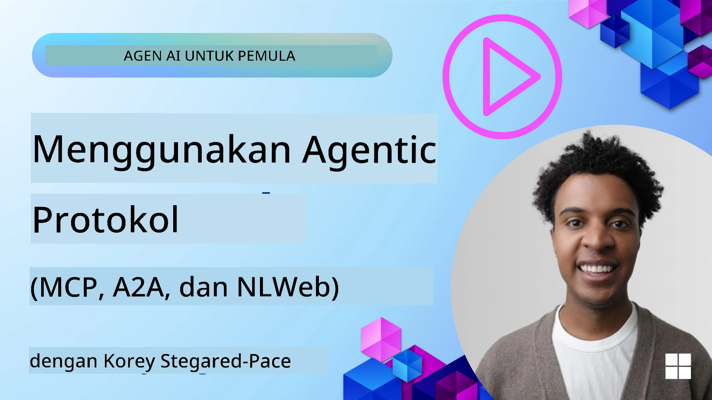
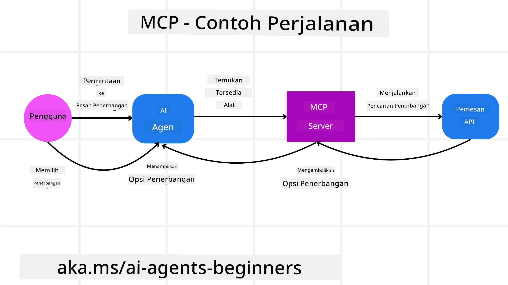
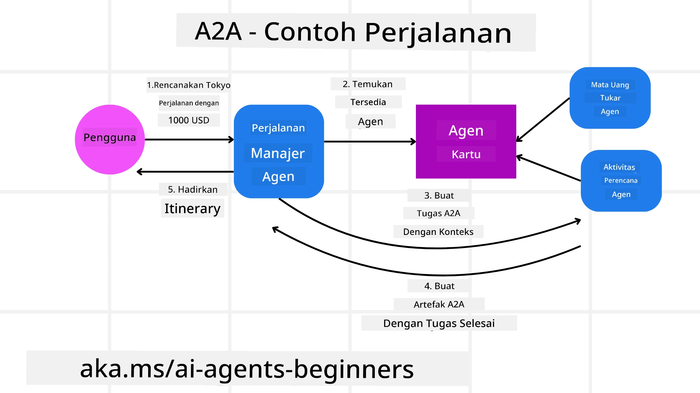
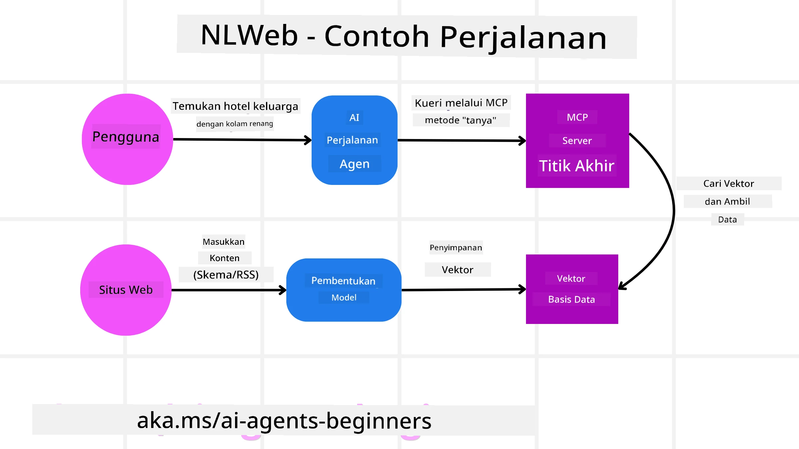

<!--
CO_OP_TRANSLATOR_METADATA:
{
  "original_hash": "aff92c6f019b4627ca9399c6e3882e17",
  "translation_date": "2025-09-18T15:17:47+00:00",
  "source_file": "11-agentic-protocols/README.md",
  "language_code": "id"
}
-->
# Menggunakan Protokol Agen (MCP, A2A, dan NLWeb)

> _(Klik gambar di atas untuk menonton video pelajaran ini)_

Seiring dengan meningkatnya penggunaan agen AI, kebutuhan akan protokol yang memastikan standarisasi, keamanan, dan mendukung inovasi terbuka juga semakin besar. Dalam pelajaran ini, kita akan membahas 3 protokol yang dirancang untuk memenuhi kebutuhan tersebut - Model Context Protocol (MCP), Agent to Agent (A2A), dan Natural Language Web (NLWeb).

## Pendahuluan

Dalam pelajaran ini, kita akan membahas:

• Bagaimana **MCP** memungkinkan Agen AI mengakses alat dan data eksternal untuk menyelesaikan tugas pengguna.

• Bagaimana **A2A** memungkinkan komunikasi dan kolaborasi antara berbagai agen AI.

• Bagaimana **NLWeb** menghadirkan antarmuka bahasa alami ke situs web mana pun, memungkinkan Agen AI untuk menemukan dan berinteraksi dengan konten.

## Tujuan Pembelajaran

• **Mengidentifikasi** tujuan utama dan manfaat MCP, A2A, dan NLWeb dalam konteks agen AI.

• **Menjelaskan** bagaimana setiap protokol memfasilitasi komunikasi dan interaksi antara LLM, alat, dan agen lainnya.

• **Mengenali** peran unik masing-masing protokol dalam membangun sistem agen yang kompleks.

## Model Context Protocol

**Model Context Protocol (MCP)** adalah standar terbuka yang menyediakan cara terstandar bagi aplikasi untuk memberikan konteks dan alat kepada LLM. Ini memungkinkan "adaptor universal" untuk berbagai sumber data dan alat yang dapat dihubungkan oleh Agen AI dengan cara yang konsisten.

Mari kita lihat komponen MCP, manfaat dibandingkan penggunaan API langsung, dan contoh bagaimana agen AI dapat menggunakan server MCP.

### Komponen Inti MCP

MCP beroperasi pada **arsitektur client-server** dan komponen intinya adalah:

• **Host** adalah aplikasi LLM (misalnya editor kode seperti VSCode) yang memulai koneksi ke server MCP.

• **Client** adalah komponen dalam aplikasi host yang mempertahankan koneksi satu-ke-satu dengan server.

• **Server** adalah program ringan yang menyediakan kemampuan tertentu.

Protokol ini mencakup tiga primitif inti yang merupakan kemampuan server MCP:

• **Tools**: Ini adalah tindakan atau fungsi diskret yang dapat dipanggil oleh agen AI untuk melakukan suatu tindakan. Misalnya, layanan cuaca mungkin menyediakan alat "get weather", atau server e-commerce mungkin menyediakan alat "purchase product". Server MCP mengiklankan nama, deskripsi, dan skema input/output setiap alat dalam daftar kemampuannya.

• **Resources**: Ini adalah item data atau dokumen yang hanya dapat dibaca yang dapat disediakan oleh server MCP, dan client dapat mengambilnya sesuai permintaan. Contohnya termasuk isi file, catatan database, atau file log. Resources dapat berupa teks (seperti kode atau JSON) atau biner (seperti gambar atau PDF).

• **Prompts**: Ini adalah template yang telah ditentukan sebelumnya yang memberikan saran prompt, memungkinkan alur kerja yang lebih kompleks.

### Manfaat MCP

MCP menawarkan keuntungan signifikan bagi Agen AI:

• **Penemuan Alat Dinamis**: Agen dapat menerima daftar alat yang tersedia dari server secara dinamis beserta deskripsi tentang apa yang mereka lakukan. Ini berbeda dengan API tradisional, yang sering kali memerlukan pengkodean statis untuk integrasi, sehingga setiap perubahan API memerlukan pembaruan kode. MCP menawarkan pendekatan "integrasi sekali", yang menghasilkan adaptabilitas yang lebih besar.

• **Interoperabilitas Antar LLM**: MCP bekerja di berbagai LLM, memberikan fleksibilitas untuk beralih model inti guna mengevaluasi kinerja yang lebih baik.

• **Keamanan Terstandar**: MCP mencakup metode autentikasi standar, meningkatkan skalabilitas saat menambahkan akses ke server MCP tambahan. Ini lebih sederhana dibandingkan dengan mengelola berbagai kunci dan jenis autentikasi untuk berbagai API tradisional.

### Contoh MCP

Bayangkan seorang pengguna ingin memesan penerbangan menggunakan asisten AI yang didukung oleh MCP.

1. **Koneksi**: Asisten AI (client MCP) terhubung ke server MCP yang disediakan oleh maskapai penerbangan.

2. **Penemuan Alat**: Client bertanya kepada server MCP maskapai, "Alat apa yang tersedia?" Server merespons dengan alat seperti "search flights" dan "book flights".

3. **Pemanggilan Alat**: Anda kemudian meminta asisten AI, "Tolong cari penerbangan dari Portland ke Honolulu." Asisten AI, menggunakan LLM-nya, mengidentifikasi bahwa ia perlu memanggil alat "search flights" dan meneruskan parameter yang relevan (asal, tujuan) ke server MCP.

4. **Eksekusi dan Respons**: Server MCP, yang bertindak sebagai pembungkus, melakukan panggilan sebenarnya ke API pemesanan internal maskapai. Server kemudian menerima informasi penerbangan (misalnya, data JSON) dan mengirimkannya kembali ke asisten AI.

5. **Interaksi Lanjutan**: Asisten AI menyajikan opsi penerbangan. Setelah Anda memilih penerbangan, asisten mungkin memanggil alat "book flight" di server MCP yang sama, menyelesaikan pemesanan.

## Protokol Agent-to-Agent (A2A)

Sementara MCP berfokus pada menghubungkan LLM ke alat, **Protokol Agent-to-Agent (A2A)** melangkah lebih jauh dengan memungkinkan komunikasi dan kolaborasi antara berbagai agen AI. A2A menghubungkan agen AI di berbagai organisasi, lingkungan, dan tumpukan teknologi untuk menyelesaikan tugas bersama.

Kita akan memeriksa komponen dan manfaat A2A, bersama dengan contoh bagaimana ini dapat diterapkan dalam aplikasi perjalanan kita.

### Komponen Inti A2A

A2A berfokus pada memungkinkan komunikasi antar agen dan membuat mereka bekerja sama untuk menyelesaikan subtugas pengguna. Setiap komponen protokol berkontribusi pada hal ini:

#### Kartu Agen

Mirip dengan bagaimana server MCP berbagi daftar alat, Kartu Agen memiliki:
- Nama Agen.
- **Deskripsi tugas umum** yang diselesaikan.
- **Daftar keterampilan spesifik** dengan deskripsi untuk membantu agen lain (atau bahkan pengguna manusia) memahami kapan dan mengapa mereka ingin memanggil agen tersebut.
- **URL Endpoint saat ini** dari agen.
- **Versi** dan **kemampuan** agen seperti respons streaming dan notifikasi push.

#### Eksekutor Agen

Eksekutor Agen bertanggung jawab untuk **meneruskan konteks obrolan pengguna ke agen jarak jauh**, agen jarak jauh membutuhkan ini untuk memahami tugas yang perlu diselesaikan. Dalam server A2A, agen menggunakan Model Bahasa Besar (LLM) miliknya untuk memproses permintaan masuk dan menjalankan tugas menggunakan alat internalnya sendiri.

#### Artefak

Setelah agen jarak jauh menyelesaikan tugas yang diminta, hasil kerjanya dibuat sebagai artefak. Artefak **berisi hasil kerja agen**, **deskripsi tentang apa yang telah diselesaikan**, dan **konteks teks** yang dikirim melalui protokol. Setelah artefak dikirim, koneksi dengan agen jarak jauh ditutup hingga diperlukan lagi.

#### Antrian Acara

Komponen ini digunakan untuk **menangani pembaruan dan meneruskan pesan**. Ini sangat penting dalam produksi untuk sistem agenik agar mencegah koneksi antar agen ditutup sebelum tugas selesai, terutama ketika waktu penyelesaian tugas bisa memakan waktu lebih lama.

### Manfaat A2A

• **Kolaborasi yang Ditingkatkan**: Memungkinkan agen dari vendor dan platform berbeda untuk berinteraksi, berbagi konteks, dan bekerja sama, memfasilitasi otomatisasi yang mulus di sistem yang sebelumnya terputus.

• **Fleksibilitas Pemilihan Model**: Setiap agen A2A dapat memutuskan LLM mana yang digunakan untuk melayani permintaannya, memungkinkan model yang dioptimalkan atau disesuaikan per agen, berbeda dengan koneksi LLM tunggal dalam beberapa skenario MCP.

• **Autentikasi Terintegrasi**: Autentikasi terintegrasi langsung ke dalam protokol A2A, menyediakan kerangka keamanan yang kuat untuk interaksi antar agen.

### Contoh A2A

Mari kita kembangkan skenario pemesanan perjalanan kita, tetapi kali ini menggunakan A2A.

1. **Permintaan Pengguna ke Multi-Agen**: Seorang pengguna berinteraksi dengan "Travel Agent" client/agen A2A, mungkin dengan mengatakan, "Tolong pesan perjalanan lengkap ke Honolulu minggu depan, termasuk penerbangan, hotel, dan mobil sewaan."

2. **Orkestrasi oleh Travel Agent**: Travel Agent menerima permintaan kompleks ini. Ia menggunakan LLM-nya untuk memikirkan tugas dan menentukan bahwa ia perlu berinteraksi dengan agen khusus lainnya.

3. **Komunikasi Antar Agen**: Travel Agent kemudian menggunakan protokol A2A untuk terhubung ke agen downstream, seperti "Airline Agent," "Hotel Agent," dan "Car Rental Agent" yang dibuat oleh perusahaan berbeda.

4. **Eksekusi Tugas yang Didelegasikan**: Travel Agent mengirimkan tugas spesifik ke agen khusus ini (misalnya, "Cari penerbangan ke Honolulu," "Pesan hotel," "Sewa mobil"). Masing-masing agen khusus ini, menjalankan LLM-nya sendiri dan menggunakan alatnya sendiri (yang bisa jadi server MCP sendiri), menyelesaikan bagian spesifik dari pemesanan.

5. **Respons Terpadu**: Setelah semua agen downstream menyelesaikan tugas mereka, Travel Agent mengompilasi hasilnya (detail penerbangan, konfirmasi hotel, pemesanan mobil sewaan) dan mengirimkan respons gaya obrolan yang komprehensif kembali ke pengguna.

## Natural Language Web (NLWeb)

Situs web telah lama menjadi cara utama bagi pengguna untuk mengakses informasi dan data di internet.

Mari kita lihat berbagai komponen NLWeb, manfaat NLWeb, dan contoh bagaimana NLWeb bekerja dengan melihat aplikasi perjalanan kita.

### Komponen NLWeb

- **Aplikasi NLWeb (Kode Layanan Inti)**: Sistem yang memproses pertanyaan bahasa alami. Ini menghubungkan berbagai bagian platform untuk membuat respons. Anda dapat menganggapnya sebagai **mesin yang menggerakkan fitur bahasa alami** dari sebuah situs web.

- **Protokol NLWeb**: Ini adalah **aturan dasar untuk interaksi bahasa alami** dengan situs web. Protokol ini mengirimkan respons dalam format JSON (sering menggunakan Schema.org). Tujuannya adalah menciptakan fondasi sederhana untuk “AI Web,” seperti halnya HTML memungkinkan berbagi dokumen secara online.

- **Server MCP (Endpoint Model Context Protocol)**: Setiap pengaturan NLWeb juga berfungsi sebagai **server MCP**. Ini berarti dapat **berbagi alat (seperti metode “ask”) dan data** dengan sistem AI lainnya. Dalam praktiknya, ini membuat konten dan kemampuan situs web dapat digunakan oleh agen AI, memungkinkan situs tersebut menjadi bagian dari ekosistem agen yang lebih luas.

- **Model Embedding**: Model ini digunakan untuk **mengonversi konten situs web menjadi representasi numerik yang disebut vektor** (embedding). Vektor ini menangkap makna dengan cara yang dapat dibandingkan dan dicari oleh komputer. Vektor ini disimpan dalam database khusus, dan pengguna dapat memilih model embedding yang ingin mereka gunakan.

- **Database Vektor (Mekanisme Pengambilan)**: Database ini **menyimpan embedding konten situs web**. Ketika seseorang mengajukan pertanyaan, NLWeb memeriksa database vektor untuk dengan cepat menemukan informasi yang paling relevan. Ini memberikan daftar jawaban yang cepat, diurutkan berdasarkan kesamaan. NLWeb bekerja dengan berbagai sistem penyimpanan vektor seperti Qdrant, Snowflake, Milvus, Azure AI Search, dan Elasticsearch.

### Contoh NLWeb

Pertimbangkan situs web pemesanan perjalanan kita lagi, tetapi kali ini didukung oleh NLWeb.

1. **Pengambilan Data**: Katalog produk yang ada di situs web perjalanan (misalnya, daftar penerbangan, deskripsi hotel, paket tur) diformat menggunakan Schema.org atau dimuat melalui umpan RSS. Alat NLWeb mengambil data terstruktur ini, membuat embedding, dan menyimpannya dalam database vektor lokal atau jarak jauh.

2. **Pertanyaan Bahasa Alami (Manusia)**: Seorang pengguna mengunjungi situs web dan, alih-alih menavigasi menu, mengetik di antarmuka obrolan: "Temukan hotel ramah keluarga di Honolulu dengan kolam renang untuk minggu depan".

3. **Pemrosesan NLWeb**: Aplikasi NLWeb menerima pertanyaan ini. Ia mengirimkan pertanyaan ke LLM untuk memahami dan secara bersamaan mencari database vektornya untuk daftar hotel yang relevan.

4. **Hasil Akurat**: LLM membantu menafsirkan hasil pencarian dari database, mengidentifikasi kecocokan terbaik berdasarkan kriteria "ramah keluarga," "kolam renang," dan "Honolulu," lalu memformat respons dalam bahasa alami. Yang terpenting, respons merujuk pada hotel yang sebenarnya dari katalog situs web, menghindari informasi yang dibuat-buat.

5. **Interaksi Agen AI**: Karena NLWeb berfungsi sebagai server MCP, agen perjalanan AI eksternal juga dapat terhubung ke instance NLWeb situs web ini. Agen AI tersebut dapat menggunakan metode `ask` MCP untuk langsung bertanya ke situs web: `ask("Apakah ada restoran ramah vegan di area Honolulu yang direkomendasikan oleh hotel?")`. Instance NLWeb akan memproses ini, memanfaatkan database informasinya (jika dimuat), dan mengembalikan respons JSON terstruktur.

### Ada Pertanyaan Lebih Lanjut tentang MCP/A2A/NLWeb?

Bergabunglah dengan [Azure AI Foundry Discord](https://aka.ms/ai-agents/discord) untuk bertemu dengan pelajar lainnya, menghadiri jam kantor, dan mendapatkan jawaban atas pertanyaan tentang Agen AI Anda.

## Sumber Daya

- [MCP untuk Pemula](https://aka.ms/mcp-for-beginners)  
- [Dokumentasi MCP](https://github.com/microsoft/semantic-kernel/tree/main/python/semantic-kernel/semantic_kernel/connectors/mcp)
- [Repo NLWeb](https://github.com/nlweb-ai/NLWeb)
- [Panduan Semantic Kernel](https://learn.microsoft.com/semantic-kernel/)

---

**Penafian**:  
Dokumen ini telah diterjemahkan menggunakan layanan penerjemahan AI [Co-op Translator](https://github.com/Azure/co-op-translator). Meskipun kami berusaha untuk memberikan hasil yang akurat, harap diingat bahwa terjemahan otomatis mungkin mengandung kesalahan atau ketidakakuratan. Dokumen asli dalam bahasa aslinya harus dianggap sebagai sumber yang otoritatif. Untuk informasi yang bersifat kritis, disarankan menggunakan jasa penerjemahan profesional oleh manusia. Kami tidak bertanggung jawab atas kesalahpahaman atau penafsiran yang keliru yang timbul dari penggunaan terjemahan ini.