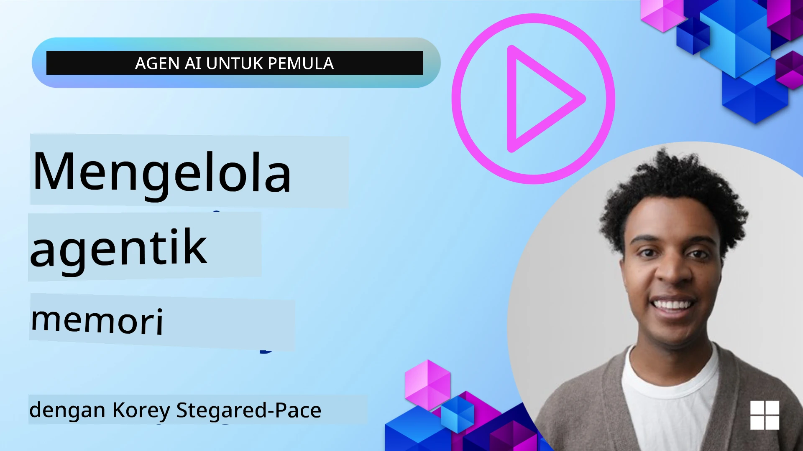

<!--
CO_OP_TRANSLATOR_METADATA:
{
  "original_hash": "a1d90991499ad697c4ad24decaf36968",
  "translation_date": "2025-12-09T12:34:21+00:00",
  "source_file": "13-agent-memory/README.md",
  "language_code": "id"
}
-->
# Memori untuk Agen AI 

Saat membahas manfaat unik dari menciptakan Agen AI, dua hal utama yang sering dibahas adalah kemampuan untuk menggunakan alat guna menyelesaikan tugas dan kemampuan untuk berkembang seiring waktu. Memori menjadi dasar dalam menciptakan agen yang dapat meningkatkan diri sendiri untuk memberikan pengalaman yang lebih baik bagi pengguna.

Dalam pelajaran ini, kita akan melihat apa itu memori untuk Agen AI, bagaimana kita dapat mengelolanya, dan menggunakannya untuk keuntungan aplikasi kita.

## Pengantar

Pelajaran ini akan mencakup:

• **Memahami Memori Agen AI**: Apa itu memori dan mengapa penting bagi agen.

• **Mengimplementasikan dan Menyimpan Memori**: Metode praktis untuk menambahkan kemampuan memori pada agen AI Anda, dengan fokus pada memori jangka pendek dan jangka panjang.

• **Membuat Agen AI yang Meningkatkan Diri Sendiri**: Bagaimana memori memungkinkan agen untuk belajar dari interaksi sebelumnya dan berkembang seiring waktu.

## Implementasi yang Tersedia

Pelajaran ini mencakup dua tutorial notebook yang komprehensif:

• **[13-agent-memory.ipynb](./13-agent-memory.ipynb)**: Mengimplementasikan memori menggunakan Mem0 dan Azure AI Search dengan kerangka kerja Semantic Kernel.

• **[13-agent-memory-cognee.ipynb](./13-agent-memory-cognee.ipynb)**: Mengimplementasikan memori terstruktur menggunakan Cognee, secara otomatis membangun grafik pengetahuan yang didukung oleh embeddings, memvisualisasikan grafik, dan pencarian cerdas.

## Tujuan Pembelajaran

Setelah menyelesaikan pelajaran ini, Anda akan mengetahui cara:

• **Membedakan berbagai jenis memori agen AI**, termasuk memori kerja, jangka pendek, dan jangka panjang, serta bentuk khusus seperti memori persona dan episodik.

• **Mengimplementasikan dan mengelola memori jangka pendek dan jangka panjang untuk agen AI** menggunakan kerangka kerja Semantic Kernel, memanfaatkan alat seperti Mem0, Cognee, memori Whiteboard, dan integrasi dengan Azure AI Search.

• **Memahami prinsip di balik agen AI yang meningkatkan diri sendiri** dan bagaimana sistem manajemen memori yang kuat berkontribusi pada pembelajaran dan adaptasi yang berkelanjutan.

## Memahami Memori Agen AI

Pada intinya, **memori untuk agen AI mengacu pada mekanisme yang memungkinkan mereka untuk menyimpan dan mengingat informasi**. Informasi ini dapat berupa detail spesifik tentang percakapan, preferensi pengguna, tindakan sebelumnya, atau bahkan pola yang dipelajari.

Tanpa memori, aplikasi AI sering kali bersifat stateless, artinya setiap interaksi dimulai dari awal. Hal ini menyebabkan pengalaman pengguna yang berulang dan membuat frustrasi, di mana agen "melupakan" konteks atau preferensi sebelumnya.

### Mengapa Memori Penting?

Kecerdasan agen sangat terkait dengan kemampuannya untuk mengingat dan memanfaatkan informasi sebelumnya. Memori memungkinkan agen menjadi:

• **Reflektif**: Belajar dari tindakan dan hasil sebelumnya.

• **Interaktif**: Mempertahankan konteks selama percakapan yang berlangsung.

• **Proaktif dan Reaktif**: Mengantisipasi kebutuhan atau merespons dengan tepat berdasarkan data historis.

• **Otonom**: Beroperasi lebih mandiri dengan memanfaatkan pengetahuan yang tersimpan.

Tujuan dari implementasi memori adalah membuat agen lebih **andal dan mampu**.

### Jenis Memori

#### Memori Kerja

Anggap ini sebagai selembar kertas catatan yang digunakan agen selama satu tugas atau proses pemikiran yang sedang berlangsung. Memori ini menyimpan informasi langsung yang diperlukan untuk menghitung langkah berikutnya.

Untuk agen AI, memori kerja sering kali menangkap informasi paling relevan dari percakapan, bahkan jika riwayat obrolan penuh panjang atau terpotong. Memori ini berfokus pada elemen-elemen penting seperti persyaratan, proposal, keputusan, dan tindakan.

**Contoh Memori Kerja**

Dalam agen pemesanan perjalanan, memori kerja mungkin menangkap permintaan pengguna saat ini, seperti "Saya ingin memesan perjalanan ke Paris". Persyaratan spesifik ini disimpan dalam konteks langsung agen untuk memandu interaksi saat ini.

#### Memori Jangka Pendek

Jenis memori ini menyimpan informasi selama satu percakapan atau sesi. Ini adalah konteks dari obrolan saat ini, memungkinkan agen untuk merujuk kembali ke putaran sebelumnya dalam dialog.

**Contoh Memori Jangka Pendek**

Jika pengguna bertanya, "Berapa biaya penerbangan ke Paris?" lalu melanjutkan dengan "Bagaimana dengan akomodasi di sana?", memori jangka pendek memastikan agen tahu bahwa "di sana" merujuk ke "Paris" dalam percakapan yang sama.

#### Memori Jangka Panjang

Ini adalah informasi yang bertahan di berbagai percakapan atau sesi. Memori ini memungkinkan agen untuk mengingat preferensi pengguna, interaksi historis, atau pengetahuan umum dalam jangka waktu yang lama. Hal ini penting untuk personalisasi.

**Contoh Memori Jangka Panjang**

Memori jangka panjang mungkin menyimpan bahwa "Ben menyukai ski dan aktivitas luar ruangan, suka kopi dengan pemandangan gunung, dan ingin menghindari lereng ski tingkat lanjut karena cedera sebelumnya". Informasi ini, yang dipelajari dari interaksi sebelumnya, memengaruhi rekomendasi dalam sesi perencanaan perjalanan di masa depan, membuatnya sangat personal.

#### Memori Persona

Jenis memori khusus ini membantu agen mengembangkan "kepribadian" atau "persona" yang konsisten. Memori ini memungkinkan agen untuk mengingat detail tentang dirinya sendiri atau perannya yang dimaksudkan, membuat interaksi lebih lancar dan terfokus.

**Contoh Memori Persona**
Jika agen perjalanan dirancang sebagai "perencana ski ahli", memori persona mungkin memperkuat peran ini, memengaruhi responsnya agar selaras dengan nada dan pengetahuan seorang ahli.

#### Memori Alur Kerja/Episodik

Memori ini menyimpan urutan langkah yang diambil agen selama tugas yang kompleks, termasuk keberhasilan dan kegagalan. Ini seperti mengingat "episode" spesifik atau pengalaman masa lalu untuk dipelajari.

**Contoh Memori Episodik**

Jika agen mencoba memesan penerbangan tertentu tetapi gagal karena tidak tersedia, memori episodik dapat mencatat kegagalan ini, memungkinkan agen mencoba penerbangan alternatif atau memberi tahu pengguna tentang masalah tersebut dengan cara yang lebih terinformasi selama upaya berikutnya.

#### Memori Entitas

Memori ini melibatkan ekstraksi dan penyimpanan entitas spesifik (seperti orang, tempat, atau benda) dan peristiwa dari percakapan. Memori ini memungkinkan agen untuk membangun pemahaman terstruktur tentang elemen-elemen penting yang dibahas.

**Contoh Memori Entitas**

Dari percakapan tentang perjalanan sebelumnya, agen mungkin mengekstrak "Paris," "Menara Eiffel," dan "makan malam di restoran Le Chat Noir" sebagai entitas. Dalam interaksi di masa depan, agen dapat mengingat "Le Chat Noir" dan menawarkan untuk membuat reservasi baru di sana.

#### RAG Terstruktur (Retrieval Augmented Generation)

Meskipun RAG adalah teknik yang lebih luas, "RAG Terstruktur" disorot sebagai teknologi memori yang kuat. Memori ini mengekstrak informasi padat dan terstruktur dari berbagai sumber (percakapan, email, gambar) dan menggunakannya untuk meningkatkan presisi, pengingatan, dan kecepatan dalam respons. Berbeda dengan RAG klasik yang hanya mengandalkan kesamaan semantik, RAG Terstruktur bekerja dengan struktur bawaan dari informasi.

**Contoh RAG Terstruktur**

Alih-alih hanya mencocokkan kata kunci, RAG Terstruktur dapat memparsing detail penerbangan (tujuan, tanggal, waktu, maskapai) dari email dan menyimpannya dengan cara yang terstruktur. Hal ini memungkinkan kueri yang tepat seperti "Penerbangan apa yang saya pesan ke Paris pada hari Selasa?"

## Mengimplementasikan dan Menyimpan Memori

Mengimplementasikan memori untuk agen AI melibatkan proses sistematis **manajemen memori**, yang mencakup menghasilkan, menyimpan, mengambil, mengintegrasikan, memperbarui, dan bahkan "melupakan" (atau menghapus) informasi. Pengambilan memori adalah aspek yang sangat penting.

### Alat Memori Khusus

#### Mem0

Salah satu cara untuk menyimpan dan mengelola memori agen adalah dengan menggunakan alat khusus seperti Mem0. Mem0 berfungsi sebagai lapisan memori yang persisten, memungkinkan agen untuk mengingat interaksi yang relevan, menyimpan preferensi pengguna dan konteks faktual, serta belajar dari keberhasilan dan kegagalan seiring waktu. Ide di sini adalah bahwa agen yang stateless berubah menjadi stateful.

Mem0 bekerja melalui **pipeline memori dua fase: ekstraksi dan pembaruan**. Pertama, pesan yang ditambahkan ke thread agen dikirim ke layanan Mem0, yang menggunakan Large Language Model (LLM) untuk merangkum riwayat percakapan dan mengekstrak memori baru. Selanjutnya, fase pembaruan yang didorong oleh LLM menentukan apakah memori tersebut perlu ditambahkan, dimodifikasi, atau dihapus, menyimpannya dalam penyimpanan data hibrida yang dapat mencakup basis data vektor, grafik, dan key-value. Sistem ini juga mendukung berbagai jenis memori dan dapat mengintegrasikan memori grafik untuk mengelola hubungan antar entitas.

#### Cognee

Pendekatan kuat lainnya adalah menggunakan **Cognee**, memori semantik open-source untuk agen AI yang mengubah data terstruktur dan tidak terstruktur menjadi grafik pengetahuan yang dapat di-query dan didukung oleh embeddings. Cognee menyediakan **arsitektur penyimpanan ganda** yang menggabungkan pencarian kesamaan vektor dengan hubungan grafik, memungkinkan agen untuk memahami tidak hanya informasi apa yang serupa, tetapi bagaimana konsep saling berhubungan.

Cognee unggul dalam **pencarian hibrida** yang menggabungkan kesamaan vektor, struktur grafik, dan penalaran LLM - mulai dari pencarian chunk mentah hingga tanya jawab yang sadar grafik. Sistem ini mempertahankan **memori hidup** yang berkembang dan tumbuh sambil tetap dapat di-query sebagai satu grafik yang terhubung, mendukung konteks sesi jangka pendek dan memori persisten jangka panjang.

Tutorial notebook Cognee ([13-agent-memory-cognee.ipynb](./13-agent-memory-cognee.ipynb)) menunjukkan cara membangun lapisan memori terpadu ini, dengan contoh praktis tentang mengolah berbagai sumber data, memvisualisasikan grafik pengetahuan, dan melakukan kueri dengan strategi pencarian yang berbeda yang disesuaikan dengan kebutuhan agen tertentu.

### Menyimpan Memori dengan RAG

Selain alat memori khusus seperti Mem0, Anda dapat memanfaatkan layanan pencarian yang kuat seperti **Azure AI Search sebagai backend untuk menyimpan dan mengambil memori**, terutama untuk RAG terstruktur.

Hal ini memungkinkan Anda untuk mendasarkan respons agen pada data Anda sendiri, memastikan jawaban yang lebih relevan dan akurat. Azure AI Search dapat digunakan untuk menyimpan memori perjalanan pengguna, katalog produk, atau pengetahuan khusus domain lainnya.

Azure AI Search mendukung kemampuan seperti **RAG Terstruktur**, yang unggul dalam mengekstrak dan mengambil informasi padat dan terstruktur dari dataset besar seperti riwayat percakapan, email, atau bahkan gambar. Hal ini memberikan "presisi dan pengingatan superhuman" dibandingkan pendekatan chunking teks dan embedding tradisional.

## Membuat Agen AI Meningkatkan Diri Sendiri

Pola umum untuk agen yang meningkatkan diri sendiri melibatkan pengenalan **"agen pengetahuan"**. Agen terpisah ini mengamati percakapan utama antara pengguna dan agen utama. Perannya adalah:

1. **Mengidentifikasi informasi berharga**: Menentukan apakah ada bagian dari percakapan yang layak disimpan sebagai pengetahuan umum atau preferensi pengguna tertentu.

2. **Ekstraksi dan ringkasan**: Menyaring pembelajaran atau preferensi penting dari percakapan.

3. **Menyimpan dalam basis pengetahuan**: Menyimpan informasi yang diekstraksi, sering kali dalam basis data vektor, sehingga dapat diambil nanti.

4. **Menambah kueri di masa depan**: Ketika pengguna memulai kueri baru, agen pengetahuan mengambil informasi yang tersimpan yang relevan dan menambahkannya ke prompt pengguna, memberikan konteks penting kepada agen utama (mirip dengan RAG).

### Optimasi untuk Memori

• **Manajemen Latensi**: Untuk menghindari memperlambat interaksi pengguna, model yang lebih murah dan cepat dapat digunakan terlebih dahulu untuk dengan cepat memeriksa apakah informasi berharga untuk disimpan atau diambil, hanya menggunakan proses ekstraksi/pengambilan yang lebih kompleks jika diperlukan.

• **Pemeliharaan Basis Pengetahuan**: Untuk basis pengetahuan yang terus berkembang, informasi yang jarang digunakan dapat dipindahkan ke "penyimpanan dingin" untuk mengelola biaya.

## Ada Pertanyaan Lebih Lanjut Tentang Memori Agen?

Bergabunglah dengan [Azure AI Foundry Discord](https://aka.ms/ai-agents/discord) untuk bertemu dengan pelajar lainnya, menghadiri jam kantor, dan mendapatkan jawaban atas pertanyaan Anda tentang Agen AI.

---

<!-- CO-OP TRANSLATOR DISCLAIMER START -->
**Penafian**:  
Dokumen ini telah diterjemahkan menggunakan layanan penerjemahan AI [Co-op Translator](https://github.com/Azure/co-op-translator). Meskipun kami berupaya untuk memberikan hasil yang akurat, harap diketahui bahwa terjemahan otomatis dapat mengandung kesalahan atau ketidakakuratan. Dokumen asli dalam bahasa aslinya harus dianggap sebagai sumber yang otoritatif. Untuk informasi yang penting, disarankan menggunakan jasa penerjemahan manusia profesional. Kami tidak bertanggung jawab atas kesalahpahaman atau penafsiran yang timbul dari penggunaan terjemahan ini.
<!-- CO-OP TRANSLATOR DISCLAIMER END -->