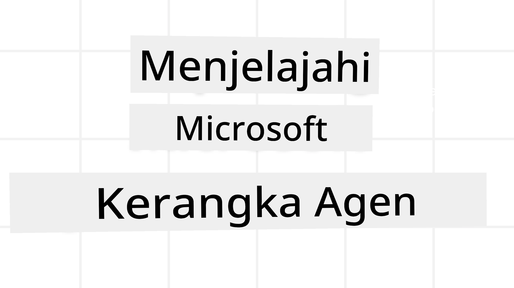
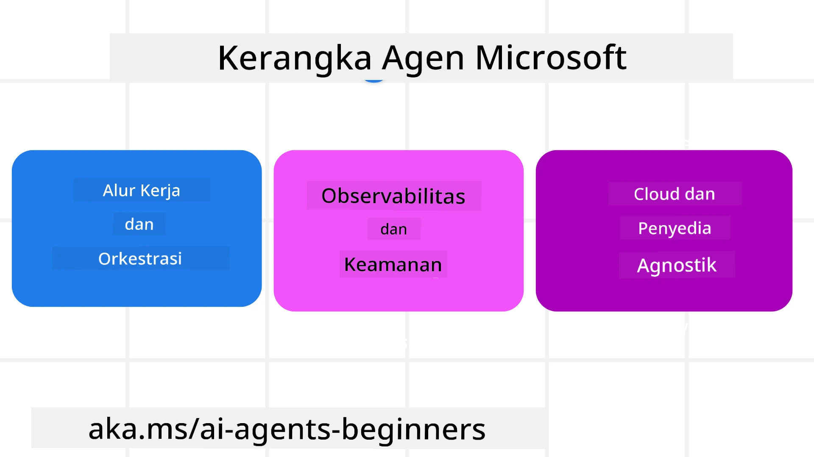
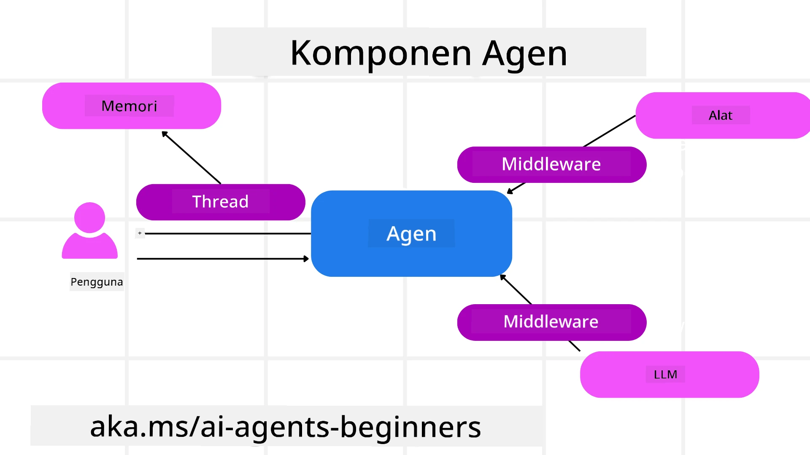

<!--
CO_OP_TRANSLATOR_METADATA:
{
  "original_hash": "19c4dab375acbc733855cc7f2f04edbc",
  "translation_date": "2025-10-02T17:27:54+00:00",
  "source_file": "14-microsoft-agent-framework/README.md",
  "language_code": "id"
}
-->
# Menjelajahi Microsoft Agent Framework



### Pendahuluan

Pelajaran ini akan mencakup:

- Memahami Microsoft Agent Framework: Fitur Utama dan Nilai  
- Menjelajahi Konsep Utama Microsoft Agent Framework
- Membandingkan MAF dengan Semantic Kernel dan AutoGen: Panduan Migrasi

## Tujuan Pembelajaran

Setelah menyelesaikan pelajaran ini, Anda akan dapat:

- Membangun Agen AI Siap Produksi menggunakan Microsoft Agent Framework
- Menerapkan fitur utama Microsoft Agent Framework pada kasus penggunaan berbasis agen
- Migrasi dan integrasi kerangka kerja serta alat berbasis agen yang sudah ada  

## Contoh Kode 

Contoh kode untuk [Microsoft Agent Framework (MAF)](https://aka.ms/ai-agents-beginners/agent-framewrok) dapat ditemukan di repositori ini dalam file `xx-python-agent-framework` dan `xx-dotnet-agent-framework`.

## Memahami Microsoft Agent Framework



[Microsoft Agent Framework (MAF)](https://aka.ms/ai-agents-beginners/agent-framewrok) dibangun berdasarkan pengalaman dan pembelajaran dari Semantic Kernel dan AutoGen. Framework ini menawarkan fleksibilitas untuk menangani berbagai kasus penggunaan berbasis agen yang ditemukan di lingkungan produksi maupun penelitian, termasuk:

- **Orkestrasi Agen Secuensial** dalam skenario yang membutuhkan alur kerja langkah demi langkah.
- **Orkestrasi Konkuren** dalam skenario di mana agen perlu menyelesaikan tugas secara bersamaan.
- **Orkestrasi Obrolan Grup** dalam skenario di mana agen dapat berkolaborasi bersama dalam satu tugas.
- **Orkestrasi Serah Terima** dalam skenario di mana agen menyerahkan tugas ke agen lain setelah subtugas selesai.
- **Orkestrasi Magnetik** dalam skenario di mana agen manajer membuat dan memodifikasi daftar tugas serta menangani koordinasi subagen untuk menyelesaikan tugas.

Untuk menghadirkan Agen AI dalam Produksi, MAF juga menyertakan fitur untuk:

- **Observabilitas** melalui penggunaan OpenTelemetry di mana setiap tindakan Agen AI, termasuk pemanggilan alat, langkah orkestrasi, alur penalaran, dan pemantauan kinerja melalui dasbor Azure AI Foundry.
- **Keamanan** dengan menghosting agen secara native di Azure AI Foundry yang mencakup kontrol keamanan seperti akses berbasis peran, penanganan data pribadi, dan keamanan konten bawaan.
- **Daya Tahan** karena thread dan alur kerja agen dapat dijeda, dilanjutkan, dan pulih dari kesalahan, yang memungkinkan proses berjalan lebih lama.
- **Kontrol** karena alur kerja manusia dalam loop didukung di mana tugas ditandai sebagai memerlukan persetujuan manusia.

Microsoft Agent Framework juga berfokus pada interoperabilitas dengan:

- **Bersifat Cloud-agnostic** - Agen dapat berjalan di container, on-prem, dan di berbagai cloud yang berbeda.
- **Bersifat Provider-agnostic** - Agen dapat dibuat melalui SDK pilihan Anda, termasuk Azure OpenAI dan OpenAI.
- **Mengintegrasikan Standar Terbuka** - Agen dapat memanfaatkan protokol seperti Agent-to-Agent (A2A) dan Model Context Protocol (MCP) untuk menemukan dan menggunakan agen serta alat lainnya.
- **Plugin dan Konektor** - Koneksi dapat dibuat ke layanan data dan memori seperti Microsoft Fabric, SharePoint, Pinecone, dan Qdrant.

Mari kita lihat bagaimana fitur-fitur ini diterapkan pada beberapa konsep inti Microsoft Agent Framework.

## Konsep Utama Microsoft Agent Framework

### Agen



**Membuat Agen**

Pembuatan agen dilakukan dengan mendefinisikan layanan inferensi (Penyedia LLM), satu set instruksi untuk diikuti oleh Agen AI, dan `name` yang ditetapkan:

```python
agent = AzureOpenAIChatClient(credential=AzureCliCredential()).create_agent( instructions="You are good at recommending trips to customers based on their preferences.", name="TripRecommender" )
```

Kode di atas menggunakan `Azure OpenAI`, tetapi agen dapat dibuat menggunakan berbagai layanan termasuk `Azure AI Foundry Agent Service`:

```python
AzureAIAgentClient(async_credential=credential).create_agent( name="HelperAgent", instructions="You are a helpful assistant." ) as agent
```

API `Responses` dan `ChatCompletion` dari OpenAI

```python
agent = OpenAIResponsesClient().create_agent( name="WeatherBot", instructions="You are a helpful weather assistant.", )
```

```python
agent = OpenAIChatClient().create_agent( name="HelpfulAssistant", instructions="You are a helpful assistant.", )
```

atau agen jarak jauh menggunakan protokol A2A:

```python
agent = A2AAgent( name=agent_card.name, description=agent_card.description, agent_card=agent_card, url="https://your-a2a-agent-host" )
```

**Menjalankan Agen**

Agen dijalankan menggunakan metode `.run` atau `.run_stream` untuk respons non-streaming atau streaming.

```python
result = await agent.run("What are good places to visit in Amsterdam?")
print(result.text)
```

```python
async for update in agent.run_stream("What are the good places to visit in Amsterdam?"):
    if update.text:
        print(update.text, end="", flush=True)

```

Setiap eksekusi agen juga dapat memiliki opsi untuk menyesuaikan parameter seperti `max_tokens` yang digunakan oleh agen, `tools` yang dapat dipanggil oleh agen, dan bahkan `model` yang digunakan oleh agen.

Ini berguna dalam kasus di mana model atau alat tertentu diperlukan untuk menyelesaikan tugas pengguna.

**Alat**

Alat dapat didefinisikan baik saat mendefinisikan agen:

```python
def get_attractions( location: Annotated[str, Field(description="The location to get the top tourist attractions for")], ) -> str: """Get the top tourist attractions for a given location.""" return f"The top attractions for {location} are." 


# When creating a ChatAgent directly 

agent = ChatAgent( chat_client=OpenAIChatClient(), instructions="You are a helpful assistant", tools=[get_attractions]

```

dan juga saat menjalankan agen:

```python

result1 = await agent.run( "What's the best place to visit in Seattle?", tools=[get_attractions] # Tool provided for this run only )
```

**Thread Agen**

Thread Agen digunakan untuk menangani percakapan multi-putaran. Thread dapat dibuat dengan:

- Menggunakan `get_new_thread()` yang memungkinkan thread disimpan dari waktu ke waktu
- Membuat thread secara otomatis saat menjalankan agen dan hanya memiliki thread selama eksekusi saat ini.

Untuk membuat thread, kode terlihat seperti ini:

```python
# Create a new thread. 
thread = agent.get_new_thread() # Run the agent with the thread. 
response = await agent.run("Hello, I am here to help you book travel. Where would you like to go?", thread=thread)

```

Anda kemudian dapat menyerialkan thread untuk disimpan dan digunakan nanti:

```python
# Create a new thread. 
thread = agent.get_new_thread() 

# Run the agent with the thread. 

response = await agent.run("Hello, how are you?", thread=thread) 

# Serialize the thread for storage. 

serialized_thread = await thread.serialize() 

# Deserialize the thread state after loading from storage. 

resumed_thread = await agent.deserialize_thread(serialized_thread)
```

**Middleware Agen**

Agen berinteraksi dengan alat dan LLM untuk menyelesaikan tugas pengguna. Dalam skenario tertentu, kita ingin mengeksekusi atau melacak interaksi di antara keduanya. Middleware agen memungkinkan kita melakukan ini melalui:

*Function Middleware*

Middleware ini memungkinkan kita mengeksekusi tindakan antara agen dan fungsi/alat yang akan dipanggilnya. Contoh penggunaannya adalah ketika Anda ingin melakukan logging pada pemanggilan fungsi.

Dalam kode di bawah ini, `next` mendefinisikan apakah middleware berikutnya atau fungsi sebenarnya yang harus dipanggil.

```python
async def logging_function_middleware(
    context: FunctionInvocationContext,
    next: Callable[[FunctionInvocationContext], Awaitable[None]],
) -> None:
    """Function middleware that logs function execution."""
    # Pre-processing: Log before function execution
    print(f"[Function] Calling {context.function.name}")

    # Continue to next middleware or function execution
    await next(context)

    # Post-processing: Log after function execution
    print(f"[Function] {context.function.name} completed")
```

*Chat Middleware*

Middleware ini memungkinkan kita mengeksekusi atau mencatat tindakan antara agen dan permintaan yang dikirimkan ke LLM.

Ini berisi informasi penting seperti `messages` yang dikirim ke layanan AI.

```python
async def logging_chat_middleware(
    context: ChatContext,
    next: Callable[[ChatContext], Awaitable[None]],
) -> None:
    """Chat middleware that logs AI interactions."""
    # Pre-processing: Log before AI call
    print(f"[Chat] Sending {len(context.messages)} messages to AI")

    # Continue to next middleware or AI service
    await next(context)

    # Post-processing: Log after AI response
    print("[Chat] AI response received")

```

**Memori Agen**

Seperti yang dibahas dalam pelajaran `Agentic Memory`, memori adalah elemen penting untuk memungkinkan agen beroperasi dalam berbagai konteks. MAF menawarkan beberapa jenis memori:

*Penyimpanan Dalam Memori*

Ini adalah memori yang disimpan dalam thread selama runtime aplikasi.

```python
# Create a new thread. 
thread = agent.get_new_thread() # Run the agent with the thread. 
response = await agent.run("Hello, I am here to help you book travel. Where would you like to go?", thread=thread)
```

*Pesan Persisten*

Memori ini digunakan saat menyimpan riwayat percakapan di berbagai sesi. Memori ini didefinisikan menggunakan `chat_message_store_factory`:

```python
from agent_framework import ChatMessageStore

# Create a custom message store
def create_message_store():
    return ChatMessageStore()

agent = ChatAgent(
    chat_client=OpenAIChatClient(),
    instructions="You are a Travel assistant.",
    chat_message_store_factory=create_message_store
)

```

*Memori Dinamis*

Memori ini ditambahkan ke konteks sebelum agen dijalankan. Memori ini dapat disimpan di layanan eksternal seperti mem0:

```python
from agent_framework.mem0 import Mem0Provider

# Using Mem0 for advanced memory capabilities
memory_provider = Mem0Provider(
    api_key="your-mem0-api-key",
    user_id="user_123",
    application_id="my_app"
)

agent = ChatAgent(
    chat_client=OpenAIChatClient(),
    instructions="You are a helpful assistant with memory.",
    context_providers=memory_provider
)

```

**Observabilitas Agen**

Observabilitas penting untuk membangun sistem berbasis agen yang andal dan dapat dipelihara. MAF terintegrasi dengan OpenTelemetry untuk menyediakan tracing dan meteran untuk observabilitas yang lebih baik.

```python
from agent_framework.observability import get_tracer, get_meter

tracer = get_tracer()
meter = get_meter()
with tracer.start_as_current_span("my_custom_span"):
    # do something
    pass
counter = meter.create_counter("my_custom_counter")
counter.add(1, {"key": "value"})
```

### Alur Kerja

MAF menawarkan alur kerja yang merupakan langkah-langkah yang telah ditentukan untuk menyelesaikan tugas dan mencakup agen AI sebagai komponen dalam langkah-langkah tersebut.

Alur kerja terdiri dari berbagai komponen yang memungkinkan kontrol alur yang lebih baik. Alur kerja juga memungkinkan **orkestrasi multi-agen** dan **checkpointing** untuk menyimpan status alur kerja.

Komponen inti dari alur kerja adalah:

**Eksekutor**

Eksekutor menerima pesan input, melakukan tugas yang ditugaskan, dan kemudian menghasilkan pesan output. Ini menggerakkan alur kerja menuju penyelesaian tugas yang lebih besar. Eksekutor dapat berupa agen AI atau logika khusus.

**Edges**

Edges digunakan untuk mendefinisikan alur pesan dalam alur kerja. Edges dapat berupa:

*Direct Edges* - Koneksi sederhana satu-ke-satu antara eksekutor:

```python
from agent_framework import WorkflowBuilder

builder = WorkflowBuilder()
builder.add_edge(source_executor, target_executor)
builder.set_start_executor(source_executor)
workflow = builder.build()
```

*Conditional Edges* - Diaktifkan setelah kondisi tertentu terpenuhi. Misalnya, ketika kamar hotel tidak tersedia, eksekutor dapat menyarankan opsi lain.

*Switch-case Edges* - Mengarahkan pesan ke eksekutor yang berbeda berdasarkan kondisi yang ditentukan. Misalnya, jika pelanggan perjalanan memiliki akses prioritas, tugas mereka akan ditangani melalui alur kerja lain.

*Fan-out Edges* - Mengirim satu pesan ke beberapa target.

*Fan-in Edges* - Mengumpulkan beberapa pesan dari eksekutor yang berbeda dan mengirimkannya ke satu target.

**Events**

Untuk memberikan observabilitas yang lebih baik ke dalam alur kerja, MAF menawarkan event bawaan untuk eksekusi, termasuk:

- `WorkflowStartedEvent`  - Eksekusi alur kerja dimulai
- `WorkflowOutputEvent` - Alur kerja menghasilkan output
- `WorkflowErrorEvent` - Alur kerja mengalami kesalahan
- `ExecutorInvokeEvent`  - Eksekutor mulai memproses
- `ExecutorCompleteEvent`  - Eksekutor selesai memproses
- `RequestInfoEvent` - Permintaan dikeluarkan

## Migrasi Dari Kerangka Kerja Lain (Semantic Kernel dan AutoGen)

### Perbedaan antara MAF dan Semantic Kernel

**Pembuatan Agen yang Disederhanakan**

Semantic Kernel mengandalkan pembuatan instance Kernel untuk setiap agen. MAF menggunakan pendekatan yang disederhanakan dengan menggunakan ekstensi untuk penyedia utama.

```python
agent = AzureOpenAIChatClient(credential=AzureCliCredential()).create_agent( instructions="You are good at reccomending trips to customers based on their preferences.", name="TripRecommender" )
```

**Pembuatan Thread Agen**

Semantic Kernel mengharuskan thread dibuat secara manual. Dalam MAF, agen langsung ditugaskan ke thread.

```python
thread = agent.get_new_thread() # Run the agent with the thread. 
```

**Registrasi Alat**

Dalam Semantic Kernel, alat didaftarkan ke Kernel dan Kernel kemudian diteruskan ke agen. Dalam MAF, alat didaftarkan langsung selama proses pembuatan agen.

```python
agent = ChatAgent( chat_client=OpenAIChatClient(), instructions="You are a helpful assistant", tools=[get_attractions]
```

### Perbedaan antara MAF dan AutoGen

**Teams vs Workflows**

`Teams` adalah struktur event untuk aktivitas berbasis event dengan agen di AutoGen. MAF menggunakan `Workflows` yang mengarahkan data ke eksekutor melalui arsitektur berbasis graf.

**Pembuatan Alat**

AutoGen menggunakan `FunctionTool` untuk membungkus fungsi yang dapat dipanggil oleh agen. MAF menggunakan @ai_function yang beroperasi serupa tetapi juga secara otomatis menyimpulkan skema untuk setiap fungsi.

**Perilaku Agen**

Agen adalah agen satu putaran secara default di AutoGen kecuali `max_tool_iterations` diatur ke nilai yang lebih tinggi. Dalam MAF, `ChatAgent` adalah multi-putaran secara default, yang berarti akan terus memanggil alat hingga tugas pengguna selesai.

## Contoh Kode 

Contoh kode untuk Microsoft Agent Framework dapat ditemukan di repositori ini dalam file `xx-python-agent-framework` dan `xx-dotnet-agent-framework`.

## Punya Pertanyaan Lebih Lanjut Tentang Microsoft Agent Framework?

Bergabunglah dengan [Azure AI Foundry Discord](https://aka.ms/ai-agents/discord) untuk bertemu dengan pelajar lainnya, menghadiri jam kantor, dan mendapatkan jawaban atas pertanyaan Anda tentang Agen AI.

---

**Penafian**:  
Dokumen ini telah diterjemahkan menggunakan layanan penerjemahan AI [Co-op Translator](https://github.com/Azure/co-op-translator). Meskipun kami berupaya untuk memberikan hasil yang akurat, harap diketahui bahwa terjemahan otomatis dapat mengandung kesalahan atau ketidakakuratan. Dokumen asli dalam bahasa aslinya harus dianggap sebagai sumber yang otoritatif. Untuk informasi yang bersifat kritis, disarankan menggunakan jasa penerjemahan manusia profesional. Kami tidak bertanggung jawab atas kesalahpahaman atau penafsiran yang keliru yang timbul dari penggunaan terjemahan ini.