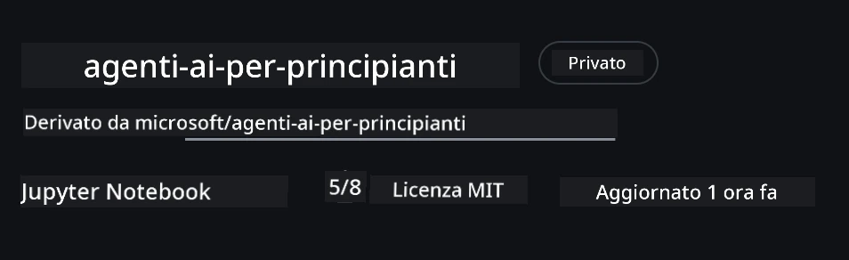
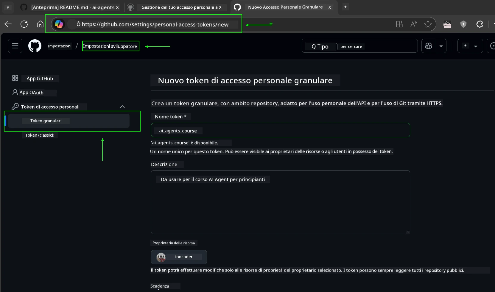
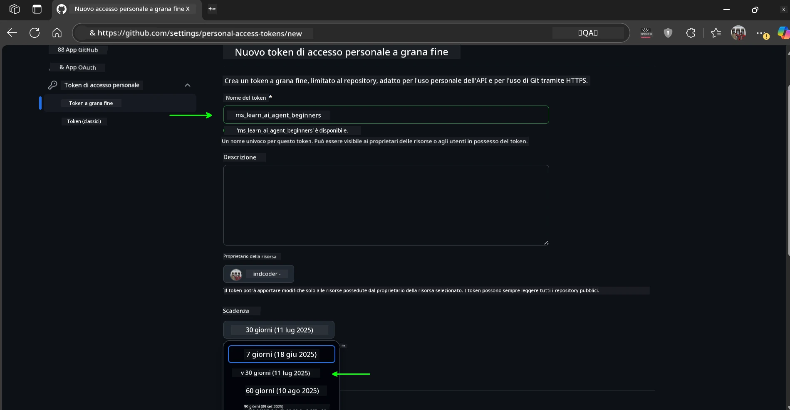
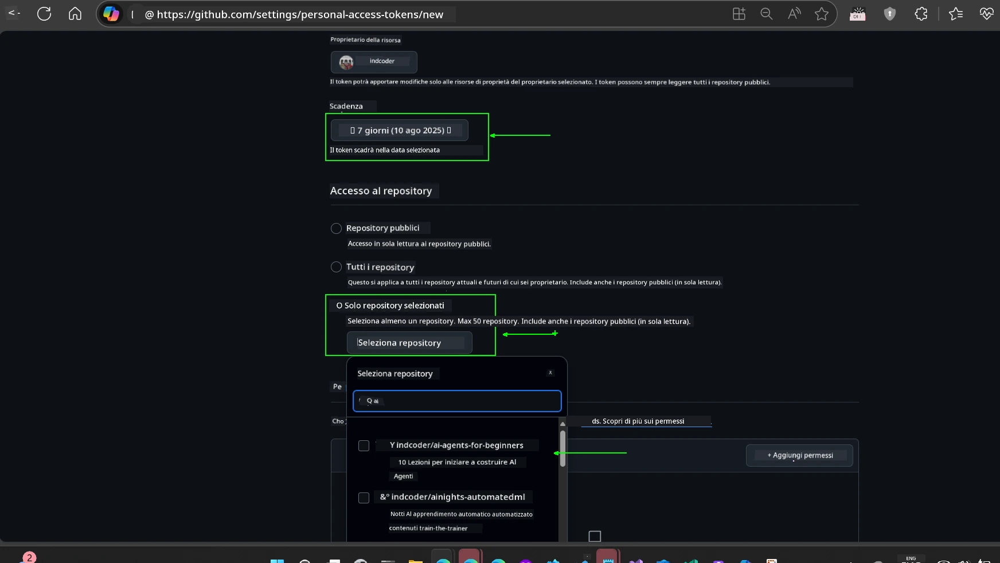
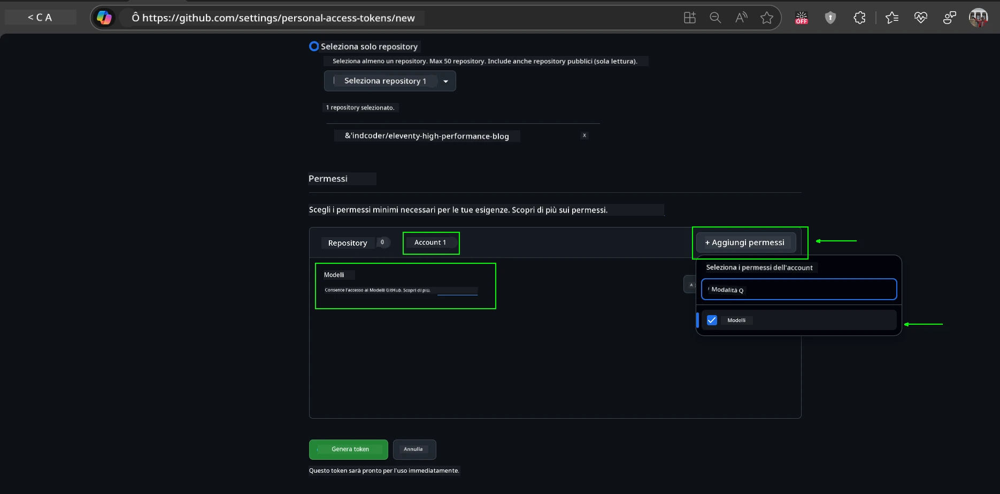
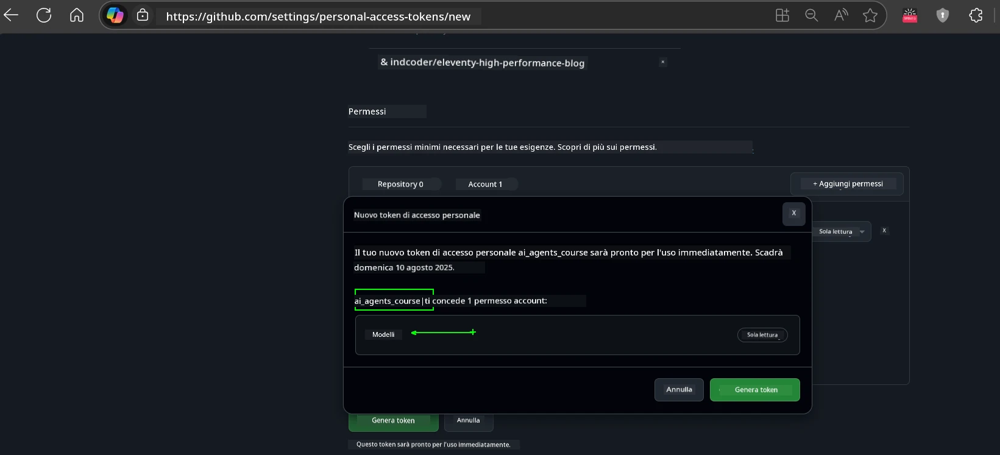
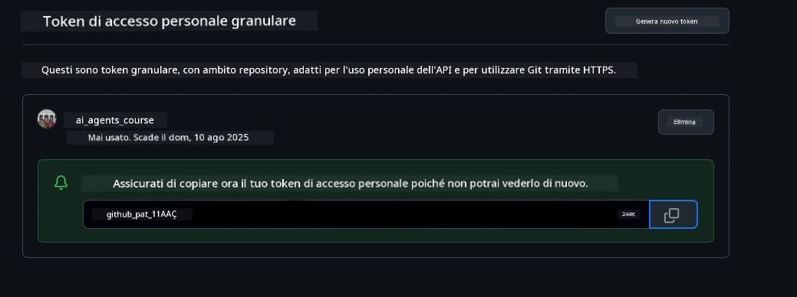
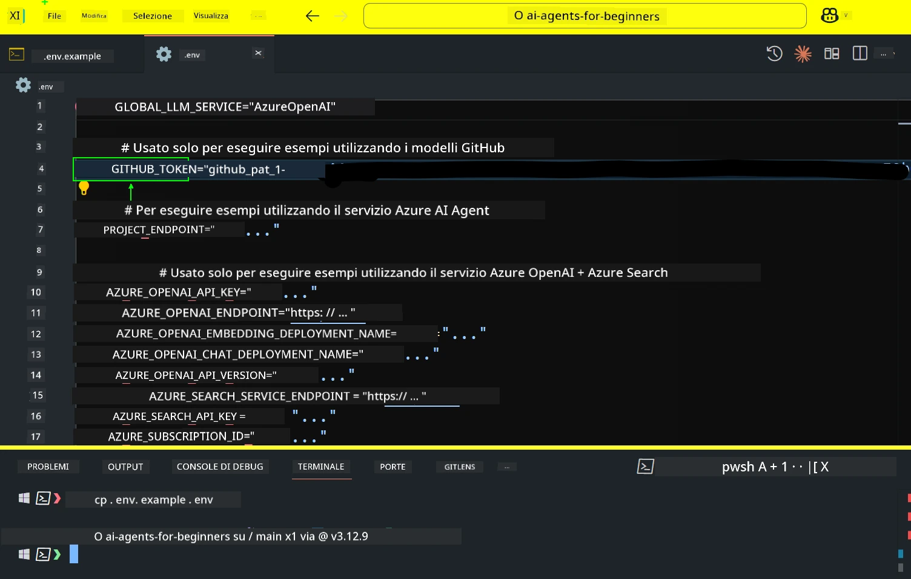
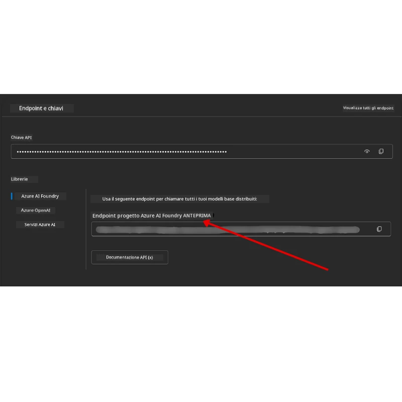

<!--
CO_OP_TRANSLATOR_METADATA:
{
  "original_hash": "63b1a8f6e840df15934935b728e569f0",
  "translation_date": "2025-12-03T14:20:31+00:00",
  "source_file": "00-course-setup/README.md",
  "language_code": "it"
}
-->
# Configurazione del Corso

## Introduzione

Questa lezione spiegherà come eseguire gli esempi di codice di questo corso.

## Unisciti ad Altri Studenti e Ottieni Aiuto

Prima di iniziare a clonare il tuo repository, unisciti al [canale Discord AI Agents For Beginners](https://aka.ms/ai-agents/discord) per ricevere aiuto con la configurazione, per qualsiasi domanda sul corso o per connetterti con altri studenti.

## Clona o Fai un Fork di Questo Repository

Per iniziare, clona o fai un fork del repository GitHub. Questo ti permetterà di avere una tua versione del materiale del corso per eseguire, testare e modificare il codice!

Puoi farlo cliccando sul link per <a href="https://github.com/microsoft/ai-agents-for-beginners/fork" target="_blank">fare un fork del repository</a>.

Ora dovresti avere la tua versione forkata di questo corso al seguente link:



### Clone Superficiale (consigliato per workshop / Codespaces)

  >Il repository completo può essere grande (~3 GB) quando scarichi tutta la cronologia e tutti i file. Se stai partecipando solo al workshop o hai bisogno solo di alcune cartelle delle lezioni, un clone superficiale (o un clone sparso) evita la maggior parte di quel download troncando la cronologia e/o saltando i blob.

#### Clone superficiale rapido — cronologia minima, tutti i file

Sostituisci `<your-username>` nei comandi qui sotto con l'URL del tuo fork (o l'URL upstream se preferisci).

Per clonare solo la cronologia dell'ultimo commit (download ridotto):

```bash|powershell
git clone --depth 1 https://github.com/<your-username>/ai-agents-for-beginners.git
```

Per clonare un ramo specifico:

```bash|powershell
git clone --depth 1 --branch <branch-name> https://github.com/<your-username>/ai-agents-for-beginners.git
```

#### Clone parziale (sparso) — blob minimi + solo cartelle selezionate

Questo utilizza il clone parziale e il checkout sparso (richiede Git 2.25+ e Git moderno consigliato con supporto per il clone parziale):

```bash|powershell
git clone --depth 1 --filter=blob:none --sparse https://github.com/<your-username>/ai-agents-for-beginners.git
```

Accedi alla cartella del repository:

```bash|powershell
cd ai-agents-for-beginners
```

Specifica quindi quali cartelle desideri (l'esempio sotto mostra due cartelle):

```bash|powershell
git sparse-checkout set 00-course-setup 01-intro-to-ai-agents
```

Dopo aver clonato e verificato i file, se hai bisogno solo dei file e vuoi liberare spazio (senza cronologia git), elimina i metadati del repository (💀irreversibile — perderai tutte le funzionalità Git: nessun commit, pull, push o accesso alla cronologia).

```bash
# zsh/bash
rm -rf .git
```

```powershell
# PowerShell
Remove-Item -Recurse -Force .git
```

#### Utilizzo di GitHub Codespaces (consigliato per evitare grandi download locali)

- Crea un nuovo Codespace per questo repository tramite l'[interfaccia GitHub](https://github.com/codespaces).  

- Nel terminale del Codespace appena creato, esegui uno dei comandi di clone superficiale/sparso sopra per portare solo le cartelle delle lezioni necessarie nello spazio di lavoro del Codespace.
- Opzionale: dopo aver clonato all'interno di Codespaces, rimuovi .git per recuperare spazio extra (vedi i comandi di rimozione sopra).
- Nota: Se preferisci aprire direttamente il repository in Codespaces (senza un clone extra), tieni presente che Codespaces costruirà l'ambiente devcontainer e potrebbe comunque fornire più di quanto necessario. Clonare una copia superficiale all'interno di un Codespace fresco ti dà maggiore controllo sull'uso del disco.

#### Consigli

- Sostituisci sempre l'URL del clone con il tuo fork se vuoi modificare/commettere.
- Se in seguito hai bisogno di più cronologia o file, puoi recuperarli o regolare il checkout sparso per includere cartelle aggiuntive.

## Esecuzione del Codice

Questo corso offre una serie di Jupyter Notebook che puoi eseguire per ottenere esperienza pratica nella costruzione di AI Agents.

Gli esempi di codice utilizzano:

**Richiede un Account GitHub - Gratuito**:

1) Semantic Kernel Agent Framework + GitHub Models Marketplace. Etichettato come (semantic-kernel.ipynb)
2) AutoGen Framework + GitHub Models Marketplace. Etichettato come (autogen.ipynb)

**Richiede un Abbonamento Azure**:

3) Azure AI Foundry + Azure AI Agent Service. Etichettato come (azureaiagent.ipynb)

Ti incoraggiamo a provare tutti e tre i tipi di esempi per vedere quale funziona meglio per te.

Qualunque opzione tu scelga, determinerà quali passaggi di configurazione dovrai seguire di seguito:

## Requisiti

- Python 3.12+
  - **NOTE**: Se non hai Python3.12 installato, assicurati di installarlo. Poi crea il tuo venv usando python3.12 per garantire che le versioni corrette siano installate dal file requirements.txt.
  
    >Esempio

    Crea una directory Python venv:

    ```bash|powershell
    python -m venv venv
    ```

    Poi attiva l'ambiente venv per:

    ```bash
    # zsh/bash
    source venv/bin/activate
    ```
  
    ```dos
    # Command Prompt for Windows
    venv\Scripts\activate
    ```

- .NET 10+: Per i codici di esempio che utilizzano .NET, assicurati di installare [.NET 10 SDK](https://dotnet.microsoft.com/download/dotnet/10.0) o successivo. Poi, verifica la versione del tuo SDK .NET installato:

    ```bash|powershell
    dotnet --list-sdks
    ```

- Un Account GitHub - Per accedere al GitHub Models Marketplace
- Abbonamento Azure - Per accedere ad Azure AI Foundry
- Account Azure AI Foundry - Per accedere al servizio Azure AI Agent

Abbiamo incluso un file `requirements.txt` nella radice di questo repository che contiene tutti i pacchetti Python richiesti per eseguire gli esempi di codice.

Puoi installarli eseguendo il seguente comando nel tuo terminale alla radice del repository:

```bash|powershell
pip install -r requirements.txt
```

Consigliamo di creare un ambiente virtuale Python per evitare conflitti e problemi.

## Configurazione di VSCode

Assicurati di utilizzare la versione corretta di Python in VSCode.


## Configurazione per Esempi che Utilizzano Modelli GitHub 

### Passo 1: Recupera il Tuo GitHub Personal Access Token (PAT)

Questo corso utilizza il GitHub Models Marketplace, fornendo accesso gratuito a Large Language Models (LLMs) che utilizzerai per costruire AI Agents.

Per utilizzare i modelli GitHub, dovrai creare un [GitHub Personal Access Token](https://docs.github.com/en/authentication/keeping-your-account-and-data-secure/managing-your-personal-access-tokens).

Puoi farlo andando alle <a href="https://github.com/settings/personal-access-tokens" target="_blank">impostazioni dei Personal Access Tokens</a> nel tuo account GitHub.

Segui il [Principio del Minimo Privilegio](https://docs.github.com/en/get-started/learning-to-code/storing-your-secrets-safely) quando crei il tuo token. Questo significa che dovresti dare al token solo i permessi necessari per eseguire gli esempi di codice di questo corso.

1. Seleziona l'opzione `Fine-grained tokens` sul lato sinistro dello schermo accedendo alle **Developer settings**.

   

   Poi seleziona `Generate new token`.

   

2. Inserisci un nome descrittivo per il tuo token che rifletta il suo scopo, rendendolo facile da identificare in seguito.

    🔐 Raccomandazione sulla Durata del Token

    Durata raccomandata: 30 giorni
    Per una postura più sicura, puoi optare per un periodo più breve—come 7 giorni 🛡️
    È un ottimo modo per impostare un obiettivo personale e completare il corso mentre il tuo slancio di apprendimento è alto 🚀.

    

3. Limita l'ambito del token al tuo fork di questo repository.

    

4. Restringi i permessi del token: Sotto **Permissions**, clicca sulla scheda **Account** e premi il pulsante "+ Add permissions". Apparirà un menu a tendina. Cerca **Models** e seleziona la casella corrispondente.

    

5. Verifica i permessi richiesti prima di generare il token. 

6. Prima di generare il token, assicurati di essere pronto a conservarlo in un luogo sicuro come un gestore di password, poiché non sarà mostrato di nuovo dopo la creazione. 

Copia il tuo nuovo token appena creato. Ora lo aggiungerai al file `.env` incluso in questo corso.

### Passo 2: Crea il Tuo File `.env`

Per creare il tuo file `.env`, esegui il seguente comando nel terminale.

```bash
# zsh/bash
cp .env.example .env
```

```powershell
# PowerShell
Copy-Item .env.example .env
```

Questo copierà il file di esempio e creerà un `.env` nella tua directory dove inserirai i valori per le variabili di ambiente.

Con il tuo token copiato, apri il file `.env` nel tuo editor di testo preferito e incolla il tuo token nel campo `GITHUB_TOKEN`.



Ora dovresti essere in grado di eseguire gli esempi di codice di questo corso.

## Configurazione per Esempi che Utilizzano Azure AI Foundry e Azure AI Agent Service

### Passo 1: Recupera il Tuo Endpoint del Progetto Azure

Segui i passaggi per creare un hub e un progetto in Azure AI Foundry qui: [Panoramica delle risorse Hub](https://learn.microsoft.com/azure/ai-foundry/concepts/ai-resources)

Una volta creato il tuo progetto, dovrai recuperare la stringa di connessione per il tuo progetto.

Puoi farlo andando alla pagina **Overview** del tuo progetto nel portale Azure AI Foundry.



### Passo 2: Crea il Tuo File `.env`

Per creare il tuo file `.env`, esegui il seguente comando nel terminale.

```bash
# zsh/bash
cp .env.example .env
```

```powershell
# PowerShell
Copy-Item .env.example .env
```

Questo copierà il file di esempio e creerà un `.env` nella tua directory dove inserirai i valori per le variabili di ambiente.

Con il tuo token copiato, apri il file `.env` nel tuo editor di testo preferito e incolla il tuo token nel campo `PROJECT_ENDPOINT`.

### Passo 3: Accedi ad Azure

Come buona pratica di sicurezza, utilizzeremo [l'autenticazione senza chiavi](https://learn.microsoft.com/azure/developer/ai/keyless-connections?tabs=csharp%2Cazure-cli?WT.mc_id=academic-105485-koreyst) per autenticarti ad Azure OpenAI con Microsoft Entra ID. 

Successivamente, apri un terminale ed esegui `az login --use-device-code` per accedere al tuo account Azure.

Una volta effettuato l'accesso, seleziona il tuo abbonamento nel terminale.

## Variabili di Ambiente Aggiuntive - Azure Search e Azure OpenAI 

Per la lezione Agentic RAG - Lezione 5 - ci sono esempi che utilizzano Azure Search e Azure OpenAI.

Se vuoi eseguire questi esempi, dovrai aggiungere le seguenti variabili di ambiente al tuo file `.env`:

### Pagina Panoramica (Progetto)

- `AZURE_SUBSCRIPTION_ID` - Controlla **Dettagli del progetto** nella pagina **Overview** del tuo progetto.

- `AZURE_AI_PROJECT_NAME` - Guarda in alto nella pagina **Overview** del tuo progetto.

- `AZURE_OPENAI_SERVICE` - Trova questo nella scheda **Included capabilities** per **Azure OpenAI Service** nella pagina **Overview**.

### Centro di Gestione

- `AZURE_OPENAI_RESOURCE_GROUP` - Vai a **Proprietà del progetto** nella pagina **Overview** del **Centro di Gestione**.

- `GLOBAL_LLM_SERVICE` - Sotto **Risorse connesse**, trova il nome della connessione **Azure AI Services**. Se non elencato, controlla il **portale Azure** sotto il tuo gruppo di risorse per il nome della risorsa AI Services.

### Pagina Modelli + Endpoint

- `AZURE_OPENAI_EMBEDDING_DEPLOYMENT_NAME` - Seleziona il tuo modello di embedding (es. `text-embedding-ada-002`) e annota il **Deployment name** dai dettagli del modello.

- `AZURE_OPENAI_CHAT_DEPLOYMENT_NAME` - Seleziona il tuo modello di chat (es. `gpt-4o-mini`) e annota il **Deployment name** dai dettagli del modello.

### Portale Azure

- `AZURE_OPENAI_ENDPOINT` - Cerca **Azure AI services**, clicca su di esso, poi vai a **Gestione delle risorse**, **Chiavi ed Endpoint**, scorri verso il basso fino agli "Endpoint Azure OpenAI" e copia quello che dice "Language APIs".

- `AZURE_OPENAI_API_KEY` - Dalla stessa schermata, copia KEY 1 o KEY 2.

- `AZURE_SEARCH_SERVICE_ENDPOINT` - Trova la tua risorsa **Azure AI Search**, cliccaci sopra e vedi **Overview**.

- `AZURE_SEARCH_API_KEY` - Poi vai su **Impostazioni** e poi **Chiavi** per copiare la chiave amministrativa primaria o secondaria.

### Pagina Esterna

- `AZURE_OPENAI_API_VERSION` - Visita la pagina [Ciclo di vita della versione API](https://learn.microsoft.com/azure/ai-services/openai/api-version-deprecation#latest-ga-api-release) sotto **Ultima versione GA API release**.

### Configurazione dell'autenticazione senza chiavi

Piuttosto che codificare le tue credenziali, utilizzeremo una connessione senza chiavi con Azure OpenAI. Per farlo, importeremo `DefaultAzureCredential` e successivamente chiameremo la funzione `DefaultAzureCredential` per ottenere la credenziale.

```python
# Python
from azure.identity import DefaultAzureCredential, InteractiveBrowserCredential
```

## Bloccato da Qualche Parte?
Se hai problemi a eseguire questa configurazione, unisciti al nostro <a href="https://discord.gg/kzRShWzttr" target="_blank">Discord della Community Azure AI</a> oppure <a href="https://github.com/microsoft/ai-agents-for-beginners/issues?WT.mc_id=academic-105485-koreyst" target="_blank">crea un problema</a>.

## Prossima Lezione

Ora sei pronto per eseguire il codice di questo corso. Buon apprendimento sul mondo degli AI Agents!

[Introduzione agli AI Agents e ai Casi d'Uso degli Agent](../01-intro-to-ai-agents/README.md)

---

<!-- CO-OP TRANSLATOR DISCLAIMER START -->
**Disclaimer (Avvertenza)**:  
Questo documento è stato tradotto utilizzando il servizio di traduzione automatica [Co-op Translator](https://github.com/Azure/co-op-translator). Sebbene ci impegniamo per garantire l'accuratezza, si prega di notare che le traduzioni automatiche possono contenere errori o imprecisioni. Il documento originale nella sua lingua madre dovrebbe essere considerato la fonte autorevole. Per informazioni critiche, si raccomanda una traduzione professionale umana. Non siamo responsabili per eventuali incomprensioni o interpretazioni errate derivanti dall'uso di questa traduzione.
<!-- CO-OP TRANSLATOR DISCLAIMER END -->