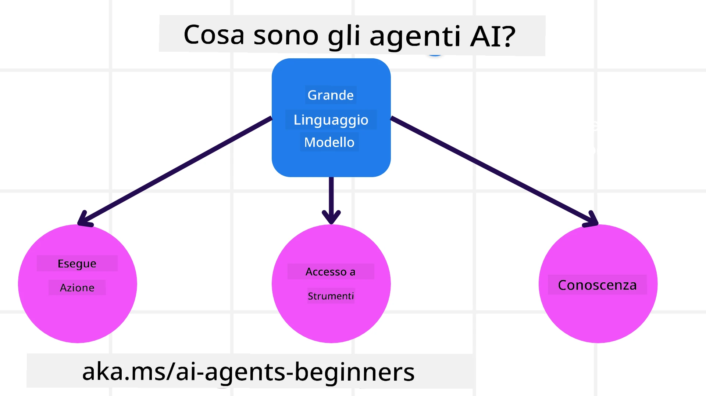
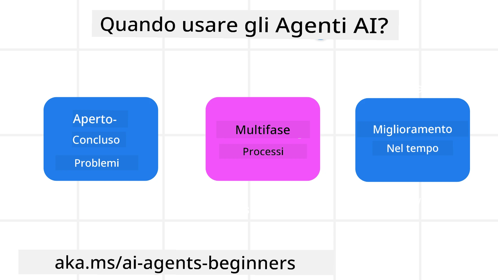

<!--
CO_OP_TRANSLATOR_METADATA:
{
  "original_hash": "cdd28bc00816d2773bb2b5968d782abc",
  "translation_date": "2025-11-11T11:12:01+00:00",
  "source_file": "01-intro-to-ai-agents/README.md",
  "language_code": "it"
}
-->

> _(Clicca sull'immagine sopra per vedere il video di questa lezione)_

# Introduzione agli Agenti AI e ai Casi d'Uso degli Agenti

Benvenuto al corso "Agenti AI per Principianti"! Questo corso fornisce conoscenze fondamentali e esempi pratici per costruire Agenti AI.

Unisciti alla <a href="https://discord.gg/kzRShWzttr" target="_blank">Community Discord di Azure AI</a> per incontrare altri studenti e sviluppatori di Agenti AI e per fare domande su questo corso.

Per iniziare il corso, cominciamo con una migliore comprensione di cosa sono gli Agenti AI e di come possiamo usarli nelle applicazioni e nei flussi di lavoro che costruiamo.

## Introduzione

Questa lezione tratta:

- Cosa sono gli Agenti AI e quali sono i diversi tipi di agenti?
- Quali casi d'uso sono più adatti agli Agenti AI e come possono aiutarci?
- Quali sono alcuni dei blocchi fondamentali nella progettazione di Soluzioni Agentiche?

## Obiettivi di Apprendimento
Dopo aver completato questa lezione, dovresti essere in grado di:

- Comprendere i concetti degli Agenti AI e come si differenziano da altre soluzioni AI.
- Applicare gli Agenti AI in modo efficiente.
- Progettare soluzioni agentiche in modo produttivo per utenti e clienti.

## Definizione di Agenti AI e Tipi di Agenti AI

### Cosa sono gli Agenti AI?

Gli Agenti AI sono **sistemi** che permettono ai **Modelli di Linguaggio Avanzati (LLMs)** di **eseguire azioni** estendendo le loro capacità, fornendo agli LLM **accesso a strumenti** e **conoscenze**.

Analizziamo questa definizione in parti più piccole:

- **Sistema** - È importante pensare agli agenti non come un singolo componente, ma come un sistema composto da molti componenti. A livello base, i componenti di un Agente AI sono:
  - **Ambiente** - Lo spazio definito in cui l'Agente AI opera. Ad esempio, se avessimo un agente AI per prenotazioni di viaggio, l'ambiente potrebbe essere il sistema di prenotazione che l'agente utilizza per completare i compiti.
  - **Sensori** - Gli ambienti contengono informazioni e forniscono feedback. Gli Agenti AI utilizzano sensori per raccogliere e interpretare queste informazioni sullo stato attuale dell'ambiente. Nell'esempio dell'agente di prenotazione viaggi, il sistema di prenotazione può fornire informazioni come la disponibilità di hotel o i prezzi dei voli.
  - **Attuatori** - Una volta che l'Agente AI riceve lo stato attuale dell'ambiente, per il compito corrente l'agente determina quale azione eseguire per modificare l'ambiente. Per l'agente di prenotazione viaggi, potrebbe essere prenotare una stanza disponibile per l'utente.

**Modelli di Linguaggio Avanzati** - Il concetto di agenti esisteva prima della creazione degli LLM. Il vantaggio di costruire Agenti AI con LLM è la loro capacità di interpretare il linguaggio umano e i dati. Questa capacità consente agli LLM di interpretare le informazioni ambientali e definire un piano per modificare l'ambiente.

**Eseguire Azioni** - Al di fuori dei sistemi di Agenti AI, gli LLM sono limitati a situazioni in cui l'azione consiste nel generare contenuti o informazioni basate su un prompt dell'utente. All'interno dei sistemi di Agenti AI, gli LLM possono svolgere compiti interpretando la richiesta dell'utente e utilizzando gli strumenti disponibili nel loro ambiente.

**Accesso agli Strumenti** - Gli strumenti a cui l'LLM ha accesso sono definiti da 1) l'ambiente in cui opera e 2) lo sviluppatore dell'Agente AI. Per il nostro esempio di agente di viaggio, gli strumenti dell'agente sono limitati dalle operazioni disponibili nel sistema di prenotazione e/o lo sviluppatore può limitare l'accesso dell'agente agli strumenti relativi ai voli.

**Memoria+Conoscenza** - La memoria può essere a breve termine nel contesto della conversazione tra l'utente e l'agente. A lungo termine, al di fuori delle informazioni fornite dall'ambiente, gli Agenti AI possono anche recuperare conoscenze da altri sistemi, servizi, strumenti e persino altri agenti. Nell'esempio dell'agente di viaggio, questa conoscenza potrebbe essere l'informazione sulle preferenze di viaggio dell'utente situata in un database clienti.

### I diversi tipi di agenti

Ora che abbiamo una definizione generale degli Agenti AI, esaminiamo alcuni tipi specifici di agenti e come potrebbero essere applicati a un agente AI per prenotazioni di viaggio.

| **Tipo di Agente**            | **Descrizione**                                                                                                                       | **Esempio**                                                                                                                                                                                                                   |
| ----------------------------- | ------------------------------------------------------------------------------------------------------------------------------------- | ----------------------------------------------------------------------------------------------------------------------------------------------------------------------------------------------------------------------------- |
| **Agenti Riflessi Semplici**  | Eseguono azioni immediate basate su regole predefinite.                                                                                | L'agente di viaggio interpreta il contesto dell'email e inoltra i reclami di viaggio al servizio clienti.                                                                                                                     |
| **Agenti Riflessi Basati su Modelli** | Eseguono azioni basate su un modello del mondo e sui cambiamenti a quel modello.                                                  | L'agente di viaggio dà priorità alle rotte con significativi cambiamenti di prezzo basandosi sull'accesso ai dati storici sui prezzi.                                                                                         |
| **Agenti Basati su Obiettivi** | Creano piani per raggiungere obiettivi specifici interpretando l'obiettivo e determinando le azioni necessarie per raggiungerlo.       | L'agente di viaggio prenota un viaggio determinando le disposizioni necessarie (auto, trasporto pubblico, voli) dalla posizione attuale alla destinazione.                                                                    |
| **Agenti Basati sull'Utilità** | Considerano le preferenze e valutano i compromessi numericamente per determinare come raggiungere gli obiettivi.                      | L'agente di viaggio massimizza l'utilità valutando convenienza vs. costo durante la prenotazione del viaggio.                                                                                                                 |
| **Agenti di Apprendimento**   | Migliorano nel tempo rispondendo ai feedback e regolando le azioni di conseguenza.                                                     | L'agente di viaggio migliora utilizzando il feedback dei clienti dai sondaggi post-viaggio per apportare modifiche alle prenotazioni future.                                                                                   |
| **Agenti Gerarchici**         | Presentano più agenti in un sistema a livelli, con agenti di livello superiore che suddividono i compiti in sottocompiti per gli agenti di livello inferiore. | L'agente di viaggio cancella un viaggio suddividendo il compito in sottocompiti (ad esempio, cancellare prenotazioni specifiche) e facendo completare i sottocompiti agli agenti di livello inferiore, che riportano all'agente di livello superiore. |
| **Sistemi Multi-Agente (MAS)** | Gli agenti completano i compiti in modo indipendente, sia cooperativamente che competitivamente.                                       | Cooperativo: Più agenti prenotano specifici servizi di viaggio come hotel, voli e intrattenimento. Competitivo: Più agenti gestiscono e competono su un calendario condiviso di prenotazioni di hotel per prenotare clienti nell'hotel. |

## Quando Usare gli Agenti AI

Nella sezione precedente, abbiamo utilizzato il caso d'uso dell'agente di viaggio per spiegare come i diversi tipi di agenti possono essere utilizzati in diversi scenari di prenotazione di viaggio. Continueremo a utilizzare questa applicazione durante il corso.

Esaminiamo i tipi di casi d'uso per cui gli Agenti AI sono più adatti:

- **Problemi Aperti** - permettendo all'LLM di determinare i passaggi necessari per completare un compito, poiché non sempre possono essere codificati in un flusso di lavoro.
- **Processi Multi-Step** - compiti che richiedono un livello di complessità in cui l'Agente AI deve utilizzare strumenti o informazioni in più turni invece di un singolo recupero.
- **Miglioramento nel Tempo** - compiti in cui l'agente può migliorare nel tempo ricevendo feedback dal suo ambiente o dagli utenti per fornire una migliore utilità.

Tratteremo più considerazioni sull'uso degli Agenti AI nella lezione "Costruire Agenti AI Affidabili".

## Fondamenti delle Soluzioni Agentiche

### Sviluppo degli Agenti

Il primo passo nella progettazione di un sistema di Agenti AI è definire gli strumenti, le azioni e i comportamenti. In questo corso, ci concentriamo sull'uso del **Servizio Azure AI Agent** per definire i nostri Agenti. Offre funzionalità come:

- Selezione di Modelli Open come OpenAI, Mistral e Llama
- Uso di Dati Licenziati tramite fornitori come Tripadvisor
- Uso di strumenti standardizzati OpenAPI 3.0

### Pattern Agentici

La comunicazione con gli LLM avviene tramite prompt. Data la natura semi-autonoma degli Agenti AI, non è sempre possibile o necessario ripromptare manualmente l'LLM dopo un cambiamento nell'ambiente. Utilizziamo **Pattern Agentici** che ci permettono di promptare l'LLM su più passaggi in modo più scalabile.

Questo corso è suddiviso in alcuni dei pattern agentici attualmente popolari.

### Framework Agentici

I Framework Agentici permettono agli sviluppatori di implementare pattern agentici tramite codice. Questi framework offrono modelli, plugin e strumenti per una migliore collaborazione degli Agenti AI. Questi vantaggi forniscono capacità di osservabilità e risoluzione dei problemi migliori per i sistemi di Agenti AI.

In questo corso, esploreremo il framework AutoGen basato sulla ricerca e il framework pronto per la produzione Agent di Semantic Kernel.

## Codici di Esempio

- Python: [Framework Agent](./code_samples/01-python-agent-framework.ipynb)
- .NET: [Framework Agent](./code_samples/01-dotnet-agent-framework.md)

## Hai altre domande sugli Agenti AI?

Unisciti al [Discord di Azure AI Foundry](https://aka.ms/ai-agents/discord) per incontrare altri studenti, partecipare agli orari d'ufficio e ottenere risposte alle tue domande sugli Agenti AI.

## Lezione Precedente

[Configurazione del Corso](../00-course-setup/README.md)

## Prossima Lezione

[Esplorare i Framework Agentici](../02-explore-agentic-frameworks/README.md)

---

<!-- CO-OP TRANSLATOR DISCLAIMER START -->
**Disclaimer**:  
Questo documento è stato tradotto utilizzando il servizio di traduzione AI [Co-op Translator](https://github.com/Azure/co-op-translator). Sebbene ci impegniamo per garantire l'accuratezza, si prega di notare che le traduzioni automatiche possono contenere errori o imprecisioni. Il documento originale nella sua lingua nativa dovrebbe essere considerato la fonte autorevole. Per informazioni critiche, si raccomanda una traduzione professionale umana. Non siamo responsabili per eventuali incomprensioni o interpretazioni errate derivanti dall'uso di questa traduzione.
<!-- CO-OP TRANSLATOR DISCLAIMER END -->