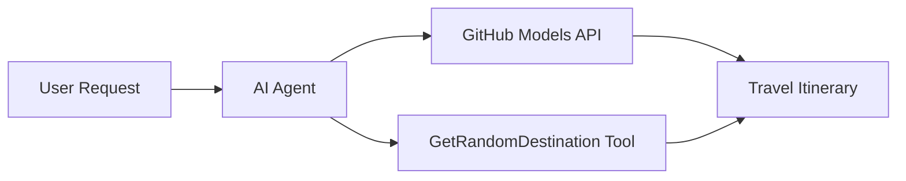

<!--
CO_OP_TRANSLATOR_METADATA:
{
  "original_hash": "5f351412e934f0833c8c821a0a60efaf",
  "translation_date": "2025-11-13T12:15:43+00:00",
  "source_file": "01-intro-to-ai-agents/code_samples/01-dotnet-agent-framework.md",
  "language_code": "it"
}
-->
# 🌍 Agente di Viaggio AI con Microsoft Agent Framework (.NET)

## 📋 Panoramica dello Scenario

Questo esempio dimostra come creare un agente intelligente per la pianificazione di viaggi utilizzando il Microsoft Agent Framework per .NET. L'agente può generare automaticamente itinerari personalizzati per gite giornaliere verso destinazioni casuali in tutto il mondo.

### Capacità principali:

- 🎲 **Selezione casuale della destinazione**: Utilizza uno strumento personalizzato per scegliere luoghi di vacanza
- 🗺️ **Pianificazione intelligente del viaggio**: Crea itinerari dettagliati giorno per giorno
- 🔄 **Streaming in tempo reale**: Supporta risposte immediate e in streaming
- 🛠️ **Integrazione di strumenti personalizzati**: Dimostra come estendere le capacità dell'agente

## 🔧 Architettura Tecnica

### Tecnologie principali

- **Microsoft Agent Framework**: Ultima implementazione .NET per lo sviluppo di agenti AI
- **Integrazione con i modelli GitHub**: Utilizza il servizio di inferenza dei modelli AI di GitHub
- **Compatibilità con l'API OpenAI**: Sfrutta le librerie client OpenAI con endpoint personalizzati
- **Configurazione sicura**: Gestione delle chiavi API basata sull'ambiente

### Componenti principali

1. **AIAgent**: L'orchestratore principale dell'agente che gestisce il flusso della conversazione
2. **Strumenti personalizzati**: Funzione `GetRandomDestination()` disponibile per l'agente
3. **Client di chat**: Interfaccia di conversazione supportata dai modelli GitHub
4. **Supporto streaming**: Capacità di generazione di risposte in tempo reale

### Modello di integrazione



## 🚀 Per iniziare

### Prerequisiti

- [.NET 10 SDK](https://dotnet.microsoft.com/download/dotnet/10.0) o superiore
- [Token di accesso API per i modelli GitHub](https://docs.github.com/github-models/github-models-at-scale/using-your-own-api-keys-in-github-models)

### Variabili di ambiente richieste

```bash
# zsh/bash
export GH_TOKEN=<your_github_token>
export GH_ENDPOINT=https://models.github.ai/inference
export GH_MODEL_ID=openai/gpt-5-mini
```

```powershell
# PowerShell
$env:GH_TOKEN = "<your_github_token>"
$env:GH_ENDPOINT = "https://models.github.ai/inference"
$env:GH_MODEL_ID = "openai/gpt-5-mini"
```

### Codice di esempio

Per eseguire l'esempio di codice,

```bash
# zsh/bash
chmod +x ./01-dotnet-agent-framework.cs
./01-dotnet-agent-framework.cs
```

Oppure utilizzando la CLI di dotnet:

```bash
dotnet run ./01-dotnet-agent-framework.cs
```

Consulta [`01-dotnet-agent-framework.cs`](../../../../01-intro-to-ai-agents/code_samples/01-dotnet-agent-framework.cs) per il codice completo.

```csharp
#!/usr/bin/dotnet run

#:package Microsoft.Extensions.AI@9.*
#:package Microsoft.Agents.AI.OpenAI@1.*-*

using System.ClientModel;
using System.ComponentModel;

using Microsoft.Agents.AI;
using Microsoft.Extensions.AI;

using OpenAI;

// Tool Function: Random Destination Generator
// This static method will be available to the agent as a callable tool
// The [Description] attribute helps the AI understand when to use this function
// This demonstrates how to create custom tools for AI agents
[Description("Provides a random vacation destination.")]
static string GetRandomDestination()
{
    // List of popular vacation destinations around the world
    // The agent will randomly select from these options
    var destinations = new List<string>
    {
        "Paris, France",
        "Tokyo, Japan",
        "New York City, USA",
        "Sydney, Australia",
        "Rome, Italy",
        "Barcelona, Spain",
        "Cape Town, South Africa",
        "Rio de Janeiro, Brazil",
        "Bangkok, Thailand",
        "Vancouver, Canada"
    };

    // Generate random index and return selected destination
    // Uses System.Random for simple random selection
    var random = new Random();
    int index = random.Next(destinations.Count);
    return destinations[index];
}

// Extract configuration from environment variables
// Retrieve the GitHub Models API endpoint, defaults to https://models.github.ai/inference if not specified
// Retrieve the model ID, defaults to openai/gpt-5-mini if not specified
// Retrieve the GitHub token for authentication, throws exception if not specified
var github_endpoint = Environment.GetEnvironmentVariable("GH_ENDPOINT") ?? "https://models.github.ai/inference";
var github_model_id = Environment.GetEnvironmentVariable("GH_MODEL_ID") ?? "openai/gpt-5-mini";
var github_token = Environment.GetEnvironmentVariable("GH_TOKEN") ?? throw new InvalidOperationException("GH_TOKEN is not set.");

// Configure OpenAI Client Options
// Create configuration options to point to GitHub Models endpoint
// This redirects OpenAI client calls to GitHub's model inference service
var openAIOptions = new OpenAIClientOptions()
{
    Endpoint = new Uri(github_endpoint)
};

// Initialize OpenAI Client with GitHub Models Configuration
// Create OpenAI client using GitHub token for authentication
// Configure it to use GitHub Models endpoint instead of OpenAI directly
var openAIClient = new OpenAIClient(new ApiKeyCredential(github_token), openAIOptions);

// Create AI Agent with Travel Planning Capabilities
// Initialize OpenAI client, get chat client for specified model, and create AI agent
// Configure agent with travel planning instructions and random destination tool
// The agent can now plan trips using the GetRandomDestination function
AIAgent agent = openAIClient
    .GetChatClient(github_model_id)
    .CreateAIAgent(
        instructions: "You are a helpful AI Agent that can help plan vacations for customers at random destinations",
        tools: [AIFunctionFactory.Create(GetRandomDestination)]
    );

// Execute Agent: Plan a Day Trip
// Run the agent with streaming enabled for real-time response display
// Shows the agent's thinking and response as it generates the content
// Provides better user experience with immediate feedback
await foreach (var update in agent.RunStreamingAsync("Plan me a day trip"))
{
    await Task.Delay(10);
    Console.Write(update);
}
```

## 🎓 Punti chiave

1. **Architettura dell'agente**: Il Microsoft Agent Framework offre un approccio pulito e tipizzato per la creazione di agenti AI in .NET
2. **Integrazione degli strumenti**: Le funzioni decorate con attributi `[Description]` diventano strumenti disponibili per l'agente
3. **Gestione della configurazione**: Le variabili di ambiente e la gestione sicura delle credenziali seguono le migliori pratiche di .NET
4. **Compatibilità con OpenAI**: L'integrazione con i modelli GitHub funziona perfettamente tramite API compatibili con OpenAI

## 🔗 Risorse aggiuntive

- [Documentazione Microsoft Agent Framework](https://learn.microsoft.com/agent-framework)
- [Marketplace dei modelli GitHub](https://github.com/marketplace?type=models)
- [Microsoft.Extensions.AI](https://learn.microsoft.com/dotnet/ai/microsoft-extensions-ai)
- [.NET Single File Apps](https://devblogs.microsoft.com/dotnet/announcing-dotnet-run-app)

---

<!-- CO-OP TRANSLATOR DISCLAIMER START -->
**Clausola di esclusione della responsabilità**:  
Questo documento è stato tradotto utilizzando il servizio di traduzione automatica [Co-op Translator](https://github.com/Azure/co-op-translator). Sebbene ci impegniamo per garantire l'accuratezza, si prega di notare che le traduzioni automatiche possono contenere errori o imprecisioni. Il documento originale nella sua lingua nativa deve essere considerato la fonte autorevole. Per informazioni critiche, si raccomanda una traduzione professionale umana. Non siamo responsabili per eventuali incomprensioni o interpretazioni errate derivanti dall'uso di questa traduzione.
<!-- CO-OP TRANSLATOR DISCLAIMER END -->