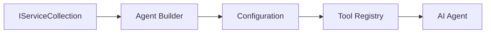

<!--
CO_OP_TRANSLATOR_METADATA:
{
  "original_hash": "bcc874e190347bd6a095aed56dc16de8",
  "translation_date": "2025-11-13T12:19:07+00:00",
  "source_file": "03-agentic-design-patterns/code_samples/03-dotnet-agent-framework.md",
  "language_code": "it"
}
-->
# 🎨 Modelli di Design Agentic con i Modelli GitHub (.NET)

## 📋 Obiettivi di Apprendimento

Questo esempio illustra modelli di design di livello enterprise per costruire agenti intelligenti utilizzando il Microsoft Agent Framework in .NET con l'integrazione dei Modelli GitHub. Imparerai modelli professionali e approcci architetturali che rendono gli agenti pronti per la produzione, manutenibili e scalabili.

### Modelli di Design Enterprise

- 🏭 **Factory Pattern**: Creazione standardizzata di agenti con dependency injection
- 🔧 **Builder Pattern**: Configurazione e impostazione fluida degli agenti
- 🧵 **Modelli Thread-Safe**: Gestione concorrente delle conversazioni
- 📋 **Repository Pattern**: Gestione organizzata di strumenti e capacità

## 🎯 Vantaggi Architetturali Specifici di .NET

### Funzionalità Enterprise

- **Tipizzazione Forte**: Validazione a tempo di compilazione e supporto IntelliSense
- **Dependency Injection**: Integrazione con il contenitore DI integrato
- **Gestione della Configurazione**: Modelli IConfiguration e Options
- **Async/Await**: Supporto di prima classe per la programmazione asincrona

### Modelli Pronti per la Produzione

- **Integrazione del Logging**: Supporto ILogger e logging strutturato
- **Controlli di Salute**: Monitoraggio e diagnostica integrati
- **Validazione della Configurazione**: Tipizzazione forte con annotazioni dei dati
- **Gestione degli Errori**: Gestione strutturata delle eccezioni

## 🔧 Architettura Tecnica

### Componenti Core di .NET

- **Microsoft.Extensions.AI**: Astrazioni unificate per i servizi AI
- **Microsoft.Agents.AI**: Framework di orchestrazione per agenti enterprise
- **Integrazione Modelli GitHub**: Modelli di client API ad alte prestazioni
- **Sistema di Configurazione**: Integrazione di appsettings.json e ambiente

### Implementazione dei Modelli di Design



## 🏗️ Modelli Enterprise Dimostrati

### 1. **Modelli Creazionali**

- **Agent Factory**: Creazione centralizzata di agenti con configurazione coerente
- **Builder Pattern**: API fluente per configurazioni complesse di agenti
- **Singleton Pattern**: Gestione delle risorse e configurazioni condivise
- **Dependency Injection**: Accoppiamento debole e testabilità

### 2. **Modelli Comportamentali**

- **Strategy Pattern**: Strategie intercambiabili per l'esecuzione degli strumenti
- **Command Pattern**: Operazioni degli agenti incapsulate con undo/redo
- **Observer Pattern**: Gestione del ciclo di vita degli agenti basata su eventi
- **Template Method**: Workflow standardizzati per l'esecuzione degli agenti

### 3. **Modelli Strutturali**

- **Adapter Pattern**: Livello di integrazione API dei Modelli GitHub
- **Decorator Pattern**: Potenziamento delle capacità degli agenti
- **Facade Pattern**: Interfacce semplificate per l'interazione con gli agenti
- **Proxy Pattern**: Lazy loading e caching per le prestazioni

## 📚 Principi di Design in .NET

### Principi SOLID

- **Single Responsibility**: Ogni componente ha uno scopo chiaro
- **Open/Closed**: Estendibile senza modifiche
- **Liskov Substitution**: Implementazioni degli strumenti basate su interfacce
- **Interface Segregation**: Interfacce focalizzate e coese
- **Dependency Inversion**: Dipendenza da astrazioni, non da implementazioni concrete

### Architettura Pulita

- **Domain Layer**: Astrazioni core per agenti e strumenti
- **Application Layer**: Orchestrazione e workflow degli agenti
- **Infrastructure Layer**: Integrazione dei Modelli GitHub e servizi esterni
- **Presentation Layer**: Interazione con l'utente e formattazione delle risposte

## 🔒 Considerazioni Enterprise

### Sicurezza

- **Gestione delle Credenziali**: Gestione sicura delle chiavi API con IConfiguration
- **Validazione degli Input**: Tipizzazione forte e validazione con annotazioni dei dati
- **Sanitizzazione degli Output**: Elaborazione e filtraggio sicuro delle risposte
- **Audit Logging**: Tracciamento completo delle operazioni

### Prestazioni

- **Modelli Asincroni**: Operazioni I/O non bloccanti
- **Pooling delle Connessioni**: Gestione efficiente dei client HTTP
- **Caching**: Caching delle risposte per migliorare le prestazioni
- **Gestione delle Risorse**: Modelli corretti di smaltimento e pulizia

### Scalabilità

- **Thread Safety**: Supporto per l'esecuzione concorrente degli agenti
- **Pooling delle Risorse**: Utilizzo efficiente delle risorse
- **Gestione del Carico**: Limitazione della velocità e gestione della pressione
- **Monitoraggio**: Metriche di prestazione e controlli di salute

## 🚀 Distribuzione in Produzione

- **Gestione della Configurazione**: Impostazioni specifiche per l'ambiente
- **Strategia di Logging**: Logging strutturato con ID di correlazione
- **Gestione degli Errori**: Gestione globale delle eccezioni con recupero adeguato
- **Monitoraggio**: Application Insights e contatori di prestazione
- **Testing**: Modelli di test unitari, di integrazione e di carico

Pronto a costruire agenti intelligenti di livello enterprise con .NET? Progettiamo qualcosa di robusto! 🏢✨

## 🚀 Per Iniziare

### Prerequisiti

- [.NET 10 SDK](https://dotnet.microsoft.com/download/dotnet/10.0) o superiore
- [Token di accesso API Modelli GitHub](https://docs.github.com/github-models/github-models-at-scale/using-your-own-api-keys-in-github-models)

### Variabili d'Ambiente Necessarie

```bash
# zsh/bash
export GH_TOKEN=<your_github_token>
export GH_ENDPOINT=https://models.github.ai/inference
export GH_MODEL_ID=openai/gpt-5-mini
```

```powershell
# PowerShell
$env:GH_TOKEN = "<your_github_token>"
$env:GH_ENDPOINT = "https://models.github.ai/inference"
$env:GH_MODEL_ID = "openai/gpt-5-mini"
```

### Codice di Esempio

Per eseguire l'esempio di codice,

```bash
# zsh/bash
chmod +x ./03-dotnet-agent-framework.cs
./03-dotnet-agent-framework.cs
```

Oppure utilizzando la CLI di dotnet:

```bash
dotnet run ./03-dotnet-agent-framework.cs
```

Consulta [`03-dotnet-agent-framework.cs`](../../../../03-agentic-design-patterns/code_samples/03-dotnet-agent-framework.cs) per il codice completo.

```csharp
#!/usr/bin/dotnet run

#:package Microsoft.Extensions.AI@10.*
#:package Microsoft.Agents.AI.OpenAI@1.*-*

using System.ClientModel;
using System.ComponentModel;

using Microsoft.Agents.AI;
using Microsoft.Extensions.AI;

using OpenAI;

// Tool Function: Random Destination Generator
// This static method will be available to the agent as a callable tool
// The [Description] attribute helps the AI understand when to use this function
// This demonstrates how to create custom tools for AI agents
[Description("Provides a random vacation destination.")]
static string GetRandomDestination()
{
    // List of popular vacation destinations around the world
    // The agent will randomly select from these options
    var destinations = new List<string>
    {
        "Paris, France",
        "Tokyo, Japan",
        "New York City, USA",
        "Sydney, Australia",
        "Rome, Italy",
        "Barcelona, Spain",
        "Cape Town, South Africa",
        "Rio de Janeiro, Brazil",
        "Bangkok, Thailand",
        "Vancouver, Canada"
    };

    // Generate random index and return selected destination
    // Uses System.Random for simple random selection
    var random = new Random();
    int index = random.Next(destinations.Count);
    return destinations[index];
}

// Extract configuration from environment variables
// Retrieve the GitHub Models API endpoint, defaults to https://models.github.ai/inference if not specified
// Retrieve the model ID, defaults to openai/gpt-5-mini if not specified
// Retrieve the GitHub token for authentication, throws exception if not specified
var github_endpoint = Environment.GetEnvironmentVariable("GH_ENDPOINT") ?? "https://models.github.ai/inference";
var github_model_id = Environment.GetEnvironmentVariable("GH_MODEL_ID") ?? "openai/gpt-5-mini";
var github_token = Environment.GetEnvironmentVariable("GH_TOKEN") ?? throw new InvalidOperationException("GH_TOKEN is not set.");

// Configure OpenAI Client Options
// Create configuration options to point to GitHub Models endpoint
// This redirects OpenAI client calls to GitHub's model inference service
var openAIOptions = new OpenAIClientOptions()
{
    Endpoint = new Uri(github_endpoint)
};

// Initialize OpenAI Client with GitHub Models Configuration
// Create OpenAI client using GitHub token for authentication
// Configure it to use GitHub Models endpoint instead of OpenAI directly
var openAIClient = new OpenAIClient(new ApiKeyCredential(github_token), openAIOptions);

// Define Agent Identity and Comprehensive Instructions
// Agent name for identification and logging purposes
var AGENT_NAME = "TravelAgent";

// Detailed instructions that define the agent's personality, capabilities, and behavior
// This system prompt shapes how the agent responds and interacts with users
var AGENT_INSTRUCTIONS = """
You are a helpful AI Agent that can help plan vacations for customers.

Important: When users specify a destination, always plan for that location. Only suggest random destinations when the user hasn't specified a preference.

When the conversation begins, introduce yourself with this message:
"Hello! I'm your TravelAgent assistant. I can help plan vacations and suggest interesting destinations for you. Here are some things you can ask me:
1. Plan a day trip to a specific location
2. Suggest a random vacation destination
3. Find destinations with specific features (beaches, mountains, historical sites, etc.)
4. Plan an alternative trip if you don't like my first suggestion

What kind of trip would you like me to help you plan today?"

Always prioritize user preferences. If they mention a specific destination like "Bali" or "Paris," focus your planning on that location rather than suggesting alternatives.
""";

// Create AI Agent with Advanced Travel Planning Capabilities
// Initialize complete agent pipeline: OpenAI client → Chat client → AI agent
// Configure agent with name, detailed instructions, and available tools
// This demonstrates the .NET agent creation pattern with full configuration
AIAgent agent = openAIClient
    .GetChatClient(github_model_id)
    .CreateAIAgent(
        name: AGENT_NAME,
        instructions: AGENT_INSTRUCTIONS,
        tools: [AIFunctionFactory.Create(GetRandomDestination)]
    );

// Create New Conversation Thread for Context Management
// Initialize a new conversation thread to maintain context across multiple interactions
// Threads enable the agent to remember previous exchanges and maintain conversational state
// This is essential for multi-turn conversations and contextual understanding
AgentThread thread = agent.GetNewThread();

// Execute Agent: First Travel Planning Request
// Run the agent with an initial request that will likely trigger the random destination tool
// The agent will analyze the request, use the GetRandomDestination tool, and create an itinerary
// Using the thread parameter maintains conversation context for subsequent interactions
await foreach (var update in agent.RunStreamingAsync("Plan me a day trip", thread))
{
    await Task.Delay(10);
    Console.Write(update);
}

Console.WriteLine();

// Execute Agent: Follow-up Request with Context Awareness
// Demonstrate contextual conversation by referencing the previous response
// The agent remembers the previous destination suggestion and will provide an alternative
// This showcases the power of conversation threads and contextual understanding in .NET agents
await foreach (var update in agent.RunStreamingAsync("I don't like that destination. Plan me another vacation.", thread))
{
    await Task.Delay(10);
    Console.Write(update);
}
```

---

<!-- CO-OP TRANSLATOR DISCLAIMER START -->
**Disclaimer (Avvertenza)**:  
Questo documento è stato tradotto utilizzando il servizio di traduzione automatica [Co-op Translator](https://github.com/Azure/co-op-translator). Sebbene ci impegniamo per garantire l'accuratezza, si prega di notare che le traduzioni automatiche possono contenere errori o imprecisioni. Il documento originale nella sua lingua madre dovrebbe essere considerato la fonte autorevole. Per informazioni critiche, si consiglia una traduzione professionale umana. Non siamo responsabili per eventuali incomprensioni o interpretazioni errate derivanti dall'uso di questa traduzione.
<!-- CO-OP TRANSLATOR DISCLAIMER END -->