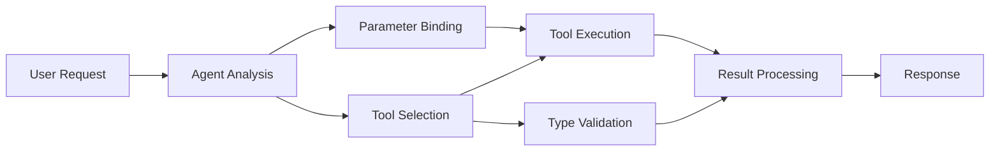

<!--
CO_OP_TRANSLATOR_METADATA:
{
  "original_hash": "91d6061e402489603f2ec8b528cae59b",
  "translation_date": "2025-11-18T17:23:26+00:00",
  "source_file": "04-tool-use/code_samples/04-dotnet-agent-framework.md",
  "language_code": "it"
}
-->
# 🛠️ Uso Avanzato degli Strumenti con i Modelli GitHub (.NET)

## 📋 Obiettivi di Apprendimento

Questo notebook dimostra modelli di integrazione di strumenti di livello enterprise utilizzando il Microsoft Agent Framework in .NET con i Modelli GitHub. Imparerai a costruire agenti sofisticati con strumenti specializzati multipli, sfruttando il forte typing di C# e le funzionalità enterprise di .NET.

### Capacità Avanzate degli Strumenti che Apprenderai

- 🔧 **Architettura Multi-Strumento**: Creare agenti con capacità specializzate multiple
- 🎯 **Esecuzione di Strumenti Type-Safe**: Sfruttare la validazione a tempo di compilazione di C#
- 📊 **Modelli di Strumenti Enterprise**: Progettazione di strumenti pronta per la produzione e gestione degli errori
- 🔗 **Composizione degli Strumenti**: Combinare strumenti per flussi di lavoro aziendali complessi

## 🎯 Vantaggi dell'Architettura degli Strumenti in .NET

### Caratteristiche degli Strumenti Enterprise

- **Validazione a Tempo di Compilazione**: Il forte typing garantisce la correttezza dei parametri degli strumenti
- **Dependency Injection**: Integrazione del contenitore IoC per la gestione degli strumenti
- **Pattern Async/Await**: Esecuzione non bloccante degli strumenti con gestione adeguata delle risorse
- **Logging Strutturato**: Integrazione del logging per il monitoraggio dell'esecuzione degli strumenti

### Modelli Pronti per la Produzione

- **Gestione delle Eccezioni**: Gestione completa degli errori con eccezioni tipizzate
- **Gestione delle Risorse**: Pattern di smaltimento adeguati e gestione della memoria
- **Monitoraggio delle Prestazioni**: Metriche integrate e contatori di prestazioni
- **Gestione della Configurazione**: Configurazione type-safe con validazione

## 🔧 Architettura Tecnica

### Componenti Principali degli Strumenti in .NET

- **Microsoft.Extensions.AI**: Livello di astrazione unificato per gli strumenti
- **Microsoft.Agents.AI**: Orchestrazione di strumenti di livello enterprise
- **Integrazione dei Modelli GitHub**: Client API ad alte prestazioni con pooling delle connessioni

### Pipeline di Esecuzione degli Strumenti



## 🛠️ Categorie e Modelli di Strumenti

### 1. **Strumenti di Elaborazione Dati**

- **Validazione degli Input**: Forte typing con annotazioni dei dati
- **Operazioni di Trasformazione**: Conversione e formattazione dei dati type-safe
- **Logica Aziendale**: Strumenti di calcolo e analisi specifici del dominio
- **Formattazione degli Output**: Generazione di risposte strutturate

### 2. **Strumenti di Integrazione**

- **Connettori API**: Integrazione di servizi RESTful con HttpClient
- **Strumenti per Database**: Integrazione di Entity Framework per l'accesso ai dati
- **Operazioni su File**: Operazioni sicure sul file system con validazione
- **Servizi Esterni**: Modelli di integrazione con servizi di terze parti

### 3. **Strumenti di Utilità**

- **Elaborazione Testuale**: Utilità per la manipolazione e formattazione delle stringhe
- **Operazioni su Date/Ora**: Calcoli su date/ora sensibili alla cultura
- **Strumenti Matematici**: Calcoli di precisione e operazioni statistiche
- **Strumenti di Validazione**: Validazione delle regole aziendali e verifica dei dati

Pronto a costruire agenti di livello enterprise con potenti capacità di strumenti type-safe in .NET? Progettiamo soluzioni professionali! 🏢⚡

## 🚀 Per Iniziare

### Prerequisiti

- [.NET 10 SDK](https://dotnet.microsoft.com/download/dotnet/10.0) o superiore
- [Token di accesso API Modelli GitHub](https://docs.github.com/github-models/github-models-at-scale/using-your-own-api-keys-in-github-models)

### Variabili d'Ambiente Richieste

```bash
# zsh/bash
export GH_TOKEN=<your_github_token>
export GH_ENDPOINT=https://models.github.ai/inference
export GH_MODEL_ID=openai/gpt-5-mini
```

```powershell
# PowerShell
$env:GH_TOKEN = "<your_github_token>"
$env:GH_ENDPOINT = "https://models.github.ai/inference"
$env:GH_MODEL_ID = "openai/gpt-5-mini"
```

### Codice di Esempio

Per eseguire l'esempio di codice,

```bash
# zsh/bash
chmod +x ./04-dotnet-agent-framework.cs
./04-dotnet-agent-framework.cs
```

Oppure utilizzando la CLI di dotnet:

```bash
dotnet run ./04-dotnet-agent-framework.cs
```

Consulta [`04-dotnet-agent-framework.cs`](../../../../04-tool-use/code_samples/04-dotnet-agent-framework.cs) per il codice completo.

```csharp
#!/usr/bin/dotnet run

#:package Microsoft.Extensions.AI@10.*
#:package Microsoft.Agents.AI.OpenAI@1.*-*

using System.ClientModel;
using System.ComponentModel;

using Microsoft.Agents.AI;
using Microsoft.Extensions.AI;

using OpenAI;

// Tool Function: Random Destination Generator
// This static method will be available to the agent as a callable tool
// The [Description] attribute helps the AI understand when to use this function
// This demonstrates how to create custom tools for AI agents
[Description("Provides a random vacation destination.")]
static string GetRandomDestination()
{
    // List of popular vacation destinations around the world
    // The agent will randomly select from these options
    var destinations = new List<string>
    {
        "Paris, France",
        "Tokyo, Japan",
        "New York City, USA",
        "Sydney, Australia",
        "Rome, Italy",
        "Barcelona, Spain",
        "Cape Town, South Africa",
        "Rio de Janeiro, Brazil",
        "Bangkok, Thailand",
        "Vancouver, Canada"
    };

    // Generate random index and return selected destination
    // Uses System.Random for simple random selection
    var random = new Random();
    int index = random.Next(destinations.Count);
    return destinations[index];
}

// Extract configuration from environment variables
// Retrieve the GitHub Models API endpoint, defaults to https://models.github.ai/inference if not specified
// Retrieve the model ID, defaults to openai/gpt-5-mini if not specified
// Retrieve the GitHub token for authentication, throws exception if not specified
var github_endpoint = Environment.GetEnvironmentVariable("GH_ENDPOINT") ?? "https://models.github.ai/inference";
var github_model_id = Environment.GetEnvironmentVariable("GH_MODEL_ID") ?? "openai/gpt-5-mini";
var github_token = Environment.GetEnvironmentVariable("GH_TOKEN") ?? throw new InvalidOperationException("GH_TOKEN is not set.");

// Configure OpenAI Client Options
// Create configuration options to point to GitHub Models endpoint
// This redirects OpenAI client calls to GitHub's model inference service
var openAIOptions = new OpenAIClientOptions()
{
    Endpoint = new Uri(github_endpoint)
};

// Initialize OpenAI Client with GitHub Models Configuration
// Create OpenAI client using GitHub token for authentication
// Configure it to use GitHub Models endpoint instead of OpenAI directly
var openAIClient = new OpenAIClient(new ApiKeyCredential(github_token), openAIOptions);

// Define Agent Identity and Comprehensive Instructions
// Agent name for identification and logging purposes
var AGENT_NAME = "TravelAgent";

// Detailed instructions that define the agent's personality, capabilities, and behavior
// This system prompt shapes how the agent responds and interacts with users
var AGENT_INSTRUCTIONS = """
You are a helpful AI Agent that can help plan vacations for customers.

Important: When users specify a destination, always plan for that location. Only suggest random destinations when the user hasn't specified a preference.

When the conversation begins, introduce yourself with this message:
"Hello! I'm your TravelAgent assistant. I can help plan vacations and suggest interesting destinations for you. Here are some things you can ask me:
1. Plan a day trip to a specific location
2. Suggest a random vacation destination
3. Find destinations with specific features (beaches, mountains, historical sites, etc.)
4. Plan an alternative trip if you don't like my first suggestion

What kind of trip would you like me to help you plan today?"

Always prioritize user preferences. If they mention a specific destination like "Bali" or "Paris," focus your planning on that location rather than suggesting alternatives.
""";

// Create AI Agent with Advanced Travel Planning Capabilities
// Initialize complete agent pipeline: OpenAI client → Chat client → AI agent
// Configure agent with name, detailed instructions, and available tools
// This demonstrates the .NET agent creation pattern with full configuration
AIAgent agent = openAIClient
    .GetChatClient(github_model_id)
    .CreateAIAgent(
        name: AGENT_NAME,
        instructions: AGENT_INSTRUCTIONS,
        tools: [AIFunctionFactory.Create(GetRandomDestination)]
    );

// Create New Conversation Thread for Context Management
// Initialize a new conversation thread to maintain context across multiple interactions
// Threads enable the agent to remember previous exchanges and maintain conversational state
// This is essential for multi-turn conversations and contextual understanding
AgentThread thread = agent.GetNewThread();

// Execute Agent: First Travel Planning Request
// Run the agent with an initial request that will likely trigger the random destination tool
// The agent will analyze the request, use the GetRandomDestination tool, and create an itinerary
// Using the thread parameter maintains conversation context for subsequent interactions
await foreach (var update in agent.RunStreamingAsync("Plan me a day trip", thread))
{
    await Task.Delay(10);
    Console.Write(update);
}

Console.WriteLine();

// Execute Agent: Follow-up Request with Context Awareness
// Demonstrate contextual conversation by referencing the previous response
// The agent remembers the previous destination suggestion and will provide an alternative
// This showcases the power of conversation threads and contextual understanding in .NET agents
await foreach (var update in agent.RunStreamingAsync("I don't like that destination. Plan me another vacation.", thread))
{
    await Task.Delay(10);
    Console.Write(update);
}
```

---

<!-- CO-OP TRANSLATOR DISCLAIMER START -->
**Disclaimer**:  
Questo documento è stato tradotto utilizzando il servizio di traduzione AI [Co-op Translator](https://github.com/Azure/co-op-translator). Sebbene ci impegniamo per garantire l'accuratezza, si prega di notare che le traduzioni automatiche possono contenere errori o imprecisioni. Il documento originale nella sua lingua nativa dovrebbe essere considerato la fonte autorevole. Per informazioni critiche, si raccomanda una traduzione professionale umana. Non siamo responsabili per eventuali incomprensioni o interpretazioni errate derivanti dall'uso di questa traduzione.
<!-- CO-OP TRANSLATOR DISCLAIMER END -->