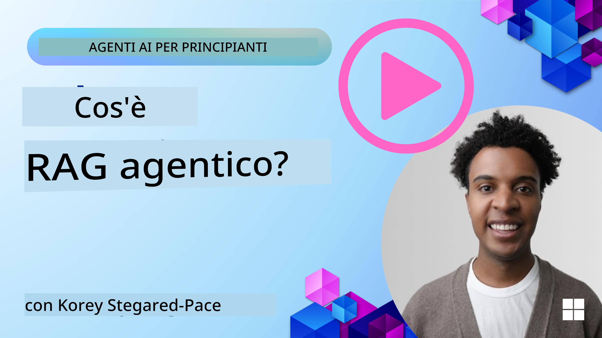
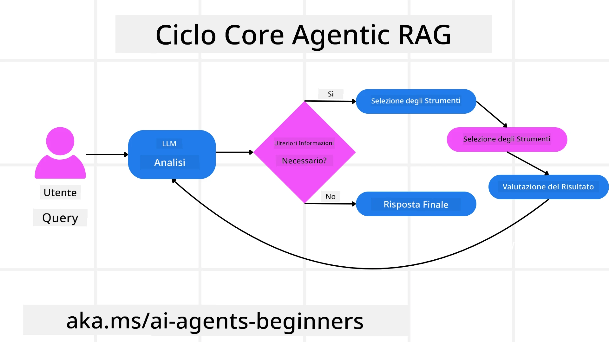
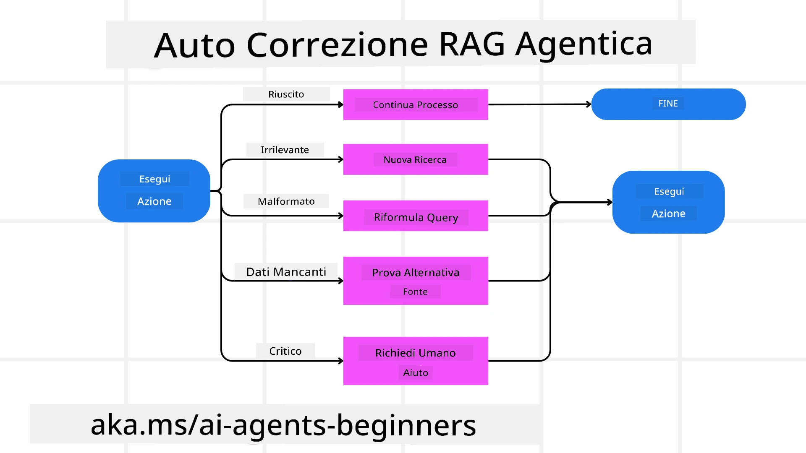
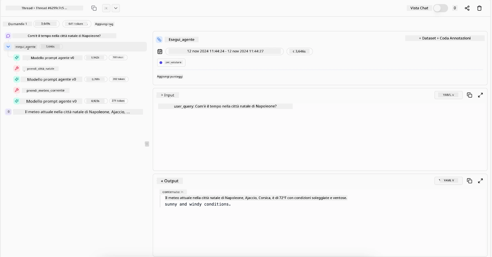

<!--
CO_OP_TRANSLATOR_METADATA:
{
  "original_hash": "0ebf6b2290db55dbf2d10cc49655523b",
  "translation_date": "2025-09-30T06:58:18+00:00",
  "source_file": "05-agentic-rag/README.md",
  "language_code": "it"
}
-->

> _(Clicca sull'immagine sopra per vedere il video di questa lezione)_

# Agentic RAG

Questa lezione offre una panoramica completa su Agentic Retrieval-Augmented Generation (Agentic RAG), un paradigma emergente dell'IA in cui i modelli di linguaggio di grandi dimensioni (LLM) pianificano autonomamente i loro prossimi passi mentre estraggono informazioni da fonti esterne. A differenza dei modelli statici di recupero e lettura, Agentic RAG prevede chiamate iterative al LLM, intervallate da chiamate a strumenti o funzioni e output strutturati. Il sistema valuta i risultati, perfeziona le query, utilizza strumenti aggiuntivi se necessario e continua questo ciclo fino a raggiungere una soluzione soddisfacente.

## Introduzione

Questa lezione coprirà:

- **Comprendere Agentic RAG:** Scopri il paradigma emergente dell'IA in cui i modelli di linguaggio di grandi dimensioni (LLM) pianificano autonomamente i loro prossimi passi mentre estraggono informazioni da fonti di dati esterne.
- **Stile Iterativo Maker-Checker:** Comprendi il ciclo di chiamate iterative al LLM, intervallate da chiamate a strumenti o funzioni e output strutturati, progettato per migliorare la correttezza e gestire query malformate.
- **Esplorare Applicazioni Pratiche:** Identifica scenari in cui Agentic RAG eccelle, come ambienti orientati alla correttezza, interazioni complesse con database e flussi di lavoro estesi.

## Obiettivi di Apprendimento

Dopo aver completato questa lezione, saprai come/comprenderai:

- **Comprendere Agentic RAG:** Scopri il paradigma emergente dell'IA in cui i modelli di linguaggio di grandi dimensioni (LLM) pianificano autonomamente i loro prossimi passi mentre estraggono informazioni da fonti di dati esterne.
- **Stile Iterativo Maker-Checker:** Comprendi il concetto di un ciclo di chiamate iterative al LLM, intervallate da chiamate a strumenti o funzioni e output strutturati, progettato per migliorare la correttezza e gestire query malformate.
- **Possedere il Processo di Ragionamento:** Comprendi la capacità del sistema di gestire autonomamente il proprio processo di ragionamento, prendendo decisioni su come affrontare i problemi senza affidarsi a percorsi predefiniti.
- **Flusso di Lavoro:** Comprendi come un modello agentico decide autonomamente di recuperare rapporti sulle tendenze di mercato, identificare dati sui concorrenti, correlare metriche di vendita interne, sintetizzare i risultati e valutare la strategia.
- **Cicli Iterativi, Integrazione di Strumenti e Memoria:** Scopri la dipendenza del sistema da un modello di interazione ciclica, mantenendo stato e memoria tra i passaggi per evitare cicli ripetitivi e prendere decisioni informate.
- **Gestione dei Modi di Fallimento e Auto-Correzione:** Esplora i meccanismi di auto-correzione robusti del sistema, inclusi iterazione e re-query, utilizzo di strumenti diagnostici e ricorso alla supervisione umana.
- **Limiti dell'Agenzia:** Comprendi le limitazioni di Agentic RAG, concentrandoti sull'autonomia specifica del dominio, la dipendenza dall'infrastruttura e il rispetto delle regole di sicurezza.
- **Casi d'Uso Pratici e Valore:** Identifica scenari in cui Agentic RAG eccelle, come ambienti orientati alla correttezza, interazioni complesse con database e flussi di lavoro estesi.
- **Governance, Trasparenza e Fiducia:** Scopri l'importanza della governance e della trasparenza, inclusi ragionamenti spiegabili, controllo dei bias e supervisione umana.

## Cos'è Agentic RAG?

Agentic Retrieval-Augmented Generation (Agentic RAG) è un paradigma emergente dell'IA in cui i modelli di linguaggio di grandi dimensioni (LLM) pianificano autonomamente i loro prossimi passi mentre estraggono informazioni da fonti esterne. A differenza dei modelli statici di recupero e lettura, Agentic RAG prevede chiamate iterative al LLM, intervallate da chiamate a strumenti o funzioni e output strutturati. Il sistema valuta i risultati, perfeziona le query, utilizza strumenti aggiuntivi se necessario e continua questo ciclo fino a raggiungere una soluzione soddisfacente. Questo stile iterativo "maker-checker" migliora la correttezza, gestisce query malformate e garantisce risultati di alta qualità.

Il sistema gestisce attivamente il proprio processo di ragionamento, riscrivendo query fallite, scegliendo metodi di recupero diversi e integrando più strumenti—come la ricerca vettoriale in Azure AI Search, database SQL o API personalizzate—prima di finalizzare la risposta. La qualità distintiva di un sistema agentico è la sua capacità di gestire autonomamente il proprio processo di ragionamento. Le implementazioni tradizionali di RAG si basano su percorsi predefiniti, ma un sistema agentico determina autonomamente la sequenza di passaggi in base alla qualità delle informazioni che trova.

## Definizione di Agentic Retrieval-Augmented Generation (Agentic RAG)

Agentic Retrieval-Augmented Generation (Agentic RAG) è un paradigma emergente nello sviluppo dell'IA in cui i LLM non solo estraggono informazioni da fonti di dati esterne, ma pianificano anche autonomamente i loro prossimi passi. A differenza dei modelli statici di recupero e lettura o delle sequenze di prompt attentamente scriptate, Agentic RAG prevede un ciclo di chiamate iterative al LLM, intervallate da chiamate a strumenti o funzioni e output strutturati. Ad ogni passaggio, il sistema valuta i risultati ottenuti, decide se perfezionare le query, utilizza strumenti aggiuntivi se necessario e continua questo ciclo fino a raggiungere una soluzione soddisfacente.

Questo stile iterativo "maker-checker" è progettato per migliorare la correttezza, gestire query malformate verso database strutturati (es. NL2SQL) e garantire risultati bilanciati e di alta qualità. Piuttosto che affidarsi esclusivamente a catene di prompt attentamente progettate, il sistema gestisce attivamente il proprio processo di ragionamento. Può riscrivere query che falliscono, scegliere metodi di recupero diversi e integrare più strumenti—come la ricerca vettoriale in Azure AI Search, database SQL o API personalizzate—prima di finalizzare la risposta. Questo elimina la necessità di framework di orchestrazione eccessivamente complessi. Invece, un ciclo relativamente semplice di "chiamata LLM → utilizzo strumento → chiamata LLM → …" può produrre output sofisticati e ben fondati.

## Gestire il Processo di Ragionamento

La qualità distintiva che rende un sistema "agentico" è la sua capacità di gestire autonomamente il proprio processo di ragionamento. Le implementazioni tradizionali di RAG spesso dipendono da percorsi predefiniti da parte degli esseri umani: una catena di pensieri che delinea cosa recuperare e quando. Ma quando un sistema è veramente agentico, decide internamente come affrontare il problema. Non sta solo eseguendo uno script; sta determinando autonomamente la sequenza di passaggi in base alla qualità delle informazioni che trova. 

Ad esempio, se gli viene chiesto di creare una strategia di lancio di un prodotto, non si basa esclusivamente su un prompt che descrive l'intero flusso di lavoro di ricerca e decisione. Invece, il modello agentico decide autonomamente di:

1. Recuperare rapporti sulle tendenze di mercato attuali utilizzando Bing Web Grounding.
2. Identificare dati rilevanti sui concorrenti utilizzando Azure AI Search.
3. Correlare metriche di vendita interne storiche utilizzando Azure SQL Database.
4. Sintetizzare i risultati in una strategia coesa orchestrata tramite Azure OpenAI Service.
5. Valutare la strategia per lacune o incoerenze, avviando un altro ciclo di recupero se necessario.

Tutti questi passaggi—perfezionare le query, scegliere le fonti, iterare fino a essere "soddisfatti" della risposta—sono decisi dal modello, non pre-scriptati da un essere umano.

## Cicli Iterativi, Integrazione di Strumenti e Memoria

Un sistema agentico si basa su un modello di interazione ciclica:

- **Chiamata Iniziale:** L'obiettivo dell'utente (aka. prompt dell'utente) viene presentato al LLM.
- **Invocazione di Strumenti:** Se il modello identifica informazioni mancanti o istruzioni ambigue, seleziona uno strumento o un metodo di recupero—come una query su un database vettoriale (es. Azure AI Search Hybrid search su dati privati) o una chiamata SQL strutturata—per raccogliere più contesto.
- **Valutazione e Perfezionamento:** Dopo aver esaminato i dati restituiti, il modello decide se le informazioni sono sufficienti. In caso contrario, perfeziona la query, prova uno strumento diverso o adatta il suo approccio.
- **Ripetere Fino a Soddisfazione:** Questo ciclo continua fino a quando il modello determina di avere abbastanza chiarezza ed evidenza per fornire una risposta finale ben ragionata.
- **Memoria e Stato:** Poiché il sistema mantiene stato e memoria tra i passaggi, può ricordare tentativi precedenti e i loro risultati, evitando cicli ripetitivi e prendendo decisioni più informate man mano che procede.

Nel tempo, questo crea una sensazione di comprensione evolutiva, permettendo al modello di navigare in compiti complessi e multi-step senza richiedere un intervento umano costante o la riformulazione del prompt.

## Gestione dei Modi di Fallimento e Auto-Correzione

L'autonomia di Agentic RAG include anche meccanismi di auto-correzione robusti. Quando il sistema incontra vicoli ciechi—come il recupero di documenti irrilevanti o query malformate—può:

- **Iterare e Re-Query:** Invece di restituire risposte di basso valore, il modello tenta nuove strategie di ricerca, riscrive query di database o esamina set di dati alternativi.
- **Utilizzare Strumenti Diagnostici:** Il sistema può invocare funzioni aggiuntive progettate per aiutarlo a eseguire il debug dei suoi passaggi di ragionamento o confermare la correttezza dei dati recuperati. Strumenti come Azure AI Tracing saranno importanti per abilitare un'osservabilità e un monitoraggio robusti.
- **Ricorrere alla Supervisione Umana:** Per scenari ad alto rischio o che falliscono ripetutamente, il modello potrebbe segnalare incertezza e richiedere guida umana. Una volta che l'essere umano fornisce un feedback correttivo, il modello può incorporare quella lezione in futuro.

Questo approccio iterativo e dinamico consente al modello di migliorare continuamente, garantendo che non sia solo un sistema "one-shot", ma uno che apprende dai suoi errori durante una sessione specifica.

## Limiti dell'Agenzia

Nonostante la sua autonomia all'interno di un compito, Agentic RAG non è analogo all'Intelligenza Artificiale Generale. Le sue capacità "agentiche" sono confinate agli strumenti, alle fonti di dati e alle politiche fornite dagli sviluppatori umani. Non può inventare i propri strumenti o superare i confini del dominio che sono stati impostati. Piuttosto, eccelle nell'orchestrare dinamicamente le risorse disponibili.

Le principali differenze rispetto a forme di IA più avanzate includono:

1. **Autonomia Specifica del Dominio:** I sistemi Agentic RAG sono focalizzati sul raggiungimento di obiettivi definiti dall'utente all'interno di un dominio noto, impiegando strategie come la riscrittura delle query o la selezione degli strumenti per migliorare i risultati.
2. **Dipendenza dall'Infrastruttura:** Le capacità del sistema dipendono dagli strumenti e dai dati integrati dagli sviluppatori. Non può superare questi confini senza intervento umano.
3. **Rispetto delle Regole di Sicurezza:** Linee guida etiche, regole di conformità e politiche aziendali rimangono molto importanti. La libertà dell'agente è sempre vincolata da misure di sicurezza e meccanismi di supervisione (si spera?).

## Casi d'Uso Pratici e Valore

Agentic RAG eccelle in scenari che richiedono perfezionamento iterativo e precisione:

1. **Ambienti Orientati alla Correttezza:** In controlli di conformità, analisi normative o ricerca legale, il modello agentico può verificare ripetutamente i fatti, consultare più fonti e riscrivere query fino a produrre una risposta accuratamente verificata.
2. **Interazioni Complesse con Database:** Quando si lavora con dati strutturati in cui le query potrebbero spesso fallire o necessitare di aggiustamenti, il sistema può perfezionare autonomamente le sue query utilizzando Azure SQL o Microsoft Fabric OneLake, garantendo che il recupero finale sia allineato con l'intento dell'utente.
3. **Flussi di Lavoro Estesi:** Sessioni più lunghe potrebbero evolversi man mano che emergono nuove informazioni. Agentic RAG può incorporare continuamente nuovi dati, modificando le strategie mentre apprende di più sul problema.

## Governance, Trasparenza e Fiducia

Man mano che questi sistemi diventano più autonomi nel loro ragionamento, la governance e la trasparenza sono cruciali:

- **Ragionamento Spiegabile:** Il modello può fornire una traccia di audit delle query effettuate, delle fonti consultate e dei passaggi di ragionamento seguiti per raggiungere la sua conclusione. Strumenti come Azure AI Content Safety e Azure AI Tracing / GenAIOps possono aiutare a mantenere la trasparenza e mitigare i rischi.
- **Controllo dei Bias e Recupero Bilanciato:** Gli sviluppatori possono ottimizzare le strategie di recupero per garantire che vengano considerate fonti di dati bilanciate e rappresentative, e auditare regolarmente gli output per rilevare bias o modelli distorti utilizzando modelli personalizzati per organizzazioni avanzate di data science con Azure Machine Learning.
- **Supervisione Umana e Conformità:** Per compiti sensibili, la revisione umana rimane essenziale. Agentic RAG non sostituisce il giudizio umano nelle decisioni ad alto rischio—lo integra fornendo opzioni più accuratamente verificate.

Avere strumenti che forniscono un record chiaro delle azioni è essenziale. Senza di essi, il debug di un processo multi-step può essere molto difficile. Vedi il seguente esempio di Literal AI (azienda dietro Chainlit) per un Agent run:

## Conclusione

Agentic RAG rappresenta un'evoluzione naturale nel modo in cui i sistemi di IA gestiscono compiti complessi e intensivi di dati. Adottando un modello di interazione ciclica, selezionando autonomamente strumenti e perfezionando query fino a raggiungere un risultato di alta qualità, il sistema va oltre il semplice seguire i prompt statici, diventando un decisore più adattivo e consapevole del contesto. Pur rimanendo vincolato alle infrastrutture e alle linee guida etiche definite dagli esseri umani, queste capacità agentiche consentono interazioni IA più ricche, dinamiche e, in definitiva, più utili per le imprese e gli utenti finali.

### Hai altre domande su Agentic RAG?

Unisciti al [Discord di Azure AI Foundry](https://aka.ms/ai-agents/discord) per incontrare altri studenti, partecipare a sessioni di domande e risposte e ottenere risposte alle tue domande sugli AI Agents.

## Risorse Aggiuntive

- <a href="https://learn.microsoft.com/training/modules/use-own-data-azure-openai" target="_blank">Implementare Retrieval Augmented Generation (RAG) con Azure OpenAI Service: Scopri come utilizzare i tuoi dati con Azure OpenAI Service. Questo modulo Microsoft Learn offre una guida completa su come implementare RAG</a>
- <a href="https://learn.microsoft.com/azure/ai-studio/concepts/evaluation-approach-gen-ai" target="_blank">Valutazione delle applicazioni di generative AI con Azure AI Foundry: Questo articolo copre la valutazione e il confronto dei modelli su dataset pubblicamente disponibili, incluse applicazioni di AI agentica e architetture RAG</a>
- <a href="https://weaviate.io/blog/what-is-agentic-rag" target="_blank">Cos'è Agentic RAG | Weaviate</a>
- <a href="https://ragaboutit.com/agentic-rag-a-complete-guide-to-agent-based-retrieval-augmented-generation/" target="_blank">Agentic RAG: Una guida completa alla generazione aumentata basata su recupero con agenti – Notizie da generation RAG</a>
- <a href="https://huggingface.co/learn/cookbook/agent_rag" target="_blank">Agentic RAG: potenzia il tuo RAG con la riformulazione delle query e l'auto-query! Hugging Face Open-Source AI Cookbook</a>
- <a href="https://youtu.be/aQ4yQXeB1Ss?si=2HUqBzHoeB5tR04U" target="_blank">Aggiungere livelli agentici a RAG</a>
- <a href="https://www.youtube.com/watch?v=zeAyuLc_f3Q&t=244s" target="_blank">Il futuro degli assistenti di conoscenza: Jerry Liu</a>
- <a href="https://www.youtube.com/watch?v=AOSjiXP1jmQ" target="_blank">Come costruire sistemi Agentic RAG</a>
- <a href="https://ignite.microsoft.com/sessions/BRK102?source=sessions" target="_blank">Utilizzare Azure AI Foundry Agent Service per scalare i tuoi agenti AI</a>

### Articoli Accademici

- <a href="https://arxiv.org/abs/2303.17651" target="_blank">2303.17651 Self-Refine: Raffinamento iterativo con auto-feedback</a>
- <a href="https://arxiv.org/abs/2303.11366" target="_blank">2303.11366 Reflexion: Agenti linguistici con apprendimento rinforzato verbale</a>
- <a href="https://arxiv.org/abs/2305.11738" target="_blank">2305.11738 CRITIC: I modelli linguistici di grandi dimensioni possono auto-correggersi con critiche interattive basate su strumenti</a>
- <a href="https://arxiv.org/abs/2501.09136" target="_blank">2501.09136 Agentic Retrieval-Augmented Generation: Una panoramica su Agentic RAG</a>

## Lezione Precedente

[Modello di progettazione per l'uso degli strumenti](../04-tool-use/README.md)

## Prossima Lezione

[Costruire agenti AI affidabili](../06-building-trustworthy-agents/README.md)

---

**Disclaimer**:  
Questo documento è stato tradotto utilizzando il servizio di traduzione automatica [Co-op Translator](https://github.com/Azure/co-op-translator). Sebbene ci impegniamo per garantire l'accuratezza, si prega di notare che le traduzioni automatiche possono contenere errori o imprecisioni. Il documento originale nella sua lingua nativa dovrebbe essere considerato la fonte autorevole. Per informazioni critiche, si raccomanda una traduzione professionale effettuata da un traduttore umano. Non siamo responsabili per eventuali incomprensioni o interpretazioni errate derivanti dall'uso di questa traduzione.