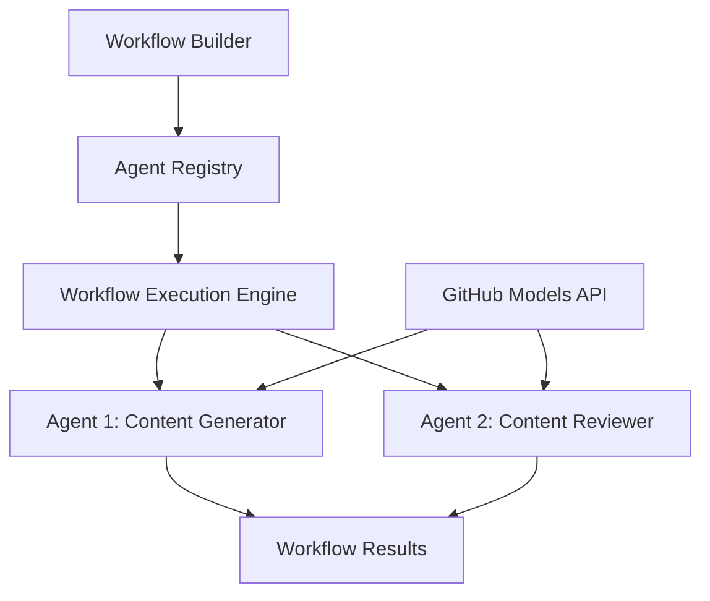

<!--
CO_OP_TRANSLATOR_METADATA:
{
  "original_hash": "034158688d0a45aae06dcbb21b0da5ae",
  "translation_date": "2025-11-11T12:48:18+00:00",
  "source_file": "08-multi-agent/code_samples/workflows-agent-framework/dotNET/01.dotnet-agent-framework-workflow-ghmodel-basic.md",
  "language_code": "it"
}
-->
# 🔄 Flussi di lavoro di base con i modelli GitHub (.NET)

## 📋 Tutorial sull'orchestrazione dei flussi di lavoro

Questo notebook dimostra come costruire sofisticati **flussi di lavoro per agenti** utilizzando il Microsoft Agent Framework per .NET e i modelli GitHub. Imparerai a creare processi aziendali multi-step in cui agenti AI collaborano per completare compiti complessi attraverso schemi di orchestrazione strutturati.

## 🎯 Obiettivi di apprendimento

### 🏗️ **Fondamenti dell'architettura dei flussi di lavoro**
- **Workflow Builder**: Progettare e orchestrare processi AI complessi e multi-step
- **Coordinamento degli agenti**: Coordinare più agenti specializzati all'interno dei flussi di lavoro
- **Integrazione dei modelli GitHub**: Sfruttare il servizio di inferenza dei modelli AI di GitHub nei flussi di lavoro
- **Progettazione visiva dei flussi di lavoro**: Creare e visualizzare le strutture dei flussi di lavoro per una migliore comprensione

### 🔄 **Schemi di orchestrazione dei processi**
- **Elaborazione sequenziale**: Collegare più compiti degli agenti in ordine logico
- **Gestione dello stato**: Mantenere il contesto e il flusso di dati tra le fasi del flusso di lavoro
- **Gestione degli errori**: Implementare un recupero robusto dagli errori e una resilienza del flusso di lavoro
- **Ottimizzazione delle prestazioni**: Progettare flussi di lavoro efficienti per operazioni su scala aziendale

### 🏢 **Applicazioni aziendali dei flussi di lavoro**
- **Automazione dei processi aziendali**: Automatizzare flussi di lavoro organizzativi complessi
- **Pipeline di produzione di contenuti**: Flussi editoriali con fasi di revisione e approvazione
- **Automazione del servizio clienti**: Risoluzione multi-step delle richieste dei clienti
- **Flussi di lavoro di elaborazione dati**: Flussi ETL con trasformazione basata su AI

## ⚙️ Prerequisiti e configurazione

### 📦 **Pacchetti NuGet richiesti**

Questa dimostrazione del flusso di lavoro utilizza diversi pacchetti chiave di .NET:

```xml
<!-- Core AI Framework -->
<PackageReference Include="Microsoft.Extensions.AI" Version="9.9.0" />

<!-- Agent Framework (Local Development) -->
<!-- Microsoft.Agents.AI.dll - Core agent abstractions -->
<!-- Microsoft.Agents.AI.OpenAI.dll - OpenAI/GitHub Models integration -->

<!-- Configuration and Environment -->
<PackageReference Include="DotNetEnv" Version="3.1.1" />
```

### 🔑 **Configurazione dei modelli GitHub**

**Configurazione dell'ambiente (file .env):**
```env
GITHUB_TOKEN=your_github_personal_access_token
GITHUB_ENDPOINT=https://models.inference.ai.azure.com
GITHUB_MODEL_ID=gpt-4o-mini
```

**Accesso ai modelli GitHub:**
1. Iscriviti ai modelli GitHub (attualmente in anteprima)
2. Genera un token di accesso personale con permessi di accesso ai modelli
3. Configura le variabili d'ambiente come mostrato sopra

### 🏗️ **Panoramica dell'architettura del flusso di lavoro**



**Componenti chiave:**
- **WorkflowBuilder**: Motore principale di orchestrazione per progettare i flussi di lavoro
- **AIAgent**: Agenti specializzati individuali con capacità specifiche
- **GitHub Models Client**: Integrazione del servizio di inferenza dei modelli AI
- **Execution Context**: Gestisce lo stato e il flusso di dati tra le fasi del flusso di lavoro

## 🎨 **Schemi di progettazione dei flussi di lavoro aziendali**

### 📝 **Flusso di lavoro per la produzione di contenuti**
```
User Request → Content Generation → Quality Review → Final Output
```

### 🔍 **Pipeline di elaborazione documenti**
```
Document Input → Analysis → Extraction → Validation → Structured Output
```

### 💼 **Flusso di lavoro per l'intelligenza aziendale**
```
Data Collection → Processing → Analysis → Report Generation → Distribution
```

### 🤝 **Automazione del servizio clienti**
```
Customer Inquiry → Classification → Processing → Response Generation → Follow-up
```

## 🏢 **Vantaggi aziendali**

### 🎯 **Affidabilità e scalabilità**
- **Esecuzione deterministica**: Risultati del flusso di lavoro coerenti e ripetibili
- **Recupero dagli errori**: Gestione fluida dei fallimenti in qualsiasi fase del flusso di lavoro
- **Monitoraggio delle prestazioni**: Tracciare metriche di esecuzione e opportunità di ottimizzazione
- **Gestione delle risorse**: Allocazione ed utilizzo efficienti delle risorse dei modelli AI

### 🔒 **Sicurezza e conformità**
- **Autenticazione sicura**: Autenticazione basata su token GitHub per l'accesso alle API
- **Tracciabilità**: Registrazione completa dell'esecuzione del flusso di lavoro e dei punti decisionali
- **Controllo degli accessi**: Permessi granulari per l'esecuzione e il monitoraggio dei flussi di lavoro
- **Privacy dei dati**: Gestione sicura delle informazioni sensibili durante i flussi di lavoro

### 📊 **Osservabilità e gestione**
- **Progettazione visiva dei flussi di lavoro**: Rappresentazione chiara dei flussi di processo e delle dipendenze
- **Monitoraggio dell'esecuzione**: Tracciamento in tempo reale del progresso e delle prestazioni del flusso di lavoro
- **Segnalazione degli errori**: Analisi dettagliata degli errori e capacità di debug
- **Analisi delle prestazioni**: Metriche per l'ottimizzazione e la pianificazione della capacità

Costruiamo il tuo primo flusso di lavoro AI pronto per l'azienda! 🚀

## 💻 Esecuzione del codice

L'implementazione completa è disponibile in `01.dotnet-agent-framework-workflow-ghmodel-basic.cs`. Questo file dimostra:

1. **Configurazione dell'ambiente** - Caricamento delle credenziali dei modelli GitHub dal file `.env`
2. **Configurazione del client OpenAI** - Configurazione del client per utilizzare l'endpoint dei modelli GitHub
3. **Creazione degli agenti** - Definizione di agenti specializzati (Front Desk e Concierge)
4. **Workflow Builder** - Creazione di un flusso di lavoro multi-agente con elaborazione sequenziale
5. **Esecuzione del flusso di lavoro** - Esecuzione del flusso di lavoro con risultati in streaming

### 🚀 Esecuzione dell'esempio

```bash
# Make the script executable (Unix/Linux/macOS)
chmod +x 01.dotnet-agent-framework-workflow-ghmodel-basic.cs

# Run the workflow
./01.dotnet-agent-framework-workflow-ghmodel-basic.cs
```

Oppure su Windows:
```powershell
dotnet run 01.dotnet-agent-framework-workflow-ghmodel-basic.cs
```

### 📝 Output previsto

Il flusso di lavoro:
1. Accetterà la tua richiesta di destinazione di viaggio ("Vorrei andare a Parigi")
2. L'agente Front Desk fornirà una raccomandazione iniziale
3. L'agente Concierge esaminerà e perfezionerà la raccomandazione
4. L'output finale mostrerà l'intero flusso della conversazione

### 🔧 Personalizzazione

Puoi personalizzare il flusso di lavoro:
- Modificando le istruzioni degli agenti per cambiare il loro comportamento
- Aggiungendo più agenti per creare flussi di lavoro complessi e multi-step
- Cambiando il messaggio dell'utente per testare scenari diversi
- Regolando i collegamenti del flusso di lavoro per creare diversi schemi di esecuzione

---

<!-- CO-OP TRANSLATOR DISCLAIMER START -->
**Disclaimer**:  
Questo documento è stato tradotto utilizzando il servizio di traduzione AI [Co-op Translator](https://github.com/Azure/co-op-translator). Sebbene ci impegniamo per garantire l'accuratezza, si prega di notare che le traduzioni automatizzate possono contenere errori o imprecisioni. Il documento originale nella sua lingua nativa dovrebbe essere considerato la fonte autorevole. Per informazioni critiche, si raccomanda una traduzione professionale umana. Non siamo responsabili per eventuali incomprensioni o interpretazioni errate derivanti dall'uso di questa traduzione.
<!-- CO-OP TRANSLATOR DISCLAIMER END -->