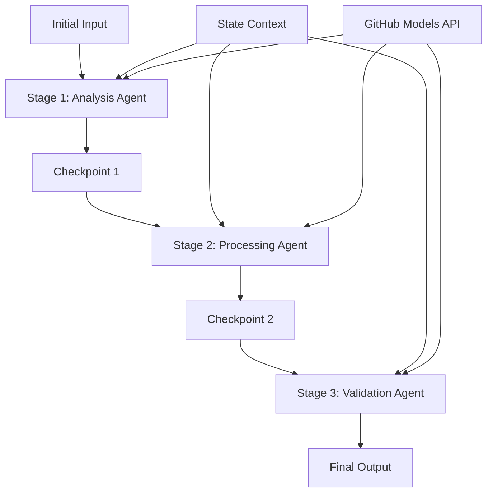

<!--
CO_OP_TRANSLATOR_METADATA:
{
  "original_hash": "1be9c8dcbd79a02d33d2c138684c1394",
  "translation_date": "2025-11-11T13:50:51+00:00",
  "source_file": "08-multi-agent/code_samples/workflows-agent-framework/dotNET/02.dotnet-agent-framework-workflow-ghmodel-sequential.md",
  "language_code": "it"
}
-->
# ⏩ Flussi di lavoro sequenziali con modelli GitHub (.NET)

## 📋 Tutorial avanzato sul processamento sequenziale

Questo notebook dimostra i **modelli di flusso di lavoro sequenziale** utilizzando il Microsoft Agent Framework per .NET e i modelli GitHub. Imparerai a costruire pipeline di elaborazione sofisticate e passo-passo, in cui gli agenti vengono eseguiti in un ordine specifico, con ogni fase che si basa sui risultati della fase precedente.

## 🎯 Obiettivi di apprendimento

### 🔄 **Architettura di processamento sequenziale**
- **Progettazione di flussi di lavoro lineari**: Creare pipeline di elaborazione passo-passo con dipendenze chiare
- **Gestione dello stato**: Mantenere il contesto e il flusso di dati tra le fasi del flusso di lavoro sequenziale
- **Integrazione con modelli GitHub**: Utilizzare i modelli AI di GitHub in flussi di lavoro multi-fase .NET
- **Modelli di pipeline aziendali**: Costruire sistemi di elaborazione sequenziale pronti per la produzione

### 🏗️ **Modelli sequenziali avanzati**
- **Processamento a stadi**: Implementare punti di validazione tra le fasi del flusso di lavoro
- **Preservazione del contesto**: Mantenere lo stato e la conoscenza accumulata attraverso tutte le fasi
- **Propagazione degli errori**: Gestire i fallimenti in modo efficace nelle catene di processamento sequenziale
- **Ottimizzazione delle prestazioni**: Esecuzione sequenziale efficiente con un minimo di sovraccarico

### 🏢 **Applicazioni sequenziali aziendali**
- **Pipeline di elaborazione documenti**: Analisi, trasformazione e validazione multi-fase dei documenti
- **Flussi di lavoro per il controllo qualità**: Revisione, validazione e approvazione sequenziale
- **Pipeline di produzione di contenuti**: Ricerca → Scrittura → Modifica → Revisione → Pubblicazione
- **Automazione dei processi aziendali**: Flussi di lavoro aziendali multi-step con dipendenze chiare tra le fasi

## ⚙️ Prerequisiti e configurazione

### 📦 **Pacchetti NuGet richiesti**

Pacchetti essenziali per flussi di lavoro sequenziali .NET:

```xml
<!-- Core AI Framework -->
<PackageReference Include="Microsoft.Extensions.AI" Version="9.9.0" />

<!-- Client Model Abstractions -->
<PackageReference Include="System.ClientModel" Version="1.6.1.0" />

<!-- Azure Identity and Async LINQ Support -->
<PackageReference Include="Azure.Identity" Version="1.15.0" />
<PackageReference Include="System.Linq.Async" Version="6.0.3" />

<!-- Local Agent Framework References -->
<!-- Microsoft.Agents.AI.dll - Core agent abstractions -->
<!-- Microsoft.Agents.AI.OpenAI.dll - GitHub Models integration -->
```

### 🔑 **Configurazione dei modelli GitHub**

**Configurazione dell'ambiente (.env file):**
```env
GITHUB_TOKEN=your_github_personal_access_token
GITHUB_ENDPOINT=https://models.inference.ai.azure.com
GITHUB_MODEL_ID=gpt-4o-mini
```

**Gestione della configurazione:**
```csharp
// Load environment variables securely
Env.Load("../../../.env");
var githubToken = Environment.GetEnvironmentVariable("GITHUB_TOKEN");
var githubEndpoint = Environment.GetEnvironmentVariable("GITHUB_ENDPOINT");
var modelId = Environment.GetEnvironmentVariable("GITHUB_MODEL_ID");
```

### 🏗️ **Architettura del flusso di lavoro sequenziale**



**Componenti chiave:**
- **Agenti sequenziali**: Agenti specializzati per ogni fase di elaborazione
- **Contesto dello stato**: Mantiene i dati accumulati e le decisioni tra le fasi
- **Punti di controllo**: Punti di validazione tra le fasi per garantire qualità e coerenza
- **Client modelli GitHub**: Accesso coerente ai modelli AI in tutte le fasi del flusso di lavoro

## 🎨 **Modelli di progettazione del flusso di lavoro sequenziale**

### 📝 **Pipeline di elaborazione documenti**
```
Raw Document → Content Extraction → Analysis → Validation → Structured Output
```

### 🎯 **Flusso di lavoro per la creazione di contenuti**
```
Brief/Requirements → Research → Content Creation → Review → Final Polish
```

### 🔍 **Pipeline per il controllo qualità**
```
Initial Review → Technical Validation → Compliance Check → Final Approval
```

### 💼 **Flusso di lavoro per l'intelligenza aziendale**
```
Data Collection → Processing → Analysis → Report Generation → Distribution
```

## 🏢 **Vantaggi sequenziali aziendali**

### 🎯 **Affidabilità e qualità**
- **Elaborazione deterministica**: Risultati coerenti e ripetibili attraverso fasi strutturate
- **Punti di controllo qualità**: I punti di validazione garantiscono qualità in ogni fase
- **Isolamento degli errori**: I problemi in una fase non si propagano alle fasi successive
- **Tracciabilità**: Monitoraggio completo delle decisioni e trasformazioni in ogni fase

### 📈 **Scalabilità e prestazioni**
- **Progettazione modulare**: Ogni fase può essere ottimizzata indipendentemente
- **Gestione delle risorse**: Allocazione efficiente delle risorse dei modelli AI tra le fasi
- **Ottimizzazione dello stato**: Trasferimento minimo dello stato tra le fasi per prestazioni ottimali
- **Gruppi di fasi parallele**: Più flussi di lavoro sequenziali possono essere eseguiti in parallelo

### 🔒 **Sicurezza e conformità**
- **Sicurezza a livello di fase**: Politiche di sicurezza diverse per le diverse fasi di elaborazione
- **Validazione dei dati**: Garantire l'integrità e la conformità dei dati in ogni punto di controllo
- **Controllo degli accessi**: Permessi granulari per le diverse fasi del flusso di lavoro
- **Conformità normativa**: Soddisfare i requisiti normativi attraverso l'elaborazione strutturata

### 📊 **Monitoraggio e analisi**
- **Metriche a livello di fase**: Monitoraggio delle prestazioni per ogni fase del flusso di lavoro
- **Identificazione dei colli di bottiglia**: Identificare e ottimizzare le fasi lente
- **Metriche di qualità**: Monitorare la qualità e i tassi di successo in ogni fase
- **Ottimizzazione dei processi**: Miglioramento continuo basato su analisi a livello di fase

Costruiamo pipeline di elaborazione AI sequenziali robuste! 🚀

## 💻 Esecuzione del codice

L'implementazione completa è disponibile in `02.dotnet-agent-framework-workflow-ghmodel-sequential.cs`. Questo file dimostra un **flusso di lavoro di analisi dei mobili in tre fasi**:

1. **Fase 1 - Agente vendite**: Analizza le immagini dei mobili e fornisce suggerimenti di acquisto
2. **Fase 2 - Agente prezzi**: Fornisce analisi dettagliate dei prezzi e opzioni di budget
3. **Fase 3 - Agente preventivi**: Genera un documento di preventivo professionale in formato Markdown

### 🏗️ **Architettura del flusso di lavoro**

```
Image Input → Sales Analysis → Price Estimation → Quote Generation → Final Output
```

Ogni agente:
- Riceve l'output della fase precedente come contesto
- Si basa sull'analisi precedente con competenze specializzate
- Mantiene la continuità del flusso di lavoro attraverso la gestione dello stato

### 🚀 Esecuzione dell'esempio

**Prerequisiti:**
- Posizionare un'immagine di mobili in `../imgs/home.png` (o aggiornare la variabile `imgPath`)
- Configurare il file `.env` con le credenziali dei modelli GitHub

```bash
# Make the script executable (Unix/Linux/macOS)
chmod +x 02.dotnet-agent-framework-workflow-ghmodel-sequential.cs

# Run the sequential workflow
./02.dotnet-agent-framework-workflow-ghmodel-sequential.cs
```

Oppure su Windows:
```powershell
dotnet run 02.dotnet-agent-framework-workflow-ghmodel-sequential.cs
```

### 📝 Output previsto

Il flusso di lavoro:
1. **Agente vendite**: Identifica gli articoli di mobili dall'immagine e fornisce raccomandazioni
2. **Agente prezzi**: Aggiunge un'analisi dettagliata dei prezzi con fasce di budget e raccomandazioni di acquisto
3. **Agente preventivi**: Genera un documento di preventivo formattato con tutte le informazioni sintetizzate

L'output finale sarà un preventivo completo e professionale basato sull'analisi dell'immagine.

### 🔧 Opzioni di personalizzazione

**Modificare il comportamento degli agenti:**
```csharp
// Adjust agent instructions to change their focus
const string SalesAgentInstructions = "Your custom instructions...";
```

**Cambiare il flusso sequenziale:**
```csharp
// Add or reorder workflow stages
var workflow = new WorkflowBuilder(salesagent)
    .AddEdge(salesagent, priceagent)
    .AddEdge(priceagent, quoteagent)
    .AddEdge(quoteagent, newAgent)  // Add another stage
    .Build();
```

**Utilizzare input diversi:**
```csharp
// Process text instead of images
ChatMessage userMessage = new ChatMessage(ChatRole.User, [
    new TextContent("Analyze pricing for a modern living room set")
]);
```

### 🎯 Applicazioni reali

Questo modello sequenziale è ideale per:
- **E-commerce**: Analisi del prodotto → Prezzi → Generazione del preventivo
- **Immobiliare**: Analisi della proprietà → Valutazione → Creazione dell'annuncio
- **Assicurazioni**: Analisi del sinistro → Valutazione → Generazione del preventivo
- **Creazione di contenuti**: Ricerca → Scrittura → Modifica → Pubblicazione

### 🔍 Comprendere il flusso dello stato

Ogni agente nella sequenza riceve:
- **Input originale**: Il messaggio iniziale dell'utente (immagine + testo)
- **Output degli agenti precedenti**: Tutte le risposte degli agenti precedenti nella cronologia della conversazione
- **Contesto accumulato**: Stato completo mantenuto durante tutto il flusso di lavoro

Questo consente un'elaborazione multi-fase sofisticata, in cui ogni agente si basa su un contesto completo derivato da tutte le fasi precedenti.

---

<!-- CO-OP TRANSLATOR DISCLAIMER START -->
**Disclaimer**:  
Questo documento è stato tradotto utilizzando il servizio di traduzione AI [Co-op Translator](https://github.com/Azure/co-op-translator). Sebbene ci impegniamo per garantire l'accuratezza, si prega di notare che le traduzioni automatiche possono contenere errori o imprecisioni. Il documento originale nella sua lingua nativa dovrebbe essere considerato la fonte autorevole. Per informazioni critiche, si consiglia una traduzione professionale umana. Non siamo responsabili per eventuali incomprensioni o interpretazioni errate derivanti dall'uso di questa traduzione.
<!-- CO-OP TRANSLATOR DISCLAIMER END -->