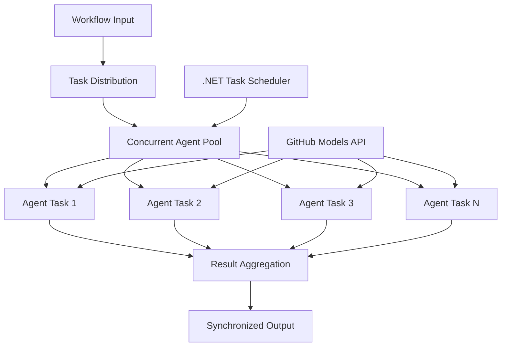

<!--
CO_OP_TRANSLATOR_METADATA:
{
  "original_hash": "b9c6e32c9b5f2fed20b6916984440d88",
  "translation_date": "2025-11-11T13:17:25+00:00",
  "source_file": "08-multi-agent/code_samples/workflows-agent-framework/dotNET/03.dotnet-agent-framework-workflow-ghmodel-concurrent.md",
  "language_code": "it"
}
-->
# ⚡ Flussi di lavoro concorrenti con i modelli GitHub (.NET)

## 📋 Tutorial sul processamento parallelo ad alte prestazioni

Questo notebook dimostra i **modelli di flussi di lavoro concorrenti** utilizzando il Microsoft Agent Framework per .NET e i modelli GitHub. Imparerai a costruire flussi di lavoro ad alte prestazioni e processamento parallelo che massimizzano la capacità eseguendo simultaneamente più agenti AI, mantenendo al contempo coordinazione e coerenza dei dati.

## 🎯 Obiettivi di apprendimento

### 🚀 **Fondamenti del processamento concorrente**
- **Esecuzione parallela degli agenti**: Esegui più agenti AI simultaneamente per ottenere prestazioni massime
- **Pattern Async/Await**: Sfrutta il modello di programmazione asincrona di .NET per una concorrenza efficiente
- **Integrazione con i modelli GitHub**: Coordina più chiamate concorrenti al servizio di inferenza dei modelli AI di GitHub
- **Gestione delle risorse**: Gestisci in modo efficiente le risorse dei modelli AI durante le operazioni concorrenti

### 🏗️ **Architettura avanzata della concorrenza**
- **Parallelismo basato su Task**: Utilizza la Task Parallel Library di .NET per un'esecuzione concorrente ottimale
- **Pattern di sincronizzazione**: Coordina gli agenti concorrenti evitando condizioni di gara
- **Bilanciamento del carico**: Distribuisci il lavoro in modo efficiente sulla capacità di processamento concorrente disponibile
- **Tolleranza ai guasti**: Gestisci i fallimenti individuali degli agenti senza interrompere l'intero flusso di lavoro

### 🏢 **Applicazioni aziendali concorrenti**
- **Processamento di documenti ad alto volume**: Elabora più documenti simultaneamente
- **Analisi dei contenuti in tempo reale**: Analisi concorrente di flussi di dati in arrivo
- **Ottimizzazione del processamento batch**: Massimizza la capacità per operazioni di processamento dati su larga scala
- **Analisi multi-modale**: Processamento parallelo di diversi tipi e formati di contenuti

## ⚙️ Prerequisiti e configurazione

### 📦 **Pacchetti NuGet richiesti**

Pacchetti essenziali per flussi di lavoro concorrenti ad alte prestazioni:

```xml
<!-- Core AI Framework with Async Support -->
<PackageReference Include="Microsoft.Extensions.AI" Version="9.9.0" />

<!-- Client Model Abstractions for API Communication -->
<PackageReference Include="System.ClientModel" Version="1.6.1.0" />

<!-- Azure Identity and Async LINQ for Advanced Operations -->
<PackageReference Include="Azure.Identity" Version="1.15.0" />
<PackageReference Include="System.Linq.Async" Version="6.0.3" />

<!-- Local Agent Framework References -->
<!-- Microsoft.Agents.AI.dll - Core agent abstractions with async support -->
<!-- Microsoft.Agents.AI.OpenAI.dll - GitHub Models integration with concurrency -->
```

### 🔑 **Configurazione dei modelli GitHub**

**Configurazione dell'ambiente (.env file):**
```env
GITHUB_TOKEN=your_github_personal_access_token
GITHUB_ENDPOINT=https://models.inference.ai.azure.com
GITHUB_MODEL_ID=gpt-4o-mini
```

**Considerazioni sul processamento concorrente:**
```csharp
// Configure for concurrent operations
var clientOptions = new OpenAIClientOptions()
{
    Endpoint = new Uri(githubEndpoint),
    // Configure connection pooling for concurrent requests
    NetworkTimeout = TimeSpan.FromMinutes(5)
};
```

### 🏗️ **Architettura del flusso di lavoro concorrente**



**Componenti chiave:**
- **Task Parallel Library**: Supporto integrato di .NET per operazioni concorrenti
- **Pool di agenti**: Più istanze di agenti per il processamento parallelo
- **Aggregazione dei risultati**: Coordinazione e fusione dei risultati degli agenti concorrenti
- **Punti di sincronizzazione**: Garantire la coerenza dei dati durante le operazioni concorrenti

## 🎨 **Modelli di progettazione dei flussi di lavoro concorrenti**

### 🔍 **Ricerca e analisi parallela**
```
Research Topic → Concurrent Research Agents → Result Synthesis → Final Report
```

### 📊 **Processamento dati da più fonti**
```
Data Sources → Parallel Processing Agents → Data Integration → Unified Output
```

### 🎭 **Pipeline di generazione dei contenuti**
```
Content Requirements → Concurrent Content Generators → Quality Review → Final Content
```

### 🔄 **Processamento Fan-Out/Fan-In**
```
Single Input → Multiple Concurrent Processors → Result Aggregation → Single Output
```

## 🏢 **Vantaggi prestazionali aziendali**

### ⚡ **Capacità e scalabilità**
- **Scalabilità lineare delle prestazioni**: Aggiungi più agenti concorrenti per aumentare la capacità
- **Utilizzo delle risorse**: Massima efficienza della capacità disponibile dei modelli AI
- **Riduzione dei tempi di processamento**: Riduzione significativa dei tempi grazie all'esecuzione parallela
- **Scalabilità elastica**: Regola dinamicamente il numero di agenti concorrenti in base al carico di lavoro

### 🛡️ **Affidabilità e resilienza**
- **Isolamento dei guasti**: I fallimenti individuali degli agenti non influenzano le altre operazioni concorrenti
- **Degradazione graduale**: Il sistema continua a funzionare con una capacità ridotta degli agenti
- **Recupero dagli errori**: Meccanismi di retry automatici per operazioni concorrenti fallite
- **Distribuzione del carico**: Distribuzione uniforme del lavoro tra gli agenti disponibili

### 📊 **Monitoraggio delle prestazioni**
- **Metriche di esecuzione concorrente**: Traccia le prestazioni di tutte le operazioni parallele
- **Analisi dell'utilizzo delle risorse**: Monitora CPU, memoria e utilizzo della rete
- **Analisi della capacità**: Misura i guadagni di efficienza derivanti dal processamento concorrente
- **Rilevamento dei colli di bottiglia**: Identifica e risolvi i vincoli prestazionali

### 🔧 **Sviluppo e operazioni**
- **Modello di programmazione asincrona**: Sfrutta i maturi pattern async/await di .NET
- **Coordinazione dei task**: Capacità integrate di gestione e coordinazione dei task
- **Gestione delle eccezioni**: Gestione completa degli errori per operazioni concorrenti
- **Supporto al debugging**: Strumenti di debugging di Visual Studio per flussi di lavoro concorrenti

Costruiamo flussi di lavoro AI concorrenti ad alte prestazioni con .NET! 🚀

## 💻 Esecuzione del codice

L'implementazione completa è disponibile in `03.dotnet-agent-framework-workflow-ghmodel-concurrent.cs`. Questo file dimostra un **flusso di lavoro concorrente Fan-Out/Fan-In** per la pianificazione di viaggi:

### 🏗️ **Architettura del flusso di lavoro**

```
User Request → ConcurrentStartExecutor → [Researcher Agent || Planner Agent] → ConcurrentAggregationExecutor → Final Output
```

**Componenti chiave:**

1. **ConcurrentStartExecutor**: Trasmette la richiesta dell'utente a tutti gli agenti simultaneamente
2. **Researcher Agent**: Analizza destinazioni e attrazioni in modo concorrente
3. **Planner Agent**: Crea piani di viaggio dettagliati in modo concorrente
4. **ConcurrentAggregationExecutor**: Raccoglie e unisce i risultati di entrambi gli agenti

### 🎯 **Pattern Fan-Out/Fan-In**

Questo flusso di lavoro dimostra il classico pattern **Fan-Out/Fan-In**:
- **Fan-Out**: Un messaggio di input viene trasmesso simultaneamente a più agenti
- **Processamento concorrente**: Più agenti lavorano in parallelo sullo stesso compito
- **Fan-In**: I risultati di tutti gli agenti vengono raccolti e aggregati in un unico output

### 🚀 Esecuzione dell'esempio

```bash
# Make the script executable (Unix/Linux/macOS)
chmod +x 03.dotnet-agent-framework-workflow-ghmodel-concurrent.cs

# Run the concurrent workflow
./03.dotnet-agent-framework-workflow-ghmodel-concurrent.cs
```

Oppure su Windows:
```powershell
dotnet run 03.dotnet-agent-framework-workflow-ghmodel-concurrent.cs
```

### 📝 Output previsto

Il flusso di lavoro:
1. **Trasmette la richiesta**: Invia "Pianifica un viaggio a Seattle a dicembre" a entrambi gli agenti
2. **Processamento concorrente**: Entrambi gli agenti lavorano simultaneamente:
   - Il ricercatore identifica attrazioni e dettagli
   - Il pianificatore crea itinerari e logistica
3. **Aggregazione**: Combina entrambe le risposte in un output completo
4. **Mostra i risultati**: Visualizza il piano di viaggio unificato con tutte le informazioni

### 🔧 Opzioni di personalizzazione

**Aggiungi più agenti concorrenti:**
```csharp
// Create additional specialized agents
AIAgent budgetAgent = openAIClient.GetChatClient(github_model_id).CreateAIAgent(
    name: "Budget-Agent", instructions: "Calculate travel costs...");

// Add to fan-out
var workflow = new WorkflowBuilder(startExecutor)
    .AddFanOutEdge(startExecutor, targets: [researcherAgent, plannerAgent, budgetAgent])
    .AddFanInEdge(aggregationExecutor, sources: [researcherAgent, plannerAgent, budgetAgent])
    .WithOutputFrom(aggregationExecutor)
    .Build();

// Update aggregation count
if (this._messages.Count == 3) { ... }
```

**Modifica le istruzioni degli agenti:**
```csharp
const string ResearcherAgentInstructions = "Your custom instructions for research...";
const string PlanAgentInstructions = "Your custom instructions for planning...";
```

**Cambia il compito:**
```csharp
StreamingRun run = await InProcessExecution.StreamAsync(
    workflow, 
    "Plan a European vacation for 2 weeks in summer"
);
```

### 🎯 Applicazioni reali

Questo pattern concorrente è ideale per:
- **Creazione di contenuti**: Più scrittori che creano sezioni diverse simultaneamente
- **Revisione del codice**: Più revisori che analizzano il codice da prospettive diverse
- **Ricerca di mercato**: Analisi parallela di diversi segmenti di mercato
- **Processamento di documenti**: Estrazione, analisi e validazione concorrenti
- **Analisi multi-prospettiva**: Ottenere punti di vista diversi sullo stesso input

### 🔍 Comprendere gli executor personalizzati

**ConcurrentStartExecutor:**
- Implementa `IMessageHandler<string>` per accettare input di tipo stringa
- Trasmette messaggi a tutti gli agenti connessi
- Invia `TurnToken` per attivare il processamento concorrente

**ConcurrentAggregationExecutor:**
- Implementa `IMessageHandler<ChatMessage>` per ricevere risposte dagli agenti
- Raccoglie i messaggi in modo thread-safe
- Aggrega quando arrivano tutte le risposte previste
- Fornisce l'output finale utilizzando `context.YieldOutputAsync()`

### ⚡ Vantaggi prestazionali

**Concorrenza vs Sequenziale:**
- Sequenziale: Agente1 (30s) → Agente2 (30s) = **60 secondi totali**
- Concorrenza: Agente1 (30s) || Agente2 (30s) = **30 secondi totali**

**Miglioramento della capacità**: Fino a N× più veloce per N agenti concorrenti (a seconda del carico di lavoro e delle risorse)

### 🛡️ Gestione degli errori

Il flusso di lavoro gestisce i fallimenti individuali degli agenti in modo efficace:
- Se un agente fallisce, gli altri continuano a processare
- L'aggregatore può implementare logiche di timeout
- Possono essere restituiti risultati parziali se necessario

### 📊 Funzionalità avanzate

**Numero dinamico di agenti:**
Modifica la logica di aggregazione per supportare un numero variabile di agenti:

```csharp
private int _expectedAgentCount;
private readonly List<ChatMessage> _messages = [];

public async ValueTask HandleAsync(ChatMessage message, IWorkflowContext context)
{
    this._messages.Add(message);
    if (this._messages.Count == _expectedAgentCount)
    {
        // Process aggregation
    }
}
```

Questo pattern di flusso di lavoro concorrente è essenziale per costruire sistemi di agenti AI ad alte prestazioni e scalabili!

---

<!-- CO-OP TRANSLATOR DISCLAIMER START -->
**Disclaimer**:  
Questo documento è stato tradotto utilizzando il servizio di traduzione AI [Co-op Translator](https://github.com/Azure/co-op-translator). Sebbene ci impegniamo per garantire l'accuratezza, si prega di notare che le traduzioni automatiche potrebbero contenere errori o imprecisioni. Il documento originale nella sua lingua nativa dovrebbe essere considerato la fonte autorevole. Per informazioni critiche, si raccomanda una traduzione professionale umana. Non siamo responsabili per eventuali incomprensioni o interpretazioni errate derivanti dall'uso di questa traduzione.
<!-- CO-OP TRANSLATOR DISCLAIMER END -->