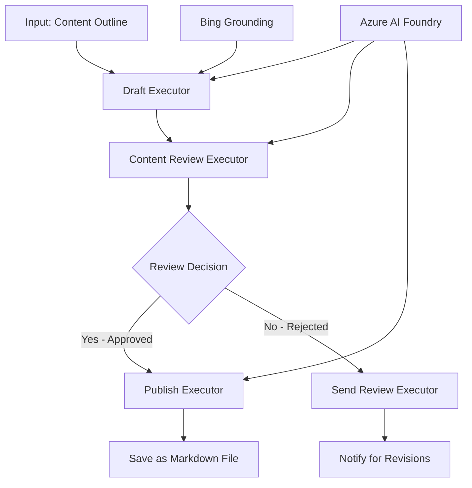

<!--
CO_OP_TRANSLATOR_METADATA:
{
  "original_hash": "8abd335151cee553293b637ee3d80d10",
  "translation_date": "2025-11-11T12:14:11+00:00",
  "source_file": "08-multi-agent/code_samples/workflows-agent-framework/dotNET/04.dotnet-agent-framework-workflow-aifoundry-condition.md",
  "language_code": "it"
}
-->
# 🔀 Flussi di lavoro condizionali con Azure AI Foundry (.NET)

## 📋 Tutorial sui flussi di lavoro basati su decisioni intelligenti

Questo notebook dimostra i **modelli di flusso di lavoro condizionali** utilizzando Azure AI Foundry e il Microsoft Agent Framework per .NET. Imparerai a costruire flussi di lavoro sofisticati e basati su decisioni che instradano in modo intelligente l'elaborazione in base all'analisi AI, alle regole aziendali e alle condizioni dinamiche per un'automazione di livello enterprise.

## 🎯 Obiettivi di apprendimento

### 🧠 **Architettura di decisioni intelligenti**
- **Implementazione della logica condizionale**: Costruire alberi decisionali complessi con più punti di diramazione
- **Instradamento basato sull'AI**: Utilizzare i modelli di Azure AI Foundry per prendere decisioni di instradamento intelligenti
- **Adattamento dinamico del flusso di lavoro**: Modificare il comportamento del flusso di lavoro in base all'analisi e alle condizioni in tempo reale
- **Integrazione delle regole aziendali**: Incorporare la logica aziendale e i requisiti di conformità nei flussi di lavoro

### 🔀 **Modelli condizionali avanzati**
- **Decisioni basate su criteri multipli**: Valutare più fattori per le decisioni di instradamento
- **Elaborazione consapevole del contesto**: Prendere decisioni basate sul contesto accumulato e sulla cronologia del flusso di lavoro
- **Modifica adattiva del flusso di lavoro**: Regolare dinamicamente i percorsi di elaborazione in base alle condizioni in tempo reale
- **Integrazione del motore di regole**: Implementare motori di regole aziendali sofisticati nei flussi di lavoro

### 🏢 **Applicazioni condizionali aziendali**
- **Classificazione e instradamento dei documenti**: Classificare automaticamente e instradare i documenti ai flussi di lavoro appropriati
- **Smistamento delle richieste di assistenza clienti**: Instradamento intelligente delle richieste dei clienti ai team specializzati
- **Elaborazione di conformità e rischio**: Applicare diversi processi di validazione e revisione basati sulla valutazione del rischio
- **Flussi di lavoro per il controllo qualità**: Instradare i contenuti attraverso processi di revisione appropriati basati su metriche di qualità

## ⚙️ Prerequisiti e configurazione

### 📦 **Pacchetti NuGet richiesti**

Pacchetti avanzati per l'elaborazione dei flussi di lavoro condizionali:

```xml
<!-- Core AI Framework -->
<PackageReference Include="Microsoft.Extensions.AI" Version="9.9.0" />

<!-- Azure AI Agents with Persistent State -->
<PackageReference Include="Azure.AI.Agents.Persistent" Version="1.2.0-beta.5" />

<!-- Azure Identity and Utilities -->
<PackageReference Include="Azure.Identity" Version="1.15.0" />
<PackageReference Include="System.Linq.Async" Version="6.0.3" />
<PackageReference Include="DotNetEnv" Version="3.1.1" />

<!-- Local Workflow Framework References -->
<!-- Microsoft.Agents.Workflows.dll - Advanced workflow orchestration -->
<!-- Microsoft.Agents.AI.AzureAI.dll - Azure AI Foundry integration -->
<!-- Microsoft.Agents.AI.dll - Core agent abstractions -->
```

### 🔑 **Configurazione di Azure AI Foundry**

**Risorse Azure richieste:**
- Workspace di Azure AI Foundry con modelli di elaborazione condizionale
- Abbonamento Azure con quote di calcolo e permessi appropriati
- Modelli AI distribuiti per decisioni e analisi dei contenuti
- (Opzionale) Connessione API Bing Search per capacità di grounding

**Configurazione dell'ambiente (.env file):**
```env
# Azure AI Foundry Configuration
AZURE_AI_PROJECT_ENDPOINT=https://your-project.cognitiveservices.azure.com/
BING_CONNECTION_ID=your-bing-connection-id
```

**Configurazione dell'autenticazione:**
```csharp
// Azure CLI or Managed Identity authentication
using Azure.Identity;
var credential = new AzureCliCredential();

// Load environment configuration
DotNetEnv.Env.Load("../../../.env");
```

### 🏗️ **Architettura del flusso di lavoro condizionale**



**Componenti principali:**
- **Draft Executor**: Agente AI che crea bozze di contenuti iniziali da schemi
- **Content Review Executor**: Agente AI che valuta la qualità e la conformità delle bozze
- **Instradamento condizionale**: Logica decisionale che instrada in base ai risultati della revisione
- **Percorsi di pubblicazione/revisione**: Percorsi di elaborazione separati per contenuti approvati e respinti
- **Gestione dello stato**: Mantiene il contesto dei contenuti e delle revisioni durante il flusso di lavoro

## 🎨 **Modelli di progettazione del flusso di lavoro condizionale**

### 📋 **Produzione di contenuti con controlli di qualità**
```
Outline → Draft Creation → Quality Review → {Approve: Publish | Reject: Revise}
```

### 🎯 **Elaborazione documentale basata sul rischio**
```
Document → Risk Assessment → {Low: Standard | High: Enhanced Review}
```

### 🔍 **Instradamento intelligente del servizio clienti**
```
Customer Query → Analysis → {Simple: FAQ Bot | Complex: Human Agent}
```

### 💼 **Flussi di lavoro basati sulla conformità**
```
Content → Compliance Check → {Pass: Publish | Fail: Legal Review}
```

## 🏢 **Vantaggi condizionali aziendali**

### 🎯 **Automazione intelligente**
- **Decisioni intelligenti**: Decisioni di instradamento basate sull'analisi dei contenuti e sul contesto
- **Elaborazione adattiva**: Flussi di lavoro che si adattano automaticamente alle condizioni mutevoli
- **Applicazione delle regole aziendali**: Applicazione automatica di logiche aziendali e politiche complesse
- **Instradamento consapevole del contesto**: Decisioni basate sulla cronologia completa del flusso di lavoro e sul contesto accumulato

### 📈 **Eccellenza operativa**
- **Ottimizzazione dell'allocazione delle risorse**: Instradare il lavoro agli specialisti e ai processi più appropriati
- **Riduzione dell'intervento manuale**: Le decisioni automatizzate riducono la necessità di instradamento umano
- **Tempi di risoluzione più rapidi**: Instradamento diretto alle competenze e capacità di elaborazione appropriate
- **Applicazione uniforme**: Applicazione uniforme delle regole aziendali e dei criteri decisionali

### 🛡️ **Gestione del rischio e conformità**
- **Valutazione automatica del rischio**: Valutazione basata sull'AI dei livelli di rischio dei contenuti e delle situazioni
- **Applicazione della conformità**: Instradamento automatico attraverso i processi regolamentari richiesti
- **Applicazione dei protocolli di sicurezza**: Misure di sicurezza avanzate applicate in base alla valutazione del rischio
- **Mantenimento della traccia di audit**: Documentazione completa delle decisioni di instradamento e delle relative motivazioni

### 📊 **Analisi e miglioramento continuo**
- **Analisi delle decisioni**: Monitorare l'efficacia e l'accuratezza delle decisioni di instradamento
- **Riconoscimento dei modelli**: Identificare tendenze e modelli nelle decisioni di instradamento nel tempo
- **Ottimizzazione delle prestazioni**: Miglioramento continuo dei criteri decisionali e dell'efficienza dell'instradamento
- **Business Intelligence**: Approfondimenti sulle caratteristiche dei contenuti e sui requisiti di elaborazione

### 🔧 **Eccellenza tecnica**
- **Gestione persistente dello stato**: Mantenere uno stato complesso durante l'esecuzione del flusso di lavoro
- **Architettura scalabile**: Gestire requisiti di elaborazione condizionale ad alto volume
- **Capacità di integrazione**: Integrazione senza soluzione di continuità con sistemi e processi aziendali esistenti
- **Monitoraggio e osservabilità**: Tracciamento completo delle prestazioni e delle decisioni del flusso di lavoro

Costruiamo flussi di lavoro aziendali intelligenti e basati su decisioni con .NET! 🚀

## 💻 Esecuzione del codice

L'implementazione completa è disponibile in `04.dotnet-agent-framework-workflow-aifoundry-condition.cs`. Questo dimostra un **flusso di lavoro di produzione di contenuti con controlli di qualità**:

### 🏗️ **Architettura del flusso di lavoro**

```
Content Outline → Draft Creation → Quality Review → Conditional Routing:
                                                      ├─ Approved (>200 words) → Publish
                                                      └─ Rejected (<200 words) → Review Notification
```

**Agenti nel flusso di lavoro:**
1. **Evangelist Agent**: Crea bozze di tutorial dagli schemi con grounding Bing
2. **Content Reviewer Agent**: Valuta la qualità delle bozze (conteggio parole, completezza)
3. **Publisher Agent**: Salva i contenuti approvati come file Markdown con timestamp

**Esecutori personalizzati:**
1. **DraftExecutor**: Orchestra la creazione delle bozze
2. **ContentReviewExecutor**: Esegue la valutazione della qualità
3. **PublishExecutor**: Gestisce la pubblicazione dei contenuti approvati
4. **SendReviewExecutor**: Gestisce le notifiche per i contenuti respinti

### 🚀 Esecuzione dell'esempio

**Prerequisiti:**
- Workspace di Azure AI Foundry configurato
- Autenticazione CLI Azure (`az login`)
- (Opzionale) Connessione Bing Search per grounding

```bash
# Make the script executable (Unix/Linux/macOS)
chmod +x 04.dotnet-agent-framework-workflow-aifoundry-condition.cs

# Run the conditional workflow
./04.dotnet-agent-framework-workflow-aifoundry-condition.cs
```

Oppure su Windows:
```powershell
dotnet run 04.dotnet-agent-framework-workflow-aifoundry-condition.cs
```

### 📝 Output previsto

Il flusso di lavoro:
1. **Crea agenti**: Inizializza tre agenti specializzati di Azure AI Foundry
2. **Genera bozza**: L'agente Evangelist crea una bozza di tutorial dallo schema
3. **Revisione dei contenuti**: Il Content Reviewer valuta la qualità della bozza
4. **Instradamento condizionale**:
   - **Se approvato (>200 parole)**: L'esecutore Publish salva come file Markdown
   - **Se respinto (<200 parole)**: L'esecutore SendReview invia una notifica di revisione
5. **Mostra risultati**: Visualizza l'esito finale del flusso di lavoro

### 🔧 Opzioni di personalizzazione

**Modifica dei criteri di revisione:**
```csharp
const string ContentReviewerInstructions = @"
You are a content reviewer...
1. Check if content is more than 500 words (instead of 200)
2. Verify technical accuracy
3. Ensure proper formatting
...";
```

**Aggiungi più percorsi condizionali:**
```csharp
var workflow = new WorkflowBuilder(draftExecutor)
    .AddEdge(draftExecutor, contentReviewerExecutor)
    .AddEdge(contentReviewerExecutor, publishExecutor, condition: GetCondition("Excellent"))
    .AddEdge(contentReviewerExecutor, editExecutor, condition: GetCondition("Good"))
    .AddEdge(contentReviewerExecutor, sendReviewerExecutor, condition: GetCondition("Poor"))
    .Build();
```

**Cambia i requisiti dei contenuti:**
```csharp
string OUTLINE_Content = @"
# Your Custom Topic
## Section 1
https://your-reference-url
## Section 2
...
";
```

### 🎯 Applicazioni reali

Questo modello di flusso di lavoro condizionale è ideale per:
- **Sistemi di gestione dei contenuti**: Flussi editoriali automatizzati con controlli di qualità
- **Elaborazione documentale**: Instradare documenti in base a classificazione e conformità
- **Supporto clienti**: Instradamento intelligente dei ticket in base a complessità e urgenza
- **Revisione legale**: Instradare contratti in base a valutazione del rischio e valore
- **Processi HR**: Instradare le candidature attraverso flussi di screening appropriati

### 🔍 Comprendere la logica condizionale

**Funzione condizionale:**
```csharp
public Func<object?, bool> GetCondition(string expectedResult) =>
    reviewResult => reviewResult is ReviewResult review && review.Result == expectedResult;
```

Questa funzione crea un predicato che:
1. Verifica se il risultato è di tipo `ReviewResult`
2. Confronta la proprietà `Result` con il valore previsto
3. Restituisce true/false per determinare l'instradamento

**Bordi del flusso di lavoro con condizioni:**
```csharp
.AddEdge(contentReviewerExecutor, publishExecutor, condition: GetCondition("Yes"))
.AddEdge(contentReviewerExecutor, sendReviewerExecutor, condition: GetCondition("No"))
```

### 📊 Funzionalità avanzate

**Validazione dello schema JSON:**
Il flusso di lavoro utilizza schemi JSON per garantire risposte strutturate:

```csharp
// Define response structure
public class ReviewResult
{
    [JsonPropertyName("review_result")]
    public string Result { get; set; } = string.Empty;
    
    [JsonPropertyName("reason")]
    public string Reason { get; set; } = string.Empty;
    
    [JsonPropertyName("draft_content")]
    public string DraftContent { get; set; } = string.Empty;
}

// Apply to agent
ResponseFormat = ChatResponseFormat.ForJsonSchema(
    AIJsonUtilities.CreateJsonSchema(typeof(ReviewResult)), 
    "ReviewResult", 
    "Review Result From DraftContent"
)
```

**Integrazione del grounding Bing:**
L'agente Evangelist utilizza il grounding Bing per accedere a informazioni in tempo reale:

```csharp
var bingGroundingConfig = new BingGroundingSearchConfiguration(bing_conn_id);
BingGroundingToolDefinition bingGroundingTool = new(
    new BingGroundingSearchToolParameters([bingGroundingConfig])
);
```

Questo consente all'agente di seguire gli URL nello schema e di estrarre informazioni aggiornate.

### 🛡️ Gestione degli errori

Il flusso di lavoro include una gestione robusta degli errori per i contenuti respinti:
- I fallimenti di revisione attivano il percorso alternativo
- Le notifiche forniscono motivazioni chiare per il rifiuto
- I contenuti vengono conservati per la revisione

### 🔄 Estensione del flusso di lavoro

**Aggiungi un ciclo di revisione:**
Crea un ciclo di feedback che rielabora automaticamente i contenuti:

```csharp
.AddEdge(contentReviewerExecutor, publishExecutor, condition: GetCondition("Yes"))
.AddEdge(contentReviewerExecutor, draftExecutor, condition: GetCondition("No")) // Loop back
```

**Implementa una revisione multi-livello:**
Aggiungi più fasi di revisione con criteri diversi:

```csharp
.AddEdge(draftExecutor, technicalReviewer)
.AddEdge(technicalReviewer, editorialReviewer, condition: GetCondition("TechPass"))
.AddEdge(editorialReviewer, publishExecutor, condition: GetCondition("EditPass"))
```

Questo modello di flusso di lavoro condizionale fornisce le basi per costruire sistemi di automazione aziendale sofisticati e intelligenti! 🚀

---

<!-- CO-OP TRANSLATOR DISCLAIMER START -->
**Disclaimer**:  
Questo documento è stato tradotto utilizzando il servizio di traduzione AI [Co-op Translator](https://github.com/Azure/co-op-translator). Sebbene ci impegniamo per garantire l'accuratezza, si prega di notare che le traduzioni automatiche potrebbero contenere errori o imprecisioni. Il documento originale nella sua lingua nativa dovrebbe essere considerato la fonte autorevole. Per informazioni critiche, si raccomanda una traduzione professionale umana. Non siamo responsabili per eventuali incomprensioni o interpretazioni errate derivanti dall'uso di questa traduzione.
<!-- CO-OP TRANSLATOR DISCLAIMER END -->