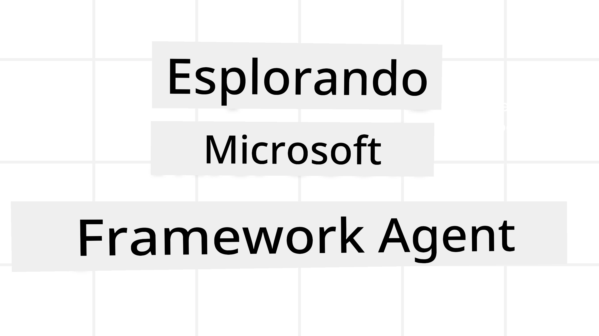
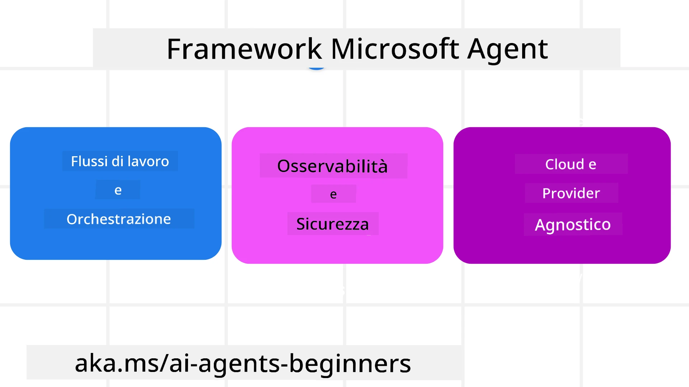
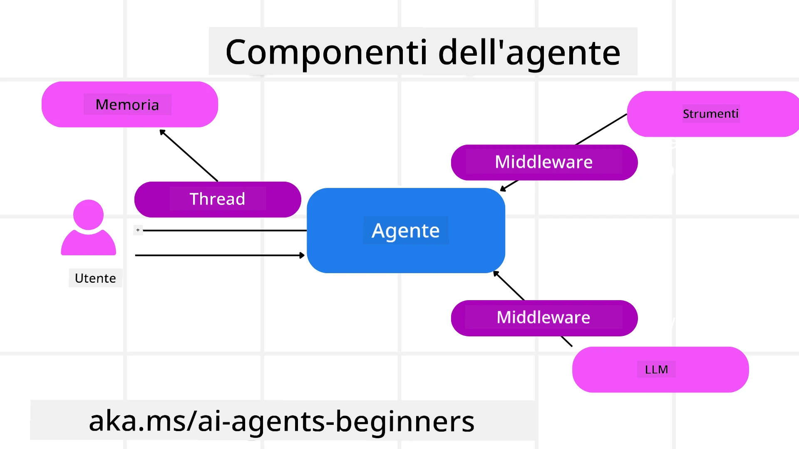

<!--
CO_OP_TRANSLATOR_METADATA:
{
  "original_hash": "19c4dab375acbc733855cc7f2f04edbc",
  "translation_date": "2025-10-02T14:05:11+00:00",
  "source_file": "14-microsoft-agent-framework/README.md",
  "language_code": "it"
}
-->
# Esplorare Microsoft Agent Framework



### Introduzione

Questa lezione coprirà:

- Comprendere Microsoft Agent Framework: Caratteristiche principali e valore  
- Esplorare i concetti chiave di Microsoft Agent Framework
- Confrontare MAF con Semantic Kernel e AutoGen: Guida alla migrazione

## Obiettivi di apprendimento

Dopo aver completato questa lezione, saprai come:

- Creare agenti AI pronti per la produzione utilizzando Microsoft Agent Framework
- Applicare le caratteristiche principali di Microsoft Agent Framework ai tuoi casi d'uso agentici
- Migrare e integrare framework e strumenti agentici esistenti  

## Esempi di codice 

Gli esempi di codice per [Microsoft Agent Framework (MAF)](https://aka.ms/ai-agents-beginners/agent-framewrok) sono disponibili in questo repository nei file `xx-python-agent-framework` e `xx-dotnet-agent-framework`.

## Comprendere Microsoft Agent Framework



[Microsoft Agent Framework (MAF)](https://aka.ms/ai-agents-beginners/agent-framewrok) si basa sull'esperienza e sugli insegnamenti di Semantic Kernel e AutoGen. Offre la flessibilità necessaria per affrontare la vasta gamma di casi d'uso agentici osservati sia in ambienti di produzione che di ricerca, tra cui:

- **Orchestrazione sequenziale degli agenti** in scenari che richiedono flussi di lavoro passo-passo.
- **Orchestrazione concorrente** in scenari in cui gli agenti devono completare compiti contemporaneamente.
- **Orchestrazione di chat di gruppo** in scenari in cui gli agenti collaborano insieme su un unico compito.
- **Orchestrazione di passaggio** in scenari in cui gli agenti si passano il compito l'un l'altro man mano che i sottocompiti vengono completati.
- **Orchestrazione magnetica** in scenari in cui un agente manager crea e modifica una lista di compiti e gestisce il coordinamento dei sottoagenti per completare il compito.

Per fornire agenti AI in produzione, MAF include anche funzionalità per:

- **Osservabilità** attraverso l'uso di OpenTelemetry, dove ogni azione dell'agente AI, inclusa l'invocazione degli strumenti, i passaggi di orchestrazione, i flussi di ragionamento e il monitoraggio delle prestazioni, è visibile tramite dashboard di Azure AI Foundry.
- **Sicurezza** ospitando gli agenti nativamente su Azure AI Foundry, che include controlli di sicurezza come accesso basato sui ruoli, gestione dei dati privati e sicurezza dei contenuti integrata.
- **Durabilità** poiché i thread e i flussi di lavoro degli agenti possono essere messi in pausa, ripresi e recuperati dagli errori, consentendo processi di lunga durata.
- **Controllo** poiché sono supportati flussi di lavoro con intervento umano, in cui i compiti sono contrassegnati come richiedenti approvazione umana.

Microsoft Agent Framework si concentra anche sull'essere interoperabile grazie a:

- **Essere indipendente dal cloud** - Gli agenti possono essere eseguiti in container, on-premise e su diversi cloud.
- **Essere indipendente dal provider** - Gli agenti possono essere creati tramite il tuo SDK preferito, inclusi Azure OpenAI e OpenAI.
- **Integrare standard aperti** - Gli agenti possono utilizzare protocolli come Agent-to-Agent (A2A) e Model Context Protocol (MCP) per scoprire e utilizzare altri agenti e strumenti.
- **Plugin e connettori** - È possibile stabilire connessioni con servizi di dati e memoria come Microsoft Fabric, SharePoint, Pinecone e Qdrant.

Vediamo come queste funzionalità si applicano ad alcuni dei concetti chiave di Microsoft Agent Framework.

## Concetti chiave di Microsoft Agent Framework

### Agenti



**Creazione di agenti**

La creazione di un agente avviene definendo il servizio di inferenza (LLM Provider), un insieme di istruzioni che l'agente AI deve seguire e un `nome` assegnato:

```python
agent = AzureOpenAIChatClient(credential=AzureCliCredential()).create_agent( instructions="You are good at recommending trips to customers based on their preferences.", name="TripRecommender" )
```

L'esempio sopra utilizza `Azure OpenAI`, ma gli agenti possono essere creati utilizzando una varietà di servizi, inclusi `Azure AI Foundry Agent Service`:

```python
AzureAIAgentClient(async_credential=credential).create_agent( name="HelperAgent", instructions="You are a helpful assistant." ) as agent
```

API di `Responses` e `ChatCompletion` di OpenAI

```python
agent = OpenAIResponsesClient().create_agent( name="WeatherBot", instructions="You are a helpful weather assistant.", )
```

```python
agent = OpenAIChatClient().create_agent( name="HelpfulAssistant", instructions="You are a helpful assistant.", )
```

o agenti remoti utilizzando il protocollo A2A:

```python
agent = A2AAgent( name=agent_card.name, description=agent_card.description, agent_card=agent_card, url="https://your-a2a-agent-host" )
```

**Esecuzione degli agenti**

Gli agenti vengono eseguiti utilizzando i metodi `.run` o `.run_stream` per risposte non in streaming o in streaming.

```python
result = await agent.run("What are good places to visit in Amsterdam?")
print(result.text)
```

```python
async for update in agent.run_stream("What are the good places to visit in Amsterdam?"):
    if update.text:
        print(update.text, end="", flush=True)

```

Ogni esecuzione dell'agente può anche avere opzioni per personalizzare parametri come `max_tokens` utilizzati dall'agente, `tools` che l'agente può chiamare e persino il `model` stesso utilizzato dall'agente.

Questo è utile nei casi in cui sono richiesti modelli o strumenti specifici per completare un compito dell'utente.

**Strumenti**

Gli strumenti possono essere definiti sia durante la definizione dell'agente:

```python
def get_attractions( location: Annotated[str, Field(description="The location to get the top tourist attractions for")], ) -> str: """Get the top tourist attractions for a given location.""" return f"The top attractions for {location} are." 


# When creating a ChatAgent directly 

agent = ChatAgent( chat_client=OpenAIChatClient(), instructions="You are a helpful assistant", tools=[get_attractions]

```

sia durante l'esecuzione dell'agente:

```python

result1 = await agent.run( "What's the best place to visit in Seattle?", tools=[get_attractions] # Tool provided for this run only )
```

**Thread degli agenti**

I thread degli agenti vengono utilizzati per gestire conversazioni multi-turn. I thread possono essere creati utilizzando:

- `get_new_thread()`, che consente di salvare il thread nel tempo
- Creando automaticamente un thread durante l'esecuzione di un agente, con il thread che dura solo durante l'esecuzione corrente.

Per creare un thread, il codice è simile a questo:

```python
# Create a new thread. 
thread = agent.get_new_thread() # Run the agent with the thread. 
response = await agent.run("Hello, I am here to help you book travel. Where would you like to go?", thread=thread)

```

Puoi quindi serializzare il thread per conservarlo per un uso futuro:

```python
# Create a new thread. 
thread = agent.get_new_thread() 

# Run the agent with the thread. 

response = await agent.run("Hello, how are you?", thread=thread) 

# Serialize the thread for storage. 

serialized_thread = await thread.serialize() 

# Deserialize the thread state after loading from storage. 

resumed_thread = await agent.deserialize_thread(serialized_thread)
```

**Middleware degli agenti**

Gli agenti interagiscono con strumenti e LLM per completare i compiti degli utenti. In determinati scenari, vogliamo eseguire o tracciare azioni tra queste interazioni. Il middleware degli agenti ci consente di farlo attraverso:

*Middleware delle funzioni*

Questo middleware consente di eseguire un'azione tra l'agente e una funzione/strumento che chiamerà. Un esempio di utilizzo potrebbe essere il logging della chiamata alla funzione.

Nel codice sottostante, `next` definisce se chiamare il prossimo middleware o la funzione effettiva.

```python
async def logging_function_middleware(
    context: FunctionInvocationContext,
    next: Callable[[FunctionInvocationContext], Awaitable[None]],
) -> None:
    """Function middleware that logs function execution."""
    # Pre-processing: Log before function execution
    print(f"[Function] Calling {context.function.name}")

    # Continue to next middleware or function execution
    await next(context)

    # Post-processing: Log after function execution
    print(f"[Function] {context.function.name} completed")
```

*Middleware della chat*

Questo middleware consente di eseguire o registrare un'azione tra l'agente e le richieste tra il LLM.

Contiene informazioni importanti come i `messages` inviati al servizio AI.

```python
async def logging_chat_middleware(
    context: ChatContext,
    next: Callable[[ChatContext], Awaitable[None]],
) -> None:
    """Chat middleware that logs AI interactions."""
    # Pre-processing: Log before AI call
    print(f"[Chat] Sending {len(context.messages)} messages to AI")

    # Continue to next middleware or AI service
    await next(context)

    # Post-processing: Log after AI response
    print("[Chat] AI response received")

```

**Memoria dell'agente**

Come trattato nella lezione `Agentic Memory`, la memoria è un elemento importante per consentire all'agente di operare in diversi contesti. MAF offre diversi tipi di memorie:

*Memoria in memoria*

Questa è la memoria conservata nei thread durante il runtime dell'applicazione.

```python
# Create a new thread. 
thread = agent.get_new_thread() # Run the agent with the thread. 
response = await agent.run("Hello, I am here to help you book travel. Where would you like to go?", thread=thread)
```

*Messaggi persistenti*

Questa memoria viene utilizzata per conservare la cronologia delle conversazioni tra sessioni diverse. È definita utilizzando il `chat_message_store_factory`:

```python
from agent_framework import ChatMessageStore

# Create a custom message store
def create_message_store():
    return ChatMessageStore()

agent = ChatAgent(
    chat_client=OpenAIChatClient(),
    instructions="You are a Travel assistant.",
    chat_message_store_factory=create_message_store
)

```

*Memoria dinamica*

Questa memoria viene aggiunta al contesto prima che gli agenti vengano eseguiti. Queste memorie possono essere conservate in servizi esterni come mem0:

```python
from agent_framework.mem0 import Mem0Provider

# Using Mem0 for advanced memory capabilities
memory_provider = Mem0Provider(
    api_key="your-mem0-api-key",
    user_id="user_123",
    application_id="my_app"
)

agent = ChatAgent(
    chat_client=OpenAIChatClient(),
    instructions="You are a helpful assistant with memory.",
    context_providers=memory_provider
)

```

**Osservabilità dell'agente**

L'osservabilità è importante per costruire sistemi agentici affidabili e manutenibili. MAF si integra con OpenTelemetry per fornire tracciamento e misurazioni per una migliore osservabilità.

```python
from agent_framework.observability import get_tracer, get_meter

tracer = get_tracer()
meter = get_meter()
with tracer.start_as_current_span("my_custom_span"):
    # do something
    pass
counter = meter.create_counter("my_custom_counter")
counter.add(1, {"key": "value"})
```

### Flussi di lavoro

MAF offre flussi di lavoro che sono passaggi predefiniti per completare un compito e includono agenti AI come componenti di questi passaggi.

I flussi di lavoro sono costituiti da diversi componenti che consentono un migliore controllo del flusso. I flussi di lavoro abilitano anche **orchestrazione multi-agente** e **checkpointing** per salvare gli stati del flusso di lavoro.

I componenti principali di un flusso di lavoro sono:

**Esecutori**

Gli esecutori ricevono messaggi di input, svolgono i compiti assegnati e producono un messaggio di output. Questo fa avanzare il flusso di lavoro verso il completamento del compito più grande. Gli esecutori possono essere agenti AI o logica personalizzata.

**Edge**

Gli edge vengono utilizzati per definire il flusso di messaggi in un flusso di lavoro. Possono essere:

*Edge diretti* - Connessioni semplici uno-a-uno tra esecutori:

```python
from agent_framework import WorkflowBuilder

builder = WorkflowBuilder()
builder.add_edge(source_executor, target_executor)
builder.set_start_executor(source_executor)
workflow = builder.build()
```

*Edge condizionali* - Attivati dopo che una certa condizione è soddisfatta. Ad esempio, quando le camere d'albergo non sono disponibili, un esecutore può suggerire altre opzioni.

*Edge switch-case* - Instradano i messaggi a diversi esecutori in base a condizioni definite. Ad esempio, se un cliente di viaggio ha accesso prioritario, i suoi compiti saranno gestiti attraverso un altro flusso di lavoro.

*Edge fan-out* - Invia un messaggio a più destinatari.

*Edge fan-in* - Raccoglie più messaggi da diversi esecutori e li invia a un unico destinatario.

**Eventi**

Per fornire una migliore osservabilità nei flussi di lavoro, MAF offre eventi integrati per l'esecuzione, tra cui:

- `WorkflowStartedEvent`  - Inizio dell'esecuzione del flusso di lavoro
- `WorkflowOutputEvent` - Il flusso di lavoro produce un output
- `WorkflowErrorEvent` - Il flusso di lavoro incontra un errore
- `ExecutorInvokeEvent`  - L'esecutore inizia l'elaborazione
- `ExecutorCompleteEvent`  - L'esecutore termina l'elaborazione
- `RequestInfoEvent` - Viene emessa una richiesta

## Migrazione da altri framework (Semantic Kernel e AutoGen)

### Differenze tra MAF e Semantic Kernel

**Creazione semplificata degli agenti**

Semantic Kernel si basa sulla creazione di un'istanza del Kernel per ogni agente. MAF utilizza un approccio semplificato tramite estensioni per i principali provider.

```python
agent = AzureOpenAIChatClient(credential=AzureCliCredential()).create_agent( instructions="You are good at reccomending trips to customers based on their preferences.", name="TripRecommender" )
```

**Creazione dei thread degli agenti**

Semantic Kernel richiede la creazione manuale dei thread. In MAF, il thread viene assegnato direttamente all'agente.

```python
thread = agent.get_new_thread() # Run the agent with the thread. 
```

**Registrazione degli strumenti**

In Semantic Kernel, gli strumenti vengono registrati nel Kernel, che viene poi passato all'agente. In MAF, gli strumenti vengono registrati direttamente durante il processo di creazione dell'agente.

```python
agent = ChatAgent( chat_client=OpenAIChatClient(), instructions="You are a helpful assistant", tools=[get_attractions]
```

### Differenze tra MAF e AutoGen

**Team vs Flussi di lavoro**

I `Team` sono la struttura degli eventi per attività guidate da eventi con agenti in AutoGen. MAF utilizza i `Workflows`, che instradano i dati agli esecutori attraverso un'architettura basata su grafi.

**Creazione degli strumenti**

AutoGen utilizza `FunctionTool` per avvolgere le funzioni che gli agenti possono chiamare. MAF utilizza @ai_function, che opera in modo simile ma deduce automaticamente gli schemi per ogni funzione.

**Comportamento degli agenti**

Gli agenti sono agenti a singolo turno per impostazione predefinita in AutoGen, a meno che `max_tool_iterations` non sia impostato su un valore più alto. In MAF, il `ChatAgent` è multi-turn per impostazione predefinita, il che significa che continuerà a chiamare strumenti fino al completamento del compito dell'utente.

## Esempi di codice 

Gli esempi di codice per Microsoft Agent Framework sono disponibili in questo repository nei file `xx-python-agent-framework` e `xx-dotnet-agent-framework`.

## Hai altre domande su Microsoft Agent Framework?

Unisciti al [Discord di Azure AI Foundry](https://aka.ms/ai-agents/discord) per incontrare altri studenti, partecipare agli orari d'ufficio e ottenere risposte alle tue domande sugli agenti AI.

---

**Disclaimer**:  
Questo documento è stato tradotto utilizzando il servizio di traduzione automatica [Co-op Translator](https://github.com/Azure/co-op-translator). Sebbene ci impegniamo per garantire l'accuratezza, si prega di notare che le traduzioni automatiche possono contenere errori o imprecisioni. Il documento originale nella sua lingua nativa dovrebbe essere considerato la fonte autorevole. Per informazioni critiche, si raccomanda una traduzione professionale effettuata da un traduttore umano. Non siamo responsabili per eventuali incomprensioni o interpretazioni errate derivanti dall'uso di questa traduzione.