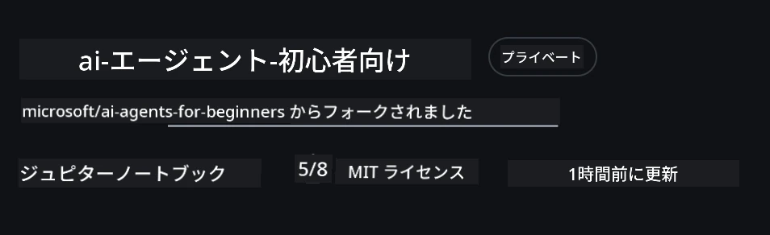
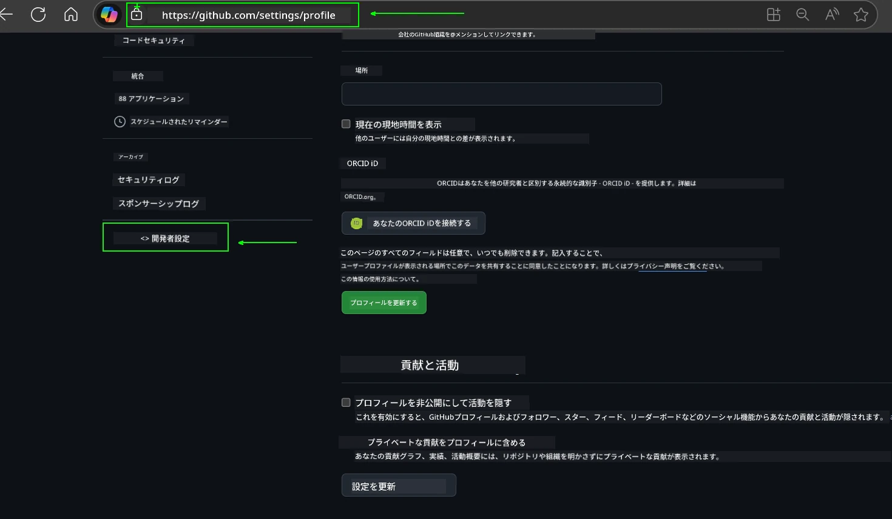
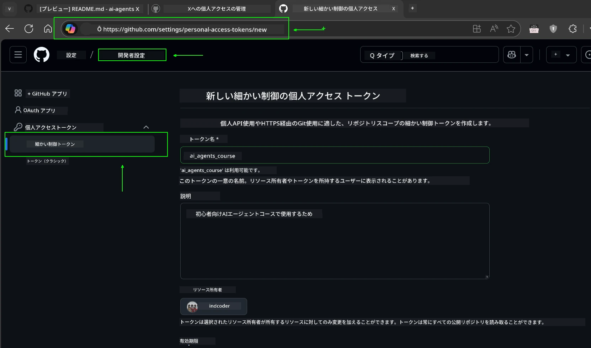
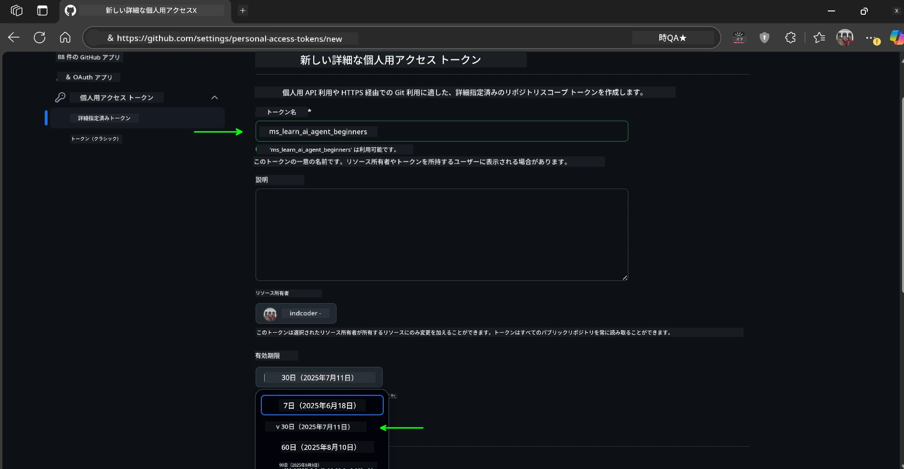
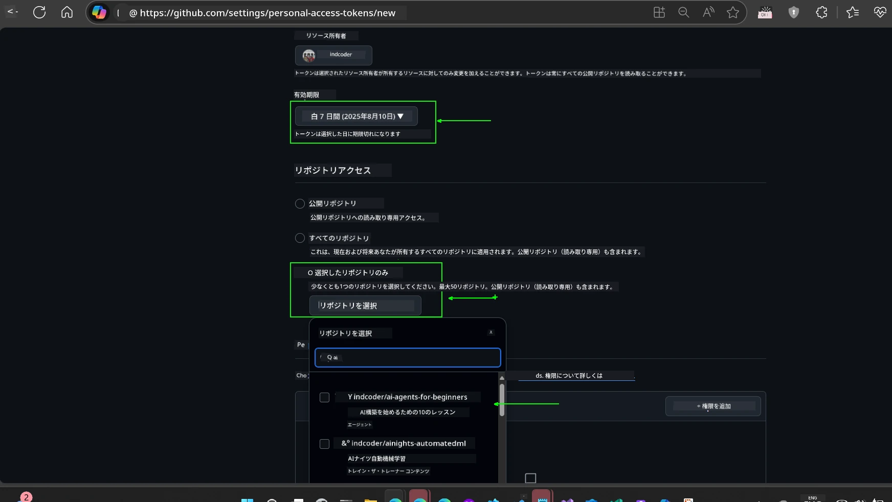
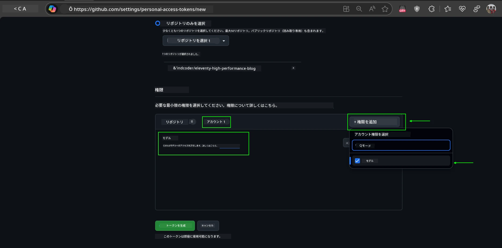
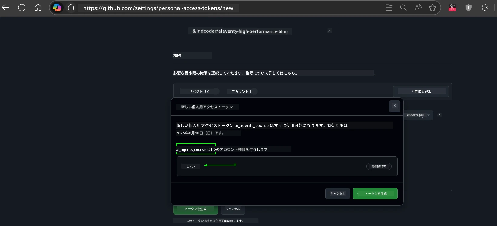
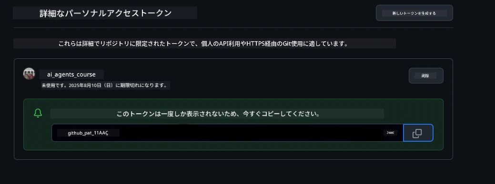
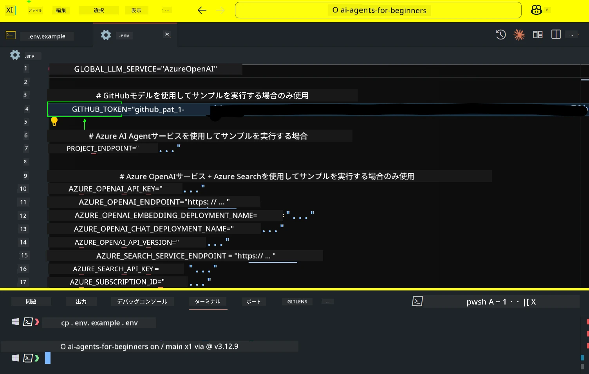
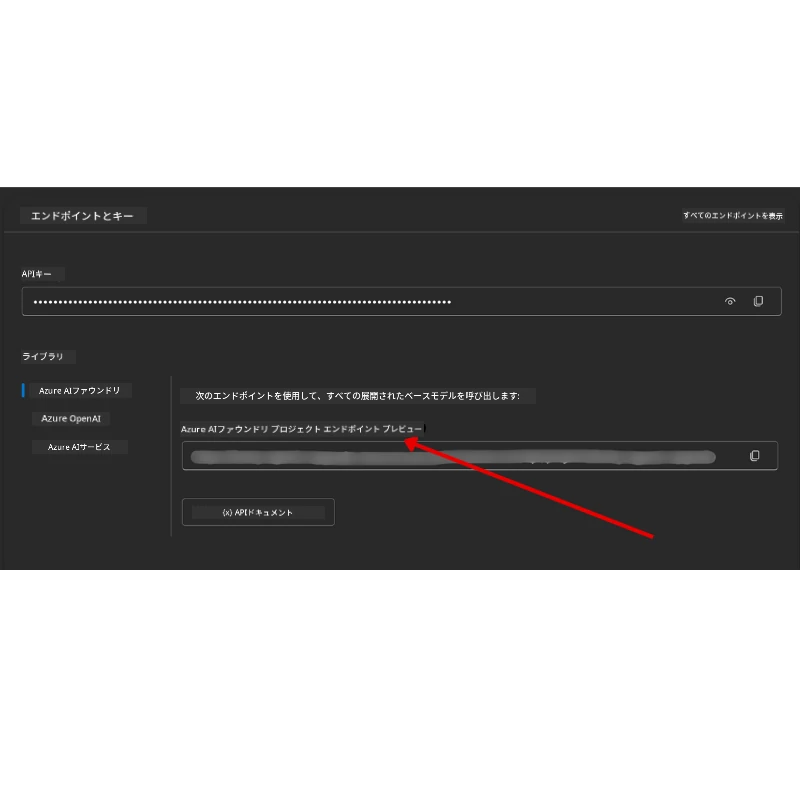

<!--
CO_OP_TRANSLATOR_METADATA:
{
  "original_hash": "63b1a8f6e840df15934935b728e569f0",
  "translation_date": "2025-12-03T14:01:07+00:00",
  "source_file": "00-course-setup/README.md",
  "language_code": "ja"
}
-->
# コースセットアップ

## はじめに

このレッスンでは、このコースのコードサンプルを実行する方法について説明します。

## 他の学習者と交流し、助けを得る

リポジトリをクローンする前に、[AI Agents For Beginners Discordチャンネル](https://aka.ms/ai-agents/discord)に参加してください。セットアップに関するヘルプやコースに関する質問、他の学習者との交流ができます。

## このリポジトリをクローンまたはフォークする

まず、GitHubリポジトリをクローンまたはフォークしてください。これにより、コース教材の自分専用のバージョンが作成され、コードを実行、テスト、調整することができます。

以下のリンクをクリックして、<a href="https://github.com/microsoft/ai-agents-for-beginners/fork" target="_blank">リポジトリをフォーク</a>してください。

これで、以下のリンクに自分専用のフォーク版コースが作成されます。



### シャロークローン（ワークショップ / Codespacesに推奨）

  >完全なリポジトリは、履歴やすべてのファイルをダウンロードすると大きくなる可能性があります（約3GB）。ワークショップに参加する場合や特定のレッスンフォルダのみが必要な場合、シャロークローン（またはスパースクローン）を使用すると、履歴を短縮したり、不要なデータをスキップすることでダウンロード量を減らすことができます。

#### 簡易シャロークローン — 最小限の履歴、すべてのファイル

以下のコマンドで `<your-username>` をフォークURL（または上流URL）に置き換えてください。

最新のコミット履歴のみをクローンする場合（ダウンロード量が少ない）:

```bash|powershell
git clone --depth 1 https://github.com/<your-username>/ai-agents-for-beginners.git
```

特定のブランチをクローンする場合:

```bash|powershell
git clone --depth 1 --branch <branch-name> https://github.com/<your-username>/ai-agents-for-beginners.git
```

#### 部分（スパース）クローン — 最小限のデータ + 選択したフォルダのみ

部分クローンとスパースチェックアウトを使用します（Git 2.25+が必要で、部分クローンをサポートする最新のGitを推奨）:

```bash|powershell
git clone --depth 1 --filter=blob:none --sparse https://github.com/<your-username>/ai-agents-for-beginners.git
```

リポジトリフォルダに移動します:

```bash|powershell
cd ai-agents-for-beginners
```

次に必要なフォルダを指定します（以下の例では2つのフォルダを示しています）:

```bash|powershell
git sparse-checkout set 00-course-setup 01-intro-to-ai-agents
```

クローンしてファイルを確認した後、ファイルのみが必要でスペースを解放したい場合（Git履歴不要）、リポジトリメタデータを削除してください（💀不可逆 — Git機能はすべて失われます: コミット、プル、プッシュ、履歴アクセスができなくなります）。

```bash
# zsh/bash
rm -rf .git
```

```powershell
# パワーシェル
Remove-Item -Recurse -Force .git
```

#### GitHub Codespacesを使用する（ローカルでの大容量ダウンロードを避けるために推奨）

- [GitHub UI](https://github.com/codespaces)を通じてこのリポジトリの新しいCodespaceを作成します。

- 作成されたCodespaceのターミナルで、上記のシャロー/スパースクローンコマンドのいずれかを実行し、必要なレッスンフォルダのみをCodespaceワークスペースに取り込みます。
- オプション: Codespaces内でクローンした後、.gitを削除して余分なスペースを回収します（上記の削除コマンドを参照）。
- 注意: Codespacesでリポジトリを直接開くことを好む場合、Codespacesはdevcontainer環境を構築し、必要以上のプロビジョニングを行う可能性があります。新しいCodespace内でシャローコピーをクローンすることで、ディスク使用量をよりコントロールできます。

#### ヒント

- 編集やコミットを行いたい場合は、常にクローンURLをフォークに置き換えてください。
- 後で履歴やファイルがさらに必要になった場合は、それらを取得するか、スパースチェックアウトを調整して追加のフォルダを含めることができます。

## コードの実行

このコースでは、AIエージェントを構築する実践的な経験を得るために使用できる一連のJupyter Notebookを提供しています。

コードサンプルは以下のいずれかを使用します:

**GitHubアカウントが必要 - 無料**:

1) Semantic Kernel Agent Framework + GitHub Models Marketplace. (semantic-kernel.ipynbとしてラベル付け)
2) AutoGen Framework + GitHub Models Marketplace. (autogen.ipynbとしてラベル付け)

**Azureサブスクリプションが必要**:

3) Azure AI Foundry + Azure AI Agent Service. (azureaiagent.ipynbとしてラベル付け)

3つの例すべてを試してみて、どれが最適かを確認することをお勧めします。

選択したオプションに応じて、以下のセットアップ手順が必要になります。

## 必要条件

- Python 3.12+
  - **NOTE**: Python3.12がインストールされていない場合は、インストールしてください。その後、python3.12を使用してvenvを作成し、requirements.txtファイルから正しいバージョンをインストールしてください。
  
    >例

    Python venvディレクトリを作成:

    ```bash|powershell
    python -m venv venv
    ```

    次にvenv環境をアクティブ化:

    ```bash
    # zsh/bash
    source venv/bin/activate
    ```
  
    ```dos
    # Command Prompt for Windows
    venv\Scripts\activate
    ```

- .NET 10+: .NETを使用するサンプルコードの場合、[.NET 10 SDK](https://dotnet.microsoft.com/download/dotnet/10.0)以降をインストールしてください。その後、インストール済みの.NET SDKバージョンを確認します:

    ```bash|powershell
    dotnet --list-sdks
    ```

- GitHubアカウント - GitHub Models Marketplaceへのアクセス
- Azureサブスクリプション - Azure AI Foundryへのアクセス
- Azure AI Foundryアカウント - Azure AI Agent Serviceへのアクセス

このリポジトリのルートには、コードサンプルを実行するために必要なPythonパッケージを含む`requirements.txt`ファイルが含まれています。

以下のコマンドをリポジトリのルートでターミナルで実行することでインストールできます:

```bash|powershell
pip install -r requirements.txt
```

Python仮想環境を作成することをお勧めします。これにより、競合や問題を回避できます。

## VSCodeのセットアップ

VSCodeで正しいバージョンのPythonを使用していることを確認してください。


## GitHub Modelsを使用するサンプルのセットアップ

### ステップ1: GitHub Personal Access Token (PAT)を取得

このコースではGitHub Models Marketplaceを活用し、AIエージェントを構築するために使用する大規模言語モデル（LLM）への無料アクセスを提供します。

GitHub Modelsを使用するには、[GitHub Personal Access Token](https://docs.github.com/en/authentication/keeping-your-account-and-data-secure/managing-your-personal-access-tokens)を作成する必要があります。

GitHubアカウントの<a href="https://github.com/settings/personal-access-tokens" target="_blank">Personal Access Tokens設定</a>に移動して作成できます。

トークンを作成する際は、[最小権限の原則](https://docs.github.com/en/get-started/learning-to-code/storing-your-secrets-safely)に従ってください。つまり、このコースのコードサンプルを実行するために必要な権限のみをトークンに付与するべきです。

1. **Developer settings**に移動し、画面左側の`Fine-grained tokens`オプションを選択します。

   

   次に`Generate new token`を選択します。

   

2. トークンの目的を反映した説明的な名前を入力し、後で簡単に識別できるようにします。

    🔐 トークンの有効期間の推奨

    推奨期間: 30日
    より安全な設定を希望する場合は、7日などの短期間を選択することもできます 🛡️
    これにより、学習の勢いを維持しながらコースを完了するための個人的な目標を設定できます 🚀。

    

3. トークンのスコープをこのリポジトリのフォークに限定します。

    

4. トークンの権限を制限します: **Permissions**の下で**Account**タブをクリックし、"+ Add permissions"ボタンをクリックします。ドロップダウンが表示されます。**Models**を検索し、チェックボックスをオンにしてください。

    

5. トークンを生成する前に、必要な権限を確認してください。 

6. トークンを生成する前に、パスワードマネージャーの保管庫など安全な場所にトークンを保存する準備ができていることを確認してください。生成後は再表示されません。 

作成した新しいトークンをコピーしてください。このトークンをこのコースに含まれる`.env`ファイルに追加します。

### ステップ2: `.env`ファイルを作成

ターミナルで以下のコマンドを実行して`.env`ファイルを作成します。

```bash
# zsh/bash
cp .env.example .env
```

```powershell
# パワーシェル
Copy-Item .env.example .env
```

これにより、例のファイルがコピーされ、ディレクトリ内に`.env`が作成されます。環境変数の値を記入してください。

コピーしたトークンを使用して、お気に入りのテキストエディタで`.env`ファイルを開き、`GITHUB_TOKEN`フィールドにトークンを貼り付けます。



これで、このコースのコードサンプルを実行できるようになります。

## Azure AI FoundryとAzure AI Agent Serviceを使用するサンプルのセットアップ

### ステップ1: Azureプロジェクトエンドポイントを取得

Azure AI Foundryでハブとプロジェクトを作成する手順については、[Hub resources overview](https://learn.microsoft.com/azure/ai-foundry/concepts/ai-resources)をご覧ください。

プロジェクトを作成したら、プロジェクトの接続文字列を取得する必要があります。

これは、Azure AI Foundryポータルのプロジェクトの**概要**ページに移動することで行えます。



### ステップ2: `.env`ファイルを作成

ターミナルで以下のコマンドを実行して`.env`ファイルを作成します。

```bash
# zsh/bash
cp .env.example .env
```

```powershell
# パワーシェル
Copy-Item .env.example .env
```

これにより、例のファイルがコピーされ、ディレクトリ内に`.env`が作成されます。環境変数の値を記入してください。

コピーしたトークンを使用して、お気に入りのテキストエディタで`.env`ファイルを開き、`PROJECT_ENDPOINT`フィールドにトークンを貼り付けます。

### ステップ3: Azureにサインイン

セキュリティのベストプラクティスとして、Microsoft Entra IDを使用してAzure OpenAIに認証する[キーなし認証](https://learn.microsoft.com/azure/developer/ai/keyless-connections?tabs=csharp%2Cazure-cli?WT.mc_id=academic-105485-koreyst)を使用します。

次に、ターミナルを開き、`az login --use-device-code`を実行してAzureアカウントにサインインします。

サインインしたら、ターミナルでサブスクリプションを選択します。

## 追加の環境変数 - Azure SearchとAzure OpenAI

Agentic RAG Lesson - Lesson 5では、Azure SearchとAzure OpenAIを使用するサンプルがあります。

これらのサンプルを実行するには、以下の環境変数を`.env`ファイルに追加する必要があります:

### 概要ページ（プロジェクト）

- `AZURE_SUBSCRIPTION_ID` - プロジェクトの**概要**ページの**プロジェクト詳細**を確認してください。

- `AZURE_AI_PROJECT_NAME` - プロジェクトの**概要**ページの上部を確認してください。

- `AZURE_OPENAI_SERVICE` - **概要**ページの**含まれる機能**タブで**Azure OpenAI Service**を確認してください。

### 管理センター

- `AZURE_OPENAI_RESOURCE_GROUP` - **管理センター**の**概要**ページで**プロジェクトプロパティ**を確認してください。

- `GLOBAL_LLM_SERVICE` - **接続されたリソース**の下で**Azure AI Services**接続名を確認してください。リストされていない場合は、リソースグループ内のAI Servicesリソース名をAzureポータルで確認してください。

### モデル + エンドポイントページ

- `AZURE_OPENAI_EMBEDDING_DEPLOYMENT_NAME` - 埋め込みモデル（例: `text-embedding-ada-002`）を選択し、モデル詳細から**デプロイメント名**を確認してください。

- `AZURE_OPENAI_CHAT_DEPLOYMENT_NAME` - チャットモデル（例: `gpt-4o-mini`）を選択し、モデル詳細から**デプロイメント名**を確認してください。

### Azureポータル

- `AZURE_OPENAI_ENDPOINT` - **Azure AI services**を探し、クリックして**リソース管理**、**キーとエンドポイント**に移動し、「Azure OpenAIエンドポイント」の「言語API」をコピーしてください。

- `AZURE_OPENAI_API_KEY` - 同じ画面からKEY 1またはKEY 2をコピーしてください。

- `AZURE_SEARCH_SERVICE_ENDPOINT` - **Azure AI Search**リソースを探し、クリックして**概要**を確認してください。

- `AZURE_SEARCH_API_KEY` - 次に**設定**、**キー**に移動して、プライマリまたはセカンダリ管理キーをコピーしてください。

### 外部ウェブページ

- `AZURE_OPENAI_API_VERSION` - [APIバージョンライフサイクル](https://learn.microsoft.com/azure/ai-services/openai/api-version-deprecation#latest-ga-api-release)ページの**最新GA APIリリース**を確認してください。

### キーなし認証のセットアップ

資格情報をハードコードする代わりに、Azure OpenAIとのキーなし接続を使用します。そのために`DefaultAzureCredential`をインポートし、後で`DefaultAzureCredential`関数を呼び出して資格情報を取得します。

```python
# パイソン
from azure.identity import DefaultAzureCredential, InteractiveBrowserCredential
```

## どこかで詰まっていますか？
セットアップの実行に問題がある場合は、<a href="https://discord.gg/kzRShWzttr" target="_blank">Azure AI Community Discord</a>に参加するか、<a href="https://github.com/microsoft/ai-agents-for-beginners/issues?WT.mc_id=academic-105485-koreyst" target="_blank">問題を作成</a>してください。

## 次のレッスン

これで、このコースのコードを実行する準備が整いました。AIエージェントの世界についてさらに学ぶことを楽しんでください！

[AIエージェントとそのユースケースの紹介](../01-intro-to-ai-agents/README.md)

---

<!-- CO-OP TRANSLATOR DISCLAIMER START -->
**免責事項**:  
この文書は、AI翻訳サービス[Co-op Translator](https://github.com/Azure/co-op-translator)を使用して翻訳されています。正確性を期すよう努めておりますが、自動翻訳には誤りや不正確な部分が含まれる可能性があります。原文（元の言語で記載された文書）を信頼できる情報源としてご参照ください。重要な情報については、専門の人間による翻訳をお勧めします。本翻訳の使用に起因する誤解や誤認について、当方は一切の責任を負いかねます。
<!-- CO-OP TRANSLATOR DISCLAIMER END -->