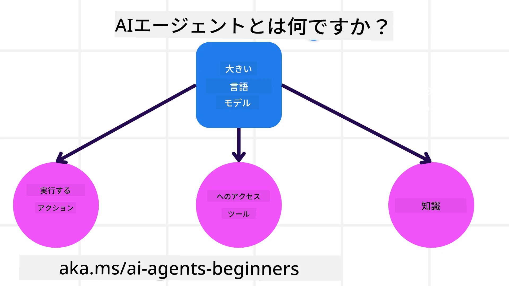
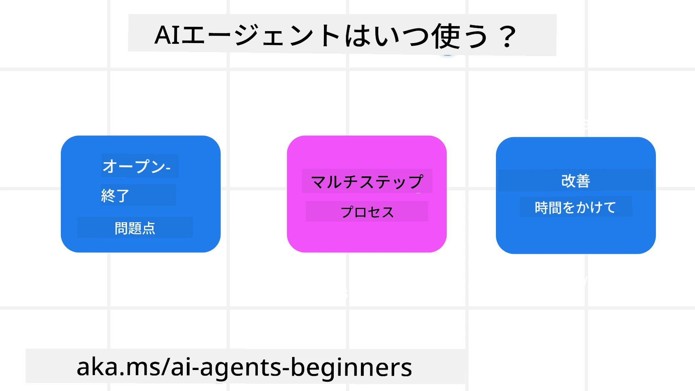

<!--
CO_OP_TRANSLATOR_METADATA:
{
  "original_hash": "cdd28bc00816d2773bb2b5968d782abc",
  "translation_date": "2025-11-11T10:59:56+00:00",
  "source_file": "01-intro-to-ai-agents/README.md",
  "language_code": "ja"
}
-->

> _(上の画像をクリックして、このレッスンの動画をご覧ください)_

# AIエージェントとその活用事例の紹介

「初心者向けAIエージェント」コースへようこそ！このコースでは、AIエージェントを構築するための基本的な知識と応用例を提供します。

<a href="https://discord.gg/kzRShWzttr" target="_blank">Azure AI Discordコミュニティ</a>に参加して、他の学習者やAIエージェント開発者と交流し、このコースに関する質問をしてください。

このコースを始めるにあたり、まずAIエージェントとは何か、そしてそれをどのようにアプリケーションやワークフローに活用できるかを理解していきます。

## はじめに

このレッスンでは以下を学びます：

- AIエージェントとは何か、そしてその種類は？
- AIエージェントに最適な活用事例とその利点は？
- エージェントソリューションを設計する際の基本的な構成要素は？

## 学習目標
このレッスンを完了すると、以下ができるようになります：

- AIエージェントの概念を理解し、他のAIソリューションとの違いを把握する。
- AIエージェントを効率的に活用する。
- ユーザーや顧客にとって生産的なエージェントソリューションを設計する。

## AIエージェントの定義と種類

### AIエージェントとは？

AIエージェントは、**システム**であり、**大規模言語モデル（LLM）**に**ツールや知識へのアクセスを提供することで**、その能力を拡張し、**アクションを実行**できるようにするものです。

この定義をいくつかの部分に分けて説明します：

- **システム** - エージェントを単なる1つのコンポーネントとしてではなく、複数のコンポーネントからなるシステムとして考えることが重要です。AIエージェントの基本的な構成要素は以下の通りです：
  - **環境** - AIエージェントが動作する定義された空間。例えば、旅行予約AIエージェントの場合、環境はエージェントがタスクを完了するために使用する旅行予約システムです。
  - **センサー** - 環境には情報があり、フィードバックを提供します。AIエージェントはセンサーを使用して、環境の現在の状態に関する情報を収集し解釈します。旅行予約エージェントの例では、ホテルの空室状況や航空券の価格などの情報を提供する旅行予約システムがセンサーに該当します。
  - **アクチュエーター** - AIエージェントが環境の現在の状態を受け取った後、現在のタスクに基づいて環境を変更するためのアクションを決定します。旅行予約エージェントの場合、ユーザーのために空室を予約することがアクションに該当します。

**大規模言語モデル** - エージェントの概念はLLMが登場する以前から存在していました。LLMを使用してAIエージェントを構築する利点は、人間の言語やデータを解釈する能力にあります。この能力により、LLMは環境情報を解釈し、環境を変更する計画を立てることができます。

**アクションの実行** - AIエージェントシステム外では、LLMはユーザーのプロンプトに基づいてコンテンツや情報を生成する状況に限定されます。AIエージェントシステム内では、LLMはユーザーのリクエストを解釈し、環境内で利用可能なツールを使用してタスクを達成することができます。

**ツールへのアクセス** - LLMがアクセスできるツールは、1)エージェントが動作する環境、2)AIエージェントの開発者によって定義されます。旅行エージェントの例では、エージェントのツールは予約システムで利用可能な操作によって制限されるか、開発者がエージェントのツールアクセスをフライトに限定することができます。

**記憶+知識** - 記憶は、ユーザーとエージェント間の会話の文脈で短期的に機能します。長期的には、環境から提供される情報以外にも、AIエージェントは他のシステム、サービス、ツール、さらには他のエージェントから知識を取得することができます。旅行エージェントの例では、この知識は顧客データベースに保存されているユーザーの旅行の好みに関する情報である可能性があります。

### エージェントの種類

AIエージェントの一般的な定義を理解したところで、具体的なエージェントの種類と、それらが旅行予約AIエージェントにどのように適用されるかを見てみましょう。

| **エージェントの種類**         | **説明**                                                                                                                       | **例**                                                                                                                                                                                                                   |
| ----------------------------- | -------------------------------------------------------------------------------------------------------------------------------- | ----------------------------------------------------------------------------------------------------------------------------------------------------------------------------------------------------------------------------- |
| **単純反射型エージェント**      | 事前定義されたルールに基づいて即座にアクションを実行します。                                                                                  | 旅行エージェントがメールの内容を解釈し、旅行に関する苦情をカスタマーサービスに転送します。                                                                                                                          |
| **モデルベース反射型エージェント** | 世界のモデルとそのモデルの変化に基づいてアクションを実行します。                                                              | 旅行エージェントが過去の価格データへのアクセスに基づいて、価格変動が大きいルートを優先します。                                                                                                             |
| **目標ベースエージェント**         | 目標を解釈し、それを達成するためのアクションを決定して計画を立てます。                                  | 旅行エージェントが現在地から目的地までの必要な旅行手配（車、公共交通機関、フライト）を決定して旅程を予約します。                                                                                |
| **効用ベースエージェント**      | 数値的にトレードオフを考慮し、目標を達成する方法を決定します。                                               | 旅行エージェントが利便性とコストを比較して、旅行を予約する際の効用を最大化します。                                                                                                                                          |
| **学習エージェント**           | フィードバックに応じてアクションを調整し、時間とともに改善します。                                                        | 旅行エージェントが旅行後のアンケートから顧客のフィードバックを使用して、将来の予約を改善します。                                                                                                               |
| **階層型エージェント**       | 複数のエージェントが階層的に構成され、高レベルのエージェントがタスクをサブタスクに分割し、低レベルのエージェントがそれを完了します。 | 旅行エージェントが旅行をキャンセルする際、タスクをサブタスク（例えば、特定の予約のキャンセル）に分割し、低レベルのエージェントがそれを完了し、高レベルのエージェントに報告します。                                     |
| **マルチエージェントシステム (MAS)** | エージェントが協力的または競争的に独立してタスクを完了します。                                                           | 協力的: 複数のエージェントがホテル、フライト、エンターテインメントなどの特定の旅行サービスを予約します。競争的: 複数のエージェントが共有のホテル予約カレンダーを管理し、顧客をホテルに予約するために競争します。 |

## AIエージェントを使用するタイミング

前のセクションでは、旅行エージェントのユースケースを使用して、旅行予約のさまざまなシナリオで異なる種類のエージェントがどのように使用されるかを説明しました。このコース全体でこのアプリケーションを使用し続けます。

AIエージェントが最適に使用されるユースケースの種類を見てみましょう：

- **オープンエンドの問題** - LLMがタスクを完了するために必要なステップを決定することを許可することで、ワークフローにハードコードすることが常に可能ではない場合に対応。
- **複数ステップのプロセス** - 単一の情報取得ではなく、複数回にわたってツールや情報を使用する必要がある複雑なタスク。
- **時間とともに改善** - 環境やユーザーからフィードバックを受け取り、それに応じて改善することで、より良い効用を提供するタスク。

AIエージェントを使用する際のさらなる考慮事項については、「信頼できるAIエージェントの構築」レッスンで詳しく説明します。

## エージェントソリューションの基本

### エージェント開発

AIエージェントシステムを設計する最初のステップは、ツール、アクション、行動を定義することです。このコースでは、**Azure AI Agent Service**を使用してエージェントを定義する方法に焦点を当てます。このサービスは以下の機能を提供します：

- OpenAI、Mistral、Llamaなどのオープンモデルの選択
- Tripadvisorなどのプロバイダーを通じたライセンスデータの使用
- 標準化されたOpenAPI 3.0ツールの使用

### エージェントパターン

LLMとのコミュニケーションはプロンプトを通じて行われます。AIエージェントの半自律的な性質を考慮すると、環境の変化後にLLMを手動で再プロンプトすることが常に可能または必要ではありません。**エージェントパターン**を使用することで、よりスケーラブルな方法で複数のステップにわたってLLMをプロンプトすることができます。

このコースでは、現在人気のあるエージェントパターンをいくつか紹介します。

### エージェントフレームワーク

エージェントフレームワークは、コードを通じてエージェントパターンを実装するためのものです。これらのフレームワークはテンプレート、プラグイン、ツールを提供し、AIエージェントのコラボレーションを向上させます。これらの利点により、AIエージェントシステムの観測性やトラブルシューティング能力が向上します。

このコースでは、研究主導のAutoGenフレームワークと、Semantic Kernelの実用的なエージェントフレームワークを探ります。

## サンプルコード

- Python: [Agent Framework](./code_samples/01-python-agent-framework.ipynb)
- .NET: [Agent Framework](./code_samples/01-dotnet-agent-framework.md)

## AIエージェントについてさらに質問がありますか？

[Azure AI Foundry Discord](https://aka.ms/ai-agents/discord)に参加して、他の学習者と交流したり、オフィスアワーに参加したりして、AIエージェントに関する質問に答えてもらいましょう。

## 前のレッスン

[コース設定](../00-course-setup/README.md)

## 次のレッスン

[エージェントフレームワークの探求](../02-explore-agentic-frameworks/README.md)

---

<!-- CO-OP TRANSLATOR DISCLAIMER START -->
**免責事項**:  
この文書はAI翻訳サービス[Co-op Translator](https://github.com/Azure/co-op-translator)を使用して翻訳されています。正確性を追求していますが、自動翻訳には誤りや不正確さが含まれる可能性があります。元の言語で記載された文書が正式な情報源とみなされるべきです。重要な情報については、専門の人間による翻訳を推奨します。この翻訳の使用に起因する誤解や誤解について、当社は責任を負いません。
<!-- CO-OP TRANSLATOR DISCLAIMER END -->