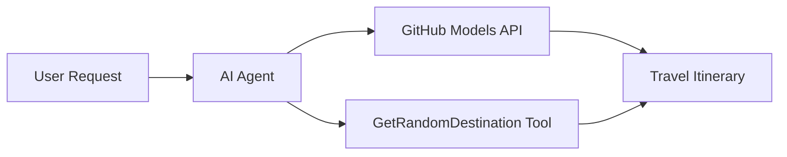

<!--
CO_OP_TRANSLATOR_METADATA:
{
  "original_hash": "5f351412e934f0833c8c821a0a60efaf",
  "translation_date": "2025-11-13T11:29:05+00:00",
  "source_file": "01-intro-to-ai-agents/code_samples/01-dotnet-agent-framework.md",
  "language_code": "ja"
}
-->
# 🌍 Microsoft Agent Framework (.NET) を使ったAI旅行代理店

## 📋 シナリオ概要

この例では、Microsoft Agent Framework for .NET を使用して、知的な旅行計画エージェントを構築する方法を示します。このエージェントは、世界中のランダムな目的地に対して個別の日帰り旅行プランを自動生成することができます。

### 主な機能:

- 🎲 **ランダムな目的地選択**: カスタムツールを使用して旅行先を選択
- 🗺️ **知的な旅行計画**: 日ごとの詳細な旅程を作成
- 🔄 **リアルタイムストリーミング**: 即時応答とストリーミング応答の両方をサポート
- 🛠️ **カスタムツール統合**: エージェントの機能拡張方法を示す

## 🔧 技術アーキテクチャ

### コア技術

- **Microsoft Agent Framework**: AIエージェント開発のための最新の.NET実装
- **GitHub Models Integration**: GitHubのAIモデル推論サービスを使用
- **OpenAI API互換性**: カスタムエンドポイントを使用したOpenAIクライアントライブラリを活用
- **安全な設定**: 環境ベースのAPIキー管理

### 主なコンポーネント

1. **AIAgent**: 会話の流れを管理する主要なエージェントオーケストレーター
2. **カスタムツール**: エージェントが利用可能な `GetRandomDestination()` 関数
3. **チャットクライアント**: GitHub Modelsをバックエンドとした会話インターフェース
4. **ストリーミングサポート**: リアルタイム応答生成機能

### 統合パターン



## 🚀 はじめに

### 必要条件

- [.NET 10 SDK](https://dotnet.microsoft.com/download/dotnet/10.0) 以上
- [GitHub Models API アクセストークン](https://docs.github.com/github-models/github-models-at-scale/using-your-own-api-keys-in-github-models)

### 必須環境変数

```bash
# zsh/bash
export GH_TOKEN=<your_github_token>
export GH_ENDPOINT=https://models.github.ai/inference
export GH_MODEL_ID=openai/gpt-5-mini
```

```powershell
# PowerShell
$env:GH_TOKEN = "<your_github_token>"
$env:GH_ENDPOINT = "https://models.github.ai/inference"
$env:GH_MODEL_ID = "openai/gpt-5-mini"
```

### サンプルコード

コード例を実行するには、

```bash
# zsh/bash
chmod +x ./01-dotnet-agent-framework.cs
./01-dotnet-agent-framework.cs
```

または dotnet CLI を使用して:

```bash
dotnet run ./01-dotnet-agent-framework.cs
```

完全なコードは [`01-dotnet-agent-framework.cs`](../../../../01-intro-to-ai-agents/code_samples/01-dotnet-agent-framework.cs) を参照してください。

```csharp
#!/usr/bin/dotnet run

#:package Microsoft.Extensions.AI@9.*
#:package Microsoft.Agents.AI.OpenAI@1.*-*

using System.ClientModel;
using System.ComponentModel;

using Microsoft.Agents.AI;
using Microsoft.Extensions.AI;

using OpenAI;

// Tool Function: Random Destination Generator
// This static method will be available to the agent as a callable tool
// The [Description] attribute helps the AI understand when to use this function
// This demonstrates how to create custom tools for AI agents
[Description("Provides a random vacation destination.")]
static string GetRandomDestination()
{
    // List of popular vacation destinations around the world
    // The agent will randomly select from these options
    var destinations = new List<string>
    {
        "Paris, France",
        "Tokyo, Japan",
        "New York City, USA",
        "Sydney, Australia",
        "Rome, Italy",
        "Barcelona, Spain",
        "Cape Town, South Africa",
        "Rio de Janeiro, Brazil",
        "Bangkok, Thailand",
        "Vancouver, Canada"
    };

    // Generate random index and return selected destination
    // Uses System.Random for simple random selection
    var random = new Random();
    int index = random.Next(destinations.Count);
    return destinations[index];
}

// Extract configuration from environment variables
// Retrieve the GitHub Models API endpoint, defaults to https://models.github.ai/inference if not specified
// Retrieve the model ID, defaults to openai/gpt-5-mini if not specified
// Retrieve the GitHub token for authentication, throws exception if not specified
var github_endpoint = Environment.GetEnvironmentVariable("GH_ENDPOINT") ?? "https://models.github.ai/inference";
var github_model_id = Environment.GetEnvironmentVariable("GH_MODEL_ID") ?? "openai/gpt-5-mini";
var github_token = Environment.GetEnvironmentVariable("GH_TOKEN") ?? throw new InvalidOperationException("GH_TOKEN is not set.");

// Configure OpenAI Client Options
// Create configuration options to point to GitHub Models endpoint
// This redirects OpenAI client calls to GitHub's model inference service
var openAIOptions = new OpenAIClientOptions()
{
    Endpoint = new Uri(github_endpoint)
};

// Initialize OpenAI Client with GitHub Models Configuration
// Create OpenAI client using GitHub token for authentication
// Configure it to use GitHub Models endpoint instead of OpenAI directly
var openAIClient = new OpenAIClient(new ApiKeyCredential(github_token), openAIOptions);

// Create AI Agent with Travel Planning Capabilities
// Initialize OpenAI client, get chat client for specified model, and create AI agent
// Configure agent with travel planning instructions and random destination tool
// The agent can now plan trips using the GetRandomDestination function
AIAgent agent = openAIClient
    .GetChatClient(github_model_id)
    .CreateAIAgent(
        instructions: "You are a helpful AI Agent that can help plan vacations for customers at random destinations",
        tools: [AIFunctionFactory.Create(GetRandomDestination)]
    );

// Execute Agent: Plan a Day Trip
// Run the agent with streaming enabled for real-time response display
// Shows the agent's thinking and response as it generates the content
// Provides better user experience with immediate feedback
await foreach (var update in agent.RunStreamingAsync("Plan me a day trip"))
{
    await Task.Delay(10);
    Console.Write(update);
}
```

## 🎓 重要なポイント

1. **エージェントアーキテクチャ**: Microsoft Agent Framework は、.NETでAIエージェントを構築するためのクリーンで型安全なアプローチを提供します
2. **ツール統合**: `[Description]` 属性で装飾された関数は、エージェントが利用可能なツールになります
3. **設定管理**: 環境変数と安全な資格情報管理は.NETのベストプラクティスに従います
4. **OpenAI互換性**: GitHub Modelsの統合はOpenAI互換APIを通じてシームレスに動作します

## 🔗 追加リソース

- [Microsoft Agent Framework ドキュメント](https://learn.microsoft.com/agent-framework)
- [GitHub Models Marketplace](https://github.com/marketplace?type=models)
- [Microsoft.Extensions.AI](https://learn.microsoft.com/dotnet/ai/microsoft-extensions-ai)
- [.NET シングルファイルアプリ](https://devblogs.microsoft.com/dotnet/announcing-dotnet-run-app)

---

<!-- CO-OP TRANSLATOR DISCLAIMER START -->
**免責事項**:  
この文書は、AI翻訳サービス[Co-op Translator](https://github.com/Azure/co-op-translator)を使用して翻訳されています。正確性を期すよう努めておりますが、自動翻訳には誤りや不正確さが含まれる可能性があります。元の言語で記載された文書が正式な情報源とみなされるべきです。重要な情報については、専門の人間による翻訳をお勧めします。この翻訳の使用に起因する誤解や誤認について、当方は一切の責任を負いません。
<!-- CO-OP TRANSLATOR DISCLAIMER END -->