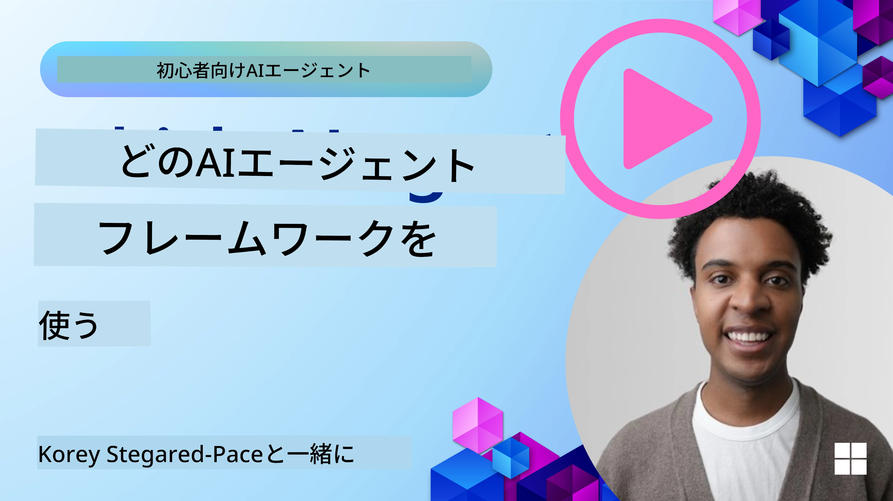

<!--
CO_OP_TRANSLATOR_METADATA:
{
  "original_hash": "7120197753abacc827b64ac2d5d6966f",
  "translation_date": "2025-11-13T11:30:54+00:00",
  "source_file": "02-explore-agentic-frameworks/README.md",
  "language_code": "ja"
}
-->
[](https://youtu.be/ODwF-EZo_O8?si=1xoy_B9RNQfrYdF7)

> _(上の画像をクリックして、このレッスンの動画をご覧ください)_

# AIエージェントフレームワークを探る

AIエージェントフレームワークは、AIエージェントの作成、展開、管理を簡素化するために設計されたソフトウェアプラットフォームです。これらのフレームワークは、複雑なAIシステムの開発を効率化するための事前構築されたコンポーネント、抽象化、ツールを開発者に提供します。

これらのフレームワークは、AIエージェント開発における一般的な課題に対する標準化されたアプローチを提供することで、開発者がアプリケーションの独自の側面に集中できるようにします。これにより、AIシステムのスケーラビリティ、アクセシビリティ、効率性が向上します。

## はじめに

このレッスンでは以下を取り上げます：

- AIエージェントフレームワークとは何か、そしてそれが開発者に何を可能にするのか？
- チームがこれらを使用してエージェントの能力を迅速にプロトタイプ化、反復、改善する方法は？
- Microsoftが作成した<a href="https://aka.ms/ai-agents/autogen" target="_blank">AutoGen</a>、<a href="https://aka.ms/ai-agents-beginners/semantic-kernel" target="_blank">Semantic Kernel</a>、<a href="https://aka.ms/ai-agents-beginners/ai-agent-service" target="_blank">Azure AI Agent Service</a>のフレームワークとツールの違いは？
- 既存のAzureエコシステムツールを直接統合できるのか、それとも独立したソリューションが必要なのか？
- Azure AI Agentsサービスとは何か、そしてこれがどのように役立つのか？

## 学習目標

このレッスンの目標は以下を理解することです：

- AIエージェントフレームワークがAI開発において果たす役割。
- AIエージェントフレームワークを活用してインテリジェントエージェントを構築する方法。
- AIエージェントフレームワークによって可能になる主要な機能。
- AutoGen、Semantic Kernel、Azure AI Agent Serviceの違い。

## AIエージェントフレームワークとは何か、そしてそれが開発者に何を可能にするのか？

従来のAIフレームワークは、AIをアプリに統合し、以下の方法でアプリを改善するのに役立ちます：

- **パーソナライズ**: AIはユーザーの行動や好みを分析し、パーソナライズされた推奨、コンテンツ、体験を提供します。
例: Netflixのようなストリーミングサービスは、視聴履歴に基づいて映画や番組を提案し、ユーザーのエンゲージメントと満足度を向上させます。
- **自動化と効率化**: AIは繰り返しのタスクを自動化し、ワークフローを効率化し、運用効率を向上させます。
例: カスタマーサービスアプリは、AI搭載のチャットボットを使用して一般的な問い合わせを処理し、応答時間を短縮し、人間のエージェントをより複雑な問題に集中させます。
- **ユーザー体験の向上**: AIは音声認識、自然言語処理、予測テキストなどのインテリジェントな機能を提供することで、全体的なユーザー体験を向上させます。
例: SiriやGoogleアシスタントのような仮想アシスタントは、音声コマンドを理解し応答するためにAIを使用し、ユーザーがデバイスと簡単にやり取りできるようにします。

### 素晴らしい話に聞こえますが、なぜAIエージェントフレームワークが必要なのでしょうか？

AIエージェントフレームワークは、単なるAIフレームワーク以上のものを表しています。これらは、ユーザー、他のエージェント、環境と対話し、特定の目標を達成するインテリジェントエージェントの作成を可能にするよう設計されています。これらのエージェントは自律的な行動を示し、意思決定を行い、変化する条件に適応することができます。以下は、AIエージェントフレームワークによって可能になる主要な機能の一部です：

- **エージェントの協力と調整**: 複数のAIエージェントを作成し、協力し、コミュニケーションを取り、複雑なタスクを解決する能力を提供します。
- **タスクの自動化と管理**: マルチステップのワークフロー、タスクの委任、エージェント間の動的なタスク管理のためのメカニズムを提供します。
- **コンテキストの理解と適応**: エージェントがコンテキストを理解し、変化する環境に適応し、リアルタイム情報に基づいて意思決定を行う能力を備えています。

要するに、エージェントはより多くのことを可能にし、自動化を次のレベルに引き上げ、環境から学び適応するよりインテリジェントなシステムを作成することを可能にします。

## エージェントの能力を迅速にプロトタイプ化、反復、改善する方法は？

これは急速に進化する分野ですが、ほとんどのAIエージェントフレームワークに共通するいくつかの要素があります。それはモジュールコンポーネント、協力ツール、リアルタイム学習です。これらについて詳しく見ていきましょう：

- **モジュールコンポーネントを使用する**: AI SDKは、AIおよびメモリコネクタ、自然言語やコードプラグインを使用した関数呼び出し、プロンプトテンプレートなどの事前構築されたコンポーネントを提供します。
- **協力ツールを活用する**: 特定の役割とタスクを持つエージェントを設計し、協力的なワークフローをテストおよび改善します。
- **リアルタイムで学習する**: フィードバックループを実装し、エージェントがインタラクションから学び、動的に行動を調整します。

### モジュールコンポーネントを使用する

Microsoft Semantic KernelやLangChainのようなSDKは、AIコネクタ、プロンプトテンプレート、メモリ管理などの事前構築されたコンポーネントを提供します。

**チームがこれらを使用する方法**: チームはこれらのコンポーネントを迅速に組み立てて、ゼロから始めることなく機能的なプロトタイプを作成し、迅速な実験と反復を可能にします。

**実際の動作方法**: ユーザー入力から情報を抽出するための事前構築されたパーサー、データを保存および取得するためのメモリモジュール、ユーザーと対話するためのプロンプトジェネレーターを使用することができます。これらのコンポーネントをゼロから構築する必要はありません。

**コード例**。以下は、Semantic Kernel Pythonおよび.Netを使用して、ユーザー入力に応答するモデルを持つ事前構築されたAIコネクタを使用する例です：

``` python
# Semantic Kernel Python Example

import asyncio
from typing import Annotated

from semantic_kernel.connectors.ai import FunctionChoiceBehavior
from semantic_kernel.connectors.ai.open_ai import AzureChatCompletion, AzureChatPromptExecutionSettings
from semantic_kernel.contents import ChatHistory
from semantic_kernel.functions import kernel_function
from semantic_kernel.kernel import Kernel

# Define a ChatHistory object to hold the conversation's context
chat_history = ChatHistory()
chat_history.add_user_message("I'd like to go to New York on January 1, 2025")


# Define a sample plugin that contains the function to book travel
class BookTravelPlugin:
    """A Sample Book Travel Plugin"""

    @kernel_function(name="book_flight", description="Book travel given location and date")
    async def book_flight(
        self, date: Annotated[str, "The date of travel"], location: Annotated[str, "The location to travel to"]
    ) -> str:
        return f"Travel was booked to {location} on {date}"

# Create the Kernel
kernel = Kernel()

# Add the sample plugin to the Kernel object
kernel.add_plugin(BookTravelPlugin(), plugin_name="book_travel")

# Define the Azure OpenAI AI Connector
chat_service = AzureChatCompletion(
    deployment_name="YOUR_DEPLOYMENT_NAME", 
    api_key="YOUR_API_KEY", 
    endpoint="https://<your-resource>.azure.openai.com/",
)

# Define the request settings to configure the model with auto-function calling
request_settings = AzureChatPromptExecutionSettings(function_choice_behavior=FunctionChoiceBehavior.Auto())


async def main():
    # Make the request to the model for the given chat history and request settings
    # The Kernel contains the sample that the model will request to invoke
    response = await chat_service.get_chat_message_content(
        chat_history=chat_history, settings=request_settings, kernel=kernel
    )
    assert response is not None

    """
    Note: In the auto function calling process, the model determines it can invoke the 
    `BookTravelPlugin` using the `book_flight` function, supplying the necessary arguments. 
    
    For example:

    "tool_calls": [
        {
            "id": "call_abc123",
            "type": "function",
            "function": {
                "name": "BookTravelPlugin-book_flight",
                "arguments": "{'location': 'New York', 'date': '2025-01-01'}"
            }
        }
    ]

    Since the location and date arguments are required (as defined by the kernel function), if the 
    model lacks either, it will prompt the user to provide them. For instance:

    User: Book me a flight to New York.
    Model: Sure, I'd love to help you book a flight. Could you please specify the date?
    User: I want to travel on January 1, 2025.
    Model: Your flight to New York on January 1, 2025, has been successfully booked. Safe travels!
    """

    print(f"`{response}`")
    # Example AI Model Response: `Your flight to New York on January 1, 2025, has been successfully booked. Safe travels! ✈️🗽`

    # Add the model's response to our chat history context
    chat_history.add_assistant_message(response.content)


if __name__ == "__main__":
    asyncio.run(main())
```
```csharp
// Semantic Kernel C# example

using Microsoft.SemanticKernel;
using Microsoft.SemanticKernel.ChatCompletion;
using System.ComponentModel;
using Microsoft.SemanticKernel.Connectors.AzureOpenAI;

ChatHistory chatHistory = [];
chatHistory.AddUserMessage("I'd like to go to New York on January 1, 2025");

var kernelBuilder = Kernel.CreateBuilder();
kernelBuilder.AddAzureOpenAIChatCompletion(
    deploymentName: "NAME_OF_YOUR_DEPLOYMENT",
    apiKey: "YOUR_API_KEY",
    endpoint: "YOUR_AZURE_ENDPOINT"
);
kernelBuilder.Plugins.AddFromType<BookTravelPlugin>("BookTravel"); 
var kernel = kernelBuilder.Build();

var settings = new AzureOpenAIPromptExecutionSettings()
{
    FunctionChoiceBehavior = FunctionChoiceBehavior.Auto()
};

var chatCompletion = kernel.GetRequiredService<IChatCompletionService>();

var response = await chatCompletion.GetChatMessageContentAsync(chatHistory, settings, kernel);

/*
Behind the scenes, the model recognizes the tool to call, what arguments it already has (location) and (date)
{

"tool_calls": [
    {
        "id": "call_abc123",
        "type": "function",
        "function": {
            "name": "BookTravelPlugin-book_flight",
            "arguments": "{'location': 'New York', 'date': '2025-01-01'}"
        }
    }
]
*/

Console.WriteLine(response.Content);
chatHistory.AddMessage(response!.Role, response!.Content!);

// Example AI Model Response: Your flight to New York on January 1, 2025, has been successfully booked. Safe travels! ✈️🗽

// Define a plugin that contains the function to book travel
public class BookTravelPlugin
{
    [KernelFunction("book_flight")]
    [Description("Book travel given location and date")]
    public async Task<string> BookFlight(DateTime date, string location)
    {
        return await Task.FromResult( $"Travel was booked to {location} on {date}");
    }
}
```

この例からわかるのは、ユーザー入力から出発地、目的地、フライト予約リクエストの日付などの重要な情報を抽出するために事前構築されたパーサーをどのように活用できるかということです。このモジュールアプローチにより、高レベルのロジックに集中することができます。

### 協力ツールを活用する

CrewAI、Microsoft AutoGen、Semantic Kernelのようなフレームワークは、複数のエージェントを作成して協力させることを容易にします。

**チームがこれらを使用する方法**: チームは特定の役割とタスクを持つエージェントを設計し、協力的なワークフローをテストおよび改善し、全体的なシステム効率を向上させます。

**実際の動作方法**: データ取得、分析、意思決定などの専門的な機能を持つエージェントのチームを作成できます。これらのエージェントは情報を共有し、ユーザーの問い合わせに答えたりタスクを完了したりするなどの共通の目標を達成するために協力します。

**コード例 (AutoGen)**:

```python
# creating agents, then create a round robin schedule where they can work together, in this case in order

# Data Retrieval Agent
# Data Analysis Agent
# Decision Making Agent

agent_retrieve = AssistantAgent(
    name="dataretrieval",
    model_client=model_client,
    tools=[retrieve_tool],
    system_message="Use tools to solve tasks."
)

agent_analyze = AssistantAgent(
    name="dataanalysis",
    model_client=model_client,
    tools=[analyze_tool],
    system_message="Use tools to solve tasks."
)

# conversation ends when user says "APPROVE"
termination = TextMentionTermination("APPROVE")

user_proxy = UserProxyAgent("user_proxy", input_func=input)

team = RoundRobinGroupChat([agent_retrieve, agent_analyze, user_proxy], termination_condition=termination)

stream = team.run_stream(task="Analyze data", max_turns=10)
# Use asyncio.run(...) when running in a script.
await Console(stream)
```

前述のコードでは、複数のエージェントがデータを分析するタスクを実行する方法を示しています。各エージェントは特定の機能を果たし、エージェントを調整して目的の結果を達成することでタスクが実行されます。専用の役割を持つエージェントを作成することで、タスクの効率とパフォーマンスを向上させることができます。

### リアルタイムで学習する

高度なフレームワークは、リアルタイムのコンテキスト理解と適応の機能を提供します。

**チームがこれらを使用する方法**: チームはフィードバックループを実装し、エージェントがインタラクションから学び、動的に行動を調整することで、能力の継続的な改善と洗練を実現します。

**実際の動作方法**: エージェントはユーザーフィードバック、環境データ、タスク結果を分析して知識ベースを更新し、意思決定アルゴリズムを調整し、時間とともにパフォーマンスを向上させます。この反復的な学習プロセスにより、エージェントは変化する条件やユーザーの好みに適応し、全体的なシステムの有効性を向上させます。

## AutoGen、Semantic Kernel、Azure AI Agent Serviceのフレームワークの違いは？

これらのフレームワークを比較する方法は多くありますが、設計、機能、対象となるユースケースの観点からいくつかの重要な違いを見てみましょう：

## AutoGen

AutoGenは、Microsoft ResearchのAI Frontiers Labによって開発されたオープンソースフレームワークです。イベント駆動型、分散型の*エージェントアプリケーション*に焦点を当てており、複数のLLMやSLM、ツール、高度なマルチエージェント設計パターンを可能にします。

AutoGenは、環境を認識し、意思決定を行い、特定の目標を達成するために行動を起こす自律的なエンティティであるエージェントのコアコンセプトに基づいて構築されています。エージェントは非同期メッセージを通じて通信し、独立して並行して動作することで、システムのスケーラビリティと応答性を向上させます。

<a href="https://en.wikipedia.org/wiki/Actor_model" target="_blank">エージェントはアクターモデルに基づいています</a>。Wikipediaによれば、アクターは_並行計算の基本的な構成要素であり、受信したメッセージに応じて、ローカルな意思決定を行い、さらにアクターを作成し、メッセージを送信し、次に受信するメッセージへの応答方法を決定する_ことができます。

**ユースケース**: コード生成の自動化、データ分析タスク、計画および研究機能のためのカスタムエージェントの構築。

以下はAutoGenの重要なコアコンセプトです：

- **エージェント**。エージェントは以下を行うソフトウェアエンティティです：
  - **メッセージを介して通信する**。これらのメッセージは同期または非同期である可能性があります。
  - **独自の状態を維持する**。この状態は受信メッセージによって変更される可能性があります。
  - **アクションを実行する**。受信したメッセージや状態の変化に応じてアクションを実行します。これらのアクションはエージェントの状態を変更し、メッセージログの更新、新しいメッセージの送信、コードの実行、API呼び出しなどの外部効果を生じさせる可能性があります。

以下はチャット機能を持つ独自のエージェントを作成する短いコードスニペットです：

    ```python
    from autogen_agentchat.agents import AssistantAgent
    from autogen_agentchat.messages import TextMessage
    from autogen_ext.models.openai import OpenAIChatCompletionClient


    class MyAgent(RoutedAgent):
        def __init__(self, name: str) -> None:
            super().__init__(name)
            model_client = OpenAIChatCompletionClient(model="gpt-4o")
            self._delegate = AssistantAgent(name, model_client=model_client)
    
        @message_handler
        async def handle_my_message_type(self, message: MyMessageType, ctx: MessageContext) -> None:
            print(f"{self.id.type} received message: {message.content}")
            response = await self._delegate.on_messages(
                [TextMessage(content=message.content, source="user")], ctx.cancellation_token
            )
            print(f"{self.id.type} responded: {response.chat_message.content}")
    ```
    
    前述のコードでは、`MyAgent`が作成され、`RoutedAgent`を継承しています。メッセージの内容を印刷し、その後`AssistantAgent`デリゲートを使用して応答を送信するメッセージハンドラーを持っています。特に注目すべきは、`self._delegate`に`AssistantAgent`のインスタンスを割り当てている点で、これはチャット完了を処理できる事前構築されたエージェントです。

    次に、このエージェントタイプをAutoGenに知らせ、プログラムを開始します：

    ```python
    
    # main.py
    runtime = SingleThreadedAgentRuntime()
    await MyAgent.register(runtime, "my_agent", lambda: MyAgent())

    runtime.start()  # Start processing messages in the background.
    await runtime.send_message(MyMessageType("Hello, World!"), AgentId("my_agent", "default"))
    ```

    前述のコードでは、エージェントがランタイムに登録され、その後エージェントにメッセージが送信され、以下の出力が得られます：

    ```text
    # Output from the console:
    my_agent received message: Hello, World!
    my_assistant received message: Hello, World!
    my_assistant responded: Hello! How can I assist you today?
    ```

- **マルチエージェント**。AutoGenは、複数のエージェントを作成し、協力して複雑なタスクを効率的に解決することをサポートします。エージェントは情報を共有し、行動を調整して問題を解決します。マルチエージェントシステムを作成するには、データ取得、分析、意思決定、ユーザーインタラクションなどの専門的な機能と役割を持つ異なるタイプのエージェントを定義できます。以下はその作成方法の例です：

    ```python
    editor_description = "Editor for planning and reviewing the content."

    # Example of declaring an Agent
    editor_agent_type = await EditorAgent.register(
    runtime,
    editor_topic_type,  # Using topic type as the agent type.
    lambda: EditorAgent(
        description=editor_description,
        group_chat_topic_type=group_chat_topic_type,
        model_client=OpenAIChatCompletionClient(
            model="gpt-4o-2024-08-06",
            # api_key="YOUR_API_KEY",
        ),
        ),
    )

    # remaining declarations shortened for brevity

    # Group chat
    group_chat_manager_type = await GroupChatManager.register(
    runtime,
    "group_chat_manager",
    lambda: GroupChatManager(
        participant_topic_types=[writer_topic_type, illustrator_topic_type, editor_topic_type, user_topic_type],
        model_client=OpenAIChatCompletionClient(
            model="gpt-4o-2024-08-06",
            # api_key="YOUR_API_KEY",
        ),
        participant_descriptions=[
            writer_description, 
            illustrator_description, 
            editor_description, 
            user_description
        ],
        ),
    )
    ```

    前述のコードでは、`GroupChatManager`がランタイムに登録されています。このマネージャーは、ライター、イラストレーター、編集者、ユーザーなどの異なるタイプのエージェント間のやり取りを調整する役割を果たします。

- **エージェントランタイム**。フレームワークはランタイム環境を提供し、エージェント間の通信を可能にし、エージェントのアイデンティティとライフサイクルを管理し、セキュリティとプライバシーの境界を強制します。これにより、エージェントを安全で制御された環境で実行し、安全かつ効率的に相互作用することができます。以下の2つのランタイムが注目されています：
  - **スタンドアロンランタイム**。これは、すべてのエージェントが同じプログラミング言語で実装され、同じプロセスで実行される単一プロセスアプリケーションに適しています。以下はその動作のイラストです：
  
    <a href="https://microsoft.github.io/autogen/stable/_images/architecture-standalone.svg" target="_blank">スタンドアロンランタイム</a>   
アプリケーションスタック

    *エージェントはランタイムを介してメッセージを通じて通信し、ランタイムはエージェントのライフサイクルを管理します*

  - **分散エージェントランタイム**。これは、エージェントが異なるプログラミング言語で実装され、異なるマシンで実行されるマルチプロセスアプリケーションに適しています。以下はその動作のイラストです：
  
    <a href="https://microsoft.github.io/autogen/stable/_images/architecture-distributed.svg" target="_blank">分散ランタイム</a>

## Semantic Kernel + Agent Framework

Semantic Kernel
これらの事実は、メモリコレクション`SummarizedAzureDocs`に保存されます。これは非常に簡略化された例ですが、LLMが使用するための情報をメモリに保存する方法がわかります。

これがSemantic Kernelフレームワークの基本ですが、Agent Frameworkについてはどうでしょうか？

## Azure AI Agent Service

Azure AI Agent Serviceは、Microsoft Ignite 2024で導入された比較的新しいサービスです。Llama 3、Mistral、CohereなどのオープンソースLLMを直接呼び出す柔軟なモデルを使用して、AIエージェントを開発および展開することができます。

Azure AI Agent Serviceは、より強力なエンタープライズセキュリティメカニズムとデータ保存方法を提供し、企業向けアプリケーションに適しています。

このサービスは、AutoGenやSemantic Kernelのようなマルチエージェントオーケストレーションフレームワークとすぐに連携して動作します。

現在、このサービスはパブリックプレビュー中であり、PythonとC#を使用してエージェントを構築することができます。

Semantic Kernel Pythonを使用して、ユーザー定義のプラグインを持つAzure AI Agentを作成することができます：

```python
import asyncio
from typing import Annotated

from azure.identity.aio import DefaultAzureCredential

from semantic_kernel.agents import AzureAIAgent, AzureAIAgentSettings, AzureAIAgentThread
from semantic_kernel.contents import ChatMessageContent
from semantic_kernel.contents import AuthorRole
from semantic_kernel.functions import kernel_function


# Define a sample plugin for the sample
class MenuPlugin:
    """A sample Menu Plugin used for the concept sample."""

    @kernel_function(description="Provides a list of specials from the menu.")
    def get_specials(self) -> Annotated[str, "Returns the specials from the menu."]:
        return """
        Special Soup: Clam Chowder
        Special Salad: Cobb Salad
        Special Drink: Chai Tea
        """

    @kernel_function(description="Provides the price of the requested menu item.")
    def get_item_price(
        self, menu_item: Annotated[str, "The name of the menu item."]
    ) -> Annotated[str, "Returns the price of the menu item."]:
        return "$9.99"


async def main() -> None:
    ai_agent_settings = AzureAIAgentSettings.create()

    async with (
        DefaultAzureCredential() as creds,
        AzureAIAgent.create_client(
            credential=creds,
            conn_str=ai_agent_settings.project_connection_string.get_secret_value(),
        ) as client,
    ):
        # Create agent definition
        agent_definition = await client.agents.create_agent(
            model=ai_agent_settings.model_deployment_name,
            name="Host",
            instructions="Answer questions about the menu.",
        )

        # Create the AzureAI Agent using the defined client and agent definition
        agent = AzureAIAgent(
            client=client,
            definition=agent_definition,
            plugins=[MenuPlugin()],
        )

        # Create a thread to hold the conversation
        # If no thread is provided, a new thread will be
        # created and returned with the initial response
        thread: AzureAIAgentThread | None = None

        user_inputs = [
            "Hello",
            "What is the special soup?",
            "How much does that cost?",
            "Thank you",
        ]

        try:
            for user_input in user_inputs:
                print(f"# User: '{user_input}'")
                # Invoke the agent for the specified thread
                response = await agent.get_response(
                    messages=user_input,
                    thread_id=thread,
                )
                print(f"# {response.name}: {response.content}")
                thread = response.thread
        finally:
            await thread.delete() if thread else None
            await client.agents.delete_agent(agent.id)


if __name__ == "__main__":
    asyncio.run(main())
```

### コアコンセプト

Azure AI Agent Serviceには以下のコアコンセプトがあります：

- **エージェント**。Azure AI Agent ServiceはAzure AI Foundryと統合されています。AI Foundry内では、AIエージェントは「スマート」なマイクロサービスとして機能し、質問に答えたり（RAG）、アクションを実行したり、ワークフローを完全に自動化したりすることができます。これは、生成AIモデルの力を、実世界のデータソースにアクセスして対話するツールと組み合わせることで実現されます。以下はエージェントの例です：

    ```python
    agent = project_client.agents.create_agent(
        model="gpt-4o-mini",
        name="my-agent",
        instructions="You are helpful agent",
        tools=code_interpreter.definitions,
        tool_resources=code_interpreter.resources,
    )
    ```

    この例では、`gpt-4o-mini`モデル、名前`my-agent`、指示`You are helpful agent`を持つエージェントが作成されています。このエージェントは、コード解釈タスクを実行するためのツールとリソースを備えています。

- **スレッドとメッセージ**。スレッドはもう一つの重要な概念です。これはエージェントとユーザー間の会話ややり取りを表します。スレッドは会話の進行状況を追跡したり、コンテキスト情報を保存したり、やり取りの状態を管理するために使用されます。以下はスレッドの例です：

    ```python
    thread = project_client.agents.create_thread()
    message = project_client.agents.create_message(
        thread_id=thread.id,
        role="user",
        content="Could you please create a bar chart for the operating profit using the following data and provide the file to me? Company A: $1.2 million, Company B: $2.5 million, Company C: $3.0 million, Company D: $1.8 million",
    )
    
    # Ask the agent to perform work on the thread
    run = project_client.agents.create_and_process_run(thread_id=thread.id, agent_id=agent.id)
    
    # Fetch and log all messages to see the agent's response
    messages = project_client.agents.list_messages(thread_id=thread.id)
    print(f"Messages: {messages}")
    ```

    前述のコードでは、スレッドが作成され、その後スレッドにメッセージが送信されます。`create_and_process_run`を呼び出すことで、エージェントにスレッド上で作業を行うよう依頼します。最後に、メッセージが取得され、エージェントの応答を確認するためにログに記録されます。メッセージは、ユーザーとエージェント間の会話の進行状況を示します。また、メッセージはテキスト、画像、ファイルなど異なる種類のものがあり、例えばエージェントの作業結果が画像やテキスト応答として生成されることがあります。開発者として、この情報をさらに処理したり、ユーザーに提示したりすることができます。

- **他のAIフレームワークとの統合**。Azure AI Agent Serviceは、AutoGenやSemantic Kernelなどの他のフレームワークと連携することができます。これにより、これらのフレームワークの一部でアプリを構築し、例えばAgent Serviceをオーケストレーターとして使用することができます。または、すべてをAgent Service内で構築することも可能です。

**ユースケース**：Azure AI Agent Serviceは、安全でスケーラブル、かつ柔軟なAIエージェント展開を必要とする企業向けアプリケーション向けに設計されています。

## これらのフレームワークの違いは何ですか？

これらのフレームワークには多くの重複があるように思えますが、設計、機能、対象となるユースケースにおいていくつかの重要な違いがあります：

- **AutoGen**：最先端のマルチエージェントシステムの研究に焦点を当てた実験フレームワークです。高度なマルチエージェントシステムを実験・プロトタイプ化するのに最適な場所です。
- **Semantic Kernel**：エンタープライズエージェントアプリケーションを構築するためのプロダクション対応エージェントライブラリです。イベント駆動型、分散型エージェントアプリケーションに焦点を当てており、複数のLLMやSLM、ツール、単一/マルチエージェント設計パターンを可能にします。
- **Azure AI Agent Service**：Azure Foundry内のエージェント向けプラットフォームおよび展開サービスです。Azure OpenAI、Azure AI Search、Bing Search、コード実行など、Azure Foundryがサポートするサービスへの接続を構築する機能を提供します。

まだどれを選べばいいか迷っていますか？

### ユースケース

いくつかの一般的なユースケースを通じて、選択を助けましょう：

> Q: 実験を行い、学び、概念実証のエージェントアプリケーションを構築しており、迅速に構築・実験したいです。
>

>A: AutoGenはこのシナリオに適しています。イベント駆動型、分散型エージェントアプリケーションに焦点を当てており、高度なマルチエージェント設計パターンをサポートしています。

> Q: このユースケースにおいて、AutoGenがSemantic KernelやAzure AI Agent Serviceよりも優れている理由は何ですか？
>
> A: AutoGenはイベント駆動型、分散型エージェントアプリケーション向けに特別に設計されており、コード生成やデータ分析タスクの自動化に適しています。複雑なマルチエージェントシステムを効率的に構築するための必要なツールと機能を提供します。

>Q: Azure AI Agent Serviceもここで使えそうですね。コード生成のツールなどもありますよね？

>
> A: はい、Azure AI Agent Serviceはエージェント向けのプラットフォームサービスであり、複数のモデル、Azure AI Search、Bing Search、Azure Functionsの組み込み機能を追加しています。Foundry Portalでエージェントを簡単に構築し、大規模に展開することができます。

> Q: まだ迷っています。一つの選択肢を教えてください。
>
> A: 最初にSemantic Kernelでアプリケーションを構築し、その後Azure AI Agent Serviceを使用してエージェントを展開するのが良い選択肢です。このアプローチにより、Semantic Kernelでマルチエージェントシステムを構築する力を活用しながら、エージェントを簡単に永続化できます。さらに、Semantic KernelにはAutoGenとのコネクターがあり、両方のフレームワークを簡単に併用できます。

以下の表で主要な違いをまとめましょう：

| フレームワーク | 焦点 | コアコンセプト | ユースケース |
| --- | --- | --- | --- |
| AutoGen | イベント駆動型、分散型エージェントアプリケーション | エージェント、ペルソナ、関数、データ | コード生成、データ分析タスク |
| Semantic Kernel | 人間のようなテキスト内容の理解と生成 | エージェント、モジュールコンポーネント、コラボレーション | 自然言語理解、コンテンツ生成 |
| Azure AI Agent Service | 柔軟なモデル、エンタープライズセキュリティ、コード生成、ツール呼び出し | モジュール性、コラボレーション、プロセスオーケストレーション | 安全でスケーラブル、柔軟なAIエージェント展開 |

これらのフレームワークの理想的なユースケースは何ですか？

## 既存のAzureエコシステムツールを直接統合できますか、それとも独立したソリューションが必要ですか？

答えは「はい」です。特にAzure AI Agent Serviceは、他のAzureサービスとシームレスに連携するように設計されています。例えば、Bing、Azure AI Search、Azure Functionsを統合することができます。また、Azure AI Foundryとの深い統合もあります。

AutoGenやSemantic KernelでもAzureサービスと統合することができますが、コードからAzureサービスを呼び出す必要がある場合があります。もう一つの統合方法として、Azure SDKを使用してエージェントからAzureサービスと対話することができます。さらに、前述のように、AutoGenやSemantic Kernelで構築したエージェントのオーケストレーターとしてAzure AI Agent Serviceを使用することで、Azureエコシステムへの簡単なアクセスが可能になります。

## サンプルコード

- Python: [Agent Framework](./code_samples/02-python-agent-framework.ipynb)
- .NET: [Agent Framework](./code_samples/02-dotnet-agent-framework.md)

## AI Agent Frameworksに関する質問はありますか？

[Azure AI Foundry Discord](https://aka.ms/ai-agents/discord)に参加して、他の学習者と交流したり、オフィスアワーに参加したり、AIエージェントに関する質問に答えてもらいましょう。

## 参考文献

- <a href="https://techcommunity.microsoft.com/blog/azure-ai-services-blog/introducing-azure-ai-agent-service/4298357" target="_blank">Azure Agent Service</a>
- <a href="https://devblogs.microsoft.com/semantic-kernel/microsofts-agentic-ai-frameworks-autogen-and-semantic-kernel/" target="_blank">Semantic KernelとAutoGen</a>
- <a href="https://learn.microsoft.com/semantic-kernel/frameworks/agent/?pivots=programming-language-python" target="_blank">Semantic Kernel Python Agent Framework</a>
- <a href="https://learn.microsoft.com/semantic-kernel/frameworks/agent/?pivots=programming-language-csharp" target="_blank">Semantic Kernel .Net Agent Framework</a>
- <a href="https://learn.microsoft.com/azure/ai-services/agents/overview" target="_blank">Azure AI Agent Service</a>
- <a href="https://techcommunity.microsoft.com/blog/educatordeveloperblog/using-azure-ai-agent-service-with-autogen--semantic-kernel-to-build-a-multi-agen/4363121" target="_blank">AutoGen / Semantic Kernelを使用したAzure AI Agent Serviceによるマルチエージェントソリューションの構築</a>

## 前のレッスン

[AIエージェントとエージェントユースケースの紹介](../01-intro-to-ai-agents/README.md)

## 次のレッスン

[エージェント設計パターンの理解](../03-agentic-design-patterns/README.md)

---

<!-- CO-OP TRANSLATOR DISCLAIMER START -->
**免責事項**:  
この文書は、AI翻訳サービス[Co-op Translator](https://github.com/Azure/co-op-translator)を使用して翻訳されています。正確性を期すよう努めておりますが、自動翻訳には誤りや不正確さが含まれる可能性があります。元の言語で記載された文書が正式な情報源とみなされるべきです。重要な情報については、専門の人間による翻訳をお勧めします。この翻訳の使用に起因する誤解や誤認について、当方は一切の責任を負いません。
<!-- CO-OP TRANSLATOR DISCLAIMER END -->