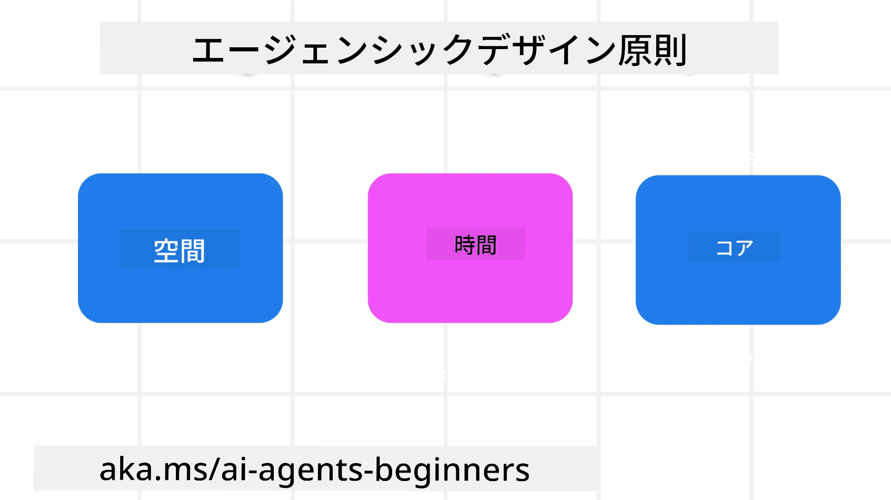

<!--
CO_OP_TRANSLATOR_METADATA:
{
  "original_hash": "d71524fe83a23829ae7a23b4031aaac8",
  "translation_date": "2025-11-13T11:32:54+00:00",
  "source_file": "03-agentic-design-patterns/README.md",
  "language_code": "ja"
}
-->

> _(上の画像をクリックして、このレッスンの動画をご覧ください)_
# AIエージェント設計の原則

## はじめに

AIエージェントシステムを構築する方法は多岐にわたります。生成AIの設計において曖昧さがバグではなく特徴であることを考えると、エンジニアがどこから手をつければよいのか悩むこともあります。そこで、開発者が顧客中心のエージェントシステムを構築し、ビジネスニーズを解決するための人間中心のUX設計原則を作成しました。これらの設計原則は具体的なアーキテクチャではなく、エージェント体験を定義し構築するチームの出発点となるものです。

一般的に、エージェントは以下を目指すべきです：

- 人間の能力を広げ、スケールさせる（ブレインストーミング、問題解決、自動化など）
- 知識のギャップを埋める（知識分野のキャッチアップ、翻訳など）
- 個々が他者と協力する際の好みに応じたコラボレーションを促進・支援する
- 自分自身をより良いバージョンにする（例：ライフコーチ/タスクマスター、感情調整やマインドフルネススキルの学習支援、レジリエンスの構築など）

## このレッスンで学ぶこと

- エージェント設計の原則とは何か
- これらの設計原則を実装する際のガイドライン
- 設計原則を活用した具体例

## 学習目標

このレッスンを完了すると、以下ができるようになります：

1. エージェント設計の原則が何であるか説明する
2. エージェント設計の原則を使用するためのガイドラインを説明する
3. エージェント設計の原則を使用してエージェントを構築する方法を理解する

## エージェント設計の原則

### エージェント（空間）

これはエージェントが動作する環境です。これらの原則は、物理的およびデジタルの世界でエージェントを設計する方法を示します。

- **接続を促進し、崩壊させない** – 人々を他の人々、イベント、実行可能な知識に結びつけ、コラボレーションと接続を可能にする。
  - エージェントはイベント、知識、人々を結びつける。
  - エージェントは人々をより近づける。人々を置き換えたり軽視するために設計されているわけではない。
- **簡単にアクセスできるが、時には目に見えない** – エージェントは主に背景で動作し、関連性があり適切な場合にのみ私たちに働きかける。
  - エージェントは、任意のデバイスやプラットフォームで認可されたユーザーが簡単に発見しアクセスできる。
  - エージェントは音声、テキストなどのマルチモーダルな入力と出力をサポートする。
  - エージェントは前景と背景、プロアクティブとリアクティブの間をシームレスに移行でき、ユーザーのニーズを感知して動作する。
  - エージェントは目に見えない形で動作することもあるが、その背景プロセスの経路や他のエージェントとのコラボレーションはユーザーに対して透明であり、制御可能である。

### エージェント（時間）

これはエージェントが時間を通じてどのように動作するかを示します。これらの原則は、過去、現在、未来を横断してエージェントを設計する方法を示します。

- **過去**: 状態とコンテキストを含む履歴を反映する。
  - エージェントはイベント、人々、状態だけでなく、より豊富な履歴データの分析に基づいてより関連性の高い結果を提供する。
  - エージェントは過去のイベントからの接続を作り、記憶を積極的に反映して現在の状況に対応する。
- **現在**: 通知以上の働きかけ。
  - エージェントは人々との対話に包括的なアプローチを取り入れる。イベントが発生した際、静的な通知や形式的なものを超えて、フローを簡素化したり、動的にキューを生成して適切なタイミングでユーザーの注意を引く。
  - エージェントはコンテキスト環境、社会的・文化的変化に基づき、ユーザーの意図に合わせた情報を提供する。
  - エージェントの対話は段階的であり、長期的にユーザーを支援するために進化・成長する。
- **未来**: 適応と進化。
  - エージェントはさまざまなデバイス、プラットフォーム、モダリティに適応する。
  - エージェントはユーザーの行動、アクセシビリティニーズに適応し、自由にカスタマイズ可能。
  - エージェントは継続的なユーザーとの対話を通じて形成され進化する。

### エージェント（コア）

これらはエージェント設計の中心的な要素です。

- **不確実性を受け入れつつ信頼を確立する**。
  - エージェントの設計には一定の不確実性が期待される。不確実性はエージェント設計の重要な要素である。
  - 信頼と透明性はエージェント設計の基盤となる層である。
  - エージェントのオン/オフは人間が制御し、エージェントの状態は常に明確に表示される。

## これらの原則を実装するためのガイドライン

前述の設計原則を使用する際は、以下のガイドラインを活用してください：

1. **透明性**: AIが関与していること、その機能（過去の行動を含む）、フィードバックの方法やシステムの変更方法をユーザーに知らせる。
2. **制御**: ユーザーがシステムやその属性をカスタマイズし、好みを指定し、個別化できるようにする（忘れる機能を含む）。
3. **一貫性**: デバイスやエンドポイント間で一貫したマルチモーダルな体験を目指す。可能な限り馴染みのあるUI/UX要素を使用し（例：音声対話用のマイクアイコン）、顧客の認知負荷を可能な限り軽減する（例：簡潔な応答、視覚的補助、「詳細を学ぶ」コンテンツ）。

## これらの原則とガイドラインを使用して旅行エージェントを設計する方法

旅行エージェントを設計する場合、以下のように設計原則とガイドラインを活用できます：

1. **透明性** – 旅行エージェントがAI対応エージェントであることをユーザーに知らせる。開始方法に関する基本的な指示を提供する（例：「こんにちは」メッセージ、サンプルプロンプト）。これを製品ページに明確に記載する。ユーザーが過去に尋ねたプロンプトのリストを表示する。フィードバックの方法（サムズアップとダウン、フィードバック送信ボタンなど）を明確にする。エージェントに使用制限やトピック制限がある場合は明確に説明する。
2. **制御** – システムプロンプトなどを使用してエージェントを作成した後にユーザーがエージェントを変更できる方法を明確にする。エージェントの詳細度、書き方のスタイル、エージェントが話すべきでない内容などを選択できるようにする。関連するファイルやデータ、プロンプト、過去の会話を表示・削除できるようにする。
3. **一貫性** – プロンプトの共有、ファイルや写真の追加、誰かや何かをタグ付けするアイコンが標準的で認識しやすいものであることを確認する。ファイルのアップロード/共有にはクリップアイコンを使用し、グラフィックのアップロードには画像アイコンを使用する。

## サンプルコード

- Python: [エージェントフレームワーク](./code_samples/03-python-agent-framework.ipynb)
- .NET: [エージェントフレームワーク](./code_samples/03-dotnet-agent-framework.md)

## AIエージェント設計パターンについてさらに質問がありますか？

[Azure AI Foundry Discord](https://aka.ms/ai-agents/discord)に参加して、他の学習者と交流したり、オフィスアワーに参加したり、AIエージェントに関する質問に答えてもらいましょう。

## 追加リソース

- <a href="https://openai.com" target="_blank">エージェントAIシステムのガバナンスに関する実践 | OpenAI</a>
- <a href="https://microsoft.com" target="_blank">HAXツールキットプロジェクト - Microsoft Research</a>
- <a href="https://responsibleaitoolbox.ai" target="_blank">Responsible AI Toolbox</a>

## 前のレッスン

[エージェントフレームワークの探求](../02-explore-agentic-frameworks/README.md)

## 次のレッスン

[ツール使用設計パターン](../04-tool-use/README.md)

---

<!-- CO-OP TRANSLATOR DISCLAIMER START -->
**免責事項**:  
この文書は、AI翻訳サービス[Co-op Translator](https://github.com/Azure/co-op-translator)を使用して翻訳されています。正確性を期しておりますが、自動翻訳には誤りや不正確な部分が含まれる可能性があります。元の言語で記載された文書が正式な情報源とみなされるべきです。重要な情報については、専門の人間による翻訳をお勧めします。この翻訳の使用に起因する誤解や誤認について、当方は一切の責任を負いません。
<!-- CO-OP TRANSLATOR DISCLAIMER END -->