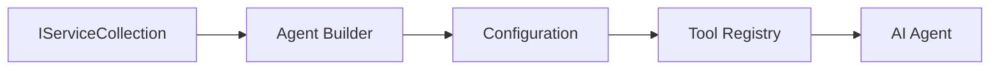

<!--
CO_OP_TRANSLATOR_METADATA:
{
  "original_hash": "bcc874e190347bd6a095aed56dc16de8",
  "translation_date": "2025-11-13T11:33:50+00:00",
  "source_file": "03-agentic-design-patterns/code_samples/03-dotnet-agent-framework.md",
  "language_code": "ja"
}
-->
# 🎨 GitHubモデルを活用したエージェント設計パターン (.NET)

## 📋 学習目標

この例では、Microsoft Agent Frameworkを使用してGitHubモデルを統合した.NETでインテリジェントエージェントを構築するためのエンタープライズ向け設計パターンを紹介します。プロダクション対応、保守性、スケーラビリティを備えたエージェントを構築するためのプロフェッショナルなパターンとアーキテクチャ手法を学びます。

### エンタープライズ設計パターン

- 🏭 **ファクトリーパターン**: 依存性注入を用いた標準化されたエージェント作成
- 🔧 **ビルダーパターン**: 流暢なエージェント設定とセットアップ
- 🧵 **スレッドセーフパターン**: 同時会話管理
- 📋 **リポジトリパターン**: ツールと機能の整理された管理

## 🎯 .NET特有のアーキテクチャ的利点

### エンタープライズ機能

- **強い型付け**: コンパイル時の検証とIntelliSenseサポート
- **依存性注入**: 組み込みのDIコンテナ統合
- **設定管理**: IConfigurationとOptionsパターン
- **非同期/待機**: 一流の非同期プログラミングサポート

### プロダクション対応パターン

- **ログ統合**: ILoggerと構造化ログサポート
- **ヘルスチェック**: 組み込みのモニタリングと診断
- **設定検証**: データ注釈を用いた強い型付け
- **エラーハンドリング**: 構造化された例外管理

## 🔧 技術アーキテクチャ

### コア.NETコンポーネント

- **Microsoft.Extensions.AI**: 統一されたAIサービス抽象化
- **Microsoft.Agents.AI**: エンタープライズエージェントのオーケストレーションフレームワーク
- **GitHubモデル統合**: 高性能なAPIクライアントパターン
- **設定システム**: appsettings.jsonと環境統合

### 設計パターンの実装



## 🏗️ 実演されるエンタープライズパターン

### 1. **生成パターン**

- **エージェントファクトリー**: 一貫した設定による集中化されたエージェント作成
- **ビルダーパターン**: 複雑なエージェント設定のための流暢なAPI
- **シングルトンパターン**: 共有リソースと設定管理
- **依存性注入**: 疎結合とテスト可能性

### 2. **振る舞いパターン**

- **ストラテジーパターン**: 交換可能なツール実行戦略
- **コマンドパターン**: 元に戻す/やり直し可能なエージェント操作のカプセル化
- **オブザーバーパターン**: イベント駆動型のエージェントライフサイクル管理
- **テンプレートメソッド**: 標準化されたエージェント実行ワークフロー

### 3. **構造パターン**

- **アダプターパターン**: GitHubモデルAPI統合レイヤー
- **デコレーターパターン**: エージェント機能の拡張
- **ファサードパターン**: 簡略化されたエージェント操作インターフェース
- **プロキシパターン**: パフォーマンス向上のための遅延読み込みとキャッシング

## 📚 .NET設計原則

### SOLID原則

- **単一責任**: 各コンポーネントが明確な目的を持つ
- **開放/閉鎖**: 修正なしで拡張可能
- **リスコフの置換原則**: インターフェースベースのツール実装
- **インターフェース分離**: 集中した一貫性のあるインターフェース
- **依存性逆転**: 具体的なものではなく抽象に依存

### クリーンアーキテクチャ

- **ドメイン層**: コアエージェントとツールの抽象化
- **アプリケーション層**: エージェントのオーケストレーションとワークフロー
- **インフラ層**: GitHubモデル統合と外部サービス
- **プレゼンテーション層**: ユーザーインタラクションとレスポンスフォーマット

## 🔒 エンタープライズ考慮事項

### セキュリティ

- **資格情報管理**: IConfigurationを使用した安全なAPIキー管理
- **入力検証**: 強い型付けとデータ注釈による検証
- **出力サニタイズ**: 安全なレスポンス処理とフィルタリング
- **監査ログ**: 包括的な操作追跡

### パフォーマンス

- **非同期パターン**: 非ブロッキングI/O操作
- **接続プーリング**: 効率的なHTTPクライアント管理
- **キャッシング**: パフォーマンス向上のためのレスポンスキャッシュ
- **リソース管理**: 適切な破棄とクリーンアップパターン

### スケーラビリティ

- **スレッドセーフ**: 同時エージェント実行サポート
- **リソースプーリング**: 効率的なリソース利用
- **負荷管理**: レート制限とバックプレッシャー処理
- **モニタリング**: パフォーマンスメトリクスとヘルスチェック

## 🚀 プロダクション展開

- **設定管理**: 環境固有の設定
- **ログ戦略**: 相関IDを用いた構造化ログ
- **エラーハンドリング**: 適切なリカバリーを伴うグローバル例外処理
- **モニタリング**: アプリケーションインサイトとパフォーマンスカウンター
- **テスト**: 単体テスト、統合テスト、負荷テストパターン

.NETでエンタープライズ対応のインテリジェントエージェントを構築する準備はできましたか？堅牢なアーキテクチャを設計しましょう！ 🏢✨

## 🚀 はじめに

### 前提条件

- [.NET 10 SDK](https://dotnet.microsoft.com/download/dotnet/10.0) 以上
- [GitHub Models API アクセストークン](https://docs.github.com/github-models/github-models-at-scale/using-your-own-api-keys-in-github-models)

### 必要な環境変数

```bash
# zsh/bash
export GH_TOKEN=<your_github_token>
export GH_ENDPOINT=https://models.github.ai/inference
export GH_MODEL_ID=openai/gpt-5-mini
```

```powershell
# PowerShell
$env:GH_TOKEN = "<your_github_token>"
$env:GH_ENDPOINT = "https://models.github.ai/inference"
$env:GH_MODEL_ID = "openai/gpt-5-mini"
```

### サンプルコード

コード例を実行するには、

```bash
# zsh/bash
chmod +x ./03-dotnet-agent-framework.cs
./03-dotnet-agent-framework.cs
```

またはdotnet CLIを使用して:

```bash
dotnet run ./03-dotnet-agent-framework.cs
```

完全なコードについては [`03-dotnet-agent-framework.cs`](../../../../03-agentic-design-patterns/code_samples/03-dotnet-agent-framework.cs) を参照してください。

```csharp
#!/usr/bin/dotnet run

#:package Microsoft.Extensions.AI@10.*
#:package Microsoft.Agents.AI.OpenAI@1.*-*

using System.ClientModel;
using System.ComponentModel;

using Microsoft.Agents.AI;
using Microsoft.Extensions.AI;

using OpenAI;

// Tool Function: Random Destination Generator
// This static method will be available to the agent as a callable tool
// The [Description] attribute helps the AI understand when to use this function
// This demonstrates how to create custom tools for AI agents
[Description("Provides a random vacation destination.")]
static string GetRandomDestination()
{
    // List of popular vacation destinations around the world
    // The agent will randomly select from these options
    var destinations = new List<string>
    {
        "Paris, France",
        "Tokyo, Japan",
        "New York City, USA",
        "Sydney, Australia",
        "Rome, Italy",
        "Barcelona, Spain",
        "Cape Town, South Africa",
        "Rio de Janeiro, Brazil",
        "Bangkok, Thailand",
        "Vancouver, Canada"
    };

    // Generate random index and return selected destination
    // Uses System.Random for simple random selection
    var random = new Random();
    int index = random.Next(destinations.Count);
    return destinations[index];
}

// Extract configuration from environment variables
// Retrieve the GitHub Models API endpoint, defaults to https://models.github.ai/inference if not specified
// Retrieve the model ID, defaults to openai/gpt-5-mini if not specified
// Retrieve the GitHub token for authentication, throws exception if not specified
var github_endpoint = Environment.GetEnvironmentVariable("GH_ENDPOINT") ?? "https://models.github.ai/inference";
var github_model_id = Environment.GetEnvironmentVariable("GH_MODEL_ID") ?? "openai/gpt-5-mini";
var github_token = Environment.GetEnvironmentVariable("GH_TOKEN") ?? throw new InvalidOperationException("GH_TOKEN is not set.");

// Configure OpenAI Client Options
// Create configuration options to point to GitHub Models endpoint
// This redirects OpenAI client calls to GitHub's model inference service
var openAIOptions = new OpenAIClientOptions()
{
    Endpoint = new Uri(github_endpoint)
};

// Initialize OpenAI Client with GitHub Models Configuration
// Create OpenAI client using GitHub token for authentication
// Configure it to use GitHub Models endpoint instead of OpenAI directly
var openAIClient = new OpenAIClient(new ApiKeyCredential(github_token), openAIOptions);

// Define Agent Identity and Comprehensive Instructions
// Agent name for identification and logging purposes
var AGENT_NAME = "TravelAgent";

// Detailed instructions that define the agent's personality, capabilities, and behavior
// This system prompt shapes how the agent responds and interacts with users
var AGENT_INSTRUCTIONS = """
You are a helpful AI Agent that can help plan vacations for customers.

Important: When users specify a destination, always plan for that location. Only suggest random destinations when the user hasn't specified a preference.

When the conversation begins, introduce yourself with this message:
"Hello! I'm your TravelAgent assistant. I can help plan vacations and suggest interesting destinations for you. Here are some things you can ask me:
1. Plan a day trip to a specific location
2. Suggest a random vacation destination
3. Find destinations with specific features (beaches, mountains, historical sites, etc.)
4. Plan an alternative trip if you don't like my first suggestion

What kind of trip would you like me to help you plan today?"

Always prioritize user preferences. If they mention a specific destination like "Bali" or "Paris," focus your planning on that location rather than suggesting alternatives.
""";

// Create AI Agent with Advanced Travel Planning Capabilities
// Initialize complete agent pipeline: OpenAI client → Chat client → AI agent
// Configure agent with name, detailed instructions, and available tools
// This demonstrates the .NET agent creation pattern with full configuration
AIAgent agent = openAIClient
    .GetChatClient(github_model_id)
    .CreateAIAgent(
        name: AGENT_NAME,
        instructions: AGENT_INSTRUCTIONS,
        tools: [AIFunctionFactory.Create(GetRandomDestination)]
    );

// Create New Conversation Thread for Context Management
// Initialize a new conversation thread to maintain context across multiple interactions
// Threads enable the agent to remember previous exchanges and maintain conversational state
// This is essential for multi-turn conversations and contextual understanding
AgentThread thread = agent.GetNewThread();

// Execute Agent: First Travel Planning Request
// Run the agent with an initial request that will likely trigger the random destination tool
// The agent will analyze the request, use the GetRandomDestination tool, and create an itinerary
// Using the thread parameter maintains conversation context for subsequent interactions
await foreach (var update in agent.RunStreamingAsync("Plan me a day trip", thread))
{
    await Task.Delay(10);
    Console.Write(update);
}

Console.WriteLine();

// Execute Agent: Follow-up Request with Context Awareness
// Demonstrate contextual conversation by referencing the previous response
// The agent remembers the previous destination suggestion and will provide an alternative
// This showcases the power of conversation threads and contextual understanding in .NET agents
await foreach (var update in agent.RunStreamingAsync("I don't like that destination. Plan me another vacation.", thread))
{
    await Task.Delay(10);
    Console.Write(update);
}
```

---

<!-- CO-OP TRANSLATOR DISCLAIMER START -->
**免責事項**:  
この文書は、AI翻訳サービス[Co-op Translator](https://github.com/Azure/co-op-translator)を使用して翻訳されています。正確性を期すよう努めておりますが、自動翻訳には誤りや不正確さが含まれる可能性があります。元の言語で記載された文書が正式な情報源と見なされるべきです。重要な情報については、専門の人間による翻訳をお勧めします。この翻訳の使用に起因する誤解や誤認について、当社は一切の責任を負いません。
<!-- CO-OP TRANSLATOR DISCLAIMER END -->