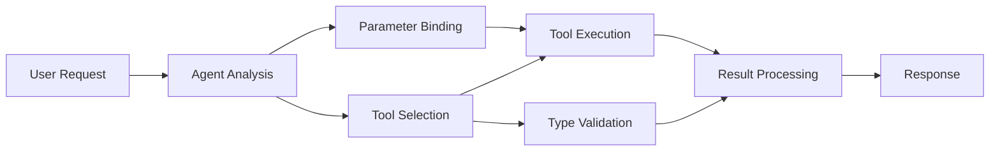

<!--
CO_OP_TRANSLATOR_METADATA:
{
  "original_hash": "91d6061e402489603f2ec8b528cae59b",
  "translation_date": "2025-11-18T16:55:01+00:00",
  "source_file": "04-tool-use/code_samples/04-dotnet-agent-framework.md",
  "language_code": "ja"
}
-->
# 🛠️ GitHubモデルを活用した高度なツール使用 (.NET)

## 📋 学習目標

このノートブックでは、Microsoft Agent Frameworkを使用してGitHubモデルと統合するエンタープライズ向けのツール統合パターンを紹介します。C#の強力な型付けと.NETのエンタープライズ機能を活用して、複数の専門的なツールを持つ高度なエージェントを構築する方法を学びます。

### 習得できる高度なツール機能

- 🔧 **マルチツールアーキテクチャ**: 複数の専門的な機能を持つエージェントの構築
- 🎯 **型安全なツール実行**: C#のコンパイル時検証を活用
- 📊 **エンタープライズツールパターン**: 実運用向けのツール設計とエラー処理
- 🔗 **ツールの組み合わせ**: 複雑なビジネスワークフローのためのツール統合

## 🎯 .NETツールアーキテクチャの利点

### エンタープライズツールの特徴

- **コンパイル時検証**: 強い型付けによりツールパラメータの正確性を保証
- **依存性注入**: IoCコンテナ統合によるツール管理
- **非同期/待機パターン**: 適切なリソース管理を伴う非ブロッキングツール実行
- **構造化ログ**: ツール実行の監視のための組み込みログ統合

### 実運用向けパターン

- **例外処理**: 型付き例外による包括的なエラー管理
- **リソース管理**: 適切な破棄パターンとメモリ管理
- **パフォーマンス監視**: 組み込みのメトリクスとパフォーマンスカウンタ
- **設定管理**: 検証付きの型安全な設定

## 🔧 技術アーキテクチャ

### .NETツールの主要コンポーネント

- **Microsoft.Extensions.AI**: 統一されたツール抽象化レイヤー
- **Microsoft.Agents.AI**: エンタープライズ向けツールオーケストレーション
- **GitHubモデル統合**: 接続プールを備えた高性能APIクライアント

### ツール実行パイプライン



## 🛠️ ツールカテゴリとパターン

### 1. **データ処理ツール**

- **入力検証**: データアノテーションを使用した強い型付け
- **変換操作**: 型安全なデータ変換とフォーマット
- **ビジネスロジック**: ドメイン固有の計算と分析ツール
- **出力フォーマット**: 構造化されたレスポンス生成

### 2. **統合ツール**

- **APIコネクタ**: HttpClientを使用したRESTfulサービス統合
- **データベースツール**: Entity Frameworkを使用したデータアクセス
- **ファイル操作**: 検証付きの安全なファイルシステム操作
- **外部サービス**: サードパーティサービス統合パターン

### 3. **ユーティリティツール**

- **テキスト処理**: 文字列操作とフォーマットユーティリティ
- **日付/時間操作**: 文化に依存した日付/時間計算
- **数学ツール**: 精密な計算と統計操作
- **検証ツール**: ビジネスルール検証とデータ確認

エンタープライズ向けのエージェントを.NETで構築し、強力で型安全なツール機能を活用する準備はできましたか？プロフェッショナルなソリューションを設計しましょう！ 🏢⚡

## 🚀 始めましょう

### 前提条件

- [.NET 10 SDK](https://dotnet.microsoft.com/download/dotnet/10.0) 以上
- [GitHub Models API アクセストークン](https://docs.github.com/github-models/github-models-at-scale/using-your-own-api-keys-in-github-models)

### 必要な環境変数

```bash
# zsh/bash
export GH_TOKEN=<your_github_token>
export GH_ENDPOINT=https://models.github.ai/inference
export GH_MODEL_ID=openai/gpt-5-mini
```

```powershell
# PowerShell
$env:GH_TOKEN = "<your_github_token>"
$env:GH_ENDPOINT = "https://models.github.ai/inference"
$env:GH_MODEL_ID = "openai/gpt-5-mini"
```

### サンプルコード

コード例を実行するには、

```bash
# zsh/bash
chmod +x ./04-dotnet-agent-framework.cs
./04-dotnet-agent-framework.cs
```

または、dotnet CLIを使用して:

```bash
dotnet run ./04-dotnet-agent-framework.cs
```

完全なコードは [`04-dotnet-agent-framework.cs`](../../../../04-tool-use/code_samples/04-dotnet-agent-framework.cs) を参照してください。

```csharp
#!/usr/bin/dotnet run

#:package Microsoft.Extensions.AI@10.*
#:package Microsoft.Agents.AI.OpenAI@1.*-*

using System.ClientModel;
using System.ComponentModel;

using Microsoft.Agents.AI;
using Microsoft.Extensions.AI;

using OpenAI;

// Tool Function: Random Destination Generator
// This static method will be available to the agent as a callable tool
// The [Description] attribute helps the AI understand when to use this function
// This demonstrates how to create custom tools for AI agents
[Description("Provides a random vacation destination.")]
static string GetRandomDestination()
{
    // List of popular vacation destinations around the world
    // The agent will randomly select from these options
    var destinations = new List<string>
    {
        "Paris, France",
        "Tokyo, Japan",
        "New York City, USA",
        "Sydney, Australia",
        "Rome, Italy",
        "Barcelona, Spain",
        "Cape Town, South Africa",
        "Rio de Janeiro, Brazil",
        "Bangkok, Thailand",
        "Vancouver, Canada"
    };

    // Generate random index and return selected destination
    // Uses System.Random for simple random selection
    var random = new Random();
    int index = random.Next(destinations.Count);
    return destinations[index];
}

// Extract configuration from environment variables
// Retrieve the GitHub Models API endpoint, defaults to https://models.github.ai/inference if not specified
// Retrieve the model ID, defaults to openai/gpt-5-mini if not specified
// Retrieve the GitHub token for authentication, throws exception if not specified
var github_endpoint = Environment.GetEnvironmentVariable("GH_ENDPOINT") ?? "https://models.github.ai/inference";
var github_model_id = Environment.GetEnvironmentVariable("GH_MODEL_ID") ?? "openai/gpt-5-mini";
var github_token = Environment.GetEnvironmentVariable("GH_TOKEN") ?? throw new InvalidOperationException("GH_TOKEN is not set.");

// Configure OpenAI Client Options
// Create configuration options to point to GitHub Models endpoint
// This redirects OpenAI client calls to GitHub's model inference service
var openAIOptions = new OpenAIClientOptions()
{
    Endpoint = new Uri(github_endpoint)
};

// Initialize OpenAI Client with GitHub Models Configuration
// Create OpenAI client using GitHub token for authentication
// Configure it to use GitHub Models endpoint instead of OpenAI directly
var openAIClient = new OpenAIClient(new ApiKeyCredential(github_token), openAIOptions);

// Define Agent Identity and Comprehensive Instructions
// Agent name for identification and logging purposes
var AGENT_NAME = "TravelAgent";

// Detailed instructions that define the agent's personality, capabilities, and behavior
// This system prompt shapes how the agent responds and interacts with users
var AGENT_INSTRUCTIONS = """
You are a helpful AI Agent that can help plan vacations for customers.

Important: When users specify a destination, always plan for that location. Only suggest random destinations when the user hasn't specified a preference.

When the conversation begins, introduce yourself with this message:
"Hello! I'm your TravelAgent assistant. I can help plan vacations and suggest interesting destinations for you. Here are some things you can ask me:
1. Plan a day trip to a specific location
2. Suggest a random vacation destination
3. Find destinations with specific features (beaches, mountains, historical sites, etc.)
4. Plan an alternative trip if you don't like my first suggestion

What kind of trip would you like me to help you plan today?"

Always prioritize user preferences. If they mention a specific destination like "Bali" or "Paris," focus your planning on that location rather than suggesting alternatives.
""";

// Create AI Agent with Advanced Travel Planning Capabilities
// Initialize complete agent pipeline: OpenAI client → Chat client → AI agent
// Configure agent with name, detailed instructions, and available tools
// This demonstrates the .NET agent creation pattern with full configuration
AIAgent agent = openAIClient
    .GetChatClient(github_model_id)
    .CreateAIAgent(
        name: AGENT_NAME,
        instructions: AGENT_INSTRUCTIONS,
        tools: [AIFunctionFactory.Create(GetRandomDestination)]
    );

// Create New Conversation Thread for Context Management
// Initialize a new conversation thread to maintain context across multiple interactions
// Threads enable the agent to remember previous exchanges and maintain conversational state
// This is essential for multi-turn conversations and contextual understanding
AgentThread thread = agent.GetNewThread();

// Execute Agent: First Travel Planning Request
// Run the agent with an initial request that will likely trigger the random destination tool
// The agent will analyze the request, use the GetRandomDestination tool, and create an itinerary
// Using the thread parameter maintains conversation context for subsequent interactions
await foreach (var update in agent.RunStreamingAsync("Plan me a day trip", thread))
{
    await Task.Delay(10);
    Console.Write(update);
}

Console.WriteLine();

// Execute Agent: Follow-up Request with Context Awareness
// Demonstrate contextual conversation by referencing the previous response
// The agent remembers the previous destination suggestion and will provide an alternative
// This showcases the power of conversation threads and contextual understanding in .NET agents
await foreach (var update in agent.RunStreamingAsync("I don't like that destination. Plan me another vacation.", thread))
{
    await Task.Delay(10);
    Console.Write(update);
}
```

---

<!-- CO-OP TRANSLATOR DISCLAIMER START -->
**免責事項**:  
この文書はAI翻訳サービス[Co-op Translator](https://github.com/Azure/co-op-translator)を使用して翻訳されています。正確性を追求していますが、自動翻訳には誤りや不正確な部分が含まれる可能性があります。元の言語で記載された文書を正式な情報源としてご参照ください。重要な情報については、専門の人間による翻訳を推奨します。この翻訳の使用に起因する誤解や誤解釈について、当方は責任を負いません。
<!-- CO-OP TRANSLATOR DISCLAIMER END -->