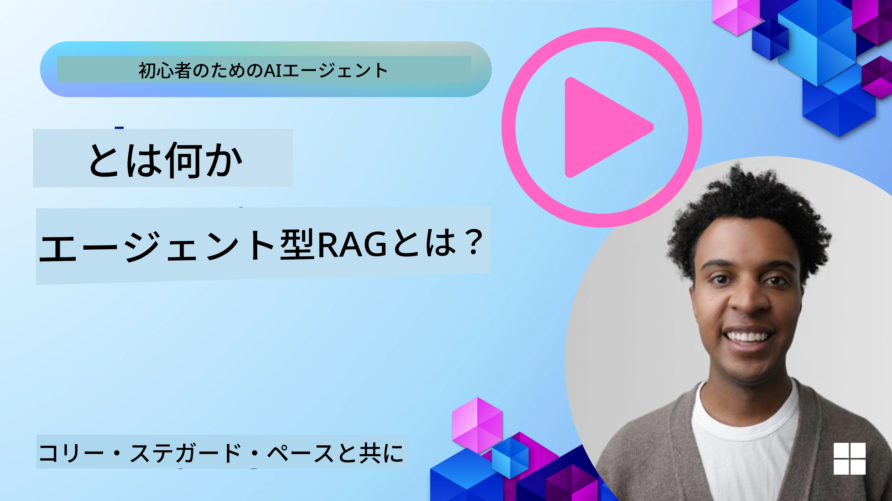
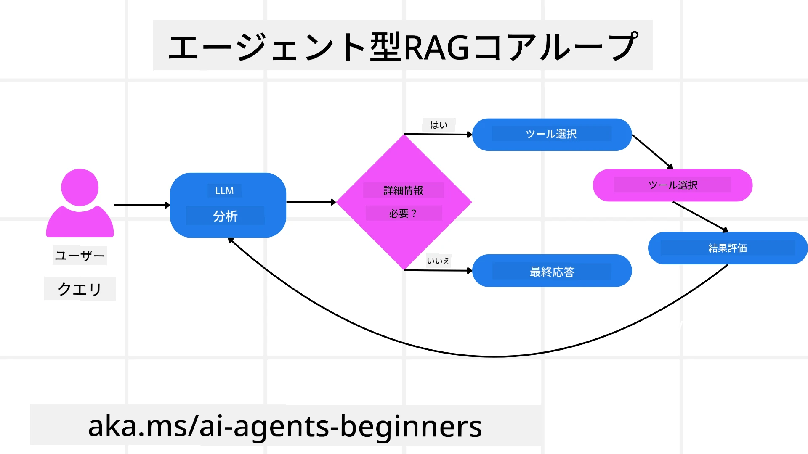
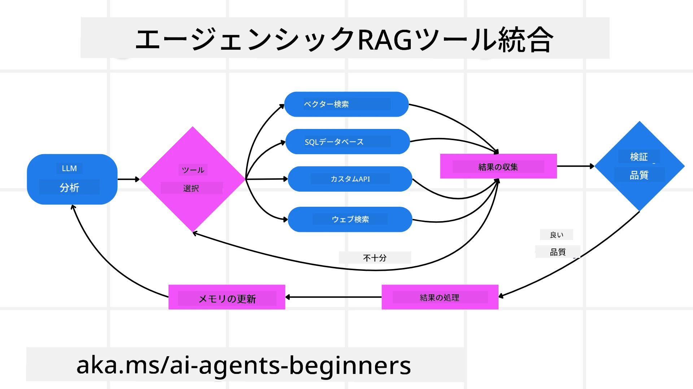
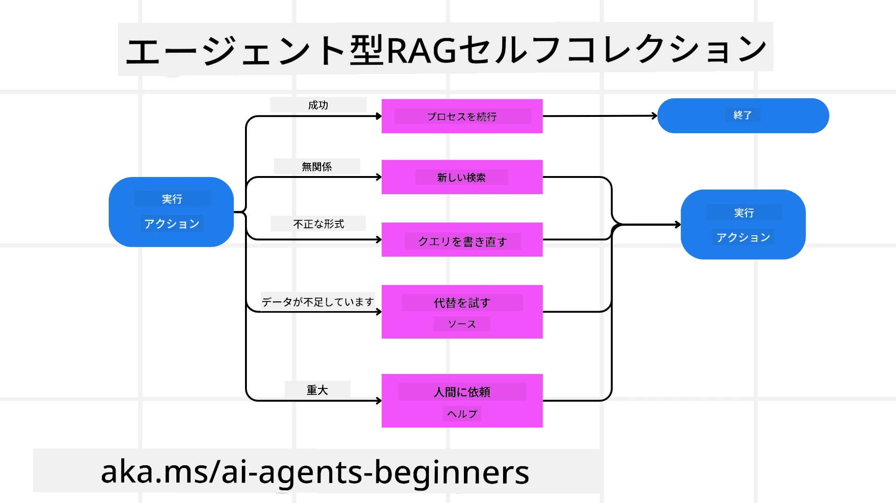

<!--
CO_OP_TRANSLATOR_METADATA:
{
  "original_hash": "0ebf6b2290db55dbf2d10cc49655523b",
  "translation_date": "2025-09-30T06:32:26+00:00",
  "source_file": "05-agentic-rag/README.md",
  "language_code": "ja"
}
-->

> _(上の画像をクリックすると、このレッスンの動画が視聴できます)_

# Agentic RAG

このレッスンでは、Agentic Retrieval-Augmented Generation (Agentic RAG) の包括的な概要を提供します。Agentic RAGは、大規模言語モデル (LLM) が外部ソースから情報を取得しながら次のステップを自律的に計画する新しいAIのパラダイムです。静的な情報取得後の読み取りパターンとは異なり、Agentic RAGはツールや関数の呼び出し、構造化された出力を交えたLLMへの反復的な呼び出しを含みます。システムは結果を評価し、クエリを改善し、必要に応じて追加のツールを呼び出し、満足のいく解決策が得られるまでこのサイクルを続けます。

## はじめに

このレッスンでは以下を学びます：

- **Agentic RAGの理解:** LLMが外部データソースから情報を取得しながら次のステップを自律的に計画する新しいAIパラダイムについて学びます。
- **反復的なMaker-Checkerスタイル:** LLMへの反復的な呼び出し、ツールや関数の呼び出し、構造化された出力を交えたループを理解し、正確性を向上させ、誤ったクエリを処理する方法を学びます。
- **実践的な応用:** 正確性が重要な環境、複雑なデータベースの操作、長期的なワークフローなど、Agentic RAGが活躍するシナリオを特定します。

## 学習目標

このレッスンを完了すると、以下を理解できるようになります：

- **Agentic RAGの理解:** LLMが外部データソースから情報を取得しながら次のステップを自律的に計画する新しいAIパラダイムについて学びます。
- **反復的なMaker-Checkerスタイル:** LLMへの反復的な呼び出し、ツールや関数の呼び出し、構造化された出力を交えたループを理解し、正確性を向上させ、誤ったクエリを処理する方法を学びます。
- **推論プロセスの所有:** システムが自らの推論プロセスを所有し、問題へのアプローチ方法を事前定義されたパスに頼らずに決定する能力を理解します。
- **ワークフロー:** エージェントモデルが市場動向レポートを取得し、競合データを特定し、内部売上指標を関連付け、結果を統合し、戦略を評価する方法を理解します。
- **反復ループ、ツール統合、メモリ:** 反復的なインタラクションパターンに依存し、ステップ間で状態とメモリを維持し、繰り返しループを回避し、情報に基づいた意思決定を行う方法を学びます。
- **失敗モードの処理と自己修正:** 診断ツールの使用や人間の監視に頼ることを含む、システムの強力な自己修正メカニズムを探ります。
- **エージェンシーの限界:** ドメイン固有の自律性、インフラ依存性、ガードレールの尊重に焦点を当てたAgentic RAGの限界を理解します。
- **実践的なユースケースと価値:** 正確性が重要な環境、複雑なデータベースの操作、長期的なワークフローなど、Agentic RAGが活躍するシナリオを特定します。
- **ガバナンス、透明性、信頼:** 説明可能な推論、バイアス制御、人間の監視を含むガバナンスと透明性の重要性を学びます。

## Agentic RAGとは？

Agentic Retrieval-Augmented Generation (Agentic RAG) は、大規模言語モデル (LLM) が外部ソースから情報を取得しながら次のステップを自律的に計画する新しいAIのパラダイムです。静的な情報取得後の読み取りパターンとは異なり、Agentic RAGはツールや関数の呼び出し、構造化された出力を交えたLLMへの反復的な呼び出しを含みます。システムは結果を評価し、クエリを改善し、必要に応じて追加のツールを呼び出し、満足のいく解決策が得られるまでこのサイクルを続けます。この反復的な「Maker-Checker」スタイルは、正確性を向上させ、誤ったクエリを処理し、高品質な結果を保証します。

システムは推論プロセスを積極的に所有し、失敗したクエリを書き直し、異なる取得方法を選択し、複数のツール（Azure AI Searchのベクトル検索、SQLデータベース、カスタムAPIなど）を統合して最終的な回答を作成します。エージェントシステムの際立った特徴は、推論プロセスを所有する能力です。従来のRAG実装は事前定義されたパスに依存しますが、エージェントシステムは取得した情報の品質に基づいてステップの順序を自律的に決定します。

## Agentic Retrieval-Augmented Generation (Agentic RAG) の定義

Agentic Retrieval-Augmented Generation (Agentic RAG) は、LLMが外部データソースから情報を取得するだけでなく、自律的に次のステップを計画するAI開発の新しいパラダイムです。静的な情報取得後の読み取りパターンや慎重にスクリプト化されたプロンプトシーケンスとは異なり、Agentic RAGはツールや関数の呼び出し、構造化された出力を交えたLLMへの反復的な呼び出しを含みます。各段階で、システムは取得した結果を評価し、クエリを改善するかどうかを決定し、必要に応じて追加のツールを呼び出し、満足のいく解決策が得られるまでこのサイクルを続けます。

この反復的な「Maker-Checker」スタイルの操作は、正確性を向上させ、構造化されたデータベース（例：NL2SQL）への誤ったクエリを処理し、バランスの取れた高品質な結果を保証するよう設計されています。慎重に設計されたプロンプトチェーンにのみ依存するのではなく、システムは推論プロセスを積極的に所有します。失敗したクエリを書き直し、異なる取得方法を選択し、複数のツール（Azure AI Searchのベクトル検索、SQLデータベース、カスタムAPIなど）を統合して最終的な回答を作成します。これにより、複雑なオーケストレーションフレームワークの必要性が排除されます。代わりに、「LLM呼び出し → ツール使用 → LLM呼び出し → …」という比較的シンプルなループで、洗練された根拠のある出力を得ることができます。

## 推論プロセスの所有

システムを「エージェント的」とする際立った特徴は、推論プロセスを所有する能力です。従来のRAG実装は、モデルが何を取得し、いつ取得するかを人間が事前に定義するパスに依存することが多いです。しかし、システムが真にエージェント的である場合、問題へのアプローチ方法を内部で決定します。それは単なるスクリプトの実行ではなく、取得した情報の品質に基づいてステップの順序を自律的に決定します。

例えば、製品ローンチ戦略を作成するよう求められた場合、研究と意思決定のワークフロー全体を詳細に記述したプロンプトに頼るのではなく、エージェントモデルは以下を独自に決定します：

1. Bing Web Groundingを使用して現在の市場動向レポートを取得する。
2. Azure AI Searchを使用して関連する競合データを特定する。
3. Azure SQL Databaseを使用して過去の内部売上指標を関連付ける。
4. Azure OpenAI Serviceを通じて結果を統合し、包括的な戦略を作成する。
5. 戦略のギャップや矛盾を評価し、必要に応じて再度情報を取得する。

これらすべてのステップ—クエリの改善、ソースの選択、回答に満足するまでの反復—はモデルによって決定され、人間によって事前にスクリプト化されるものではありません。

## 反復ループ、ツール統合、メモリ

エージェントシステムは、以下のようなループ型のインタラクションパターンに依存します：

- **初回呼び出し:** ユーザーの目標（ユーザープロンプト）がLLMに提示されます。
- **ツールの呼び出し:** モデルが不足している情報や曖昧な指示を特定した場合、ベクトルデータベースクエリ（例：Azure AI Searchのハイブリッド検索）や構造化されたSQL呼び出しなどのツールや取得方法を選択して、より多くのコンテキストを収集します。
- **評価と改善:** 返されたデータをレビューした後、モデルは情報が十分かどうかを判断します。不十分な場合、クエリを改善したり、別のツールを試したり、アプローチを調整します。
- **満足するまで繰り返し:** このサイクルは、モデルが十分な明確さと証拠を得て、最終的なよく考えられた回答を提供できると判断するまで続きます。
- **メモリと状態:** システムはステップ間で状態とメモリを維持するため、以前の試みとその結果を記憶し、繰り返しループを回避し、進行中により情報に基づいた意思決定を行うことができます。

時間が経つにつれて、これにより進化する理解の感覚が生まれ、モデルが複雑で多段階のタスクを人間が常に介入したりプロンプトを再構築したりする必要なくナビゲートできるようになります。

## 失敗モードの処理と自己修正

Agentic RAGの自律性には、強力な自己修正メカニズムも含まれています。システムが行き詰まった場合（例：関連性のない文書を取得したり、誤ったクエリに遭遇したりした場合）、以下を行うことができます：

- **反復と再クエリ:** 低価値の回答を返す代わりに、新しい検索戦略を試したり、データベースクエリを書き直したり、代替データセットを調査したりします。
- **診断ツールの使用:** システムは、推論ステップをデバッグしたり、取得したデータの正確性を確認したりするために設計された追加の関数を呼び出すことがあります。Azure AI Tracingのようなツールは、堅牢な観測性とモニタリングを可能にするために重要です。
- **人間の監視に頼る:** 高リスクまたは繰り返し失敗するシナリオでは、モデルが不確実性をフラグ付けし、人間の指導を求めることがあります。人間が修正フィードバックを提供すると、モデルはその教訓を今後に活用することができます。

この反復的で動的なアプローチにより、モデルは継続的に改善し、単なる一回限りのシステムではなく、セッション中に失敗から学ぶシステムとなります。

## エージェンシーの限界

タスク内での自律性にもかかわらず、Agentic RAGは人工汎用知能と同等ではありません。その「エージェント的」能力は、人間の開発者によって提供されたツール、データソース、ポリシーに限定されています。独自のツールを発明したり、設定されたドメインの境界を超えたりすることはできません。むしろ、手元のリソースを動的にオーケストレーションすることに優れています。

より高度なAI形式との主な違いは以下の通りです：

1. **ドメイン固有の自律性:** Agentic RAGシステムは、クエリの書き直しやツール選択などの戦略を使用して結果を改善しながら、既知のドメイン内でユーザー定義の目標を達成することに焦点を当てています。
2. **インフラ依存性:** システムの能力は、開発者によって統合されたツールとデータに依存しています。これらの境界を人間の介入なしに超えることはできません。
3. **ガードレールの尊重:** 倫理的ガイドライン、コンプライアンスルール、ビジネスポリシーは非常に重要です。エージェントの自由は常に安全対策と監視メカニズムによって制約されています（おそらく？）。

## 実践的なユースケースと価値

Agentic RAGは、反復的な改善と精度が求められるシナリオで活躍します：

1. **正確性が重要な環境:** コンプライアンスチェック、規制分析、法的調査などで、エージェントモデルは事実を繰り返し検証し、複数のソースを参照し、クエリを書き直して徹底的に検証された回答を生成します。
2. **複雑なデータベース操作:** クエリが失敗したり調整が必要になることが多い構造化データを扱う場合、システムはAzure SQLやMicrosoft Fabric OneLakeを使用してクエリを自律的に改善し、最終的な取得がユーザーの意図に合致するようにします。
3. **長期的なワークフロー:** 新しい情報が浮上するにつれて進化する長期セッションでは、Agentic RAGは新しいデータを継続的に取り入れ、問題空間についてより多くを学ぶにつれて戦略を変更することができます。

## ガバナンス、透明性、信頼

これらのシステムが推論においてより自律的になるにつれて、ガバナンスと透明性が重要になります：

- **説明可能な推論:** モデルは、行ったクエリ、参照したソース、結論に至るまでの推論ステップの監査証跡を提供できます。Azure AI Content SafetyやAzure AI Tracing / GenAIOpsのようなツールは、透明性を維持し、リスクを軽減するのに役立ちます。
- **バイアス制御とバランスの取れた取得:** 開発者は取得戦略を調整して、バランスの取れた代表的なデータソースが考慮されるようにし、Azure Machine Learningを使用して高度なデータサイエンス組織向けのカスタムモデルで出力を定期的に監査してバイアスや偏ったパターンを検出できます。
- **人間の監視とコンプライアンス:** 敏感なタスクでは、人間によるレビューが不可欠です。Agentic RAGは高リスクの意思決定において人間の判断を置き換えるものではなく、より徹底的に検証された選択肢を提供することでそれを補完します。

行動の明確な記録を提供するツールがあることは非常に重要です。それがないと、多段階プロセスのデバッグが非常に困難になります。以下は、Literal AI（Chainlitの背後にある企業）によるエージェント実行の例です：

![AgentRunExample](./images/AgentRunExample.png
- <a href="https://ragaboutit.com/agentic-rag-a-complete-guide-to-agent-based-retrieval-augmented-generation/" target="_blank">Agentic RAG: エージェントベースの検索拡張生成に関する完全ガイド – generation RAGのニュース</a>
- <a href="https://huggingface.co/learn/cookbook/agent_rag" target="_blank">Agentic RAG: クエリ再構成と自己クエリでRAGを強化！ Hugging Face オープンソースAIクックブック</a>
- <a href="https://youtu.be/aQ4yQXeB1Ss?si=2HUqBzHoeB5tR04U" target="_blank">RAGにエージェント層を追加する</a>
- <a href="https://www.youtube.com/watch?v=zeAyuLc_f3Q&t=244s" target="_blank">知識アシスタントの未来: Jerry Liu</a>
- <a href="https://www.youtube.com/watch?v=AOSjiXP1jmQ" target="_blank">Agentic RAGシステムの構築方法</a>
- <a href="https://ignite.microsoft.com/sessions/BRK102?source=sessions" target="_blank">Azure AI Foundry Agent Serviceを使用してAIエージェントをスケールする</a>

### 学術論文

- <a href="https://arxiv.org/abs/2303.17651" target="_blank">2303.17651 Self-Refine: 自己フィードバックによる反復的な改良</a>
- <a href="https://arxiv.org/abs/2303.11366" target="_blank">2303.11366 Reflexion: 言語エージェントと言語強化学習</a>
- <a href="https://arxiv.org/abs/2305.11738" target="_blank">2305.11738 CRITIC: 大規模言語モデルはツールを活用した批評で自己修正が可能</a>
- <a href="https://arxiv.org/abs/2501.09136" target="_blank">2501.09136 Agentic Retrieval-Augmented Generation: Agentic RAGに関する調査</a>

## 前のレッスン

[ツール使用デザインパターン](../04-tool-use/README.md)

## 次のレッスン

[信頼できるAIエージェントの構築](../06-building-trustworthy-agents/README.md)

---

**免責事項**:  
この文書は、AI翻訳サービス [Co-op Translator](https://github.com/Azure/co-op-translator) を使用して翻訳されています。正確性を追求しておりますが、自動翻訳には誤りや不正確な部分が含まれる可能性があります。元の言語で記載された文書を正式な情報源としてお考えください。重要な情報については、専門の人間による翻訳を推奨します。この翻訳の使用に起因する誤解や誤解について、当方は責任を負いません。