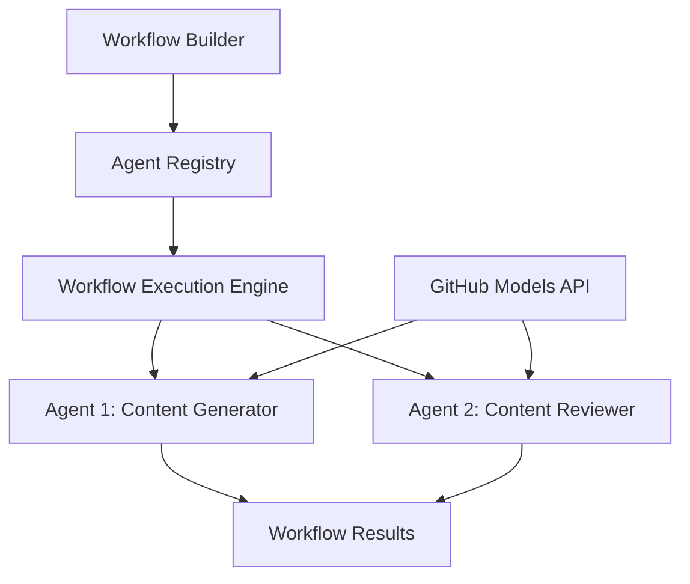

<!--
CO_OP_TRANSLATOR_METADATA:
{
  "original_hash": "034158688d0a45aae06dcbb21b0da5ae",
  "translation_date": "2025-11-11T12:43:29+00:00",
  "source_file": "08-multi-agent/code_samples/workflows-agent-framework/dotNET/01.dotnet-agent-framework-workflow-ghmodel-basic.md",
  "language_code": "ja"
}
-->
# 🔄 GitHubモデルを使用した基本的なエージェントワークフロー (.NET)

## 📋 ワークフローオーケストレーションチュートリアル

このノートブックでは、Microsoft Agent Framework for .NETとGitHubモデルを使用して高度な**エージェントワークフロー**を構築する方法を紹介します。AIエージェントが協力して複雑なタスクを構造化されたオーケストレーションパターンを通じて達成する、マルチステップのビジネスプロセスを作成する方法を学びます。

## 🎯 学習目標

### 🏗️ **ワークフローアーキテクチャの基本**
- **Workflow Builder**: 複雑なマルチステップAIプロセスを設計・オーケストレーション
- **Agent Coordination**: ワークフロー内で複数の専門エージェントを調整
- **GitHub Models Integration**: ワークフロー内でGitHubのAIモデル推論サービスを活用
- **Visual Workflow Design**: ワークフロー構造を作成し、理解を深めるために視覚化

### 🔄 **プロセスオーケストレーションパターン**
- **Sequential Processing**: 複数のエージェントタスクを論理的順序で連結
- **State Management**: ワークフローステージ間でコンテキストとデータフローを維持
- **Error Handling**: 強固なエラー回復とワークフローの耐障害性を実装
- **Performance Optimization**: エンタープライズ規模の運用に向けた効率的なワークフロー設計

### 🏢 **エンタープライズワークフローアプリケーション**
- **業務プロセスの自動化**: 複雑な組織ワークフローを自動化
- **コンテンツ制作パイプライン**: レビューと承認ステージを含む編集ワークフロー
- **カスタマーサービスの自動化**: マルチステップの顧客問い合わせ解決
- **データ処理ワークフロー**: AIを活用した変換を含むETLワークフロー

## ⚙️ 前提条件とセットアップ

### 📦 **必要なNuGetパッケージ**

このワークフローのデモでは、いくつかの重要な.NETパッケージを使用します:

```xml
<!-- Core AI Framework -->
<PackageReference Include="Microsoft.Extensions.AI" Version="9.9.0" />

<!-- Agent Framework (Local Development) -->
<!-- Microsoft.Agents.AI.dll - Core agent abstractions -->
<!-- Microsoft.Agents.AI.OpenAI.dll - OpenAI/GitHub Models integration -->

<!-- Configuration and Environment -->
<PackageReference Include="DotNetEnv" Version="3.1.1" />
```

### 🔑 **GitHubモデルの設定**

**環境設定 (.envファイル):**
```env
GITHUB_TOKEN=your_github_personal_access_token
GITHUB_ENDPOINT=https://models.inference.ai.azure.com
GITHUB_MODEL_ID=gpt-4o-mini
```

**GitHubモデルへのアクセス:**
1. GitHub Modelsにサインアップ (現在プレビュー中)
2. モデルアクセス権限を持つ個人アクセストークンを生成
3. 上記のように環境変数を設定

### 🏗️ **ワークフローアーキテクチャ概要**



**主要コンポーネント:**
- **WorkflowBuilder**: ワークフロー設計のための主要なオーケストレーションエンジン
- **AIAgent**: 特定の能力を持つ個別の専門エージェント
- **GitHub Models Client**: AIモデル推論サービスの統合
- **Execution Context**: ワークフローステージ間の状態とデータフローを管理

## 🎨 **エンタープライズワークフローデザインパターン**

### 📝 **コンテンツ制作ワークフロー**
```
User Request → Content Generation → Quality Review → Final Output
```

### 🔍 **ドキュメント処理パイプライン**
```
Document Input → Analysis → Extraction → Validation → Structured Output
```

### 💼 **ビジネスインテリジェンスワークフロー**
```
Data Collection → Processing → Analysis → Report Generation → Distribution
```

### 🤝 **カスタマーサービスの自動化**
```
Customer Inquiry → Classification → Processing → Response Generation → Follow-up
```

## 🏢 **エンタープライズの利点**

### 🎯 **信頼性とスケーラビリティ**
- **決定論的実行**: 一貫性のある再現可能なワークフロー結果
- **エラー回復**: ワークフローの任意のステージでの障害を優雅に処理
- **パフォーマンスモニタリング**: 実行メトリクスと最適化の機会を追跡
- **リソース管理**: AIモデルリソースの効率的な割り当てと利用

### 🔒 **セキュリティとコンプライアンス**
- **安全な認証**: APIアクセスのためのGitHubトークンベース認証
- **監査証跡**: ワークフロー実行と意思決定ポイントの完全なログ
- **アクセス制御**: ワークフロー実行とモニタリングのための詳細な権限
- **データプライバシー**: ワークフロー全体での機密情報の安全な取り扱い

### 📊 **可観測性と管理**
- **視覚的ワークフロー設計**: プロセスフローと依存関係の明確な表現
- **実行モニタリング**: ワークフロー進捗とパフォーマンスのリアルタイム追跡
- **エラー報告**: 詳細なエラー分析とデバッグ機能
- **パフォーマンス分析**: 最適化と容量計画のためのメトリクス

さあ、最初のエンタープライズ対応AIワークフローを構築しましょう！ 🚀

## 💻 コードの実行

完全な実装は `01.dotnet-agent-framework-workflow-ghmodel-basic.cs` にあります。このファイルでは以下を示します:

1. **環境設定** - `.env`ファイルからGitHubモデルの資格情報を読み込む
2. **OpenAIクライアント設定** - GitHubモデルのエンドポイントを使用するようクライアントを設定
3. **エージェント作成** - 専門エージェント (Front DeskとConcierge) を定義
4. **Workflow Builder** - 順次処理を伴うマルチエージェントワークフローを作成
5. **ワークフロー実行** - ストリーミング結果でワークフローを実行

### 🚀 実例の実行

```bash
# Make the script executable (Unix/Linux/macOS)
chmod +x 01.dotnet-agent-framework-workflow-ghmodel-basic.cs

# Run the workflow
./01.dotnet-agent-framework-workflow-ghmodel-basic.cs
```

またはWindowsで:
```powershell
dotnet run 01.dotnet-agent-framework-workflow-ghmodel-basic.cs
```

### 📝 期待される出力

ワークフローは以下を行います:
1. 旅行先リクエストを受け付ける ("パリに行きたいです")
2. Front Deskエージェントが初期の推奨を提供
3. Conciergeエージェントが推奨をレビューし、改善
4. 最終出力として完全な会話ストリームを表示

### 🔧 カスタマイズ

ワークフローを以下のようにカスタマイズできます:
- エージェントの指示を変更して動作を変更
- より多くのエージェントを追加して複雑なマルチステップワークフローを作成
- ユーザーメッセージを変更して異なるシナリオをテスト
- ワークフローのエッジを調整して異なる実行パターンを作成

---

<!-- CO-OP TRANSLATOR DISCLAIMER START -->
**免責事項**:  
この文書はAI翻訳サービス[Co-op Translator](https://github.com/Azure/co-op-translator)を使用して翻訳されています。正確性を追求していますが、自動翻訳には誤りや不正確さが含まれる可能性があります。元の言語で記載された文書が正式な情報源とみなされるべきです。重要な情報については、専門の人間による翻訳を推奨します。この翻訳の使用に起因する誤解や誤解について、当社は責任を負いません。
<!-- CO-OP TRANSLATOR DISCLAIMER END -->