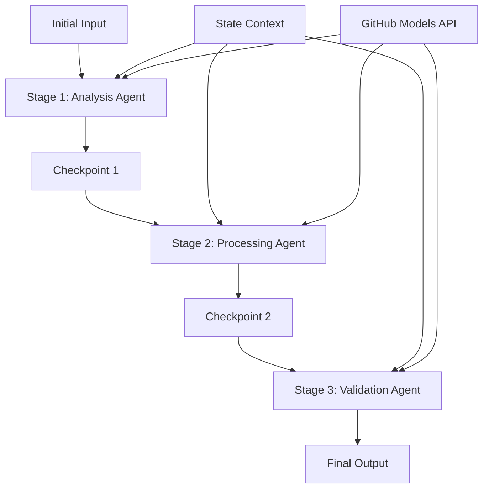

<!--
CO_OP_TRANSLATOR_METADATA:
{
  "original_hash": "1be9c8dcbd79a02d33d2c138684c1394",
  "translation_date": "2025-11-11T13:45:04+00:00",
  "source_file": "08-multi-agent/code_samples/workflows-agent-framework/dotNET/02.dotnet-agent-framework-workflow-ghmodel-sequential.md",
  "language_code": "ja"
}
-->
# ⏩ GitHubモデルを使用したシーケンシャルエージェントワークフロー (.NET)

## 📋 高度なシーケンシャル処理チュートリアル

このノートブックでは、Microsoft Agent Framework for .NETとGitHubモデルを使用した**シーケンシャルワークフローパターン**を紹介します。エージェントが特定の順序で実行され、各ステージが前のステージの結果を基に構築される、洗練された段階的処理パイプラインの構築方法を学びます。

## 🎯 学習目標

### 🔄 **シーケンシャル処理アーキテクチャ**
- **線形ワークフローデザイン**: 明確な依存関係を持つ段階的処理パイプラインを作成
- **状態管理**: シーケンシャルワークフローステージ間でコンテキストとデータフローを維持
- **GitHubモデルの統合**: GitHubのAIモデルを活用した多段階.NETワークフロー
- **エンタープライズパイプラインパターン**: 実運用に対応したシーケンシャル処理システムの構築

### 🏗️ **高度なシーケンシャルパターン**
- **ステージゲート処理**: ワークフローステージ間の検証チェックポイントを実装
- **コンテキスト保持**: 全ステージ間で状態と蓄積された知識を維持
- **エラー伝播**: シーケンシャル処理チェーンでの失敗を適切に処理
- **パフォーマンス最適化**: 最小限のオーバーヘッドで効率的なシーケンシャル実行

### 🏢 **エンタープライズシーケンシャルアプリケーション**
- **ドキュメント処理パイプライン**: 多段階のドキュメント分析、変換、検証
- **品質保証ワークフロー**: 段階的なレビュー、検証、承認プロセス
- **コンテンツ制作パイプライン**: リサーチ → 執筆 → 編集 → レビュー → 公開
- **業務プロセス自動化**: 明確なステージ依存関係を持つ多段階業務ワークフロー

## ⚙️ 前提条件とセットアップ

### 📦 **必要なNuGetパッケージ**

.NETシーケンシャルワークフローに必要なパッケージ:

```xml
<!-- Core AI Framework -->
<PackageReference Include="Microsoft.Extensions.AI" Version="9.9.0" />

<!-- Client Model Abstractions -->
<PackageReference Include="System.ClientModel" Version="1.6.1.0" />

<!-- Azure Identity and Async LINQ Support -->
<PackageReference Include="Azure.Identity" Version="1.15.0" />
<PackageReference Include="System.Linq.Async" Version="6.0.3" />

<!-- Local Agent Framework References -->
<!-- Microsoft.Agents.AI.dll - Core agent abstractions -->
<!-- Microsoft.Agents.AI.OpenAI.dll - GitHub Models integration -->
```

### 🔑 **GitHubモデルの設定**

**環境設定 (.envファイル):**
```env
GITHUB_TOKEN=your_github_personal_access_token
GITHUB_ENDPOINT=https://models.inference.ai.azure.com
GITHUB_MODEL_ID=gpt-4o-mini
```

**設定管理:**
```csharp
// Load environment variables securely
Env.Load("../../../.env");
var githubToken = Environment.GetEnvironmentVariable("GITHUB_TOKEN");
var githubEndpoint = Environment.GetEnvironmentVariable("GITHUB_ENDPOINT");
var modelId = Environment.GetEnvironmentVariable("GITHUB_MODEL_ID");
```

### 🏗️ **シーケンシャルワークフローアーキテクチャ**



**主要コンポーネント:**
- **シーケンシャルエージェント**: 各処理ステージに特化したエージェント
- **状態コンテキスト**: ステージ間で蓄積されたデータと決定を維持
- **チェックポイント**: 各ステージ間の品質と一貫性を確保する検証ポイント
- **GitHubモデルクライアント**: 全ワークフローステージで一貫したAIモデルアクセス

## 🎨 **シーケンシャルワークフローデザインパターン**

### 📝 **ドキュメント処理パイプライン**
```
Raw Document → Content Extraction → Analysis → Validation → Structured Output
```

### 🎯 **コンテンツ制作ワークフロー**
```
Brief/Requirements → Research → Content Creation → Review → Final Polish
```

### 🔍 **品質保証パイプライン**
```
Initial Review → Technical Validation → Compliance Check → Final Approval
```

### 💼 **ビジネスインテリジェンスワークフロー**
```
Data Collection → Processing → Analysis → Report Generation → Distribution
```

## 🏢 **エンタープライズシーケンシャルの利点**

### 🎯 **信頼性と品質**
- **決定論的処理**: 構造化されたステージによる一貫性のある再現可能な結果
- **品質ゲート**: 各ステージでの検証チェックポイントが品質を保証
- **エラー分離**: あるステージの問題が後続ステージに影響を与えない
- **監査証跡**: 各ステージでの決定と変換の完全な追跡

### 📈 **スケーラビリティとパフォーマンス**
- **モジュール設計**: 各ステージを個別に最適化可能
- **リソース管理**: ステージ間でAIモデルリソースを効率的に割り当て
- **状態最適化**: 最適なパフォーマンスのためにステージ間の状態転送を最小化
- **並列ステージグループ**: 複数のシーケンシャルワークフローを並列で実行可能

### 🔒 **セキュリティとコンプライアンス**
- **ステージレベルのセキュリティ**: 各処理ステージに異なるセキュリティポリシーを適用
- **データ検証**: 各チェックポイントでデータの整合性とコンプライアンスを確保
- **アクセス制御**: 異なるワークフローステージに対する詳細な権限設定
- **規制遵守**: 構造化された処理を通じて規制要件を満たす

### 📊 **モニタリングと分析**
- **ステージレベルのメトリクス**: 各ワークフローステージのパフォーマンスを監視
- **ボトルネックの特定**: 遅いステージを特定して最適化
- **品質メトリクス**: 各ステージの品質と成功率を追跡
- **プロセス最適化**: ステージレベルの分析に基づく継続的な改善

さあ、堅牢なシーケンシャルAI処理パイプラインを構築しましょう！ 🚀

## 💻 コードの実行

完全な実装は `02.dotnet-agent-framework-workflow-ghmodel-sequential.cs` にあります。このファイルでは、**3段階の家具分析ワークフロー**を示しています:

1. **ステージ1 - セールスエージェント**: 家具画像を分析し、購入提案を提供
2. **ステージ2 - 価格エージェント**: 詳細な価格内訳と予算オプションを提供
3. **ステージ3 - 見積もりエージェント**: Markdown形式のプロフェッショナルな見積もりドキュメントを生成

### 🏗️ **ワークフローアーキテクチャ**

```
Image Input → Sales Analysis → Price Estimation → Quote Generation → Final Output
```

各エージェントは以下を行います:
- 前のステージの出力をコンテキストとして受け取る
- 前の分析を基に専門知識を活用して構築
- 状態管理を通じてワークフローの連続性を維持

### 🚀 実例の実行

**前提条件:**
- 家具画像を `../imgs/home.png` に配置 (または `imgPath` 変数を更新)
- `.env` ファイルにGitHubモデルの資格情報を設定

```bash
# Make the script executable (Unix/Linux/macOS)
chmod +x 02.dotnet-agent-framework-workflow-ghmodel-sequential.cs

# Run the sequential workflow
./02.dotnet-agent-framework-workflow-ghmodel-sequential.cs
```

またはWindowsで:
```powershell
dotnet run 02.dotnet-agent-framework-workflow-ghmodel-sequential.cs
```

### 📝 期待される出力

ワークフローは以下を実行します:
1. **セールスエージェント**: 画像から家具アイテムを特定し、推奨を提供
2. **価格エージェント**: 詳細な価格分析を追加し、予算層とショッピング推奨を提供
3. **見積もりエージェント**: すべての情報を統合したフォーマット済みの見積もりドキュメントを生成

最終出力は、画像分析に基づいた包括的でプロフェッショナルな家具見積もりとなります。

### 🔧 カスタマイズオプション

**エージェントの動作を変更:**
```csharp
// Adjust agent instructions to change their focus
const string SalesAgentInstructions = "Your custom instructions...";
```

**シーケンシャルフローを変更:**
```csharp
// Add or reorder workflow stages
var workflow = new WorkflowBuilder(salesagent)
    .AddEdge(salesagent, priceagent)
    .AddEdge(priceagent, quoteagent)
    .AddEdge(quoteagent, newAgent)  // Add another stage
    .Build();
```

**異なる入力を使用:**
```csharp
// Process text instead of images
ChatMessage userMessage = new ChatMessage(ChatRole.User, [
    new TextContent("Analyze pricing for a modern living room set")
]);
```

### 🎯 実世界での応用

このシーケンシャルパターンは以下に最適です:
- **Eコマース**: 商品分析 → 価格設定 → 見積もり生成
- **不動産**: 物件分析 → 評価 → リスティング作成
- **保険**: 保険請求分析 → 評価 → 見積もり生成
- **コンテンツ制作**: リサーチ → 執筆 → 編集 → 公開

### 🔍 状態フローの理解

シーケンス内の各エージェントは以下を受け取ります:
- **元の入力**: 初期のユーザーメッセージ (画像 + テキスト)
- **前のエージェントの出力**: 会話履歴内のすべての前のエージェントの応答
- **蓄積されたコンテキスト**: ワークフロー全体で維持される完全な状態

これにより、各エージェントが前のステージの包括的なコンテキストを基に構築する、洗練された多段階処理が可能になります。

---

<!-- CO-OP TRANSLATOR DISCLAIMER START -->
**免責事項**:  
この文書はAI翻訳サービス[Co-op Translator](https://github.com/Azure/co-op-translator)を使用して翻訳されています。正確性を追求していますが、自動翻訳には誤りや不正確さが含まれる可能性があります。元の言語で記載された文書を正式な情報源としてください。重要な情報については、専門の人間による翻訳を推奨します。この翻訳の使用に起因する誤解や誤解について、当社は責任を負いません。
<!-- CO-OP TRANSLATOR DISCLAIMER END -->