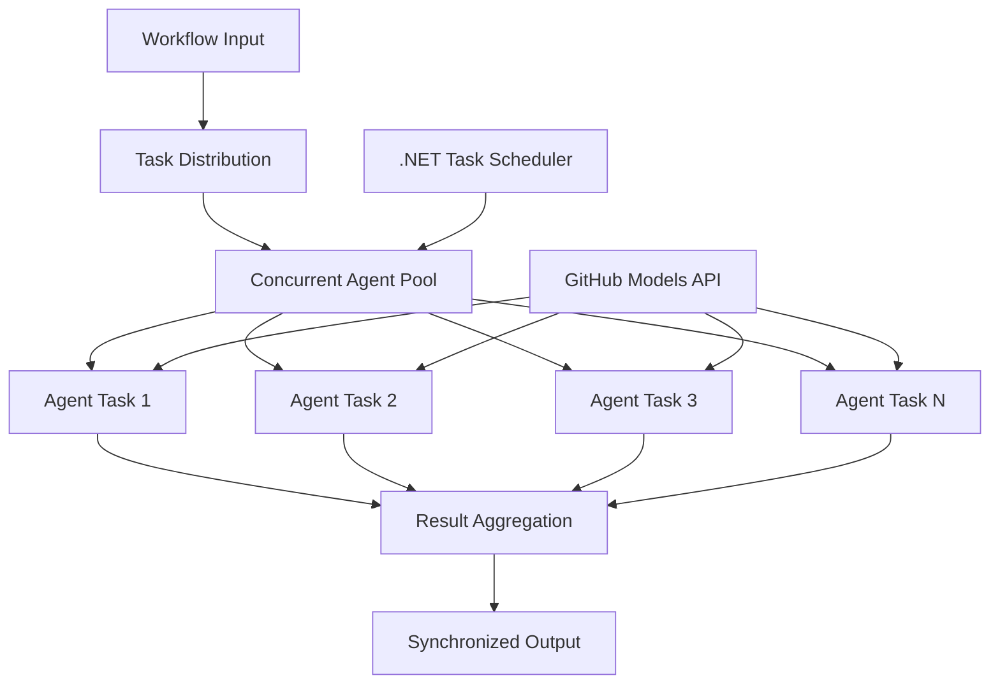

<!--
CO_OP_TRANSLATOR_METADATA:
{
  "original_hash": "b9c6e32c9b5f2fed20b6916984440d88",
  "translation_date": "2025-11-11T13:11:04+00:00",
  "source_file": "08-multi-agent/code_samples/workflows-agent-framework/dotNET/03.dotnet-agent-framework-workflow-ghmodel-concurrent.md",
  "language_code": "ja"
}
-->
# ⚡ GitHubモデルを活用した並行エージェントワークフロー (.NET)

## 📋 高性能並行処理チュートリアル

このノートブックでは、Microsoft Agent Framework for .NETとGitHubモデルを使用した**並行ワークフローパターン**を紹介します。複数のAIエージェントを同時に実行しながら、調整とデータ整合性を維持することで、スループットを最大化する高性能な並行処理ワークフローの構築方法を学びます。

## 🎯 学習目標

### 🚀 **並行処理の基礎**
- **エージェントの並行実行**: 複数のAIエージェントを同時に実行して最大のパフォーマンスを実現
- **Async/Awaitパターン**: .NETの非同期プログラミングモデルを活用して効率的な並行処理を実現
- **GitHubモデルの統合**: GitHubのAIモデル推論サービスへの複数の並行呼び出しを調整
- **リソース管理**: 並行操作全体でAIモデルリソースを効率的に管理

### 🏗️ **高度な並行処理アーキテクチャ**
- **タスクベースの並行処理**: .NETのTask Parallel Libraryを使用して最適な並行実行を実現
- **同期パターン**: レースコンディションを回避しながら並行エージェントを調整
- **負荷分散**: 利用可能な並行処理能力に応じて効率的に作業を分配
- **障害耐性**: 個々のエージェントの失敗がワークフロー全体を停止させないようにする

### 🏢 **企業向け並行アプリケーション**
- **大量ドキュメント処理**: 複数のドキュメントを同時に処理
- **リアルタイムコンテンツ分析**: 入力データストリームの並行分析
- **バッチ処理の最適化**: 大規模データ処理操作のスループットを最大化
- **マルチモーダル分析**: 異なるコンテンツタイプや形式の並行処理

## ⚙️ 前提条件とセットアップ

### 📦 **必要なNuGetパッケージ**

高性能並行ワークフローに必要なパッケージ:

```xml
<!-- Core AI Framework with Async Support -->
<PackageReference Include="Microsoft.Extensions.AI" Version="9.9.0" />

<!-- Client Model Abstractions for API Communication -->
<PackageReference Include="System.ClientModel" Version="1.6.1.0" />

<!-- Azure Identity and Async LINQ for Advanced Operations -->
<PackageReference Include="Azure.Identity" Version="1.15.0" />
<PackageReference Include="System.Linq.Async" Version="6.0.3" />

<!-- Local Agent Framework References -->
<!-- Microsoft.Agents.AI.dll - Core agent abstractions with async support -->
<!-- Microsoft.Agents.AI.OpenAI.dll - GitHub Models integration with concurrency -->
```

### 🔑 **GitHubモデルの設定**

**環境設定 (.envファイル):**
```env
GITHUB_TOKEN=your_github_personal_access_token
GITHUB_ENDPOINT=https://models.inference.ai.azure.com
GITHUB_MODEL_ID=gpt-4o-mini
```

**並行処理の考慮事項:**
```csharp
// Configure for concurrent operations
var clientOptions = new OpenAIClientOptions()
{
    Endpoint = new Uri(githubEndpoint),
    // Configure connection pooling for concurrent requests
    NetworkTimeout = TimeSpan.FromMinutes(5)
};
```

### 🏗️ **並行ワークフローアーキテクチャ**



**主要コンポーネント:**
- **Task Parallel Library**: .NETの組み込み並行操作サポート
- **エージェントプール**: 並行処理用の複数エージェントインスタンス
- **結果の集約**: 並行エージェントの結果を調整して統合
- **同期ポイント**: 並行操作全体でデータ整合性を確保

## 🎨 **並行ワークフローデザインパターン**

### 🔍 **並行リサーチと分析**
```
Research Topic → Concurrent Research Agents → Result Synthesis → Final Report
```

### 📊 **マルチソースデータ処理**
```
Data Sources → Parallel Processing Agents → Data Integration → Unified Output
```

### 🎭 **コンテンツ生成パイプライン**
```
Content Requirements → Concurrent Content Generators → Quality Review → Final Content
```

### 🔄 **ファンアウト/ファンイン処理**
```
Single Input → Multiple Concurrent Processors → Result Aggregation → Single Output
```

## 🏢 **企業向けパフォーマンスの利点**

### ⚡ **スループットとスケーラビリティ**
- **線形パフォーマンススケーリング**: 並行エージェントを追加してスループットを向上
- **リソース利用**: 利用可能なAIモデル容量の最大効率化
- **処理時間の短縮**: 並行実行による大幅な時間短縮
- **弾力的スケーリング**: ワークロードに応じて並行エージェント数を動的に調整

### 🛡️ **信頼性と回復力**
- **障害の分離**: 個々のエージェントの失敗が他の並行操作に影響を与えない
- **段階的劣化**: エージェント容量が減少してもシステムは動作を継続
- **エラー回復**: 失敗した並行操作の自動再試行メカニズム
- **負荷分散**: 利用可能なエージェント間で均等に作業を分配

### 📊 **パフォーマンスモニタリング**
- **並行実行メトリクス**: すべての並行操作のパフォーマンスを追跡
- **リソース使用分析**: CPU、メモリ、ネットワーク利用状況を監視
- **スループット分析**: 並行処理による効率向上を測定
- **ボトルネック検出**: パフォーマンス制約を特定して解決

### 🔧 **開発と運用**
- **非同期プログラミングモデル**: .NETの成熟したasync/awaitパターンを活用
- **タスク調整**: 組み込みのタスク管理と調整機能
- **例外処理**: 並行操作の包括的なエラー処理
- **デバッグサポート**: Visual Studioのデバッグツールによる並行ワークフローのサポート

高性能な並行AIワークフローを.NETで構築しましょう！🚀

## 💻 コードの実行

完全な実装は`03.dotnet-agent-framework-workflow-ghmodel-concurrent.cs`にあります。このファイルでは、旅行計画のための**ファンアウト/ファンイン並行ワークフロー**を示しています:

### 🏗️ **ワークフローアーキテクチャ**

```
User Request → ConcurrentStartExecutor → [Researcher Agent || Planner Agent] → ConcurrentAggregationExecutor → Final Output
```

**主要コンポーネント:**

1. **ConcurrentStartExecutor**: ユーザーリクエストをすべてのエージェントに同時にブロードキャスト
2. **Researcher Agent**: 目的地と観光地を並行して分析
3. **Planner Agent**: 詳細な旅行計画を並行して作成
4. **ConcurrentAggregationExecutor**: 両エージェントの結果を収集して統合

### 🎯 **ファンアウト/ファンインパターン**

このワークフローはクラシックな**ファンアウト/ファンイン**パターンを示しています:
- **ファンアウト**: 1つの入力メッセージを複数のエージェントに同時にブロードキャスト
- **並行処理**: 複数のエージェントが同じタスクを並行して実行
- **ファンイン**: すべてのエージェントの結果を収集して1つの出力に統合

### 🚀 実行例

```bash
# Make the script executable (Unix/Linux/macOS)
chmod +x 03.dotnet-agent-framework-workflow-ghmodel-concurrent.cs

# Run the concurrent workflow
./03.dotnet-agent-framework-workflow-ghmodel-concurrent.cs
```

またはWindowsで:
```powershell
dotnet run 03.dotnet-agent-framework-workflow-ghmodel-concurrent.cs
```

### 📝 期待される出力

ワークフローは以下を実行します:
1. **リクエストのブロードキャスト**: 「12月にシアトル旅行を計画してください」を両エージェントに送信
2. **並行処理**: 両エージェントが同時に作業:
   - Researcherが観光地と詳細を特定
   - Plannerが旅程と物流を作成
3. **集約**: 両方の応答を統合して包括的な出力を生成
4. **結果の表示**: 統合された旅行計画をすべての情報とともに表示

### 🔧 カスタマイズオプション

**並行エージェントを追加:**
```csharp
// Create additional specialized agents
AIAgent budgetAgent = openAIClient.GetChatClient(github_model_id).CreateAIAgent(
    name: "Budget-Agent", instructions: "Calculate travel costs...");

// Add to fan-out
var workflow = new WorkflowBuilder(startExecutor)
    .AddFanOutEdge(startExecutor, targets: [researcherAgent, plannerAgent, budgetAgent])
    .AddFanInEdge(aggregationExecutor, sources: [researcherAgent, plannerAgent, budgetAgent])
    .WithOutputFrom(aggregationExecutor)
    .Build();

// Update aggregation count
if (this._messages.Count == 3) { ... }
```

**エージェントの指示を変更:**
```csharp
const string ResearcherAgentInstructions = "Your custom instructions for research...";
const string PlanAgentInstructions = "Your custom instructions for planning...";
```

**タスクを変更:**
```csharp
StreamingRun run = await InProcessExecution.StreamAsync(
    workflow, 
    "Plan a European vacation for 2 weeks in summer"
);
```

### 🎯 実世界での応用

この並行パターンは以下に最適です:
- **コンテンツ作成**: 複数のライターが異なるセクションを同時に作成
- **コードレビュー**: 複数のレビュー担当者が異なる視点からコードを分析
- **市場調査**: 異なる市場セグメントの並行分析
- **ドキュメント処理**: 抽出、分析、検証を並行して実行
- **多視点分析**: 同じ入力に対する多様な視点を取得

### 🔍 カスタムエグゼキュータの理解

**ConcurrentStartExecutor:**
- `IMessageHandler<string>`を実装して文字列入力を受け取る
- メッセージをすべての接続されたエージェントにブロードキャスト
- 並行処理をトリガーする`TurnToken`を送信

**ConcurrentAggregationExecutor:**
- `IMessageHandler<ChatMessage>`を実装してエージェント応答を受け取る
- スレッドセーフな方法でメッセージを収集
- 期待されるすべての応答が到着したら集約
- `context.YieldOutputAsync()`を使用して最終出力を生成

### ⚡ パフォーマンスの利点

**並行 vs 順次:**
- 順次: Agent1 (30秒) → Agent2 (30秒) = **合計60秒**
- 並行: Agent1 (30秒) || Agent2 (30秒) = **合計30秒**

**スループットの向上**: ワークロードとリソースに応じて、N並行エージェントで最大N倍速くなる可能性

### 🛡️ エラー処理

ワークフローは個々のエージェントの失敗を優雅に処理します:
- 1つのエージェントが失敗しても、他のエージェントは処理を続行
- 集約器はタイムアウトロジックを実装可能
- 必要に応じて部分的な結果を返すことが可能

### 📊 高度な機能

**動的エージェント数:**
集約ロジックを変更して可変エージェント数をサポート:

```csharp
private int _expectedAgentCount;
private readonly List<ChatMessage> _messages = [];

public async ValueTask HandleAsync(ChatMessage message, IWorkflowContext context)
{
    this._messages.Add(message);
    if (this._messages.Count == _expectedAgentCount)
    {
        // Process aggregation
    }
}
```

この並行ワークフローパターンは、高性能でスケーラブルなAIエージェントシステムを構築するために不可欠です！

---

<!-- CO-OP TRANSLATOR DISCLAIMER START -->
**免責事項**:  
この文書はAI翻訳サービス[Co-op Translator](https://github.com/Azure/co-op-translator)を使用して翻訳されています。正確性を追求しておりますが、自動翻訳には誤りや不正確な部分が含まれる可能性があります。元の言語で記載された文書を正式な情報源としてご参照ください。重要な情報については、専門の人間による翻訳を推奨します。この翻訳の使用に起因する誤解や誤解について、当方は責任を負いません。
<!-- CO-OP TRANSLATOR DISCLAIMER END -->