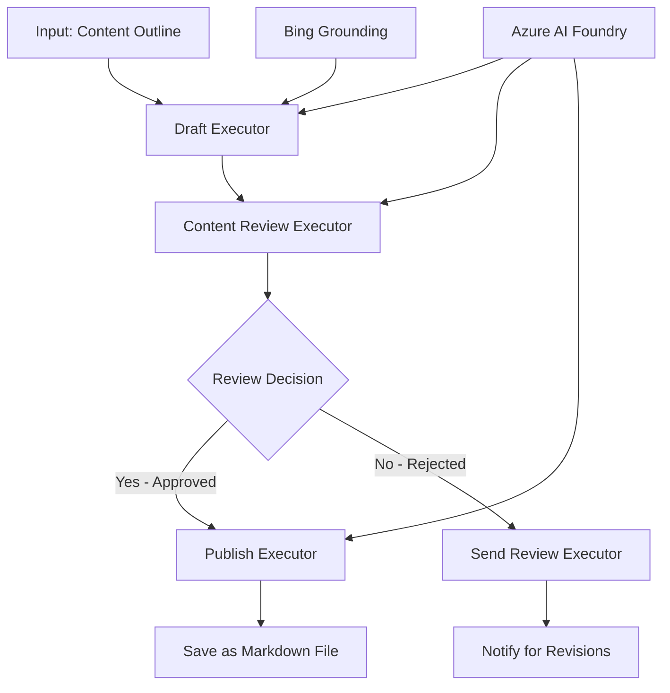

<!--
CO_OP_TRANSLATOR_METADATA:
{
  "original_hash": "8abd335151cee553293b637ee3d80d10",
  "translation_date": "2025-11-11T12:07:03+00:00",
  "source_file": "08-multi-agent/code_samples/workflows-agent-framework/dotNET/04.dotnet-agent-framework-workflow-aifoundry-condition.md",
  "language_code": "ja"
}
-->
# 🔀 Azure AI Foundry (.NET) を使用した条件付きエージェントワークフロー

## 📋 インテリジェントな意思決定ベースのワークフローのチュートリアル

このノートブックでは、Azure AI Foundry と Microsoft Agent Framework for .NET を使用した**条件付きワークフローパターン**を紹介します。AI 分析、ビジネスルール、動的条件に基づいて処理をインテリジェントにルーティングする高度な意思決定型ワークフローを構築する方法を学びます。

## 🎯 学習目標

### 🧠 **インテリジェントな意思決定アーキテクチャ**
- **条件付きロジックの実装**: 複数の分岐ポイントを持つ複雑な意思決定ツリーを構築
- **AI を活用したルーティング**: Azure AI Foundry モデルを使用してインテリジェントなルーティングを実現
- **動的ワークフローの適応**: 実行時の分析と条件に基づいてワークフローの動作を変更
- **企業ルールの統合**: ビジネスロジックやコンプライアンス要件をワークフローに組み込む

### 🔀 **高度な条件付きパターン**
- **複数基準による意思決定**: ルーティング決定のために複数の要因を評価
- **コンテキストに基づく処理**: ワークフローの履歴やコンテキストに基づいて意思決定
- **適応型ワークフローの変更**: リアルタイムの条件に基づいて処理経路を動的に調整
- **ルールエンジンの統合**: ワークフロー内で高度なビジネスルールエンジンを実装

### 🏢 **企業向け条件付きアプリケーション**
- **文書分類とルーティング**: 文書を自動的に分類し、適切なワークフローにルーティング
- **カスタマーサービスのトリアージ**: 顧客の問い合わせを専門チームにインテリジェントにルーティング
- **コンプライアンスとリスク処理**: リスク評価に基づいて異なる検証とレビューを適用
- **品質保証ワークフロー**: 品質指標に基づいてコンテンツを適切なレビュー工程にルーティング

## ⚙️ 必要条件とセットアップ

### 📦 **必要な NuGet パッケージ**

条件付きワークフロー処理のための高度なパッケージ:

```xml
<!-- Core AI Framework -->
<PackageReference Include="Microsoft.Extensions.AI" Version="9.9.0" />

<!-- Azure AI Agents with Persistent State -->
<PackageReference Include="Azure.AI.Agents.Persistent" Version="1.2.0-beta.5" />

<!-- Azure Identity and Utilities -->
<PackageReference Include="Azure.Identity" Version="1.15.0" />
<PackageReference Include="System.Linq.Async" Version="6.0.3" />
<PackageReference Include="DotNetEnv" Version="3.1.1" />

<!-- Local Workflow Framework References -->
<!-- Microsoft.Agents.Workflows.dll - Advanced workflow orchestration -->
<!-- Microsoft.Agents.AI.AzureAI.dll - Azure AI Foundry integration -->
<!-- Microsoft.Agents.AI.dll - Core agent abstractions -->
```

### 🔑 **Azure AI Foundry の設定**

**必要な Azure リソース:**
- 条件付き処理モデルを備えた Azure AI Foundry ワークスペース
- 適切なコンピュートクォータと権限を持つ Azure サブスクリプション
- 意思決定とコンテンツ分析のためにデプロイされた AI モデル
- (オプション) Bing Search API 接続による情報収集機能

**環境設定 (.env ファイル):**
```env
# Azure AI Foundry Configuration
AZURE_AI_PROJECT_ENDPOINT=https://your-project.cognitiveservices.azure.com/
BING_CONNECTION_ID=your-bing-connection-id
```

**認証設定:**
```csharp
// Azure CLI or Managed Identity authentication
using Azure.Identity;
var credential = new AzureCliCredential();

// Load environment configuration
DotNetEnv.Env.Load("../../../.env");
```

### 🏗️ **条件付きワークフローアーキテクチャ**



**主要コンポーネント:**
- **Draft Executor**: アウトラインから初期コンテンツドラフトを作成する AI エージェント
- **Content Review Executor**: ドラフトの品質とコンプライアンスを評価する AI エージェント
- **条件付きルーティング**: レビュー結果に基づいてルーティングする意思決定ロジック
- **公開/レビュー経路**: 承認されたコンテンツと却下されたコンテンツの別々の処理経路
- **状態管理**: ワークフロー全体でコンテンツとレビューのコンテキストを維持

## 🎨 **条件付きワークフローデザインパターン**

### 📋 **品質ゲート付きコンテンツ制作**
```
Outline → Draft Creation → Quality Review → {Approve: Publish | Reject: Revise}
```

### 🎯 **リスクベースの文書処理**
```
Document → Risk Assessment → {Low: Standard | High: Enhanced Review}
```

### 🔍 **インテリジェントなカスタマーサービスルーティング**
```
Customer Query → Analysis → {Simple: FAQ Bot | Complex: Human Agent}
```

### 💼 **コンプライアンス駆動型ワークフロー**
```
Content → Compliance Check → {Pass: Publish | Fail: Legal Review}
```

## 🏢 **企業向け条件付きの利点**

### 🎯 **インテリジェントな自動化**
- **スマートな意思決定**: コンテンツ分析とコンテキストに基づく AI 駆動型ルーティング
- **適応型処理**: 変化する条件に基づいて自動的に調整されるワークフロー
- **ビジネスルールの適用**: 複雑なビジネスロジックとポリシーの自動適用
- **コンテキストに基づくルーティング**: ワークフロー履歴と蓄積されたコンテキストに基づく意思決定

### 📈 **運用効率の向上**
- **リソース配分の最適化**: 最も適切な専門家やプロセスに作業をルーティング
- **手動介入の削減**: 自動意思決定により人間によるルーティングの必要性を最小化
- **迅速な解決時間**: 適切な専門知識と処理能力への直接ルーティング
- **一貫した適用**: ビジネスルールと意思決定基準の統一的な適用

### 🛡️ **リスク管理とコンプライアンス**
- **自動リスク評価**: コンテンツと状況のリスクレベルを AI で評価
- **コンプライアンスの適用**: 必要な規制プロセスを自動的にルーティング
- **セキュリティプロトコルの適用**: リスク評価に基づく強化されたセキュリティ対策
- **監査証跡の維持**: ルーティング決定とその根拠の完全な記録

### 📊 **分析と継続的改善**
- **意思決定分析**: ルーティング決定の有効性と正確性を追跡
- **パターン認識**: 時間経過に伴うルーティング決定の傾向とパターンを特定
- **パフォーマンス最適化**: 意思決定基準とルーティング効率の継続的改善
- **ビジネスインテリジェンス**: コンテンツ特性と処理要件に関する洞察

### 🔧 **技術的な卓越性**
- **永続的な状態管理**: ワークフロー実行中の複雑な状態を維持
- **スケーラブルなアーキテクチャ**: 高ボリュームの条件付き処理要件に対応
- **統合能力**: 既存のビジネスシステムやプロセスとのシームレスな統合
- **監視と可観測性**: ワークフローのパフォーマンスと意思決定の包括的な追跡

.NET を使用してインテリジェントで意思決定型の企業ワークフローを構築しましょう！ 🚀

## 💻 コードの実行

完全な実装は `04.dotnet-agent-framework-workflow-aifoundry-condition.cs` にあります。このファイルでは、**品質ゲート付きコンテンツ制作ワークフロー**を示しています:

### 🏗️ **ワークフローアーキテクチャ**

```
Content Outline → Draft Creation → Quality Review → Conditional Routing:
                                                      ├─ Approved (>200 words) → Publish
                                                      └─ Rejected (<200 words) → Review Notification
```

**ワークフロー内のエージェント:**
1. **Evangelist Agent**: Bing を活用してアウトラインからチュートリアルドラフトを作成
2. **Content Reviewer Agent**: ドラフトの品質 (語数、完全性) を評価
3. **Publisher Agent**: 承認されたコンテンツをタイムスタンプ付き Markdown ファイルとして保存

**カスタムエグゼキューター:**
1. **DraftExecutor**: ドラフト作成を指揮
2. **ContentReviewExecutor**: 品質評価を実施
3. **PublishExecutor**: 承認されたコンテンツの公開を担当
4. **SendReviewExecutor**: 却下されたコンテンツの通知を管理

### 🚀 実例の実行

**必要条件:**
- Azure AI Foundry ワークスペースの設定済み
- Azure CLI 認証 (`az login`)
- (オプション) Bing Search 接続による情報収集

```bash
# Make the script executable (Unix/Linux/macOS)
chmod +x 04.dotnet-agent-framework-workflow-aifoundry-condition.cs

# Run the conditional workflow
./04.dotnet-agent-framework-workflow-aifoundry-condition.cs
```

Windows では:
```powershell
dotnet run 04.dotnet-agent-framework-workflow-aifoundry-condition.cs
```

### 📝 期待される出力

ワークフローは以下を実行します:
1. **エージェントの作成**: 3 つの専門的な Azure AI Foundry エージェントを初期化
2. **ドラフトの生成**: Evangelist エージェントがアウトラインからチュートリアルドラフトを作成
3. **コンテンツのレビュー**: Content Reviewer がドラフトの品質を評価
4. **条件付きルーティング**:
   - **承認された場合 (>200 語)**: PublishExecutor が Markdown ファイルとして保存
   - **却下された場合 (<200 語)**: SendReviewExecutor がレビュー通知を送信
5. **結果の表示**: 最終的なワークフローの結果を表示

### 🔧 カスタマイズオプション

**レビュー基準の変更:**
```csharp
const string ContentReviewerInstructions = @"
You are a content reviewer...
1. Check if content is more than 500 words (instead of 200)
2. Verify technical accuracy
3. Ensure proper formatting
...";
```

**条件付き経路の追加:**
```csharp
var workflow = new WorkflowBuilder(draftExecutor)
    .AddEdge(draftExecutor, contentReviewerExecutor)
    .AddEdge(contentReviewerExecutor, publishExecutor, condition: GetCondition("Excellent"))
    .AddEdge(contentReviewerExecutor, editExecutor, condition: GetCondition("Good"))
    .AddEdge(contentReviewerExecutor, sendReviewerExecutor, condition: GetCondition("Poor"))
    .Build();
```

**コンテンツ要件の変更:**
```csharp
string OUTLINE_Content = @"
# Your Custom Topic
## Section 1
https://your-reference-url
## Section 2
...
";
```

### 🎯 実世界での応用

この条件付きワークフローパターンは以下に最適です:
- **コンテンツ管理システム**: 品質ゲート付きの自動編集ワークフロー
- **文書処理**: 分類とコンプライアンスに基づく文書のルーティング
- **カスタマーサポート**: 複雑さと緊急性に基づくインテリジェントなチケットルーティング
- **法的レビュー**: リスク評価と価値に基づく契約のルーティング
- **人事プロセス**: 適切なスクリーニングワークフローを通じた応募書類のルーティング

### 🔍 条件付きロジックの理解

**条件関数:**
```csharp
public Func<object?, bool> GetCondition(string expectedResult) =>
    reviewResult => reviewResult is ReviewResult review && review.Result == expectedResult;
```

この関数は以下を行います:
1. 結果が `ReviewResult` 型であるか確認
2. `Result` プロパティを期待値と比較
3. ルーティングを決定するために true/false を返す

**条件付きのワークフローエッジ:**
```csharp
.AddEdge(contentReviewerExecutor, publishExecutor, condition: GetCondition("Yes"))
.AddEdge(contentReviewerExecutor, sendReviewerExecutor, condition: GetCondition("No"))
```

### 📊 高度な機能

**JSON スキーマ検証:**
ワークフローは JSON スキーマを使用して構造化された応答を保証します:

```csharp
// Define response structure
public class ReviewResult
{
    [JsonPropertyName("review_result")]
    public string Result { get; set; } = string.Empty;
    
    [JsonPropertyName("reason")]
    public string Reason { get; set; } = string.Empty;
    
    [JsonPropertyName("draft_content")]
    public string DraftContent { get; set; } = string.Empty;
}

// Apply to agent
ResponseFormat = ChatResponseFormat.ForJsonSchema(
    AIJsonUtilities.CreateJsonSchema(typeof(ReviewResult)), 
    "ReviewResult", 
    "Review Result From DraftContent"
)
```

**Bing Grounding の統合:**
Evangelist エージェントは Bing Grounding を使用してリアルタイム情報にアクセスします:

```csharp
var bingGroundingConfig = new BingGroundingSearchConfiguration(bing_conn_id);
BingGroundingToolDefinition bingGroundingTool = new(
    new BingGroundingSearchToolParameters([bingGroundingConfig])
);
```

これにより、エージェントはアウトライン内の URL を追跡し、最新情報を抽出できます。

### 🛡️ エラー処理

ワークフローには却下されたコンテンツに対する堅牢なエラー処理が含まれています:
- レビュー失敗時に代替経路がトリガーされる
- 通知により明確な却下理由を提供
- コンテンツは改訂のために保存される

### 🔄 ワークフローの拡張

**改訂ループの追加:**
コンテンツを自動的に再ドラフトするフィードバックループを作成:

```csharp
.AddEdge(contentReviewerExecutor, publishExecutor, condition: GetCondition("Yes"))
.AddEdge(contentReviewerExecutor, draftExecutor, condition: GetCondition("No")) // Loop back
```

**多段階レビューの実装:**
異なる基準を持つ複数のレビュー段階を追加:

```csharp
.AddEdge(draftExecutor, technicalReviewer)
.AddEdge(technicalReviewer, editorialReviewer, condition: GetCondition("TechPass"))
.AddEdge(editorialReviewer, publishExecutor, condition: GetCondition("EditPass"))
```

この条件付きワークフローパターンは、高度でインテリジェントな企業自動化システムを構築するための基盤を提供します！ 🚀

---

<!-- CO-OP TRANSLATOR DISCLAIMER START -->
**免責事項**:  
この文書はAI翻訳サービス[Co-op Translator](https://github.com/Azure/co-op-translator)を使用して翻訳されています。正確性を追求しておりますが、自動翻訳には誤りや不正確な部分が含まれる可能性があります。元の言語で記載された文書が正式な情報源とみなされるべきです。重要な情報については、専門の人間による翻訳を推奨します。この翻訳の使用に起因する誤解や誤解について、当社は責任を負いません。
<!-- CO-OP TRANSLATOR DISCLAIMER END -->