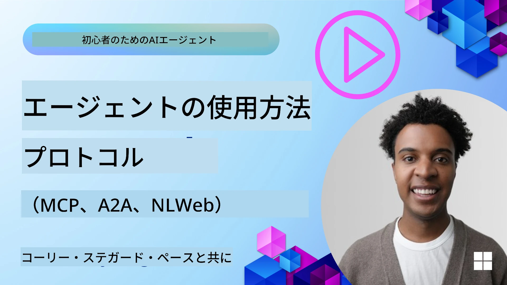
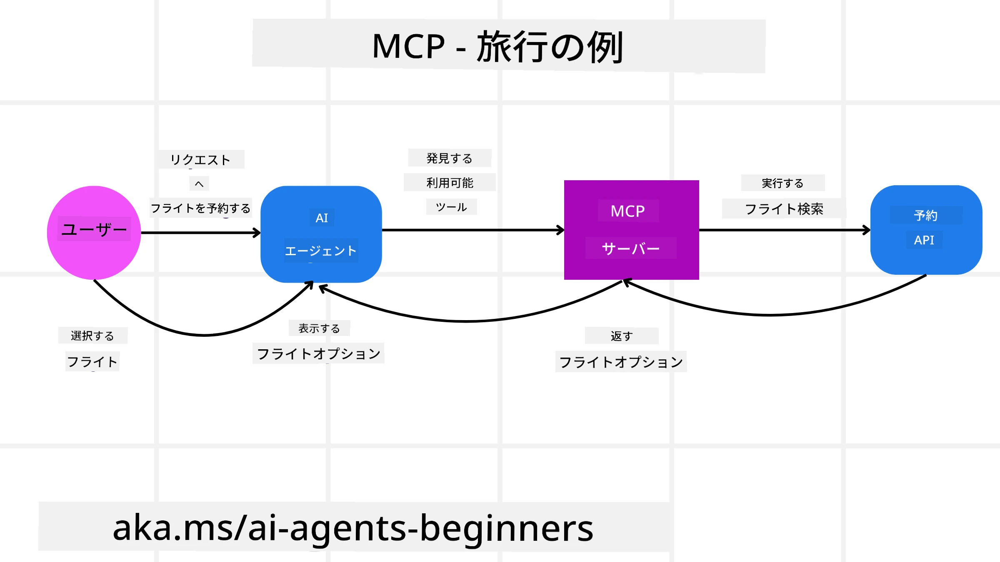
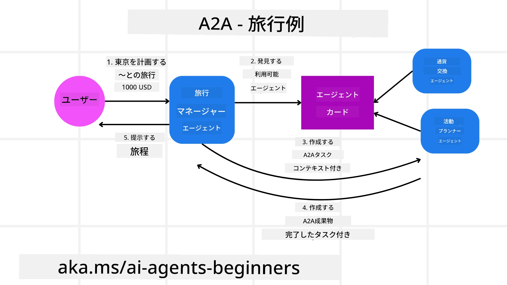
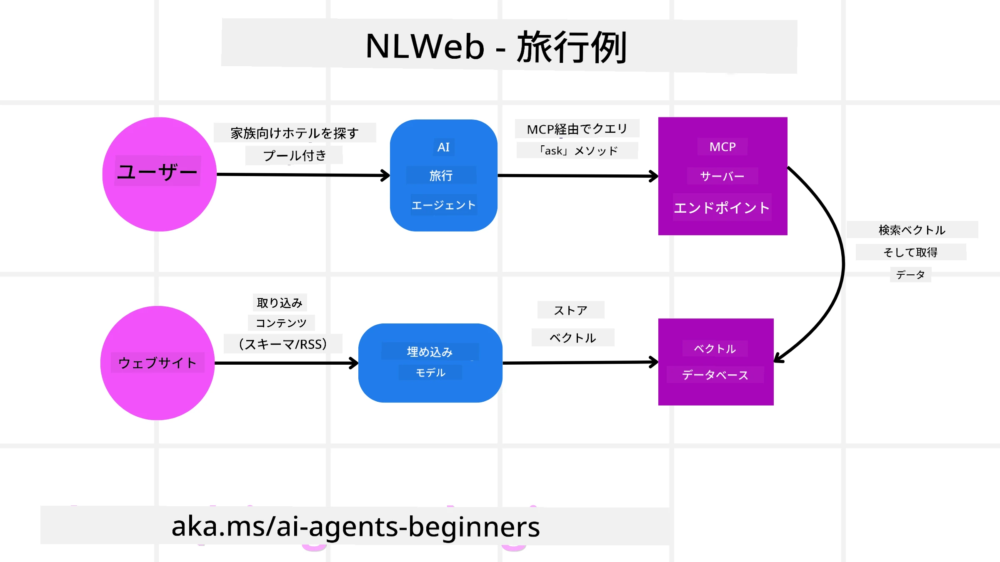

<!--
CO_OP_TRANSLATOR_METADATA:
{
  "original_hash": "aff92c6f019b4627ca9399c6e3882e17",
  "translation_date": "2025-09-18T14:26:14+00:00",
  "source_file": "11-agentic-protocols/README.md",
  "language_code": "ja"
}
-->
# エージェンティックプロトコルの活用 (MCP、A2A、NLWeb)

> _(上の画像をクリックすると、このレッスンの動画をご覧いただけます)_

AIエージェントの利用が拡大するにつれ、標準化、安全性、そしてオープンイノベーションを支援するプロトコルの必要性も高まっています。このレッスンでは、これらのニーズに応えることを目指す3つのプロトコル、Model Context Protocol (MCP)、Agent to Agent (A2A)、そしてNatural Language Web (NLWeb)について学びます。

## はじめに

このレッスンでは以下を学びます：

• **MCP**がAIエージェントに外部ツールやデータへのアクセスを提供し、ユーザーのタスクを完了する方法。

• **A2A**が異なるAIエージェント間のコミュニケーションと協力を可能にする方法。

• **NLWeb**が自然言語インターフェースをウェブサイトに導入し、AIエージェントがコンテンツを発見し、操作できるようにする方法。

## 学習目標

• MCP、A2A、NLWebのコア目的と利点をAIエージェントの文脈で**特定**する。

• 各プロトコルがLLM、ツール、その他のエージェント間のコミュニケーションとインタラクションをどのように促進するかを**説明**する。

• 複雑なエージェンティックシステムを構築する際に各プロトコルが果たす独自の役割を**認識**する。

## Model Context Protocol

**Model Context Protocol (MCP)** は、アプリケーションがLLMにコンテキストやツールを提供するための標準化された方法を提供するオープンスタンダードです。これにより、AIエージェントが一貫した方法でさまざまなデータソースやツールに接続できる「ユニバーサルアダプター」が実現します。

MCPの構成要素、従来のAPI使用との比較による利点、そしてAIエージェントがMCPサーバーをどのように活用するかの例を見ていきましょう。

### MCPのコア構成要素

MCPは**クライアント-サーバーアーキテクチャ**で動作し、以下のコア構成要素があります：

• **ホスト**: LLMアプリケーション（例: VSCodeのようなコードエディター）で、MCPサーバーへの接続を開始します。

• **クライアント**: ホストアプリケーション内のコンポーネントで、サーバーとの一対一の接続を維持します。

• **サーバー**: 特定の機能を公開する軽量プログラムです。

プロトコルには、MCPサーバーの機能を構成する3つのコアプリミティブが含まれています：

• **ツール**: AIエージェントがアクションを実行するために呼び出せる個別のアクションや機能です。例えば、天気サービスが「天気を取得する」ツールを公開したり、eコマースサーバーが「商品を購入する」ツールを公開したりします。MCPサーバーは各ツールの名前、説明、入出力スキーマを機能リストで広告します。

• **リソース**: MCPサーバーが提供できる読み取り専用のデータ項目やドキュメントで、クライアントが必要に応じて取得します。例としては、ファイル内容、データベースレコード、ログファイルなどがあります。リソースはテキスト（コードやJSONなど）やバイナリ（画像やPDFなど）である場合があります。

• **プロンプト**: より複雑なワークフローを可能にする提案されたプロンプトを提供する事前定義されたテンプレートです。

### MCPの利点

MCPはAIエージェントにとって以下のような重要な利点を提供します：

• **動的ツール発見**: エージェントはサーバーから利用可能なツールのリストとその説明を動的に受け取ることができます。これにより、従来のAPIが静的なコーディングを必要とするのに対し、MCPは「一度統合すればOK」というアプローチを提供し、適応性が向上します。

• **LLM間の相互運用性**: MCPは異なるLLM間で動作し、より良いパフォーマンスを評価するためにコアモデルを切り替える柔軟性を提供します。

• **標準化されたセキュリティ**: MCPは標準的な認証方法を含み、追加のMCPサーバーへのアクセスを追加する際のスケーラビリティを向上させます。これにより、従来のAPIで必要とされる異なるキーや認証タイプの管理よりも簡単になります。

### MCPの例

ユーザーがAIアシスタントを使ってフライトを予約したいとします。

1. **接続**: AIアシスタント（MCPクライアント）が航空会社の提供するMCPサーバーに接続します。

2. **ツール発見**: クライアントが航空会社のMCPサーバーに「どんなツールが利用可能ですか？」と尋ねます。サーバーは「フライト検索」や「フライト予約」といったツールを返します。

3. **ツール呼び出し**: ユーザーがAIアシスタントに「ポートランドからホノルルへのフライトを検索してください」と依頼します。AIアシスタントはLLMを使用して「フライト検索」ツールを呼び出し、関連するパラメータ（出発地、目的地）をMCPサーバーに渡します。

4. **実行と応答**: MCPサーバーはラッパーとして機能し、航空会社の内部予約APIに実際の呼び出しを行います。その後、フライト情報（例: JSONデータ）を受け取り、AIアシスタントに返します。

5. **さらなるインタラクション**: AIアシスタントがフライトオプションを提示します。ユーザーがフライトを選択すると、アシスタントは同じMCPサーバー上の「フライト予約」ツールを呼び出し、予約を完了します。

## Agent-to-Agent Protocol (A2A)

MCPがLLMとツールを接続することに焦点を当てているのに対し、**Agent-to-Agent (A2A)プロトコル**はさらに一歩進んで、異なるAIエージェント間のコミュニケーションと協力を可能にします。A2Aは、異なる組織、環境、技術スタックにまたがるAIエージェントを接続し、共有タスクを完了することを目指します。

A2Aの構成要素と利点、そして旅行アプリケーションでの適用例を見ていきましょう。

### A2Aのコア構成要素

A2Aはエージェント間のコミュニケーションを可能にし、ユーザーのサブタスクを完了するために協力する仕組みを提供します。プロトコルの各構成要素は以下の通りです：

#### エージェントカード

MCPサーバーがツールのリストを共有するのと同様に、エージェントカードには以下が含まれます：
- エージェントの名前
- **一般的なタスクの説明**
- **特定のスキルのリスト**とその説明（他のエージェントや人間ユーザーがそのエージェントを呼び出す理由を理解するため）
- エージェントの**現在のエンドポイントURL**
- **バージョン**と**機能**（ストリーミング応答やプッシュ通知など）

#### エージェントエグゼキューター

エージェントエグゼキューターは、**ユーザーのチャットコンテキストをリモートエージェントに渡す役割**を担います。リモートエージェントはこれを使用して完了すべきタスクを理解します。A2Aサーバーでは、エージェントが独自のLLMを使用して受信リクエストを解析し、内部ツールを使用してタスクを実行します。

#### アーティファクト

リモートエージェントが要求されたタスクを完了すると、その成果物がアーティファクトとして作成されます。アーティファクトには、**エージェントの作業結果**、**完了した内容の説明**、そして**プロトコルを通じて送信されたテキストコンテキスト**が含まれます。アーティファクトが送信されると、リモートエージェントとの接続は再び必要になるまで閉じられます。

#### イベントキュー

このコンポーネントは、**更新の処理やメッセージの送信**に使用されます。特に、タスク完了までの時間が長くなる場合に、エージェント間の接続が閉じられるのを防ぐため、エージェンティックシステムの運用において重要です。

### A2Aの利点

• **協力の強化**: 異なるベンダーやプラットフォームのエージェントが相互にやり取りし、コンテキストを共有し、協力することで、従来は分断されていたシステム間での自動化を円滑にします。

• **モデル選択の柔軟性**: 各A2Aエージェントはリクエストを処理するために使用するLLMを選択できるため、エージェントごとに最適化されたモデルや微調整されたモデルを使用できます。これは、MCPの一部のシナリオでの単一LLM接続とは異なります。

• **組み込み認証**: 認証はA2Aプロトコルに直接統合されており、エージェント間のやり取りに対する堅牢なセキュリティフレームワークを提供します。

### A2Aの例

旅行予約シナリオを拡張し、今回はA2Aを使用します。

1. **ユーザーからの複雑なリクエスト**: ユーザーが「来週ホノルルへの旅行を予約してください。フライト、ホテル、レンタカーを含めて」といったリクエストを「旅行エージェント」A2Aクライアント/エージェントに送信します。

2. **旅行エージェントによるオーケストレーション**: 旅行エージェントがこの複雑なリクエストを受け取ります。LLMを使用してタスクを推論し、他の専門エージェントとやり取りする必要があると判断します。

3. **エージェント間のコミュニケーション**: 旅行エージェントはA2Aプロトコルを使用して、航空会社エージェント、ホテルエージェント、レンタカーエージェントなど、異なる企業が作成した専門エージェントに接続します。

4. **タスクの委任と実行**: 旅行エージェントはこれらの専門エージェントに特定のタスク（例: 「ホノルルへのフライトを検索」、「ホテルを予約」、「車をレンタル」）を送信します。各専門エージェントは独自のLLMを実行し、独自のツールを使用して（MCPサーバーである場合もあります）、それぞれの予約を完了します。

5. **統合された応答**: 下流のエージェントがすべてのタスクを完了すると、旅行エージェントが結果（フライト詳細、ホテル確認、レンタカー予約）を統合し、ユーザーに包括的なチャットスタイルの応答を送信します。

## Natural Language Web (NLWeb)

ウェブサイトは長い間、インターネット上で情報やデータにアクセスするための主要な方法でした。

NLWebの異なる構成要素、NLWebの利点、そして旅行アプリケーションを例にしたNLWebの動作を見ていきましょう。

### NLWebの構成要素

- **NLWebアプリケーション（コアサービスコード）**: 自然言語の質問を処理するシステムです。プラットフォームの異なる部分を接続して応答を作成します。ウェブサイトの自然言語機能を支える**エンジン**と考えることができます。

- **NLWebプロトコル**: ウェブサイトとの自然言語インタラクションのための**基本的なルールセット**です。JSON形式（Schema.orgを使用することが多い）で応答を返します。HTMLがオンラインで文書を共有する基盤を作ったように、「AI Web」のシンプルな基盤を作ることを目的としています。

- **MCPサーバー（Model Context Protocolエンドポイント）**: 各NLWebセットアップは**MCPサーバー**としても機能します。これにより、**ツール（例: 「ask」メソッド）やデータ**を他のAIシステムと共有できます。実際には、ウェブサイトのコンテンツや機能がAIエージェントに利用可能となり、ウェブサイトが広範な「エージェントエコシステム」の一部となります。

- **埋め込みモデル**: これらのモデルは、ウェブサイトのコンテンツを**ベクトル（埋め込み）と呼ばれる数値表現に変換**するために使用されます。このベクトルはコンピューターが意味を比較・検索できる形で情報を保持します。これらは特別なデータベースに保存され、ユーザーは使用する埋め込みモデルを選択できます。

- **ベクトルデータベース（検索メカニズム）**: このデータベースは**ウェブサイトコンテンツの埋め込みを保存**します。誰かが質問をすると、NLWebはベクトルデータベースをチェックして最も関連性の高い情報を迅速に見つけます。類似性でランク付けされた可能性のある回答リストを提供します。NLWebはQdrant、Snowflake、Milvus、Azure AI Search、Elasticsearchなどの異なるベクトルストレージシステムと連携します。

### NLWebの例

旅行予約ウェブサイトを例に取り上げ、今回はNLWebを活用します。

1. **データ取り込み**: 旅行ウェブサイトの既存の製品カタログ（例: フライトリスト、ホテルの説明、ツアーパッケージ）はSchema.orgを使用してフォーマットされるか、RSSフィードを介してロードされます。NLWebのツールがこの構造化データを取り込み、埋め込みを作成し、ローカルまたはリモートのベクトルデータベースに保存します。

2. **自然言語クエリ（人間）**: ユーザーがウェブサイトを訪れ、メニューをナビゲートする代わりに、チャットインターフェースに「来週ホノルルでプール付きの家族向けホテルを探してください」と入力します。

3. **NLWebの処理**: NLWebアプリケーションがこのクエリを受け取ります。クエリをLLMに送信して理解を助けると同時に、ベクトルデータベースを検索して関連するホテルリストを見つけます。

4. **正確な結果**: LLMはデータベースからの検索結果を解釈し、「家族向け」、「プール」、「ホノルル」の基準に基づいて最適な一致を特定し、自然言語応答をフォーマットします。重要なのは、応答がウェブサイトのカタログからの実際のホテルを参照し、架空の情報を避けることです。

5. **AIエージェントとのインタラクション**: NLWebがMCPサーバーとして機能するため、外部のAI旅行エージェントがこのウェブサイトのNLWebインスタンスに接続することも可能です。AIエージェントは`ask` MCPメソッドを使用してウェブサイトに直接クエリを送信できます： `ask("ホノルルエリアにホテルが推奨するビーガン対応レストランはありますか？")`。NLWebインスタンスは、レストラン情報のデータベース（ロードされている場合）を活用してこれを処理し、構造化されたJSONレスポンスを返します。

### MCP/A2A/NLWeb についてさらに質問がありますか?

[Azure AI Foundry Discord](https://aka.ms/ai-agents/discord) に参加して、他の学習者と交流したり、オフィス アワーに参加したり、AI エージェントに関する質問に回答してもらったりしましょう。

## リソース

- [MCP for Beginners](https://aka.ms/mcp-for-beginners)  
- [MCP Documentation](https://github.com/microsoft/semantic-kernel/tree/main/python/semantic-kernel/semantic_kernel/connectors/mcp)
- [NLWeb Repo](https://github.com/nlweb-ai/NLWeb)
- [Semantic Kernel Guides](https://learn.microsoft.com/semantic-kernel/)

---

**免責事項**:  
この文書は、AI翻訳サービス [Co-op Translator](https://github.com/Azure/co-op-translator) を使用して翻訳されています。正確性を追求しておりますが、自動翻訳には誤りや不正確な表現が含まれる可能性があります。元の言語で記載された原文を信頼できる情報源としてご参照ください。重要な情報については、専門の人間による翻訳を推奨します。本翻訳の利用に起因する誤解や誤訳について、当社は一切の責任を負いません。
