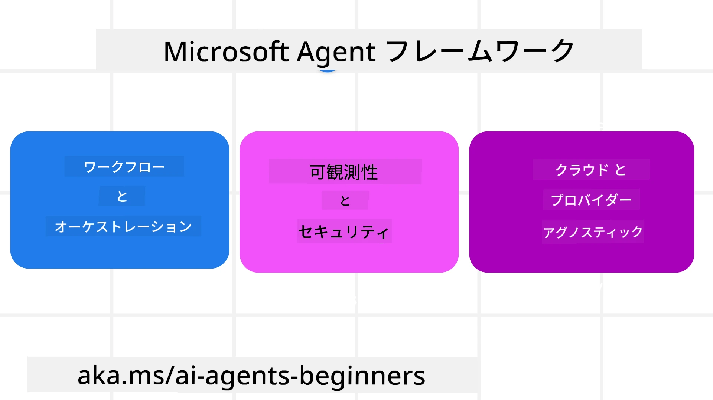
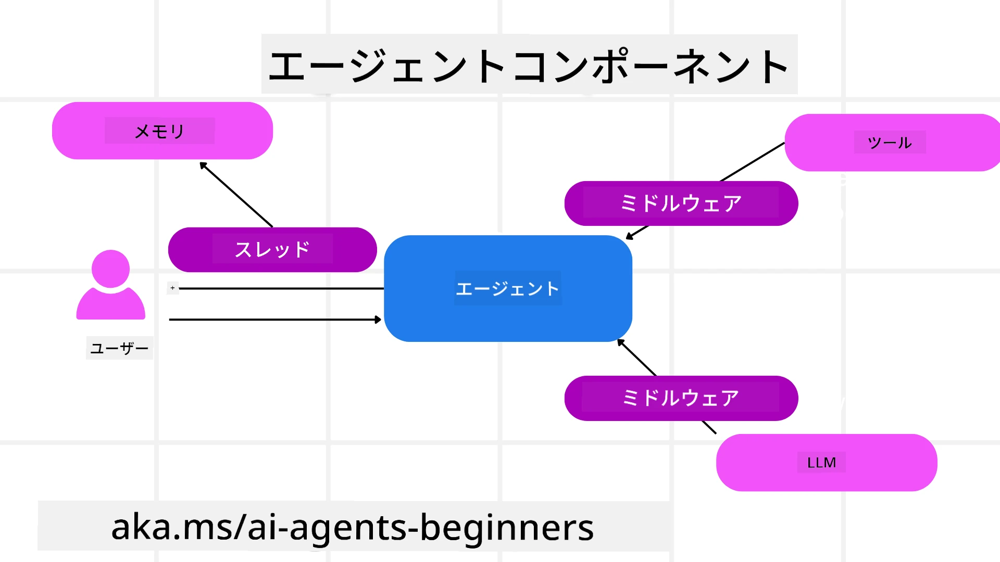

<!--
CO_OP_TRANSLATOR_METADATA:
{
  "original_hash": "19c4dab375acbc733855cc7f2f04edbc",
  "translation_date": "2025-10-02T06:04:55+00:00",
  "source_file": "14-microsoft-agent-framework/README.md",
  "language_code": "ja"
}
-->
# Microsoft Agent Framework を探る


### はじめに

このレッスンでは以下を学びます：

- Microsoft Agent Framework の理解：主な特徴と価値  
- Microsoft Agent Framework の主要な概念を探る
- MAF と Semantic Kernel および AutoGen の比較：移行ガイド

## 学習目標

このレッスンを完了すると、以下ができるようになります：

- Microsoft Agent Framework を使用して、実運用向けの AI エージェントを構築する
- Microsoft Agent Framework の主要な機能をエージェントユースケースに適用する
- 既存のエージェントフレームワークやツールを移行・統合する  

## コードサンプル

[Microsoft Agent Framework (MAF)](https://aka.ms/ai-agents-beginners/agent-framewrok) のコードサンプルは、このリポジトリ内の `xx-python-agent-framework` および `xx-dotnet-agent-framework` ファイルにあります。

## Microsoft Agent Framework の理解



[Microsoft Agent Framework (MAF)](https://aka.ms/ai-agents-beginners/agent-framewrok) は、Semantic Kernel や AutoGen から得た経験と知見を基に構築されています。これにより、以下のような実運用および研究環境で見られる多様なエージェントユースケースに対応する柔軟性を提供します：

- **順次エージェントオーケストレーション**：ステップバイステップのワークフローが必要なシナリオ。
- **並列オーケストレーション**：エージェントが同時にタスクを完了する必要があるシナリオ。
- **グループチャットオーケストレーション**：エージェントが1つのタスクに協力して取り組むシナリオ。
- **ハンドオフオーケストレーション**：エージェントがサブタスクを完了するごとにタスクを引き継ぐシナリオ。
- **マグネティックオーケストレーション**：管理エージェントがタスクリストを作成・修正し、サブエージェントの調整を行うシナリオ。

実運用で AI エージェントを提供するために、MAF には以下の機能も含まれています：

- **可観測性**：OpenTelemetry を使用して、ツール呼び出し、オーケストレーションステップ、推論フロー、Azure AI Foundry ダッシュボードを通じたパフォーマンス監視など、AI エージェントのすべてのアクションを追跡。
- **セキュリティ**：Azure AI Foundry 上でエージェントをネイティブにホストし、ロールベースのアクセス制御、プライベートデータの取り扱い、組み込みのコンテンツセーフティなどのセキュリティコントロールを提供。
- **耐久性**：エージェントスレッドやワークフローが一時停止、再開、エラーからの復旧が可能で、長時間のプロセスをサポート。
- **制御**：タスクが人間の承認を必要とする場合に対応する「人間が介入するワークフロー」をサポート。

Microsoft Agent Framework は、以下の点で相互運用性にも重点を置いています：

- **クラウド非依存**：エージェントはコンテナ、オンプレミス、複数の異なるクラウド上で実行可能。
- **プロバイダー非依存**：Azure OpenAI や OpenAI を含むお好みの SDK を使用してエージェントを作成可能。
- **オープンスタンダードの統合**：Agent-to-Agent (A2A) や Model Context Protocol (MCP) などのプロトコルを利用して、他のエージェントやツールを発見・利用可能。
- **プラグインとコネクタ**：Microsoft Fabric、SharePoint、Pinecone、Qdrant などのデータおよびメモリサービスへの接続が可能。

これらの機能が Microsoft Agent Framework の主要な概念にどのように適用されるかを見ていきましょう。

## Microsoft Agent Framework の主要な概念

### エージェント



**エージェントの作成**

エージェントの作成は、推論サービス（LLM プロバイダー）、AI エージェントが従うべき一連の指示、および割り当てられた `name` を定義することで行います：

```python
agent = AzureOpenAIChatClient(credential=AzureCliCredential()).create_agent( instructions="You are good at recommending trips to customers based on their preferences.", name="TripRecommender" )
```

上記は `Azure OpenAI` を使用していますが、エージェントは `Azure AI Foundry Agent Service` を含むさまざまなサービスを使用して作成できます：

```python
AzureAIAgentClient(async_credential=credential).create_agent( name="HelperAgent", instructions="You are a helpful assistant." ) as agent
```

OpenAI の `Responses`、`ChatCompletion` API

```python
agent = OpenAIResponsesClient().create_agent( name="WeatherBot", instructions="You are a helpful weather assistant.", )
```

```python
agent = OpenAIChatClient().create_agent( name="HelpfulAssistant", instructions="You are a helpful assistant.", )
```

または A2A プロトコルを使用したリモートエージェント：

```python
agent = A2AAgent( name=agent_card.name, description=agent_card.description, agent_card=agent_card, url="https://your-a2a-agent-host" )
```

**エージェントの実行**

エージェントは、非ストリーミングまたはストリーミング応答のいずれかに対して `.run` または `.run_stream` メソッドを使用して実行されます。

```python
result = await agent.run("What are good places to visit in Amsterdam?")
print(result.text)
```

```python
async for update in agent.run_stream("What are the good places to visit in Amsterdam?"):
    if update.text:
        print(update.text, end="", flush=True)

```

各エージェント実行では、`max_tokens`（エージェントが使用するトークンの最大数）、エージェントが呼び出せる `tools`、さらにはエージェントが使用する `model` などのパラメータをカスタマイズするオプションもあります。

これは、特定のモデルやツールがユーザーのタスクを完了するために必要な場合に役立ちます。

**ツール**

ツールは、エージェントを定義する際に定義することも：

```python
def get_attractions( location: Annotated[str, Field(description="The location to get the top tourist attractions for")], ) -> str: """Get the top tourist attractions for a given location.""" return f"The top attractions for {location} are." 


# When creating a ChatAgent directly 

agent = ChatAgent( chat_client=OpenAIChatClient(), instructions="You are a helpful assistant", tools=[get_attractions]

```

エージェントを実行する際に定義することも可能です：

```python

result1 = await agent.run( "What's the best place to visit in Seattle?", tools=[get_attractions] # Tool provided for this run only )
```

**エージェントスレッド**

エージェントスレッドは、マルチターンの会話を処理するために使用されます。スレッドは以下の方法で作成できます：

- `get_new_thread()` を使用してスレッドを作成し、時間をかけて保存する。
- エージェントを実行する際にスレッドを自動的に作成し、現在の実行中のみスレッドを保持する。

スレッドを作成するコードは以下のようになります：

```python
# Create a new thread. 
thread = agent.get_new_thread() # Run the agent with the thread. 
response = await agent.run("Hello, I am here to help you book travel. Where would you like to go?", thread=thread)

```

その後、スレッドをシリアライズして後で使用するために保存できます：

```python
# Create a new thread. 
thread = agent.get_new_thread() 

# Run the agent with the thread. 

response = await agent.run("Hello, how are you?", thread=thread) 

# Serialize the thread for storage. 

serialized_thread = await thread.serialize() 

# Deserialize the thread state after loading from storage. 

resumed_thread = await agent.deserialize_thread(serialized_thread)
```

**エージェントミドルウェア**

エージェントは、ツールや LLM とやり取りしてユーザーのタスクを完了します。特定のシナリオでは、これらのやり取りの間に何かを実行したり追跡したりしたい場合があります。エージェントミドルウェアを使用すると、これを実現できます：

*関数ミドルウェア*

このミドルウェアは、エージェントと呼び出す関数/ツールの間でアクションを実行することを可能にします。例えば、関数呼び出しのログを記録したい場合に使用されます。

以下のコードでは、`next` が次のミドルウェアまたは実際の関数を呼び出すかどうかを定義します。

```python
async def logging_function_middleware(
    context: FunctionInvocationContext,
    next: Callable[[FunctionInvocationContext], Awaitable[None]],
) -> None:
    """Function middleware that logs function execution."""
    # Pre-processing: Log before function execution
    print(f"[Function] Calling {context.function.name}")

    # Continue to next middleware or function execution
    await next(context)

    # Post-processing: Log after function execution
    print(f"[Function] {context.function.name} completed")
```

*チャットミドルウェア*

このミドルウェアは、エージェントと LLM 間のリクエストの間でアクションを実行またはログ記録することを可能にします。

これには、AI サービスに送信される `messages` などの重要な情報が含まれます。

```python
async def logging_chat_middleware(
    context: ChatContext,
    next: Callable[[ChatContext], Awaitable[None]],
) -> None:
    """Chat middleware that logs AI interactions."""
    # Pre-processing: Log before AI call
    print(f"[Chat] Sending {len(context.messages)} messages to AI")

    # Continue to next middleware or AI service
    await next(context)

    # Post-processing: Log after AI response
    print("[Chat] AI response received")

```

**エージェントメモリ**

`Agentic Memory` レッスンで取り上げたように、メモリはエージェントが異なるコンテキストで動作するための重要な要素です。MAF では、いくつかの異なるタイプのメモリを提供しています：

*インメモリストレージ*

これは、アプリケーションの実行中にスレッドに保存されるメモリです。

```python
# Create a new thread. 
thread = agent.get_new_thread() # Run the agent with the thread. 
response = await agent.run("Hello, I am here to help you book travel. Where would you like to go?", thread=thread)
```

*永続的メッセージ*

これは、異なるセッション間で会話履歴を保存するために使用されるメモリです。`chat_message_store_factory` を使用して定義されます：

```python
from agent_framework import ChatMessageStore

# Create a custom message store
def create_message_store():
    return ChatMessageStore()

agent = ChatAgent(
    chat_client=OpenAIChatClient(),
    instructions="You are a Travel assistant.",
    chat_message_store_factory=create_message_store
)

```

*動的メモリ*

これは、エージェントが実行される前にコンテキストに追加されるメモリです。これらのメモリは、mem0 などの外部サービスに保存することができます：

```python
from agent_framework.mem0 import Mem0Provider

# Using Mem0 for advanced memory capabilities
memory_provider = Mem0Provider(
    api_key="your-mem0-api-key",
    user_id="user_123",
    application_id="my_app"
)

agent = ChatAgent(
    chat_client=OpenAIChatClient(),
    instructions="You are a helpful assistant with memory.",
    context_providers=memory_provider
)

```

**エージェントの可観測性**

可観測性は、信頼性が高く保守可能なエージェントシステムを構築するために重要です。MAF は OpenTelemetry と統合して、トレーシングやメーターを提供し、可観測性を向上させます。

```python
from agent_framework.observability import get_tracer, get_meter

tracer = get_tracer()
meter = get_meter()
with tracer.start_as_current_span("my_custom_span"):
    # do something
    pass
counter = meter.create_counter("my_custom_counter")
counter.add(1, {"key": "value"})
```

### ワークフロー

MAF は、タスクを完了するための事前定義されたステップを提供し、これらのステップに AI エージェントをコンポーネントとして含めることができます。

ワークフローは、制御フローを改善するためのさまざまなコンポーネントで構成されています。また、**マルチエージェントオーケストレーション**や**チェックポイント**を使用してワークフローの状態を保存することも可能です。

ワークフローの主要なコンポーネントは以下の通りです：

**エグゼキューター**

エグゼキューターは入力メッセージを受け取り、割り当てられたタスクを実行し、出力メッセージを生成します。これにより、ワークフローが大きなタスクの完了に向けて進行します。エグゼキューターは AI エージェントまたはカスタムロジックのいずれかです。

**エッジ**

エッジは、ワークフロー内のメッセージの流れを定義するために使用されます。以下の種類があります：

*直接エッジ* - エグゼキューター間のシンプルな1対1の接続：

```python
from agent_framework import WorkflowBuilder

builder = WorkflowBuilder()
builder.add_edge(source_executor, target_executor)
builder.set_start_executor(source_executor)
workflow = builder.build()
```

*条件付きエッジ* - 特定の条件が満たされた後にアクティブ化されます。例えば、ホテルの部屋が利用できない場合に他のオプションを提案するエグゼキューター。

*スイッチケースエッジ* - 定義された条件に基づいてメッセージを異なるエグゼキューターにルーティングします。例えば、旅行顧客が優先アクセスを持っている場合、そのタスクは別のワークフローで処理されます。

*ファンアウトエッジ* - 1つのメッセージを複数のターゲットに送信します。

*ファンインエッジ* - 異なるエグゼキューターからの複数のメッセージを収集し、1つのターゲットに送信します。

**イベント**

ワークフローの可観測性を向上させるために、MAF は以下のような実行に関する組み込みイベントを提供します：

- `WorkflowStartedEvent` - ワークフローの実行が開始される
- `WorkflowOutputEvent` - ワークフローが出力を生成する
- `WorkflowErrorEvent` - ワークフローがエラーに遭遇する
- `ExecutorInvokeEvent` - エグゼキューターが処理を開始する
- `ExecutorCompleteEvent` - エグゼキューターが処理を完了する
- `RequestInfoEvent` - リクエストが発行される

## 他のフレームワーク（Semantic Kernel および AutoGen）からの移行

### MAF と Semantic Kernel の違い

**エージェント作成の簡略化**

Semantic Kernel では、エージェントごとに Kernel インスタンスを作成する必要があります。MAF では、主要なプロバイダー用の拡張機能を使用することで、より簡略化されています。

```python
agent = AzureOpenAIChatClient(credential=AzureCliCredential()).create_agent( instructions="You are good at reccomending trips to customers based on their preferences.", name="TripRecommender" )
```

**エージェントスレッドの作成**

Semantic Kernel ではスレッドを手動で作成する必要があります。MAF では、エージェントに直接スレッドが割り当てられます。

```python
thread = agent.get_new_thread() # Run the agent with the thread. 
```

**ツールの登録**

Semantic Kernel では、ツールを Kernel に登録し、その Kernel をエージェントに渡します。MAF では、エージェント作成プロセス中にツールを直接登録します。

```python
agent = ChatAgent( chat_client=OpenAIChatClient(), instructions="You are a helpful assistant", tools=[get_attractions]
```

### MAF と AutoGen の違い

**Teams と Workflows**

AutoGen では、エージェントによるイベント駆動型アクティビティのための構造として `Teams` を使用します。MAF では、データをエグゼキューターにルーティングするグラフベースのアーキテクチャである `Workflows` を使用します。

**ツール作成**

AutoGen では、エージェントが呼び出す関数をラップするために `FunctionTool` を使用します。MAF では、@ai_function を使用し、各関数のスキーマを自動的に推論します。

**エージェントの動作**

AutoGen では、デフォルトでエージェントはシングルターンエージェントですが、`max_tool_iterations` を高く設定することで変更可能です。MAF では、`ChatAgent` がデフォルトでマルチターンエージェントであり、ユーザーのタスクが完了するまでツールを呼び出し続けます。

## コードサンプル

Microsoft Agent Framework のコードサンプルは、このリポジトリ内の `xx-python-agent-framework` および `xx-dotnet-agent-framework` ファイルにあります。

## Microsoft Agent Framework に関する質問はありますか？

[Azure AI Foundry Discord](https://aka.ms/ai-agents/discord) に参加して、他の学習者と交流したり、オフィスアワーに参加したり、AI エージェントに関する質問に答えてもらいましょう。

---

**免責事項**:  
この文書は、AI翻訳サービス[Co-op Translator](https://github.com/Azure/co-op-translator)を使用して翻訳されています。正確性を追求しておりますが、自動翻訳には誤りや不正確な部分が含まれる可能性があります。元の言語で記載された文書を正式な情報源としてお考えください。重要な情報については、専門の人間による翻訳を推奨します。この翻訳の使用に起因する誤解や誤解釈について、当方は一切の責任を負いません。