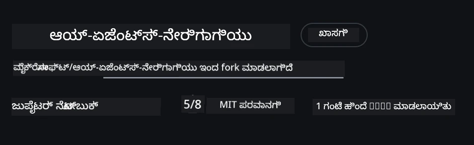
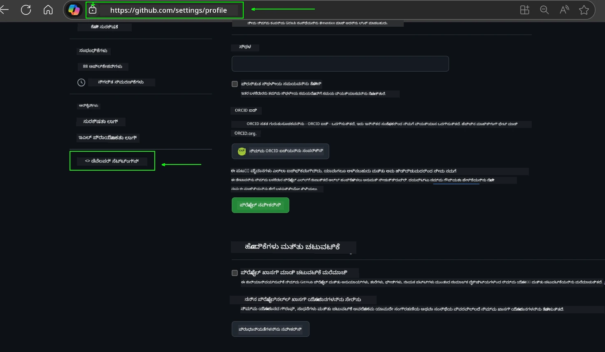
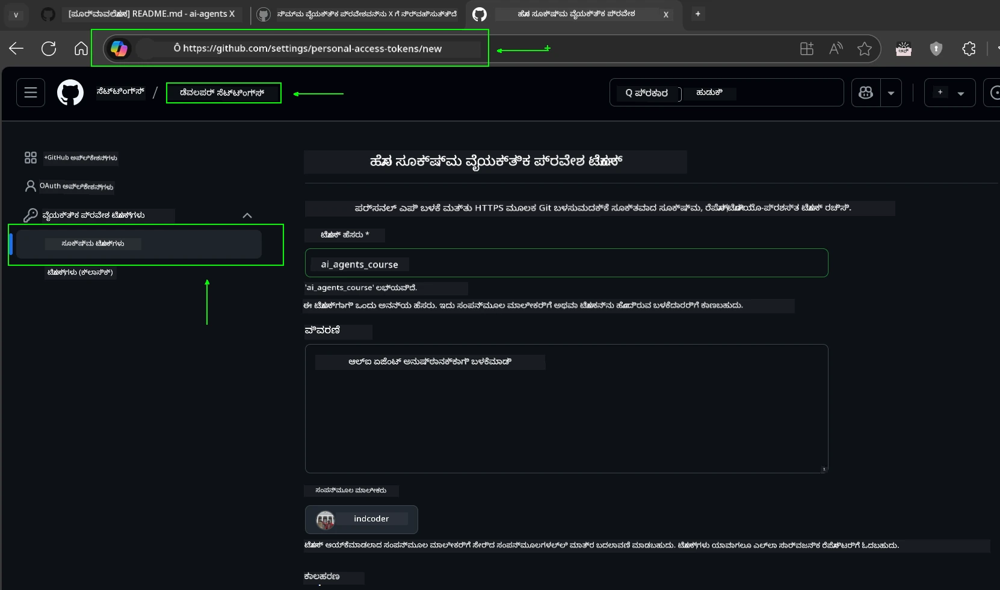
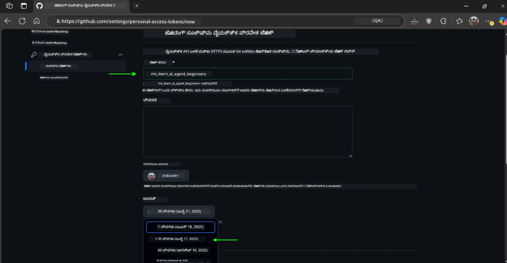
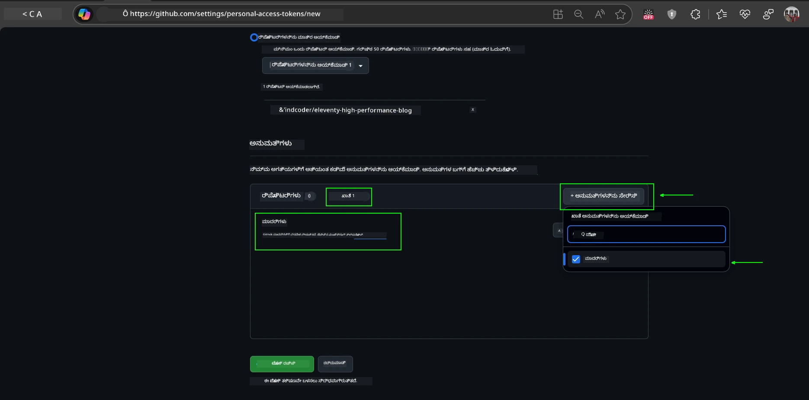
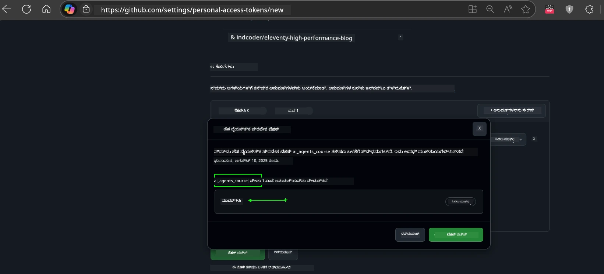
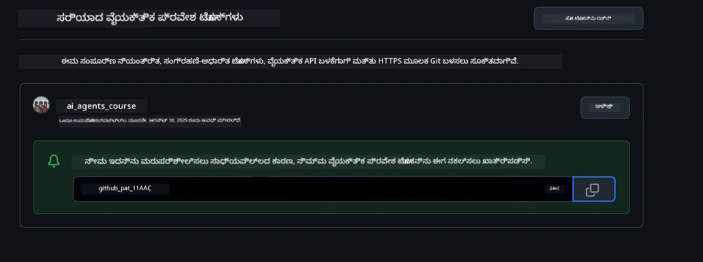
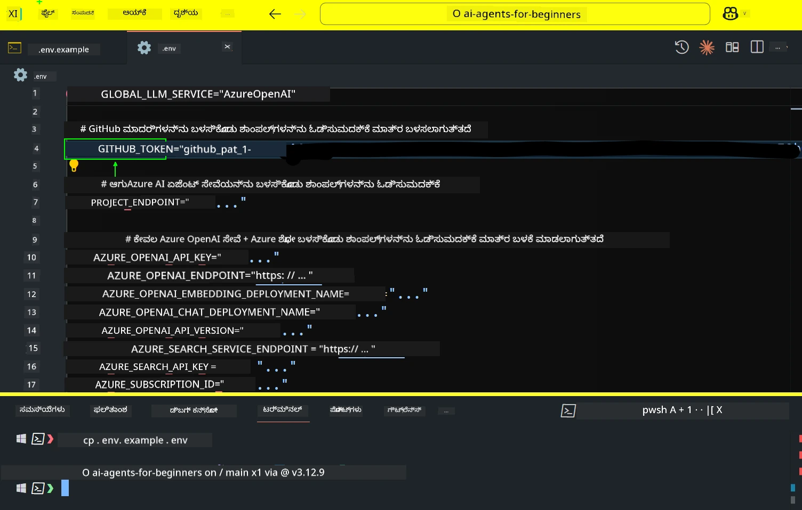
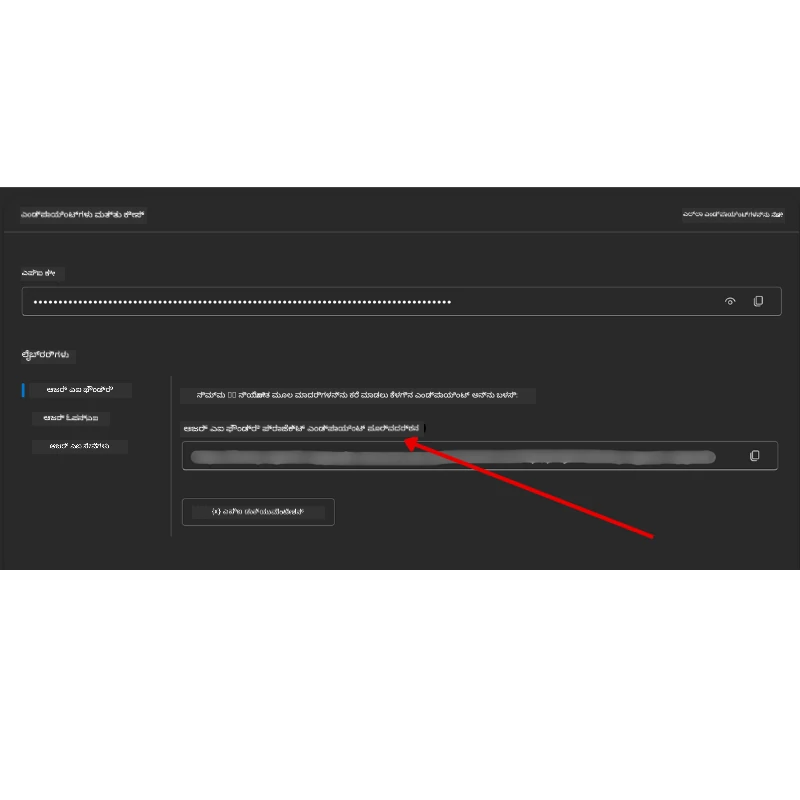

<!--
CO_OP_TRANSLATOR_METADATA:
{
  "original_hash": "63b1a8f6e840df15934935b728e569f0",
  "translation_date": "2025-12-03T17:26:37+00:00",
  "source_file": "00-course-setup/README.md",
  "language_code": "kn"
}
-->
# ಕೋರ್ಸ್ ಸೆಟಪ್

## ಪರಿಚಯ

ಈ ಪಾಠದಲ್ಲಿ ಈ ಕೋರ್ಸ್‌ನ ಕೋಡ್ ಮಾದರಿಗಳನ್ನು ಹೇಗೆ ಚಲಾಯಿಸಬೇಕೆಂದು ವಿವರಿಸಲಾಗುತ್ತದೆ.

## ಇತರ ಕಲಿಯುವವರೊಂದಿಗೆ ಸೇರಿ ಮತ್ತು ಸಹಾಯ ಪಡೆಯಿರಿ

ನಿಮ್ಮ ರೆಪೊ ಕ್ಲೋನ್ ಮಾಡುವುದಕ್ಕೆ ಮುಂಚೆ, [AI Agents For Beginners Discord channel](https://aka.ms/ai-agents/discord) ಗೆ ಸೇರಿ. ಇಲ್ಲಿ ಸೆಟಪ್, ಕೋರ್ಸ್ ಸಂಬಂಧಿತ ಪ್ರಶ್ನೆಗಳು ಅಥವಾ ಇತರ ಕಲಿಯುವವರೊಂದಿಗೆ ಸಂಪರ್ಕಿಸಲು ಸಹಾಯ ಪಡೆಯಬಹುದು.

## ಈ ರೆಪೊ ಕ್ಲೋನ್ ಅಥವಾ ಫೋರ್ಕ್ ಮಾಡಿ

ಪ್ರಾರಂಭಿಸಲು, ದಯವಿಟ್ಟು GitHub Repository ಅನ್ನು ಕ್ಲೋನ್ ಅಥವಾ ಫೋರ್ಕ್ ಮಾಡಿ. ಇದು ಕೋರ್ಸ್ ಸಾಮಗ್ರಿಯ ನಿಮ್ಮದೇ ಆದ ಆವೃತ್ತಿಯನ್ನು ಸೃಷ್ಟಿಸುತ್ತದೆ, ಇದರಿಂದ ನೀವು ಕೋಡ್ ಅನ್ನು ಚಲಾಯಿಸಲು, ಪರೀಕ್ಷಿಸಲು ಮತ್ತು ತಿದ್ದುಪಡಿ ಮಾಡಲು ಸಾಧ್ಯವಾಗುತ್ತದೆ!

ಇದನ್ನು ಮಾಡಲು, <a href="https://github.com/microsoft/ai-agents-for-beginners/fork" target="_blank">ರೆಪೊ ಫೋರ್ಕ್ ಮಾಡಲು</a> ಲಿಂಕ್ ಕ್ಲಿಕ್ ಮಾಡಿ.

ಈಗ ನೀವು ಈ ಕೋರ್ಸ್‌ನ ನಿಮ್ಮದೇ ಆದ ಫೋರ್ಕ್ ಮಾಡಿದ ಆವೃತ್ತಿಯನ್ನು ಈ ಕೆಳಗಿನ ಲಿಂಕ್‌ನಲ್ಲಿ ಹೊಂದಿರುತ್ತೀರಿ:



### ಶಾಲೋ ಕ್ಲೋನ್ (ವರ್ಕ್‌ಶಾಪ್ / ಕೋಡ್ಸ್‌ಪೇಸ್ಗಳಿಗೆ ಶಿಫಾರಸು)

  > ಸಂಪೂರ್ಣ ರೆಪೊ (~3 GB) ಡೌನ್‌ಲೋಡ್ ಮಾಡಿದಾಗ ದೊಡ್ಡದಾಗಿರಬಹುದು. ನೀವು ವರ್ಕ್‌ಶಾಪ್‌ಗೆ ಮಾತ್ರ ಹಾಜರಾಗುತ್ತಿದ್ದರೆ ಅಥವಾ ಕೆಲವು ಪಾಠ ಫೋಲ್ಡರ್‌ಗಳಿಗೆ ಮಾತ್ರ ಅಗತ್ಯವಿದ್ದರೆ, ಶಾಲೋ ಕ್ಲೋನ್ ಅಥವಾ ಸ್ಪಾರ್ಸ್ ಕ್ಲೋನ್ ಇತಿಹಾಸವನ್ನು ಕಡಿತಗೊಳಿಸುವ ಮೂಲಕ ಹೆಚ್ಚಿನ ಡೌನ್‌ಲೋಡ್ ಅನ್ನು ತಪ್ಪಿಸುತ್ತದೆ.

#### ಶೀಘ್ರ ಶಾಲೋ ಕ್ಲೋನ್ — ಕನಿಷ್ಠ ಇತಿಹಾಸ, ಎಲ್ಲಾ ಫೈಲ್‌ಗಳು

ಕೆಳಗಿನ ಆಜ್ಞೆಗಳಲ್ಲಿ `<your-username>` ಅನ್ನು ನಿಮ್ಮ ಫೋರ್ಕ್ URL (ಅಥವಾ ನೀವು ಇಚ್ಛಿಸಿದರೆ ಅಪ್‌ಸ್ಟ್ರೀಮ್ URL) ನೊಂದಿಗೆ ಬದಲಾಯಿಸಿ.

ಇತ್ತೀಚಿನ ಕಮಿಟ್ ಇತಿಹಾಸವನ್ನು ಮಾತ್ರ ಕ್ಲೋನ್ ಮಾಡಲು (ಕಡಿಮೆ ಡೌನ್‌ಲೋಡ್):

```bash|powershell
git clone --depth 1 https://github.com/<your-username>/ai-agents-for-beginners.git
```

ನಿರ್ದಿಷ್ಟ ಶಾಖೆಯನ್ನು ಕ್ಲೋನ್ ಮಾಡಲು:

```bash|powershell
git clone --depth 1 --branch <branch-name> https://github.com/<your-username>/ai-agents-for-beginners.git
```

#### ಭಾಗಶಃ (ಸ್ಪಾರ್ಸ್) ಕ್ಲೋನ್ — ಕನಿಷ್ಠ ಬ್ಲಾಬ್‌ಗಳು + ಆಯ್ದ ಫೋಲ್ಡರ್‌ಗಳು ಮಾತ್ರ

ಇದು ಭಾಗಶಃ ಕ್ಲೋನ್ ಮತ್ತು ಸ್ಪಾರ್ಸ್-ಚೆಕ್‌ಔಟ್ ಅನ್ನು ಬಳಸುತ್ತದೆ (Git 2.25+ ಅಗತ್ಯವಿದೆ ಮತ್ತು ಭಾಗಶಃ ಕ್ಲೋನ್ ಬೆಂಬಲದೊಂದಿಗೆ ಆಧುನಿಕ Git ಶಿಫಾರಸು ಮಾಡಲಾಗಿದೆ):

```bash|powershell
git clone --depth 1 --filter=blob:none --sparse https://github.com/<your-username>/ai-agents-for-beginners.git
```

ರೆಪೊ ಫೋಲ್ಡರ್‌ಗೆ ಪ್ರವೇಶಿಸಿ:

```bash|powershell
cd ai-agents-for-beginners
```

ನಂತರ ನೀವು ಯಾವ ಫೋಲ್ಡರ್‌ಗಳನ್ನು ಬಯಸುತ್ತೀರಿ ಎಂದು ನಿರ್ಧರಿಸಿ (ಕೆಳಗಿನ ಉದಾಹರಣೆ ಎರಡು ಫೋಲ್ಡರ್‌ಗಳನ್ನು ತೋರಿಸುತ್ತದೆ):

```bash|powershell
git sparse-checkout set 00-course-setup 01-intro-to-ai-agents
```

ಕ್ಲೋನ್ ಮಾಡಿದ ನಂತರ ಮತ್ತು ಫೈಲ್‌ಗಳನ್ನು ಪರಿಶೀಲಿಸಿದ ನಂತರ, ನೀವು ಫೈಲ್‌ಗಳನ್ನು ಮಾತ್ರ ಬಯಸಿದರೆ ಮತ್ತು ಸ್ಥಳವನ್ನು ಮುಕ್ತಗೊಳಿಸಲು ಬಯಸಿದರೆ (ಯಾವುದೇ Git ಇತಿಹಾಸವಿಲ್ಲ), ದಯವಿಟ್ಟು ರೆಪೊ ಮೆಟಾಡೇಟಾವನ್ನು ಅಳಿಸಿ (💀ಅಪರಿವರ್ತನೀಯ — ನೀವು ಎಲ್ಲಾ Git ಕಾರ್ಯಕ್ಷಮತೆಗಳನ್ನು ಕಳೆದುಕೊಳ್ಳುತ್ತೀರಿ: ಯಾವುದೇ ಕಮಿಟ್‌ಗಳು, ಪುಲ್‌ಗಳು, ಪುಶ್‌ಗಳು ಅಥವಾ ಇತಿಹಾಸ ಪ್ರವೇಶ).

```bash
# zsh/bash
rm -rf .git
```

```powershell
# ಪವರ್‌ಶೆಲ್
Remove-Item -Recurse -Force .git
```

#### GitHub Codespaces ಬಳಸಿ (ಸ್ಥಳೀಯ ದೊಡ್ಡ ಡೌನ್‌ಲೋಡ್‌ಗಳನ್ನು ತಪ್ಪಿಸಲು ಶಿಫಾರಸು)

- [GitHub UI](https://github.com/codespaces) ಮೂಲಕ ಈ ರೆಪೊಗೆ ಹೊಸ Codespace ರಚಿಸಿ.  

- ಹೊಸದಾಗಿ ರಚಿಸಿದ ಕೋಡ್ಸ್‌ಪೇಸ್‌ನ ಟರ್ಮಿನಲ್‌ನಲ್ಲಿ, ಕೋಡ್ಸ್‌ಪೇಸ್ ವರ್ಕ್‌ಸ್ಪೇಸ್‌ಗೆ ನೀವು ಬಯಸುವ ಪಾಠ ಫೋಲ್ಡರ್‌ಗಳನ್ನು ಮಾತ್ರ ತರಲು ಮೇಲಿನ ಶಾಲೋ/ಸ್ಪಾರ್ಸ್ ಕ್ಲೋನ್ ಆಜ್ಞೆಗಳಲ್ಲಿ ಒಂದನ್ನು ಚಲಾಯಿಸಿ.
- ಐಚ್ಛಿಕ: Codespaces ಒಳಗೆ ಕ್ಲೋನ್ ಮಾಡಿದ ನಂತರ, .git ಅನ್ನು ಅಳಿಸಿ ಹೆಚ್ಚುವರಿ ಸ್ಥಳವನ್ನು ಪುನಃ ಪಡೆಯಿರಿ (ಮೇಲಿನ ಅಳಿಸುವ ಆಜ್ಞೆಗಳನ್ನು ನೋಡಿ).
- ಟಿಪ್ಪಣಿ: ನೀವು ರೆಪೊವನ್ನು ನೇರವಾಗಿ Codespaces ನಲ್ಲಿ ತೆರೆಯಲು ಇಚ್ಛಿಸಿದರೆ (ಹೆಚ್ಚುವರಿ ಕ್ಲೋನ್ ಇಲ್ಲದೆ), Codespaces ಡೆವ್‌ಕಂಟೈನರ್ ಪರಿಸರವನ್ನು ನಿರ್ಮಿಸುತ್ತದೆ ಮತ್ತು ನಿಮಗೆ ಅಗತ್ಯವಿರುವುದಕ್ಕಿಂತ ಹೆಚ್ಚು ಒದಗಿಸಬಹುದು. ಹೊಸ Codespace ಒಳಗೆ ಶಾಲೋ ಪ್ರತಿಯನ್ನು ಕ್ಲೋನ್ ಮಾಡುವುದು ಡಿಸ್ಕ್ ಬಳಕೆಯನ್ನು ನಿಯಂತ್ರಿಸಲು ನಿಮಗೆ ಹೆಚ್ಚು ನಿಯಂತ್ರಣವನ್ನು ನೀಡುತ್ತದೆ.

#### ಸಲಹೆಗಳು

- ನೀವು ಸಂಪಾದಿಸಲು/ಕಮಿಟ್ ಮಾಡಲು ಬಯಸಿದರೆ ಯಾವಾಗಲೂ ಕ್ಲೋನ್ URL ಅನ್ನು ನಿಮ್ಮ ಫೋರ್ಕ್‌ನೊಂದಿಗೆ ಬದಲಾಯಿಸಿ.
- ನೀವು ನಂತರ ಹೆಚ್ಚು ಇತಿಹಾಸ ಅಥವಾ ಫೈಲ್‌ಗಳನ್ನು ಅಗತ್ಯವಿದ್ದರೆ, ನೀವು ಅವುಗಳನ್ನು ಫೆಚ್ ಮಾಡಬಹುದು ಅಥವಾ ಸ್ಪಾರ್ಸ್-ಚೆಕ್‌ಔಟ್ ಅನ್ನು ಹೆಚ್ಚುವರಿ ಫೋಲ್ಡರ್‌ಗಳನ್ನು ಸೇರಿಸಲು ಹೊಂದಿಸಬಹುದು.

## ಕೋಡ್ ಚಲಾಯಿಸುವುದು

ಈ ಕೋರ್ಸ್ Jupyter Notebooks ಸರಣಿಯನ್ನು ಒದಗಿಸುತ್ತದೆ, ಇದನ್ನು ನೀವು AI ಏಜೆಂಟ್‌ಗಳನ್ನು ನಿರ್ಮಿಸಲು ಅನುಭವಿಸಲು ಚಲಾಯಿಸಬಹುದು.

ಕೋಡ್ ಮಾದರಿಗಳು ಈ ಕೆಳಗಿನವುಗಳನ್ನು ಬಳಸುತ್ತವೆ:

**GitHub ಖಾತೆ ಅಗತ್ಯವಿದೆ - ಉಚಿತ**:

1) Semantic Kernel Agent Framework + GitHub Models Marketplace. (semantic-kernel.ipynb) ಎಂದು ಲೇಬಲ್ ಮಾಡಲಾಗಿದೆ.
2) AutoGen Framework + GitHub Models Marketplace. (autogen.ipynb) ಎಂದು ಲೇಬಲ್ ಮಾಡಲಾಗಿದೆ.

**Azure ಚಂದಾದಾರಿಕೆ ಅಗತ್ಯವಿದೆ**:

3) Azure AI Foundry + Azure AI Agent Service. (azureaiagent.ipynb) ಎಂದು ಲೇಬಲ್ ಮಾಡಲಾಗಿದೆ.

ನಾವು ಈ ಮೂರು ಮಾದರಿಗಳನ್ನೂ ಪ್ರಯತ್ನಿಸಲು ನಿಮಗೆ ಪ್ರೋತ್ಸಾಹಿಸುತ್ತೇವೆ, ಯಾವುದು ನಿಮಗೆ ಉತ್ತಮವಾಗಿ ಕೆಲಸ ಮಾಡುತ್ತದೆ ಎಂದು ನೋಡಲು.

ನೀವು ಯಾವ ಆಯ್ಕೆಯನ್ನು ಆಯ್ಕೆ ಮಾಡುತ್ತೀರಿ, ಅದು ನೀವು ಕೆಳಗಿನ ಸೆಟಪ್ ಹಂತಗಳನ್ನು ಅನುಸರಿಸಬೇಕಾದುದನ್ನು ನಿರ್ಧರಿಸುತ್ತದೆ:

## ಅಗತ್ಯಗಳು

- Python 3.12+
  - **NOTE**: ನೀವು Python3.12 ಅನ್ನು ಸ್ಥಾಪಿಸಿಲ್ಲದಿದ್ದರೆ, ಅದನ್ನು ಸ್ಥಾಪಿಸಿ. ನಂತರ requirements.txt ಫೈಲ್‌ನಿಂದ ಸರಿಯಾದ ಆವೃತ್ತಿಗಳನ್ನು ಸ್ಥಾಪಿಸಲು python3.12 ಬಳಸಿ ನಿಮ್ಮ venv ಅನ್ನು ರಚಿಸಿ.
  
    >ಉದಾಹರಣೆ

    Python venv ಡೈರೆಕ್ಟರಿಯನ್ನು ರಚಿಸಿ:

    ```bash|powershell
    python -m venv venv
    ```

    ನಂತರ venv ಪರಿಸರವನ್ನು ಸಕ್ರಿಯಗೊಳಿಸಿ:

    ```bash
    # zsh/bash
    source venv/bin/activate
    ```
  
    ```dos
    # Command Prompt for Windows
    venv\Scripts\activate
    ```

- .NET 10+: .NET ಬಳಸುವ ಮಾದರಿ ಕೋಡ್‌ಗಳಿಗೆ, ದಯವಿಟ್ಟು [.NET 10 SDK](https://dotnet.microsoft.com/download/dotnet/10.0) ಅಥವಾ ನಂತರದ ಆವೃತ್ತಿಯನ್ನು ಸ್ಥಾಪಿಸಿ. ನಂತರ, ನಿಮ್ಮ ಸ್ಥಾಪಿತ .NET SDK ಆವೃತ್ತಿಯನ್ನು ಪರಿಶೀಲಿಸಿ:

    ```bash|powershell
    dotnet --list-sdks
    ```

- GitHub ಖಾತೆ - GitHub Models Marketplace ಗೆ ಪ್ರವೇಶಕ್ಕಾಗಿ
- Azure ಚಂದಾದಾರಿಕೆ - Azure AI Foundry ಗೆ ಪ್ರವೇಶಕ್ಕಾಗಿ
- Azure AI Foundry ಖಾತೆ - Azure AI Agent Service ಗೆ ಪ್ರವೇಶಕ್ಕಾಗಿ

ನಾವು ಈ ರೆಪೊರ ಮೂಲದಲ್ಲಿ `requirements.txt` ಫೈಲ್ ಅನ್ನು ಸೇರಿಸಿದ್ದೇವೆ, ಇದು ಕೋಡ್ ಮಾದರಿಗಳನ್ನು ಚಲಾಯಿಸಲು ಅಗತ್ಯವಿರುವ ಎಲ್ಲಾ Python ಪ್ಯಾಕೇಜ್‌ಗಳನ್ನು ಒಳಗೊಂಡಿದೆ.

ನೀವು ಈ ಆಜ್ಞೆಯನ್ನು ರೆಪೊರ ಮೂಲದಲ್ಲಿ ನಿಮ್ಮ ಟರ್ಮಿನಲ್‌ನಲ್ಲಿ ಚಲಾಯಿಸುವ ಮೂಲಕ ಅವುಗಳನ್ನು ಸ್ಥಾಪಿಸಬಹುದು:

```bash|powershell
pip install -r requirements.txt
```

ಯಾವುದೇ ಗೊಂದಲಗಳು ಮತ್ತು ಸಮಸ್ಯೆಗಳನ್ನು ತಪ್ಪಿಸಲು Python ವರ್ಚುವಲ್ ಪರಿಸರವನ್ನು ರಚಿಸಲು ನಾವು ಶಿಫಾರಸು ಮಾಡುತ್ತೇವೆ.

## VSCode ಸೆಟಪ್ ಮಾಡಿ

VSCode ನಲ್ಲಿ ನೀವು ಸರಿಯಾದ Python ಆವೃತ್ತಿಯನ್ನು ಬಳಸುತ್ತಿದ್ದೀರಿ ಎಂದು ಖಚಿತಪಡಿಸಿಕೊಳ್ಳಿ.


## GitHub Models ಬಳಸಿ ಮಾದರಿಗಳ ಸೆಟಪ್

### ಹಂತ 1: ನಿಮ್ಮ GitHub Personal Access Token (PAT) ಪಡೆಯಿರಿ

ಈ ಕೋರ್ಸ್ GitHub Models Marketplace ಅನ್ನು ಬಳಸುತ್ತದೆ, ಇದು ನಿಮಗೆ AI ಏಜೆಂಟ್‌ಗಳನ್ನು ನಿರ್ಮಿಸಲು ಬಳಸುವ ದೊಡ್ಡ ಭಾಷಾ ಮಾದರಿಗಳಿಗೆ (LLMs) ಉಚಿತ ಪ್ರವೇಶವನ್ನು ಒದಗಿಸುತ್ತದೆ.

GitHub Models ಬಳಸಲು, ನೀವು [GitHub Personal Access Token](https://docs.github.com/en/authentication/keeping-your-account-and-data-secure/managing-your-personal-access-tokens) ರಚಿಸಬೇಕಾಗುತ್ತದೆ.

ಇದು ನಿಮ್ಮ GitHub ಖಾತೆಯ <a href="https://github.com/settings/personal-access-tokens" target="_blank">Personal Access Tokens settings</a> ಗೆ ಹೋಗುವ ಮೂಲಕ ಮಾಡಬಹುದು.

ದಯವಿಟ್ಟು ನಿಮ್ಮ ಟೋಕನ್ ರಚಿಸುವಾಗ [Principle of Least Privilege](https://docs.github.com/en/get-started/learning-to-code/storing-your-secrets-safely) ಅನ್ನು ಅನುಸರಿಸಿ. ಇದು ಈ ಕೋರ್ಸ್‌ನ ಕೋಡ್ ಮಾದರಿಗಳನ್ನು ಚಲಾಯಿಸಲು ಟೋಕನ್‌ಗೆ ಅಗತ್ಯವಿರುವ ಅನುಮತಿಗಳನ್ನು ಮಾತ್ರ ನೀಡಬೇಕು.

1. **Developer settings** ಗೆ ಹೋಗಿ, ಎಡಭಾಗದಲ್ಲಿ `Fine-grained tokens` ಆಯ್ಕೆಯನ್ನು ಆಯ್ಕೆಮಾಡಿ.

   

   ನಂತರ `Generate new token` ಆಯ್ಕೆಮಾಡಿ.

   

2. ನಿಮ್ಮ ಟೋಕನ್‌ಗೆ ವಿವರಣಾತ್ಮಕ ಹೆಸರನ್ನು ನಮೂದಿಸಿ, ಇದು ಅದರ ಉದ್ದೇಶವನ್ನು ಪ್ರತಿಬಿಂಬಿಸುತ್ತದೆ, ನಂತರದಲ್ಲಿ ಅದನ್ನು ಗುರುತಿಸಲು ಸುಲಭವಾಗುತ್ತದೆ.

    🔐 ಟೋಕನ್ ಅವಧಿ ಶಿಫಾರಸು

    ಶಿಫಾರಸು ಅವಧಿ: 30 ದಿನಗಳು
    ಹೆಚ್ಚು ಸುರಕ್ಷಿತ ಸ್ಥಿತಿಗೆ, ನೀವು 7 ದಿನಗಳಂತಹ ಕಡಿಮೆ ಅವಧಿಯನ್ನು ಆಯ್ಕೆ ಮಾಡಬಹುದು 🛡️
    ಇದು ನಿಮ್ಮ ವೈಯಕ್ತಿಕ ಗುರಿಯನ್ನು ಹೊಂದಿಸಲು ಮತ್ತು ನಿಮ್ಮ ಕಲಿಕೆಯ ವೇಗವನ್ನು ಉಳಿಸಿಕೊಂಡು ಕೋರ್ಸ್ ಅನ್ನು ಪೂರ್ಣಗೊಳಿಸಲು ಉತ್ತಮ ಮಾರ್ಗವಾಗಿದೆ 🚀.

    

3. ಟೋಕನ್‌ನ ವ್ಯಾಪ್ತಿಯನ್ನು ಈ ರೆಪೊ ಫೋರ್ಕ್‌ಗೆ ಮಾತ್ರ ಮಿತಿಗೊಳಿಸಿ.

    

4. ಟೋಕನ್‌ನ ಅನುಮತಿಗಳನ್ನು ನಿರ್ಬಂಧಿಸಿ: **Permissions** ಅಡಿಯಲ್ಲಿ, **Account** ಟ್ಯಾಬ್ ಕ್ಲಿಕ್ ಮಾಡಿ, ಮತ್ತು "+ Add permissions" ಬಟನ್ ಕ್ಲಿಕ್ ಮಾಡಿ. ಡ್ರಾಪ್‌ಡೌನ್ ಕಾಣಿಸುತ್ತದೆ. **Models** ಅನ್ನು ಹುಡುಕಿ ಮತ್ತು ಅದರ ಬಾಕ್ಸ್ ಅನ್ನು ಟಿಕ್ ಮಾಡಿ.

    

5. ಟೋಕನ್ ರಚಿಸುವ ಮೊದಲು ಅಗತ್ಯವಿರುವ ಅನುಮತಿಗಳನ್ನು ಪರಿಶೀಲಿಸಿ. 

6. ಟೋಕನ್ ರಚಿಸುವ ಮೊದಲು, ನೀವು ಟೋಕನ್ ಅನ್ನು ಪಾಸ್ವರ್ಡ್ ಮ್ಯಾನೇಜರ್ ವಾಲ್ಟ್‌ನಂತಹ ಸುರಕ್ಷಿತ ಸ್ಥಳದಲ್ಲಿ ಸಂಗ್ರಹಿಸಲು ಸಿದ್ಧರಾಗಿದ್ದೀರಿ ಎಂದು ಖಚಿತಪಡಿಸಿಕೊಳ್ಳಿ, ಏಕೆಂದರೆ ನೀವು ಅದನ್ನು ರಚಿಸಿದ ನಂತರ ಮತ್ತೆ ತೋರಿಸಲಾಗುವುದಿಲ್ಲ. 

ನೀವು ಈಗ ರಚಿಸಿದ ಹೊಸ ಟೋಕನ್ ಅನ್ನು ಪ್ರತಿಲಿಪಿ ಮಾಡಿ. ನೀವು ಈಗ ಈ ಕೋರ್ಸ್‌ನಲ್ಲಿ ಸೇರಿಸಿರುವ `.env` ಫೈಲ್‌ಗೆ ಇದನ್ನು ಸೇರಿಸುತ್ತೀರಿ.

### ಹಂತ 2: ನಿಮ್ಮ `.env` ಫೈಲ್ ರಚಿಸಿ

ನಿಮ್ಮ `.env` ಫೈಲ್ ರಚಿಸಲು ನಿಮ್ಮ ಟರ್ಮಿನಲ್‌ನಲ್ಲಿ ಈ ಆಜ್ಞೆಯನ್ನು ಚಲಾಯಿಸಿ.

```bash
# ಝೆಡ್‌ಎಸ್‌ಎಚ್/ಬ್ಯಾಶ್
cp .env.example .env
```

```powershell
# ಪವರ್‌ಶೆಲ್
Copy-Item .env.example .env
```

ಇದು ಉದಾಹರಣೆ ಫೈಲ್ ಅನ್ನು ಪ್ರತಿಲಿಪಿ ಮಾಡುತ್ತದೆ ಮತ್ತು `.env` ಅನ್ನು ನಿಮ್ಮ ಡೈರೆಕ್ಟರಿಯಲ್ಲಿ ರಚಿಸುತ್ತದೆ, ಮತ್ತು ನೀವು ಪರಿಸರ ಚರಾಂಶಗಳ ಮೌಲ್ಯಗಳನ್ನು ತುಂಬುತ್ತೀರಿ.

ನಿಮ್ಮ ಟೋಕನ್ ಅನ್ನು ಪ್ರತಿಲಿಪಿ ಮಾಡಿ, `.env` ಫೈಲ್ ಅನ್ನು ನಿಮ್ಮ ಮೆಚ್ಚಿನ ಪಠ್ಯ ಸಂಪಾದಕದಲ್ಲಿ ತೆರೆಯಿರಿ ಮತ್ತು ನಿಮ್ಮ ಟೋಕನ್ ಅನ್ನು `GITHUB_TOKEN` ಕ್ಷೇತ್ರದಲ್ಲಿ ಅಂಟಿಸಿ.



ಈಗ ನೀವು ಈ ಕೋರ್ಸ್‌ನ ಕೋಡ್ ಮಾದರಿಗಳನ್ನು ಚಲಾಯಿಸಲು ಸಿದ್ಧರಾಗಿದ್ದೀರಿ.

## Azure AI Foundry ಮತ್ತು Azure AI Agent Service ಬಳಸಿ ಮಾದರಿಗಳ ಸೆಟಪ್

### ಹಂತ 1: ನಿಮ್ಮ Azure ಪ್ರಾಜೆಕ್ಟ್ ಎಂಡ್‌ಪಾಯಿಂಟ್ ಪಡೆಯಿರಿ

Azure AI Foundry ನಲ್ಲಿ ಹಬ್ ಮತ್ತು ಪ್ರಾಜೆಕ್ಟ್ ರಚಿಸುವ ಹಂತಗಳನ್ನು ಇಲ್ಲಿ ಅನುಸರಿಸಿ: [Hub resources overview](https://learn.microsoft.com/azure/ai-foundry/concepts/ai-resources)

ನೀವು ನಿಮ್ಮ ಪ್ರಾಜೆಕ್ಟ್ ಅನ್ನು ರಚಿಸಿದ ನಂತರ, ನಿಮ್ಮ ಪ್ರಾಜೆಕ್ಟ್‌ಗೆ ಸಂಪರ್ಕ ಸ್ಟ್ರಿಂಗ್ ಅನ್ನು ಪಡೆಯಬೇಕಾಗುತ್ತದೆ.

ಇದು Azure AI Foundry ಪೋರ್ಟಲ್‌ನಲ್ಲಿ ನಿಮ್ಮ ಪ್ರಾಜೆಕ್ಟ್‌ನ **Overview** ಪುಟಕ್ಕೆ ಹೋಗುವ ಮೂಲಕ ಮಾಡಬಹುದು.



### ಹಂತ 2: ನಿಮ್ಮ `.env` ಫೈಲ್ ರಚಿಸಿ

ನಿಮ್ಮ `.env` ಫೈಲ್ ರಚಿಸಲು ನಿಮ್ಮ ಟರ್ಮಿನಲ್‌ನಲ್ಲಿ ಈ ಆಜ್ಞೆಯನ್ನು ಚಲಾಯಿಸಿ.

```bash
# zsh/bash
cp .env.example .env
```

```powershell
# ಪವರ್‌ಶೆಲ್
Copy-Item .env.example .env
```

ಇದು ಉದಾಹರಣೆ ಫೈಲ್ ಅನ್ನು ಪ್ರತಿಲಿಪಿ ಮಾಡುತ್ತದೆ ಮತ್ತು `.env` ಅನ್ನು ನಿಮ್ಮ ಡೈರೆಕ್ಟರಿಯಲ್ಲಿ ರಚಿಸುತ್ತದೆ, ಮತ್ತು ನೀವು ಪರಿಸರ ಚರಾಂಶಗಳ ಮೌಲ್ಯಗಳನ್ನು ತುಂಬುತ್ತೀರಿ.

ನಿಮ್ಮ ಟೋಕನ್ ಅನ್ನು ಪ್ರತಿಲಿಪಿ ಮಾಡಿ, `.env` ಫೈಲ್ ಅನ್ನು ನಿಮ್ಮ ಮೆಚ್ಚಿನ ಪಠ್ಯ ಸಂಪಾದಕದಲ್ಲಿ ತೆರೆಯಿರಿ ಮತ್ತು ನಿಮ್ಮ ಟೋಕನ್ ಅನ್ನು `PROJECT_ENDPOINT` ಕ್ಷೇತ್ರದಲ್ಲಿ ಅಂಟಿಸಿ.

### ಹಂತ 3: Azure ಗೆ ಸೈನ್ ಇನ್ ಮಾಡಿ

ಸುರಕ್ಷತಾ ಉತ್ತಮ ಅಭ್ಯಾಸವಾಗಿ, ನಾವು [keyless authentication](https://learn.microsoft.com/azure/developer/ai/keyless-connections?tabs=csharp%2Cazure-cli?WT.mc_id=academic-105485-koreyst) ಅನ್ನು ಬಳಸುತ್ತೇವೆ Microsoft Entra ID ಮೂಲಕ Azure OpenAI ಗೆ ದೃಢೀಕರಿಸಲು.

ಮುಂದೆ, ಟರ್ಮಿನಲ್ ತೆರೆಯಿರಿ ಮತ್ತು `az login --use-device-code` ಅನ್ನು ಚಲಾಯಿಸಿ ನಿಮ್ಮ Azure ಖಾತೆಗೆ ಸೈನ್ ಇನ್ ಮಾಡಲು.

ನೀವು ಲಾಗಿನ್ ಮಾಡಿದ ನಂತರ, ಟರ್ಮಿನಲ್‌ನಲ್ಲಿ ನಿಮ್ಮ ಚಂದಾದಾರಿಕೆಯನ್ನು ಆಯ್ಕೆಮಾಡಿ.

## ಹೆಚ್ಚುವರಿ ಪರಿಸರ ಚರಾಂಶಗಳು - Azure Search ಮತ್ತು Azure OpenAI 

Agentic RAG ಪಾಠ - ಪಾಠ 5 - ನಲ್ಲಿ Azure Search ಮತ್ತು Azure OpenAI ಬಳಸುವ ಮಾದರಿಗಳನ್ನು ಒಳಗೊಂಡಿರುತ್ತವೆ.

ನೀವು ಈ ಮಾದರಿಗಳನ್ನು ಚಲಾಯಿಸಲು ಬಯಸಿದರೆ, ನೀವು ಈ ಕೆಳಗಿನ ಪರಿಸರ ಚರಾಂಶಗಳನ್ನು ನಿಮ್ಮ `.env` ಫೈಲ್‌ಗೆ ಸೇರಿಸಬೇಕಾಗುತ್ತದೆ:

### Overview Page (Project)

- `AZURE_SUBSCRIPTION_ID` - ನಿಮ್ಮ ಪ್ರಾಜೆಕ್ಟ್‌ನ **Overview** ಪುಟದಲ್ಲಿ **Project details** ಅನ್ನು ಪರಿಶೀಲಿಸಿ.

- `AZURE_AI_PROJECT_NAME` - ನಿಮ್ಮ ಪ್ರಾಜೆಕ್ಟ್‌ನ **Overview** ಪುಟದ ಮೇಲ್ಭಾಗದಲ್ಲಿ ನೋಡಿ.

- `AZURE_OPENAI_SERVICE` - **Overview** ಪುಟದ **Included capabilities** ಟ್ಯಾಬ್‌ನಲ್ಲಿ **Azure OpenAI Service** ಅನ್ನು ಹುಡುಕಿ.

### Management Center

- `AZURE_OPENAI_RESOURCE_GROUP` - **Management Center** ನ **Overview** ಪುಟದ **Project properties** ಗೆ ಹೋಗಿ.

- `GLOBAL_LLM_SERVICE` - **Connected resources** ಅಡಿಯಲ್ಲಿ, **Azure AI Services** ಸಂಪರ್ಕ ಹೆಸರನ್ನು ಹುಡುಕಿ. ಪಟ್ಟಿ ಮಾಡದಿದ್ದರೆ, ನಿಮ್ಮ ರಿಸೋರ್ಸ್ ಗುಂಪಿನ ಅಡಿಯಲ್ಲಿ AI Services ರಿಸೋರ್ಸ್ ಹೆಸರಿಗಾಗಿ **Azure portal** ಅನ್ನು ಪರಿಶೀಲಿಸಿ.

### Models + Endpoints Page

- `AZURE_OPENAI_EMBEDDING_DEPLOYMENT_NAME` - ನಿಮ್ಮ ಎಂಬೆಡಿಂಗ್ ಮಾದರಿಯನ್ನು ಆಯ್ಕೆಮಾಡಿ (ಉದಾ., `text-embedding-ada-002`) ಮತ್ತು ಮಾದರಿ ವಿವರಗಳಿಂದ **Deployment name** ಅನ್ನು ಗಮನಿಸಿ.

- `AZURE_OPENAI_CHAT_DEPLOYMENT_NAME` - ನಿಮ್ಮ ಚಾಟ್ ಮಾದರಿಯನ್ನು ಆಯ್ಕೆಮಾಡಿ (ಉದಾ., `gpt-4o-mini`) ಮತ್ತು ಮಾದರಿ ವಿವರಗಳಿಂದ **Deployment name** ಅನ್ನು ಗಮನಿಸಿ.

### Azure Portal

- `AZURE_OPENAI_ENDPOINT` - **Azure AI services** ಅನ್ನು ಹುಡುಕಿ, ಅದನ್ನು ಕ್ಲಿಕ್ ಮಾಡಿ, ನಂತರ **Resource Management**, **Keys and Endpoint** ಗೆ ಹೋಗಿ, "Azure OpenAI endpoints" ಗೆ ಸ್ಕ್ರೋಲ್ ಮಾಡಿ, ಮತ್ತು "Language APIs" ಅನ್ನು ಪ್ರತಿಲಿಪಿ ಮಾಡಿ.

- `
ನೀವು ಈ ಸೆಟಪ್ ಅನ್ನು ರನ್ ಮಾಡುವಲ್ಲಿ ಯಾವುದೇ ಸಮಸ್ಯೆಗಳನ್ನು ಎದುರಿಸುತ್ತಿದ್ದರೆ, ನಮ್ಮ <a href="https://discord.gg/kzRShWzttr" target="_blank">Azure AI Community Discord</a> ಗೆ ಸೇರಿ ಅಥವಾ <a href="https://github.com/microsoft/ai-agents-for-beginners/issues?WT.mc_id=academic-105485-koreyst" target="_blank">ಒಂದು ಸಮಸ್ಯೆಯನ್ನು ರಚಿಸಿ</a>.

## ಮುಂದಿನ ಪಾಠ

ಈ ಕೋರ್ಸ್‌ನ ಕೋಡ್ ಅನ್ನು ರನ್ ಮಾಡಲು ನೀವು ಈಗ ಸಿದ್ಧರಾಗಿದ್ದೀರಿ. AI ಏಜೆಂಟ್‌ಗಳ ಜಗತ್ತಿನ ಬಗ್ಗೆ ಹೆಚ್ಚು ಕಲಿಯಲು ಶುಭಾಶಯಗಳು!

[AI ಏಜೆಂಟ್‌ಗಳು ಮತ್ತು ಏಜೆಂಟ್ ಬಳಕೆ ಪ್ರಕರಣಗಳಿಗೆ ಪರಿಚಯ](../01-intro-to-ai-agents/README.md)

---

<!-- CO-OP TRANSLATOR DISCLAIMER START -->
**ಅಸಮಾಕ್ಷ್ಯತೆ**:  
ಈ ದಸ್ತಾವೇಜು AI ಅನುವಾದ ಸೇವೆ [Co-op Translator](https://github.com/Azure/co-op-translator) ಬಳಸಿ ಅನುವಾದಿಸಲಾಗಿದೆ. ನಾವು ನಿಖರತೆಯನ್ನು ಸಾಧಿಸಲು ಪ್ರಯತ್ನಿಸುತ್ತಿದ್ದರೂ, ದಯವಿಟ್ಟು ಗಮನಿಸಿ, ಸ್ವಯಂಚಾಲಿತ ಅನುವಾದಗಳಲ್ಲಿ ದೋಷಗಳು ಅಥವಾ ಅಸಮಾಕ್ಷ್ಯತೆಗಳು ಇರಬಹುದು. ಮೂಲ ಭಾಷೆಯಲ್ಲಿರುವ ಮೂಲ ದಸ್ತಾವೇಜು ಪ್ರಾಮಾಣಿಕ ಮೂಲವೆಂದು ಪರಿಗಣಿಸಬೇಕು. ಮಹತ್ವದ ಮಾಹಿತಿಗಾಗಿ, ವೃತ್ತಿಪರ ಮಾನವ ಅನುವಾದವನ್ನು ಶಿಫಾರಸು ಮಾಡಲಾಗುತ್ತದೆ. ಈ ಅನುವಾದವನ್ನು ಬಳಸುವ ಮೂಲಕ ಉಂಟಾಗುವ ಯಾವುದೇ ತಪ್ಪು ಅರ್ಥಗಳ ಅಥವಾ ತಪ್ಪು ವ್ಯಾಖ್ಯಾನಗಳ ಬಗ್ಗೆ ನಾವು ಹೊಣೆಗಾರರಲ್ಲ.
<!-- CO-OP TRANSLATOR DISCLAIMER END -->