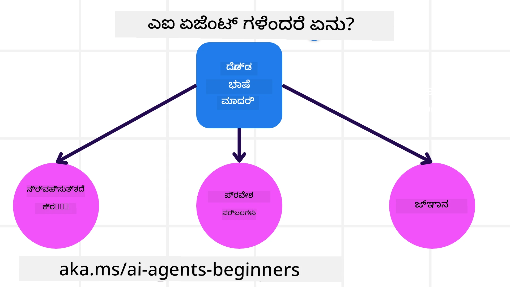

<!--
CO_OP_TRANSLATOR_METADATA:
{
  "original_hash": "cdd28bc00816d2773bb2b5968d782abc",
  "translation_date": "2025-12-03T16:36:36+00:00",
  "source_file": "01-intro-to-ai-agents/README.md",
  "language_code": "kn"
}
-->

> _(ಈ ಪಾಠದ ವೀಡಿಯೊವನ್ನು ನೋಡಲು ಮೇಲಿನ ಚಿತ್ರವನ್ನು ಕ್ಲಿಕ್ ಮಾಡಿ)_

# AI ಏಜೆಂಟ್‌ಗಳು ಮತ್ತು ಅವುಗಳ ಬಳಕೆ ಪ್ರಕರಣಗಳ ಪರಿಚಯ

"AI Agents for Beginners" ಕೋರ್ಸ್‌ಗೆ ಸ್ವಾಗತ! ಈ ಕೋರ್ಸ್ AI ಏಜೆಂಟ್‌ಗಳನ್ನು ನಿರ್ಮಿಸಲು ಮೂಲಭೂತ ಜ್ಞಾನ ಮತ್ತು ಅನ್ವಯಿತ ಮಾದರಿಗಳನ್ನು ಒದಗಿಸುತ್ತದೆ.

<a href="https://discord.gg/kzRShWzttr" target="_blank">Azure AI Discord Community</a> ಗೆ ಸೇರಿ, ಇತರ ಕಲಿಯುವವರನ್ನು ಮತ್ತು AI ಏಜೆಂಟ್ ನಿರ್ಮಾತೃಗಳನ್ನು ಭೇಟಿಯಾಗಿ, ಈ ಕೋರ್ಸ್ ಬಗ್ಗೆ ನಿಮ್ಮ ಪ್ರಶ್ನೆಗಳನ್ನು ಕೇಳಿ.

ಈ ಕೋರ್ಸ್ ಪ್ರಾರಂಭಿಸಲು, AI ಏಜೆಂಟ್‌ಗಳು ಏನು ಮತ್ತು ನಾವು ನಿರ್ಮಿಸುವ ಅಪ್ಲಿಕೇಶನ್‌ಗಳು ಮತ್ತು ವರ್ಕ್‌ಫ್ಲೋಗಳಲ್ಲಿ ಅವುಗಳನ್ನು ಹೇಗೆ ಬಳಸಬಹುದು ಎಂಬುದರ ಬಗ್ಗೆ ಉತ್ತಮ ಅರ್ಥಮಾಡಿಕೊಳ್ಳುವುದರಿಂದ ಪ್ರಾರಂಭಿಸುತ್ತೇವೆ.

## ಪರಿಚಯ

ಈ ಪಾಠದಲ್ಲಿ:

- AI ಏಜೆಂಟ್‌ಗಳು ಏನು ಮತ್ತು ವಿಭಿನ್ನ ಪ್ರಕಾರಗಳ ಏಜೆಂಟ್‌ಗಳು ಯಾವುವು?
- ಯಾವ ಬಳಕೆ ಪ್ರಕರಣಗಳು AI ಏಜೆಂಟ್‌ಗಳಿಗೆ ಉತ್ತಮವಾಗಿವೆ ಮತ್ತು ಅವು ನಮಗೆ ಹೇಗೆ ಸಹಾಯ ಮಾಡಬಹುದು?
- ಏಜೆಂಟಿಕ್ ಪರಿಹಾರಗಳನ್ನು ವಿನ್ಯಾಸಗೊಳಿಸುವಾಗ ಕೆಲವು ಮೂಲಭೂತ ಕಟ್ಟಡ ಬ್ಲಾಕ್‌ಗಳು ಯಾವುವು?

## ಕಲಿಕೆಯ ಗುರಿಗಳು
ಈ ಪಾಠವನ್ನು ಪೂರ್ಣಗೊಳಿಸಿದ ನಂತರ, ನೀವು:

- AI ಏಜೆಂಟ್ ಪರಿಕಲ್ಪನೆಗಳನ್ನು ಮತ್ತು ಇತರ AI ಪರಿಹಾರಗಳಿಂದ ಅವು ಹೇಗೆ ವಿಭಿನ್ನವಾಗಿವೆ ಎಂಬುದನ್ನು ಅರ್ಥಮಾಡಿಕೊಳ್ಳಬಹುದು.
- AI ಏಜೆಂಟ್‌ಗಳನ್ನು ಅತ್ಯಂತ ಪರಿಣಾಮಕಾರಿಯಾಗಿ ಅನ್ವಯಿಸಬಹುದು.
- ಬಳಕೆದಾರರು ಮತ್ತು ಗ್ರಾಹಕರಿಗಾಗಿ ಏಜೆಂಟಿಕ್ ಪರಿಹಾರಗಳನ್ನು ಉತ್ಪಾದಕವಾಗಿ ವಿನ್ಯಾಸಗೊಳಿಸಬಹುದು.

## AI ಏಜೆಂಟ್‌ಗಳನ್ನು ಮತ್ತು ಅವುಗಳ ಪ್ರಕಾರಗಳನ್ನು ವ್ಯಾಖ್ಯಾನಿಸುವುದು

### AI ಏಜೆಂಟ್‌ಗಳು ಏನು?

AI ಏಜೆಂಟ್‌ಗಳು **ವ್ಯವಸ್ಥೆ**ಗಳಾಗಿದ್ದು, **ಮಹತ್ವದ ಭಾಷಾ ಮಾದರಿಗಳನ್ನು (LLMs)** **ಕೃತ್ಯಗಳನ್ನು ನಿರ್ವಹಿಸಲು** **ಟೂಲ್‌ಗಳಿಗೆ ಪ್ರವೇಶ** ಮತ್ತು **ಜ್ಞಾನ**ವನ್ನು ನೀಡುವ ಮೂಲಕ ಅವುಗಳ ಸಾಮರ್ಥ್ಯವನ್ನು ವಿಸ್ತರಿಸುತ್ತವೆ.

ಈ ವ್ಯಾಖ್ಯಾನವನ್ನು ಸಣ್ಣ ಭಾಗಗಳಾಗಿ ವಿಭಜಿಸೋಣ:

- **ವ್ಯವಸ್ಥೆ** - ಏಜೆಂಟ್‌ಗಳನ್ನು ಕೇವಲ ಒಂದು ಘಟಕವಾಗಿ ಮಾತ್ರವಲ್ಲ, ಆದರೆ ಅನೇಕ ಘಟಕಗಳ ವ್ಯವಸ್ಥೆಯಾಗಿ ಪರಿಗಣಿಸುವುದು ಮುಖ್ಯ. AI ಏಜೆಂಟ್‌ನ ಮೂಲಭೂತ ಮಟ್ಟದಲ್ಲಿ ಘಟಕಗಳು:
  - **ಪರಿಸರ** - AI ಏಜೆಂಟ್ ಕಾರ್ಯನಿರ್ವಹಿಸುತ್ತಿರುವ ನಿರ್ದಿಷ್ಟ ಸ್ಥಳ. ಉದಾಹರಣೆಗೆ, ನಾವು ಪ್ರವಾಸ ಬುಕಿಂಗ್ AI ಏಜೆಂಟ್ ಹೊಂದಿದ್ದರೆ, AI ಏಜೆಂಟ್ ಕಾರ್ಯಗಳನ್ನು ಪೂರ್ಣಗೊಳಿಸಲು ಬಳಸುವ ಪ್ರವಾಸ ಬುಕಿಂಗ್ ವ್ಯವಸ್ಥೆ ಪರಿಸರವಾಗಿರಬಹುದು.
  - **ಸೆನ್ಸರ್‌ಗಳು** - ಪರಿಸರವು ಮಾಹಿತಿ ಹೊಂದಿದ್ದು ಪ್ರತಿಕ್ರಿಯೆ ಒದಗಿಸುತ್ತದೆ. AI ಏಜೆಂಟ್‌ಗಳು ಪರಿಸರದ ಪ್ರಸ್ತುತ ಸ್ಥಿತಿಯ ಬಗ್ಗೆ ಈ ಮಾಹಿತಿಯನ್ನು ಸಂಗ್ರಹಿಸಲು ಮತ್ತು ವ್ಯಾಖ್ಯಾನಿಸಲು ಸೆನ್ಸರ್‌ಗಳನ್ನು ಬಳಸುತ್ತವೆ. ಪ್ರವಾಸ ಬುಕಿಂಗ್ ಏಜೆಂಟ್ ಉದಾಹರಣೆಯಲ್ಲಿ, ಪ್ರವಾಸ ಬುಕಿಂಗ್ ವ್ಯವಸ್ಥೆ ಹೋಟೆಲ್ ಲಭ್ಯತೆ ಅಥವಾ ವಿಮಾನ ದರಗಳಂತಹ ಮಾಹಿತಿಯನ್ನು ಒದಗಿಸಬಹುದು.
  - **ಆಕ್ಟ್ಯುಯೇಟರ್‌ಗಳು** - AI ಏಜೆಂಟ್ ಪರಿಸರದ ಪ್ರಸ್ತುತ ಸ್ಥಿತಿಯನ್ನು ಸ್ವೀಕರಿಸಿದ ನಂತರ, ಪ್ರಸ್ತುತ ಕಾರ್ಯಕ್ಕಾಗಿ ಏಜೆಂಟ್ ಪರಿಸರವನ್ನು ಬದಲಾಯಿಸಲು ಯಾವ ಕ್ರಿಯೆಯನ್ನು ನಿರ್ವಹಿಸಬೇಕೆಂದು ನಿರ್ಧರಿಸುತ್ತದೆ. ಪ್ರವಾಸ ಬುಕಿಂಗ್ ಏಜೆಂಟ್‌ಗಾಗಿ, ಇದು ಬಳಕೆದಾರನಿಗೆ ಲಭ್ಯವಿರುವ ಕೋಣೆಯನ್ನು ಬುಕ್ ಮಾಡುವುದು.

**ಮಹತ್ವದ ಭಾಷಾ ಮಾದರಿಗಳು** - LLMs ರಚನೆಯ ಮೊದಲು ಏಜೆಂಟ್‌ಗಳ ಪರಿಕಲ್ಪನೆ ಅಸ್ತಿತ್ವದಲ್ಲಿತ್ತು. LLMs ಬಳಸಿ AI ಏಜೆಂಟ್‌ಗಳನ್ನು ನಿರ್ಮಿಸುವ ಪ್ರಯೋಜನವೆಂದರೆ ಮಾನವ ಭಾಷೆ ಮತ್ತು ಡೇಟಾವನ್ನು ವ್ಯಾಖ್ಯಾನಿಸುವ ಅವುಗಳ ಸಾಮರ್ಥ್ಯ. ಈ ಸಾಮರ್ಥ್ಯವು LLMs ಗೆ ಪರಿಸರದ ಮಾಹಿತಿಯನ್ನು ವ್ಯಾಖ್ಯಾನಿಸಲು ಮತ್ತು ಪರಿಸರವನ್ನು ಬದಲಾಯಿಸಲು ಯೋಜನೆಯನ್ನು ವ್ಯಾಖ್ಯಾನಿಸಲು ಸಾಧ್ಯವಾಗುತ್ತದೆ.

**ಕೃತ್ಯಗಳನ್ನು ನಿರ್ವಹಿಸುವುದು** - AI ಏಜೆಂಟ್ ವ್ಯವಸ್ಥೆಗಳಿಂದ ಹೊರಗೆ, LLMs ಬಳಕೆದಾರನ ಪ್ರಾಂಪ್ಟ್ ಆಧರಿಸಿ ವಿಷಯವನ್ನು ಅಥವಾ ಮಾಹಿತಿಯನ್ನು ರಚಿಸುವ ಪರಿಸ್ಥಿತಿಗಳಿಗೆ ಮಾತ್ರ ಸೀಮಿತವಾಗಿದೆ. AI ಏಜೆಂಟ್ ವ್ಯವಸ್ಥೆಗಳಲ್ಲಿ, LLMs ಬಳಕೆದಾರನ ವಿನಂತಿಯನ್ನು ವ್ಯಾಖ್ಯಾನಿಸುವ ಮೂಲಕ ಮತ್ತು ಅವುಗಳ ಪರಿಸರದಲ್ಲಿ ಲಭ್ಯವಿರುವ ಟೂಲ್‌ಗಳನ್ನು ಬಳಸುವ ಮೂಲಕ ಕಾರ್ಯಗಳನ್ನು ಸಾಧಿಸಬಹುದು.

**ಟೂಲ್‌ಗಳಿಗೆ ಪ್ರವೇಶ** - LLM ಗೆ ಪ್ರವೇಶವಿರುವ ಟೂಲ್‌ಗಳು 1) ಅದು ಕಾರ್ಯನಿರ್ವಹಿಸುತ್ತಿರುವ ಪರಿಸರ ಮತ್ತು 2) AI ಏಜೆಂಟ್‌ನ ಡೆವಲಪರ್ ಮೂಲಕ ವ್ಯಾಖ್ಯಾನಿಸಲಾಗುತ್ತದೆ. ನಮ್ಮ ಪ್ರವಾಸ ಏಜೆಂಟ್ ಉದಾಹರಣೆಗೆ, ಏಜೆಂಟ್‌ನ ಟೂಲ್‌ಗಳು ಬುಕಿಂಗ್ ವ್ಯವಸ್ಥೆಯಲ್ಲಿ ಲಭ್ಯವಿರುವ ಕಾರ್ಯಾಚರಣೆಗಳಿಂದ ಮತ್ತು/ಅಥವಾ ಡೆವಲಪರ್ ಏಜೆಂಟ್‌ನ ಟೂಲ್ ಪ್ರವೇಶವನ್ನು ವಿಮಾನಗಳಿಗೆ ಮಿತಿಗೊಳಿಸಬಹುದು.

**ಮೆಮೊರಿ+ಜ್ಞಾನ** - ಮೆಮೊರಿ ಸಂಭಾಷಣೆಯ ಸಂದರ್ಭದಲ್ಲಿ ಬಳಕೆದಾರ ಮತ್ತು ಏಜೆಂಟ್ ನಡುವೆ ಅಲ್ಪಾವಧಿಯಲ್ಲಿರಬಹುದು. ದೀರ್ಘಾವಧಿಯಲ್ಲಿ, ಪರಿಸರವು ಒದಗಿಸುವ ಮಾಹಿತಿಯಿಂದ ಹೊರಗೆ, AI ಏಜೆಂಟ್‌ಗಳು ಇತರ ವ್ಯವಸ್ಥೆಗಳು, ಸೇವೆಗಳು, ಟೂಲ್‌ಗಳು ಮತ್ತು ಇತರ ಏಜೆಂಟ್‌ಗಳಿಂದ ಜ್ಞಾನವನ್ನು ಹಿಂಪಡೆಯಬಹುದು. ಪ್ರವಾಸ ಏಜೆಂಟ್ ಉದಾಹರಣೆಯಲ್ಲಿ, ಈ ಜ್ಞಾನವು ಗ್ರಾಹಕ ಡೇಟಾಬೇಸ್‌ನಲ್ಲಿ ಇರುವ ಬಳಕೆದಾರನ ಪ್ರವಾಸ ಪ್ರಾಧಾನ್ಯತೆಗಳ ಮಾಹಿತಿಯಾಗಿರಬಹುದು.

### ವಿಭಿನ್ನ ಪ್ರಕಾರಗಳ ಏಜೆಂಟ್‌ಗಳು

ಈಗ ನಾವು AI ಏಜೆಂಟ್‌ಗಳ ಸಾಮಾನ್ಯ ವ್ಯಾಖ್ಯಾನವನ್ನು ಹೊಂದಿದ್ದೇವೆ, ನಾವು ಕೆಲವು ನಿರ್ದಿಷ್ಟ ಏಜೆಂಟ್ ಪ್ರಕಾರಗಳನ್ನು ಮತ್ತು ಅವುಗಳನ್ನು ಪ್ರವಾಸ ಬುಕಿಂಗ್ AI ಏಜೆಂಟ್‌ಗೆ ಹೇಗೆ ಅನ್ವಯಿಸಲಾಗುತ್ತದೆ ಎಂಬುದನ್ನು ನೋಡೋಣ.

| **ಏಜೆಂಟ್ ಪ್ರಕಾರ**                | **ವಿವರಣೆ**                                                                                                                       | **ಉದಾಹರಣೆ**                                                                                                                                                                                                                   |
| ----------------------------- | ------------------------------------------------------------------------------------------------------------------------------------- | ----------------------------------------------------------------------------------------------------------------------------------------------------------------------------------------------------------------------------- |
| **ಸಿಂಪಲ್ ರಿಫ್ಲೆಕ್ಸ್ ಏಜೆಂಟ್‌ಗಳು**      | ಪೂರ್ವನಿರ್ಧಾರಿತ ನಿಯಮಗಳ ಆಧಾರದ ಮೇಲೆ ತಕ್ಷಣದ ಕ್ರಿಯೆಗಳನ್ನು ನಿರ್ವಹಿಸುತ್ತವೆ.                                                                                  | ಪ್ರವಾಸ ಏಜೆಂಟ್ ಇಮೇಲ್‌ನ ಪ್ರಸ್ತಾವನೆಯನ್ನು ವ್ಯಾಖ್ಯಾನಿಸಿ, ಪ್ರವಾಸದ ದೂರುಗಳನ್ನು ಗ್ರಾಹಕ ಸೇವೆಗೆ ಫಾರ್ವರ್ಡ್ ಮಾಡುತ್ತದೆ.                                                                                                                          |
| **ಮಾಡೆಲ್-ಬೇಸ್ಡ್ ರಿಫ್ಲೆಕ್ಸ್ ಏಜೆಂಟ್‌ಗಳು** | ಪ್ರಪಂಚದ ಮಾದರಿಯ ಆಧಾರದ ಮೇಲೆ ಮತ್ತು ಆ ಮಾದರಿಯ ಬದಲಾವಣೆಗಳ ಆಧಾರದ ಮೇಲೆ ಕ್ರಿಯೆಗಳನ್ನು ನಿರ್ವಹಿಸುತ್ತವೆ.                                                              | ಪ್ರವಾಸ ಏಜೆಂಟ್ ಐತಿಹಾಸಿಕ ಬೆಲೆ ಡೇಟಾದ ಪ್ರಾಪ್ತಿಯ ಆಧಾರದ ಮೇಲೆ ಪ್ರಮುಖ ಬೆಲೆ ಬದಲಾವಣೆಗಳೊಂದಿಗೆ ಮಾರ್ಗಗಳನ್ನು ಆದ್ಯತೆ ನೀಡುತ್ತದೆ.                                                                                                             |
| **ಗೋಲ್-ಬೇಸ್ಡ್ ಏಜೆಂಟ್‌ಗಳು**         | ಗುರಿಗಳನ್ನು ಸಾಧಿಸಲು ಯೋಜನೆಗಳನ್ನು ರಚಿಸಿ, ಗುರಿಯನ್ನು ವ್ಯಾಖ್ಯಾನಿಸಿ ಮತ್ತು ಅದನ್ನು ತಲುಪಲು ಕ್ರಿಯೆಗಳನ್ನು ನಿರ್ಧರಿಸುತ್ತವೆ.                                  | ಪ್ರವಾಸ ಏಜೆಂಟ್ ಪ್ರಸ್ತುತ ಸ್ಥಳದಿಂದ ಗಮ್ಯಸ್ಥಾನಕ್ಕೆ ಅಗತ್ಯವಿರುವ ಪ್ರಯಾಣ ವ್ಯವಸ್ಥೆಗಳನ್ನು (ಕಾರು, ಸಾರ್ವಜನಿಕ ಸಾರಿಗೆ, ವಿಮಾನಗಳು) ನಿರ್ಧರಿಸುವ ಮೂಲಕ ಪ್ರಯಾಣವನ್ನು ಬುಕ್ ಮಾಡುತ್ತದೆ.                                                                                |
| **ಯುಟಿಲಿಟಿ-ಬೇಸ್ಡ್ ಏಜೆಂಟ್‌ಗಳು**      | ಪ್ರಾಧಾನ್ಯತೆಗಳನ್ನು ಪರಿಗಣಿಸಿ ಮತ್ತು ಗುರಿಗಳನ್ನು ಸಾಧಿಸಲು ಸಂಖ್ಯಾತ್ಮಕವಾಗಿ ವ್ಯವಹಾರಗಳನ್ನು ತೂಕಮಾಡುತ್ತವೆ.                                               | ಪ್ರವಾಸ ಏಜೆಂಟ್ ಪ್ರಯಾಣವನ್ನು ಬುಕ್ ಮಾಡುವಾಗ ಅನುಕೂಲತೆ ಮತ್ತು ವೆಚ್ಚವನ್ನು ತೂಕಮಾಡುವ ಮೂಲಕ ಯುಟಿಲಿಟಿಯನ್ನು ಗರಿಷ್ಠಗೊಳಿಸುತ್ತದೆ.                                                                                                                                          |
| **ಲರ್ನಿಂಗ್ ಏಜೆಂಟ್‌ಗಳು**           | ಪ್ರತಿಕ್ರಿಯೆಗೆ ಪ್ರತಿಕ್ರಿಯಿಸುವ ಮೂಲಕ ಮತ್ತು ಕ್ರಮಗಳನ್ನು ಹೊಂದಿಸುವ ಮೂಲಕ ಸಮಯದೊಂದಿಗೆ ಸುಧಾರಿಸುತ್ತವೆ.                                                        | ಪ್ರವಾಸ ಏಜೆಂಟ್ ಗ್ರಾಹಕ ಪ್ರತಿಕ್ರಿಯೆಯನ್ನು ಬಳಸಿ, ಮುಂದಿನ ಬುಕ್ಕಿಂಗ್‌ಗಳಲ್ಲಿ ಬದಲಾವಣೆಗಳನ್ನು ಮಾಡಲು ಪ್ರಯಾಣದ ನಂತರದ ಸಮೀಕ್ಷೆಗಳಿಂದ ಸುಧಾರಿಸುತ್ತದೆ.                                                                                                               |
| **ಹೈರಾರ್ಕಿಕಲ್ ಏಜೆಂಟ್‌ಗಳು**       | ಟಿಯರ್ಡ್ ವ್ಯವಸ್ಥೆಯಲ್ಲಿ ಬಹು ಏಜೆಂಟ್‌ಗಳನ್ನು ಹೊಂದಿದ್ದು, ಉನ್ನತ-ಮಟ್ಟದ ಏಜೆಂಟ್‌ಗಳು ಕಾರ್ಯಗಳನ್ನು ಉಪಕಾರ್ಯಗಳಲ್ಲಿ ವಿಭಜಿಸುತ್ತವೆ ಮತ್ತು ಕಡಿಮೆ-ಮಟ್ಟದ ಏಜೆಂಟ್‌ಗಳು ಅವುಗಳನ್ನು ಪೂರ್ಣಗೊಳಿಸುತ್ತವೆ. | ಪ್ರವಾಸ ಏಜೆಂಟ್ ಒಂದು ಪ್ರಯಾಣವನ್ನು ರದ್ದುಗೊಳಿಸುವ ಮೂಲಕ ಕಾರ್ಯವನ್ನು ಉಪಕಾರ್ಯಗಳಲ್ಲಿ (ಉದಾಹರಣೆಗೆ, ನಿರ್ದಿಷ್ಟ ಬುಕ್ಕಿಂಗ್‌ಗಳನ್ನು ರದ್ದುಗೊಳಿಸುವುದು) ವಿಭಜಿಸುತ್ತದೆ ಮತ್ತು ಕಡಿಮೆ-ಮಟ್ಟದ ಏಜೆಂಟ್‌ಗಳು ಅವುಗಳನ್ನು ಪೂರ್ಣಗೊಳಿಸುತ್ತವೆ, ಉನ್ನತ-ಮಟ್ಟದ ಏಜೆಂಟ್‌ಗೆ ವರದಿ ಮಾಡುತ್ತದೆ.                                     |
| **ಮಲ್ಟಿ-ಏಜೆಂಟ್ ಸಿಸ್ಟಮ್‌ಗಳು (MAS)** | ಏಜೆಂಟ್‌ಗಳು ಸ್ವತಂತ್ರವಾಗಿ ಕಾರ್ಯಗಳನ್ನು ಪೂರ್ಣಗೊಳಿಸುತ್ತವೆ, entweder ಸಹಕಾರಾತ್ಮಕವಾಗಿ ಅಥವಾ ಸ್ಪರ್ಧಾತ್ಮಕವಾಗಿ.                                                           | ಸಹಕಾರಾತ್ಮಕ: ಬಹು ಏಜೆಂಟ್‌ಗಳು ಹೋಟೆಲ್‌ಗಳು, ವಿಮಾನಗಳು ಮತ್ತು ಮನರಂಜನೆ ಮುಂತಾದ ವಿಶೇಷ ಪ್ರಯಾಣ ಸೇವೆಗಳನ್ನು ಬುಕ್ ಮಾಡುತ್ತವೆ. ಸ್ಪರ್ಧಾತ್ಮಕ: ಬಹು ಏಜೆಂಟ್‌ಗಳು ಹೋಟೆಲ್ ಬುಕ್ಕಿಂಗ್ ಕ್ಯಾಲೆಂಡರ್ ಅನ್ನು ನಿರ್ವಹಿಸುತ್ತವೆ ಮತ್ತು ಗ್ರಾಹಕರನ್ನು ಹೋಟೆಲ್‌ನಲ್ಲಿ ಬುಕ್ ಮಾಡಲು ಸ್ಪರ್ಧಿಸುತ್ತವೆ. |

## AI ಏಜೆಂಟ್‌ಗಳನ್ನು ಯಾವಾಗ ಬಳಸಬೇಕು

ಹಿಂದಿನ ವಿಭಾಗದಲ್ಲಿ, ನಾವು ಪ್ರವಾಸ ಏಜೆಂಟ್ ಬಳಕೆ ಪ್ರಕರಣವನ್ನು ಬಳಸಿಕೊಂಡು, ಪ್ರವಾಸ ಬುಕಿಂಗ್‌ನ ವಿವಿಧ ಸಂದರ್ಭಗಳಲ್ಲಿ ವಿಭಿನ್ನ ಪ್ರಕಾರಗಳ ಏಜೆಂಟ್‌ಗಳನ್ನು ಹೇಗೆ ಬಳಸಬಹುದು ಎಂಬುದನ್ನು ವಿವರಿಸಿದ್ದೇವೆ. ನಾವು ಈ ಅಪ್ಲಿಕೇಶನ್ ಅನ್ನು ಕೋರ್ಸ್ದಾದ್ಯಂತ ಮುಂದುವರಿಸುತ್ತೇವೆ.

AI ಏಜೆಂಟ್‌ಗಳನ್ನು ಬಳಸಲು ಉತ್ತಮವಾದ ಬಳಕೆ ಪ್ರಕರಣಗಳ ಪ್ರಕಾರಗಳನ್ನು ನೋಡೋಣ:

- **ಮುಕ್ತ ಅಂತ್ಯ ಸಮಸ್ಯೆಗಳು** - LLM ಗೆ ಕಾರ್ಯವನ್ನು ಪೂರ್ಣಗೊಳಿಸಲು ಅಗತ್ಯವಿರುವ ಹಂತಗಳನ್ನು ನಿರ್ಧರಿಸಲು ಅವಕಾಶ ನೀಡುವುದು, ಏಕೆಂದರೆ ಇದು ವರ್ಕ್‌ಫ್ಲೋಗೆ ಹಾರ್ಡ್‌ಕೋಡ್ ಮಾಡಲಾಗುವುದಿಲ್ಲ.
- **ಬಹು ಹಂತದ ಪ್ರಕ್ರಿಯೆಗಳು** - AI ಏಜೆಂಟ್‌ಗಳು ಟೂಲ್‌ಗಳನ್ನು ಅಥವಾ ಮಾಹಿತಿಯನ್ನು ಒಂದೇ ಶಾಟ್ ರಿಟ್ರೀವಲ್ ಬದಲು ಬಹು ತಿರುಗುಹರಟುಗಳಲ್ಲಿ ಬಳಸಬೇಕಾದಂತಹ ಕಾರ್ಯಗಳು.
- **ಸಮಯದೊಂದಿಗೆ ಸುಧಾರಣೆ** - ಏಜೆಂಟ್ ತನ್ನ ಪರಿಸರದಿಂದ ಅಥವಾ ಬಳಕೆದಾರರಿಂದ ಪ್ರತಿಕ್ರಿಯೆಯನ್ನು ಸ್ವೀಕರಿಸುವ ಮೂಲಕ ಉತ್ತಮ ಯುಟಿಲಿಟಿಯನ್ನು ಒದಗಿಸಲು ಸುಧಾರಿಸಬಹುದಾದ ಕಾರ್ಯಗಳು.

AI ಏಜೆಂಟ್‌ಗಳನ್ನು ಬಳಸುವ ಹೆಚ್ಚಿನ ಪರಿಗಣನೆಗಳನ್ನು ನಾವು "Building Trustworthy AI Agents" ಪಾಠದಲ್ಲಿ ಕವರ್ ಮಾಡುತ್ತೇವೆ.

## ಏಜೆಂಟಿಕ್ ಪರಿಹಾರಗಳ ಮೂಲಭೂತಗಳು

### ಏಜೆಂಟ್ ಅಭಿವೃದ್ಧಿ

AI ಏಜೆಂಟ್ ವ್ಯವಸ್ಥೆಯನ್ನು ವಿನ್ಯಾಸಗೊಳಿಸುವ ಮೊದಲ ಹಂತವು ಟೂಲ್‌ಗಳು, ಕ್ರಿಯೆಗಳು ಮತ್ತು ವರ್ತನೆಗಳನ್ನು ವ್ಯಾಖ್ಯಾನಿಸುವುದು. ಈ ಕೋರ್ಸ್‌ನಲ್ಲಿ, ನಾವು ನಮ್ಮ ಏಜೆಂಟ್‌ಗಳನ್ನು ವ್ಯಾಖ್ಯಾನಿಸಲು **Azure AI Agent Service** ಅನ್ನು ಬಳಸುವ ಮೇಲೆ ಗಮನಹರಿಸುತ್ತೇವೆ. ಇದು ಈ ರೀತಿಯ ವೈಶಿಷ್ಟ್ಯಗಳನ್ನು ಒದಗಿಸುತ್ತದೆ:

- OpenAI, Mistral, ಮತ್ತು Llama ಮುಂತಾದ Open Models ಆಯ್ಕೆ
- Tripadvisor ಮುಂತಾದ ಪ್ರೊವೈಡರ್‌ಗಳ ಮೂಲಕ ಲೈಸೆನ್ಸ್ ಮಾಡಲಾದ ಡೇಟಾ ಬಳಕೆ
- OpenAPI 3.0 ಟೂಲ್‌ಗಳ ಪ್ರಮಾಣಿತ ಬಳಕೆ

### ಏಜೆಂಟಿಕ್ ಪ್ಯಾಟರ್ನ್‌ಗಳು

LLMs ಜೊತೆ ಸಂವಹನವು ಪ್ರಾಂಪ್ಟ್‌ಗಳ ಮೂಲಕ ನಡೆಯುತ್ತದೆ. AI ಏಜೆಂಟ್‌ಗಳ ಅರೆ-ಸ್ವಾಯತ್ತ ಸ್ವಭಾವವನ್ನು ನೀಡಿದರೆ, ಪರಿಸರದಲ್ಲಿ ಬದಲಾವಣೆ ನಂತರ LLM ಅನ್ನು ಕೈಯಿಂದ ಮರುಪ್ರಾಂಪ್ಟ್ ಮಾಡುವುದು ಸಾಧ್ಯವಿಲ್ಲ ಅಥವಾ ಅಗತ್ಯವಿಲ್ಲ. ನಾವು **Agentic Patterns** ಅನ್ನು ಬಳಸುತ್ತೇವೆ, ಇದು LLM ಅನ್ನು ಬಹು ಹಂತಗಳಲ್ಲಿ ಹೆಚ್ಚು ಮಾಪನೀಯ ರೀತಿಯಲ್ಲಿ ಪ್ರಾಂಪ್ಟ್ ಮಾಡಲು ನಮಗೆ ಅನುಮತಿಸುತ್ತದೆ.

ಈ ಕೋರ್ಸ್ ಕೆಲವು ಪ್ರಸ್ತುತ ಜನಪ್ರಿಯ ಏಜೆಂಟಿಕ್ ಪ್ಯಾಟರ್ನ್‌ಗಳಲ್ಲಿ ವಿಭಜಿಸಲಾಗಿದೆ.

### ಏಜೆಂಟಿಕ್ ಫ್ರೇಮ್‌ವರ್ಕ್‌ಗಳು

ಏಜೆಂಟಿಕ್ ಫ್ರೇಮ್‌ವರ್ಕ್‌ಗಳು ಡೆವಲಪರ್‌ಗಳಿಗೆ ಕೋಡ್ ಮೂಲಕ ಏಜೆಂಟಿಕ್ ಪ್ಯಾಟರ್ನ್‌ಗಳನ್ನು ಅನುಷ್ಠಾನಗೊಳಿಸಲು ಅನುಮತಿಸುತ್ತವೆ. ಈ ಫ್ರೇಮ್‌ವರ್ಕ್‌ಗಳು ಟೆಂಪ್ಲೇಟುಗಳು, ಪ್ಲಗಿನ್‌ಗಳು ಮತ್ತು ಟೂಲ್‌ಗಳನ್ನು ಒದಗಿಸುತ್ತವೆ, ಉತ್ತಮ AI ಏಜೆಂಟ್ ಸಹಕಾರಕ್ಕಾಗಿ. ಈ ಪ್ರಯೋಜನಗಳು AI ಏಜೆಂಟ್ ವ್ಯವಸ್ಥೆಗಳ ಉತ್ತಮ ಅವಲೋಕನ ಮತ್ತು ತೊಂದರೆಗಳನ್ನು ಪರಿಹರಿಸುವ ಸಾಮರ್ಥ್ಯಗಳನ್ನು ಒದಗಿಸುತ್ತವೆ.

ಈ ಕೋರ್ಸ್‌ನಲ್ಲಿ, ನಾವು ಸಂಶೋಧನೆ-ಚಾಲಿತ AutoGen ಫ್ರೇಮ್‌ವರ್ಕ್ ಮತ್ತು Semantic Kernel ನಿಂದ ಉತ್ಪಾದನಾ-ತಯಾರಿಯ ಏಜೆಂಟ್ ಫ್ರೇಮ್‌ವರ್ಕ್ ಅನ್ನು ಅನ್ವೇಷಿಸುತ್ತೇವೆ.

## ಮಾದರಿ ಕೋಡ್‌ಗಳು

- Python: [Agent Framework](./code_samples/01-python-agent-framework.ipynb)
- .NET: [Agent Framework](./code_samples/01-dotnet-agent-framework.md)

## AI ಏಜೆಂಟ್‌ಗಳ ಬಗ್ಗೆ ಹೆಚ್ಚಿನ ಪ್ರಶ್ನೆಗಳಿದೆಯೇ?

[Azure AI Foundry Discord](https://aka.ms/ai-agents/discord) ಗೆ ಸೇರಿ, ಇತರ ಕಲಿಯುವವರನ್ನು ಭೇಟಿಯಾಗಿ, ಆಫೀಸ್ ಅವರ್ಸ್‌ಗಳಲ್ಲಿ ಭಾಗವಹಿಸಿ ಮತ್ತು ನಿಮ್ಮ AI ಏಜೆಂಟ್‌ಗಳ ಪ್ರಶ್ನೆಗಳಿಗೆ ಉತ್ತರ ಪಡೆಯಿರಿ.

## ಹಿಂದಿನ ಪಾಠ

[ಕೋರ್ಸ್ ಸೆಟಪ್](../00-course-setup/README.md)

## ಮುಂದಿನ ಪಾಠ

[Agentic Frameworks ಅನ್ನು ಅನ್ವೇಷಿಸುವುದು](../02-explore-agentic-frameworks/README.md)

---

<!-- CO-OP TRANSLATOR DISCLAIMER START -->
**ಅಸಮೀಕ್ಷೆ**:  
ಈ ದಸ್ತಾವೇಜನ್ನು AI ಅನುವಾದ ಸೇವೆ [Co-op Translator](https://github.com/Azure/co-op-translator) ಬಳಸಿ ಅನುವಾದಿಸಲಾಗಿದೆ. ನಾವು ನಿಖರತೆಯನ್ನು ಸಾಧಿಸಲು ಪ್ರಯತ್ನಿಸುತ್ತಿದ್ದರೂ, ದಯವಿಟ್ಟು ಗಮನಿಸಿ, ಸ್ವಯಂಚಾಲಿತ ಅನುವಾದಗಳಲ್ಲಿ ದೋಷಗಳು ಅಥವಾ ಅಸಮರ್ಪಕತೆಗಳು ಇರಬಹುದು. ಮೂಲ ಭಾಷೆಯಲ್ಲಿರುವ ಮೂಲ ದಸ್ತಾವೇಜನ್ನು ಪ್ರಾಮಾಣಿಕ ಮೂಲವೆಂದು ಪರಿಗಣಿಸಬೇಕು. ಪ್ರಮುಖ ಮಾಹಿತಿಗಾಗಿ, ವೃತ್ತಿಪರ ಮಾನವ ಅನುವಾದವನ್ನು ಶಿಫಾರಸು ಮಾಡಲಾಗುತ್ತದೆ. ಈ ಅನುವಾದದ ಬಳಕೆಯಿಂದ ಉಂಟಾಗುವ ಯಾವುದೇ ತಪ್ಪುಅರ್ಥಗಳು ಅಥವಾ ತಪ್ಪುಅರ್ಥೈಸುವಿಕೆಗೆ ನಾವು ಹೊಣೆಗಾರರಲ್ಲ.
<!-- CO-OP TRANSLATOR DISCLAIMER END -->