<!--
CO_OP_TRANSLATOR_METADATA:
{
  "original_hash": "5f351412e934f0833c8c821a0a60efaf",
  "translation_date": "2025-12-03T16:38:07+00:00",
  "source_file": "01-intro-to-ai-agents/code_samples/01-dotnet-agent-framework.md",
  "language_code": "kn"
}
-->
# 🌍 Microsoft Agent Framework (.NET) ಬಳಸಿ AI ಪ್ರವಾಸ ಏಜೆಂಟ್

## 📋 ದೃಶ್ಯಾವಲೋಕನ

ಈ ಉದಾಹರಣೆ Microsoft Agent Framework for .NET ಬಳಸಿ ಬುದ್ಧಿವಂತ ಪ್ರವಾಸ ಯೋಜನೆ ಏಜೆಂಟ್ ಅನ್ನು ಹೇಗೆ ನಿರ್ಮಿಸಬಹುದು ಎಂಬುದನ್ನು ತೋರಿಸುತ್ತದೆ. ಈ ಏಜೆಂಟ್ ವಿಶ್ವದ ವಿವಿಧ ಸ್ಥಳಗಳಿಗೆ ವೈಯಕ್ತಿಕ ದಿನ-ಪ್ರಯಾಣ ಯೋಜನೆಗಳನ್ನು ಸ್ವಯಂಚಾಲಿತವಾಗಿ ರಚಿಸಬಹುದು.

### ಪ್ರಮುಖ ಸಾಮರ್ಥ್ಯಗಳು:

- 🎲 **ಯಾದೃಚ್ಛಿಕ ಸ್ಥಳ ಆಯ್ಕೆ**: ರಜಾ ಸ್ಥಳಗಳನ್ನು ಆಯ್ಕೆ ಮಾಡಲು ಕಸ್ಟಮ್ ಟೂಲ್ ಬಳಸುತ್ತದೆ
- 🗺️ **ಬುದ್ಧಿವಂತ ಪ್ರವಾಸ ಯೋಜನೆ**: ದಿನ-ದಿನದ ವಿವರವಾದ ಯೋಜನೆಗಳನ್ನು ರಚಿಸುತ್ತದೆ
- 🔄 **ತಕ್ಷಣದ ಮತ್ತು ಸ್ಟ್ರೀಮಿಂಗ್ ಪ್ರತಿಕ್ರಿಯೆ**: ರಿಯಲ್-ಟೈಮ್ ಪ್ರತಿಕ್ರಿಯೆಗಳನ್ನು ಬೆಂಬಲಿಸುತ್ತದೆ
- 🛠️ **ಕಸ್ಟಮ್ ಟೂಲ್ ಇಂಟಿಗ್ರೇಶನ್**: ಏಜೆಂಟ್ ಸಾಮರ್ಥ್ಯಗಳನ್ನು ವಿಸ್ತರಿಸುವುದನ್ನು ತೋರಿಸುತ್ತದೆ

## 🔧 ತಾಂತ್ರಿಕ ಆರ್ಕಿಟೆಕ್ಚರ್

### ಮುಖ್ಯ ತಂತ್ರಜ್ಞಾನಗಳು

- **Microsoft Agent Framework**: .NET ನಲ್ಲಿ AI ಏಜೆಂಟ್ ಅಭಿವೃದ್ಧಿಗಾಗಿ ಇತ್ತೀಚಿನ ಅನುಷ್ಠಾನ
- **GitHub Models Integration**: GitHub ನ AI ಮಾದರಿ ನಿರ್ವಚನಾ ಸೇವೆಯನ್ನು ಬಳಸುತ್ತದೆ
- **OpenAI API Compatibility**: OpenAI ಕ್ಲೈಂಟ್ ಲೈಬ್ರರಿಗಳನ್ನು ಕಸ್ಟಮ್ ಎಂಡ್‌ಪಾಯಿಂಟ್‌ಗಳೊಂದಿಗೆ ಬಳಸುತ್ತದೆ
- **ಸುರಕ್ಷಿತ ಸಂರಚನೆ**: ಪರಿಸರ-ಆಧಾರಿತ API ಕೀ ನಿರ್ವಹಣೆ

### ಪ್ರಮುಖ ಘಟಕಗಳು

1. **AIAgent**: ಸಂಭಾಷಣೆಯ ಹರಿವನ್ನು ನಿರ್ವಹಿಸುವ ಮುಖ್ಯ ಏಜೆಂಟ್
2. **ಕಸ್ಟಮ್ ಟೂಲ್‌ಗಳು**: `GetRandomDestination()` ಕಾರ್ಯವನ್ನು ಏಜೆಂಟ್‌ಗೆ ಲಭ್ಯವಿದೆ
3. **ಚಾಟ್ ಕ್ಲೈಂಟ್**: GitHub Models ಬೆಂಬಲಿತ ಸಂಭಾಷಣಾ ಇಂಟರ್ಫೇಸ್
4. **ಸ್ಟ್ರೀಮಿಂಗ್ ಬೆಂಬಲ**: ರಿಯಲ್-ಟೈಮ್ ಪ್ರತಿಕ್ರಿಯೆ ರಚನೆ ಸಾಮರ್ಥ್ಯಗಳು

### ಇಂಟಿಗ್ರೇಶನ್ ಪ್ಯಾಟರ್ನ್

```mermaid
graph LR
    A[ಬಳಕೆದಾರ ವಿನಂತಿ] --> B[AI ಏಜೆಂಟ್]
    B --> C[GitHub ಮಾದರಿಗಳ API]
    B --> D[GetRandomDestination ಸಾಧನ]
    C --> E[ಪ್ರಯಾಣ ಯೋಜನೆ]
    D --> E
```


## 🚀 ಪ್ರಾರಂಭಿಸಲು

### ಪೂರ್ವಾಪೇಕ್ಷಿತಗಳು

- [.NET 10 SDK](https://dotnet.microsoft.com/download/dotnet/10.0) ಅಥವಾ ಹೆಚ್ಚಿನದು
- [GitHub Models API access token](https://docs.github.com/github-models/github-models-at-scale/using-your-own-api-keys-in-github-models)

### ಅಗತ್ಯವಿರುವ ಪರಿಸರ ವ್ಯತ್ಯಾಸಗಳು

```bash
# zsh/bash
export GH_TOKEN=<your_github_token>
export GH_ENDPOINT=https://models.github.ai/inference
export GH_MODEL_ID=openai/gpt-5-mini
```

```powershell
# ಪವರ್‌ಶೆಲ್
$env:GH_TOKEN = "<your_github_token>"
$env:GH_ENDPOINT = "https://models.github.ai/inference"
$env:GH_MODEL_ID = "openai/gpt-5-mini"
```

### ಮಾದರಿ ಕೋಡ್

ಕೋಡ್ ಉದಾಹರಣೆಯನ್ನು ಚಲಾಯಿಸಲು,

```bash
# ಝೆಡ್‌ಎಸ್‌ಎಚ್/ಬ್ಯಾಶ್
chmod +x ./01-dotnet-agent-framework.cs
./01-dotnet-agent-framework.cs
```

ಅಥವಾ dotnet CLI ಬಳಸಿ:

```bash
dotnet run ./01-dotnet-agent-framework.cs
```

ಪೂರ್ಣ ಕೋಡ್‌ಗಾಗಿ [`01-dotnet-agent-framework.cs`](../../../../01-intro-to-ai-agents/code_samples/01-dotnet-agent-framework.cs) ನೋಡಿ.

```csharp
#!/usr/bin/dotnet run

#:package Microsoft.Extensions.AI@9.*
#:package Microsoft.Agents.AI.OpenAI@1.*-*

using System.ClientModel;
using System.ComponentModel;

using Microsoft.Agents.AI;
using Microsoft.Extensions.AI;

using OpenAI;

// Tool Function: Random Destination Generator
// This static method will be available to the agent as a callable tool
// The [Description] attribute helps the AI understand when to use this function
// This demonstrates how to create custom tools for AI agents
[Description("Provides a random vacation destination.")]
static string GetRandomDestination()
{
    // List of popular vacation destinations around the world
    // The agent will randomly select from these options
    var destinations = new List<string>
    {
        "Paris, France",
        "Tokyo, Japan",
        "New York City, USA",
        "Sydney, Australia",
        "Rome, Italy",
        "Barcelona, Spain",
        "Cape Town, South Africa",
        "Rio de Janeiro, Brazil",
        "Bangkok, Thailand",
        "Vancouver, Canada"
    };

    // Generate random index and return selected destination
    // Uses System.Random for simple random selection
    var random = new Random();
    int index = random.Next(destinations.Count);
    return destinations[index];
}

// Extract configuration from environment variables
// Retrieve the GitHub Models API endpoint, defaults to https://models.github.ai/inference if not specified
// Retrieve the model ID, defaults to openai/gpt-5-mini if not specified
// Retrieve the GitHub token for authentication, throws exception if not specified
var github_endpoint = Environment.GetEnvironmentVariable("GH_ENDPOINT") ?? "https://models.github.ai/inference";
var github_model_id = Environment.GetEnvironmentVariable("GH_MODEL_ID") ?? "openai/gpt-5-mini";
var github_token = Environment.GetEnvironmentVariable("GH_TOKEN") ?? throw new InvalidOperationException("GH_TOKEN is not set.");

// Configure OpenAI Client Options
// Create configuration options to point to GitHub Models endpoint
// This redirects OpenAI client calls to GitHub's model inference service
var openAIOptions = new OpenAIClientOptions()
{
    Endpoint = new Uri(github_endpoint)
};

// Initialize OpenAI Client with GitHub Models Configuration
// Create OpenAI client using GitHub token for authentication
// Configure it to use GitHub Models endpoint instead of OpenAI directly
var openAIClient = new OpenAIClient(new ApiKeyCredential(github_token), openAIOptions);

// Create AI Agent with Travel Planning Capabilities
// Initialize OpenAI client, get chat client for specified model, and create AI agent
// Configure agent with travel planning instructions and random destination tool
// The agent can now plan trips using the GetRandomDestination function
AIAgent agent = openAIClient
    .GetChatClient(github_model_id)
    .CreateAIAgent(
        instructions: "You are a helpful AI Agent that can help plan vacations for customers at random destinations",
        tools: [AIFunctionFactory.Create(GetRandomDestination)]
    );

// Execute Agent: Plan a Day Trip
// Run the agent with streaming enabled for real-time response display
// Shows the agent's thinking and response as it generates the content
// Provides better user experience with immediate feedback
await foreach (var update in agent.RunStreamingAsync("Plan me a day trip"))
{
    await Task.Delay(10);
    Console.Write(update);
}
```

## 🎓 ಪ್ರಮುಖ ಪಾಠಗಳು

1. **ಏಜೆಂಟ್ ಆರ್ಕಿಟೆಕ್ಚರ್**: Microsoft Agent Framework .NET ನಲ್ಲಿ AI ಏಜೆಂಟ್‌ಗಳನ್ನು ನಿರ್ಮಿಸಲು ಸ್ವಚ್ಛ, ಪ್ರಕಾರ-ಸುರಕ್ಷಿತ ವಿಧಾನವನ್ನು ಒದಗಿಸುತ್ತದೆ
2. **ಟೂಲ್ ಇಂಟಿಗ್ರೇಶನ್**: `[Description]` ಗುಣಲಕ್ಷಣಗಳೊಂದಿಗೆ ಅಲಂಕರಿಸಲಾದ ಕಾರ್ಯಗಳು ಏಜೆಂಟ್‌ಗೆ ಲಭ್ಯವಿರುವ ಟೂಲ್‌ಗಳಾಗುತ್ತವೆ
3. **ಸಂರಚನೆ ನಿರ್ವಹಣೆ**: ಪರಿಸರ ವ್ಯತ್ಯಾಸಗಳು ಮತ್ತು ಸುರಕ್ಷಿತ ಕ್ರೆಡೆನ್ಷಿಯಲ್ ಹ್ಯಾಂಡ್ಲಿಂಗ್ .NET ಉತ್ತಮ ಅಭ್ಯಾಸಗಳನ್ನು ಅನುಸರಿಸುತ್ತದೆ
4. **OpenAI ಹೊಂದಾಣಿಕೆ**: GitHub Models ಇಂಟಿಗ್ರೇಶನ್ OpenAI-ಸಹಜ APIಗಳ ಮೂಲಕ ಸುಲಭವಾಗಿ ಕಾರ್ಯನಿರ್ವಹಿಸುತ್ತದೆ

## 🔗 ಹೆಚ್ಚುವರಿ ಸಂಪತ್ತುಗಳು

- [Microsoft Agent Framework Documentation](https://learn.microsoft.com/agent-framework)
- [GitHub Models Marketplace](https://github.com/marketplace?type=models)
- [Microsoft.Extensions.AI](https://learn.microsoft.com/dotnet/ai/microsoft-extensions-ai)
- [.NET Single File Apps](https://devblogs.microsoft.com/dotnet/announcing-dotnet-run-app)

---

<!-- CO-OP TRANSLATOR DISCLAIMER START -->
**ಅಸಮೀಕ್ಷೆ**:  
ಈ ದಾಖಲೆ AI ಅನುವಾದ ಸೇವೆ [Co-op Translator](https://github.com/Azure/co-op-translator) ಬಳಸಿ ಅನುವಾದಿಸಲಾಗಿದೆ. ನಾವು ಖಚಿತತೆಯನ್ನು ಸಾಧಿಸಲು ಪ್ರಯತ್ನಿಸುತ್ತಿದ್ದರೂ, ದಯವಿಟ್ಟು ಗಮನಿಸಿ, ಸ್ವಯಂಚಾಲಿತ ಅನುವಾದಗಳಲ್ಲಿ ದೋಷಗಳು ಅಥವಾ ಅಸಮರ್ಪಕತೆಗಳು ಇರಬಹುದು. ಮೂಲ ಭಾಷೆಯಲ್ಲಿರುವ ಮೂಲ ದಾಖಲೆ ಪ್ರಾಮಾಣಿಕ ಮೂಲವೆಂದು ಪರಿಗಣಿಸಬೇಕು. ಪ್ರಮುಖ ಮಾಹಿತಿಗಾಗಿ, ವೃತ್ತಿಪರ ಮಾನವ ಅನುವಾದವನ್ನು ಶಿಫಾರಸು ಮಾಡಲಾಗುತ್ತದೆ. ಈ ಅನುವಾದದ ಬಳಕೆಯಿಂದ ಉಂಟಾಗುವ ಯಾವುದೇ ತಪ್ಪುಅರ್ಥಗಳು ಅಥವಾ ತಪ್ಪುಅನ್ವಯಗಳುಗಾಗಿ ನಾವು ಹೊಣೆಗಾರರಾಗಿರುವುದಿಲ್ಲ.
<!-- CO-OP TRANSLATOR DISCLAIMER END -->