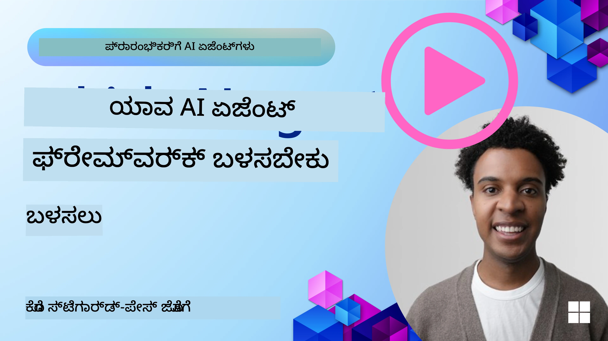

<!--
CO_OP_TRANSLATOR_METADATA:
{
  "original_hash": "7120197753abacc827b64ac2d5d6966f",
  "translation_date": "2025-12-03T17:07:12+00:00",
  "source_file": "02-explore-agentic-frameworks/README.md",
  "language_code": "kn"
}
-->
[](https://youtu.be/ODwF-EZo_O8?si=1xoy_B9RNQfrYdF7)

> _(ಈ ಪಾಠದ ವಿಡಿಯೋವನ್ನು ನೋಡಲು ಮೇಲಿನ ಚಿತ್ರವನ್ನು ಕ್ಲಿಕ್ ಮಾಡಿ)_

# AI ಏಜೆಂಟ್ ಫ್ರೇಮ್‌ವರ್ಕ್‌ಗಳನ್ನು ಅನ್ವೇಷಿಸಿ

AI ಏಜೆಂಟ್ ಫ್ರೇಮ್‌ವರ್ಕ್‌ಗಳು AI ಏಜೆಂಟ್‌ಗಳನ್ನು ರಚಿಸಲು, ನಿಯೋಜಿಸಲು ಮತ್ತು ನಿರ್ವಹಿಸಲು ಸುಲಭವಾಗುವಂತೆ ಮಾಡಲಾದ ಸಾಫ್ಟ್‌ವೇರ್ ಪ್ಲಾಟ್‌ಫಾರ್ಮ್‌ಗಳಾಗಿವೆ. ಈ ಫ್ರೇಮ್‌ವರ್ಕ್‌ಗಳು ಡೆವಲಪರ್‌ಗಳಿಗೆ ಪೂರ್ವ-ನಿರ್ಮಿತ ಘಟಕಗಳು, ಅಬ್ಸ್ಟ್ರಾಕ್ಷನ್‌ಗಳು ಮತ್ತು ಸಾಧನಗಳನ್ನು ಒದಗಿಸುತ್ತವೆ, ಇದು ಸಂಕೀರ್ಣ AI ವ್ಯವಸ್ಥೆಗಳ ಅಭಿವೃದ್ಧಿಯನ್ನು ಸುಗಮಗೊಳಿಸುತ್ತದೆ.

AI ಏಜೆಂಟ್ ಅಭಿವೃದ್ಧಿಯ ಸಾಮಾನ್ಯ ಸವಾಲುಗಳಿಗೆ ಮಾನದಂಡಿತ ವಿಧಾನಗಳನ್ನು ಒದಗಿಸುವ ಮೂಲಕ ಈ ಫ್ರೇಮ್‌ವರ್ಕ್‌ಗಳು ಡೆವಲಪರ್‌ಗಳಿಗೆ ತಮ್ಮ ಅಪ್ಲಿಕೇಶನ್‌ಗಳ ವಿಶಿಷ್ಟ ಅಂಶಗಳ ಮೇಲೆ ಗಮನಹರಿಸಲು ಸಹಾಯ ಮಾಡುತ್ತವೆ. ಇವು AI ವ್ಯವಸ್ಥೆಗಳನ್ನು ನಿರ್ಮಿಸುವಲ್ಲಿ ಮಾಪನೀಯತೆ, ಪ್ರವೇಶಾರ್ಹತೆ ಮತ್ತು ದಕ್ಷತೆಯನ್ನು ಹೆಚ್ಚಿಸುತ್ತವೆ.

## ಪರಿಚಯ 

ಈ ಪಾಠದಲ್ಲಿ ನಾವು ಚರ್ಚಿಸುವುದು:

- AI ಏಜೆಂಟ್ ಫ್ರೇಮ್‌ವರ್ಕ್‌ಗಳು ಏನು ಮತ್ತು ಡೆವಲಪರ್‌ಗಳು ಏನನ್ನು ಸಾಧಿಸಲು ಸಾಧ್ಯವಾಗುತ್ತದೆ?
- ತಂಡಗಳು ಈ ಫ್ರೇಮ್‌ವರ್ಕ್‌ಗಳನ್ನು ಬಳಸಿಕೊಂಡು ಹೇಗೆ ವೇಗವಾಗಿ ಪ್ರೊಟೋಟೈಪ್ ಮಾಡಬಹುದು, ಪುನರಾವೃತ್ತಿ ಮಾಡಬಹುದು ಮತ್ತು ಏಜೆಂಟ್‌ಗಳ ಸಾಮರ್ಥ್ಯವನ್ನು ಸುಧಾರಿಸಬಹುದು?
- Microsoft <a href="https://aka.ms/ai-agents/autogen" target="_blank">AutoGen</a>, <a href="https://aka.ms/ai-agents-beginners/semantic-kernel" target="_blank">Semantic Kernel</a>, ಮತ್ತು <a href="https://aka.ms/ai-agents-beginners/ai-agent-service" target="_blank">Azure AI Agent Service</a> ರಚಿಸಿದ ಫ್ರೇಮ್‌ವರ್ಕ್‌ಗಳು ಮತ್ತು ಸಾಧನಗಳ ನಡುವಿನ ವ್ಯತ್ಯಾಸಗಳು ಏನು?
- ನನ್ನ ಅಸ್ತಿತ್ವದಲ್ಲಿರುವ Azure ಪರಿಸರದ ಸಾಧನಗಳನ್ನು ನೇರವಾಗಿ ಸಂಯೋಜಿಸಬಹುದೇ ಅಥವಾ ಪ್ರತ್ಯೇಕ ಪರಿಹಾರಗಳ ಅಗತ್ಯವಿದೆಯೇ?
- Azure AI Agents ಸೇವೆ ಏನು ಮತ್ತು ಇದು ನನಗೆ ಹೇಗೆ ಸಹಾಯ ಮಾಡುತ್ತಿದೆ?

## ಕಲಿಕೆಯ ಗುರಿಗಳು

ಈ ಪಾಠದ ಗುರಿಗಳು ನಿಮಗೆ ಸಹಾಯ ಮಾಡುವುದು:

- AI ಏಜೆಂಟ್ ಫ್ರೇಮ್‌ವರ್ಕ್‌ಗಳ ಪಾತ್ರವನ್ನು ಅರ್ಥಮಾಡಿಕೊಳ್ಳುವುದು.
- ಬುದ್ಧಿವಂತ ಏಜೆಂಟ್‌ಗಳನ್ನು ನಿರ್ಮಿಸಲು AI ಏಜೆಂಟ್ ಫ್ರೇಮ್‌ವರ್ಕ್‌ಗಳನ್ನು ಹೇಗೆ ಬಳಸಬಹುದು ಎಂಬುದು.
- AI ಏಜೆಂಟ್ ಫ್ರೇಮ್‌ವರ್ಕ್‌ಗಳಿಂದ ಸಕ್ರಿಯಗೊಳಿಸಲಾದ ಪ್ರಮುಖ ಸಾಮರ್ಥ್ಯಗಳು.
- AutoGen, Semantic Kernel, ಮತ್ತು Azure AI Agent Service ನಡುವಿನ ವ್ಯತ್ಯಾಸಗಳು.

## AI ಏಜೆಂಟ್ ಫ್ರೇಮ್‌ವರ್ಕ್‌ಗಳು ಏನು ಮತ್ತು ಡೆವಲಪರ್‌ಗಳು ಏನನ್ನು ಸಾಧಿಸಲು ಸಾಧ್ಯವಾಗುತ್ತದೆ?

ಪಾರಂಪರಿಕ AI ಫ್ರೇಮ್‌ವರ್ಕ್‌ಗಳು ನಿಮ್ಮ ಅಪ್ಲಿಕೇಶನ್‌ಗಳಲ್ಲಿ AI ಅನ್ನು ಸಂಯೋಜಿಸಲು ಮತ್ತು ಈ ಅಪ್ಲಿಕೇಶನ್‌ಗಳನ್ನು ಕೆಳಗಿನ ರೀತಿಯಲ್ಲಿ ಉತ್ತಮಗೊಳಿಸಲು ಸಹಾಯ ಮಾಡುತ್ತವೆ:

- **ವೈಯಕ್ತಿಕೀಕರಣ**: AI ಬಳಕೆದಾರರ ವರ್ತನೆ ಮತ್ತು ಆದ್ಯತೆಯನ್ನು ವಿಶ್ಲೇಷಿಸಿ ವೈಯಕ್ತಿಕ ಶಿಫಾರಸುಗಳು, ವಿಷಯ ಮತ್ತು ಅನುಭವಗಳನ್ನು ಒದಗಿಸಬಹುದು.
ಉದಾಹರಣೆ: Netflix ಮುಂತಾದ ಸ್ಟ್ರೀಮಿಂಗ್ ಸೇವೆಗಳು AI ಅನ್ನು ಬಳಸಿಕೊಂಡು ವೀಕ್ಷಣಾ ಇತಿಹಾಸದ ಆಧಾರದ ಮೇಲೆ ಚಲನಚಿತ್ರಗಳು ಮತ್ತು ಶೋಗಳನ್ನು ಶಿಫಾರಸು ಮಾಡುತ್ತವೆ, ಬಳಕೆದಾರರ ತೊಡಗುವಿಕೆ ಮತ್ತು ತೃಪ್ತಿಯನ್ನು ಹೆಚ್ಚಿಸುತ್ತದೆ.
- **ಸ್ವಯಂಚಾಲಿತ ಮತ್ತು ದಕ್ಷತೆ**: AI ಪುನರಾವೃತ್ತಿ ಕಾರ್ಯಗಳನ್ನು ಸ್ವಯಂಚಾಲಿತಗೊಳಿಸಬಹುದು, ಕಾರ್ಯಪ್ರವಾಹಗಳನ್ನು ಸುಗಮಗೊಳಿಸಬಹುದು ಮತ್ತು ಕಾರ್ಯಾಚರಣಾ ದಕ್ಷತೆಯನ್ನು ಸುಧಾರಿಸಬಹುದು.
ಉದಾಹರಣೆ: ಗ್ರಾಹಕ ಸೇವಾ ಅಪ್ಲಿಕೇಶನ್‌ಗಳು ಸಾಮಾನ್ಯ ವಿಚಾರಣೆಗಳನ್ನು ನಿರ್ವಹಿಸಲು AI-ಚಾಲಿತ ಚಾಟ್‌ಬಾಟ್‌ಗಳನ್ನು ಬಳಸುತ್ತವೆ, ಪ್ರತಿಕ್ರಿಯಾ ಸಮಯವನ್ನು ಕಡಿಮೆ ಮಾಡುತ್ತವೆ ಮತ್ತು ಹೆಚ್ಚು ಸಂಕೀರ್ಣ ಸಮಸ್ಯೆಗಳಿಗೆ ಮಾನವ ಏಜೆಂಟ್‌ಗಳನ್ನು ಮುಕ್ತಗೊಳಿಸುತ್ತವೆ.
- **ಬಳಕೆದಾರ ಅನುಭವವನ್ನು ಸುಧಾರಿಸುವುದು**: AI ಧ್ವನಿ ಗುರುತಿಸುವಿಕೆ, ನೈಸರ್ಗಿಕ ಭಾಷಾ ಪ್ರಕ್ರಿಯೆ ಮತ್ತು ಮುನ್ಸೂಚನೆಯ ಪಠ್ಯವನ್ನು ಒದಗಿಸುವ ಮೂಲಕ ಒಟ್ಟು ಬಳಕೆದಾರ ಅನುಭವವನ್ನು ಸುಧಾರಿಸಬಹುದು.
ಉದಾಹರಣೆ: Siri ಮತ್ತು Google Assistant ಮುಂತಾದ ವರ್ಚುವಲ್ ಸಹಾಯಕರನ್ನು ಬಳಕೆದಾರರು ತಮ್ಮ ಸಾಧನಗಳೊಂದಿಗೆ ಸಂವಹನ ನಡೆಸಲು ಸುಲಭವಾಗುವಂತೆ ಧ್ವನಿ ಆಜ್ಞೆಗಳನ್ನು ಅರ್ಥಮಾಡಿಕೊಳ್ಳಲು ಮತ್ತು ಪ್ರತಿಕ್ರಿಯಿಸಲು AI ಅನ್ನು ಬಳಸುತ್ತವೆ.

### ಇದು ಎಲ್ಲವೂ ಚೆನ್ನಾಗಿದೆ, ಹಾಗಾದರೆ AI ಏಜೆಂಟ್ ಫ್ರೇಮ್‌ವರ್ಕ್‌ಗಳ ಅಗತ್ಯವೇನು?

AI ಏಜೆಂಟ್ ಫ್ರೇಮ್‌ವರ್ಕ್‌ಗಳು ಕೇವಲ AI ಫ್ರೇಮ್‌ವರ್ಕ್‌ಗಳಿಗಿಂತ ಹೆಚ್ಚು ಏನೋವನ್ನು ಪ್ರತಿನಿಧಿಸುತ್ತವೆ. ಇವು ಬಳಕೆದಾರರು, ಇತರ ಏಜೆಂಟ್‌ಗಳು ಮತ್ತು ಪರಿಸರದೊಂದಿಗೆ ಸಂವಹನ ನಡೆಸಲು, ನಿರ್ದಿಷ್ಟ ಗುರಿಗಳನ್ನು ಸಾಧಿಸಲು ಬುದ್ಧಿವಂತ ಏಜೆಂಟ್‌ಗಳನ್ನು ರಚಿಸಲು ಸಕ್ರಿಯಗೊಳಿಸಲು ವಿನ್ಯಾಸಗೊಳಿಸಲಾಗಿದೆ. ಈ ಏಜೆಂಟ್‌ಗಳು ಸ್ವಾಯತ್ತ ವರ್ತನೆಯನ್ನು ತೋರಿಸಬಹುದು, ನಿರ್ಧಾರಗಳನ್ನು ತೆಗೆದುಕೊಳ್ಳಬಹುದು ಮತ್ತು ಬದಲಾಯಿಸುತ್ತಿರುವ ಪರಿಸ್ಥಿತಿಗಳಿಗೆ ಹೊಂದಿಕೊಳ್ಳಬಹುದು. AI ಏಜೆಂಟ್ ಫ್ರೇಮ್‌ವರ್ಕ್‌ಗಳಿಂದ ಸಕ್ರಿಯಗೊಳಿಸಲಾದ ಕೆಲವು ಪ್ರಮುಖ ಸಾಮರ್ಥ್ಯಗಳನ್ನು ನೋಡೋಣ:

- **ಏಜೆಂಟ್ ಸಹಕಾರ ಮತ್ತು ಸಂಯೋಜನೆ**: ಬಹು AI ಏಜೆಂಟ್‌ಗಳನ್ನು ರಚಿಸಲು, ಸಂವಹನ ನಡೆಸಲು ಮತ್ತು ಸಂಕೀರ್ಣ ಕಾರ್ಯಗಳನ್ನು ಪರಿಹರಿಸಲು ಸಂಯೋಜಿಸಲು ಸಕ್ರಿಯಗೊಳಿಸಿ.
- **ಕಾರ್ಯ ಸ್ವಯಂಚಾಲಿತ ಮತ್ತು ನಿರ್ವಹಣೆ**: ಬಹು ಹಂತದ ಕಾರ್ಯಪ್ರವಾಹಗಳನ್ನು ಸ್ವಯಂಚಾಲಿತಗೊಳಿಸಲು, ಕಾರ್ಯ ನಿಯೋಜನೆ ಮತ್ತು ಏಜೆಂಟ್‌ಗಳ ನಡುವೆ ಡೈನಾಮಿಕ್ ಕಾರ್ಯ ನಿರ್ವಹಣೆಗೆ ವ್ಯವಸ್ಥೆಗಳನ್ನು ಒದಗಿಸಿ.
- **ಪರಿಸ್ಥಿತಿಯ ಅರ್ಥಮಾಡಿಕೊಳ್ಳುವಿಕೆ ಮತ್ತು ಹೊಂದಾಣಿಕೆ**: ಏಜೆಂಟ್‌ಗಳಿಗೆ ಪರಿಸ್ಥಿತಿಯನ್ನು ಅರ್ಥಮಾಡಿಕೊಳ್ಳುವ, ಬದಲಾಯಿಸುತ್ತಿರುವ ಪರಿಸರಗಳಿಗೆ ಹೊಂದಿಕೊಳ್ಳುವ ಮತ್ತು ರಿಯಲ್-ಟೈಮ್ ಮಾಹಿತಿಯ ಆಧಾರದ ಮೇಲೆ ನಿರ್ಧಾರಗಳನ್ನು ತೆಗೆದುಕೊಳ್ಳುವ ಸಾಮರ್ಥ್ಯವನ್ನು ಒದಗಿಸಿ.

ಹೀಗಾಗಿ, ಒಟ್ಟಿನಲ್ಲಿ, ಏಜೆಂಟ್‌ಗಳು ನಿಮಗೆ ಹೆಚ್ಚು ಮಾಡಲು, ಸ್ವಯಂಚಾಲಿತವನ್ನು ಮುಂದಿನ ಹಂತಕ್ಕೆ ತೆಗೆದುಕೊಳ್ಳಲು, ಮತ್ತು ತಮ್ಮ ಪರಿಸರದಿಂದ ಹೊಂದಿಕೊಳ್ಳುವ ಮತ್ತು ಕಲಿಯುವ ಬುದ್ಧಿವಂತ ವ್ಯವಸ್ಥೆಗಳನ್ನು ರಚಿಸಲು ಅವಕಾಶ ನೀಡುತ್ತವೆ.

## ಏಜೆಂಟ್‌ಗಳ ಸಾಮರ್ಥ್ಯವನ್ನು ವೇಗವಾಗಿ ಪ್ರೊಟೋಟೈಪ್ ಮಾಡುವುದು, ಪುನರಾವೃತ್ತಿ ಮಾಡುವುದು ಮತ್ತು ಸುಧಾರಿಸುವುದು ಹೇಗೆ?

ಇದು ವೇಗವಾಗಿ ಬದಲಾಗುತ್ತಿರುವ ಕ್ಷೇತ್ರವಾಗಿದೆ, ಆದರೆ ಹೆಚ್ಚಿನ AI ಏಜೆಂಟ್ ಫ್ರೇಮ್‌ವರ್ಕ್‌ಗಳಲ್ಲಿ ಸಾಮಾನ್ಯವಾಗಿರುವ ಕೆಲವು ಅಂಶಗಳಿವೆ, ಉದಾಹರಣೆಗೆ ಮಾಡ್ಯೂಲ್ ಘಟಕಗಳು, ಸಹಕಾರ ಸಾಧನಗಳು ಮತ್ತು ರಿಯಲ್-ಟೈಮ್ ಕಲಿಕೆ. ಇವುಗಳ ಬಗ್ಗೆ ವಿವರವಾಗಿ ತಿಳಿಯೋಣ:

- **ಮಾಡ್ಯೂಲ್ ಘಟಕಗಳನ್ನು ಬಳಸಿ**: AI SDKಗಳು ಪೂರ್ವ-ನಿರ್ಮಿತ ಘಟಕಗಳನ್ನು ಒದಗಿಸುತ್ತವೆ, ಉದಾಹರಣೆಗೆ AI ಮತ್ತು ಮೆಮೊರಿ ಕನೆಕ್ಟರ್‌ಗಳು, ನೈಸರ್ಗಿಕ ಭಾಷೆ ಅಥವಾ ಕೋಡ್ ಪ್ಲಗಿನ್‌ಗಳನ್ನು ಬಳಸುವ ಕಾರ್ಯ ಕರೆಯುವುದು, ಪ್ರಾಂಪ್ಟ್ ಟೆಂಪ್ಲೇಟುಗಳು ಮತ್ತು ಇನ್ನಷ್ಟು.
- **ಸಹಕಾರ ಸಾಧನಗಳನ್ನು ಬಳಸಿಕೊಳ್ಳಿ**: ನಿರ್ದಿಷ್ಟ ಪಾತ್ರಗಳು ಮತ್ತು ಕಾರ್ಯಗಳೊಂದಿಗೆ ಏಜೆಂಟ್‌ಗಳನ್ನು ವಿನ್ಯಾಸಗೊಳಿಸಿ, ಸಹಕಾರ ಕಾರ್ಯಪ್ರವಾಹಗಳನ್ನು ಪರೀಕ್ಷಿಸಲು ಮತ್ತು ಸುಧಾರಿಸಲು ಸಕ್ರಿಯಗೊಳಿಸಿ.
- **ರಿಯಲ್-ಟೈಮ್‌ನಲ್ಲಿ ಕಲಿಯಿರಿ**: ಪ್ರತಿಕ್ರಿಯಾ ಲೂಪ್‌ಗಳನ್ನು ಅನುಷ್ಠಾನಗೊಳಿಸಿ, ಏಜೆಂಟ್‌ಗಳು ಸಂವಹನಗಳಿಂದ ಕಲಿಯುತ್ತವೆ ಮತ್ತು ತಮ್ಮ ವರ್ತನೆಯನ್ನು ಡೈನಾಮಿಕ್ ಆಗಿ ಹೊಂದಿಸುತ್ತವೆ.

### ಮಾಡ್ಯೂಲ್ ಘಟಕಗಳನ್ನು ಬಳಸಿ

Microsoft Semantic Kernel ಮತ್ತು LangChain ಮುಂತಾದ SDKಗಳು ಪೂರ್ವ-ನಿರ್ಮಿತ ಘಟಕಗಳನ್ನು ಒದಗಿಸುತ್ತವೆ, ಉದಾಹರಣೆಗೆ AI ಕನೆಕ್ಟರ್‌ಗಳು, ಪ್ರಾಂಪ್ಟ್ ಟೆಂಪ್ಲೇಟುಗಳು ಮತ್ತು ಮೆಮೊರಿ ನಿರ್ವಹಣೆ.

**ತಂಡಗಳು ಇದನ್ನು ಹೇಗೆ ಬಳಸಬಹುದು**: ತಂಡಗಳು ಈ ಘಟಕಗಳನ್ನು ವೇಗವಾಗಿ ಸಂಯೋಜಿಸಿ ಕಾರ್ಯನಿರ್ವಹಣಾ ಪ್ರೊಟೋಟೈಪ್ ಅನ್ನು ರಚಿಸಬಹುದು, ಇದು ಶೂನ್ಯದಿಂದ ಪ್ರಾರಂಭಿಸದೆ ಪ್ರಯೋಗ ಮತ್ತು ಪುನರಾವೃತ್ತಿಗೆ ಅವಕಾಶ ನೀಡುತ್ತದೆ.

**ಅದು ಪ್ರಾಯೋಗಿಕವಾಗಿ ಹೇಗೆ ಕೆಲಸ ಮಾಡುತ್ತದೆ**: ಬಳಕೆದಾರರ ಇನ್‌ಪುಟ್‌ನಿಂದ ಮಾಹಿತಿಯನ್ನು ಹೊರತೆಗೆದುಕೊಳ್ಳಲು ಪೂರ್ವ-ನಿರ್ಮಿತ ಪಾರ್ಸರ್ ಅನ್ನು ಬಳಸಬಹುದು, ಡೇಟಾವನ್ನು ಸಂಗ್ರಹಿಸಲು ಮತ್ತು ಹಿಂತಿರುಗಿಸಲು ಮೆಮೊರಿ ಮೋಡ್ಯೂಲ್ ಅನ್ನು ಬಳಸಬಹುದು, ಮತ್ತು ಬಳಕೆದಾರರೊಂದಿಗೆ ಸಂವಹನ ನಡೆಸಲು ಪ್ರಾಂಪ್ಟ್ ಜನರೇಟರ್ ಅನ್ನು ಬಳಸಬಹುದು—all of this without having to build these components from scratch.

**ಉದಾಹರಣೆಯ ಕೋಡ್**. Semantic Kernel Python ಮತ್ತು .Net ಬಳಸಿ AI ಕನೆಕ್ಟರ್ ಅನ್ನು ಹೇಗೆ ಬಳಸಬಹುದು ಎಂಬುದರ ಉದಾಹರಣೆಗಳನ್ನು ನೋಡೋಣ:

``` python
# ಸೆಮ್ಯಾಂಟಿಕ್ ಕರ್ಣಲ್ ಪೈಥಾನ್ ಉದಾಹರಣೆ

import asyncio
from typing import Annotated

from semantic_kernel.connectors.ai import FunctionChoiceBehavior
from semantic_kernel.connectors.ai.open_ai import AzureChatCompletion, AzureChatPromptExecutionSettings
from semantic_kernel.contents import ChatHistory
from semantic_kernel.functions import kernel_function
from semantic_kernel.kernel import Kernel

# ಸಂಭಾಷಣೆಯ ಸಂದರ್ಭವನ್ನು ಹೊಂದಿಸಲು ಚಾಟ್ ಇತಿಹಾಸ ವಸ್ತುವನ್ನು ವ್ಯಾಖ್ಯಾನಿಸಿ
chat_history = ChatHistory()
chat_history.add_user_message("I'd like to go to New York on January 1, 2025")


# ಪ್ರಯಾಣವನ್ನು ಬುಕ್ ಮಾಡಲು ಕಾರ್ಯವನ್ನು ಹೊಂದಿರುವ ಮಾದರಿ ಪ್ಲಗಿನ್ ಅನ್ನು ವ್ಯಾಖ್ಯಾನಿಸಿ
class BookTravelPlugin:
    """A Sample Book Travel Plugin"""

    @kernel_function(name="book_flight", description="Book travel given location and date")
    async def book_flight(
        self, date: Annotated[str, "The date of travel"], location: Annotated[str, "The location to travel to"]
    ) -> str:
        return f"Travel was booked to {location} on {date}"

# ಕರ್ಣಲ್ ಅನ್ನು ರಚಿಸಿ
kernel = Kernel()

# ಮಾದರಿ ಪ್ಲಗಿನ್ ಅನ್ನು ಕರ್ಣಲ್ ವಸ್ತುವಿಗೆ ಸೇರಿಸಿ
kernel.add_plugin(BookTravelPlugin(), plugin_name="book_travel")

# ಅಜೂರ್ ಓಪನ್‌ಎಐ ಎಐ ಕನೆಕ್ಟರ್ ಅನ್ನು ವ್ಯಾಖ್ಯಾನಿಸಿ
chat_service = AzureChatCompletion(
    deployment_name="YOUR_DEPLOYMENT_NAME", 
    api_key="YOUR_API_KEY", 
    endpoint="https://<your-resource>.azure.openai.com/",
)

# ಸ್ವಯಂ-ಕಾರ್ಯ ಕರೆಯುವಿಕೆಯನ್ನು ಹೊಂದಿಸಲು ಮಾದರಿಯನ್ನು ಕಾನ್ಫಿಗರ್ ಮಾಡಲು ವಿನಂತಿ ಸೆಟ್ಟಿಂಗ್‌ಗಳನ್ನು ವ್ಯಾಖ್ಯಾನಿಸಿ
request_settings = AzureChatPromptExecutionSettings(function_choice_behavior=FunctionChoiceBehavior.Auto())


async def main():
    # ನೀಡಲಾದ ಚಾಟ್ ಇತಿಹಾಸ ಮತ್ತು ವಿನಂತಿ ಸೆಟ್ಟಿಂಗ್‌ಗಳಿಗೆ ಮಾದರಿಯೊಂದಿಗೆ ವಿನಂತಿ ಮಾಡಿ
    # ಮಾದರಿ ಕರೆಯಲು ವಿನಂತಿ ಮಾಡುವ ಮಾದರಿಯನ್ನು ಕರ್ಣಲ್ ಹೊಂದಿದೆ
    response = await chat_service.get_chat_message_content(
        chat_history=chat_history, settings=request_settings, kernel=kernel
    )
    assert response is not None

    """
    Note: In the auto function calling process, the model determines it can invoke the 
    `BookTravelPlugin` using the `book_flight` function, supplying the necessary arguments. 
    
    For example:

    "tool_calls": [
        {
            "id": "call_abc123",
            "type": "function",
            "function": {
                "name": "BookTravelPlugin-book_flight",
                "arguments": "{'location': 'New York', 'date': '2025-01-01'}"
            }
        }
    ]

    Since the location and date arguments are required (as defined by the kernel function), if the 
    model lacks either, it will prompt the user to provide them. For instance:

    User: Book me a flight to New York.
    Model: Sure, I'd love to help you book a flight. Could you please specify the date?
    User: I want to travel on January 1, 2025.
    Model: Your flight to New York on January 1, 2025, has been successfully booked. Safe travels!
    """

    print(f"`{response}`")
    # ಉದಾಹರಣೆ ಎಐ ಮಾದರಿ ಪ್ರತಿಕ್ರಿಯೆ: `ನಿಮ್ಮ 2025 ಜನವರಿ 1 ರಂದು ನ್ಯೂಯಾರ್ಕ್‌ಗೆ ವಿಮಾನವನ್ನು ಯಶಸ್ವಿಯಾಗಿ ಬುಕ್ ಮಾಡಲಾಗಿದೆ. ಸುರಕ್ಷಿತ ಪ್ರಯಾಣ! ✈️🗽`

    # ನಮ್ಮ ಚಾಟ್ ಇತಿಹಾಸ ಸಂದರ್ಭಕ್ಕೆ ಮಾದರಿಯ ಪ್ರತಿಕ್ರಿಯೆಯನ್ನು ಸೇರಿಸಿ
    chat_history.add_assistant_message(response.content)


if __name__ == "__main__":
    asyncio.run(main())
```
```csharp
// Semantic Kernel C# example

using Microsoft.SemanticKernel;
using Microsoft.SemanticKernel.ChatCompletion;
using System.ComponentModel;
using Microsoft.SemanticKernel.Connectors.AzureOpenAI;

ChatHistory chatHistory = [];
chatHistory.AddUserMessage("I'd like to go to New York on January 1, 2025");

var kernelBuilder = Kernel.CreateBuilder();
kernelBuilder.AddAzureOpenAIChatCompletion(
    deploymentName: "NAME_OF_YOUR_DEPLOYMENT",
    apiKey: "YOUR_API_KEY",
    endpoint: "YOUR_AZURE_ENDPOINT"
);
kernelBuilder.Plugins.AddFromType<BookTravelPlugin>("BookTravel"); 
var kernel = kernelBuilder.Build();

var settings = new AzureOpenAIPromptExecutionSettings()
{
    FunctionChoiceBehavior = FunctionChoiceBehavior.Auto()
};

var chatCompletion = kernel.GetRequiredService<IChatCompletionService>();

var response = await chatCompletion.GetChatMessageContentAsync(chatHistory, settings, kernel);

/*
Behind the scenes, the model recognizes the tool to call, what arguments it already has (location) and (date)
{

"tool_calls": [
    {
        "id": "call_abc123",
        "type": "function",
        "function": {
            "name": "BookTravelPlugin-book_flight",
            "arguments": "{'location': 'New York', 'date': '2025-01-01'}"
        }
    }
]
*/

Console.WriteLine(response.Content);
chatHistory.AddMessage(response!.Role, response!.Content!);

// Example AI Model Response: Your flight to New York on January 1, 2025, has been successfully booked. Safe travels! ✈️🗽

// Define a plugin that contains the function to book travel
public class BookTravelPlugin
{
    [KernelFunction("book_flight")]
    [Description("Book travel given location and date")]
    public async Task<string> BookFlight(DateTime date, string location)
    {
        return await Task.FromResult( $"Travel was booked to {location} on {date}");
    }
}
```

ಈ ಉದಾಹರಣೆಯಿಂದ ನೀವು ನೋಡಬಹುದು, ಬಳಕೆದಾರರ ಇನ್‌ಪುಟ್‌ನಿಂದ ಮೂಲ, ಗಮ್ಯಸ್ಥಾನ ಮತ್ತು ವಿಮಾನ ಬುಕಿಂಗ್ ವಿನಂತಿಯ ದಿನಾಂಕವನ್ನು ಹೊರತೆಗೆದುಕೊಳ್ಳಲು ಪೂರ್ವ-ನಿರ್ಮಿತ ಪಾರ್ಸರ್ ಅನ್ನು ಹೇಗೆ ಬಳಸಬಹುದು. ಈ ಮಾಡ್ಯೂಲ್ ವಿಧಾನವು ಉನ್ನತ ಮಟ್ಟದ ತರ್ಕದ ಮೇಲೆ ಗಮನಹರಿಸಲು ನಿಮಗೆ ಅವಕಾಶ ನೀಡುತ್ತದೆ.

### ಸಹಕಾರ ಸಾಧನಗಳನ್ನು ಬಳಸಿಕೊಳ್ಳಿ

CrewAI, Microsoft AutoGen, ಮತ್ತು Semantic Kernel ಮುಂತಾದ ಫ್ರೇಮ್‌ವರ್ಕ್‌ಗಳು ಬಹು ಏಜೆಂಟ್‌ಗಳನ್ನು ರಚಿಸಲು ಸಹಾಯ ಮಾಡುತ್ತವೆ.

**ತಂಡಗಳು ಇದನ್ನು ಹೇಗೆ ಬಳಸಬಹುದು**: ತಂಡಗಳು ನಿರ್ದಿಷ್ಟ ಪಾತ್ರಗಳು ಮತ್ತು ಕಾರ್ಯಗಳೊಂದಿಗೆ ಏಜೆಂಟ್‌ಗಳನ್ನು ವಿನ್ಯಾಸಗೊಳಿಸಬಹುದು, ಸಹಕಾರ ಕಾರ್ಯಪ್ರವಾಹಗಳನ್ನು ಪರೀಕ್ಷಿಸಲು ಮತ್ತು ಸುಧಾರಿಸಲು ಮತ್ತು ಒಟ್ಟು ವ್ಯವಸ್ಥೆಯ ದಕ್ಷತೆಯನ್ನು ಸುಧಾರಿಸಲು.

**ಅದು ಪ್ರಾಯೋಗಿಕವಾಗಿ ಹೇಗೆ ಕೆಲಸ ಮಾಡುತ್ತದೆ**: ನೀವು ಡೇಟಾ ಹಿಂಪಡೆಯುವುದು, ವಿಶ್ಲೇಷಣೆ ಅಥವಾ ನಿರ್ಧಾರ ತೆಗೆದುಕೊಳ್ಳುವುದು ಮುಂತಾದ ವಿಶೇಷ ಕಾರ್ಯವನ್ನು ಹೊಂದಿರುವ ಏಜೆಂಟ್‌ಗಳ ತಂಡವನ್ನು ರಚಿಸಬಹುದು. ಈ ಏಜೆಂಟ್‌ಗಳು ಮಾಹಿತಿ ಹಂಚಿಕೊಳ್ಳಬಹುದು ಮತ್ತು ಬಳಕೆದಾರರ ಪ್ರಶ್ನೆಗೆ ಉತ್ತರಿಸುವುದು ಅಥವಾ ಕಾರ್ಯವನ್ನು ಪೂರ್ಣಗೊಳಿಸುವುದು ಮುಂತಾದ ಸಾಮಾನ್ಯ ಗುರಿಯನ್ನು ಸಾಧಿಸಲು ಸಂವಹನ ನಡೆಸಬಹುದು.

**ಉದಾಹರಣೆಯ ಕೋಡ್ (AutoGen)**:

```python
# ಏಜೆಂಟ್‌ಗಳನ್ನು ರಚಿಸಿ, ನಂತರ ಅವರು ಒಟ್ಟಿಗೆ ಕೆಲಸ ಮಾಡಬಹುದಾದ ರೌಂಡ್ ರಾಬಿನ್ ವೇಳಾಪಟ್ಟಿಯನ್ನು ರಚಿಸಿ, ಈ ಸಂದರ್ಭದಲ್ಲಿ ಕ್ರಮದಲ್ಲಿ

# ಡೇಟಾ ಹಿಂಪಡೆಯುವ ಏಜೆಂಟ್
# ಡೇಟಾ ವಿಶ್ಲೇಷಣಾ ಏಜೆಂಟ್
# ನಿರ್ಧಾರ ತೆಗೆದುಕೊಳ್ಳುವ ಏಜೆಂಟ್

agent_retrieve = AssistantAgent(
    name="dataretrieval",
    model_client=model_client,
    tools=[retrieve_tool],
    system_message="Use tools to solve tasks."
)

agent_analyze = AssistantAgent(
    name="dataanalysis",
    model_client=model_client,
    tools=[analyze_tool],
    system_message="Use tools to solve tasks."
)

# ಬಳಕೆದಾರ "APPROVE" ಎಂದು ಹೇಳಿದಾಗ ಸಂಭಾಷಣೆ ಮುಗಿಯುತ್ತದೆ
termination = TextMentionTermination("APPROVE")

user_proxy = UserProxyAgent("user_proxy", input_func=input)

team = RoundRobinGroupChat([agent_retrieve, agent_analyze, user_proxy], termination_condition=termination)

stream = team.run_stream(task="Analyze data", max_turns=10)
# ಸ್ಕ್ರಿಪ್ಟ್‌ನಲ್ಲಿ ಚಲಾಯಿಸುವಾಗ asyncio.run(...) ಅನ್ನು ಬಳಸಿ.
await Console(stream)
```

ಹಿಂದಿನ ಕೋಡ್‌ನಲ್ಲಿ ನೀವು ನೋಡಬಹುದು, ಡೇಟಾವನ್ನು ವಿಶ್ಲೇಷಿಸಲು ಬಹು ಏಜೆಂಟ್‌ಗಳನ್ನು ಒಳಗೊಂಡಿರುವ ಕಾರ್ಯವನ್ನು ರಚಿಸುವುದು ಹೇಗೆ. ಪ್ರತಿ ಏಜೆಂಟ್ ನಿರ್ದಿಷ್ಟ ಕಾರ್ಯವನ್ನು ನಿರ್ವಹಿಸುತ್ತದೆ, ಮತ್ತು ಕಾರ್ಯವನ್ನು ನಿರ್ದಿಷ್ಟ ಫಲಿತಾಂಶವನ್ನು ಸಾಧಿಸಲು ಏಜೆಂಟ್‌ಗಳನ್ನು ಸಂಯೋಜಿಸುವ ಮೂಲಕ ಕಾರ್ಯಗತಗೊಳಿಸಲಾಗುತ್ತದೆ. ವಿಶೇಷ ಪಾತ್ರಗಳನ್ನು ಹೊಂದಿರುವ ಸಮರ್ಪಿತ ಏಜೆಂಟ್‌ಗಳನ್ನು ರಚಿಸುವ ಮೂಲಕ, ನೀವು ಕಾರ್ಯದ ದಕ್ಷತೆ ಮತ್ತು ಕಾರ್ಯಕ್ಷಮತೆಯನ್ನು ಸುಧಾರಿಸಬಹುದು.

### ರಿಯಲ್-ಟೈಮ್‌ನಲ್ಲಿ ಕಲಿಯಿರಿ

ಅಧುನಾತನ ಫ್ರೇಮ್‌ವರ್ಕ್‌ಗಳು ರಿಯಲ್-ಟೈಮ್ ಪರಿಸ್ಥಿತಿಯ ಅರ್ಥಮಾಡಿಕೊಳ್ಳುವಿಕೆ ಮತ್ತು ಹೊಂದಾಣಿಕೆ ಸಾಮರ್ಥ್ಯಗಳನ್ನು ಒದಗಿಸುತ್ತವೆ.

**ತಂಡಗಳು ಇದನ್ನು ಹೇಗೆ ಬಳಸಬಹುದು**: ತಂಡಗಳು ಪ್ರತಿಕ್ರಿಯಾ ಲೂಪ್‌ಗಳನ್ನು ಅನುಷ್ಠಾನಗೊಳಿಸಬಹುದು, ಏಜೆಂಟ್‌ಗಳು ಸಂವಹನಗಳಿಂದ ಕಲಿಯುತ್ತವೆ ಮತ್ತು ತಮ್ಮ ವರ್ತನೆಯನ್ನು ಡೈನಾಮಿಕ್ ಆಗಿ ಹೊಂದಿಸುತ್ತವೆ, ಇದು ಸಾಮರ್ಥ್ಯಗಳ ನಿರಂತರ ಸುಧಾರಣೆ ಮತ್ತು ಪರಿಷ್ಕರಣೆಗೆ ಕಾರಣವಾಗುತ್ತದೆ.

**ಅದು ಪ್ರಾಯೋಗಿಕವಾಗಿ ಹೇಗೆ ಕೆಲಸ ಮಾಡುತ್ತದೆ**: ಏಜೆಂಟ್‌ಗಳು ಬಳಕೆದಾರ ಪ್ರತಿಕ್ರಿಯೆ, ಪರಿಸರ ಡೇಟಾ ಮತ್ತು ಕಾರ್ಯದ ಫಲಿತಾಂಶಗಳನ್ನು ವಿಶ್ಲೇಷಿಸಿ ತಮ್ಮ ಜ್ಞಾನವನ್ನು ನವೀಕರಿಸಬಹುದು, ನಿರ್ಧಾರ-ಮೇಕಿಂಗ್ ಆಲ್ಗೊರಿದಮ್‌ಗಳನ್ನು ಹೊಂದಿಸಬಹುದು ಮತ್ತು ಸಮಯದೊಂದಿಗೆ ಕಾರ್ಯಕ್ಷಮತೆಯನ್ನು ಸುಧಾರಿಸಬಹುದು. ಈ ಪುನರಾವೃತ್ತಿ ಕಲಿಕೆಯ ಪ್ರಕ್ರಿಯೆ ಏಜೆಂಟ್‌ಗಳಿಗೆ ಬದಲಾಯಿಸುತ್ತಿರುವ ಪರಿಸ್ಥಿತಿಗಳು ಮತ್ತು ಬಳಕೆದಾರರ ಆದ್ಯತೆಯನ್ನು ಹೊಂದಿಕೊಳ್ಳಲು ಅವಕಾಶ ನೀಡುತ್ತದೆ, ಒಟ್ಟು ವ್ಯವಸ್ಥೆಯ ಪರಿಣಾಮಕಾರಿತೆಯನ್ನು ಸುಧಾರಿಸುತ್ತದೆ.

## AutoGen, Semantic Kernel ಮತ್ತು Azure AI Agent Service ನಡುವಿನ ವ್ಯತ್ಯಾಸಗಳು ಏನು?

ಈ ಫ್ರೇಮ್‌ವರ್ಕ್‌ಗಳನ್ನು ಹೋಲಿಸಲು ಅನೇಕ ಮಾರ್ಗಗಳಿವೆ, ಆದರೆ ಅವುಗಳ ವಿನ್ಯಾಸ, ಸಾಮರ್ಥ್ಯಗಳು ಮತ್ತು ಗುರಿ ಬಳಕೆ ಪ್ರಕರಣಗಳ ದೃಷ್ಟಿಯಿಂದ ಕೆಲವು ಪ್ರಮುಖ ವ್ಯತ್ಯಾಸಗಳನ್ನು ನೋಡೋಣ:

## AutoGen

AutoGen Microsoft Research's AI Frontiers Lab ಅಭಿವೃದ್ಧಿಪಡಿಸಿದ ಓಪನ್-ಸೋರ್ಸ್ ಫ್ರೇಮ್‌ವರ್ಕ್ ಆಗಿದೆ. ಇದು ಈವೆಂಟ್-ಚಾಲಿತ, ವಿತರಿತ *agentic* ಅಪ್ಲಿಕೇಶನ್‌ಗಳ ಮೇಲೆ ಕೇಂದ್ರೀಕೃತವಾಗಿದೆ, ಬಹು LLMs ಮತ್ತು SLMs, ಸಾಧನಗಳು ಮತ್ತು ಪ್ರಗತಿಶೀಲ ಬಹು-ಏಜೆಂಟ್ ವಿನ್ಯಾಸ ಮಾದರಿಗಳನ್ನು ಸಕ್ರಿಯಗೊಳಿಸುತ್ತದೆ.

AutoGen ಏಜೆಂಟ್‌ಗಳ ಮೂಲ ಪರಿಕಲ್ಪನೆಯ ಸುತ್ತ ನಿರ್ಮಿಸಲಾಗಿದೆ, ಇದು ಸ್ವಾಯತ್ತ ಘಟಕಗಳು, ಅವುಗಳ ಪರಿಸರವನ್ನು ಗ್ರಹಿಸಬಹುದು, ನಿರ್ಧಾರಗಳನ್ನು ತೆಗೆದುಕೊಳ್ಳಬಹುದು ಮತ್ತು ನಿರ್ದಿಷ್ಟ ಗುರಿಗಳನ್ನು ಸಾಧಿಸಲು ಕ್ರಮಗಳನ್ನು ಕೈಗೊಳ್ಳಬಹುದು. ಏಜೆಂಟ್‌ಗಳು ಅಸಿಂಕ್ರೋನಸ್ ಸಂದೇಶಗಳ ಮೂಲಕ ಸಂವಹನ ನಡೆಸುತ್ತವೆ, ಅವುಗಳಿಗೆ ಸ್ವತಂತ್ರವಾಗಿ ಮತ್ತು ಸಮಾಂತರವಾಗಿ ಕೆಲಸ ಮಾಡಲು ಅವಕಾಶ ನೀಡುತ್ತದೆ, ಇದು ವ್ಯವಸ್ಥೆಯ ಮಾಪನೀಯತೆ ಮತ್ತು ಪ್ರತಿಕ್ರಿಯಾಶೀಲತೆಯನ್ನು ಹೆಚ್ಚಿಸುತ್ತದೆ.

<a href="https://en.wikipedia.org/wiki/Actor_model" target="_blank">ಏಜೆಂಟ್‌ಗಳು ನಟ ಮಾದರಿಯ ಆಧಾರದ ಮೇಲೆ</a>. Wikipedia ಪ್ರಕಾರ, ನಟನು _ಸಮಕಾಲೀನ ಗಣನೆಗೆ ಮೂಲ ಕಟ್ಟಡದ ಬ್ಲಾಕ್. ಅದು ಸ್ವೀಕರಿಸಿದ ಸಂದೇಶಕ್ಕೆ ಪ್ರತಿಕ್ರಿಯೆಯಾಗಿ ಸ್ಥಳೀಯ ನಿರ್ಧಾರಗಳನ್ನು ತೆಗೆದುಕೊಳ್ಳಬಹುದು, ಹೆಚ್ಚು ನಟರನ್ನು ರಚಿಸಬಹುದು, ಹೆಚ್ಚು ಸಂದೇಶಗಳನ್ನು ಕಳುಹಿಸಬಹುದು ಮತ್ತು ಸ್ವೀಕರಿಸಿದ ಮುಂದಿನ ಸಂದೇಶಕ್ಕೆ ಹೇಗೆ ಪ್ರತಿಕ್ರಿಯಿಸಬೇಕು ಎಂಬುದನ್ನು ನಿರ್ಧರಿಸಬಹುದು_.

**ಬಳಕೆ ಪ್ರಕರಣಗಳು**: ಕೋಡ್ ಜನರೇಶನ್, ಡೇಟಾ ವಿಶ್ಲೇಷಣಾ ಕಾರ್ಯಗಳನ್ನು ಸ್ವಯಂಚಾಲಿತಗೊಳಿಸುವುದು ಮತ್ತು ಯೋಜನೆ ಮತ್ತು ಸಂಶೋಧನಾ ಕಾರ್ಯಗಳಿಗೆ ಕಸ್ಟಮ್ ಏಜೆಂಟ್‌ಗಳನ್ನು ನಿರ್ಮಿಸುವುದು.

AutoGenನ ಕೆಲವು ಪ್ರಮುಖ ಮೂಲ ಪರಿಕಲ್ಪನೆಗಳು ಇಲ್ಲಿವೆ:

- **ಏಜೆಂಟ್‌ಗಳು**. ಏಜೆಂಟ್ ಒಂದು ಸಾಫ್ಟ್‌ವೇರ್ ಘಟಕ:
  - **ಸಂದೇಶಗಳ ಮೂಲಕ ಸಂವಹನ ನಡೆಸುತ್ತದೆ**, ಈ ಸಂದೇಶಗಳು ಸಿಂಕ್ರೋನಸ್ ಅಥವಾ ಅಸಿಂಕ್ರೋನಸ್ ಆಗಿರಬಹುದು.
  - **ತನ್ನದೇ ಆದ ಸ್ಥಿತಿಯನ್ನು ನಿರ್ವಹಿಸುತ್ತದೆ**, incoming messages ಮೂಲಕ ಇದನ್ನು ಬದಲಾಯಿಸಬಹುದು.
  - **ಕ್ರಿಯೆಗಳನ್ನು ನಿರ್ವಹಿಸುತ್ತದೆ** ಸ್ವೀಕರಿಸಿದ ಸಂದೇಶಗಳಿಗೆ ಅಥವಾ ಅದರ ಸ್ಥಿತಿಯ ಬದಲಾವಣೆಗಳಿಗೆ ಪ್ರತಿಕ್ರಿಯೆಯಾಗಿ.
ಈ ತಥ್ಯಗಳನ್ನು ನಂತರ `SummarizedAzureDocs` ಮೆಮೊರಿ ಸಂಗ್ರಹದಲ್ಲಿ ಸಂಗ್ರಹಿಸಲಾಗುತ್ತದೆ. ಇದು ತುಂಬಾ ಸರಳ ಉದಾಹರಣೆ, ಆದರೆ ನೀವು LLM ಬಳಸಲು ಮಾಹಿತಿ ಮೆಮೊರಿಯಲ್ಲಿ ಹೇಗೆ ಸಂಗ್ರಹಿಸಬಹುದು ಎಂಬುದನ್ನು ನೋಡಬಹುದು.

ಇದು Semantic Kernel ಫ್ರೇಮ್‌ವರ್ಕ್‌ನ ಮೂಲಭೂತ ವಿಷಯಗಳು, ಆದರೆ Agent Framework ಬಗ್ಗೆ ಏನು?

## Azure AI Agent Service

Azure AI Agent Service Microsoft Ignite 2024 ನಲ್ಲಿ ಪರಿಚಯಿಸಲ್ಪಟ್ಟ ಹೊಸ ಸೇರ್ಪಡೆಯಾಗಿದೆ. ಇದು Llama 3, Mistral, Cohere ಮುಂತಾದ ಓಪನ್-ಸೋರ್ಸ್ LLMಗಳನ್ನು ನೇರವಾಗಿ ಕರೆಸುವಂತಹ ಹೆಚ್ಚು ಲಚೀಲ ಮಾದರಿಗಳೊಂದಿಗೆ AI ಏಜೆಂಟ್‌ಗಳನ್ನು ಅಭಿವೃದ್ಧಿಪಡಿಸಲು ಮತ್ತು ನಿಯೋಜಿಸಲು ಅನುಮತಿಸುತ್ತದೆ.

Azure AI Agent Service ಗಟ್ಟಿಯಾದ ಎಂಟರ್‌ಪ್ರೈಸ್ ಭದ್ರತಾ ಯಂತ್ರಗಳು ಮತ್ತು ಡೇಟಾ ಸಂಗ್ರಹ ವಿಧಾನಗಳನ್ನು ಒದಗಿಸುತ್ತದೆ, ಇದು ಎಂಟರ್‌ಪ್ರೈಸ್ ಅಪ್ಲಿಕೇಶನ್‌ಗಳಿಗೆ ಸೂಕ್ತವಾಗಿದೆ.

ಇದು AutoGen ಮತ್ತು Semantic Kernel ಮುಂತಾದ ಬಹು-ಏಜೆಂಟ್ ಆರ್ಕೆಸ್ಟ್ರೇಷನ್ ಫ್ರೇಮ್‌ವರ್ಕ್‌ಗಳೊಂದಿಗೆ ತಕ್ಷಣವೇ ಕೆಲಸ ಮಾಡುತ್ತದೆ.

ಈ ಸೇವೆ ಪ್ರಸ್ತುತ Public Preview ನಲ್ಲಿ ಲಭ್ಯವಿದೆ ಮತ್ತು Python ಮತ್ತು C# ಅನ್ನು ಏಜೆಂಟ್‌ಗಳನ್ನು ನಿರ್ಮಿಸಲು ಬೆಂಬಲಿಸುತ್ತದೆ.

Semantic Kernel Python ಬಳಸಿ, ನಾವು ಬಳಕೆದಾರನಿಂದ ವ್ಯಾಖ್ಯಾನಿಸಲಾದ ಪ್ಲಗಿನ್‌ನೊಂದಿಗೆ Azure AI Agent ಅನ್ನು ರಚಿಸಬಹುದು:

```python
import asyncio
from typing import Annotated

from azure.identity.aio import DefaultAzureCredential

from semantic_kernel.agents import AzureAIAgent, AzureAIAgentSettings, AzureAIAgentThread
from semantic_kernel.contents import ChatMessageContent
from semantic_kernel.contents import AuthorRole
from semantic_kernel.functions import kernel_function


# ಮಾದರಿಗಾಗಿ ಮಾದರಿ ಪ್ಲಗಿನ್ ಅನ್ನು ವ್ಯಾಖ್ಯಾನಿಸಿ
class MenuPlugin:
    """A sample Menu Plugin used for the concept sample."""

    @kernel_function(description="Provides a list of specials from the menu.")
    def get_specials(self) -> Annotated[str, "Returns the specials from the menu."]:
        return """
        Special Soup: Clam Chowder
        Special Salad: Cobb Salad
        Special Drink: Chai Tea
        """

    @kernel_function(description="Provides the price of the requested menu item.")
    def get_item_price(
        self, menu_item: Annotated[str, "The name of the menu item."]
    ) -> Annotated[str, "Returns the price of the menu item."]:
        return "$9.99"


async def main() -> None:
    ai_agent_settings = AzureAIAgentSettings.create()

    async with (
        DefaultAzureCredential() as creds,
        AzureAIAgent.create_client(
            credential=creds,
            conn_str=ai_agent_settings.project_connection_string.get_secret_value(),
        ) as client,
    ):
        # ಏಜೆಂಟ್ ವ್ಯಾಖ್ಯಾನವನ್ನು ರಚಿಸಿ
        agent_definition = await client.agents.create_agent(
            model=ai_agent_settings.model_deployment_name,
            name="Host",
            instructions="Answer questions about the menu.",
        )

        # ವ್ಯಾಖ್ಯಾನಿತ ಕ್ಲೈಂಟ್ ಮತ್ತು ಏಜೆಂಟ್ ವ್ಯಾಖ್ಯಾನವನ್ನು ಬಳಸಿಕೊಂಡು AzureAI ಏಜೆಂಟ್ ಅನ್ನು ರಚಿಸಿ
        agent = AzureAIAgent(
            client=client,
            definition=agent_definition,
            plugins=[MenuPlugin()],
        )

        # ಸಂಭಾಷಣೆಯನ್ನು ಹಿಡಿಯಲು ಒಂದು ತಂತಿಯನ್ನು ರಚಿಸಿ
        # ಯಾವುದೇ ತಂತಿಯನ್ನು ಒದಗಿಸಲಾಗದಿದ್ದರೆ, ಹೊಸ ತಂತಿಯನ್ನು
        # ಪ್ರಾರಂಭಿಕ ಪ್ರತಿಕ್ರಿಯೆಯೊಂದಿಗೆ ರಚಿಸಲಾಗುತ್ತದೆ ಮತ್ತು ಹಿಂತಿರುಗಿಸಲಾಗುತ್ತದೆ
        thread: AzureAIAgentThread | None = None

        user_inputs = [
            "Hello",
            "What is the special soup?",
            "How much does that cost?",
            "Thank you",
        ]

        try:
            for user_input in user_inputs:
                print(f"# User: '{user_input}'")
                # ನಿರ್ದಿಷ್ಟ ತಂತಿಗಾಗಿ ಏಜೆಂಟ್ ಅನ್ನು ಕರೆದಿಡಿ
                response = await agent.get_response(
                    messages=user_input,
                    thread_id=thread,
                )
                print(f"# {response.name}: {response.content}")
                thread = response.thread
        finally:
            await thread.delete() if thread else None
            await client.agents.delete_agent(agent.id)


if __name__ == "__main__":
    asyncio.run(main())
```

### ಮುಖ್ಯ ತತ್ವಗಳು

Azure AI Agent Service ಈ ಕೆಳಗಿನ ಮುಖ್ಯ ತತ್ವಗಳನ್ನು ಹೊಂದಿದೆ:

- **Agent**. Azure AI Agent Service, Azure AI Foundry ಜೊತೆ ಸಂಯೋಜಿತವಾಗಿದೆ. AI Foundry ಒಳಗೆ, AI Agent "ಸ್ಮಾರ್ಟ್" ಮೈಕ್ರೋಸರ್ವಿಸ್ ಆಗಿ ಕಾರ್ಯನಿರ್ವಹಿಸುತ್ತದೆ, ಇದು ಪ್ರಶ್ನೆಗಳಿಗೆ ಉತ್ತರಿಸಲು (RAG), ಕ್ರಿಯೆಗಳನ್ನು ನಿರ್ವಹಿಸಲು ಅಥವಾ ಸಂಪೂರ್ಣವಾಗಿ ವರ್ಕ್‌ಫ್ಲೋಗಳನ್ನು ಸ್ವಯಂಚಾಲಿತಗೊಳಿಸಲು ಬಳಸಬಹುದು. ಇದು ಜನರೇಟಿವ್ AI ಮಾದರಿಗಳ ಶಕ್ತಿಯನ್ನು ನಿಜಜಗತ್ತಿನ ಡೇಟಾ ಮೂಲಗಳಿಗೆ ಪ್ರವೇಶಿಸಲು ಮತ್ತು ಸಂವಹನ ಮಾಡಲು ಅನುಮತಿಸುವ ಸಾಧನಗಳೊಂದಿಗೆ ಸಂಯೋಜಿಸುವ ಮೂಲಕ ಸಾಧಿಸುತ್ತದೆ. ಇಲ್ಲಿದೆ ಏಜೆಂಟ್‌ನ ಒಂದು ಉದಾಹರಣೆ:

    ```python
    agent = project_client.agents.create_agent(
        model="gpt-4o-mini",
        name="my-agent",
        instructions="You are helpful agent",
        tools=code_interpreter.definitions,
        tool_resources=code_interpreter.resources,
    )
    ```

    ಈ ಉದಾಹರಣೆಯಲ್ಲಿ, `gpt-4o-mini` ಮಾದರಿಯೊಂದಿಗೆ, `my-agent` ಎಂಬ ಹೆಸರಿನೊಂದಿಗೆ ಮತ್ತು `You are helpful agent` ಎಂಬ ಸೂಚನೆಗಳೊಂದಿಗೆ ಏಜೆಂಟ್ ರಚಿಸಲಾಗಿದೆ. ಈ ಏಜೆಂಟ್ ಕೋಡ್ ವ್ಯಾಖ್ಯಾನ ಕಾರ್ಯಗಳನ್ನು ನಿರ್ವಹಿಸಲು ಸಾಧನಗಳು ಮತ್ತು ಸಂಪತ್ತುಗಳನ್ನು ಹೊಂದಿದೆ.

- **Thread ಮತ್ತು Messages**. Thread ಮತ್ತೊಂದು ಮುಖ್ಯ ತತ್ವವಾಗಿದೆ. ಇದು ಏಜೆಂಟ್ ಮತ್ತು ಬಳಕೆದಾರನ ನಡುವಿನ ಸಂಭಾಷಣೆ ಅಥವಾ ಸಂವಹನವನ್ನು ಪ್ರತಿನಿಧಿಸುತ್ತದೆ. Threadಗಳನ್ನು ಸಂಭಾಷಣೆಯ ಪ್ರಗತಿಯನ್ನು ಟ್ರ್ಯಾಕ್ ಮಾಡಲು, ಪ್ರ_CONTEXT_ ಮಾಹಿತಿ ಸಂಗ್ರಹಿಸಲು ಮತ್ತು ಸಂವಹನದ ಸ್ಥಿತಿಯನ್ನು ನಿರ್ವಹಿಸಲು ಬಳಸಬಹುದು. ಇಲ್ಲಿದೆ Thread ಉದಾಹರಣೆ:

    ```python
    thread = project_client.agents.create_thread()
    message = project_client.agents.create_message(
        thread_id=thread.id,
        role="user",
        content="Could you please create a bar chart for the operating profit using the following data and provide the file to me? Company A: $1.2 million, Company B: $2.5 million, Company C: $3.0 million, Company D: $1.8 million",
    )
    
    # Ask the agent to perform work on the thread
    run = project_client.agents.create_and_process_run(thread_id=thread.id, agent_id=agent.id)
    
    # Fetch and log all messages to see the agent's response
    messages = project_client.agents.list_messages(thread_id=thread.id)
    print(f"Messages: {messages}")
    ```

    ಹಿಂದಿನ ಕೋಡ್‌ನಲ್ಲಿ, Thread ರಚಿಸಲಾಗಿದೆ. ನಂತರ, Thread ಗೆ ಸಂದೇಶವನ್ನು ಕಳುಹಿಸಲಾಗುತ್ತದೆ. `create_and_process_run` ಅನ್ನು ಕರೆಸುವ ಮೂಲಕ, ಏಜೆಂಟ್ Thread ಮೇಲೆ ಕೆಲಸವನ್ನು ನಿರ್ವಹಿಸಲು ಕೇಳಲಾಗುತ್ತದೆ. ಕೊನೆಗೆ, ಸಂದೇಶಗಳನ್ನು ಹಿಂಪಡೆಯಲಾಗುತ್ತದೆ ಮತ್ತು ಏಜೆಂಟ್‌ನ ಪ್ರತಿಕ್ರಿಯೆಯನ್ನು ನೋಡಲು ಲಾಗ್ ಮಾಡಲಾಗುತ್ತದೆ. ಸಂದೇಶಗಳು ಬಳಕೆದಾರ ಮತ್ತು ಏಜೆಂಟ್ ನಡುವಿನ ಸಂಭಾಷಣೆಯ ಪ್ರಗತಿಯನ್ನು ಸೂಚಿಸುತ್ತವೆ. ಸಂದೇಶಗಳು ಪಠ್ಯ, ಚಿತ್ರ ಅಥವಾ ಫೈಲ್ ಮುಂತಾದ ವಿಭಿನ್ನ ಪ್ರಕಾರಗಳಾಗಿರಬಹುದು, ಉದಾಹರಣೆಗೆ ಏಜೆಂಟ್‌ನ ಕೆಲಸವು ಚಿತ್ರ ಅಥವಾ ಪಠ್ಯ ಪ್ರತಿಕ್ರಿಯೆ ರೂಪದಲ್ಲಿ ಫಲಿತಾಂಶ ನೀಡಬಹುದು. ಡೆವಲಪರ್ ಆಗಿ, ನೀವು ಈ ಮಾಹಿತಿಯನ್ನು ಮುಂದಿನ ಪ್ರಕ್ರಿಯೆಗಾಗಿ ಅಥವಾ ಬಳಕೆದಾರನಿಗೆ ಪ್ರಸ್ತುತಪಡಿಸಲು ಬಳಸಬಹುದು.

- **ಇತರ AI ಫ್ರೇಮ್‌ವರ್ಕ್‌ಗಳೊಂದಿಗೆ ಸಂಯೋಜನೆ**. Azure AI Agent Service AutoGen ಮತ್ತು Semantic Kernel ಮುಂತಾದ ಇತರ ಫ್ರೇಮ್‌ವರ್ಕ್‌ಗಳೊಂದಿಗೆ ಸಂವಹನ ಮಾಡಬಹುದು, ಅಂದರೆ ನೀವು ನಿಮ್ಮ ಅಪ್ಲಿಕೇಶನ್‌ನ ಭಾಗವನ್ನು ಈ ಫ್ರೇಮ್‌ವರ್ಕ್‌ಗಳಲ್ಲಿ ನಿರ್ಮಿಸಬಹುದು ಮತ್ತು ಉದಾಹರಣೆಗೆ Agent Service ಅನ್ನು ಆರ್ಕೆಸ್ಟ್ರೇಟರ್ ಆಗಿ ಬಳಸಬಹುದು ಅಥವಾ ನೀವು ಎಲ್ಲವನ್ನೂ Agent Service ನಲ್ಲಿ ನಿರ್ಮಿಸಬಹುದು.

**ಬಳಕೆದಾರಿಕೆಗಳು**: Azure AI Agent Service ಭದ್ರ, ಮಾಪನಯೋಗ್ಯ ಮತ್ತು ಲಚೀಲ AI ಏಜೆಂಟ್ ನಿಯೋಜನೆಗೆ ವಿನ್ಯಾಸಗೊಳಿಸಲಾಗಿದೆ.

## ಈ ಫ್ರೇಮ್‌ವರ್ಕ್‌ಗಳ ನಡುವಿನ ವ್ಯತ್ಯಾಸವೇನು?

ಈ ಫ್ರೇಮ್‌ವರ್ಕ್‌ಗಳಲ್ಲಿ ಬಹಳಷ್ಟು ಸಾಮ್ಯತೆ ಇದೆ ಎಂದು ತೋರುತ್ತದೆ, ಆದರೆ ಅವುಗಳ ವಿನ್ಯಾಸ, ಸಾಮರ್ಥ್ಯಗಳು ಮತ್ತು ಗುರಿ ಬಳಕೆದಾರಿಕೆಗಳಲ್ಲಿ ಕೆಲವು ಪ್ರಮುಖ ವ್ಯತ್ಯಾಸಗಳಿವೆ:

- **AutoGen**: ಬಹು-ಏಜೆಂಟ್ ವ್ಯವಸ್ಥೆಗಳ ಮೇಲೆ ಮುಂಚೂಣಿಯ ಸಂಶೋಧನೆಗೆ ಕೇಂದ್ರೀಕೃತ ಪ್ರಯೋಗಾತ್ಮಕ ಫ್ರೇಮ್‌ವರ್ಕ್. ಸುಧಾರಿತ ಬಹು-ಏಜೆಂಟ್ ವ್ಯವಸ್ಥೆಗಳನ್ನು ಪ್ರಯೋಗಿಸಲು ಮತ್ತು ಪ್ರೋಟೋಟೈಪ್ ಮಾಡಲು ಉತ್ತಮ ಸ್ಥಳವಾಗಿದೆ.
- **Semantic Kernel**: ಎಂಟರ್‌ಪ್ರೈಸ್ ಏಜೆಂಟಿಕ್ ಅಪ್ಲಿಕೇಶನ್‌ಗಳನ್ನು ನಿರ್ಮಿಸಲು ಉತ್ಪಾದನಾ-ಸಿದ್ಧ ಏಜೆಂಟ್ ಲೈಬ್ರರಿ. ಈ ಫ್ರೇಮ್‌ವರ್ಕ್ ಬಹು LLMs ಮತ್ತು SLMs, ಸಾಧನಗಳು, ಮತ್ತು ಏಕ/ಬಹು-ಏಜೆಂಟ್ ವಿನ್ಯಾಸ ಮಾದರಿಗಳನ್ನು ಸಕ್ರಿಯಗೊಳಿಸುವ ಘಟನೆ-ಚಾಲಿತ, ವಿತರಿತ ಏಜೆಂಟ್ ಅಪ್ಲಿಕೇಶನ್‌ಗಳ ಮೇಲೆ ಕೇಂದ್ರೀಕೃತವಾಗಿದೆ.
- **Azure AI Agent Service**: ಏಜೆಂಟ್‌ಗಳಿಗೆ Azure Foundry ನಲ್ಲಿ ಪ್ಲಾಟ್‌ಫಾರ್ಮ್ ಮತ್ತು ನಿಯೋಜನೆ ಸೇವೆ. ಇದು Azure Foundry ನಲ್ಲಿ ಬೆಂಬಲಿತ ಸೇವೆಗಳಿಗೆ ಸಂಪರ್ಕವನ್ನು ನಿರ್ಮಿಸಲು, ಉದಾಹರಣೆಗೆ Azure OpenAI, Azure AI Search, Bing Search ಮತ್ತು ಕೋಡ್ ಕಾರ್ಯಾಚರಣೆಯನ್ನು ಬೆಂಬಲಿಸುತ್ತದೆ.

ಇನ್ನೂ ಯಾವುದು ಆಯ್ಕೆ ಮಾಡಬೇಕೆಂದು ಖಚಿತವಾಗಿಲ್ಲವೇ?

### ಬಳಕೆದಾರಿಕೆಗಳು

ನಾವು ಕೆಲವು ಸಾಮಾನ್ಯ ಬಳಕೆದಾರಿಕೆಗಳ ಮೂಲಕ ನಿಮಗೆ ಸಹಾಯ ಮಾಡಲು ಪ್ರಯತ್ನಿಸೋಣ:

> Q: ನಾನು ಪ್ರಯೋಗಿಸುತ್ತಿದ್ದೇನೆ, ಕಲಿಯುತ್ತಿದ್ದೇನೆ ಮತ್ತು ಪೂರಕ-ಸಿದ್ಧಾಂತ ಏಜೆಂಟ್ ಅಪ್ಲಿಕೇಶನ್‌ಗಳನ್ನು ನಿರ್ಮಿಸುತ್ತಿದ್ದೇನೆ, ಮತ್ತು ನಾನು ತ್ವರಿತವಾಗಿ ನಿರ್ಮಿಸಲು ಮತ್ತು ಪ್ರಯೋಗಿಸಲು ಬಯಸುತ್ತೇನೆ
>

>A: ಈ ಪರಿಸ್ಥಿತಿಗೆ AutoGen ಉತ್ತಮ ಆಯ್ಕೆಯಾಗಬಹುದು, ಏಕೆಂದರೆ ಇದು ಘಟನೆ-ಚಾಲಿತ, ವಿತರಿತ ಏಜೆಂಟ್ ಅಪ್ಲಿಕೇಶನ್‌ಗಳ ಮೇಲೆ ಕೇಂದ್ರೀಕೃತವಾಗಿದೆ ಮತ್ತು ಸುಧಾರಿತ ಬಹು-ಏಜೆಂಟ್ ವಿನ್ಯಾಸ ಮಾದರಿಗಳನ್ನು ಬೆಂಬಲಿಸುತ್ತದೆ.

> Q: ಈ ಬಳಕೆದಾರಿಕೆಗೆ Semantic Kernel ಮತ್ತು Azure AI Agent Service ಗಿಂತ AutoGen ಏಕೆ ಉತ್ತಮ ಆಯ್ಕೆಯಾಗಿದೆ?
>
> A: AutoGen ವಿಶೇಷವಾಗಿ ಘಟನೆ-ಚಾಲಿತ, ವಿತರಿತ ಏಜೆಂಟ್ ಅಪ್ಲಿಕೇಶನ್‌ಗಳಿಗೆ ವಿನ್ಯಾಸಗೊಳಿಸಲಾಗಿದೆ, ಇದು ಕೋಡ್ ಜನರೇಶನ್ ಮತ್ತು ಡೇಟಾ ವಿಶ್ಲೇಷಣಾ ಕಾರ್ಯಗಳಿಗೆ ಸೂಕ್ತವಾಗಿದೆ. ಇದು ಸಂಕೀರ್ಣ ಬಹು-ಏಜೆಂಟ್ ವ್ಯವಸ್ಥೆಗಳನ್ನು ಪರಿಣಾಮಕಾರಿಯಾಗಿ ನಿರ್ಮಿಸಲು ಅಗತ್ಯವಾದ ಸಾಧನಗಳು ಮತ್ತು ಸಾಮರ್ಥ್ಯಗಳನ್ನು ಒದಗಿಸುತ್ತದೆ.

>Q: Azure AI Agent Service ಇಲ್ಲಿ ಕೆಲಸ ಮಾಡಬಹುದು ಎಂದು ತೋರುತ್ತದೆ, ಇದು ಕೋಡ್ ಜನರೇಶನ್ ಮತ್ತು ಇನ್ನಷ್ಟು ಸಾಧನಗಳನ್ನು ಹೊಂದಿದೆ?

>
> A: ಹೌದು, Azure AI Agent Service ಏಜೆಂಟ್‌ಗಳಿಗೆ ಪ್ಲಾಟ್‌ಫಾರ್ಮ್ ಸೇವೆಯಾಗಿದೆ ಮತ್ತು ಬಹು ಮಾದರಿಗಳು, Azure AI Search, Bing Search ಮತ್ತು Azure Functions ಗೆ ನಿರ್ಮಿತ ಸಾಮರ್ಥ್ಯಗಳನ್ನು ಸೇರಿಸುತ್ತದೆ. Foundry Portal ನಲ್ಲಿ ನಿಮ್ಮ ಏಜೆಂಟ್‌ಗಳನ್ನು ಸುಲಭವಾಗಿ ನಿರ್ಮಿಸಲು ಮತ್ತು ಮಾಪನಯೋಗ್ಯವಾಗಿ ನಿಯೋಜಿಸಲು ಇದು ಅನುಕೂಲಕರವಾಗಿದೆ.

> Q: ನಾನು ಇನ್ನೂ ಗೊಂದಲದಲ್ಲಿದ್ದೇನೆ, ನನಗೆ ಒಂದು ಆಯ್ಕೆಯನ್ನು ಮಾತ್ರ ಕೊಡಿ
>
> A: ನಿಮ್ಮ ಅಪ್ಲಿಕೇಶನ್ ಅನ್ನು ಮೊದಲು Semantic Kernel ನಲ್ಲಿ ನಿರ್ಮಿಸಿ ಮತ್ತು ನಂತರ ನಿಮ್ಮ ಏಜೆಂಟ್ ಅನ್ನು ನಿಯೋಜಿಸಲು Azure AI Agent Service ಅನ್ನು ಬಳಸುವುದು ಉತ್ತಮ ಆಯ್ಕೆಯಾಗಿದೆ. ಈ ವಿಧಾನವು Semantic Kernel ನಲ್ಲಿ ಬಹು-ಏಜೆಂಟ್ ವ್ಯವಸ್ಥೆಗಳನ್ನು ನಿರ್ಮಿಸಲು ಶಕ್ತಿಯನ್ನು ಬಳಸುವಾಗ ನಿಮ್ಮ ಏಜೆಂಟ್‌ಗಳನ್ನು ಸುಲಭವಾಗಿ ನಿರಂತರಗೊಳಿಸಲು ಅನುಮತಿಸುತ್ತದೆ. ಹೆಚ್ಚಾಗಿ, Semantic Kernel AutoGen ನಲ್ಲಿ ಸಂಪರ್ಕಕವನ್ನು ಹೊಂದಿದೆ, ಇದು ಈ ಎರಡು ಫ್ರೇಮ್‌ವರ್ಕ್‌ಗಳನ್ನು ಒಟ್ಟಿಗೆ ಬಳಸಲು ಸುಲಭವಾಗಿಸುತ್ತದೆ.

ನಾವು ಪ್ರಮುಖ ವ್ಯತ್ಯಾಸಗಳನ್ನು ಟೇಬಲ್‌ನಲ್ಲಿ ಸಂಕ್ಷಿಪ್ತಗೊಳಿಸೋಣ:

| Framework | ಕೇಂದ್ರೀಕೃತ | ಮುಖ್ಯ ತತ್ವಗಳು | ಬಳಕೆದಾರಿಕೆಗಳು |
| --- | --- | --- | --- |
| AutoGen | ಘಟನೆ-ಚಾಲಿತ, ವಿತರಿತ ಏಜೆಂಟ್ ಅಪ್ಲಿಕೇಶನ್‌ಗಳು | ಏಜೆಂಟ್‌ಗಳು, ವ್ಯಕ್ತಿತ್ವಗಳು, ಕಾರ್ಯಗಳು, ಡೇಟಾ | ಕೋಡ್ ಜನರೇಶನ್, ಡೇಟಾ ವಿಶ್ಲೇಷಣಾ ಕಾರ್ಯಗಳು |
| Semantic Kernel | ಮಾನವ-ಹೋಲುವ ಪಠ್ಯ ವಿಷಯವನ್ನು ಅರ್ಥಮಾಡಿಕೊಳ್ಳುವುದು ಮತ್ತು ರಚಿಸುವುದು | ಏಜೆಂಟ್‌ಗಳು, ಮಾಡ್ಯುಲರ್ ಘಟಕಗಳು, ಸಹಕಾರ | ನೈಸರ್ಗಿಕ ಭಾಷೆ ಅರ್ಥಮಾಡಿಕೊಳ್ಳುವುದು, ವಿಷಯ ರಚನೆ |
| Azure AI Agent Service | ಲಚೀಲ ಮಾದರಿಗಳು, ಎಂಟರ್‌ಪ್ರೈಸ್ ಭದ್ರತೆ, ಕೋಡ್ ಜನರೇಶನ್, ಸಾಧನ ಕರೆ | ಮಾಡ್ಯುಲಾರಿಟಿ, ಸಹಕಾರ, ಪ್ರಕ್ರಿಯೆ ಆರ್ಕೆಸ್ಟ್ರೇಷನ್ | ಭದ್ರ, ಮಾಪನಯೋಗ್ಯ ಮತ್ತು ಲಚೀಲ AI ಏಜೆಂಟ್ ನಿಯೋಜನೆ |

ಪ್ರತಿ ಫ್ರೇಮ್‌ವರ್ಕ್‌ಗಾಗಿ ಆದರ್ಶ ಬಳಕೆದಾರಿಕೆ ಏನು?

## ನಾನು ನನ್ನ ಅಸ್ತಿತ್ವದಲ್ಲಿರುವ Azure ಪರಿಸರ ಸಾಧನಗಳನ್ನು ನೇರವಾಗಿ ಸಂಯೋಜಿಸಬಹುದೇ ಅಥವಾ ನನಗೆ ಸ್ವತಂತ್ರ ಪರಿಹಾರಗಳು ಬೇಕೇ?

ಉತ್ತರ ಹೌದು, ನೀವು ನಿಮ್ಮ ಅಸ್ತಿತ್ವದಲ್ಲಿರುವ Azure ಪರಿಸರ ಸಾಧನಗಳನ್ನು ನೇರವಾಗಿ Azure AI Agent Service ಜೊತೆ ಸಂಯೋಜಿಸಬಹುದು, ವಿಶೇಷವಾಗಿ ಇದು ಇತರ Azure ಸೇವೆಗಳೊಂದಿಗೆ ಸುಲಭವಾಗಿ ಕೆಲಸ ಮಾಡಲು ನಿರ್ಮಿಸಲಾಗಿದೆ. ಉದಾಹರಣೆಗೆ, ನೀವು Bing, Azure AI Search, ಮತ್ತು Azure Functions ಅನ್ನು ಸಂಯೋಜಿಸಬಹುದು. Azure AI Foundry ಜೊತೆ ಆಳವಾದ ಸಂಯೋಜನೆಯೂ ಇದೆ.

AutoGen ಮತ್ತು Semantic Kernel ಗೆ, ನೀವು Azure ಸೇವೆಗಳನ್ನು ನಿಮ್ಮ ಕೋಡ್‌ನಿಂದ ಕರೆಸುವ ಅಗತ್ಯವಿರಬಹುದು, ಆದರೆ ಇದು ಸಾಧ್ಯ. ಮತ್ತೊಂದು ಸಂಯೋಜನೆ ವಿಧಾನವೆಂದರೆ, ನಿಮ್ಮ ಏಜೆಂಟ್‌ಗಳಿಂದ Azure SDKಗಳನ್ನು ಬಳಸಿಕೊಂಡು Azure ಸೇವೆಗಳನ್ನು ಸಂವಹನ ಮಾಡುವುದು. ಹೆಚ್ಚಾಗಿ, ನೀವು AutoGen ಅಥವಾ Semantic Kernel ನಲ್ಲಿ ನಿರ್ಮಿಸಿದ ಏಜೆಂಟ್‌ಗಳಿಗೆ ಆರ್ಕೆಸ್ಟ್ರೇಟರ್ ಆಗಿ Azure AI Agent Service ಅನ್ನು ಬಳಸಬಹುದು, ಇದು Azure ಪರಿಸರಕ್ಕೆ ಸುಲಭ ಪ್ರವೇಶವನ್ನು ಒದಗಿಸುತ್ತದೆ.

## ಮಾದರಿ ಕೋಡ್‌ಗಳು

- Python: [Agent Framework](./code_samples/02-python-agent-framework.ipynb)
- .NET: [Agent Framework](./code_samples/02-dotnet-agent-framework.md)

## AI Agent Frameworks ಬಗ್ಗೆ ಇನ್ನಷ್ಟು ಪ್ರಶ್ನೆಗಳಿದೆಯೇ?

ಇತರ ಕಲಿಯುವವರನ್ನು ಭೇಟಿಯಾಗಲು, ಆಫೀಸ್ ಅವರ್ಸ್‌ನಲ್ಲಿ ಭಾಗವಹಿಸಲು ಮತ್ತು ನಿಮ್ಮ AI Agents ಪ್ರಶ್ನೆಗಳಿಗೆ ಉತ್ತರ ಪಡೆಯಲು [Azure AI Foundry Discord](https://aka.ms/ai-agents/discord) ಗೆ ಸೇರಿ.

## ಉಲ್ಲೇಖಗಳು

- <a href="https://techcommunity.microsoft.com/blog/azure-ai-services-blog/introducing-azure-ai-agent-service/4298357" target="_blank">Azure Agent Service</a>
- <a href="https://devblogs.microsoft.com/semantic-kernel/microsofts-agentic-ai-frameworks-autogen-and-semantic-kernel/" target="_blank">Semantic Kernel and AutoGen</a>
- <a href="https://learn.microsoft.com/semantic-kernel/frameworks/agent/?pivots=programming-language-python" target="_blank">Semantic Kernel Python Agent Framework</a>
- <a href="https://learn.microsoft.com/semantic-kernel/frameworks/agent/?pivots=programming-language-csharp" target="_blank">Semantic Kernel .Net Agent Framework</a>
- <a href="https://learn.microsoft.com/azure/ai-services/agents/overview" target="_blank">Azure AI Agent service</a>
- <a href="https://techcommunity.microsoft.com/blog/educatordeveloperblog/using-azure-ai-agent-service-with-autogen--semantic-kernel-to-build-a-multi-agen/4363121" target="_blank">Using Azure AI Agent Service with AutoGen / Semantic Kernel to build a multi-agent's solution</a>

## ಹಿಂದಿನ ಪಾಠ

[AI Agents ಮತ್ತು Agent ಬಳಕೆದಾರಿಕೆಗಳ ಪರಿಚಯ](../01-intro-to-ai-agents/README.md)

## ಮುಂದಿನ ಪಾಠ

[Agentic Design Patterns ಅರ್ಥಮಾಡಿಕೊಳ್ಳುವುದು](../03-agentic-design-patterns/README.md)

---

<!-- CO-OP TRANSLATOR DISCLAIMER START -->
**ಅಸಮೀಕ್ಷೆ**:  
ಈ ದಾಖಲೆ AI ಅನುವಾದ ಸೇವೆ [Co-op Translator](https://github.com/Azure/co-op-translator) ಬಳಸಿ ಅನುವಾದಿಸಲಾಗಿದೆ. ನಾವು ಖಚಿತತೆಯನ್ನು ಸಾಧಿಸಲು ಪ್ರಯತ್ನಿಸುತ್ತಿದ್ದರೂ, ದಯವಿಟ್ಟು ಗಮನಿಸಿ, ಸ್ವಯಂಚಾಲಿತ ಅನುವಾದಗಳಲ್ಲಿ ದೋಷಗಳು ಅಥವಾ ಅಸತ್ಯತೆಗಳು ಇರಬಹುದು. ಮೂಲ ಭಾಷೆಯಲ್ಲಿರುವ ಮೂಲ ದಾಖಲೆ ಪ್ರಾಮಾಣಿಕ ಮೂಲವೆಂದು ಪರಿಗಣಿಸಬೇಕು. ಪ್ರಮುಖ ಮಾಹಿತಿಗಾಗಿ, ವೃತ್ತಿಪರ ಮಾನವ ಅನುವಾದವನ್ನು ಶಿಫಾರಸು ಮಾಡಲಾಗುತ್ತದೆ. ಈ ಅನುವಾದದ ಬಳಕೆಯಿಂದ ಉಂಟಾಗುವ ಯಾವುದೇ ತಪ್ಪುಅರ್ಥಗಳು ಅಥವಾ ತಪ್ಪುಅನುವಾದಗಳಿಗೆ ನಾವು ಹೊಣೆಗಾರರಲ್ಲ.
<!-- CO-OP TRANSLATOR DISCLAIMER END -->