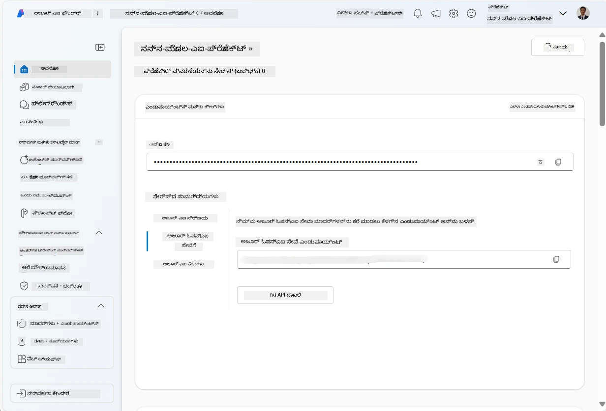
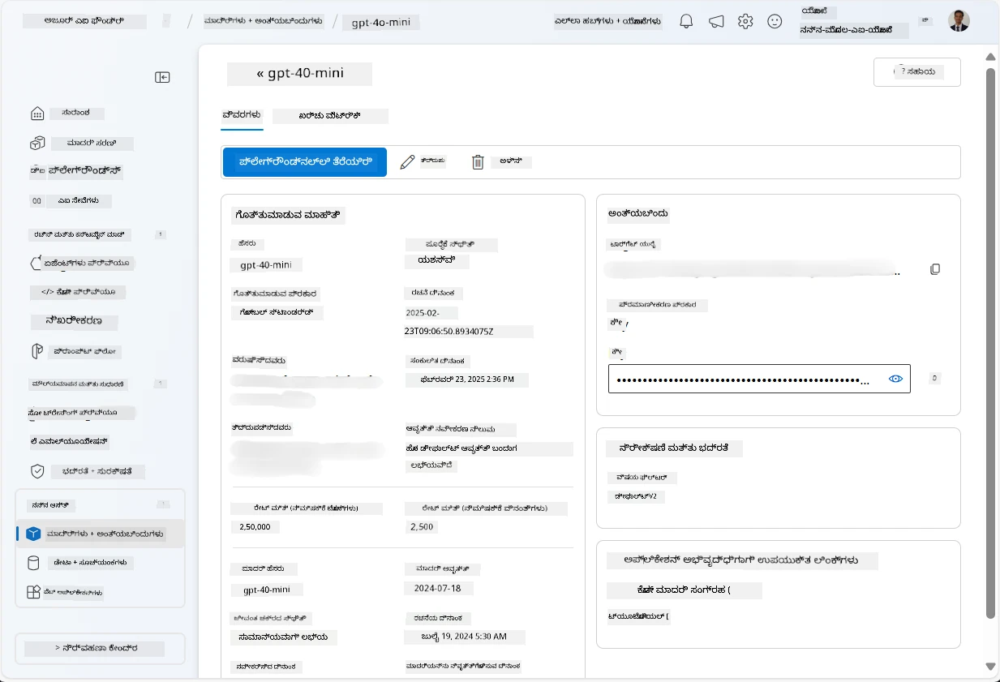
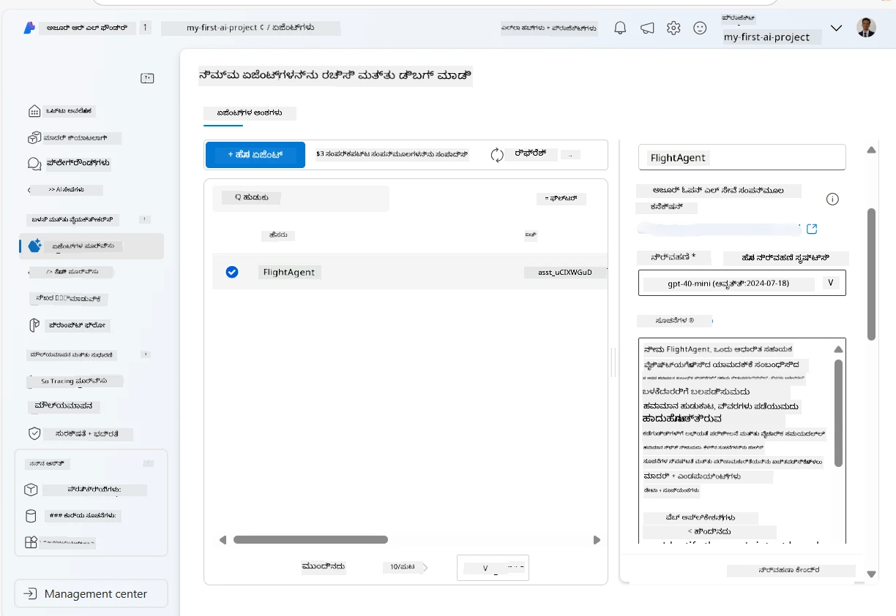
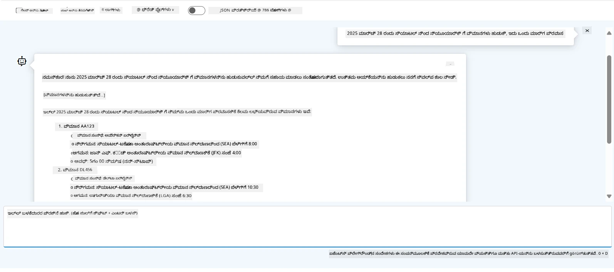

<!--
CO_OP_TRANSLATOR_METADATA:
{
  "original_hash": "7e92870dc0843e13d4dabc620c09d2d9",
  "translation_date": "2025-12-03T16:57:27+00:00",
  "source_file": "02-explore-agentic-frameworks/azure-ai-foundry-agent-creation.md",
  "language_code": "kn"
}
-->
# Azure AI Agent ಸೇವಾ ಅಭಿವೃದ್ಧಿ

ಈ ವ್ಯಾಯಾಮದಲ್ಲಿ, ನೀವು [Azure AI Foundry ಪೋರ್ಟಲ್](https://ai.azure.com/?WT.mc_id=academic-105485-koreyst) ನಲ್ಲಿ Azure AI Agent ಸೇವಾ ಸಾಧನಗಳನ್ನು ಬಳಸಿಕೊಂಡು ವಿಮಾನ ಬುಕಿಂಗ್‌ಗಾಗಿ ಏಜೆಂಟ್ ಅನ್ನು ರಚಿಸುತ್ತೀರಿ. ಈ ಏಜೆಂಟ್ ಬಳಕೆದಾರರೊಂದಿಗೆ ಸಂವಹನ ನಡೆಸಿ ವಿಮಾನಗಳ ಬಗ್ಗೆ ಮಾಹಿತಿ ನೀಡಲು ಸಾಮರ್ಥ್ಯ ಹೊಂದಿರುತ್ತದೆ.

## ಪೂರ್ವಶರತ್ತುಗಳು

ಈ ವ್ಯಾಯಾಮವನ್ನು ಪೂರ್ಣಗೊಳಿಸಲು, ನಿಮಗೆ ಈ ಕೆಳಗಿನವುಗಳ ಅಗತ್ಯವಿದೆ:
1. ಸಕ್ರಿಯ ಚಂದಾದಾರಿಕೆಯನ್ನು ಹೊಂದಿರುವ Azure ಖಾತೆ. [ಉಚಿತ ಖಾತೆಯನ್ನು ರಚಿಸಿ](https://azure.microsoft.com/free/?WT.mc_id=academic-105485-koreyst).
2. ನೀವು Azure AI Foundry ಹಬ್ ಅನ್ನು ರಚಿಸಲು ಅನುಮತಿಗಳನ್ನು ಹೊಂದಿರಬೇಕು ಅಥವಾ ನಿಮಗಾಗಿ ಒಂದು ರಚಿಸಲಾಗಿರಬೇಕು.
    - ನೀವು Contributor ಅಥವಾ Owner ಪಾತ್ರವನ್ನು ಹೊಂದಿದ್ದರೆ, ಈ ಟ್ಯುಟೋರಿಯಲ್‌ನ ಹಂತಗಳನ್ನು ಅನುಸರಿಸಬಹುದು.

## Azure AI Foundry ಹಬ್ ರಚಿಸಿ

> **Note:** Azure AI Foundry ಅನ್ನು ಹಿಂದಿನಿಂದ Azure AI Studio ಎಂದು ಕರೆಯಲಾಗುತ್ತಿತ್ತು.

1. Azure AI Foundry ಹಬ್ ಅನ್ನು ರಚಿಸಲು [Azure AI Foundry](https://learn.microsoft.com/en-us/azure/ai-studio/?WT.mc_id=academic-105485-koreyst) ಬ್ಲಾಗ್ ಪೋಸ್ಟ್‌ನ ಮಾರ್ಗಸೂಚಿಗಳನ್ನು ಅನುಸರಿಸಿ.
2. ನಿಮ್ಮ ಪ್ರಾಜೆಕ್ಟ್ ರಚನೆಯಾದ ನಂತರ, ತೋರಿಸಲಾದ ಯಾವುದೇ ಟಿಪ್ಪಣಿಗಳನ್ನು ಮುಚ್ಚಿ ಮತ್ತು Azure AI Foundry ಪೋರ್ಟಲ್‌ನಲ್ಲಿ ಪ್ರಾಜೆಕ್ಟ್ ಪುಟವನ್ನು ಪರಿಶೀಲಿಸಿ, ಇದು ಕೆಳಗಿನ ಚಿತ್ರದಂತಿರುತ್ತದೆ:

    

## ಮಾದರಿಯನ್ನು ಡಿಪ್ಲಾಯ್ ಮಾಡಿ

1. ನಿಮ್ಮ ಪ್ರಾಜೆಕ್ಟ್‌ನ ಎಡಭಾಗದ ಪೇನ್‌ನಲ್ಲಿ, **My assets** ವಿಭಾಗದಲ್ಲಿ **Models + endpoints** ಪುಟವನ್ನು ಆಯ್ಕೆಮಾಡಿ.
2. **Models + endpoints** ಪುಟದಲ್ಲಿ, **Model deployments** ಟ್ಯಾಬ್‌ನಲ್ಲಿ, **+ Deploy model** ಮೆನುದಲ್ಲಿ **Deploy base model** ಆಯ್ಕೆಮಾಡಿ.
3. ಪಟ್ಟಿ‌ನಲ್ಲಿ `gpt-4o-mini` ಮಾದರಿಯನ್ನು ಹುಡುಕಿ, ನಂತರ ಅದನ್ನು ಆಯ್ಕೆಮಾಡಿ ಮತ್ತು ದೃಢೀಕರಿಸಿ.

    > **Note**: TPM ಅನ್ನು ಕಡಿಮೆ ಮಾಡುವುದು ನೀವು ಬಳಸುತ್ತಿರುವ ಚಂದಾದಾರಿಕೆಯಲ್ಲಿ ಲಭ್ಯವಿರುವ ಕ್ವೋಟಾವನ್ನು ಹೆಚ್ಚು ಬಳಸುವುದನ್ನು ತಪ್ಪಿಸಲು ಸಹಾಯ ಮಾಡುತ್ತದೆ.

    

## ಏಜೆಂಟ್ ರಚಿಸಿ

ನೀವು ಮಾದರಿಯನ್ನು ಡಿಪ್ಲಾಯ್ ಮಾಡಿದ ನಂತರ, ನೀವು ಏಜೆಂಟ್ ಅನ್ನು ರಚಿಸಬಹುದು. ಏಜೆಂಟ್ ಎಂದರೆ ಬಳಕೆದಾರರೊಂದಿಗೆ ಸಂವಹನ ನಡೆಸಲು ಬಳಸಬಹುದಾದ ಸಂಭಾಷಣಾ AI ಮಾದರಿ.

1. ನಿಮ್ಮ ಪ್ರಾಜೆಕ್ಟ್‌ನ ಎಡಭಾಗದ ಪೇನ್‌ನಲ್ಲಿ, **Build & Customize** ವಿಭಾಗದಲ್ಲಿ **Agents** ಪುಟವನ್ನು ಆಯ್ಕೆಮಾಡಿ.
2. **+ Create agent** ಕ್ಲಿಕ್ ಮಾಡಿ ಹೊಸ ಏಜೆಂಟ್ ಅನ್ನು ರಚಿಸಲು. **Agent Setup** ಡೈಲಾಗ್ ಬಾಕ್ಸ್‌ನಲ್ಲಿ:
    - ಏಜೆಂಟ್‌ಗೆ `FlightAgent` ಎಂಬ ಹೆಸರು ನೀಡಿ.
    - ನೀವು ಮೊದಲು ರಚಿಸಿದ `gpt-4o-mini` ಮಾದರಿ ಡಿಪ್ಲಾಯ್‌ಮೆಂಟ್ ಆಯ್ಕೆಮಾಡಿರುವುದನ್ನು ಖಚಿತಪಡಿಸಿ.
    - ಏಜೆಂಟ್ ಅನುಸರಿಸಬೇಕಾದ ಸೂಚನೆಗಳನ್ನು **Instructions** ನಲ್ಲಿ ಸೆಟ್ ಮಾಡಿ. ಉದಾಹರಣೆಗೆ:
    ```
    You are FlightAgent, a virtual assistant specialized in handling flight-related queries. Your role includes assisting users with searching for flights, retrieving flight details, checking seat availability, and providing real-time flight status. Follow the instructions below to ensure clarity and effectiveness in your responses:

    ### Task Instructions:
    1. **Recognizing Intent**:
       - Identify the user's intent based on their request, focusing on one of the following categories:
         - Searching for flights
         - Retrieving flight details using a flight ID
         - Checking seat availability for a specified flight
         - Providing real-time flight status using a flight number
       - If the intent is unclear, politely ask users to clarify or provide more details.
        
    2. **Processing Requests**:
        - Depending on the identified intent, perform the required task:
        - For flight searches: Request details such as origin, destination, departure date, and optionally return date.
        - For flight details: Request a valid flight ID.
        - For seat availability: Request the flight ID and date and validate inputs.
        - For flight status: Request a valid flight number.
        - Perform validations on provided data (e.g., formats of dates, flight numbers, or IDs). If the information is incomplete or invalid, return a friendly request for clarification.

    3. **Generating Responses**:
    - Use a tone that is friendly, concise, and supportive.
    - Provide clear and actionable suggestions based on the output of each task.
    - If no data is found or an error occurs, explain it to the user gently and offer alternative actions (e.g., refine search, try another query).
    
    ```
> [!NOTE]
> ವಿವರವಾದ ಪ್ರಾಂಪ್ಟ್‌ಗಾಗಿ, [ಈ ರೆಪೊಸಿಟರಿ](https://github.com/ShivamGoyal03/RoamMind) ಅನ್ನು ಪರಿಶೀಲಿಸಬಹುದು.

> ಹೆಚ್ಚುವರಿಯಾಗಿ, ನೀವು **Knowledge Base** ಮತ್ತು **Actions** ಅನ್ನು ಸೇರಿಸಿ ಏಜೆಂಟ್‌ನ ಸಾಮರ್ಥ್ಯವನ್ನು ಹೆಚ್ಚಿಸಿ, ಬಳಕೆದಾರರ ವಿನಂತಿಗಳ ಆಧಾರದ ಮೇಲೆ ಹೆಚ್ಚಿನ ಮಾಹಿತಿಯನ್ನು ನೀಡಲು ಮತ್ತು ಸ್ವಯಂಚಾಲಿತ ಕಾರ್ಯಗಳನ್ನು ನಿರ್ವಹಿಸಲು. ಈ ವ್ಯಾಯಾಮಕ್ಕಾಗಿ, ನೀವು ಈ ಹಂತಗಳನ್ನು ಬಿಟ್ಟುಬಿಡಬಹುದು.



3. ಹೊಸ ಮಲ್ಟಿ-AI ಏಜೆಂಟ್ ಅನ್ನು ರಚಿಸಲು, **New Agent** ಕ್ಲಿಕ್ ಮಾಡಿ. ಹೊಸದಾಗಿ ರಚಿಸಿದ ಏಜೆಂಟ್ ನಂತರ Agents ಪುಟದಲ್ಲಿ ತೋರಿಸಲಾಗುತ್ತದೆ.

## ಏಜೆಂಟ್ ಅನ್ನು ಪರೀಕ್ಷಿಸಿ

ಏಜೆಂಟ್ ಅನ್ನು ರಚಿಸಿದ ನಂತರ, ಅದು ಬಳಕೆದಾರರ ಪ್ರಶ್ನೆಗಳಿಗೆ ಹೇಗೆ ಪ್ರತಿಕ್ರಿಯಿಸುತ್ತದೆ ಎಂಬುದನ್ನು ಪರೀಕ್ಷಿಸಲು ನೀವು Azure AI Foundry ಪೋರ್ಟಲ್ ಪ್ಲೇಗ್ರೌಂಡ್‌ನಲ್ಲಿ ಪ್ರಯತ್ನಿಸಬಹುದು.

1. ನಿಮ್ಮ ಏಜೆಂಟ್‌ನ **Setup** ಪೇನ್‌ನ ಮೇಲ್ಭಾಗದಲ್ಲಿ **Try in playground** ಆಯ್ಕೆಮಾಡಿ.
2. **Playground** ಪೇನ್‌ನಲ್ಲಿ, ಚಾಟ್ ವಿಂಡೋದಲ್ಲಿ ಪ್ರಶ್ನೆಗಳನ್ನು ಟೈಪ್ ಮಾಡುವ ಮೂಲಕ ಏಜೆಂಟ್‌ನೊಂದಿಗೆ ಸಂವಹನ ನಡೆಸಬಹುದು. ಉದಾಹರಣೆಗೆ, ನೀವು ಏಜೆಂಟ್‌ಗೆ 28ನೇ ತಾರೀಕು ಸಿಯಾಟಲ್‌ನಿಂದ ನ್ಯೂಯಾರ್ಕ್‌ಗೆ ವಿಮಾನಗಳನ್ನು ಹುಡುಕಲು ಕೇಳಬಹುದು.

    > **Note**: ಈ ವ್ಯಾಯಾಮದಲ್ಲಿ ಯಾವುದೇ ರಿಯಲ್-ಟೈಮ್ ಡೇಟಾವನ್ನು ಬಳಸಲಾಗುತ್ತಿಲ್ಲ, ಆದ್ದರಿಂದ ಏಜೆಂಟ್ ನಿಖರವಾದ ಉತ್ತರಗಳನ್ನು ನೀಡದಿರಬಹುದು. ಈ ವ್ಯಾಯಾಮದ ಉದ್ದೇಶವು ಏಜೆಂಟ್ ನೀಡಲಾದ ಸೂಚನೆಗಳ ಆಧಾರದ ಮೇಲೆ ಬಳಕೆದಾರರ ಪ್ರಶ್ನೆಗಳನ್ನು ಅರ್ಥಮಾಡಿಕೊಳ್ಳುವ ಮತ್ತು ಪ್ರತಿಕ್ರಿಯಿಸುವ ಸಾಮರ್ಥ್ಯವನ್ನು ಪರೀಕ್ಷಿಸುವುದು.

    

3. ಏಜೆಂಟ್ ಅನ್ನು ಪರೀಕ್ಷಿಸಿದ ನಂತರ, ನೀವು ಅದರ ಸಾಮರ್ಥ್ಯವನ್ನು ಹೆಚ್ಚಿಸಲು ಹೆಚ್ಚಿನ ಉದ್ದೇಶಗಳು, ತರಬೇತಿ ಡೇಟಾ, ಮತ್ತು ಕ್ರಿಯೆಗಳನ್ನು ಸೇರಿಸಬಹುದು.

## ಸಂಪತ್ತುಗಳನ್ನು ಶುದ್ಧಗೊಳಿಸಿ

ಏಜೆಂಟ್ ಅನ್ನು ಪರೀಕ್ಷಿಸಿದ ನಂತರ, ಹೆಚ್ಚುವರಿ ವೆಚ್ಚವನ್ನು ತಪ್ಪಿಸಲು ನೀವು ಅದನ್ನು ಅಳಿಸಬಹುದು.
1. [Azure ಪೋರ್ಟಲ್](https://portal.azure.com) ತೆರೆಯಿರಿ ಮತ್ತು ಈ ವ್ಯಾಯಾಮದಲ್ಲಿ ಬಳಸಿದ ಹಬ್ ಸಂಪತ್ತುಗಳನ್ನು ಡಿಪ್ಲಾಯ್ ಮಾಡಿದ ರಿಸೋರ್ಸ್ ಗ್ರೂಪ್‌ನ ವಿಷಯವನ್ನು ವೀಕ್ಷಿಸಿ.
2. ಟೂಲ್‌ಬಾರ್‌ನಲ್ಲಿ **Delete resource group** ಆಯ್ಕೆಮಾಡಿ.
3. ರಿಸೋರ್ಸ್ ಗ್ರೂಪ್ ಹೆಸರನ್ನು ನಮೂದಿಸಿ ಮತ್ತು ಅದನ್ನು ಅಳಿಸಲು ನೀವು ಬಯಸುವುದನ್ನು ದೃಢೀಕರಿಸಿ.

## ಸಂಪತ್ತುಗಳು

- [Azure AI Foundry ಡಾಕ್ಯುಮೆಂಟೇಶನ್](https://learn.microsoft.com/en-us/azure/ai-studio/?WT.mc_id=academic-105485-koreyst)
- [Azure AI Foundry ಪೋರ್ಟಲ್](https://ai.azure.com/?WT.mc_id=academic-105485-koreyst)
- [Azure AI Studio ಬಳಸಿ ಪ್ರಾರಂಭಿಸುವುದು](https://techcommunity.microsoft.com/blog/educatordeveloperblog/getting-started-with-azure-ai-studio/4095602?WT.mc_id=academic-105485-koreyst)
- [Azure ನಲ್ಲಿ AI ಏಜೆಂಟ್‌ಗಳ ಮೂಲಭೂತಾಂಶಗಳು](https://learn.microsoft.com/en-us/training/modules/ai-agent-fundamentals/?WT.mc_id=academic-105485-koreyst)
- [Azure AI Discord](https://aka.ms/AzureAI/Discord)

---

<!-- CO-OP TRANSLATOR DISCLAIMER START -->
**ಅಸಮೀಕ್ಷೆ**:  
ಈ ದಸ್ತಾವೇಜು AI ಅನುವಾದ ಸೇವೆ [Co-op Translator](https://github.com/Azure/co-op-translator) ಬಳಸಿ ಅನುವಾದಿಸಲಾಗಿದೆ. ನಾವು ನಿಖರತೆಯನ್ನು ಸಾಧಿಸಲು ಪ್ರಯತ್ನಿಸುತ್ತಿದ್ದರೂ, ದಯವಿಟ್ಟು ಗಮನಿಸಿ, ಸ್ವಯಂಚಾಲಿತ ಅನುವಾದಗಳಲ್ಲಿ ದೋಷಗಳು ಅಥವಾ ಅಸಮರ್ಪಕತೆಗಳು ಇರಬಹುದು. ಮೂಲ ಭಾಷೆಯಲ್ಲಿರುವ ಮೂಲ ದಸ್ತಾವೇಜು ಪ್ರಾಮಾಣಿಕ ಮೂಲವಾಗಿ ಪರಿಗಣಿಸಬೇಕು. ಪ್ರಮುಖ ಮಾಹಿತಿಗಾಗಿ, ವೃತ್ತಿಪರ ಮಾನವ ಅನುವಾದವನ್ನು ಶಿಫಾರಸು ಮಾಡಲಾಗುತ್ತದೆ. ಈ ಅನುವಾದದ ಬಳಕೆಯಿಂದ ಉಂಟಾಗುವ ಯಾವುದೇ ತಪ್ಪುಅರ್ಥಗಳು ಅಥವಾ ತಪ್ಪುಅರ್ಥೈಸುವಿಕೆಗೆ ನಾವು ಹೊಣೆಗಾರರಲ್ಲ.
<!-- CO-OP TRANSLATOR DISCLAIMER END -->