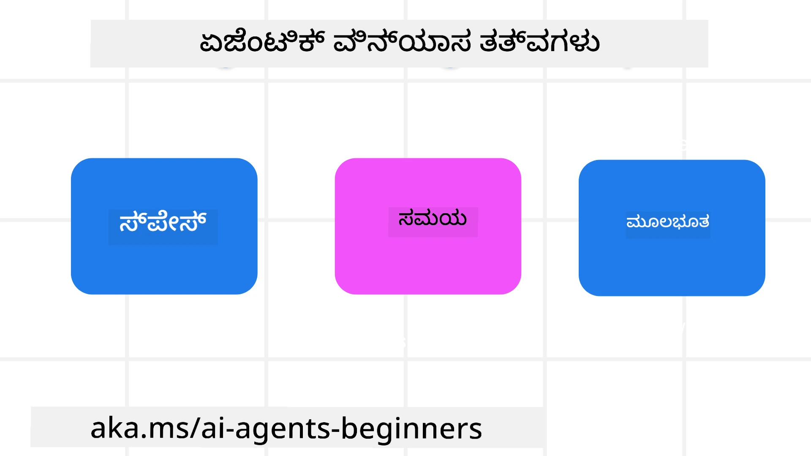

<!--
CO_OP_TRANSLATOR_METADATA:
{
  "original_hash": "d71524fe83a23829ae7a23b4031aaac8",
  "translation_date": "2025-12-03T17:13:24+00:00",
  "source_file": "03-agentic-design-patterns/README.md",
  "language_code": "kn"
}
-->

> _(ಈ ಪಾಠದ ವೀಡಿಯೊವನ್ನು ನೋಡಲು ಮೇಲಿನ ಚಿತ್ರವನ್ನು ಕ್ಲಿಕ್ ಮಾಡಿ)_
# AI ಏಜೆಂಟಿಕ್ ಡಿಸೈನ್ ತತ್ವಗಳು

## ಪರಿಚಯ

AI ಏಜೆಂಟಿಕ್ ಸಿಸ್ಟಮ್ಸ್ ನಿರ್ಮಾಣವನ್ನು ಆಲೋಚಿಸಲು ಅನೇಕ ಮಾರ್ಗಗಳಿವೆ. ಜನರೇಟಿವ್ AI ವಿನ್ಯಾಸದಲ್ಲಿ ಅಸ್ಪಷ್ಟತೆ ಒಂದು ವೈಶಿಷ್ಟ್ಯವಾಗಿದ್ದು ದೋಷವಲ್ಲ ಎಂಬುದನ್ನು ಗಮನಿಸಿದರೆ, ಎಂಜಿನಿಯರ್‌ಗಳಿಗೆ ಪ್ರಾರಂಭಿಸಲು ಎಲ್ಲಿ ಎಂದು ತಿಳಿಯುವುದು ಕೆಲವೊಮ್ಮೆ ಕಷ್ಟವಾಗುತ್ತದೆ. ನಾವು ಡೆವಲಪರ್‌ಗಳಿಗೆ ತಮ್ಮ ವ್ಯವಹಾರದ ಅಗತ್ಯಗಳನ್ನು ಪೂರೈಸಲು ಗ್ರಾಹಕ-ಕೇಂದ್ರಿತ ಏಜೆಂಟಿಕ್ ಸಿಸ್ಟಮ್ಸ್ ನಿರ್ಮಿಸಲು ಸಕ್ರಿಯ UX ವಿನ್ಯಾಸ ತತ್ವಗಳ ಒಂದು ಸೆಟ್ ಅನ್ನು ರಚಿಸಿದ್ದೇವೆ. ಈ ವಿನ್ಯಾಸ ತತ್ವಗಳು ನಿರ್ದಿಷ್ಟ ಆರ್ಕಿಟೆಕ್ಚರ್ ಅಲ್ಲ, ಬದಲಾಗಿ ಏಜೆಂಟ್ ಅನುಭವಗಳನ್ನು ವ್ಯಾಖ್ಯಾನಿಸುತ್ತಿರುವ ಮತ್ತು ನಿರ್ಮಿಸುತ್ತಿರುವ ತಂಡಗಳಿಗೆ ಪ್ರಾರಂಭದ ಬಿಂದು.

ಸಾಮಾನ್ಯವಾಗಿ, ಏಜೆಂಟ್‌ಗಳು ಈ ಕೆಳಗಿನವುಗಳನ್ನು ಮಾಡಬೇಕು:

- ಮಾನವ ಸಾಮರ್ಥ್ಯಗಳನ್ನು ವಿಸ್ತರಿಸಿ ಮತ್ತು ಪ್ರಮಾಣಿತಗೊಳಿಸಿ (ಬ್ರೈನ್‌ಸ್ಟಾರ್ಮಿಂಗ್, ಸಮಸ್ಯೆ ಪರಿಹಾರ, ಸ್ವಯಂಚಾಲಿತ, ಇತ್ಯಾದಿ)
- ಜ್ಞಾನದ ಅಂತರವನ್ನು ತುಂಬಿ (ಜ್ಞಾನ ಕ್ಷೇತ್ರಗಳಲ್ಲಿ ತ್ವರಿತವಾಗಿ ತಿಳಿಯಿರಿ, ಅನುವಾದ, ಇತ್ಯಾದಿ)
- ನಾವು ಇತರರೊಂದಿಗೆ ಕೆಲಸ ಮಾಡಲು ಇಚ್ಛಿಸುವ ರೀತಿಯಲ್ಲಿ ಸಹಕಾರವನ್ನು ಸುಗಮಗೊಳಿಸಿ ಮತ್ತು ಬೆಂಬಲಿಸಿ
- ನಮ್ಮನ್ನು ಉತ್ತಮ ಆವೃತ್ತಿಗಳಾಗಿ ರೂಪಿಸು (ಉದಾ., ಜೀವನ ಕೋಚ್/ಟಾಸ್ಕ್ ಮಾಸ್ಟರ್, ನಮ್ಮನ್ನು ಭಾವನಾತ್ಮಕ ನಿಯಂತ್ರಣ ಮತ್ತು ಮನೋವೃತ್ತಿ ಕೌಶಲಗಳನ್ನು ಕಲಿಯಲು ಸಹಾಯ ಮಾಡುವುದು, ಸ್ಥೈರ್ಯವನ್ನು ನಿರ್ಮಿಸುವುದು, ಇತ್ಯಾದಿ)

## ಈ ಪಾಠದಲ್ಲಿ ನೀವು ಕಲಿಯುವ ವಿಷಯಗಳು

- ಏಜೆಂಟಿಕ್ ಡಿಸೈನ್ ತತ್ವಗಳು ಏನು?
- ಈ ವಿನ್ಯಾಸ ತತ್ವಗಳನ್ನು ಅನುಷ್ಠಾನಗೊಳಿಸುವಾಗ ಅನುಸರಿಸಬೇಕಾದ ಕೆಲವು ಮಾರ್ಗಸೂಚಿಗಳು
- ವಿನ್ಯಾಸ ತತ್ವಗಳನ್ನು ಬಳಸುವ ಕೆಲವು ಉದಾಹರಣೆಗಳು

## ಕಲಿಕೆಯ ಗುರಿಗಳು

ಈ ಪಾಠವನ್ನು ಪೂರ್ಣಗೊಳಿಸಿದ ನಂತರ, ನೀವು ಈ ಕೆಳಗಿನವುಗಳನ್ನು ಮಾಡಲು ಸಾಧ್ಯವಾಗುತ್ತದೆ:

1. ಏಜೆಂಟಿಕ್ ಡಿಸೈನ್ ತತ್ವಗಳು ಏನೆಂದು ವಿವರಿಸಿ
2. ಏಜೆಂಟಿಕ್ ಡಿಸೈನ್ ತತ್ವಗಳನ್ನು ಬಳಸುವ ಮಾರ್ಗಸೂಚಿಗಳನ್ನು ವಿವರಿಸಿ
3. ಏಜೆಂಟಿಕ್ ಡಿಸೈನ್ ತತ್ವಗಳನ್ನು ಬಳಸಿಕೊಂಡು ಏಜೆಂಟ್ ಅನ್ನು ಹೇಗೆ ನಿರ್ಮಿಸಬೇಕೆಂದು ಅರ್ಥಮಾಡಿಕೊಳ್ಳಿ

## ಏಜೆಂಟಿಕ್ ಡಿಸೈನ್ ತತ್ವಗಳು

### ಏಜೆಂಟ್ (ಜಾಗ)

ಇದು ಏಜೆಂಟ್ ಕಾರ್ಯನಿರ್ವಹಿಸುವ ಪರಿಸರವಾಗಿದೆ. ಈ ತತ್ವಗಳು ಶಾರೀರಿಕ ಮತ್ತು ಡಿಜಿಟಲ್ ಜಗತ್ತಿನಲ್ಲಿ ತೊಡಗಿಸಿಕೊಳ್ಳಲು ಏಜೆಂಟ್‌ಗಳನ್ನು ವಿನ್ಯಾಸಗೊಳಿಸುವುದನ್ನು ಹೇಗೆ ಮಾಡಬೇಕೆಂದು ತಿಳಿಸುತ್ತವೆ.

- **ಸಂಪರ್ಕಿಸುವುದು, ಕುಗ್ಗಿಸುವುದು ಅಲ್ಲ** – ಸಹಕಾರ ಮತ್ತು ಸಂಪರ್ಕವನ್ನು ಸಕ್ರಿಯಗೊಳಿಸಲು ಜನರನ್ನು ಇತರ ಜನರು, ಘಟನೆಗಳು ಮತ್ತು ಕ್ರಿಯಾತ್ಮಕ ಜ್ಞಾನಕ್ಕೆ ಸಂಪರ್ಕಿಸಲು ಸಹಾಯ ಮಾಡಿ.
- ಏಜೆಂಟ್‌ಗಳು ಘಟನೆಗಳು, ಜ್ಞಾನ ಮತ್ತು ಜನರನ್ನು ಸಂಪರ್ಕಿಸಲು ಸಹಾಯ ಮಾಡುತ್ತವೆ.
- ಏಜೆಂಟ್‌ಗಳು ಜನರನ್ನು ಹತ್ತಿರಕ್ಕೆ ತರುತ್ತವೆ. ಅವು ಜನರನ್ನು ಬದಲಾಯಿಸಲು ಅಥವಾ ತಿರಸ್ಕರಿಸಲು ವಿನ್ಯಾಸಗೊಳಿಸಲಾಗಿಲ್ಲ.
- **ಸುಲಭವಾಗಿ ಪ್ರಾಪ್ಯ ಆದರೆ ಕೆಲವೊಮ್ಮೆ ಅಜ್ಞಾತ** – ಏಜೆಂಟ್ ಮುಖ್ಯವಾಗಿ ಹಿನ್ನಲೆಯಲ್ಲಿ ಕಾರ್ಯನಿರ್ವಹಿಸುತ್ತದೆ ಮತ್ತು ನಮಗೆ ಸಂಬಂಧಿಸಿದ ಮತ್ತು ಸೂಕ್ತವಾದಾಗ ಮಾತ್ರ ನಮ್ಮನ್ನು ಪ್ರೇರೇಪಿಸುತ್ತದೆ.
  - ಏಜೆಂಟ್ ಯಾವುದೇ ಸಾಧನ ಅಥವಾ ವೇದಿಕೆಯಲ್ಲಿ ಅನುಮೋದಿತ ಬಳಕೆದಾರರಿಗೆ ಸುಲಭವಾಗಿ ಪತ್ತೆಹಚ್ಚಲು ಮತ್ತು ಪ್ರಾಪ್ಯವಾಗಿರುತ್ತದೆ.
  - ಏಜೆಂಟ್ ಬಹುಮಾಧ್ಯಮ ಇನ್‌ಪುಟ್‌ಗಳು ಮತ್ತು ಔಟ್‌ಪುಟ್‌ಗಳನ್ನು ಬೆಂಬಲಿಸುತ್ತದೆ (ಶಬ್ದ, ಧ್ವನಿ, ಪಠ್ಯ, ಇತ್ಯಾದಿ).
  - ಏಜೆಂಟ್ ಬಳಕೆದಾರರ ಅಗತ್ಯಗಳನ್ನು ಸಂವೇದಿಸುವುದರ ಆಧಾರದ ಮೇಲೆ ಮುಂಚೂಣಿ ಮತ್ತು ಹಿನ್ನಲೆ, ಪ್ರೋಆಕ್ಟಿವ್ ಮತ್ತು ರಿಯಾಕ್ಟಿವ್ ನಡುವೆ ನಿರಂತರವಾಗಿ ಬದಲಾಯಿಸಬಹುದು.
  - ಏಜೆಂಟ್ ಅಜ್ಞಾತ ರೂಪದಲ್ಲಿ ಕಾರ್ಯನಿರ್ವಹಿಸಬಹುದು, ಆದರೆ ಅದರ ಹಿನ್ನಲೆ ಪ್ರಕ್ರಿಯೆ ಪಥ ಮತ್ತು ಇತರ ಏಜೆಂಟ್‌ಗಳೊಂದಿಗೆ ಸಹಕಾರವು ಬಳಕೆದಾರರಿಗೆ ಪಾರದರ್ಶಕವಾಗಿರುತ್ತದೆ ಮತ್ತು ನಿಯಂತ್ರಣಯೋಗ್ಯವಾಗಿರುತ್ತದೆ.

### ಏಜೆಂಟ್ (ಸಮಯ)

ಇದು ಏಜೆಂಟ್ ಸಮಯದೊಂದಿಗೆ ಹೇಗೆ ಕಾರ್ಯನಿರ್ವಹಿಸುತ್ತದೆ ಎಂಬುದಾಗಿದೆ. ಈ ತತ್ವಗಳು ಭೂತಕಾಲ, ಪ್ರಸ್ತುತ ಮತ್ತು ಭವಿಷ್ಯದೊಂದಿಗೆ ಸಂವಹನ ಮಾಡುವ ಏಜೆಂಟ್‌ಗಳನ್ನು ವಿನ್ಯಾಸಗೊಳಿಸುವುದನ್ನು ಹೇಗೆ ಮಾಡಬೇಕೆಂದು ತಿಳಿಸುತ್ತವೆ.

- **ಭೂತಕಾಲ**: ಸ್ಥಿತಿ ಮತ್ತು ಸಂದರ್ಭವನ್ನು ಒಳಗೊಂಡ ಇತಿಹಾಸವನ್ನು ಪ್ರತಿಬಿಂಬಿಸುತ್ತದೆ.
  - ಏಜೆಂಟ್ ಕೇವಲ ಘಟನೆ, ಜನರು ಅಥವಾ ಸ್ಥಿತಿಗಳಿಗಿಂತ ಹೆಚ್ಚಿನ ಐತಿಹಾಸಿಕ ಡೇಟಾದ ವಿಶ್ಲೇಷಣೆಯ ಆಧಾರದ ಮೇಲೆ ಹೆಚ್ಚು ಸಂಬಂಧಿತ ಫಲಿತಾಂಶಗಳನ್ನು ಒದಗಿಸುತ್ತದೆ.
  - ಏಜೆಂಟ್ ಭೂತಕಾಲದ ಘಟನೆಗಳಿಂದ ಸಂಪರ್ಕಗಳನ್ನು ರಚಿಸುತ್ತದೆ ಮತ್ತು ಪ್ರಸ್ತುತ ಪರಿಸ್ಥಿತಿಗಳೊಂದಿಗೆ ತೊಡಗಿಸಲು ಸ್ಮೃತಿಯನ್ನು ಸಕ್ರಿಯವಾಗಿ ಪ್ರತಿಬಿಂಬಿಸುತ್ತದೆ.
- **ಈಗ**: ಸೂಚನೆ ನೀಡುವುದಕ್ಕಿಂತ ಹೆಚ್ಚು ಪ್ರೇರೇಪಿಸುತ್ತದೆ.
  - ಏಜೆಂಟ್ ಜನರೊಂದಿಗೆ ಸಂವಹನ ಮಾಡಲು ಸಮಗ್ರವಾದ ವಿಧಾನವನ್ನು ಹೊಂದಿದೆ. ಒಂದು ಘಟನೆ ಸಂಭವಿಸಿದಾಗ, ಏಜೆಂಟ್ ಸ್ಥಿರ ಸೂಚನೆ ಅಥವಾ ಇತರ ಸ್ಥಿರ ಶಿಷ್ಟಾಚಾರವನ್ನು ಮೀರಿ ಹೋಗುತ್ತದೆ. ಏಜೆಂಟ್ ಪ್ರವಾಹಗಳನ್ನು ಸರಳಗೊಳಿಸಬಹುದು ಅಥವಾ ಬಳಕೆದಾರರ ಗಮನವನ್ನು ಸರಿಯಾದ ಕ್ಷಣದಲ್ಲಿ ನಿರ್ದೇಶಿಸಲು ಡೈನಾಮಿಕ್ ಸೂಚನೆಗಳನ್ನು ರಚಿಸಬಹುದು.
  - ಏಜೆಂಟ್ ಮಾಹಿತಿ ನೀಡುವಾಗ ಸಾಂದರ್ಭಿಕ ಪರಿಸರ, ಸಾಮಾಜಿಕ ಮತ್ತು ಸಾಂಸ್ಕೃತಿಕ ಬದಲಾವಣೆಗಳನ್ನು ಪರಿಗಣಿಸುತ್ತದೆ ಮತ್ತು ಬಳಕೆದಾರರ ಉದ್ದೇಶಕ್ಕೆ ಹೊಂದಿಕೊಳ್ಳುತ್ತದೆ.
  - ಏಜೆಂಟ್ ಸಂವಹನ ಕ್ರಮೇಣ, ದೀರ್ಘಾವಧಿಯಲ್ಲಿ ಬಳಕೆದಾರರನ್ನು ಸಬಲಗೊಳಿಸಲು ಜಟಿಲತೆಯಲ್ಲಿ ಬೆಳೆಯುವ/ವಿಕಸಿಸುವ ರೀತಿಯಲ್ಲಿ ಇರಬಹುದು.
- **ಭವಿಷ್ಯ**: ಹೊಂದಿಕೊಳ್ಳುವುದು ಮತ್ತು ವಿಕಸಿಸುವುದು.
  - ಏಜೆಂಟ್ ವಿವಿಧ ಸಾಧನಗಳು, ವೇದಿಕೆಗಳು ಮತ್ತು ವಿಧಾನಗಳಿಗೆ ಹೊಂದಿಕೊಳ್ಳುತ್ತದೆ.
  - ಏಜೆಂಟ್ ಬಳಕೆದಾರರ ವರ್ತನೆ, ಪ್ರಾಪ್ಯತೆಯ ಅಗತ್ಯಗಳನ್ನು ಹೊಂದಿಕೊಳ್ಳುತ್ತದೆ ಮತ್ತು ಮುಕ್ತವಾಗಿ ಕಸ್ಟಮೈಸ್ ಮಾಡಬಹುದಾಗಿದೆ.
  - ಏಜೆಂಟ್ ನಿರಂತರ ಬಳಕೆದಾರರ ಸಂವಹನದ ಮೂಲಕ ರೂಪುಗೊಳ್ಳುತ್ತದೆ ಮತ್ತು ವಿಕಸಿಸುತ್ತದೆ.

### ಏಜೆಂಟ್ (ಮೂಲಭೂತ)

ಇವು ಏಜೆಂಟ್ ವಿನ್ಯಾಸದ ಮೂಲಭೂತ ಅಂಶಗಳಾಗಿವೆ.

- **ಅನಿಶ್ಚಿತತೆಯನ್ನು ಸ್ವೀಕರಿಸಿ ಆದರೆ ನಂಬಿಕೆಯನ್ನು ಸ್ಥಾಪಿಸಿ**.
  - ಏಜೆಂಟ್ ವಿನ್ಯಾಸದಲ್ಲಿ ಅನಿಶ್ಚಿತತೆಯ ಒಂದು ಮಟ್ಟವನ್ನು ನಿರೀಕ್ಷಿಸಲಾಗುತ್ತದೆ. ಅನಿಶ್ಚಿತತೆ ಏಜೆಂಟ್ ವಿನ್ಯಾಸದ ಪ್ರಮುಖ ಅಂಶವಾಗಿದೆ.
  - ನಂಬಿಕೆ ಮತ್ತು ಪಾರದರ್ಶಕತೆ ಏಜೆಂಟ್ ವಿನ್ಯಾಸದ ಮೂಲಭೂತ ಹಂತಗಳಾಗಿವೆ.
  - ಏಜೆಂಟ್ ಆನ್/ಆಫ್ ಆಗಿರುವಾಗ ಮಾನವರು ನಿಯಂತ್ರಣದಲ್ಲಿರುತ್ತಾರೆ ಮತ್ತು ಏಜೆಂಟ್ ಸ್ಥಿತಿ ಯಾವಾಗಲೂ ಸ್ಪಷ್ಟವಾಗಿ ಕಾಣಿಸುತ್ತದೆ.

## ಈ ತತ್ವಗಳನ್ನು ಅನುಷ್ಠಾನಗೊಳಿಸಲು ಮಾರ್ಗಸೂಚಿಗಳು

ಹಿಂದಿನ ವಿನ್ಯಾಸ ತತ್ವಗಳನ್ನು ಬಳಸುವಾಗ, ಈ ಕೆಳಗಿನ ಮಾರ್ಗಸೂಚಿಗಳನ್ನು ಅನುಸರಿಸಿ:

1. **ಪಾರದರ್ಶಕತೆ**: AI ತೊಡಗಿಸಿಕೊಂಡಿದೆ, ಅದು ಹೇಗೆ ಕಾರ್ಯನಿರ್ವಹಿಸುತ್ತದೆ (ಹಿಂದಿನ ಕ್ರಿಯೆಗಳನ್ನು ಒಳಗೊಂಡಂತೆ), ಮತ್ತು ಪ್ರತಿಕ್ರಿಯೆಯನ್ನು ನೀಡುವುದು ಮತ್ತು ವ್ಯವಸ್ಥೆಯನ್ನು ತಿದ್ದುಪಡಿ ಮಾಡುವುದು ಹೇಗೆ ಎಂಬುದನ್ನು ಬಳಕೆದಾರರಿಗೆ ತಿಳಿಸಿ.
2. **ನಿಯಂತ್ರಣ**: ಬಳಕೆದಾರರಿಗೆ ಕಸ್ಟಮೈಸ್ ಮಾಡಲು, ಆದ್ಯತೆಗಳನ್ನು ನಿರ್ದಿಷ್ಟಪಡಿಸಲು ಮತ್ತು ವೈಯಕ್ತಿಕಗೊಳಿಸಲು, ಮತ್ತು ವ್ಯವಸ್ಥೆ ಮತ್ತು ಅದರ ಗುಣಲಕ್ಷಣಗಳ ಮೇಲೆ ನಿಯಂತ್ರಣವನ್ನು ಹೊಂದಲು (ಮರೆಯುವ ಸಾಮರ್ಥ್ಯವನ್ನು ಒಳಗೊಂಡಂತೆ) ಅವಕಾಶ ನೀಡಿ.
3. **ಸ್ಥಿರತೆ**: ಸಾಧನಗಳು ಮತ್ತು ಎಂಡ್‌ಪಾಯಿಂಟ್‌ಗಳಲ್ಲಿ ಸ್ಥಿರ, ಬಹುಮಾಧ್ಯಮ ಅನುಭವಗಳಿಗೆ ಪ್ರಯತ್ನಿಸಿ. ಸಾಧ್ಯವಾದಲ್ಲಿ ಪರಿಚಿತ UI/UX ಅಂಶಗಳನ್ನು ಬಳಸಿ (ಉದಾ., ಧ್ವನಿ ಸಂವಹನಕ್ಕಾಗಿ ಮೈಕ್ರೋಫೋನ್ ಐಕಾನ್) ಮತ್ತು ಗ್ರಾಹಕರ ಬೌದ್ಧಿಕ ಭಾರವನ್ನು ככל ಸಾಧ್ಯವಾಗುವಷ್ಟು ಕಡಿಮೆ ಮಾಡಿ (ಉದಾ., ಸಂಕ್ಷಿಪ್ತ ಪ್ರತಿಕ್ರಿಯೆಗಳಿಗೆ, ದೃಶ್ಯ ಸಹಾಯಗಳಿಗೆ ಮತ್ತು 'ಹೆಚ್ಚು ತಿಳಿಯಿರಿ' ವಿಷಯಕ್ಕೆ ಪ್ರಯತ್ನಿಸಿ).

## ಈ ತತ್ವಗಳು ಮತ್ತು ಮಾರ್ಗಸೂಚಿಗಳನ್ನು ಬಳಸಿಕೊಂಡು ಟ್ರಾವೆಲ್ ಏಜೆಂಟ್ ಅನ್ನು ಹೇಗೆ ವಿನ್ಯಾಸಗೊಳಿಸಬೇಕು

ನೀವು ಟ್ರಾವೆಲ್ ಏಜೆಂಟ್ ಅನ್ನು ವಿನ್ಯಾಸಗೊಳಿಸುತ್ತಿದ್ದೀರಿ ಎಂದು ಕಲ್ಪಿಸಿ, ಈ ತತ್ವಗಳು ಮತ್ತು ಮಾರ್ಗಸೂಚಿಗಳನ್ನು ಬಳಸುವ ಬಗ್ಗೆ ನೀವು ಈ ರೀತಿ ಆಲೋಚಿಸಬಹುದು:

1. **ಪಾರದರ್ಶಕತೆ** – ಟ್ರಾವೆಲ್ ಏಜೆಂಟ್ AI-ಸಕ್ರಿಯ ಏಜೆಂಟ್ ಎಂದು ಬಳಕೆದಾರರಿಗೆ ತಿಳಿಸಿ. ಪ್ರಾರಂಭಿಸಲು ಕೆಲವು ಮೂಲಭೂತ ಸೂಚನೆಗಳನ್ನು ಒದಗಿಸಿ (ಉದಾ., "ಹಲೋ" ಸಂದೇಶ, ಮಾದರಿ ಪ್ರಾಂಪ್ಟ್‌ಗಳು). ಇದನ್ನು ಉತ್ಪನ್ನ ಪುಟದಲ್ಲಿ ಸ್ಪಷ್ಟವಾಗಿ ದಾಖಲಿಸಿ. ಬಳಕೆದಾರರು ಹಿಂದಿನ ಪ್ರಾಂಪ್ಟ್‌ಗಳ ಪಟ್ಟಿ ನೋಡಬಹುದು. ಪ್ರತಿಕ್ರಿಯೆಯನ್ನು ನೀಡುವುದು ಹೇಗೆ (ಥಮ್ಸ್ ಅಪ್ ಮತ್ತು ಡೌನ್, ಫೀಡ್‌ಬ್ಯಾಕ್ ಬಟನ್ ಕಳುಹಿಸಿ, ಇತ್ಯಾದಿ) ಸ್ಪಷ್ಟವಾಗಿ ಮಾಡಿರಿ. ಏಜೆಂಟ್‌ಗೆ ಬಳಕೆ ಅಥವಾ ವಿಷಯದ ನಿರ್ಬಂಧಗಳಿದ್ದರೆ ಅದನ್ನು ಸ್ಪಷ್ಟವಾಗಿ ವಿವರಿಸಿ.
2. **ನಿಯಂತ್ರಣ** – ಏಜೆಂಟ್ ಅನ್ನು ರಚಿಸಿದ ನಂತರ ಬಳಕೆದಾರರು ಅದನ್ನು ತಿದ್ದುಪಡಿ ಮಾಡುವುದು ಹೇಗೆ ಎಂಬುದು ಸ್ಪಷ್ಟವಾಗಿರಲಿ, ಉದಾ., ಸಿಸ್ಟಮ್ ಪ್ರಾಂಪ್ಟ್. ಏಜೆಂಟ್ ಎಷ್ಟು ವಿವರವಾಗಿ ಬರೆಯಬೇಕು, ಅದರ ಬರವಣಿಗೆ ಶೈಲಿ, ಮತ್ತು ಏಜೆಂಟ್ ಯಾವ ವಿಷಯದ ಬಗ್ಗೆ ಮಾತನಾಡಬಾರದು ಎಂಬುದರ ಮೇಲೆ ಬಳಕೆದಾರರು ಆಯ್ಕೆ ಮಾಡಬಹುದು. ಸಂಬಂಧಿತ ಫೈಲ್‌ಗಳು ಅಥವಾ ಡೇಟಾ, ಪ್ರಾಂಪ್ಟ್‌ಗಳು ಮತ್ತು ಹಿಂದಿನ ಸಂಭಾಷಣೆಗಳನ್ನು ವೀಕ್ಷಿಸಲು ಮತ್ತು ಅಳಿಸಲು ಬಳಕೆದಾರರಿಗೆ ಅವಕಾಶ ನೀಡಿ.
3. **ಸ್ಥಿರತೆ** – ಪ್ರಾಂಪ್ಟ್ ಹಂಚಿಕೆ, ಫೈಲ್ ಅಥವಾ ಫೋಟೋ ಸೇರಿಸಿ ಮತ್ತು ಏನಾದರೂ ಅಥವಾ ಯಾರಾದರೂ ಟ್ಯಾಗ್ ಮಾಡಲು ಐಕಾನ್‌ಗಳು ಮಾನದಂಡ ಮತ್ತು ಗುರುತಿಸಬಹುದಾಗಿರಲಿ. ಏಜೆಂಟ್‌ಗಾಗಿ ಫೈಲ್ ಅಪ್ಲೋಡ್/ಹಂಚಿಕೆಯನ್ನು ಸೂಚಿಸಲು ಪೇಪರ್‌ಕ್ಲಿಪ್ ಐಕಾನ್ ಅನ್ನು ಬಳಸಿ, ಮತ್ತು ಗ್ರಾಫಿಕ್ಸ್ ಅಪ್ಲೋಡ್ ಸೂಚಿಸಲು ಇಮೇಜ್ ಐಕಾನ್ ಅನ್ನು ಬಳಸಿ.

## ಮಾದರಿ ಕೋಡ್‌ಗಳು

- ಪೈಥಾನ್: [Agent Framework](./code_samples/03-python-agent-framework.ipynb)
- .NET: [Agent Framework](./code_samples/03-dotnet-agent-framework.md)

## AI ಏಜೆಂಟಿಕ್ ಡಿಸೈನ್ ಪ್ಯಾಟರ್ನ್‌ಗಳ ಬಗ್ಗೆ ಇನ್ನಷ್ಟು ಪ್ರಶ್ನೆಗಳಿದೆಯೇ?

ಇತರ ಕಲಿಯುವವರನ್ನು ಭೇಟಿಯಾಗಲು, ಆಫೀಸ್ ಅವರ್ಸ್‌ನಲ್ಲಿ ಭಾಗವಹಿಸಲು ಮತ್ತು ನಿಮ್ಮ AI ಏಜೆಂಟ್‌ಗಳ ಪ್ರಶ್ನೆಗಳಿಗೆ ಉತ್ತರ ಪಡೆಯಲು [Azure AI Foundry Discord](https://aka.ms/ai-agents/discord) ಗೆ ಸೇರಿ.

## ಹೆಚ್ಚುವರಿ ಸಂಪತ್ತುಗಳು

- <a href="https://openai.com" target="_blank">ಏಜೆಂಟಿಕ್ AI ಸಿಸ್ಟಮ್ಸ್‌ನ್ನು ಆಡಳಿತ ಮಾಡಲು ಅಭ್ಯಾಸಗಳು | OpenAI</a>
- <a href="https://microsoft.com" target="_blank">HAX ಟೂಲ್‌ಕಿಟ್ ಪ್ರಾಜೆಕ್ಟ್ - Microsoft Research</a>
- <a href="https://responsibleaitoolbox.ai" target="_blank">ಜವಾಬ್ದಾರಿಯುತ AI ಟೂಲ್‌ಬಾಕ್ಸ್</a>

## ಹಿಂದಿನ ಪಾಠ

[ಏಜೆಂಟಿಕ್ ಫ್ರೇಮ್‌ವರ್ಕ್‌ಗಳನ್ನು ಅನ್ವೇಷಿಸುವುದು](../02-explore-agentic-frameworks/README.md)

## ಮುಂದಿನ ಪಾಠ

[ಟೂಲ್ ಯೂಸ್ ಡಿಸೈನ್ ಪ್ಯಾಟರ್ನ್](../04-tool-use/README.md)

---

<!-- CO-OP TRANSLATOR DISCLAIMER START -->
**ಅಸಮಾಕ್ಷ್ಯತೆ**:  
ಈ ದಸ್ತಾವೇಜು AI ಅನುವಾದ ಸೇವೆ [Co-op Translator](https://github.com/Azure/co-op-translator) ಬಳಸಿ ಅನುವಾದಿಸಲಾಗಿದೆ. ನಾವು ನಿಖರತೆಯಿಗಾಗಿ ಪ್ರಯತ್ನಿಸುತ್ತಿದ್ದರೂ, ದಯವಿಟ್ಟು ಗಮನಿಸಿ, ಸ್ವಯಂಚಾಲಿತ ಅನುವಾದಗಳಲ್ಲಿ ದೋಷಗಳು ಅಥವಾ ಅಸಮಾಕ್ಷ್ಯತೆಗಳು ಇರಬಹುದು. ಮೂಲ ಭಾಷೆಯಲ್ಲಿರುವ ಮೂಲ ದಸ್ತಾವೇಜು ಪ್ರಾಮಾಣಿಕ ಮೂಲವೆಂದು ಪರಿಗಣಿಸಬೇಕು. ಮಹತ್ವದ ಮಾಹಿತಿಗಾಗಿ, ವೃತ್ತಿಪರ ಮಾನವ ಅನುವಾದವನ್ನು ಶಿಫಾರಸು ಮಾಡಲಾಗುತ್ತದೆ. ಈ ಅನುವಾದವನ್ನು ಬಳಸುವ ಮೂಲಕ ಉಂಟಾಗುವ ಯಾವುದೇ ತಪ್ಪುಅರ್ಥಗಳು ಅಥವಾ ತಪ್ಪುಅನುವಾದಗಳಿಗೆ ನಾವು ಹೊಣೆಗಾರರಲ್ಲ.
<!-- CO-OP TRANSLATOR DISCLAIMER END -->