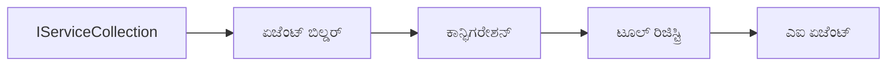

<!--
CO_OP_TRANSLATOR_METADATA:
{
  "original_hash": "bcc874e190347bd6a095aed56dc16de8",
  "translation_date": "2025-12-03T17:15:05+00:00",
  "source_file": "03-agentic-design-patterns/code_samples/03-dotnet-agent-framework.md",
  "language_code": "kn"
}
-->
# 🎨 GitHub ಮಾದರಿಗಳೊಂದಿಗೆ (.NET) ಏಜೆಂಟಿಕ್ ಡಿಸೈನ್ ಪ್ಯಾಟರ್ನ್ಸ್

## 📋 ಕಲಿಕೆಯ ಉದ್ದೇಶಗಳು

ಈ ಉದಾಹರಣೆ .NET ನಲ್ಲಿ Microsoft Agent Framework ಬಳಸಿ GitHub ಮಾದರಿಗಳ ಸಂಯೋಜನೆಯೊಂದಿಗೆ ಬುದ್ಧಿವಂತ ಏಜೆಂಟಗಳನ್ನು ನಿರ್ಮಿಸಲು ಎಂಟರ್‌ಪ್ರೈಸ್-ಗ್ರೇಡ್ ಡಿಸೈನ್ ಪ್ಯಾಟರ್ನ್ಸ್ ಅನ್ನು ತೋರಿಸುತ್ತದೆ. ಏಜೆಂಟಗಳನ್ನು ಉತ್ಪಾದನೆಗೆ ತಯಾರಾಗುವಂತೆ, ನಿರ್ವಹಣೀಯ ಮತ್ತು ವಿಸ್ತರಿಸಬಹುದಾದಂತೆ ಮಾಡುವ ವೃತ್ತಿಪರ ಪ್ಯಾಟರ್ನ್ಸ್ ಮತ್ತು ಆರ್ಕಿಟೆಕ್ಚರಲ್ ವಿಧಾನಗಳನ್ನು ನೀವು ಕಲಿಯುತ್ತೀರಿ.

### ಎಂಟರ್‌ಪ್ರೈಸ್ ಡಿಸೈನ್ ಪ್ಯಾಟರ್ನ್ಸ್

- 🏭 **ಫ್ಯಾಕ್ಟರಿ ಪ್ಯಾಟರ್ನ್**: ಡಿಪೆಂಡೆನ್ಸಿ ಇಂಜೆಕ್ಷನ್ ಮೂಲಕ ಏಜೆಂಟ್ ರಚನೆ
- 🔧 **ಬಿಲ್ಡರ್ ಪ್ಯಾಟರ್ನ್**: ಏಜೆಂಟ್ ಕಾನ್ಫಿಗರೇಶನ್ ಮತ್ತು ಸೆಟಪ್
- 🧵 **ಥ್ರೆಡ್-ಸೇಫ್ ಪ್ಯಾಟರ್ನ್ಸ್**: ಸಮಕಾಲೀನ ಸಂಭಾಷಣೆ ನಿರ್ವಹಣೆ
- 📋 **ರಿಪೊಸಿಟರಿ ಪ್ಯಾಟರ್ನ್**: ಸಾಧನ ಮತ್ತು ಸಾಮರ್ಥ್ಯ ನಿರ್ವಹಣೆ

## 🎯 .NET-ನ ವಿಶೇಷ ಆರ್ಕಿಟೆಕ್ಚರಲ್ ಲಾಭಗಳು

### ಎಂಟರ್‌ಪ್ರೈಸ್ ವೈಶಿಷ್ಟ್ಯಗಳು

- **ಸ್ಟ್ರಾಂಗ್ ಟೈಪಿಂಗ್**: ಕಂಪೈಲ್-ಟೈಮ್ ಮಾನ್ಯತೆ ಮತ್ತು IntelliSense ಬೆಂಬಲ
- **ಡಿಪೆಂಡೆನ್ಸಿ ಇಂಜೆಕ್ಷನ್**: ಬಿಲ್ಟ್-ಇನ್ DI ಕಂಟೈನರ್ ಸಂಯೋಜನೆ
- **ಕಾನ್ಫಿಗರೇಶನ್ ನಿರ್ವಹಣೆ**: IConfiguration ಮತ್ತು Options ಪ್ಯಾಟರ್ನ್ಸ್
- **Async/Await**: ಪ್ರಥಮ-ಶ್ರೇಣಿಯ ಅಸಿಂಕ್ರೋನಸ್ ಪ್ರೋಗ್ರಾಮಿಂಗ್ ಬೆಂಬಲ

### ಉತ್ಪಾದನೆಗೆ ತಯಾರಾದ ಪ್ಯಾಟರ್ನ್ಸ್

- **ಲಾಗಿಂಗ್ ಇಂಟಿಗ್ರೇಶನ್**: ILogger ಮತ್ತು ಸಂರಚಿತ ಲಾಗಿಂಗ್ ಬೆಂಬಲ
- **ಹೆಲ್ತ್ ಚೆಕ್ಸ್**: ಬಿಲ್ಟ್-ಇನ್ ಮಾನಿಟರಿಂಗ್ ಮತ್ತು ಡಯಾಗ್ನೋಸ್ಟಿಕ್ಸ್
- **ಕಾನ್ಫಿಗರೇಶನ್ ಮಾನ್ಯತೆ**: ಡೇಟಾ ಅನೋಟೇಶನ್‌ಗಳೊಂದಿಗೆ ಸ್ಟ್ರಾಂಗ್ ಟೈಪಿಂಗ್
- **ಎರರ್ ಹ್ಯಾಂಡ್ಲಿಂಗ್**: ಸಂರಚಿತ ಅಪವಾದ ನಿರ್ವಹಣೆ

## 🔧 ತಾಂತ್ರಿಕ ಆರ್ಕಿಟೆಕ್ಚರ್

### ಕೋರ್ .NET ಘಟಕಗಳು

- **Microsoft.Extensions.AI**: ಏಕೀಕೃತ AI ಸೇವಾ ಅಬ್ಸ್ಟ್ರಾಕ್ಷನ್‌ಗಳು
- **Microsoft.Agents.AI**: ಎಂಟರ್‌ಪ್ರೈಸ್ ಏಜೆಂಟ್ ಆರ್ಕೆಸ್ಟ್ರೇಷನ್ ಫ್ರೇಮ್‌ವರ್ಕ್
- **GitHub Models Integration**: ಹೆಚ್ಚಿನ ಕಾರ್ಯಕ್ಷಮ API ಕ್ಲೈಂಟ್ ಪ್ಯಾಟರ್ನ್ಸ್
- **ಕಾನ್ಫಿಗರೇಶನ್ ಸಿಸ್ಟಮ್**: appsettings.json ಮತ್ತು ಪರಿಸರ ಸಂಯೋಜನೆ

### ಡಿಸೈನ್ ಪ್ಯಾಟರ್ನ್ ಅನುಷ್ಠಾನ


## 🏗️ ಎಂಟರ್‌ಪ್ರೈಸ್ ಪ್ಯಾಟರ್ನ್ಸ್ ತೋರಿಸಲಾಗಿದೆ

### 1. **ಕ್ರಿಯೇಷನಲ್ ಪ್ಯಾಟರ್ನ್ಸ್**

- **ಏಜೆಂಟ್ ಫ್ಯಾಕ್ಟರಿ**: ಸತತ ಕಾನ್ಫಿಗರೇಶನ್‌ನೊಂದಿಗೆ ಕೇಂದ್ರೀಕೃತ ಏಜೆಂಟ್ ರಚನೆ
- **ಬಿಲ್ಡರ್ ಪ್ಯಾಟರ್ನ್**: ಸಂಕೀರ್ಣ ಏಜೆಂಟ್ ಕಾನ್ಫಿಗರೇಶನ್‌ಗಾಗಿ ಫ್ಲುವೆಂಟ್ API
- **ಸಿಂಗಲ್‌ಟನ್ ಪ್ಯಾಟರ್ನ್**: ಹಂಚಿದ ಸಂಪತ್ತು ಮತ್ತು ಕಾನ್ಫಿಗರೇಶನ್ ನಿರ್ವಹಣೆ
- **ಡಿಪೆಂಡೆನ್ಸಿ ಇಂಜೆಕ್ಷನ್**: ಲೂಸ್ ಕಪ್ಲಿಂಗ್ ಮತ್ತು ಟೆಸ್ಟಬಿಲಿಟಿ

### 2. **ಬಿಹೇವಿಯರಲ್ ಪ್ಯಾಟರ್ನ್ಸ್**

- **ಸ್ಟ್ರಾಟೆಜಿ ಪ್ಯಾಟರ್ನ್**: ಪರಿವರ್ತನೀಯ ಸಾಧನ ಕಾರ್ಯಾಚರಣೆ ತಂತ್ರಗಳು
- **ಕಮಾಂಡ್ ಪ್ಯಾಟರ್ನ್**: ಅನ್‌ಡೂ/ರೀಡೂ ಸಹಿತ ಏಜೆಂಟ್ ಕಾರ್ಯಾಚರಣೆಗಳನ್ನು ಎನ್‌ಕ್ಯಾಪ್ಸುಲೇಟೆಡ್ ಮಾಡಲಾಗಿದೆ
- **ಆಬ್ಸರ್ವರ್ ಪ್ಯಾಟರ್ನ್**: ಈವೆಂಟ್-ಚಾಲಿತ ಏಜೆಂಟ್ ಜೀವನಚಕ್ರ ನಿರ್ವಹಣೆ
- **ಟೆಂಪ್ಲೇಟ್ ಮೆತೋಡ್**: ಏಜೆಂಟ್ ಕಾರ್ಯಾಚರಣೆಗಳ ಸ್ಟಾಂಡರ್ಡೈಜ್ಡ್ ವರ್ಕ್‌ಫ್ಲೋಗಳು

### 3. **ಸ್ಟ್ರಕ್ಚರಲ್ ಪ್ಯಾಟರ್ನ್ಸ್**

- **ಅಡಾಪ್ಟರ್ ಪ್ಯಾಟರ್ನ್**: GitHub Models API ಸಂಯೋಜನೆ ಲೇಯರ್
- **ಡೆಕೋರೇಟರ್ ಪ್ಯಾಟರ್ನ್**: ಏಜೆಂಟ್ ಸಾಮರ್ಥ್ಯ ವೃದ್ಧಿ
- **ಫಸಾಡ್ ಪ್ಯಾಟರ್ನ್**: ಸರಳೀಕೃತ ಏಜೆಂಟ್ ಸಂವಹನ ಇಂಟರ್ಫೇಸ್‌ಗಳು
- **ಪ್ರಾಕ್ಸಿ ಪ್ಯಾಟರ್ನ್**: ಕಾರ್ಯಕ್ಷಮತೆಯಿಗಾಗಿ ಲೇಜಿ ಲೋಡಿಂಗ್ ಮತ್ತು ಕ್ಯಾಶಿಂಗ್

## 📚 .NET ಡಿಸೈನ್ ತತ್ವಗಳು

### SOLID ತತ್ವಗಳು

- **ಸಿಂಗಲ್ ರೆಸ್ಪಾನ್ಸಿಬಿಲಿಟಿ**: ಪ್ರತಿ ಘಟಕವು ಒಂದು ಸ್ಪಷ್ಟ ಉದ್ದೇಶವನ್ನು ಹೊಂದಿದೆ
- **ಓಪನ್/ಕ್ಲೋಸ್ಡ್**: ತಿದ್ದುಪಡಿ ಇಲ್ಲದೆ ವಿಸ್ತರಿಸಬಹುದಾಗಿದೆ
- **ಲಿಸ್ಕೋವ್ ಸಬ್‌ಸ್ಟಿಟ್ಯೂಷನ್**: ಇಂಟರ್ಫೇಸ್-ಆಧಾರಿತ ಸಾಧನ ಅನುಷ್ಠಾನಗಳು
- **ಇಂಟರ್ಫೇಸ್ ಸೆಗ್ರಿಗೇಶನ್**: ಕೇಂದ್ರೀಕೃತ, ಸಮ್ಮಿಳಿತ ಇಂಟರ್ಫೇಸ್‌ಗಳು
- **ಡಿಪೆಂಡೆನ್ಸಿ ಇನ್‌ವರ್ಷನ್**: ಅಬ್ಸ್ಟ್ರಾಕ್ಷನ್‌ಗಳ ಮೇಲೆ ಅವಲಂಬಿಸು, ಕಾನ್ಕ್ರೀಷನ್‌ಗಳ ಮೇಲೆ ಅಲ್ಲ

### ಕ್ಲೀನ್ ಆರ್ಕಿಟೆಕ್ಚರ್

- **ಡೊಮೈನ್ ಲೇಯರ್**: ಕೋರ್ ಏಜೆಂಟ್ ಮತ್ತು ಸಾಧನ ಅಬ್ಸ್ಟ್ರಾಕ್ಷನ್‌ಗಳು
- **ಅಪ್ಲಿಕೇಶನ್ ಲೇಯರ್**: ಏಜೆಂಟ್ ಆರ್ಕೆಸ್ಟ್ರೇಷನ್ ಮತ್ತು ವರ್ಕ್‌ಫ್ಲೋಗಳು
- **ಇನ್‌ಫ್ರಾಸ್ಟ್ರಕ್ಚರ್ ಲೇಯರ್**: GitHub Models ಸಂಯೋಜನೆ ಮತ್ತು ಬಾಹ್ಯ ಸೇವೆಗಳು
- **ಪ್ರೆಸೆಂಟೇಶನ್ ಲೇಯರ್**: ಬಳಕೆದಾರ ಸಂವಹನ ಮತ್ತು ಪ್ರತಿಕ್ರಿಯೆ ಫಾರ್ಮ್ಯಾಟಿಂಗ್

## 🔒 ಎಂಟರ್‌ಪ್ರೈಸ್ ಪರಿಗಣನೆಗಳು

### ಭದ್ರತೆ

- **ಕ್ರೆಡೆನ್ಷಿಯಲ್ ನಿರ್ವಹಣೆ**: IConfiguration ಮೂಲಕ ಸುರಕ್ಷಿತ API ಕೀ ಹ್ಯಾಂಡ್ಲಿಂಗ್
- **ಇನ್‌ಪುಟ್ ಮಾನ್ಯತೆ**: ಸ್ಟ್ರಾಂಗ್ ಟೈಪಿಂಗ್ ಮತ್ತು ಡೇಟಾ ಅನೋಟೇಶನ್ ಮಾನ್ಯತೆ
- **ಔಟ್‌ಪುಟ್ ಸ್ಯಾನಿಟೈಸೇಶನ್**: ಸುರಕ್ಷಿತ ಪ್ರತಿಕ್ರಿಯೆ ಪ್ರಕ್ರಿಯೆ ಮತ್ತು ಫಿಲ್ಟರಿಂಗ್
- **ಆಡಿಟ್ ಲಾಗಿಂಗ್**: ಸಮಗ್ರ ಕಾರ್ಯಾಚರಣೆ ಟ್ರ್ಯಾಕಿಂಗ್

### ಕಾರ್ಯಕ್ಷಮತೆ

- **ಅಸಿಂಕ್ ಪ್ಯಾಟರ್ನ್ಸ್**: ನಾನ್-ಬ್ಲಾಕಿಂಗ್ I/O ಕಾರ್ಯಾಚರಣೆಗಳು
- **ಕನೆಕ್ಷನ್ ಪೂಲಿಂಗ್**: ಪರಿಣಾಮಕಾರಿ HTTP ಕ್ಲೈಂಟ್ ನಿರ್ವಹಣೆ
- **ಕ್ಯಾಶಿಂಗ್**: ಕಾರ್ಯಕ್ಷಮತೆಯನ್ನು ಸುಧಾರಿಸಲು ಪ್ರತಿಕ್ರಿಯೆ ಕ್ಯಾಶಿಂಗ್
- **ಸಂಪತ್ತು ನಿರ್ವಹಣೆ**: ಸರಿಯಾದ ಡಿಸ್ಪೋಸಲ್ ಮತ್ತು ಕ್ಲೀನ್‌ಅಪ್ ಪ್ಯಾಟರ್ನ್ಸ್

### ವಿಸ್ತರಣೀಯತೆ

- **ಥ್ರೆಡ್ ಸೆಫ್ಟಿ**: ಸಮಕಾಲೀನ ಏಜೆಂಟ್ ಕಾರ್ಯಾಚರಣೆ ಬೆಂಬಲ
- **ಸಂಪತ್ತು ಪೂಲಿಂಗ್**: ಪರಿಣಾಮಕಾರಿ ಸಂಪತ್ತು ಬಳಕೆ
- **ಲೋಡ್ ನಿರ್ವಹಣೆ**: ದರ ಮಿತಿಮೀರು ಮತ್ತು ಬ್ಯಾಕ್‌ಪ್ರೆಶರ್ ಹ್ಯಾಂಡ್ಲಿಂಗ್
- **ಮಾನಿಟರಿಂಗ್**: ಕಾರ್ಯಕ್ಷಮತೆ ಮೆಟ್ರಿಕ್ಸ್ ಮತ್ತು ಹೆಲ್ತ್ ಚೆಕ್ಸ್

## 🚀 ಉತ್ಪಾದನೆ ನಿಯೋಜನೆ

- **ಕಾನ್ಫಿಗರೇಶನ್ ನಿರ್ವಹಣೆ**: ಪರಿಸರ-ನಿರ್ದಿಷ್ಟ ಸೆಟ್ಟಿಂಗ್‌ಗಳು
- **ಲಾಗಿಂಗ್ ತಂತ್ರ**: ಸಂರಚಿತ ಲಾಗಿಂಗ್ ಮತ್ತು ಸಂಬಂಧಿತ IDಗಳು
- **ಎರರ್ ಹ್ಯಾಂಡ್ಲಿಂಗ್**: ಸರಿಯಾದ ಪುನಃಪ್ರಾಪ್ತಿಯೊಂದಿಗೆ ಗ್ಲೋಬಲ್ ಅಪವಾದ ನಿರ್ವಹಣೆ
- **ಮಾನಿಟರಿಂಗ್**: ಅಪ್ಲಿಕೇಶನ್ ಇನ್‌ಸೈಟ್ಸ್ ಮತ್ತು ಕಾರ್ಯಕ್ಷಮತೆ ಕೌಂಟರ್‌ಗಳು
- **ಟೆಸ್ಟಿಂಗ್**: ಯುನಿಟ್ ಟೆಸ್ಟ್‌ಗಳು, ಇಂಟಿಗ್ರೇಶನ್ ಟೆಸ್ಟ್‌ಗಳು, ಮತ್ತು ಲೋಡ್ ಟೆಸ್ಟಿಂಗ್ ಪ್ಯಾಟರ್ನ್ಸ್

.NET ಬಳಸಿ ಎಂಟರ್‌ಪ್ರೈಸ್-ಗ್ರೇಡ್ ಬುದ್ಧಿವಂತ ಏಜೆಂಟ್‌ಗಳನ್ನು ನಿರ್ಮಿಸಲು ಸಿದ್ಧವೇ? ಬಲವಾದ ಆರ್ಕಿಟೆಕ್ಚರ್ ನಿರ್ಮಿಸೋಣ! 🏢✨

## 🚀 ಪ್ರಾರಂಭಿಸಲು

### ಪೂರ್ವಶರತ್ತುಗಳು

- [.NET 10 SDK](https://dotnet.microsoft.com/download/dotnet/10.0) ಅಥವಾ ಹೆಚ್ಚಿನದು
- [GitHub Models API access token](https://docs.github.com/github-models/github-models-at-scale/using-your-own-api-keys-in-github-models)

### ಅಗತ್ಯವಿರುವ ಪರಿಸರ ವ್ಯತ್ಯಾಸಗಳು

```bash
# ಝೆಡ್‌ಎಸ್‌ಎಚ್/ಬ್ಯಾಶ್
export GH_TOKEN=<your_github_token>
export GH_ENDPOINT=https://models.github.ai/inference
export GH_MODEL_ID=openai/gpt-5-mini
```

```powershell
# ಪವರ್‌ಶೆಲ್
$env:GH_TOKEN = "<your_github_token>"
$env:GH_ENDPOINT = "https://models.github.ai/inference"
$env:GH_MODEL_ID = "openai/gpt-5-mini"
```

### ಮಾದರಿ ಕೋಡ್

ಕೋಡ್ ಉದಾಹರಣೆಯನ್ನು ಚಲಾಯಿಸಲು,

```bash
# zsh/bash
chmod +x ./03-dotnet-agent-framework.cs
./03-dotnet-agent-framework.cs
```

ಅಥವಾ dotnet CLI ಬಳಸಿ:

```bash
dotnet run ./03-dotnet-agent-framework.cs
```

ಪೂರ್ಣ ಕೋಡ್‌ಗಾಗಿ [`03-dotnet-agent-framework.cs`](../../../../03-agentic-design-patterns/code_samples/03-dotnet-agent-framework.cs) ನೋಡಿ.

```csharp
#!/usr/bin/dotnet run

#:package Microsoft.Extensions.AI@10.*
#:package Microsoft.Agents.AI.OpenAI@1.*-*

using System.ClientModel;
using System.ComponentModel;

using Microsoft.Agents.AI;
using Microsoft.Extensions.AI;

using OpenAI;

// Tool Function: Random Destination Generator
// This static method will be available to the agent as a callable tool
// The [Description] attribute helps the AI understand when to use this function
// This demonstrates how to create custom tools for AI agents
[Description("Provides a random vacation destination.")]
static string GetRandomDestination()
{
    // List of popular vacation destinations around the world
    // The agent will randomly select from these options
    var destinations = new List<string>
    {
        "Paris, France",
        "Tokyo, Japan",
        "New York City, USA",
        "Sydney, Australia",
        "Rome, Italy",
        "Barcelona, Spain",
        "Cape Town, South Africa",
        "Rio de Janeiro, Brazil",
        "Bangkok, Thailand",
        "Vancouver, Canada"
    };

    // Generate random index and return selected destination
    // Uses System.Random for simple random selection
    var random = new Random();
    int index = random.Next(destinations.Count);
    return destinations[index];
}

// Extract configuration from environment variables
// Retrieve the GitHub Models API endpoint, defaults to https://models.github.ai/inference if not specified
// Retrieve the model ID, defaults to openai/gpt-5-mini if not specified
// Retrieve the GitHub token for authentication, throws exception if not specified
var github_endpoint = Environment.GetEnvironmentVariable("GH_ENDPOINT") ?? "https://models.github.ai/inference";
var github_model_id = Environment.GetEnvironmentVariable("GH_MODEL_ID") ?? "openai/gpt-5-mini";
var github_token = Environment.GetEnvironmentVariable("GH_TOKEN") ?? throw new InvalidOperationException("GH_TOKEN is not set.");

// Configure OpenAI Client Options
// Create configuration options to point to GitHub Models endpoint
// This redirects OpenAI client calls to GitHub's model inference service
var openAIOptions = new OpenAIClientOptions()
{
    Endpoint = new Uri(github_endpoint)
};

// Initialize OpenAI Client with GitHub Models Configuration
// Create OpenAI client using GitHub token for authentication
// Configure it to use GitHub Models endpoint instead of OpenAI directly
var openAIClient = new OpenAIClient(new ApiKeyCredential(github_token), openAIOptions);

// Define Agent Identity and Comprehensive Instructions
// Agent name for identification and logging purposes
var AGENT_NAME = "TravelAgent";

// Detailed instructions that define the agent's personality, capabilities, and behavior
// This system prompt shapes how the agent responds and interacts with users
var AGENT_INSTRUCTIONS = """
You are a helpful AI Agent that can help plan vacations for customers.

Important: When users specify a destination, always plan for that location. Only suggest random destinations when the user hasn't specified a preference.

When the conversation begins, introduce yourself with this message:
"Hello! I'm your TravelAgent assistant. I can help plan vacations and suggest interesting destinations for you. Here are some things you can ask me:
1. Plan a day trip to a specific location
2. Suggest a random vacation destination
3. Find destinations with specific features (beaches, mountains, historical sites, etc.)
4. Plan an alternative trip if you don't like my first suggestion

What kind of trip would you like me to help you plan today?"

Always prioritize user preferences. If they mention a specific destination like "Bali" or "Paris," focus your planning on that location rather than suggesting alternatives.
""";

// Create AI Agent with Advanced Travel Planning Capabilities
// Initialize complete agent pipeline: OpenAI client → Chat client → AI agent
// Configure agent with name, detailed instructions, and available tools
// This demonstrates the .NET agent creation pattern with full configuration
AIAgent agent = openAIClient
    .GetChatClient(github_model_id)
    .CreateAIAgent(
        name: AGENT_NAME,
        instructions: AGENT_INSTRUCTIONS,
        tools: [AIFunctionFactory.Create(GetRandomDestination)]
    );

// Create New Conversation Thread for Context Management
// Initialize a new conversation thread to maintain context across multiple interactions
// Threads enable the agent to remember previous exchanges and maintain conversational state
// This is essential for multi-turn conversations and contextual understanding
AgentThread thread = agent.GetNewThread();

// Execute Agent: First Travel Planning Request
// Run the agent with an initial request that will likely trigger the random destination tool
// The agent will analyze the request, use the GetRandomDestination tool, and create an itinerary
// Using the thread parameter maintains conversation context for subsequent interactions
await foreach (var update in agent.RunStreamingAsync("Plan me a day trip", thread))
{
    await Task.Delay(10);
    Console.Write(update);
}

Console.WriteLine();

// Execute Agent: Follow-up Request with Context Awareness
// Demonstrate contextual conversation by referencing the previous response
// The agent remembers the previous destination suggestion and will provide an alternative
// This showcases the power of conversation threads and contextual understanding in .NET agents
await foreach (var update in agent.RunStreamingAsync("I don't like that destination. Plan me another vacation.", thread))
{
    await Task.Delay(10);
    Console.Write(update);
}
```

---

<!-- CO-OP TRANSLATOR DISCLAIMER START -->
**ಅಸಮೀಕ್ಷೆ**:  
ಈ ದಸ್ತಾವೇಜನ್ನು AI ಅನುವಾದ ಸೇವೆ [Co-op Translator](https://github.com/Azure/co-op-translator) ಬಳಸಿ ಅನುವಾದಿಸಲಾಗಿದೆ. ನಾವು ನಿಖರತೆಯನ್ನು ಸಾಧಿಸಲು ಪ್ರಯತ್ನಿಸುತ್ತಿದ್ದರೂ, ದಯವಿಟ್ಟು ಗಮನಿಸಿ, ಸ್ವಯಂಚಾಲಿತ ಅನುವಾದಗಳಲ್ಲಿ ದೋಷಗಳು ಅಥವಾ ಅಸಮರ್ಪಕತೆಗಳು ಇರಬಹುದು. ಮೂಲ ಭಾಷೆಯಲ್ಲಿರುವ ಮೂಲ ದಸ್ತಾವೇಜನ್ನು ಪ್ರಾಮಾಣಿಕ ಮೂಲವೆಂದು ಪರಿಗಣಿಸಬೇಕು. ಪ್ರಮುಖ ಮಾಹಿತಿಗಾಗಿ, ವೃತ್ತಿಪರ ಮಾನವ ಅನುವಾದವನ್ನು ಶಿಫಾರಸು ಮಾಡಲಾಗುತ್ತದೆ. ಈ ಅನುವಾದದ ಬಳಕೆಯಿಂದ ಉಂಟಾಗುವ ಯಾವುದೇ ತಪ್ಪುಅರ್ಥಗಳು ಅಥವಾ ತಪ್ಪುಅರ್ಥೈಸುವಿಕೆಗೆ ನಾವು ಹೊಣೆಗಾರರಲ್ಲ.
<!-- CO-OP TRANSLATOR DISCLAIMER END -->