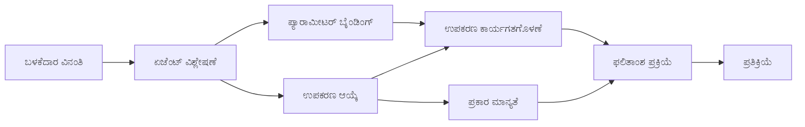

<!--
CO_OP_TRANSLATOR_METADATA:
{
  "original_hash": "91d6061e402489603f2ec8b528cae59b",
  "translation_date": "2025-12-03T16:56:10+00:00",
  "source_file": "04-tool-use/code_samples/04-dotnet-agent-framework.md",
  "language_code": "kn"
}
-->
# 🛠️ GitHub ಮಾದರಿಗಳೊಂದಿಗೆ (.NET) ಉನ್ನತ ಸಾಧನ ಬಳಕೆ

## 📋 ಕಲಿಕೆಯ ಉದ್ದೇಶಗಳು

ಈ ನೋಟ್ಬುಕ್ Microsoft Agent Framework ಅನ್ನು .NET ನಲ್ಲಿ GitHub ಮಾದರಿಗಳೊಂದಿಗೆ ಬಳಸುವ ಎಂಟರ್‌ಪ್ರೈಸ್-ಗ್ರೇಡ್ ಸಾಧನ ಏಕೀಕರಣ ಮಾದರಿಗಳನ್ನು ತೋರಿಸುತ್ತದೆ. ನೀವು ಬಹು ವಿಶೇಷ ಸಾಧನಗಳೊಂದಿಗೆ ಸುಧಾರಿತ ಏಜೆಂಟ್‌ಗಳನ್ನು ನಿರ್ಮಿಸಲು, C# ನ ಬಲವಾದ ಟೈಪಿಂಗ್ ಮತ್ತು .NET ನ ಎಂಟರ್‌ಪ್ರೈಸ್ ವೈಶಿಷ್ಟ್ಯಗಳನ್ನು ಬಳಸಲು ಕಲಿಯುತ್ತೀರಿ.

### ನೀವು ಆಳವಾಗಿ ಕಲಿಯುವ ಸುಧಾರಿತ ಸಾಧನ ಸಾಮರ್ಥ್ಯಗಳು

- 🔧 **ಬಹು-ಸಾಧನ ಆರ್ಕಿಟೆಕ್ಚರ್**: ಬಹು ವಿಶೇಷ ಸಾಮರ್ಥ್ಯಗಳೊಂದಿಗೆ ಏಜೆಂಟ್‌ಗಳನ್ನು ನಿರ್ಮಿಸುವುದು
- 🎯 **ಟೈಪ್-ಸೇಫ್ ಸಾಧನ ಕಾರ್ಯಗತಗೊಳನೆ**: C# ನ ಕಾಂಪೈಲ್-ಟೈಮ್ ಮಾನ್ಯತೆಯನ್ನು ಬಳಸುವುದು
- 📊 **ಎಂಟರ್‌ಪ್ರೈಸ್ ಸಾಧನ ಮಾದರಿಗಳು**: ಉತ್ಪಾದನಾ-ಸಿದ್ಧ ಸಾಧನ ವಿನ್ಯಾಸ ಮತ್ತು ದೋಷ ನಿರ್ವಹಣೆ
- 🔗 **ಸಾಧನ ಸಂಯೋಜನೆ**: ಸಂಕೀರ್ಣ ವ್ಯವಹಾರ ಕಾರ್ಯಪ್ರವಾಹಗಳಿಗಾಗಿ ಸಾಧನಗಳನ್ನು ಸಂಯೋಜಿಸುವುದು

## 🎯 .NET ಸಾಧನ ಆರ್ಕಿಟೆಕ್ಚರ್‌ನ ಲಾಭಗಳು

### ಎಂಟರ್‌ಪ್ರೈಸ್ ಸಾಧನ ವೈಶಿಷ್ಟ್ಯಗಳು

- **ಕಾಂಪೈಲ್-ಟೈಮ್ ಮಾನ್ಯತೆ**: ಬಲವಾದ ಟೈಪಿಂಗ್ ಸಾಧನ ಪ್ಯಾರಾಮೀಟರ್ ಸರಿಯಾದತೆಯನ್ನು ಖಚಿತಪಡಿಸುತ್ತದೆ
- **ಡಿಪೆಂಡೆನ್ಸಿ ಇಂಜೆಕ್ಷನ್**: IoC ಕಂಟೈನರ್ ಏಕೀಕರಣ ಸಾಧನ ನಿರ್ವಹಣೆಗೆ
- **ಅಸಿಂಕ್/ಅವೇಟ್ ಮಾದರಿಗಳು**: ಸರಿಯಾದ ಸಂಪತ್ತು ನಿರ್ವಹಣೆಯೊಂದಿಗೆ ಬ್ಲಾಕ್ ಮಾಡದ ಸಾಧನ ಕಾರ್ಯಗತಗೊಳನೆ
- **ಸಂರಚಿತ ಲಾಗಿಂಗ್**: ಸಾಧನ ಕಾರ್ಯಗತಗೊಳನೆ ಮೇಲ್ವಿಚಾರಣೆಗೆ ಲಾಗಿಂಗ್ ಏಕೀಕರಣ

### ಉತ್ಪಾದನಾ-ಸಿದ್ಧ ಮಾದರಿಗಳು

- **ಎಕ್ಸೆಪ್ಷನ್ ಹ್ಯಾಂಡ್ಲಿಂಗ್**: ಟೈಪ್ಡ್ ಎಕ್ಸೆಪ್ಷನ್‌ಗಳೊಂದಿಗೆ ಸಮಗ್ರ ದೋಷ ನಿರ್ವಹಣೆ
- **ಸಂಪತ್ತು ನಿರ್ವಹಣೆ**: ಸರಿಯಾದ ಡಿಸ್ಪೋಸಲ್ ಮಾದರಿಗಳು ಮತ್ತು ಮೆಮೊರಿ ನಿರ್ವಹಣೆ
- **ಪ್ರದರ್ಶನ ಮೇಲ್ವಿಚಾರಣೆ**: ಅಂತರ್ನಿಹಿತ ಮೆಟ್ರಿಕ್‌ಗಳು ಮತ್ತು ಕಾರ್ಯಕ್ಷಮತೆ ಕೌಂಟರ್‌ಗಳು
- **ಕಾನ್ಫಿಗರೇಶನ್ ನಿರ್ವಹಣೆ**: ಮಾನ್ಯತೆಯೊಂದಿಗೆ ಟೈಪ್-ಸೇಫ್ ಕಾನ್ಫಿಗರೇಶನ್

## 🔧 ತಾಂತ್ರಿಕ ಆರ್ಕಿಟೆಕ್ಚರ್

### ಕೋರ್ .NET ಸಾಧನ ಘಟಕಗಳು

- **Microsoft.Extensions.AI**: ಏಕೀಕೃತ ಸಾಧನ ಅಬ್ಸ್ಟ್ರಾಕ್ಷನ್ ಲೇಯರ್
- **Microsoft.Agents.AI**: ಎಂಟರ್‌ಪ್ರೈಸ್-ಗ್ರೇಡ್ ಸಾಧನ ಸಂಯೋಜನೆ
- **GitHub ಮಾದರಿಗಳ ಏಕೀಕರಣ**: ಹೈ-ಪರ್ಫಾರ್ಮೆನ್ಸ್ API ಕ್ಲೈಂಟ್ ಸಂಪರ್ಕ ಪೂಲಿಂಗ್‌ನೊಂದಿಗೆ

### ಸಾಧನ ಕಾರ್ಯಗತಗೊಳನೆ ಪೈಪ್‌ಲೈನ್


## 🛠️ ಸಾಧನ ವರ್ಗಗಳು ಮತ್ತು ಮಾದರಿಗಳು

### 1. **ಡೇಟಾ ಪ್ರೊಸೆಸಿಂಗ್ ಸಾಧನಗಳು**

- **ಇನ್‌ಪುಟ್ ಮಾನ್ಯತೆ**: ಡೇಟಾ ಅನೋಟೇಶನ್‌ಗಳೊಂದಿಗೆ ಬಲವಾದ ಟೈಪಿಂಗ್
- **ರೂಪಾಂತರ ಕಾರ್ಯಾಚರಣೆಗಳು**: ಟೈಪ್-ಸೇಫ್ ಡೇಟಾ ಪರಿವರ್ತನೆ ಮತ್ತು ಸ್ವರೂಪೀಕರಣ
- **ವ್ಯವಹಾರ ಲಾಜಿಕ್**: ಡೊಮೈನ್-ನಿರ್ದಿಷ್ಟ ಲೆಕ್ಕಾಚಾರ ಮತ್ತು ವಿಶ್ಲೇಷಣೆ ಸಾಧನಗಳು
- **ಔಟ್‌ಪುಟ್ ಸ್ವರೂಪೀಕರಣ**: ಸಂರಚಿತ ಪ್ರತಿಕ್ರಿಯೆ ತಯಾರಿಕೆ

### 2. **ಏಕೀಕರಣ ಸಾಧನಗಳು**

- **API ಕನೆಕ್ಟರ್‌ಗಳು**: RESTful ಸೇವಾ ಏಕೀಕರಣ HttpClient ನೊಂದಿಗೆ
- **ಡೇಟಾಬೇಸ್ ಸಾಧನಗಳು**: ಡೇಟಾ ಪ್ರವೇಶಕ್ಕಾಗಿ Entity Framework ಏಕೀಕರಣ
- **ಫೈಲ್ ಕಾರ್ಯಾಚರಣೆಗಳು**: ಮಾನ್ಯತೆಯೊಂದಿಗೆ ಸುರಕ್ಷಿತ ಫೈಲ್ ಸಿಸ್ಟಮ್ ಕಾರ್ಯಾಚರಣೆಗಳು
- **ಬಾಹ್ಯ ಸೇವೆಗಳು**: ತೃತೀಯ-ಪಕ್ಷ ಸೇವಾ ಏಕೀಕರಣ ಮಾದರಿಗಳು

### 3. **ಉಪಯುಕ್ತ ಸಾಧನಗಳು**

- **ಪಠ್ಯ ಪ್ರೊಸೆಸಿಂಗ್**: ಸ್ಟ್ರಿಂಗ್ ಮ್ಯಾನಿಪುಲೇಶನ್ ಮತ್ತು ಸ್ವರೂಪೀಕರಣ ಉಪಯುಕ್ತತೆಗಳು
- **ದಿನಾಂಕ/ಸಮಯ ಕಾರ್ಯಾಚರಣೆಗಳು**: ಸಂಸ್ಕೃತಿ-ಜಾಗೃತ ದಿನಾಂಕ/ಸಮಯ ಲೆಕ್ಕಾಚಾರ
- **ಗಣಿತ ಸಾಧನಗಳು**: ನಿಖರ ಲೆಕ್ಕಾಚಾರ ಮತ್ತು ಅಂಕಿ-ಅಂಶ ಕಾರ್ಯಾಚರಣೆಗಳು
- **ಮಾನ್ಯತೆ ಸಾಧನಗಳು**: ವ್ಯವಹಾರ ನಿಯಮ ಮಾನ್ಯತೆ ಮತ್ತು ಡೇಟಾ ಪರಿಶೀಲನೆ

ಎಂಟರ್‌ಪ್ರೈಸ್-ಗ್ರೇಡ್ ಏಜೆಂಟ್‌ಗಳನ್ನು ಬಲವಾದ, ಟೈಪ್-ಸೇಫ್ ಸಾಧನ ಸಾಮರ್ಥ್ಯಗಳೊಂದಿಗೆ .NET ನಲ್ಲಿ ನಿರ್ಮಿಸಲು ಸಿದ್ಧವೇ? ಬನ್ನಿ, ವೃತ್ತಿಪರ-ಗ್ರೇಡ್ ಪರಿಹಾರಗಳನ್ನು ಆರ್ಕಿಟೆಕ್ಟ್ ಮಾಡೋಣ! 🏢⚡

## 🚀 ಪ್ರಾರಂಭಿಸೋಣ

### ಪೂರ್ವಾಪೇಕ್ಷಿತಗಳು

- [.NET 10 SDK](https://dotnet.microsoft.com/download/dotnet/10.0) ಅಥವಾ ಹೆಚ್ಚಿನದು
- [GitHub ಮಾದರಿಗಳ API ಪ್ರವೇಶ ಟೋಕನ್](https://docs.github.com/github-models/github-models-at-scale/using-your-own-api-keys-in-github-models)

### ಅಗತ್ಯವಿರುವ ಪರಿಸರ ವ್ಯತ್ಯಾಸಗಳು

```bash
# ಝೆಡ್‌ಎಸ್‌ಎಚ್/ಬ್ಯಾಶ್
export GH_TOKEN=<your_github_token>
export GH_ENDPOINT=https://models.github.ai/inference
export GH_MODEL_ID=openai/gpt-5-mini
```

```powershell
# ಪವರ್‌ಶೆಲ್
$env:GH_TOKEN = "<your_github_token>"
$env:GH_ENDPOINT = "https://models.github.ai/inference"
$env:GH_MODEL_ID = "openai/gpt-5-mini"
```

### ಮಾದರಿ ಕೋಡ್

ಕೋಡ್ ಉದಾಹರಣೆಯನ್ನು ಚಲಾಯಿಸಲು,

```bash
# zsh/bash
chmod +x ./04-dotnet-agent-framework.cs
./04-dotnet-agent-framework.cs
```

ಅಥವಾ dotnet CLI ಬಳಸಿ:

```bash
dotnet run ./04-dotnet-agent-framework.cs
```

ಪೂರ್ಣ ಕೋಡ್‌ಗಾಗಿ [`04-dotnet-agent-framework.cs`](../../../../04-tool-use/code_samples/04-dotnet-agent-framework.cs) ನೋಡಿ.

```csharp
#!/usr/bin/dotnet run

#:package Microsoft.Extensions.AI@10.*
#:package Microsoft.Agents.AI.OpenAI@1.*-*

using System.ClientModel;
using System.ComponentModel;

using Microsoft.Agents.AI;
using Microsoft.Extensions.AI;

using OpenAI;

// Tool Function: Random Destination Generator
// This static method will be available to the agent as a callable tool
// The [Description] attribute helps the AI understand when to use this function
// This demonstrates how to create custom tools for AI agents
[Description("Provides a random vacation destination.")]
static string GetRandomDestination()
{
    // List of popular vacation destinations around the world
    // The agent will randomly select from these options
    var destinations = new List<string>
    {
        "Paris, France",
        "Tokyo, Japan",
        "New York City, USA",
        "Sydney, Australia",
        "Rome, Italy",
        "Barcelona, Spain",
        "Cape Town, South Africa",
        "Rio de Janeiro, Brazil",
        "Bangkok, Thailand",
        "Vancouver, Canada"
    };

    // Generate random index and return selected destination
    // Uses System.Random for simple random selection
    var random = new Random();
    int index = random.Next(destinations.Count);
    return destinations[index];
}

// Extract configuration from environment variables
// Retrieve the GitHub Models API endpoint, defaults to https://models.github.ai/inference if not specified
// Retrieve the model ID, defaults to openai/gpt-5-mini if not specified
// Retrieve the GitHub token for authentication, throws exception if not specified
var github_endpoint = Environment.GetEnvironmentVariable("GH_ENDPOINT") ?? "https://models.github.ai/inference";
var github_model_id = Environment.GetEnvironmentVariable("GH_MODEL_ID") ?? "openai/gpt-5-mini";
var github_token = Environment.GetEnvironmentVariable("GH_TOKEN") ?? throw new InvalidOperationException("GH_TOKEN is not set.");

// Configure OpenAI Client Options
// Create configuration options to point to GitHub Models endpoint
// This redirects OpenAI client calls to GitHub's model inference service
var openAIOptions = new OpenAIClientOptions()
{
    Endpoint = new Uri(github_endpoint)
};

// Initialize OpenAI Client with GitHub Models Configuration
// Create OpenAI client using GitHub token for authentication
// Configure it to use GitHub Models endpoint instead of OpenAI directly
var openAIClient = new OpenAIClient(new ApiKeyCredential(github_token), openAIOptions);

// Define Agent Identity and Comprehensive Instructions
// Agent name for identification and logging purposes
var AGENT_NAME = "TravelAgent";

// Detailed instructions that define the agent's personality, capabilities, and behavior
// This system prompt shapes how the agent responds and interacts with users
var AGENT_INSTRUCTIONS = """
You are a helpful AI Agent that can help plan vacations for customers.

Important: When users specify a destination, always plan for that location. Only suggest random destinations when the user hasn't specified a preference.

When the conversation begins, introduce yourself with this message:
"Hello! I'm your TravelAgent assistant. I can help plan vacations and suggest interesting destinations for you. Here are some things you can ask me:
1. Plan a day trip to a specific location
2. Suggest a random vacation destination
3. Find destinations with specific features (beaches, mountains, historical sites, etc.)
4. Plan an alternative trip if you don't like my first suggestion

What kind of trip would you like me to help you plan today?"

Always prioritize user preferences. If they mention a specific destination like "Bali" or "Paris," focus your planning on that location rather than suggesting alternatives.
""";

// Create AI Agent with Advanced Travel Planning Capabilities
// Initialize complete agent pipeline: OpenAI client → Chat client → AI agent
// Configure agent with name, detailed instructions, and available tools
// This demonstrates the .NET agent creation pattern with full configuration
AIAgent agent = openAIClient
    .GetChatClient(github_model_id)
    .CreateAIAgent(
        name: AGENT_NAME,
        instructions: AGENT_INSTRUCTIONS,
        tools: [AIFunctionFactory.Create(GetRandomDestination)]
    );

// Create New Conversation Thread for Context Management
// Initialize a new conversation thread to maintain context across multiple interactions
// Threads enable the agent to remember previous exchanges and maintain conversational state
// This is essential for multi-turn conversations and contextual understanding
AgentThread thread = agent.GetNewThread();

// Execute Agent: First Travel Planning Request
// Run the agent with an initial request that will likely trigger the random destination tool
// The agent will analyze the request, use the GetRandomDestination tool, and create an itinerary
// Using the thread parameter maintains conversation context for subsequent interactions
await foreach (var update in agent.RunStreamingAsync("Plan me a day trip", thread))
{
    await Task.Delay(10);
    Console.Write(update);
}

Console.WriteLine();

// Execute Agent: Follow-up Request with Context Awareness
// Demonstrate contextual conversation by referencing the previous response
// The agent remembers the previous destination suggestion and will provide an alternative
// This showcases the power of conversation threads and contextual understanding in .NET agents
await foreach (var update in agent.RunStreamingAsync("I don't like that destination. Plan me another vacation.", thread))
{
    await Task.Delay(10);
    Console.Write(update);
}
```

---

<!-- CO-OP TRANSLATOR DISCLAIMER START -->
**ಅಸಮೀಕ್ಷೆ**:  
ಈ ದಾಖಲೆ AI ಅನುವಾದ ಸೇವೆ [Co-op Translator](https://github.com/Azure/co-op-translator) ಬಳಸಿ ಅನುವಾದಿಸಲಾಗಿದೆ. ನಾವು ಖಚಿತತೆಯನ್ನು ಸಾಧಿಸಲು ಪ್ರಯತ್ನಿಸುತ್ತಿದ್ದರೂ, ದಯವಿಟ್ಟು ಗಮನಿಸಿ, ಸ್ವಯಂಚಾಲಿತ ಅನುವಾದಗಳಲ್ಲಿ ದೋಷಗಳು ಅಥವಾ ಅಸಮರ್ಪಕತೆಗಳು ಇರಬಹುದು. ಮೂಲ ಭಾಷೆಯಲ್ಲಿರುವ ಮೂಲ ದಾಖಲೆ ಪ್ರಾಮಾಣಿಕ ಮೂಲವೆಂದು ಪರಿಗಣಿಸಬೇಕು. ಪ್ರಮುಖ ಮಾಹಿತಿಗಾಗಿ, ವೃತ್ತಿಪರ ಮಾನವ ಅನುವಾದವನ್ನು ಶಿಫಾರಸು ಮಾಡಲಾಗುತ್ತದೆ. ಈ ಅನುವಾದದ ಬಳಕೆಯಿಂದ ಉಂಟಾಗುವ ಯಾವುದೇ ತಪ್ಪುಅರ್ಥಗಳು ಅಥವಾ ತಪ್ಪುಅನುವಾದಗಳಿಗೆ ನಾವು ಹೊಣೆಗಾರರಾಗುವುದಿಲ್ಲ.
<!-- CO-OP TRANSLATOR DISCLAIMER END -->