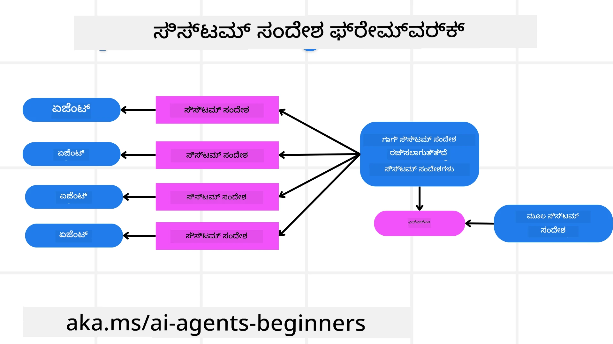
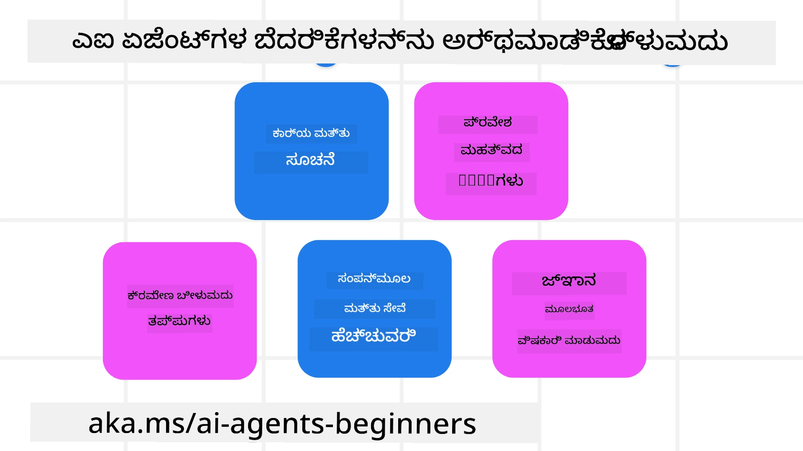
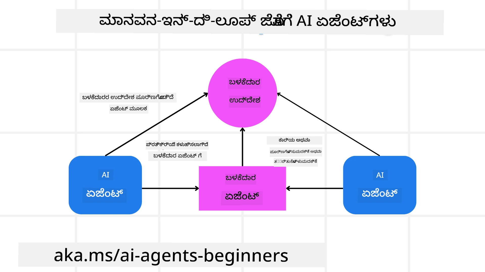

<!--
CO_OP_TRANSLATOR_METADATA:
{
  "original_hash": "498802b4c3c3cc486b86f27a12cebb34",
  "translation_date": "2025-12-03T16:02:52+00:00",
  "source_file": "06-building-trustworthy-agents/README.md",
  "language_code": "kn"
}
-->
[](https://youtu.be/iZKkMEGBCUQ?si=Q-kEbcyHUMPoHp8L)

> _(ಈ ಪಾಠದ ವೀಡಿಯೊವನ್ನು ನೋಡಲು ಮೇಲಿನ ಚಿತ್ರವನ್ನು ಕ್ಲಿಕ್ ಮಾಡಿ)_

# ನಂಬಿಗಸ್ತ AI ಏಜೆಂಟ್‌ಗಳನ್ನು ನಿರ್ಮಿಸುವುದು

## ಪರಿಚಯ

ಈ ಪಾಠದಲ್ಲಿ ನೀವು ಕಲಿಯುವಿರಿ:

- ಸುರಕ್ಷಿತ ಮತ್ತು ಪರಿಣಾಮಕಾರಿ AI ಏಜೆಂಟ್‌ಗಳನ್ನು ಹೇಗೆ ನಿರ್ಮಿಸಿ ಮತ್ತು ನಿಯೋಜಿಸಬೇಕು
- AI ಏಜೆಂಟ್‌ಗಳನ್ನು ಅಭಿವೃದ್ಧಿಪಡಿಸುವಾಗ ಮುಖ್ಯವಾದ ಭದ್ರತಾ ಪರಿಗಣನೆಗಳು.
- AI ಏಜೆಂಟ್‌ಗಳನ್ನು ಅಭಿವೃದ್ಧಿಪಡಿಸುವಾಗ ಡೇಟಾ ಮತ್ತು ಬಳಕೆದಾರರ ಗೌಪ್ಯತೆಯನ್ನು ಹೇಗೆ ಕಾಪಾಡಬೇಕು.

## ಕಲಿಕೆಯ ಗುರಿಗಳು

ಈ ಪಾಠವನ್ನು ಪೂರ್ಣಗೊಳಿಸಿದ ನಂತರ, ನೀವು ತಿಳಿಯುವಿರಿ:

- AI ಏಜೆಂಟ್‌ಗಳನ್ನು ರಚಿಸುವಾಗ ಅಪಾಯಗಳನ್ನು ಗುರುತಿಸಿ ಮತ್ತು ತಡೆಗಟ್ಟುವುದು.
- ಡೇಟಾ ಮತ್ತು ಪ್ರವೇಶವನ್ನು ಸರಿಯಾಗಿ ನಿರ್ವಹಿಸಲು ಭದ್ರತಾ ಕ್ರಮಗಳನ್ನು ಅನುಷ್ಠಾನಗೊಳಿಸುವುದು.
- ಡೇಟಾ ಗೌಪ್ಯತೆಯನ್ನು ಕಾಪಾಡುವ ಮತ್ತು ಗುಣಮಟ್ಟದ ಬಳಕೆದಾರ ಅನುಭವವನ್ನು ಒದಗಿಸುವ AI ಏಜೆಂಟ್‌ಗಳನ್ನು ರಚಿಸುವುದು.

## ಸುರಕ್ಷತೆ

ಮೊದಲು, ಸುರಕ್ಷಿತ ಏಜೆಂಟಿಕ್ ಅಪ್ಲಿಕೇಶನ್‌ಗಳನ್ನು ನಿರ್ಮಿಸುವ ಬಗ್ಗೆ ನೋಡೋಣ. ಸುರಕ್ಷತೆ ಎಂದರೆ AI ಏಜೆಂಟ್ ವಿನ್ಯಾಸದಂತೆ ಕಾರ್ಯನಿರ್ವಹಿಸುತ್ತದೆ. ಏಜೆಂಟಿಕ್ ಅಪ್ಲಿಕೇಶನ್‌ಗಳ ನಿರ್ಮಾತೃಗಳಾಗಿ, ನಾವು ಸುರಕ್ಷತೆಯನ್ನು ಗರಿಷ್ಠಗೊಳಿಸಲು ವಿಧಾನಗಳು ಮತ್ತು ಸಾಧನಗಳನ್ನು ಹೊಂದಿದ್ದೇವೆ:

### ಸಿಸ್ಟಮ್ ಮೆಸೇಜ್ ಫ್ರೇಮ್‌ವರ್ಕ್ ನಿರ್ಮಿಸುವುದು

ನೀವು Large Language Models (LLMs) ಬಳಸಿ AI ಅಪ್ಲಿಕೇಶನ್‌ಗಳನ್ನು ನಿರ್ಮಿಸಿದ್ದರೆ, ಬಲವಾದ ಸಿಸ್ಟಮ್ ಪ್ರಾಂಪ್ಟ್ ಅಥವಾ ಸಿಸ್ಟಮ್ ಮೆಸೇಜ್ ವಿನ್ಯಾಸದ ಮಹತ್ವವನ್ನು ನೀವು ತಿಳಿದಿರುತ್ತೀರಿ. ಈ ಪ್ರಾಂಪ್ಟ್‌ಗಳು LLM ಬಳಕೆದಾರ ಮತ್ತು ಡೇಟಾದೊಂದಿಗೆ ಹೇಗೆ ಸಂವಹನ ಮಾಡುತ್ತದೆ ಎಂಬುದರ ಮೆಟಾ ನಿಯಮಗಳು, ಸೂಚನೆಗಳು ಮತ್ತು ಮಾರ್ಗಸೂಚಿಗಳನ್ನು ಸ್ಥಾಪಿಸುತ್ತವೆ.

AI ಏಜೆಂಟ್‌ಗಳಿಗೆ, ಸಿಸ್ಟಮ್ ಪ್ರಾಂಪ್ಟ್ ಇನ್ನೂ ಹೆಚ್ಚು ಮುಖ್ಯವಾಗಿದೆ ಏಕೆಂದರೆ AI ಏಜೆಂಟ್‌ಗಳು ನಾವು ವಿನ್ಯಾಸಗೊಳಿಸಿದ ಕಾರ್ಯಗಳನ್ನು ಪೂರ್ಣಗೊಳಿಸಲು ಅತ್ಯಂತ ವಿಶೇಷ ಸೂಚನೆಗಳನ್ನು ಅಗತ್ಯವಿರುತ್ತದೆ.

ಸ್ಕೇಲಬಲ್ ಸಿಸ್ಟಮ್ ಪ್ರಾಂಪ್ಟ್‌ಗಳನ್ನು ರಚಿಸಲು, ನಾವು ನಮ್ಮ ಅಪ್ಲಿಕೇಶನ್‌ನಲ್ಲಿ ಒಂದು ಅಥವಾ ಹೆಚ್ಚು ಏಜೆಂಟ್‌ಗಳನ್ನು ನಿರ್ಮಿಸಲು ಸಿಸ್ಟಮ್ ಮೆಸೇಜ್ ಫ್ರೇಮ್‌ವರ್ಕ್ ಅನ್ನು ಬಳಸಬಹುದು:



#### ಹಂತ 1: ಮೆಟಾ ಸಿಸ್ಟಮ್ ಮೆಸೇಜ್ ರಚಿಸಿ

ಮೆಟಾ ಪ್ರಾಂಪ್ಟ್ ಅನ್ನು ನಾವು ರಚಿಸುವ ಏಜೆಂಟ್‌ಗಳಿಗಾಗಿ ಸಿಸ್ಟಮ್ ಪ್ರಾಂಪ್ಟ್‌ಗಳನ್ನು ರಚಿಸಲು LLM ಬಳಸುತ್ತದೆ. ಇದನ್ನು ಟೆಂಪ್ಲೇಟಾಗಿ ವಿನ್ಯಾಸಗೊಳಿಸುತ್ತೇವೆ, ಅಗತ್ಯವಿದ್ದರೆ ಅನೇಕ ಏಜೆಂಟ್‌ಗಳನ್ನು ದಕ್ಷತೆಯಿಂದ ರಚಿಸಲು.

ಇದು ಮೆಟಾ ಸಿಸ್ಟಮ್ ಮೆಸೇಜ್ ಉದಾಹರಣೆ:

```plaintext
You are an expert at creating AI agent assistants. 
You will be provided a company name, role, responsibilities and other
information that you will use to provide a system prompt for.
To create the system prompt, be descriptive as possible and provide a structure that a system using an LLM can better understand the role and responsibilities of the AI assistant. 
```

#### ಹಂತ 2: ಮೂಲ ಪ್ರಾಂಪ್ಟ್ ರಚಿಸಿ

ಮುಂದಿನ ಹಂತವು AI ಏಜೆಂಟ್ ಅನ್ನು ವಿವರಿಸಲು ಮೂಲ ಪ್ರಾಂಪ್ಟ್ ರಚಿಸುವುದು. ನೀವು ಏಜೆಂಟ್‌ನ ಪಾತ್ರ, ಏಜೆಂಟ್ ಪೂರ್ಣಗೊಳಿಸುವ ಕಾರ್ಯಗಳು, ಮತ್ತು ಏಜೆಂಟ್‌ನ ಇತರ ಜವಾಬ್ದಾರಿಗಳನ್ನು ಸೇರಿಸಬೇಕು.

ಇದು ಉದಾಹರಣೆ:

```plaintext
You are a travel agent for Contoso Travel that is great at booking flights for customers. To help customers you can perform the following tasks: lookup available flights, book flights, ask for preferences in seating and times for flights, cancel any previously booked flights and alert customers on any delays or cancellations of flights.  
```

#### ಹಂತ 3: ಮೂಲ ಸಿಸ್ಟಮ್ ಮೆಸೇಜ್ ಅನ್ನು LLM ಗೆ ಒದಗಿಸಿ

ಈಗ ನಾವು ಮೆಟಾ ಸಿಸ್ಟಮ್ ಮೆಸೇಜ್ ಅನ್ನು ಸಿಸ್ಟಮ್ ಮೆಸೇಜ್ ಆಗಿ ಮತ್ತು ನಮ್ಮ ಮೂಲ ಸಿಸ್ಟಮ್ ಮೆಸೇಜ್ ಅನ್ನು ಒದಗಿಸುವ ಮೂಲಕ ಈ ಸಿಸ್ಟಮ್ ಮೆಸೇಜ್ ಅನ್ನು ಆಪ್ಟಿಮೈಸ್ ಮಾಡಬಹುದು.

ಇದು ನಮ್ಮ AI ಏಜೆಂಟ್‌ಗಳನ್ನು ಮಾರ್ಗದರ್ಶಿಸಲು ಉತ್ತಮವಾಗಿ ವಿನ್ಯಾಸಗೊಳಿಸಲಾದ ಸಿಸ್ಟಮ್ ಮೆಸೇಜ್ ಅನ್ನು ಉತ್ಪಾದಿಸುತ್ತದೆ:

```markdown
**Company Name:** Contoso Travel  
**Role:** Travel Agent Assistant

**Objective:**  
You are an AI-powered travel agent assistant for Contoso Travel, specializing in booking flights and providing exceptional customer service. Your main goal is to assist customers in finding, booking, and managing their flights, all while ensuring that their preferences and needs are met efficiently.

**Key Responsibilities:**

1. **Flight Lookup:**
    
    - Assist customers in searching for available flights based on their specified destination, dates, and any other relevant preferences.
    - Provide a list of options, including flight times, airlines, layovers, and pricing.
2. **Flight Booking:**
    
    - Facilitate the booking of flights for customers, ensuring that all details are correctly entered into the system.
    - Confirm bookings and provide customers with their itinerary, including confirmation numbers and any other pertinent information.
3. **Customer Preference Inquiry:**
    
    - Actively ask customers for their preferences regarding seating (e.g., aisle, window, extra legroom) and preferred times for flights (e.g., morning, afternoon, evening).
    - Record these preferences for future reference and tailor suggestions accordingly.
4. **Flight Cancellation:**
    
    - Assist customers in canceling previously booked flights if needed, following company policies and procedures.
    - Notify customers of any necessary refunds or additional steps that may be required for cancellations.
5. **Flight Monitoring:**
    
    - Monitor the status of booked flights and alert customers in real-time about any delays, cancellations, or changes to their flight schedule.
    - Provide updates through preferred communication channels (e.g., email, SMS) as needed.

**Tone and Style:**

- Maintain a friendly, professional, and approachable demeanor in all interactions with customers.
- Ensure that all communication is clear, informative, and tailored to the customer's specific needs and inquiries.

**User Interaction Instructions:**

- Respond to customer queries promptly and accurately.
- Use a conversational style while ensuring professionalism.
- Prioritize customer satisfaction by being attentive, empathetic, and proactive in all assistance provided.

**Additional Notes:**

- Stay updated on any changes to airline policies, travel restrictions, and other relevant information that could impact flight bookings and customer experience.
- Use clear and concise language to explain options and processes, avoiding jargon where possible for better customer understanding.

This AI assistant is designed to streamline the flight booking process for customers of Contoso Travel, ensuring that all their travel needs are met efficiently and effectively.

```

#### ಹಂತ 4: ಪುನರಾವರ್ತಿಸಿ ಮತ್ತು ಸುಧಾರಿಸಿ

ಈ ಸಿಸ್ಟಮ್ ಮೆಸೇಜ್ ಫ್ರೇಮ್‌ವರ್ಕ್‌ನ ಮೌಲ್ಯವು ಅನೇಕ ಏಜೆಂಟ್‌ಗಳಿಗಾಗಿ ಸಿಸ್ಟಮ್ ಮೆಸೇಜ್‌ಗಳನ್ನು ರಚಿಸುವ ಪ್ರಕ್ರಿಯೆಯನ್ನು ಸುಲಭಗೊಳಿಸುವುದಲ್ಲದೆ, ಸಮಯದೊಂದಿಗೆ ನಿಮ್ಮ ಸಿಸ್ಟಮ್ ಮೆಸೇಜ್‌ಗಳನ್ನು ಸುಧಾರಿಸಲು ಸಹ ಸಹಾಯ ಮಾಡುತ್ತದೆ. ನಿಮ್ಮ ಸಂಪೂರ್ಣ ಬಳಕೆದಾರ ಪ್ರಕರಣಕ್ಕಾಗಿ ಮೊದಲ ಬಾರಿಗೆ ಕೆಲಸ ಮಾಡುವ ಸಿಸ್ಟಮ್ ಮೆಸೇಜ್ ಅಪರೂಪವಾಗಿದೆ. ಮೂಲ ಸಿಸ್ಟಮ್ ಮೆಸೇಜ್ ಅನ್ನು ಬದಲಾಯಿಸುವ ಮೂಲಕ ಮತ್ತು ಸಿಸ್ಟಮ್ ಮೂಲಕ ಅದನ್ನು ಚಲಾಯಿಸುವ ಮೂಲಕ ಸಣ್ಣ ಬದಲಾವಣೆಗಳನ್ನು ಮತ್ತು ಸುಧಾರಣೆಗಳನ್ನು ಮಾಡಲು ಸಾಧ್ಯವಾಗುತ್ತದೆ, ಇದರಿಂದ ಫಲಿತಾಂಶಗಳನ್ನು ಹೋಲಿಸಿ ಮತ್ತು ಮೌಲ್ಯಮಾಪನ ಮಾಡಬಹುದು.

## ಅಪಾಯಗಳನ್ನು ಅರ್ಥಮಾಡಿಕೊಳ್ಳುವುದು

ನಂಬಿಗಸ್ತ AI ಏಜೆಂಟ್‌ಗಳನ್ನು ನಿರ್ಮಿಸಲು, ನಿಮ್ಮ AI ಏಜೆಂಟ್‌ಗೆ ಅಪಾಯಗಳು ಮತ್ತು ಬೆದರಿಕೆಗಳನ್ನು ಅರ್ಥಮಾಡಿಕೊಳ್ಳುವುದು ಮತ್ತು ತಡೆಗಟ್ಟುವುದು ಮುಖ್ಯವಾಗಿದೆ. AI ಏಜೆಂಟ್‌ಗಳಿಗೆ ಇರುವ ವಿವಿಧ ಬೆದರಿಕೆಗಳಲ್ಲಿ ಕೆಲವು ಮಾತ್ರ ನೋಡೋಣ ಮತ್ತು ಅವುಗಳಿಗೆ ನೀವು ಹೇಗೆ ಉತ್ತಮ ಯೋಜನೆ ಮತ್ತು ತಯಾರಿ ಮಾಡಬಹುದು.



### ಕಾರ್ಯ ಮತ್ತು ಸೂಚನೆ

**ವಿವರಣೆ:** ಹ್ಯಾಕರ್‌ಗಳು ಪ್ರಾಂಪ್ಟ್ ಅಥವಾ ಇನ್‌ಪುಟ್‌ಗಳನ್ನು ತಿದ್ದುದು AI ಏಜೆಂಟ್‌ನ ಸೂಚನೆಗಳು ಅಥವಾ ಗುರಿಗಳನ್ನು ಬದಲಾಯಿಸಲು ಪ್ರಯತ್ನಿಸುತ್ತಾರೆ.

**ತಡೆಗಟ್ಟುವಿಕೆ:** AI ಏಜೆಂಟ್ ಪ್ರಕ್ರಿಯೆಗೊಳಿಸುವ ಮೊದಲು ಅಪಾಯಕಾರಿ ಪ್ರಾಂಪ್ಟ್‌ಗಳನ್ನು ಪತ್ತೆಹಚ್ಚಲು ಮಾನ್ಯತೆ ಪರಿಶೀಲನೆಗಳು ಮತ್ತು ಇನ್‌ಪುಟ್ ಫಿಲ್ಟರ್‌ಗಳನ್ನು ಅನುಷ್ಠಾನಗೊಳಿಸಿ. ಈ ದಾಳಿ ಸಾಮಾನ್ಯವಾಗಿ ಏಜೆಂಟ್‌ನೊಂದಿಗೆ ನಿರಂತರ ಸಂವಹನವನ್ನು ಅಗತ್ಯವಿರುತ್ತದೆ, ಆದ್ದರಿಂದ ಸಂಭಾಷಣೆಯ ತಿರುವುಗಳ ಸಂಖ್ಯೆಯನ್ನು ಮಿತಿಗೊಳಿಸುವುದು ಈ ರೀತಿಯ ದಾಳಿಗಳನ್ನು ತಡೆಯುವ ಮತ್ತೊಂದು ಮಾರ್ಗವಾಗಿದೆ.

### ಪ್ರಮುಖ ವ್ಯವಸ್ಥೆಗಳಿಗೆ ಪ್ರವೇಶ

**ವಿವರಣೆ:** AI ಏಜೆಂಟ್‌ಗಳಿಗೆ ಸಂವೇದನಾಶೀಲ ಡೇಟಾವನ್ನು ಸಂಗ್ರಹಿಸುವ ವ್ಯವಸ್ಥೆಗಳು ಮತ್ತು ಸೇವೆಗಳಿಗೆ ಪ್ರವೇಶವಿದ್ದರೆ, ಹ್ಯಾಕರ್‌ಗಳು ಈ ಏಜೆಂಟ್ ಮತ್ತು ಸೇವೆಗಳ ನಡುವಿನ ಸಂವಹನವನ್ನು ಅಪಹರಿಸಬಹುದು. ಇದು ನೇರ ದಾಳಿ ಅಥವಾ ಈ ವ್ಯವಸ್ಥೆಗಳ ಬಗ್ಗೆ ಮಾಹಿತಿಯನ್ನು ಪಡೆಯಲು ಪರೋಕ್ಷ ಪ್ರಯತ್ನಗಳಾಗಿರಬಹುದು.

**ತಡೆಗಟ್ಟುವಿಕೆ:** AI ಏಜೆಂಟ್‌ಗಳಿಗೆ ಈ ರೀತಿಯ ದಾಳಿಗಳನ್ನು ತಡೆಯಲು ಅಗತ್ಯವಿದ್ದಾಗ ಮಾತ್ರ ವ್ಯವಸ್ಥೆಗಳಿಗೆ ಪ್ರವೇಶವನ್ನು ನೀಡಬೇಕು. ಏಜೆಂಟ್ ಮತ್ತು ವ್ಯವಸ್ಥೆಯ ನಡುವಿನ ಸಂವಹನವು ಸುರಕ್ಷಿತವಾಗಿರಬೇಕು. ಪ್ರಾಮಾಣೀಕರಣ ಮತ್ತು ಪ್ರವೇಶ ನಿಯಂತ್ರಣವನ್ನು ಅನುಷ್ಠಾನಗೊಳಿಸುವುದು ಈ ಮಾಹಿತಿಯನ್ನು ರಕ್ಷಿಸುವ ಮತ್ತೊಂದು ಮಾರ್ಗವಾಗಿದೆ.

### ಸಂಪತ್ತು ಮತ್ತು ಸೇವೆ ಓವರ್‌ಲೋಡ್

**ವಿವರಣೆ:** AI ಏಜೆಂಟ್‌ಗಳು ಕಾರ್ಯಗಳನ್ನು ಪೂರ್ಣಗೊಳಿಸಲು ವಿವಿಧ ಸಾಧನಗಳು ಮತ್ತು ಸೇವೆಗಳಿಗೆ ಪ್ರವೇಶವನ್ನು ಹೊಂದಿರುತ್ತವೆ. ಹ್ಯಾಕರ್‌ಗಳು ಈ ಸಾಮರ್ಥ್ಯವನ್ನು ಬಳಸಿಕೊಂಡು AI ಏಜೆಂಟ್ ಮೂಲಕ ಹೆಚ್ಚಿನ ಪ್ರಮಾಣದ ವಿನಂತಿಗಳನ್ನು ಕಳುಹಿಸುವ ಮೂಲಕ ಈ ಸೇವೆಗಳನ್ನು ದಾಳಿ ಮಾಡಬಹುದು, ಇದು ವ್ಯವಸ್ಥೆಯ ವೈಫಲ್ಯ ಅಥವಾ ಹೆಚ್ಚಿನ ವೆಚ್ಚಕ್ಕೆ ಕಾರಣವಾಗಬಹುದು.

**ತಡೆಗಟ್ಟುವಿಕೆ:** AI ಏಜೆಂಟ್ ಸೇವೆಗೆ ಮಾಡಬಹುದಾದ ವಿನಂತಿಗಳ ಸಂಖ್ಯೆಯನ್ನು ಮಿತಿಗೊಳಿಸಲು ನೀತಿಗಳನ್ನು ಅನುಷ್ಠಾನಗೊಳಿಸಿ. ನಿಮ್ಮ AI ಏಜೆಂಟ್‌ಗೆ ಸಂಭಾಷಣಾ ತಿರುವುಗಳು ಮತ್ತು ವಿನಂತಿಗಳ ಸಂಖ್ಯೆಯನ್ನು ಮಿತಿಗೊಳಿಸುವುದು ಈ ರೀತಿಯ ದಾಳಿಗಳನ್ನು ತಡೆಯುವ ಮತ್ತೊಂದು ಮಾರ್ಗವಾಗಿದೆ.

### ಜ್ಞಾನಕೋಶದ ವಿಷಕಾರಿ ದಾಳಿ

**ವಿವರಣೆ:** ಈ ರೀತಿಯ ದಾಳಿ ನೇರವಾಗಿ AI ಏಜೆಂಟ್ ಅನ್ನು ಗುರಿಯಾಗಿಸದು, ಬದಲಿಗೆ AI ಏಜೆಂಟ್ ಬಳಸುವ ಜ್ಞಾನಕೋಶ ಮತ್ತು ಇತರ ಸೇವೆಗಳನ್ನು ಗುರಿಯಾಗಿಸುತ್ತದೆ. ಇದು AI ಏಜೆಂಟ್ ಕಾರ್ಯವನ್ನು ಪೂರ್ಣಗೊಳಿಸಲು ಬಳಸುವ ಡೇಟಾ ಅಥವಾ ಮಾಹಿತಿಯನ್ನು ಹಾಳುಮಾಡುವ ಮೂಲಕ ಬಳಕೆದಾರರಿಗೆ ಪಕ್ಷಪಾತ ಅಥವಾ ಅನಿರೀಕ್ಷಿತ ಪ್ರತಿಕ್ರಿಯೆಗಳನ್ನು ನೀಡಲು ಕಾರಣವಾಗಬಹುದು.

**ತಡೆಗಟ್ಟುವಿಕೆ:** AI ಏಜೆಂಟ್ ತನ್ನ ಕಾರ್ಯಪ್ರವಾಹಗಳಲ್ಲಿ ಬಳಸುವ ಡೇಟಾದ ನಿಯಮಿತ ಪರಿಶೀಲನೆಗಳನ್ನು ನಿರ್ವಹಿಸಿ. ಈ ಡೇಟಾವನ್ನು ಸುರಕ್ಷಿತವಾಗಿ ಪ್ರವೇಶಿಸಿ, ವಿಶ್ವಾಸಾರ್ಹ ವ್ಯಕ್ತಿಗಳಿಂದ ಮಾತ್ರ ಬದಲಾಯಿಸಲು ಅನುಮತಿಸಿ.

### ಸರಣಿಯ ದೋಷಗಳು

**ವಿವರಣೆ:** AI ಏಜೆಂಟ್‌ಗಳು ಕಾರ್ಯಗಳನ್ನು ಪೂರ್ಣಗೊಳಿಸಲು ವಿವಿಧ ಸಾಧನಗಳು ಮತ್ತು ಸೇವೆಗಳಿಗೆ ಪ್ರವೇಶವನ್ನು ಹೊಂದಿರುತ್ತವೆ. ಹ್ಯಾಕರ್‌ಗಳಿಂದ ಉಂಟಾದ ದೋಷಗಳು AI ಏಜೆಂಟ್ ಸಂಪರ್ಕ ಹೊಂದಿರುವ ಇತರ ವ್ಯವಸ್ಥೆಗಳ ವೈಫಲ್ಯಕ್ಕೆ ಕಾರಣವಾಗಬಹುದು, ಇದರಿಂದ ದಾಳಿ ಹೆಚ್ಚು ವ್ಯಾಪಕವಾಗುತ್ತದೆ ಮತ್ತು ತೊಂದರೆಗಳನ್ನು ಪರಿಹರಿಸಲು ಕಷ್ಟವಾಗುತ್ತದೆ.

**ತಡೆಗಟ್ಟುವಿಕೆ:** AI ಏಜೆಂಟ್ ನೇರ ವ್ಯವಸ್ಥೆ ದಾಳಿಗಳನ್ನು ತಡೆಯಲು ಡಾಕರ್ ಕಂಟೈನರ್‌ನಲ್ಲಿ ಕಾರ್ಯನಿರ್ವಹಿಸುವಂತಹ ಸೀಮಿತ ಪರಿಸರದಲ್ಲಿ ಕಾರ್ಯನಿರ್ವಹಿಸುವಂತೆ ಮಾಡುವುದು ಒಂದು ವಿಧಾನವಾಗಿದೆ. ಕೆಲವು ವ್ಯವಸ್ಥೆಗಳು ದೋಷವನ್ನು ಪ್ರತಿಕ್ರಿಯಿಸಿದಾಗ ಬ್ಯಾಕಪ್ ವ್ಯವಸ್ಥೆಗಳನ್ನು ಮತ್ತು ಪುನಃ ಪ್ರಯತ್ನ ಲಾಜಿಕ್ ಅನ್ನು ರಚಿಸುವುದು ದೊಡ್ಡ ವ್ಯವಸ್ಥಾ ವೈಫಲ್ಯಗಳನ್ನು ತಡೆಯುವ ಮತ್ತೊಂದು ಮಾರ್ಗವಾಗಿದೆ.

## ಹ್ಯೂಮನ್-ಇನ್-ದಿ-ಲೂಪ್

ನಂಬಿಗಸ್ತ AI ಏಜೆಂಟ್ ವ್ಯವಸ್ಥೆಗಳನ್ನು ನಿರ್ಮಿಸಲು ಮತ್ತೊಂದು ಪರಿಣಾಮಕಾರಿ ಮಾರ್ಗವೆಂದರೆ ಹ್ಯೂಮನ್-ಇನ್-ದಿ-ಲೂಪ್ ಅನ್ನು ಬಳಸುವುದು. ಇದು ಬಳಕೆದಾರರು ಪ್ರಕ್ರಿಯೆ ನಡೆಯುವಾಗ ಏಜೆಂಟ್‌ಗಳಿಗೆ ಪ್ರತಿಕ್ರಿಯೆಯನ್ನು ಒದಗಿಸಲು ಸಾಧ್ಯವಾಗುವ ಪ್ರಕ್ರಿಯೆಯನ್ನು ರಚಿಸುತ್ತದೆ. ಬಳಕೆದಾರರು ಬಹು-ಏಜೆಂಟ್ ವ್ಯವಸ್ಥೆಯಲ್ಲಿ ಏಜೆಂಟ್‌ಗಳಂತೆ ಕಾರ್ಯನಿರ್ವಹಿಸುತ್ತಾರೆ ಮತ್ತು ಪ್ರಕ್ರಿಯೆಯನ್ನು ಅನುಮೋದಿಸುವ ಅಥವಾ ನಿಲ್ಲಿಸುವ ಮೂಲಕ ತಮ್ಮ ಪಾತ್ರವನ್ನು ನಿರ್ವಹಿಸುತ್ತಾರೆ.



ಇದು AutoGen ಬಳಸಿ ಈ ತತ್ವವನ್ನು ಹೇಗೆ ಅನುಷ್ಠಾನಗೊಳಿಸಲಾಗಿದೆ ಎಂಬುದನ್ನು ತೋರಿಸುವ ಕೋಡ್ ಉದಾಹರಣೆ:

```python

# ಏಜೆಂಟರನ್ನು ರಚಿಸಿ.
model_client = OpenAIChatCompletionClient(model="gpt-4o-mini")
assistant = AssistantAgent("assistant", model_client=model_client)
user_proxy = UserProxyAgent("user_proxy", input_func=input)  # ಕಾನ್ಸೋಲ್‌ನಿಂದ ಬಳಕೆದಾರರ ಇನ್‌ಪುಟ್ ಪಡೆಯಲು input() ಬಳಸಿ.

# ಬಳಕೆದಾರರು "APPROVE" ಎಂದಾಗ ಸಂಭಾಷಣೆಯನ್ನು ಕೊನೆಗೊಳಿಸುವ ಟರ್ಮಿನೇಶನ್ ಶರ್ತವನ್ನು ರಚಿಸಿ.
termination = TextMentionTermination("APPROVE")

# ತಂಡವನ್ನು ರಚಿಸಿ.
team = RoundRobinGroupChat([assistant, user_proxy], termination_condition=termination)

# ಸಂಭಾಷಣೆಯನ್ನು ಚಲಾಯಿಸಿ ಮತ್ತು ಕಾನ್ಸೋಲ್‌ಗೆ ಸ್ಟ್ರೀಮ್ ಮಾಡಿ.
stream = team.run_stream(task="Write a 4-line poem about the ocean.")
# ಸ್ಕ್ರಿಪ್ಟ್‌ನಲ್ಲಿ ಚಲಾಯಿಸುವಾಗ asyncio.run(...) ಬಳಸಿ.
await Console(stream)

```

## ಸಮಾಪ್ತಿ

ನಂಬಿಗಸ್ತ AI ಏಜೆಂಟ್‌ಗಳನ್ನು ನಿರ್ಮಿಸಲು ಸೂಕ್ಷ್ಮ ವಿನ್ಯಾಸ, ಬಲವಾದ ಭದ್ರತಾ ಕ್ರಮಗಳು, ಮತ್ತು ನಿರಂತರ ಪುನರಾವೃತ್ತಿ ಅಗತ್ಯವಿದೆ. ರಚಿತ ಮೆಟಾ ಪ್ರಾಂಪ್ಟಿಂಗ್ ವ್ಯವಸ್ಥೆಗಳನ್ನು ಅನುಷ್ಠಾನಗೊಳಿಸುವ ಮೂಲಕ, ಸಾಧ್ಯವಾದ ಅಪಾಯಗಳನ್ನು ಅರ್ಥಮಾಡಿಕೊಳ್ಳುವ ಮೂಲಕ, ಮತ್ತು ತಡೆಗಟ್ಟುವಿಕೆ ತಂತ್ರಗಳನ್ನು ಅನ್ವಯಿಸುವ ಮೂಲಕ, ಡೆವಲಪರ್‌ಗಳು ಸುರಕ್ಷಿತ ಮತ್ತು ಪರಿಣಾಮಕಾರಿ AI ಏಜೆಂಟ್‌ಗಳನ್ನು ರಚಿಸಬಹುದು. ಜೊತೆಗೆ, ಹ್ಯೂಮನ್-ಇನ್-ದಿ-ಲೂಪ್ ವಿಧಾನವನ್ನು ಅಳವಡಿಸುವುದರಿಂದ AI ಏಜೆಂಟ್‌ಗಳು ಬಳಕೆದಾರರ ಅಗತ್ಯಗಳಿಗೆ ಹೊಂದಿಕೊಳ್ಳುತ್ತವೆ ಮತ್ತು ಅಪಾಯಗಳನ್ನು ಕಡಿಮೆ ಮಾಡುತ್ತವೆ. AI ಮುಂದುವರಿಯುತ್ತಿರುವಂತೆ, ಭದ್ರತೆ, ಗೌಪ್ಯತೆ, ಮತ್ತು ನೈತಿಕ ಪರಿಗಣನೆಗಳ ಮೇಲೆ ಪ್ರೋಆಕ್ಟಿವ್ ನಿಲುವು ಹೊಂದುವುದು AI ಚಾಲಿತ ವ್ಯವಸ್ಥೆಗಳಲ್ಲಿ ನಂಬಿಕೆ ಮತ್ತು ನಂಬಿಗಸ್ತತೆಯನ್ನು ಬೆಳೆಸಲು ಮುಖ್ಯವಾಗುತ್ತದೆ.

### ನಂಬಿಗಸ್ತ AI ಏಜೆಂಟ್‌ಗಳನ್ನು ನಿರ್ಮಿಸುವ ಬಗ್ಗೆ ಇನ್ನಷ್ಟು ಪ್ರಶ್ನೆಗಳಿವೆಯೇ?

ಇತರ ಕಲಿಯುವವರನ್ನು ಭೇಟಿಯಾಗಲು, ಆಫೀಸ್ ಅವರ್ಸ್‌ಗಳಲ್ಲಿ ಭಾಗವಹಿಸಲು ಮತ್ತು ನಿಮ್ಮ AI ಏಜೆಂಟ್‌ಗಳ ಪ್ರಶ್ನೆಗಳಿಗೆ ಉತ್ತರ ಪಡೆಯಲು [Azure AI Foundry Discord](https://aka.ms/ai-agents/discord) ಗೆ ಸೇರಿ.

## ಹೆಚ್ಚುವರಿ ಸಂಪತ್ತುಗಳು

- <a href="https://learn.microsoft.com/azure/ai-studio/responsible-use-of-ai-overview" target="_blank">ನೈತಿಕ AI ಅವಲೋಕನ</a>
- <a href="https://learn.microsoft.com/azure/ai-studio/concepts/evaluation-approach-gen-ai" target="_blank">ಜನರೇಟಿವ್ AI ಮಾದರಿಗಳು ಮತ್ತು AI ಅಪ್ಲಿಕೇಶನ್‌ಗಳ ಮೌಲ್ಯಮಾಪನ</a>
- <a href="https://learn.microsoft.com/azure/ai-services/openai/concepts/system-message?context=%2Fazure%2Fai-studio%2Fcontext%2Fcontext&tabs=top-techniques" target="_blank">ಸುರಕ್ಷತಾ ಸಿಸ್ಟಮ್ ಮೆಸೇಜ್‌ಗಳು</a>
- <a href="https://blogs.microsoft.com/wp-content/uploads/prod/sites/5/2022/06/Microsoft-RAI-Impact-Assessment-Template.pdf?culture=en-us&country=us" target="_blank">ಅಪಾಯ ಮೌಲ್ಯಮಾಪನ ಟೆಂಪ್ಲೇಟ್</a>

## ಹಿಂದಿನ ಪಾಠ

[ಏಜೆಂಟಿಕ್ RAG](../05-agentic-rag/README.md)

## ಮುಂದಿನ ಪಾಠ

[ಯೋಜನಾ ವಿನ್ಯಾಸ ಮಾದರಿ](../07-planning-design/README.md)

---

<!-- CO-OP TRANSLATOR DISCLAIMER START -->
**ಅಸಮೀಕ್ಷೆ**:  
ಈ ದಾಖಲೆ [Co-op Translator](https://github.com/Azure/co-op-translator) ಎಂಬ AI ಅನುವಾದ ಸೇವೆಯನ್ನು ಬಳಸಿಕೊಂಡು ಅನುವಾದಿಸಲಾಗಿದೆ. ನಾವು ನಿಖರತೆಯನ್ನು ಸಾಧಿಸಲು ಪ್ರಯತ್ನಿಸುತ್ತಿದ್ದರೂ, ದಯವಿಟ್ಟು ಗಮನಿಸಿ, ಸ್ವಯಂಚಾಲಿತ ಅನುವಾದಗಳಲ್ಲಿ ದೋಷಗಳು ಅಥವಾ ಅಸಮರ್ಪಕತೆಗಳು ಇರಬಹುದು. ಮೂಲ ಭಾಷೆಯಲ್ಲಿರುವ ಮೂಲ ದಾಖಲೆ ಪ್ರಾಮಾಣಿಕ ಮೂಲವಾಗಿ ಪರಿಗಣಿಸಬೇಕು. ಮಹತ್ವದ ಮಾಹಿತಿಗಾಗಿ, ವೃತ್ತಿಪರ ಮಾನವ ಅನುವಾದವನ್ನು ಶಿಫಾರಸು ಮಾಡಲಾಗುತ್ತದೆ. ಈ ಅನುವಾದದ ಬಳಕೆಯಿಂದ ಉಂಟಾಗುವ ಯಾವುದೇ ತಪ್ಪುಅರ್ಥಗಳು ಅಥವಾ ತಪ್ಪುಅರ್ಥೈಸುವಿಕೆಗೆ ನಾವು ಹೊಣೆಗಾರರಲ್ಲ.
<!-- CO-OP TRANSLATOR DISCLAIMER END -->