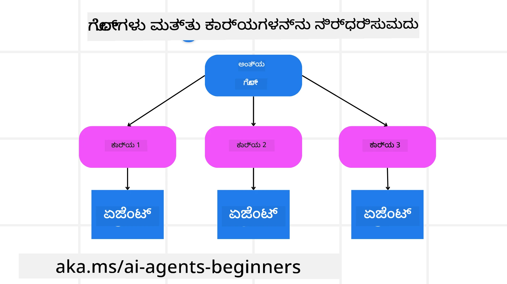

<!--
CO_OP_TRANSLATOR_METADATA:
{
  "original_hash": "43069833a0412210ad5c3cc93d9c2146",
  "translation_date": "2025-12-03T17:21:56+00:00",
  "source_file": "07-planning-design/README.md",
  "language_code": "kn"
}
-->
[](https://youtu.be/kPfJ2BrBCMY?si=9pYpPXp0sSbK91Dr)

> _(ಈ ಪಾಠದ ವೀಡಿಯೊವನ್ನು ನೋಡಲು ಮೇಲಿನ ಚಿತ್ರವನ್ನು ಕ್ಲಿಕ್ ಮಾಡಿ)_

# ಯೋಜನೆ ವಿನ್ಯಾಸ

## ಪರಿಚಯ

ಈ ಪಾಠದಲ್ಲಿ ನಾವು ಚರ್ಚಿಸುವುದು:

* ಸ್ಪಷ್ಟವಾದ ಒಟ್ಟು ಗುರಿಯನ್ನು ನಿರ್ಧರಿಸಿ ಮತ್ತು ಸಂಕೀರ್ಣವಾದ ಕಾರ್ಯವನ್ನು ನಿರ್ವಹಿಸಬಹುದಾದ ಕಾರ್ಯಗಳಲ್ಲಿ ವಿಭಜಿಸಿ.
* ರಚಿತ ಔಟ್‌ಪುಟ್ ಅನ್ನು ಬಳಸಿಕೊಂಡು ಹೆಚ್ಚು ನಂಬಬಹುದಾದ ಮತ್ತು ಯಂತ್ರ-ಓದಬಹುದಾದ ಪ್ರತಿಕ್ರಿಯೆಗಳನ್ನು ಪಡೆಯುವುದು.
* ಡೈನಾಮಿಕ್ ಕಾರ್ಯಗಳು ಮತ್ತು ಅಪ್ರತೀಕ್ಷಿತ ಇನ್‌ಪುಟ್‌ಗಳನ್ನು ನಿರ್ವಹಿಸಲು ಈವೆಂಟ್-ಚಾಲಿತ ವಿಧಾನವನ್ನು ಅನ್ವಯಿಸುವುದು.

## ಕಲಿಕೆಯ ಗುರಿಗಳು

ಈ ಪಾಠವನ್ನು ಪೂರ್ಣಗೊಳಿಸಿದ ನಂತರ, ನೀವು ಈ ವಿಷಯಗಳ ಬಗ್ಗೆ ತಿಳಿದುಕೊಳ್ಳುತ್ತೀರಿ:

* AI ಏಜೆಂಟ್‌ಗೆ ಒಟ್ಟು ಗುರಿಯನ್ನು ಗುರುತಿಸಿ ಮತ್ತು ಹೊಂದಿಸಿ, ಅದು ಏನು ಸಾಧಿಸಬೇಕೆಂದು ಸ್ಪಷ್ಟವಾಗಿ ತಿಳಿಯುವಂತೆ ಮಾಡುವುದು.
* ಸಂಕೀರ್ಣವಾದ ಕಾರ್ಯವನ್ನು ನಿರ್ವಹಿಸಬಹುದಾದ ಉಪಕಾರ್ಯಗಳಲ್ಲಿ ವಿಭಜಿಸಿ ಮತ್ತು ಅವುಗಳನ್ನು ತಾರ್ಕಿಕ ಕ್ರಮದಲ್ಲಿ ಸಂಘಟಿಸುವುದು.
* ಏಜೆಂಟ್‌ಗಳಿಗೆ ಸರಿಯಾದ ಸಾಧನಗಳನ್ನು (ಉದಾ., ಶೋಧನೆ ಸಾಧನಗಳು ಅಥವಾ ಡೇಟಾ ವಿಶ್ಲೇಷಣೆ ಸಾಧನಗಳು) ಒದಗಿಸಿ, ಅವುಗಳನ್ನು ಯಾವಾಗ ಮತ್ತು ಹೇಗೆ ಬಳಸಬೇಕು ಎಂಬುದನ್ನು ನಿರ್ಧರಿಸಿ, ಮತ್ತು ಉಂಟಾಗುವ ಅಪ್ರತೀಕ್ಷಿತ ಪರಿಸ್ಥಿತಿಗಳನ್ನು ನಿರ್ವಹಿಸುವುದು.
* ಉಪಕಾರ್ಯದ ಫಲಿತಾಂಶಗಳನ್ನು ಮೌಲ್ಯಮಾಪನ ಮಾಡಿ, ಕಾರ್ಯಕ್ಷಮತೆಯನ್ನು ಅಳೆಯಿರಿ, ಮತ್ತು ಅಂತಿಮ ಔಟ್‌ಪುಟ್ ಅನ್ನು ಸುಧಾರಿಸಲು ಕ್ರಮಗಳನ್ನು ಪುನರಾವರ್ತಿಸಿ.

## ಒಟ್ಟು ಗುರಿಯನ್ನು ನಿರ್ಧರಿಸುವುದು ಮತ್ತು ಕಾರ್ಯವನ್ನು ವಿಭಜಿಸುವುದು



ಬಹುತೇಕ ನಿಜಜೀವನದ ಕಾರ್ಯಗಳು ಒಂದೇ ಹೆಜ್ಜೆಯಲ್ಲಿ ನಿರ್ವಹಿಸಲು ತುಂಬಾ ಸಂಕೀರ್ಣವಾಗಿರುತ್ತವೆ. AI ಏಜೆಂಟ್ ತನ್ನ ಯೋಜನೆ ಮತ್ತು ಕ್ರಿಯೆಗಳನ್ನು ಮಾರ್ಗದರ್ಶಿಸಲು ಸಂಕ್ಷಿಪ್ತ ಗುರಿಯನ್ನು ಅಗತ್ಯವಿದೆ. ಉದಾಹರಣೆಗೆ, ಈ ಗುರಿಯನ್ನು ಪರಿಗಣಿಸಿ:

    "3 ದಿನಗಳ ಪ್ರಯಾಣದ ಯೋಜನೆಯನ್ನು ರಚಿಸಿ."

ಇದು ಹೇಳಲು ಸರಳವಾದರೂ, ಇನ್ನೂ ಹೆಚ್ಚು ಸ್ಪಷ್ಟೀಕರಣ ಅಗತ್ಯವಿದೆ. ಗುರಿ ಹೆಚ್ಚು ಸ್ಪಷ್ಟವಾಗಿದ್ದರೆ, ಏಜೆಂಟ್ (ಮತ್ತು ಯಾವುದೇ ಮಾನವ ಸಹಕರಿಸುವವರು) ಸರಿಯಾದ ಫಲಿತಾಂಶವನ್ನು ಸಾಧಿಸಲು ಹೆಚ್ಚು ಗಮನಹರಿಸಬಹುದು, ಉದಾಹರಣೆಗೆ ವಿಮಾನ ಆಯ್ಕೆಗಳು, ಹೋಟೆಲ್ ಶಿಫಾರಸುಗಳು, ಮತ್ತು ಚಟುವಟಿಕೆ ಸಲಹೆಗಳನ್ನು ಒಳಗೊಂಡ ಸಮಗ್ರ ಯೋಜನೆಯನ್ನು ರಚಿಸುವುದು.

### ಕಾರ್ಯ ವಿಭಜನೆ

ದೊಡ್ಡ ಅಥವಾ ಸಂಕೀರ್ಣವಾದ ಕಾರ್ಯಗಳು ಚಿಕ್ಕ, ಗುರಿ-ಆಧಾರಿತ ಉಪಕಾರ್ಯಗಳಲ್ಲಿ ವಿಭಜಿಸಿದಾಗ ಹೆಚ್ಚು ನಿರ್ವಹಿಸಬಹುದಾಗುತ್ತವೆ. ಪ್ರಯಾಣದ ಯೋಜನೆ ಉದಾಹರಣೆಗೆ, ನೀವು ಗುರಿಯನ್ನು ಈ ರೀತಿಯಾಗಿ ವಿಭಜಿಸಬಹುದು:

* ವಿಮಾನ ಬುಕ್ಕಿಂಗ್
* ಹೋಟೆಲ್ ಬುಕ್ಕಿಂಗ್
* ಕಾರ್ ಬಾಡಿಗೆ
* ವೈಯಕ್ತಿಕೀಕರಣ

ಪ್ರತಿ ಉಪಕಾರ್ಯವನ್ನು ನಂತರ ನಿಗದಿತ ಏಜೆಂಟ್‌ಗಳು ಅಥವಾ ಪ್ರಕ್ರಿಯೆಗಳಿಂದ ನಿರ್ವಹಿಸಬಹುದು. ಒಂದು ಏಜೆಂಟ್ ಉತ್ತಮ ವಿಮಾನ ಡೀಲ್‌ಗಳನ್ನು ಹುಡುಕುವಲ್ಲಿ ಪರಿಣತಿಯನ್ನು ಹೊಂದಿರಬಹುದು, ಇನ್ನೊಂದು ಹೋಟೆಲ್ ಬುಕ್ಕಿಂಗ್‌ಗಳಲ್ಲಿ ಗಮನಹರಿಸಬಹುದು, ಇತ್ಯಾದಿ. ಸಂಯೋಜಿಸುವ ಅಥವಾ "ಡೌನ್‌ಸ್ಟ್ರೀಮ್" ಏಜೆಂಟ್ ನಂತರ ಈ ಫಲಿತಾಂಶಗಳನ್ನು ಅಂತಿಮ ಬಳಕೆದಾರರಿಗೆ ಒಬ್ಬ ಸಮಗ್ರ ಯೋಜನೆಗೆ ಸಂಗ್ರಹಿಸಬಹುದು.

ಈ ಮಾದರಿಯ ವಿಧಾನವು ಹಂತ ಹಂತವಾಗಿ ಸುಧಾರಣೆಗಳನ್ನು ಮಾಡಲು ಸಹ ಅವಕಾಶವನ್ನು ಒದಗಿಸುತ್ತದೆ. ಉದಾಹರಣೆಗೆ, ನೀವು ಆಹಾರ ಶಿಫಾರಸುಗಳು ಅಥವಾ ಸ್ಥಳೀಯ ಚಟುವಟಿಕೆ ಸಲಹೆಗಳಿಗೆ ಪರಿಣತ ಏಜೆಂಟ್‌ಗಳನ್ನು ಸೇರಿಸಬಹುದು ಮತ್ತು ಸಮಯದೊಂದಿಗೆ ಯೋಜನೆಯನ್ನು ಸುಧಾರಿಸಬಹುದು.

### ರಚಿತ ಔಟ್‌ಪುಟ್

ಮಹತ್ವದ ಭಾಷಾ ಮಾದರಿಗಳು (LLMs) ರಚಿತ ಔಟ್‌ಪುಟ್ (ಉದಾ. JSON) ರಚಿಸಲು ಸಾಮರ್ಥ್ಯವನ್ನು ಹೊಂದಿವೆ, ಇದು ಡೌನ್‌ಸ್ಟ್ರೀಮ್ ಏಜೆಂಟ್‌ಗಳು ಅಥವಾ ಸೇವೆಗಳಿಗೆ ಪಾರ್ಸ್ ಮತ್ತು ಪ್ರಕ್ರಿಯೆ ಮಾಡಲು ಸುಲಭವಾಗುತ್ತದೆ. ಇದು ಬಹು-ಏಜೆಂಟ್ ಪ್ರಸ್ತಾವನೆಯಲ್ಲಿ ವಿಶೇಷವಾಗಿ ಉಪಯುಕ್ತವಾಗಿದೆ, ನಾವು ಯೋಜನೆ ಔಟ್‌ಪುಟ್ ಅನ್ನು ಸ್ವೀಕರಿಸಿದ ನಂತರ ಈ ಕಾರ್ಯಗಳನ್ನು ಕಾರ್ಯಗತಗೊಳಿಸಬಹುದು. ಈ <a href="https://microsoft.github.io/autogen/stable/user-guide/core-user-guide/cookbook/structured-output-agent.html" target="_blank">ಬ್ಲಾಗ್‌ಪೋಸ್ಟ್</a> ಅನ್ನು ತ್ವರಿತ ಅವಲೋಕನಕ್ಕಾಗಿ ನೋಡಿ.

ಕೆಳಗಿನ Python ಸ್ನಿಪ್ಪೆಟ್ ಒಂದು ಸರಳ ಯೋಜನೆ ಏಜೆಂಟ್ ಗುರಿಯನ್ನು ಉಪಕಾರ್ಯಗಳಲ್ಲಿ ವಿಭಜಿಸಿ ರಚಿತ ಯೋಜನೆಯನ್ನು ರಚಿಸುವುದನ್ನು ತೋರಿಸುತ್ತದೆ:

```python
from pydantic import BaseModel
from enum import Enum
from typing import List, Optional, Union
import json
import os
from typing import Optional
from pprint import pprint
from autogen_core.models import UserMessage, SystemMessage, AssistantMessage
from autogen_ext.models.azure import AzureAIChatCompletionClient
from azure.core.credentials import AzureKeyCredential

class AgentEnum(str, Enum):
    FlightBooking = "flight_booking"
    HotelBooking = "hotel_booking"
    CarRental = "car_rental"
    ActivitiesBooking = "activities_booking"
    DestinationInfo = "destination_info"
    DefaultAgent = "default_agent"
    GroupChatManager = "group_chat_manager"

# ಪ್ರಯಾಣ ಉಪಕಾರ್ಯ ಮಾದರಿ
class TravelSubTask(BaseModel):
    task_details: str
    assigned_agent: AgentEnum  # ನಾವು ಕಾರ್ಯವನ್ನು ಏಜೆಂಟ್‌ಗೆ ನಿಯೋಜಿಸಲು ಬಯಸುತ್ತೇವೆ

class TravelPlan(BaseModel):
    main_task: str
    subtasks: List[TravelSubTask]
    is_greeting: bool

client = AzureAIChatCompletionClient(
    model="gpt-4o-mini",
    endpoint="https://models.inference.ai.azure.com",
    # ಮಾದರಿಯೊಂದಿಗೆ ದೃಢೀಕರಿಸಲು ನೀವು ನಿಮ್ಮ GitHub ಸೆಟ್ಟಿಂಗ್‌ಗಳಲ್ಲಿ ವೈಯಕ್ತಿಕ ಪ್ರವೇಶ ಟೋಕನ್ (PAT) ರಚಿಸಬೇಕಾಗುತ್ತದೆ.
    # ನಿಮ್ಮ PAT ಟೋಕನ್ ಅನ್ನು ಇಲ್ಲಿ ನೀಡಿರುವ ಸೂಚನೆಗಳನ್ನು ಅನುಸರಿಸಿ ರಚಿಸಿ: https://docs.github.com/en/authentication/keeping-your-account-and-data-secure/managing-your-personal-access-tokens
    credential=AzureKeyCredential(os.environ["GITHUB_TOKEN"]),
    model_info={
        "json_output": False,
        "function_calling": True,
        "vision": True,
        "family": "unknown",
    },
)

# ಬಳಕೆದಾರ ಸಂದೇಶವನ್ನು ವ್ಯಾಖ್ಯಾನಿಸಿ
messages = [
    SystemMessage(content="""You are an planner agent.
    Your job is to decide which agents to run based on the user's request.
                      Provide your response in JSON format with the following structure:
{'main_task': 'Plan a family trip from Singapore to Melbourne.',
 'subtasks': [{'assigned_agent': 'flight_booking',
               'task_details': 'Book round-trip flights from Singapore to '
                               'Melbourne.'}
    Below are the available agents specialised in different tasks:
    - FlightBooking: For booking flights and providing flight information
    - HotelBooking: For booking hotels and providing hotel information
    - CarRental: For booking cars and providing car rental information
    - ActivitiesBooking: For booking activities and providing activity information
    - DestinationInfo: For providing information about destinations
    - DefaultAgent: For handling general requests""", source="system"),
    UserMessage(
        content="Create a travel plan for a family of 2 kids from Singapore to Melboune", source="user"),
]

response = await client.create(messages=messages, extra_create_args={"response_format": 'json_object'})

response_content: Optional[str] = response.content if isinstance(
    response.content, str) else None
if response_content is None:
    raise ValueError("Response content is not a valid JSON string" )

pprint(json.loads(response_content))

# # ಪ್ರತಿಕ್ರಿಯಾ ವಿಷಯವು JSON ಸರಣಿ ಮಾನ್ಯವಾಗಿದೆಯೇ ಎಂದು ಲೋಡ್ ಮಾಡುವ ಮೊದಲು ಖಚಿತಪಡಿಸಿಕೊಳ್ಳಿ
# response_content: Optional[str] = response.content if isinstance(
#     response.content, str) else None
# response_content None ಆಗಿದ್ದರೆ:
#     ValueError("ಪ್ರತಿಕ್ರಿಯಾ ವಿಷಯವು ಮಾನ್ಯವಾದ JSON ಸರಣಿ ಅಲ್ಲ") ಎಸೆದು

# # JSON ಆಗಿ ಲೋಡ್ ಮಾಡಿದ ನಂತರ ಪ್ರತಿಕ್ರಿಯಾ ವಿಷಯವನ್ನು ಮುದ್ರಿಸಿ
# pprint(json.loads(response_content))

# MathReasoning ಮಾದರಿಯೊಂದಿಗೆ ಪ್ರತಿಕ್ರಿಯಾ ವಿಷಯವನ್ನು ಮಾನ್ಯಗೊಳಿಸಿ
# TravelPlan.model_validate(json.loads(response_content))
```

### ಬಹು-ಏಜೆಂಟ್ ಸಂಯೋಜನೆಯೊಂದಿಗೆ ಯೋಜನೆ ಏಜೆಂಟ್

ಈ ಉದಾಹರಣೆಯಲ್ಲಿ, ಸೆಮ್ಯಾಂಟಿಕ್ ರೌಟರ್ ಏಜೆಂಟ್ ಬಳಕೆದಾರರ ವಿನಂತಿಯನ್ನು ಸ್ವೀಕರಿಸುತ್ತದೆ (ಉದಾ., "ನನ್ನ ಪ್ರಯಾಣಕ್ಕಾಗಿ ಹೋಟೆಲ್ ಯೋಜನೆ ಬೇಕು.").

ಯೋಜನೆಕಾರ ನಂತರ:

* ಹೋಟೆಲ್ ಯೋಜನೆಯನ್ನು ಸ್ವೀಕರಿಸುತ್ತದೆ: ಯೋಜನೆಕಾರ ಬಳಕೆದಾರರ ಸಂದೇಶವನ್ನು ತೆಗೆದುಕೊಳ್ಳುತ್ತದೆ ಮತ್ತು ಸಿಸ್ಟಮ್ ಪ್ರಾಂಪ್ಟ್ (ಲಭ್ಯವಿರುವ ಏಜೆಂಟ್ ವಿವರಗಳನ್ನು ಒಳಗೊಂಡಂತೆ) ಆಧರಿಸಿ ರಚಿತ ಪ್ರಯಾಣ ಯೋಜನೆಯನ್ನು ರಚಿಸುತ್ತದೆ.
* ಏಜೆಂಟ್‌ಗಳು ಮತ್ತು ಅವರ ಸಾಧನಗಳ ಪಟ್ಟಿ ಮಾಡುತ್ತದೆ: ಏಜೆಂಟ್ ರಿಜಿಸ್ಟ್ರಿ ಏಜೆಂಟ್‌ಗಳ (ಉದಾ., ವಿಮಾನ, ಹೋಟೆಲ್, ಕಾರ್ ಬಾಡಿಗೆ, ಮತ್ತು ಚಟುವಟಿಕೆ) ಪಟ್ಟಿ ಮತ್ತು ಅವರು ನೀಡುವ ಕಾರ್ಯಗಳು ಅಥವಾ ಸಾಧನಗಳನ್ನು ಹೊಂದಿರುತ್ತದೆ.
* ಯೋಜನೆಯನ್ನು ಸಂಬಂಧಿತ ಏಜೆಂಟ್‌ಗಳಿಗೆ ರೌಟ್ ಮಾಡುತ್ತದೆ: ಉಪಕಾರ್ಯಗಳ ಸಂಖ್ಯೆಯನ್ನು ಅವಲಂಬಿಸಿ, ಯೋಜನೆಕಾರ ಸಂದೇಶವನ್ನು ನಿಗದಿತ ಏಜೆಂಟ್‌ಗೆ (ಒಂದು-ಕಾರ್ಯ ಪರಿಸ್ಥಿತಿಗಳಿಗಾಗಿ) ನೇರವಾಗಿ ಕಳುಹಿಸುತ್ತದೆ ಅಥವಾ ಬಹು-ಏಜೆಂಟ್ ಸಹಯೋಗಕ್ಕಾಗಿ ಗುಂಪು ಚಾಟ್ ಮ್ಯಾನೇಜರ್ ಮೂಲಕ ಸಂಯೋಜಿಸುತ್ತದೆ.
* ಫಲಿತಾಂಶವನ್ನು ಸಂಕ್ಷಿಪ್ತಗೊಳಿಸುತ್ತದೆ: ಕೊನೆಗೆ, ಯೋಜನೆಕಾರ ರಚಿತ ಯೋಜನೆಯನ್ನು ಸ್ಪಷ್ಟತೆಯಿಗಾಗಿ ಸಂಕ್ಷಿಪ್ತಗೊಳಿಸುತ್ತದೆ.
ಕೆಳಗಿನ Python ಕೋಡ್ ಮಾದರಿ ಈ ಹಂತಗಳನ್ನು ಚಿತ್ರಿಸುತ್ತದೆ:

```python

from pydantic import BaseModel

from enum import Enum
from typing import List, Optional, Union

class AgentEnum(str, Enum):
    FlightBooking = "flight_booking"
    HotelBooking = "hotel_booking"
    CarRental = "car_rental"
    ActivitiesBooking = "activities_booking"
    DestinationInfo = "destination_info"
    DefaultAgent = "default_agent"
    GroupChatManager = "group_chat_manager"

# ಪ್ರಯಾಣ ಉಪಕಾರ್ಯ ಮಾದರಿ

class TravelSubTask(BaseModel):
    task_details: str
    assigned_agent: AgentEnum # ನಾವು ಕಾರ್ಯವನ್ನು ಏಜೆಂಟ್‌ಗೆ ನಿಯೋಜಿಸಲು ಬಯಸುತ್ತೇವೆ

class TravelPlan(BaseModel):
    main_task: str
    subtasks: List[TravelSubTask]
    is_greeting: bool
import json
import os
from typing import Optional

from autogen_core.models import UserMessage, SystemMessage, AssistantMessage
from autogen_ext.models.openai import AzureOpenAIChatCompletionClient

# ಪ್ರಕಾರ-ಪರಿಶೀಲಿತ ಪರಿಸರ ಚರಾಂಶಗಳೊಂದಿಗೆ ಗ್ರಾಹಕನನ್ನು ರಚಿಸಿ

client = AzureOpenAIChatCompletionClient(
    azure_deployment=os.getenv("AZURE_OPENAI_DEPLOYMENT_NAME"),
    model=os.getenv("AZURE_OPENAI_DEPLOYMENT_NAME"),
    api_version=os.getenv("AZURE_OPENAI_API_VERSION"),
    azure_endpoint=os.getenv("AZURE_OPENAI_ENDPOINT"),
    api_key=os.getenv("AZURE_OPENAI_API_KEY"),
)

from pprint import pprint

# ಬಳಕೆದಾರ ಸಂದೇಶವನ್ನು ವ್ಯಾಖ್ಯಾನಿಸಿ

messages = [
    SystemMessage(content="""You are an planner agent.
    Your job is to decide which agents to run based on the user's request.
    Below are the available agents specialized in different tasks:
    - FlightBooking: For booking flights and providing flight information
    - HotelBooking: For booking hotels and providing hotel information
    - CarRental: For booking cars and providing car rental information
    - ActivitiesBooking: For booking activities and providing activity information
    - DestinationInfo: For providing information about destinations
    - DefaultAgent: For handling general requests""", source="system"),
    UserMessage(content="Create a travel plan for a family of 2 kids from Singapore to Melbourne", source="user"),
]

response = await client.create(messages=messages, extra_create_args={"response_format": TravelPlan})

# ಅದನ್ನು ಲೋಡ್ ಮಾಡುವ ಮೊದಲು ಪ್ರತಿಕ್ರಿಯಾ ವಿಷಯವು ಮಾನ್ಯ JSON ಸ್ಟ್ರಿಂಗ್ ಆಗಿರುವುದನ್ನು ಖಚಿತಪಡಿಸಿಕೊಳ್ಳಿ

response_content: Optional[str] = response.content if isinstance(response.content, str) else None
if response_content is None:
    raise ValueError("Response content is not a valid JSON string")

# ಅದನ್ನು JSON ಆಗಿ ಲೋಡ್ ಮಾಡಿದ ನಂತರ ಪ್ರತಿಕ್ರಿಯಾ ವಿಷಯವನ್ನು ಮುದ್ರಿಸಿ

pprint(json.loads(response_content))
```

ಹಿಂದಿನ ಕೋಡ್‌ನ ಔಟ್‌ಪುಟ್ ಈ ಕೆಳಗಿನಂತಿದೆ ಮತ್ತು ನೀವು ಈ ರಚಿತ ಔಟ್‌ಪುಟ್ ಅನ್ನು `assigned_agent` ಗೆ ರೌಟ್ ಮಾಡಲು ಮತ್ತು ಪ್ರಯಾಣ ಯೋಜನೆಯನ್ನು ಅಂತಿಮ ಬಳಕೆದಾರರಿಗೆ ಸಂಕ್ಷಿಪ್ತಗೊಳಿಸಲು ಬಳಸಬಹುದು.

```json
{
    "is_greeting": "False",
    "main_task": "Plan a family trip from Singapore to Melbourne.",
    "subtasks": [
        {
            "assigned_agent": "flight_booking",
            "task_details": "Book round-trip flights from Singapore to Melbourne."
        },
        {
            "assigned_agent": "hotel_booking",
            "task_details": "Find family-friendly hotels in Melbourne."
        },
        {
            "assigned_agent": "car_rental",
            "task_details": "Arrange a car rental suitable for a family of four in Melbourne."
        },
        {
            "assigned_agent": "activities_booking",
            "task_details": "List family-friendly activities in Melbourne."
        },
        {
            "assigned_agent": "destination_info",
            "task_details": "Provide information about Melbourne as a travel destination."
        }
    ]
}
```

ಹಿಂದಿನ ಕೋಡ್ ಮಾದರಿಯೊಂದಿಗೆ ಉದಾಹರಣೆಯ ನೋಟುಬುಕ್ [ಇಲ್ಲಿ](07-autogen.ipynb) ಲಭ್ಯವಿದೆ.

### ಪುನರಾವರ್ತಿತ ಯೋಜನೆ

ಕೆಲವು ಕಾರ್ಯಗಳು ಹಿಂದಿನಿಂದ ಮುಂದೆ ಅಥವಾ ಪುನರ್-ಯೋಜನೆ ಅಗತ್ಯವಿರುತ್ತದೆ, ಅಲ್ಲಿ ಒಂದು ಉಪಕಾರ್ಯದ ಫಲಿತಾಂಶ ಮುಂದಿನದನ್ನು ಪ್ರಭಾವಿಸುತ್ತದೆ. ಉದಾಹರಣೆಗೆ, ಏಜೆಂಟ್ ವಿಮಾನಗಳನ್ನು ಬುಕ್ ಮಾಡುವಾಗ ಅಪ್ರತೀಕ್ಷಿತ ಡೇಟಾ ಸ್ವರೂಪವನ್ನು ಕಂಡುಹಿಡಿದರೆ, ಅದು ತನ್ನ ತಂತ್ರವನ್ನು ಹೊಂದಿಸಲು ಅಗತ್ಯವಿರುತ್ತದೆ, ನಂತರ ಹೋಟೆಲ್ ಬುಕ್ಕಿಂಗ್‌ಗಳಿಗೆ ಮುಂದುವರಿಯುತ್ತದೆ.

ಅದರ ಜೊತೆಗೆ, ಬಳಕೆದಾರ ಪ್ರತಿಕ್ರಿಯೆ (ಉದಾ., ಮಾನವವು ಅವರು ಮುಂಚಿನ ವಿಮಾನವನ್ನು ಇಚ್ಛಿಸುತ್ತಾರೆ ಎಂದು ನಿರ್ಧರಿಸುವುದು) ಭಾಗಶಃ ಪುನರ್-ಯೋಜನೆಯನ್ನು ಪ್ರಾರಂಭಿಸಬಹುದು. ಈ ಡೈನಾಮಿಕ್, ಪುನರಾವರ್ತಿತ ವಿಧಾನವು ಅಂತಿಮ ಪರಿಹಾರವು ನಿಜಜೀವನದ ನಿರ್ಬಂಧಗಳು ಮತ್ತು ಬೆಳೆಯುತ್ತಿರುವ ಬಳಕೆದಾರರ ಆದ್ಯತೆಯೊಂದಿಗೆ ಹೊಂದಾಣಿಕೆಯಾಗುವಂತೆ ಖಚಿತಪಡಿಸುತ್ತದೆ.

ಉದಾ. ಮಾದರಿ ಕೋಡ್

```python
from autogen_core.models import UserMessage, SystemMessage, AssistantMessage
#.. ಹಿಂದಿನ ಕೋಡ್‌ನಂತೆ ಮತ್ತು ಬಳಕೆದಾರರ ಇತಿಹಾಸ, ಪ್ರಸ್ತುತ ಯೋಜನೆಯನ್ನು ಪಾಸ್ ಮಾಡಿ
messages = [
    SystemMessage(content="""You are a planner agent to optimize the
    Your job is to decide which agents to run based on the user's request.
    Below are the available agents specialized in different tasks:
    - FlightBooking: For booking flights and providing flight information
    - HotelBooking: For booking hotels and providing hotel information
    - CarRental: For booking cars and providing car rental information
    - ActivitiesBooking: For booking activities and providing activity information
    - DestinationInfo: For providing information about destinations
    - DefaultAgent: For handling general requests""", source="system"),
    UserMessage(content="Create a travel plan for a family of 2 kids from Singapore to Melbourne", source="user"),
    AssistantMessage(content=f"Previous travel plan - {TravelPlan}", source="assistant")
]
# .. ಪುನಃ ಯೋಜನೆ ಮಾಡಿ ಮತ್ತು ಕಾರ್ಯಗಳನ್ನು ಸಂಬಂಧಿತ ಏಜೆಂಟ್‌ಗಳಿಗೆ ಕಳುಹಿಸಿ
```

ಸಂಕೀರ್ಣ ಕಾರ್ಯಗಳನ್ನು ಪರಿಹರಿಸಲು ಹೆಚ್ಚಿನ ಸಮಗ್ರ ಯೋಜನೆಗಾಗಿ Magnetic One <a href="https://www.microsoft.com/research/articles/magentic-one-a-generalist-multi-agent-system-for-solving-complex-tasks" target="_blank">ಬ್ಲಾಗ್‌ಪೋಸ್ಟ್</a> ಅನ್ನು ಪರಿಶೀಲಿಸಿ.

## ಸಾರಾಂಶ

ಈ ಲೇಖನದಲ್ಲಿ ನಾವು ಲಭ್ಯವಿರುವ ಏಜೆಂಟ್‌ಗಳನ್ನು ಡೈನಾಮಿಕ್‌ವಾಗಿ ಆಯ್ಕೆ ಮಾಡಬಹುದಾದ ಯೋಜನೆಕಾರವನ್ನು ರಚಿಸುವ ಉದಾಹರಣೆಯನ್ನು ನೋಡಿದ್ದೇವೆ. ಯೋಜನೆಕಾರದ ಔಟ್‌ಪುಟ್ ಕಾರ್ಯಗಳನ್ನು ವಿಭಜಿಸುತ್ತದೆ ಮತ್ತು ಏಜೆಂಟ್‌ಗಳಿಗೆ ನಿಯೋಜಿಸುತ್ತದೆ, ಆದ್ದರಿಂದ ಅವುಗಳನ್ನು ಕಾರ್ಯಗತಗೊಳಿಸಬಹುದು. ಏಜೆಂಟ್‌ಗಳು ಕಾರ್ಯವನ್ನು ನಿರ್ವಹಿಸಲು ಅಗತ್ಯವಿರುವ ಕಾರ್ಯಗಳು/ಸಾಧನಗಳಿಗೆ ಪ್ರವೇಶವನ್ನು ಹೊಂದಿದ್ದಾರೆ ಎಂದು ಊಹಿಸಲಾಗಿದೆ. ಏಜೆಂಟ್‌ಗಳ ಜೊತೆಗೆ ನೀವು ಪ್ರತಿಬಿಂಬ, ಸಂಕ್ಷಿಪ್ತಗೊಳಿಸುವುದು, ಮತ್ತು ರೌಂಡ್ ರಾಬಿನ್ ಚಾಟ್ ಮಾದರಿಗಳನ್ನು ಸೇರಿಸಬಹುದು, ಇದರಿಂದಾಗಿ ಹೆಚ್ಚಿನ ವೈಯಕ್ತಿಕೀಕರಣವನ್ನು ಮಾಡಬಹುದು.

## ಹೆಚ್ಚುವರಿ ಸಂಪತ್ತುಗಳು

AutoGen Magnetic One - ಸಂಕೀರ್ಣ ಕಾರ್ಯಗಳನ್ನು ಪರಿಹರಿಸಲು ಸಾಮಾನ್ಯವಾದ ಬಹು-ಏಜೆಂಟ್ ವ್ಯವಸ್ಥೆ ಮತ್ತು ಹಲವಾರು ಸವಾಲಿನ ಏಜೆಂಟಿಕ್ ಬೆಂಚ್ಮಾರ್ಕ್‌ಗಳಲ್ಲಿ ಗಮನಾರ್ಹ ಫಲಿತಾಂಶಗಳನ್ನು ಸಾಧಿಸಿದೆ. ಉಲ್ಲೇಖ: <a href="https://github.com/microsoft/autogen/tree/main/python/packages/autogen-magentic-one" target="_blank">autogen-magentic-one</a>. ಈ ಅನುಷ್ಠಾನದಲ್ಲಿ ಸಂಯೋಜಕವು ಕಾರ್ಯ-ನಿರ್ದಿಷ್ಟ ಯೋಜನೆಯನ್ನು ರಚಿಸುತ್ತದೆ ಮತ್ತು ಈ ಕಾರ್ಯಗಳನ್ನು ಲಭ್ಯವಿರುವ ಏಜೆಂಟ್‌ಗಳಿಗೆ ನಿಯೋಜಿಸುತ್ತದೆ. ಯೋಜನೆಗಿಂತಲೂ ಹೆಚ್ಚು, ಸಂಯೋಜಕವು ಕಾರ್ಯದ ಪ್ರಗತಿಯನ್ನು ನಿಗಾ ಮಾಡಲು ಟ್ರ್ಯಾಕಿಂಗ್ ತಂತ್ರವನ್ನು ಬಳಸುತ್ತದೆ ಮತ್ತು ಅಗತ್ಯವಿದ್ದರೆ ಪುನರ್-ಯೋಜನೆ ಮಾಡುತ್ತದೆ.

### ಯೋಜನೆ ವಿನ್ಯಾಸ ಮಾದರಿಯ ಬಗ್ಗೆ ಇನ್ನಷ್ಟು ಪ್ರಶ್ನೆಗಳಿದೆಯೇ?

ಇತರ ಕಲಿಯುವವರನ್ನು ಭೇಟಿಯಾಗಲು, ಆಫೀಸ್ ಅವರ್ಸ್‌ನಲ್ಲಿ ಭಾಗವಹಿಸಲು ಮತ್ತು ನಿಮ್ಮ AI ಏಜೆಂಟ್‌ಗಳ ಪ್ರಶ್ನೆಗಳಿಗೆ ಉತ್ತರ ಪಡೆಯಲು [Azure AI Foundry Discord](https://aka.ms/ai-agents/discord) ಗೆ ಸೇರಿ.

## ಹಿಂದಿನ ಪಾಠ

[ವಿಶ್ವಾಸಾರ್ಹ AI ಏಜೆಂಟ್‌ಗಳನ್ನು ನಿರ್ಮಿಸುವುದು](../06-building-trustworthy-agents/README.md)

## ಮುಂದಿನ ಪಾಠ

[ಬಹು-ಏಜೆಂಟ್ ವಿನ್ಯಾಸ ಮಾದರಿ](../08-multi-agent/README.md)

---

<!-- CO-OP TRANSLATOR DISCLAIMER START -->
**ಅಸ್ವೀಕಾರ**:  
ಈ ದಸ್ತಾವೇಜು AI ಅನುವಾದ ಸೇವೆ [Co-op Translator](https://github.com/Azure/co-op-translator) ಬಳಸಿ ಅನುವಾದಿಸಲಾಗಿದೆ. ನಾವು ನಿಖರತೆಯನ್ನು ಸಾಧಿಸಲು ಪ್ರಯತ್ನಿಸುತ್ತಿದ್ದರೂ, ದಯವಿಟ್ಟು ಗಮನಿಸಿ, ಸ್ವಯಂಚಾಲಿತ ಅನುವಾದಗಳಲ್ಲಿ ದೋಷಗಳು ಅಥವಾ ಅಸಡ್ಡೆಗಳು ಇರಬಹುದು. ಮೂಲ ಭಾಷೆಯಲ್ಲಿರುವ ಮೂಲ ದಸ್ತಾವೇಜು ಪ್ರಾಮಾಣಿಕ ಮೂಲವೆಂದು ಪರಿಗಣಿಸಬೇಕು. ಮಹತ್ವದ ಮಾಹಿತಿಗಾಗಿ, ವೃತ್ತಿಪರ ಮಾನವ ಅನುವಾದವನ್ನು ಶಿಫಾರಸು ಮಾಡಲಾಗುತ್ತದೆ. ಈ ಅನುವಾದವನ್ನು ಬಳಸುವ ಮೂಲಕ ಉಂಟಾಗುವ ಯಾವುದೇ ತಪ್ಪು ಅರ್ಥಗಳು ಅಥವಾ ತಪ್ಪು ವ್ಯಾಖ್ಯಾನಗಳಿಗೆ ನಾವು ಹೊಣೆಗಾರರಲ್ಲ.
<!-- CO-OP TRANSLATOR DISCLAIMER END -->