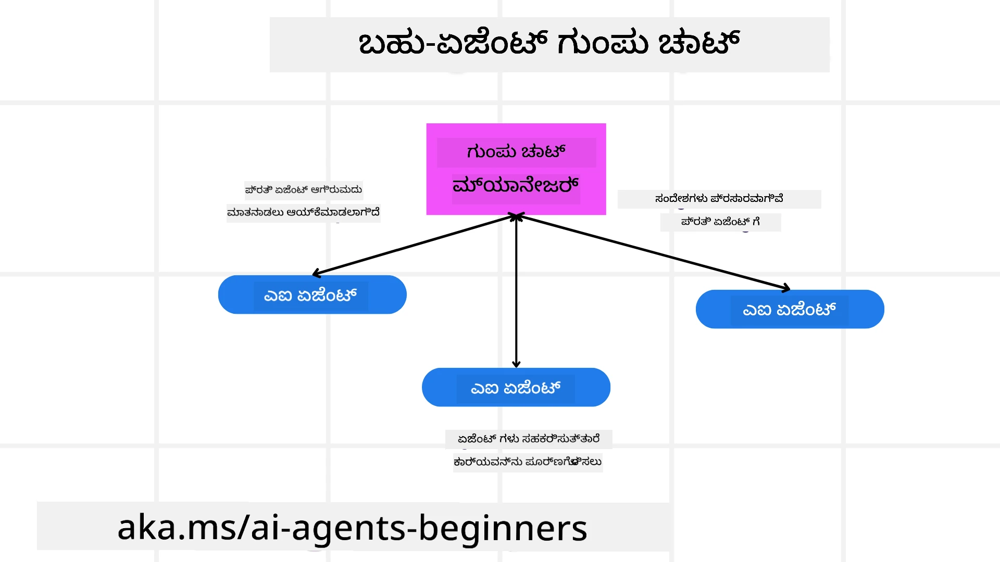
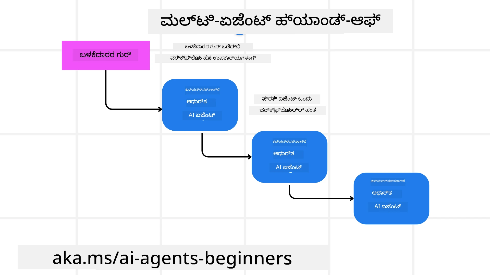
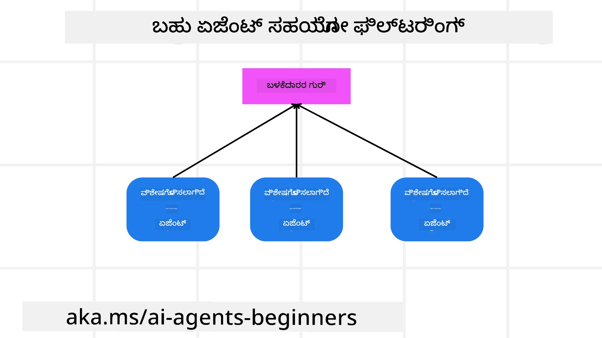

<!--
CO_OP_TRANSLATOR_METADATA:
{
  "original_hash": "1a008c204051cba8d0e253b75f261c41",
  "translation_date": "2025-12-03T16:07:34+00:00",
  "source_file": "08-multi-agent/README.md",
  "language_code": "kn"
}
-->

> _(ಈ ಪಾಠದ ವೀಡಿಯೊವನ್ನು ವೀಕ್ಷಿಸಲು ಮೇಲಿನ ಚಿತ್ರವನ್ನು ಕ್ಲಿಕ್ ಮಾಡಿ)_

# ಬಹು-ಏಜೆಂಟ್ ವಿನ್ಯಾಸ ಮಾದರಿಗಳು

ನೀವು ಬಹು ಏಜೆಂಟ್‌ಗಳನ್ನು ಒಳಗೊಂಡಿರುವ ಯೋಜನೆ ಮೇಲೆ ಕೆಲಸ ಮಾಡಲು ಪ್ರಾರಂಭಿಸಿದ ತಕ್ಷಣ, ನೀವು ಬಹು-ಏಜೆಂಟ್ ವಿನ್ಯಾಸ ಮಾದರಿಯನ್ನು ಪರಿಗಣಿಸಬೇಕಾಗುತ್ತದೆ. ಆದರೆ, ಯಾವಾಗ ಬಹು-ಏಜೆಂಟ್‌ಗಳಿಗೆ ಬದಲಾಯಿಸಬೇಕು ಮತ್ತು ಅದರ ಲಾಭಗಳು ಏನೆಂಬುದು ತಕ್ಷಣ ಸ್ಪಷ್ಟವಾಗುವುದಿಲ್ಲ.

## ಪರಿಚಯ

ಈ ಪಾಠದಲ್ಲಿ, ನಾವು ಈ ಕೆಳಗಿನ ಪ್ರಶ್ನೆಗಳಿಗೆ ಉತ್ತರ ಹುಡುಕುತ್ತಿದ್ದೇವೆ:

- ಯಾವ ಸಂದರ್ಭಗಳಲ್ಲಿ ಬಹು-ಏಜೆಂಟ್‌ಗಳು ಅನ್ವಯಿಸಬಹುದು?
- ಬಹು-ಏಜೆಂಟ್‌ಗಳನ್ನು ಬಳಸುವುದರಿಂದ ಏಕ ಏಜೆಂಟ್‌ಗಿಂತ ಏನು ಲಾಭಗಳಿವೆ?
- ಬಹು-ಏಜೆಂಟ್ ವಿನ್ಯಾಸ ಮಾದರಿಯನ್ನು ಅನುಷ್ಠಾನಗೊಳಿಸುವ ಮೂಲಭೂತ ಅಂಶಗಳು ಯಾವುವು?
- ಬಹು-ಏಜೆಂಟ್‌ಗಳು ಪರಸ್ಪರ ಹೇಗೆ ಸಂವಹನ ಮಾಡುತ್ತಿವೆ ಎಂಬುದನ್ನು ಹೇಗೆ ಗಮನಿಸಬಹುದು?

## ಕಲಿಕೆಯ ಗುರಿಗಳು

ಈ ಪಾಠದ ನಂತರ, ನೀವು ಈಕೆಳಗಿನವುಗಳನ್ನು ಮಾಡಬಲ್ಲಿರಿ:

- ಬಹು-ಏಜೆಂಟ್‌ಗಳು ಅನ್ವಯಿಸಬಹುದಾದ ಸಂದರ್ಭಗಳನ್ನು ಗುರುತಿಸಿ.
- ಏಕ ಏಜೆಂಟ್‌ಗಿಂತ ಬಹು-ಏಜೆಂಟ್‌ಗಳನ್ನು ಬಳಸುವ ಲಾಭಗಳನ್ನು ಗುರುತಿಸಿ.
- ಬಹು-ಏಜೆಂಟ್ ವಿನ್ಯಾಸ ಮಾದರಿಯನ್ನು ಅನುಷ್ಠಾನಗೊಳಿಸುವ ಮೂಲಭೂತ ಅಂಶಗಳನ್ನು ಅರ್ಥಮಾಡಿಕೊಳ್ಳಿ.

ಮೆಚ್ಚಿನ ದೃಷ್ಟಿಕೋನವೇನು?

*ಬಹು-ಏಜೆಂಟ್‌ಗಳು ಸಾಮಾನ್ಯ ಗುರಿಯನ್ನು ಸಾಧಿಸಲು ಹಲವಾರು ಏಜೆಂಟ್‌ಗಳನ್ನು ಒಟ್ಟಿಗೆ ಕೆಲಸ ಮಾಡಲು ಅನುಮತಿಸುವ ವಿನ್ಯಾಸ ಮಾದರಿಯಾಗಿದೆ.*

ಈ ಮಾದರಿಯನ್ನು ರೋಬೊಟಿಕ್ಸ್, ಸ್ವಾಯತ್ತ ವ್ಯವಸ್ಥೆಗಳು, ಮತ್ತು ವಿತರಿತ ಗಣನೆ ಸೇರಿದಂತೆ ವಿವಿಧ ಕ್ಷೇತ್ರಗಳಲ್ಲಿ ವ್ಯಾಪಕವಾಗಿ ಬಳಸಲಾಗುತ್ತದೆ.

## ಬಹು-ಏಜೆಂಟ್‌ಗಳು ಅನ್ವಯಿಸಬಹುದಾದ ಸಂದರ್ಭಗಳು

ಹಾಗಾದರೆ, ಯಾವ ಸಂದರ್ಭಗಳು ಬಹು-ಏಜೆಂಟ್‌ಗಳನ್ನು ಬಳಸಲು ಉತ್ತಮ ಉದಾಹರಣೆಗಳಾಗಬಹುದು? ಉತ್ತರವೆಂದರೆ, ಹಲವಾರು ಸಂದರ್ಭಗಳಲ್ಲಿ ಬಹು-ಏಜೆಂಟ್‌ಗಳನ್ನು ಬಳಸುವುದು ಲಾಭದಾಯಕವಾಗಿದೆ, ವಿಶೇಷವಾಗಿ ಈ ಕೆಳಗಿನ ಸಂದರ್ಭಗಳಲ್ಲಿ:

- **ದೊಡ್ಡ ಕೆಲಸದ ಭಾರಗಳು**: ದೊಡ್ಡ ಕೆಲಸದ ಭಾರಗಳನ್ನು ಸಣ್ಣ ಕಾರ್ಯಗಳಲ್ಲಿ ವಿಭಜಿಸಿ, ವಿಭಿನ್ನ ಏಜೆಂಟ್‌ಗಳಿಗೆ ಹಂಚಬಹುದು, ಇದರಿಂದ ಸಮಾನಾಂತರ ಪ್ರಕ್ರಿಯೆ ಮತ್ತು ವೇಗವಾದ ಪೂರ್ಣಗೊಳಿಸುವಿಕೆ ಸಾಧ್ಯವಾಗುತ್ತದೆ. ಉದಾಹರಣೆಗೆ, ದೊಡ್ಡ ಡೇಟಾ ಪ್ರಕ್ರಿಯೆ ಕಾರ್ಯದಲ್ಲಿ ಇದು ಅನ್ವಯಿಸುತ್ತದೆ.
- **ಸಂಕೀರ್ಣ ಕಾರ್ಯಗಳು**: ದೊಡ್ಡ ಕೆಲಸದ ಭಾರಗಳಂತೆ, ಸಂಕೀರ್ಣ ಕಾರ್ಯಗಳನ್ನು ಸಣ್ಣ ಉಪಕಾರ್ಯಗಳಲ್ಲಿ ವಿಭಜಿಸಿ, ಪ್ರತಿ ಏಜೆಂಟ್‌ಗಳು ಕಾರ್ಯದ ನಿರ್ದಿಷ್ಟ ಭಾಗದಲ್ಲಿ ಪರಿಣತಿಯನ್ನು ಹೊಂದಿರಬಹುದು. ಉದಾಹರಣೆಗೆ, ಸ್ವಾಯತ್ತ ವಾಹನಗಳಲ್ಲಿ, ವಿಭಿನ್ನ ಏಜೆಂಟ್‌ಗಳು ನಾವಿಗೇಶನ್, ಅಡೆತಡೆ ಪತ್ತೆ, ಮತ್ತು ಇತರ ವಾಹನಗಳೊಂದಿಗೆ ಸಂವಹನವನ್ನು ನಿರ್ವಹಿಸುತ್ತವೆ.
- **ವಿವಿಧ ಪರಿಣತಿ**: ವಿಭಿನ್ನ ಏಜೆಂಟ್‌ಗಳು ವಿಭಿನ್ನ ಪರಿಣತಿಯನ್ನು ಹೊಂದಿರಬಹುದು, ಇದರಿಂದಾಗಿ ಅವುಗಳು ಕಾರ್ಯದ ವಿಭಿನ್ನ ಅಂಶಗಳನ್ನು ಹೆಚ್ಚು ಪರಿಣಾಮಕಾರಿಯಾಗಿ ನಿರ್ವಹಿಸಬಹುದು. ಉದಾಹರಣೆಗೆ, ಆರೋಗ್ಯ ಸೇವೆಯಲ್ಲಿ, ಏಜೆಂಟ್‌ಗಳು ರೋಗನಿರ್ಣಯ, ಚಿಕಿತ್ಸೆ ಯೋಜನೆಗಳು, ಮತ್ತು ರೋಗಿಯ ಮೇಲ್ವಿಚಾರಣೆಯನ್ನು ನಿರ್ವಹಿಸುತ್ತವೆ.

## ಏಕ ಏಜೆಂಟ್‌ಗಿಂತ ಬಹು-ಏಜೆಂಟ್‌ಗಳನ್ನು ಬಳಸುವ ಲಾಭಗಳು

ಸರಳ ಕಾರ್ಯಗಳಿಗೆ ಏಕ ಏಜೆಂಟ್ ವ್ಯವಸ್ಥೆ ಚೆನ್ನಾಗಿ ಕೆಲಸ ಮಾಡಬಹುದು, ಆದರೆ ಹೆಚ್ಚು ಸಂಕೀರ್ಣ ಕಾರ್ಯಗಳಿಗೆ, ಬಹು-ಏಜೆಂಟ್‌ಗಳನ್ನು ಬಳಸುವುದರಿಂದ ಹಲವಾರು ಲಾಭಗಳು ದೊರೆಯುತ್ತವೆ:

- **ಪರಿಣತಿ**: ಪ್ರತಿ ಏಜೆಂಟ್ ನಿರ್ದಿಷ್ಟ ಕಾರ್ಯಕ್ಕಾಗಿ ಪರಿಣತಿಯನ್ನು ಹೊಂದಿರಬಹುದು. ಏಕ ಏಜೆಂಟ್‌ನಲ್ಲಿ ಪರಿಣತಿಯ ಕೊರತೆಯಿಂದಾಗಿ, ಅದು ಎಲ್ಲವನ್ನೂ ಮಾಡಬಹುದು ಆದರೆ ಸಂಕೀರ್ಣ ಕಾರ್ಯವನ್ನು ಎದುರಿಸಿದಾಗ ಗೊಂದಲಕ್ಕೀಡಾಗಬಹುದು.
- **ವಿಸ್ತರಣೀಯತೆ**: ಒಂದು ಏಜೆಂಟ್‌ಗೆ ಹೆಚ್ಚು ಕೆಲಸ ಹಂಚುವ ಬದಲು, ಹೊಸ ಏಜೆಂಟ್‌ಗಳನ್ನು ಸೇರಿಸುವ ಮೂಲಕ ವ್ಯವಸ್ಥೆಯನ್ನು ಸುಲಭವಾಗಿ ವಿಸ್ತರಿಸಬಹುದು.
- **ದೋಷ ಸಹಿಷ್ಣುತೆ**: ಒಂದು ಏಜೆಂಟ್ ವಿಫಲವಾದರೆ, ಇತರರು ಕಾರ್ಯನಿರ್ವಹಿಸುತ್ತಿದ್ದು, ವ್ಯವಸ್ಥೆಯ ನಂಬಿಕೆ ಉಳಿಯುತ್ತದೆ.

ಉದಾಹರಣೆಗೆ, ಬಳಕೆದಾರನಿಗಾಗಿ ಪ್ರಯಾಣವನ್ನು ಬುಕ್ ಮಾಡೋಣ. ಏಕ ಏಜೆಂಟ್ ವ್ಯವಸ್ಥೆ ಪ್ರಯಾಣ ಬುಕ್ಕಿಂಗ್ ಪ್ರಕ್ರಿಯೆಯ ಎಲ್ಲಾ ಅಂಶಗಳನ್ನು ನಿರ್ವಹಿಸಬೇಕಾಗುತ್ತದೆ, ವಿಮಾನಗಳನ್ನು ಹುಡುಕುವುದರಿಂದ ಹೋಟೆಲ್‌ಗಳನ್ನು ಬುಕ್ ಮಾಡುವುದು ಮತ್ತು ಕಾರುಗಳನ್ನು ಬಾಡಿಗೆಗೆ ಪಡೆಯುವುದು. ಇದನ್ನು ಏಕ ಏಜೆಂಟ್‌ನೊಂದಿಗೆ ಸಾಧಿಸಲು, ಏಜೆಂಟ್‌ಗೆ ಈ ಎಲ್ಲಾ ಕಾರ್ಯಗಳನ್ನು ನಿರ್ವಹಿಸಲು ಸಾಧನಗಳು ಬೇಕಾಗುತ್ತದೆ. ಇದು ಕಠಿಣ ಮತ್ತು ನಿರ್ವಹಿಸಲು ಕಷ್ಟವಾದ ವ್ಯವಸ್ಥೆಗೆ ಕಾರಣವಾಗಬಹುದು. ಆದರೆ, ಬಹು-ಏಜೆಂಟ್ ವ್ಯವಸ್ಥೆಯಲ್ಲಿ, ವಿಭಿನ್ನ ಏಜೆಂಟ್‌ಗಳು ವಿಮಾನಗಳನ್ನು ಹುಡುಕುವುದು, ಹೋಟೆಲ್‌ಗಳನ್ನು ಬುಕ್ ಮಾಡುವುದು, ಮತ್ತು ಕಾರುಗಳನ್ನು ಬಾಡಿಗೆಗೆ ಪಡೆಯುವುದರಲ್ಲಿ ಪರಿಣತಿಯನ್ನು ಹೊಂದಿರಬಹುದು. ಇದು ವ್ಯವಸ್ಥೆಯನ್ನು ಹೆಚ್ಚು ಮಾಪನೀಯ, ನಿರ್ವಹಿಸಲು ಸುಲಭ ಮತ್ತು ವಿಸ್ತರಿಸಬಹುದಾದಂತೆ ಮಾಡುತ್ತದೆ.

## ಬಹು-ಏಜೆಂಟ್ ವಿನ್ಯಾಸ ಮಾದರಿಯನ್ನು ಅನುಷ್ಠಾನಗೊಳಿಸುವ ಮೂಲಭೂತ ಅಂಶಗಳು

ನೀವು ಬಹು-ಏಜೆಂಟ್ ವಿನ್ಯಾಸ ಮಾದರಿಯನ್ನು ಅನುಷ್ಠಾನಗೊಳಿಸುವ ಮೊದಲು, ಈ ಮಾದರಿಯನ್ನು ರಚಿಸುವ ಮೂಲಭೂತ ಅಂಶಗಳನ್ನು ಅರ್ಥಮಾಡಿಕೊಳ್ಳಬೇಕು.

ಉದಾಹರಣೆಗೆ, ಬಳಕೆದಾರನಿಗಾಗಿ ಪ್ರಯಾಣವನ್ನು ಬುಕ್ ಮಾಡುವ ಉದಾಹರಣೆಯನ್ನು ಮತ್ತೆ ಪರಿಗಣಿಸೋಣ. ಈ ಸಂದರ್ಭದಲ್ಲಿ, ಮೂಲಭೂತ ಅಂಶಗಳು ಈ ಕೆಳಗಿನವುಗಳನ್ನು ಒಳಗೊಂಡಿರುತ್ತವೆ:

- **ಏಜೆಂಟ್ ಸಂವಹನ**: ಏಜೆಂಟ್‌ಗಳು ಬಳಕೆದಾರನ ಆದ್ಯತೆಗಳು ಮತ್ತು ನಿರ್ಬಂಧಗಳ ಬಗ್ಗೆ ಮಾಹಿತಿ ಹಂಚಿಕೊಳ್ಳಲು ಸಂವಹನ ಮಾಡಬೇಕು.
- **ಸಮನ್ವಯ ವ್ಯವಸ್ಥೆಗಳು**: ಏಜೆಂಟ್‌ಗಳು ತಮ್ಮ ಕ್ರಿಯೆಗಳನ್ನು ಸಮನ್ವಯಗೊಳಿಸಬೇಕು.
- **ಏಜೆಂಟ್ ಆರ್ಕಿಟೆಕ್ಚರ್**: ಏಜೆಂಟ್‌ಗಳು ನಿರ್ಧಾರಗಳನ್ನು ತೆಗೆದುಕೊಳ್ಳಲು ಮತ್ತು ಬಳಕೆದಾರರೊಂದಿಗೆ ಸಂವಹನದಿಂದ ಕಲಿಯಲು ಒಳಾಂಗಿಕ ರಚನೆ ಹೊಂದಿರಬೇಕು.
- **ಬಹು-ಏಜೆಂಟ್ ಸಂವಹನದ ದೃಶ್ಯತೆ**: ಏಜೆಂಟ್‌ಗಳು ಪರಸ್ಪರ ಹೇಗೆ ಸಂವಹನ ಮಾಡುತ್ತಿವೆ ಎಂಬುದನ್ನು ಗಮನಿಸಲು ಸಾಧನಗಳು ಮತ್ತು ತಂತ್ರಗಳನ್ನು ಹೊಂದಿರಬೇಕು.
- **ಬಹು-ಏಜೆಂಟ್ ಮಾದರಿಗಳು**: ಕೇಂದ್ರಿತ, ವಿಕೇಂದ್ರಿತ, ಮತ್ತು ಮಿಶ್ರ ಆರ್ಕಿಟೆಕ್ಚರ್‌ಗಳಂತಹ ವಿಭಿನ್ನ ಮಾದರಿಗಳನ್ನು ಆಯ್ಕೆ ಮಾಡಬಹುದು.
- **ಮಾನವ ಹಸ್ತಕ್ಷೇಪ**: ಏಜೆಂಟ್‌ಗಳು ಯಾವಾಗ ಮಾನವ ಹಸ್ತಕ್ಷೇಪವನ್ನು ಕೇಳಬೇಕು ಎಂಬುದನ್ನು ನಿರ್ಧರಿಸಬೇಕು.

## ಬಹು-ಏಜೆಂಟ್ ಸಂವಹನದ ದೃಶ್ಯತೆ

ಬಹು-ಏಜೆಂಟ್‌ಗಳು ಪರಸ್ಪರ ಹೇಗೆ ಸಂವಹನ ಮಾಡುತ್ತಿವೆ ಎಂಬುದನ್ನು ಗಮನಿಸುವುದು ಅತ್ಯಂತ ಮುಖ್ಯ. ಇದು ಡೀಬಗಿಂಗ್, ಆಪ್ಟಿಮೈಸೇಶನ್, ಮತ್ತು ವ್ಯವಸ್ಥೆಯ ಸಮಗ್ರ ಪರಿಣಾಮಕಾರಿತ್ವವನ್ನು ಖಚಿತಪಡಿಸಲು ಅಗತ್ಯವಾಗಿದೆ. 

ಉದಾಹರಣೆಗೆ, ಬಳಕೆದಾರನ ಪ್ರಯಾಣ ಬುಕ್ಕಿಂಗ್ ಪ್ರಕ್ರಿಯೆಯಲ್ಲಿ, ಪ್ರತಿ ಏಜೆಂಟ್‌ನ ಸ್ಥಿತಿ, ಬಳಕೆದಾರನ ಆದ್ಯತೆಗಳು ಮತ್ತು ನಿರ್ಬಂಧಗಳು, ಮತ್ತು ಏಜೆಂಟ್‌ಗಳ ನಡುವಿನ ಸಂವಹನವನ್ನು ತೋರಿಸುವ ಡ್ಯಾಶ್‌ಬೋರ್ಡ್ ಇರಬಹುದು.

## ಬಹು-ಏಜೆಂಟ್ ಮಾದರಿಗಳು

ಬಹು-ಏಜೆಂಟ್ ಅಪ್ಲಿಕೇಶನ್‌ಗಳನ್ನು ರಚಿಸಲು ಕೆಲವು ಆಸಕ್ತಿದಾಯಕ ಮಾದರಿಗಳನ್ನು ಪರಿಗಣಿಸಬಹುದು:

### ಗುಂಪು ಚಾಟ್

ಈ ಮಾದರಿ ಗುಂಪು ಚಾಟ್ ಅಪ್ಲಿಕೇಶನ್‌ಗಳನ್ನು ರಚಿಸಲು ಉಪಯುಕ್ತವಾಗಿದೆ. 

### ಹ್ಯಾಂಡ್-ಆಫ್

ಈ ಮಾದರಿ ಏಜೆಂಟ್‌ಗಳು ಕಾರ್ಯಗಳನ್ನು ಪರಸ್ಪರ ಹಸ್ತಾಂತರಿಸಲು ಉಪಯುಕ್ತವಾಗಿದೆ.

### ಸಹಯೋಗಿ ಶಿಫಾರಸು

ಈ ಮಾದರಿ ಏಜೆಂಟ್‌ಗಳು ಬಳಕೆದಾರರಿಗೆ ಶಿಫಾರಸುಗಳನ್ನು ನೀಡಲು ಸಹಕರಿಸಲು ಉಪಯುಕ್ತವಾಗಿದೆ.

## ಸಂದರ್ಭ: ಮರುಪಾವತಿ ಪ್ರಕ್ರಿಯೆ

ಉದಾಹರಣೆಗೆ, ಗ್ರಾಹಕನು ಉತ್ಪನ್ನಕ್ಕಾಗಿ ಮರುಪಾವತಿಯನ್ನು ಪಡೆಯಲು ಪ್ರಯತ್ನಿಸುತ್ತಿದ್ದರೆ, ಈ ಪ್ರಕ್ರಿಯೆಯಲ್ಲಿ ಹಲವಾರು ಏಜೆಂಟ್‌ಗಳು ಭಾಗವಹಿಸಬಹುದು.

**ಮರುಪಾವತಿ ಪ್ರಕ್ರಿಯೆಗೆ ವಿಶೇಷ ಏಜೆಂಟ್‌ಗಳು**:

- **ಗ್ರಾಹಕ ಏಜೆಂಟ್**: ಮರುಪಾವತಿ ಪ್ರಕ್ರಿಯೆಯನ್ನು ಪ್ರಾರಂಭಿಸುತ್ತದೆ.
- **ಮಾರಾಟಗಾರ ಏಜೆಂಟ್**: ಮರುಪಾವತಿಯನ್ನು ಪ್ರಕ್ರಿಯೆಗೊಳಿಸುತ್ತದೆ.
- **ಪಾವತಿ ಏಜೆಂಟ್**: ಪಾವತಿಯನ್ನು ಮರುಪಾವತಿಸುತ್ತದೆ.
- **ನಿರ್ಣಯ ಏಜೆಂಟ್**: ಯಾವುದೇ ಸಮಸ್ಯೆಗಳನ್ನು ಪರಿಹರಿಸುತ್ತದೆ.
- **ಅನುಸರಣಾ ಏಜೆಂಟ್**: ನಿಯಮಾವಳಿಗಳನ್ನು ಪಾಲಿಸಲು ಖಚಿತಪಡಿಸುತ್ತದೆ.

**ಸಾಮಾನ್ಯ ಏಜೆಂಟ್‌ಗಳು**:

- **ಶಿಪ್ಪಿಂಗ್ ಏಜೆಂಟ್**: ಉತ್ಪನ್ನವನ್ನು ಮಾರಾಟಗಾರನಿಗೆ ಹಿಂತಿರುಗಿಸಲು ಜವಾಬ್ದಾರಿಯಾಗಿದೆ.
- **ಪ್ರತಿಕ್ರಿಯಾ ಏಜೆಂಟ್**: ಗ್ರಾಹಕರಿಂದ ಪ್ರತಿಕ್ರಿಯೆಯನ್ನು ಸಂಗ್ರಹಿಸುತ್ತದೆ.
- **ಎಸ್ಕಲೇಶನ್ ಏಜೆಂಟ್**: ಸಮಸ್ಯೆಗಳನ್ನು ಉನ್ನತ ಮಟ್ಟದ ಬೆಂಬಲಕ್ಕೆ ಎಸ್ಕಲೇಟ್ ಮಾಡುತ್ತದೆ.
- **ಅಧಿಸೂಚನೆ ಏಜೆಂಟ್**: ಗ್ರಾಹಕರಿಗೆ ಅಧಿಸೂಚನೆಗಳನ್ನು ಕಳುಹಿಸುತ್ತದೆ.
- **ವಿಶ್ಲೇಷಣಾ ಏಜೆಂಟ್**: ಡೇಟಾವನ್ನು ವಿಶ್ಲೇಷಿಸುತ್ತದೆ.
- **ಆಡಿಟ್ ಏಜೆಂಟ್**: ಪ್ರಕ್ರಿಯೆಯನ್ನು ಪರಿಶೀಲಿಸುತ್ತದೆ.
- **ವರದಿ ಏಜೆಂಟ್**: ವರದಿಗಳನ್ನು ರಚಿಸುತ್ತದೆ.
- **ಜ್ಞಾನ ಏಜೆಂಟ್**: ಜ್ಞಾನವನ್ನು ನಿರ್ವಹಿಸುತ್ತದೆ.
- **ಭದ್ರತಾ ಏಜೆಂಟ್**: ಭದ್ರತೆಯನ್ನು ಖಚಿತಪಡಿಸುತ್ತದೆ.
- **ಗುಣಮಟ್ಟದ ಏಜೆಂಟ್**: ಗುಣಮಟ್ಟವನ್ನು ಖಚಿತಪಡಿಸುತ್ತದೆ.

ಈ ಪಾಠವು ನಿಮ್ಮ ಬಹು-ಏಜೆಂಟ್ ವ್ಯವಸ್ಥೆಯಲ್ಲಿ ಯಾವ ಏಜೆಂಟ್‌ಗಳನ್ನು ಬಳಸಬೇಕು ಎಂಬುದರ ಬಗ್ಗೆ ನಿಮಗೆ ಸ್ಪಷ್ಟತೆ ನೀಡುತ್ತದೆ.

## ಕಾರ್ಯ

ಬಹು-ಏಜೆಂಟ್ ವ್ಯವಸ್ಥೆಯನ್ನು ಗ್ರಾಹಕ ಬೆಂಬಲ ಪ್ರಕ್ರಿಯೆಗೆ ವಿನ್ಯಾಸಗೊಳಿಸಿ. ಪ್ರಕ್ರಿಯೆಯಲ್ಲಿ ಭಾಗವಹಿಸುವ ಏಜೆಂಟ್‌ಗಳನ್ನು ಗುರುತಿಸಿ, ಅವರ ಪಾತ್ರಗಳು ಮತ್ತು ಹೊಣೆಗಾರಿಕೆಗಳು, ಮತ್ತು ಅವರು ಪರಸ್ಪರ ಹೇಗೆ ಸಂವಹನ ಮಾಡುತ್ತಾರೆ ಎಂಬುದನ್ನು ವಿವರಿಸಿ. ಗ್ರಾಹಕ ಬೆಂಬಲ ಪ್ರಕ್ರಿಯೆಗೆ ವಿಶೇಷವಾದ ಏಜೆಂಟ್‌ಗಳನ್ನು ಮಾತ್ರವಲ್ಲದೆ, ನಿಮ್ಮ ವ್ಯವಹಾರದ ಇತರ ಭಾಗಗಳಲ್ಲಿ ಬಳಸಬಹುದಾದ ಸಾಮಾನ್ಯ ಏಜೆಂಟ್‌ಗಳನ್ನು ಸಹ ಪರಿಗಣಿಸಿ.

> ಪರಿಹಾರವನ್ನು ಓದಲು ಮುನ್ನ, ನೀವು ಹೆಚ್ಚು ಏಜೆಂಟ್‌ಗಳನ್ನು ಅಗತ್ಯವಿರಬಹುದು ಎಂದು ಯೋಚಿಸಿ.

> TIP: ಗ್ರಾಹಕ ಬೆಂಬಲ ಪ್ರಕ್ರಿಯೆಯ ವಿವಿಧ ಹಂತಗಳನ್ನು ಮತ್ತು ಯಾವುದೇ ವ್ಯವಸ್ಥೆಗೆ ಅಗತ್ಯವಿರುವ ಏಜೆಂಟ್‌ಗಳನ್ನು ಪರಿಗಣಿಸಿ.

## ಪರಿಹಾರ

[ಪರಿಹಾರ](./solution/solution.md)

## ಜ್ಞಾನ ಪರಿಶೀಲನೆಗಳು

ಪ್ರಶ್ನೆ: ನೀವು ಯಾವಾಗ ಬಹು-ಏಜೆಂಟ್‌ಗಳನ್ನು ಬಳಸುವ ಬಗ್ಗೆ ಪರಿಗಣಿಸಬೇಕು?

- [ ] A1: ನೀವು ಕಡಿಮೆ ಕೆಲಸದ ಒತ್ತಡ ಮತ್ತು ಸರಳ ಕಾರ್ಯವನ್ನು ಹೊಂದಿರುವಾಗ.
- [ ] A2: ನೀವು ಹೆಚ್ಚಿನ ಕೆಲಸದ ಒತ್ತಡವನ್ನು ಹೊಂದಿರುವಾಗ.
- [ ] A3: ನೀವು ಸರಳ ಕಾರ್ಯವನ್ನು ಹೊಂದಿರುವಾಗ.

[ಪರಿಹಾರ ಕ್ವಿಜ್](./solution/solution-quiz.md)

## ಸಾರಾಂಶ

ಈ ಪಾಠದಲ್ಲಿ, ನಾವು ಬಹು-ಏಜೆಂಟ್ ವಿನ್ಯಾಸ ಮಾದರಿಯನ್ನು, ಬಹು-ಏಜೆಂಟ್‌ಗಳು ಅನ್ವಯವಾಗುವ ಪರಿಸ್ಥಿತಿಗಳನ್ನು, ಏಕ ಏಜೆಂಟ್‌ಗಳಿಗಿಂತ ಬಹು-ಏಜೆಂಟ್‌ಗಳನ್ನು ಬಳಸುವ ಲಾಭಗಳನ್ನು, ಬಹು-ಏಜೆಂಟ್ ವಿನ್ಯಾಸ ಮಾದರಿಯನ್ನು ಅನುಷ್ಠಾನಗೊಳಿಸುವ ನಿರ್ಮಾಣ ಬ್ಲಾಕ್‌ಗಳನ್ನು, ಮತ್ತು ಬಹು ಏಜೆಂಟ್‌ಗಳು ಪರಸ್ಪರ ಹೇಗೆ ಸಂವಹನ ಮಾಡುತ್ತವೆ ಎಂಬುದರ ಮೇಲೆ ದೃಷ್ಟಿ ಹೊಂದುವ ವಿಧಾನವನ್ನು ನೋಡಿದ್ದೇವೆ.

### ಬಹು-ಏಜೆಂಟ್ ವಿನ್ಯಾಸ ಮಾದರಿಯ ಬಗ್ಗೆ ಇನ್ನಷ್ಟು ಪ್ರಶ್ನೆಗಳಿದೆಯೇ?

ಇತರ ಕಲಿಯುವವರನ್ನು ಭೇಟಿಯಾಗಲು, ಆಫೀಸ್ ಅವರ್ಸ್‌ನಲ್ಲಿ ಭಾಗವಹಿಸಲು ಮತ್ತು ನಿಮ್ಮ AI ಏಜೆಂಟ್‌ಗಳ ಪ್ರಶ್ನೆಗಳಿಗೆ ಉತ್ತರ ಪಡೆಯಲು [Azure AI Foundry Discord](https://aka.ms/ai-agents/discord) ಗೆ ಸೇರಿ.

## ಹೆಚ್ಚುವರಿ ಸಂಪತ್ತುಗಳು

- <a href="https://microsoft.github.io/autogen/stable/user-guide/core-user-guide/design-patterns/intro.html" target="_blank">AutoGen ವಿನ್ಯಾಸ ಮಾದರಿಗಳು</a>
- <a href="https://www.analyticsvidhya.com/blog/2024/10/agentic-design-patterns/" target="_blank">Agentic ವಿನ್ಯಾಸ ಮಾದರಿಗಳು</a>

## ಹಿಂದಿನ ಪಾಠ

[ಯೋಜನೆ ವಿನ್ಯಾಸ](../07-planning-design/README.md)

## ಮುಂದಿನ ಪಾಠ

[AI ಏಜೆಂಟ್‌ಗಳಲ್ಲಿ ಮೆಟಾಕಾಗ್ನಿಷನ್](../09-metacognition/README.md)

---

<!-- CO-OP TRANSLATOR DISCLAIMER START -->
**ಅಸಮೀಕ್ಷೆ**:  
ಈ ದಾಖಲೆ AI ಅನುವಾದ ಸೇವೆ [Co-op Translator](https://github.com/Azure/co-op-translator) ಬಳಸಿ ಅನುವಾದಿಸಲಾಗಿದೆ. ನಾವು ನಿಖರತೆಯನ್ನು ಸಾಧಿಸಲು ಪ್ರಯತ್ನಿಸುತ್ತಿದ್ದರೂ, ದಯವಿಟ್ಟು ಗಮನಿಸಿ, ಸ್ವಯಂಚಾಲಿತ ಅನುವಾದಗಳಲ್ಲಿ ದೋಷಗಳು ಅಥವಾ ಅಸಮರ್ಪಕತೆಗಳು ಇರಬಹುದು. ಮೂಲ ಭಾಷೆಯಲ್ಲಿರುವ ಮೂಲ ದಾಖಲೆ ಪ್ರಾಮಾಣಿಕ ಮೂಲವೆಂದು ಪರಿಗಣಿಸಬೇಕು. ಪ್ರಮುಖ ಮಾಹಿತಿಗಾಗಿ, ವೃತ್ತಿಪರ ಮಾನವ ಅನುವಾದವನ್ನು ಶಿಫಾರಸು ಮಾಡಲಾಗುತ್ತದೆ. ಈ ಅನುವಾದದ ಬಳಕೆಯಿಂದ ಉಂಟಾಗುವ ಯಾವುದೇ ತಪ್ಪುಅರ್ಥ ಅಥವಾ ತಪ್ಪುಅರ್ಥಗಳಿಗಾಗಿ ನಾವು ಹೊಣೆಗಾರರಾಗುವುದಿಲ್ಲ.
<!-- CO-OP TRANSLATOR DISCLAIMER END -->