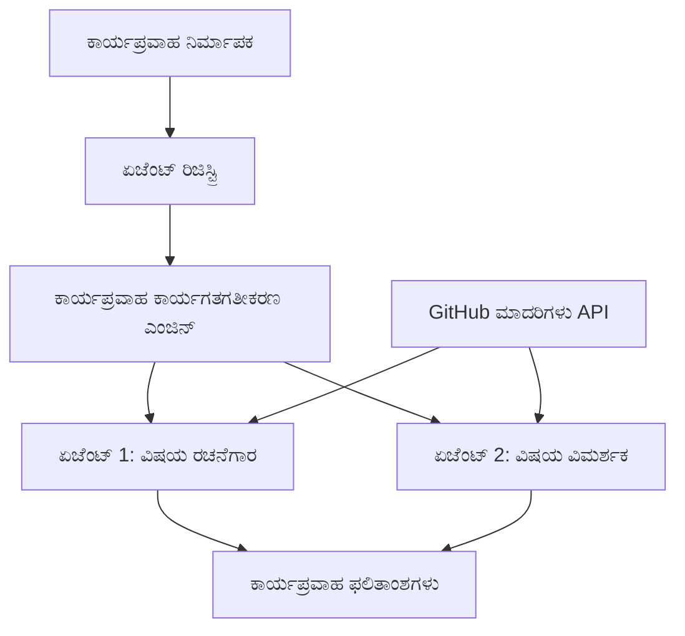

<!--
CO_OP_TRANSLATOR_METADATA:
{
  "original_hash": "034158688d0a45aae06dcbb21b0da5ae",
  "translation_date": "2025-12-03T16:24:19+00:00",
  "source_file": "08-multi-agent/code_samples/workflows-agent-framework/dotNET/01.dotnet-agent-framework-workflow-ghmodel-basic.md",
  "language_code": "kn"
}
-->
# 🔄 GitHub ಮಾದರಿಗಳೊಂದಿಗೆ ಮೂಲ ಏಜೆಂಟ್ ಕಾರ್ಯಪ್ರವಾಹಗಳು (.NET)

## 📋 ಕಾರ್ಯಪ್ರವಾಹ ಸಂಯೋಜನೆ ಪಾಠ

ಈ ನೋಟ್ಬುಕ್ Microsoft Agent Framework for .NET ಮತ್ತು GitHub ಮಾದರಿಗಳನ್ನು ಬಳಸಿಕೊಂಡು ಸುಧಾರಿತ **ಏಜೆಂಟ್ ಕಾರ್ಯಪ್ರವಾಹಗಳನ್ನು** ನಿರ್ಮಿಸುವುದನ್ನು ತೋರಿಸುತ್ತದೆ. ಎಐ ಏಜೆಂಟ್‌ಗಳು ರಚಿತ ಸಂಯೋಜನೆ ಮಾದರಿಗಳ ಮೂಲಕ ಸಂಕೀರ್ಣ ಕಾರ್ಯಗಳನ್ನು ಸಾಧಿಸಲು ಸಹಕರಿಸುವ ಬಹುಹಂತದ ವ್ಯವಹಾರ ಪ್ರಕ್ರಿಯೆಗಳನ್ನು ನೀವು ಕಲಿಯುತ್ತೀರಿ.

## 🎯 ಕಲಿಕೆಯ ಉದ್ದೇಶಗಳು

### 🏗️ **ಕಾರ್ಯಪ್ರವಾಹ ಆರ್ಕಿಟೆಕ್ಚರ್ ಮೂಲಭೂತಾಂಶಗಳು**
- **Workflow Builder**: ಸಂಕೀರ್ಣ ಬಹುಹಂತದ ಎಐ ಪ್ರಕ್ರಿಯೆಗಳನ್ನು ವಿನ್ಯಾಸಗೊಳಿಸಿ ಮತ್ತು ಸಂಯೋಜಿಸಿ
- **Agent Coordination**: ಕಾರ್ಯಪ್ರವಾಹಗಳಲ್ಲಿ ಹಲವು ವಿಶೇಷ ಏಜೆಂಟ್‌ಗಳನ್ನು ಸಂಯೋಜಿಸಿ
- **GitHub Models Integration**: ಕಾರ್ಯಪ್ರವಾಹಗಳಲ್ಲಿ GitHub ನ ಎಐ ಮಾದರಿ ನಿರ್ವಚನಾ ಸೇವೆಯನ್ನು ಬಳಸಿಕೊಳ್ಳಿ
- **Visual Workflow Design**: ಉತ್ತಮ ಅರ್ಥಮಾಡಿಕೊಳ್ಳಲು ಕಾರ್ಯಪ್ರವಾಹ ರಚನೆಗಳನ್ನು ರಚಿಸಿ ಮತ್ತು ದೃಶ್ಯೀಕರಿಸಿ

### 🔄 **ಪ್ರಕ್ರಿಯೆ ಸಂಯೋಜನೆ ಮಾದರಿಗಳು**
- **Sequential Processing**: ಲಾಜಿಕಲ್ ಕ್ರಮದಲ್ಲಿ ಹಲವು ಏಜೆಂಟ್ ಕಾರ್ಯಗಳನ್ನು ಸರಪಳಿಯಾಗಿ ಜೋಡಿಸಿ
- **State Management**: ಕಾರ್ಯಪ್ರವಾಹ ಹಂತಗಳಲ್ಲಿ ಪ್ರಾಸಂಗಿಕತೆ ಮತ್ತು ಡೇಟಾ ಹರಿವನ್ನು ನಿರ್ವಹಿಸಿ
- **Error Handling**: ದೋಷ ಪುನಃಪ್ರಾಪ್ತಿಯುಳ್ಳ ಮತ್ತು ಕಾರ್ಯಪ್ರವಾಹದ ಸ್ಥಿರತೆಯುಳ್ಳ ವ್ಯವಸ್ಥೆಯನ್ನು ಜಾರಿಗೆ ತರುವಿರಿ
- **Performance Optimization**: ಉದ್ಯಮ ಮಟ್ಟದ ಕಾರ್ಯಾಚರಣೆಗಳಿಗೆ ಪರಿಣಾಮಕಾರಿ ಕಾರ್ಯಪ್ರವಾಹಗಳನ್ನು ವಿನ್ಯಾಸಗೊಳಿಸಿ

### 🏢 **ಉದ್ಯಮ ಕಾರ್ಯಪ್ರವಾಹ ಅನ್ವಯಿಕೆಗಳು**
- **Business Process Automation**: ಸಂಕೀರ್ಣ ಸಂಸ್ಥೆಯ ಕಾರ್ಯಪ್ರವಾಹಗಳನ್ನು ಸ್ವಯಂಚಾಲಿತಗೊಳಿಸಿ
- **Content Production Pipeline**: ವಿಮರ್ಶೆ ಮತ್ತು ಅನುಮೋದನೆ ಹಂತಗಳೊಂದಿಗೆ ಸಂಪಾದಕೀಯ ಕಾರ್ಯಪ್ರವಾಹಗಳು
- **Customer Service Automation**: ಬಹುಹಂತದ ಗ್ರಾಹಕ ಪ್ರಶ್ನೆ ಪರಿಹಾರ
- **Data Processing Workflows**: ಎಐ ಶಕ್ತಿಯುಳ್ಳ ಪರಿವರ್ತನೆಯೊಂದಿಗೆ ETL ಕಾರ್ಯಪ್ರವಾಹಗಳು

## ⚙️ ಪೂರ್ವಾಪೇಕ್ಷೆಗಳು ಮತ್ತು ಸೆಟಪ್

### 📦 **ಅಗತ್ಯವಿರುವ NuGet ಪ್ಯಾಕೇಜ್‌ಗಳು**

ಈ ಕಾರ್ಯಪ್ರವಾಹ ಪ್ರದರ್ಶನವು ಕೆಲವು ಪ್ರಮುಖ .NET ಪ್ಯಾಕೇಜ್‌ಗಳನ್ನು ಬಳಸುತ್ತದೆ:

```xml
<!-- Core AI Framework -->
<PackageReference Include="Microsoft.Extensions.AI" Version="9.9.0" />

<!-- Agent Framework (Local Development) -->
<!-- Microsoft.Agents.AI.dll - Core agent abstractions -->
<!-- Microsoft.Agents.AI.OpenAI.dll - OpenAI/GitHub Models integration -->

<!-- Configuration and Environment -->
<PackageReference Include="DotNetEnv" Version="3.1.1" />
```

### 🔑 **GitHub ಮಾದರಿಗಳ ಸಂರಚನೆ**

**ಪರಿಸರ ಸೆಟಪ್ (.env ಫೈಲ್):**
```env
GITHUB_TOKEN=your_github_personal_access_token
GITHUB_ENDPOINT=https://models.inference.ai.azure.com
GITHUB_MODEL_ID=gpt-4o-mini
```

**GitHub ಮಾದರಿಗಳ ಪ್ರವೇಶ:**
1. GitHub Models ಗೆ ಸೈನ್ ಅಪ್ ಮಾಡಿ (ಪ್ರಸ್ತುತ ಪೂರ್ವಾವಲೋಕನದಲ್ಲಿ)
2. ಮಾದರಿ ಪ್ರವೇಶ ಅನುಮತಿಗಳೊಂದಿಗೆ ವೈಯಕ್ತಿಕ ಪ್ರವೇಶ ಟೋಕನ್ ಅನ್ನು ರಚಿಸಿ
3. ಮೇಲಿನಂತೆ ಪರಿಸರ ಚರಾಂಶಗಳನ್ನು ಸಂರಚಿಸಿ

### 🏗️ **ಕಾರ್ಯಪ್ರವಾಹ ಆರ್ಕಿಟೆಕ್ಚರ್ ಅವಲೋಕನ**


**ಮುಖ್ಯ ಘಟಕಗಳು:**
- **WorkflowBuilder**: ಕಾರ್ಯಪ್ರವಾಹಗಳನ್ನು ವಿನ್ಯಾಸಗೊಳಿಸಲು ಮುಖ್ಯ ಸಂಯೋಜನೆ ಎಂಜಿನ್
- **AIAgent**: ನಿರ್ದಿಷ್ಟ ಸಾಮರ್ಥ್ಯಗಳೊಂದಿಗೆ ವೈಯಕ್ತಿಕ ವಿಶೇಷ ಏಜೆಂಟ್‌ಗಳು
- **GitHub Models Client**: ಎಐ ಮಾದರಿ ನಿರ್ವಚನಾ ಸೇವೆ ಸಂಯೋಜನೆ
- **Execution Context**: ಕಾರ್ಯಪ್ರವಾಹ ಹಂತಗಳ ನಡುವೆ ಸ್ಥಿತಿ ಮತ್ತು ಡೇಟಾ ಹರಿವನ್ನು ನಿರ್ವಹಿಸುತ್ತದೆ

## 🎨 **ಉದ್ಯಮ ಕಾರ್ಯಪ್ರವಾಹ ವಿನ್ಯಾಸ ಮಾದರಿಗಳು**

### 📝 **ವಿಷಯ ಉತ್ಪಾದನಾ ಕಾರ್ಯಪ್ರವಾಹ**
```
User Request → Content Generation → Quality Review → Final Output
```

### 🔍 **ಡಾಕ್ಯುಮೆಂಟ್ ಪ್ರೊಸೆಸಿಂಗ್ ಪೈಪ್‌ಲೈನ್**
```
Document Input → Analysis → Extraction → Validation → Structured Output
```

### 💼 **ವ್ಯಾಪಾರ ಬುದ್ಧಿವಂತಿಕೆ ಕಾರ್ಯಪ್ರವಾಹ**
```
Data Collection → Processing → Analysis → Report Generation → Distribution
```

### 🤝 **ಗ್ರಾಹಕ ಸೇವಾ ಸ್ವಯಂಚಾಲಿತಗೊಳಿಸುವಿಕೆ**
```
Customer Inquiry → Classification → Processing → Response Generation → Follow-up
```

## 🏢 **ಉದ್ಯಮದ ಲಾಭಗಳು**

### 🎯 **ನಂಬಿಕೆ ಮತ್ತು ವಿಸ್ತರಣಾಶೀಲತೆ**
- **Deterministic Execution**: ಸತತ, ಪುನರಾವರ್ತನೀಯ ಕಾರ್ಯಪ್ರವಾಹ ಫಲಿತಾಂಶಗಳು
- **Error Recovery**: ಯಾವುದೇ ಕಾರ್ಯಪ್ರವಾಹ ಹಂತದಲ್ಲಿ ವೈಫಲ್ಯಗಳನ್ನು ಸುಗಮವಾಗಿ ನಿರ್ವಹಿಸುವುದು
- **Performance Monitoring**: ಕಾರ್ಯಾಚರಣಾ ಮೆಟ್ರಿಕ್‌ಗಳನ್ನು ಟ್ರ್ಯಾಕ್ ಮಾಡಿ ಮತ್ತು ಆಪ್ಟಿಮೈಸೇಶನ್ ಅವಕಾಶಗಳನ್ನು ಗುರುತಿಸಿ
- **Resource Management**: ಎಐ ಮಾದರಿ ಸಂಪತ್ತಿನ ಪರಿಣಾಮಕಾರಿ ಹಂಚಿಕೆ ಮತ್ತು ಬಳಕೆ

### 🔒 **ಭದ್ರತೆ ಮತ್ತು ಅನುಸರಣಾ ನಿಯಮಗಳು**
- **Secure Authentication**: API ಪ್ರವೇಶಕ್ಕಾಗಿ GitHub ಟೋಕನ್ ಆಧಾರಿತ ದೃಢೀಕರಣ
- **Audit Trails**: ಕಾರ್ಯಪ್ರವಾಹ ಕಾರ್ಯಾಚರಣೆ ಮತ್ತು ನಿರ್ಧಾರ ಬಿಂದುಗಳ ಸಂಪೂರ್ಣ ಲಾಗಿಂಗ್
- **Access Control**: ಕಾರ್ಯಪ್ರವಾಹ ಕಾರ್ಯಾಚರಣೆ ಮತ್ತು ಮೇಲ್ವಿಚಾರಣೆಗೆ ಸೂಕ್ಷ್ಮ ಅನುಮತಿಗಳು
- **Data Privacy**: ಕಾರ್ಯಪ್ರವಾಹಗಳಾದ್ಯಂತ ಸಂವೇದನಾಶೀಲ ಮಾಹಿತಿಯ ಸುರಕ್ಷಿತ ನಿರ್ವಹಣೆ

### 📊 **ನಿರೀಕ್ಷಣೆ ಮತ್ತು ನಿರ್ವಹಣೆ**
- **Visual Workflow Design**: ಪ್ರಕ್ರಿಯಾ ಹರಿವುಗಳು ಮತ್ತು ಅವಲಂಬನೆಗಳ ಸ್ಪಷ್ಟ ಪ್ರತಿನಿಧನೆ
- **Execution Monitoring**: ಕಾರ್ಯಪ್ರವಾಹ ಪ್ರಗತಿ ಮತ್ತು ಕಾರ್ಯಕ್ಷಮತೆಯ ರಿಯಲ್-ಟೈಮ್ ಟ್ರ್ಯಾಕಿಂಗ್
- **Error Reporting**: ವಿವರವಾದ ದೋಷ ವಿಶ್ಲೇಷಣೆ ಮತ್ತು ಡಿಬಗಿಂಗ್ ಸಾಮರ್ಥ್ಯಗಳು
- **Performance Analytics**: ಆಪ್ಟಿಮೈಸೇಶನ್ ಮತ್ತು ಸಾಮರ್ಥ್ಯ ಯೋಜನೆಗೆ ಮೆಟ್ರಿಕ್‌ಗಳು

ನಿಮ್ಮ ಮೊದಲ ಉದ್ಯಮ-ಸಿದ್ಧ ಎಐ ಕಾರ್ಯಪ್ರವಾಹವನ್ನು ನಿರ್ಮಿಸೋಣ! 🚀

## 💻 ಕೋಡ್ ಚಲಾಯಿಸುವುದು

ಪೂರ್ಣ ಅನುಷ್ಠಾನ `01.dotnet-agent-framework-workflow-ghmodel-basic.cs` ನಲ್ಲಿ ಲಭ್ಯವಿದೆ. ಈ ಫೈಲ್ ತೋರಿಸುತ್ತದೆ:

1. **ಪರಿಸರ ಸಂರಚನೆ** - `.env` ಫೈಲ್‌ನಿಂದ GitHub Models ರಹಸ್ಯಗಳನ್ನು ಲೋಡ್ ಮಾಡುವುದು
2. **OpenAI Client Setup** - GitHub Models ಎಂಡ್‌ಪಾಯಿಂಟ್ ಬಳಸಲು ಕ್ಲೈಂಟ್ ಅನ್ನು ಸಂರಚಿಸುವುದು
3. **Agent Creation** - ವಿಶೇಷ ಏಜೆಂಟ್‌ಗಳನ್ನು ವ್ಯಾಖ್ಯಾನಿಸುವುದು (Front Desk ಮತ್ತು Concierge)
4. **Workflow Builder** - ಕ್ರಮಬದ್ಧ ಪ್ರಕ್ರಿಯೆಯೊಂದಿಗೆ ಬಹು-ಏಜೆಂಟ್ ಕಾರ್ಯಪ್ರವಾಹವನ್ನು ರಚಿಸುವುದು
5. **Workflow Execution** - ಸ್ಟ್ರೀಮಿಂಗ್ ಫಲಿತಾಂಶಗಳೊಂದಿಗೆ ಕಾರ್ಯಪ್ರವಾಹವನ್ನು ಚಲಾಯಿಸುವುದು

### 🚀 ಉದಾಹರಣೆಯನ್ನು ಚಲಾಯಿಸುವುದು

```bash
# ಸ್ಕ್ರಿಪ್ಟ್ ಅನ್ನು ಕಾರ್ಯನಿರ್ವಹಣೀಯವಾಗಿಸಿ (ಯುನಿಕ್ಸ್/ಲಿನಕ್ಸ್/ಮ್ಯಾಕ್‌ಒಎಸ್)
chmod +x 01.dotnet-agent-framework-workflow-ghmodel-basic.cs

# ಕಾರ್ಯಪ್ರವೃತ್ತಿಯನ್ನು ಚಲಾಯಿಸಿ
./01.dotnet-agent-framework-workflow-ghmodel-basic.cs
```

ಅಥವಾ Windows ನಲ್ಲಿ:
```powershell
dotnet run 01.dotnet-agent-framework-workflow-ghmodel-basic.cs
```

### 📝 ನಿರೀಕ್ಷಿತ ಔಟ್‌ಪುಟ್

ಕಾರ್ಯಪ್ರವಾಹವು:
1. ನಿಮ್ಮ ಪ್ರಯಾಣ ಗಮ್ಯಸ್ಥಾನ ವಿನಂತಿಯನ್ನು ಸ್ವೀಕರಿಸುತ್ತದೆ ("ನಾನು ಪ್ಯಾರಿಸ್‌ಗೆ ಹೋಗಲು ಬಯಸುತ್ತೇನೆ")
2. Front Desk ಏಜೆಂಟ್ ಪ್ರಾಥಮಿಕ ಶಿಫಾರಸು ನೀಡುತ್ತದೆ
3. Concierge ಏಜೆಂಟ್ ಶಿಫಾರಸನ್ನು ಪರಿಶೀಲಿಸಿ ಮತ್ತು ಸುಧಾರಿಸುತ್ತದೆ
4. ಅಂತಿಮ ಔಟ್‌ಪುಟ್ ಸಂಪೂರ್ಣ ಸಂಭಾಷಣಾ ಸ್ಟ್ರೀಮ್ ಅನ್ನು ತೋರಿಸುತ್ತದೆ

### 🔧 ಕಸ್ಟಮೈಜೇಶನ್

ನೀವು ಕಾರ್ಯಪ್ರವಾಹವನ್ನು ಕಸ್ಟಮೈಸ್ ಮಾಡಬಹುದು:
- ಏಜೆಂಟ್ ಸೂಚನೆಗಳನ್ನು ಬದಲಾಯಿಸಿ ಅವರ ವರ್ತನೆಯನ್ನು ಬದಲಾಯಿಸಲು
- ಹೆಚ್ಚು ಏಜೆಂಟ್‌ಗಳನ್ನು ಸೇರಿಸಿ ಸಂಕೀರ್ಣ ಬಹುಹಂತದ ಕಾರ್ಯಪ್ರವಾಹಗಳನ್ನು ರಚಿಸಲು
- ಬಳಕೆದಾರ ಸಂದೇಶವನ್ನು ಬದಲಾಯಿಸಿ ವಿಭಿನ್ನ ಪರಿಸ್ಥಿತಿಗಳನ್ನು ಪರೀಕ್ಷಿಸಲು
- ಕಾರ್ಯಪ್ರವಾಹ ಎಡ್ಜ್‌ಗಳನ್ನು ಹೊಂದಿಸಿ ವಿಭಿನ್ನ ಕಾರ್ಯಾಚರಣೆ ಮಾದರಿಗಳನ್ನು ರಚಿಸಲು

---

<!-- CO-OP TRANSLATOR DISCLAIMER START -->
**ಅಸಮೀಕ್ಷೆ**:  
ಈ ದಾಖಲೆ [Co-op Translator](https://github.com/Azure/co-op-translator) ಎಂಬ AI ಅನುವಾದ ಸೇವೆಯನ್ನು ಬಳಸಿಕೊಂಡು ಅನುವಾದಿಸಲಾಗಿದೆ. ನಾವು ನಿಖರತೆಯನ್ನು ಸಾಧಿಸಲು ಪ್ರಯತ್ನಿಸುತ್ತಿದ್ದರೂ, ದಯವಿಟ್ಟು ಗಮನಿಸಿ, ಸ್ವಯಂಚಾಲಿತ ಅನುವಾದಗಳಲ್ಲಿ ದೋಷಗಳು ಅಥವಾ ಅಸಮರ್ಪಕತೆಗಳು ಇರಬಹುದು. ಮೂಲ ಭಾಷೆಯಲ್ಲಿರುವ ಮೂಲ ದಾಖಲೆ ಪ್ರಾಮಾಣಿಕ ಮೂಲವೆಂದು ಪರಿಗಣಿಸಬೇಕು. ಪ್ರಮುಖ ಮಾಹಿತಿಗಾಗಿ, ವೃತ್ತಿಪರ ಮಾನವ ಅನುವಾದವನ್ನು ಶಿಫಾರಸು ಮಾಡಲಾಗುತ್ತದೆ. ಈ ಅನುವಾದದ ಬಳಕೆಯಿಂದ ಉಂಟಾಗುವ ಯಾವುದೇ ತಪ್ಪುಅರ್ಥಗಳು ಅಥವಾ ತಪ್ಪುಅರ್ಥೈಸುವಿಕೆಗೆ ನಾವು ಹೊಣೆಗಾರರಲ್ಲ.
<!-- CO-OP TRANSLATOR DISCLAIMER END -->