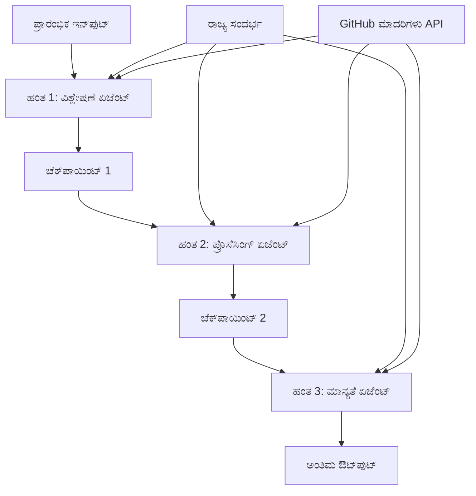

<!--
CO_OP_TRANSLATOR_METADATA:
{
  "original_hash": "1be9c8dcbd79a02d33d2c138684c1394",
  "translation_date": "2025-12-03T16:29:12+00:00",
  "source_file": "08-multi-agent/code_samples/workflows-agent-framework/dotNET/02.dotnet-agent-framework-workflow-ghmodel-sequential.md",
  "language_code": "kn"
}
-->
# ⏩ GitHub ಮಾದರಿಗಳೊಂದಿಗೆ ಕ್ರಮಬದ್ಧ ಏಜೆಂಟ್ ಕಾರ್ಯಪ್ರವಾಹಗಳು (.NET)

## 📋 ಉನ್ನತ ಕ್ರಮಬದ್ಧ ಪ್ರಕ್ರಿಯೆ ಟ್ಯುಟೋರಿಯಲ್

ಈ ನೋಟ್ಬುಕ್ Microsoft Agent Framework for .NET ಮತ್ತು GitHub ಮಾದರಿಗಳನ್ನು ಬಳಸಿಕೊಂಡು **ಕ್ರಮಬದ್ಧ ಕಾರ್ಯಪ್ರವಾಹ ಮಾದರಿಗಳನ್ನು** ತೋರಿಸುತ್ತದೆ. ಏಜೆಂಟ್‌ಗಳು ನಿರ್ದಿಷ್ಟ ಕ್ರಮದಲ್ಲಿ ಕಾರ್ಯನಿರ್ವಹಿಸುವ, ಪ್ರತಿ ಹಂತವು ಹಿಂದಿನ ಹಂತದ ಫಲಿತಾಂಶಗಳ ಮೇಲೆ ಆಧಾರಿತವಾಗಿರುವ ಸುಧಾರಿತ, ಹಂತ ಹಂತದ ಪ್ರಕ್ರಿಯಾ ಪೈಪ್‌ಲೈನ್‌ಗಳನ್ನು ನಿರ್ಮಿಸುವುದನ್ನು ನೀವು ಕಲಿಯುತ್ತೀರಿ.

## 🎯 ಕಲಿಕೆಯ ಉದ್ದೇಶಗಳು

### 🔄 **ಕ್ರಮಬದ್ಧ ಪ್ರಕ್ರಿಯಾ ಆರ್ಕಿಟೆಕ್ಚರ್**
- **ರೇಖೀಯ ಕಾರ್ಯಪ್ರವಾಹ ವಿನ್ಯಾಸ**: ಸ್ಪಷ್ಟ ಅವಲಂಬನೆಗಳೊಂದಿಗೆ ಹಂತ ಹಂತದ ಪ್ರಕ್ರಿಯಾ ಪೈಪ್‌ಲೈನ್‌ಗಳನ್ನು ರಚಿಸಿ
- **ಸ್ಥಿತಿ ನಿರ್ವಹಣೆ**: ಕ್ರಮಬದ್ಧ ಕಾರ್ಯಪ್ರವಾಹ ಹಂತಗಳಾದ್ಯಂತ ಪ್ರಾಸಂಗಿಕತೆ ಮತ್ತು ಡೇಟಾ ಹರಿವನ್ನು ನಿರ್ವಹಿಸಿ
- **GitHub ಮಾದರಿಗಳ ಏಕೀಕರಣ**: ಬಹು ಹಂತದ .NET ಕಾರ್ಯಪ್ರವಾಹಗಳಲ್ಲಿ GitHub ನ AI ಮಾದರಿಗಳನ್ನು ಬಳಸಿಕೊಳ್ಳಿ
- **ಎಂಟರ್‌ಪ್ರೈಸ್ ಪೈಪ್‌ಲೈನ್ ಮಾದರಿಗಳು**: ಉತ್ಪಾದನಾ-ಸಿದ್ಧ ಕ್ರಮಬದ್ಧ ಪ್ರಕ್ರಿಯಾ ವ್ಯವಸ್ಥೆಗಳನ್ನು ನಿರ್ಮಿಸಿ

### 🏗️ **ಉನ್ನತ ಕ್ರಮಬದ್ಧ ಮಾದರಿಗಳು**
- **ಹಂತ-ಗೇಟ್ ಪ್ರಕ್ರಿಯೆ**: ಕಾರ್ಯಪ್ರವಾಹ ಹಂತಗಳ ನಡುವೆ ಮಾನ್ಯತೆ ತಪಾಸಣೆಗಳನ್ನು ಜಾರಿಗೆ ತರುವುದನ್ನು ಕಲಿಯಿರಿ
- **ಪ್ರಾಸಂಗಿಕತೆಯ ಸಂರಕ್ಷಣೆ**: ಎಲ್ಲಾ ಹಂತಗಳಾದ್ಯಂತ ಸ್ಥಿತಿ ಮತ್ತು ಸಂಗ್ರಹಿತ ಜ್ಞಾನವನ್ನು ನಿರ್ವಹಿಸಿ
- **ದೋಷ ಪ್ರಸರಣ**: ಕ್ರಮಬದ್ಧ ಪ್ರಕ್ರಿಯಾ ಸರಪಳಿಗಳಲ್ಲಿ ವೈಫಲ್ಯಗಳನ್ನು ಸುಗಮವಾಗಿ ನಿರ್ವಹಿಸಿ
- **ಕಾರ್ಯಕ್ಷಮತೆಯ ಆಪ್ಟಿಮೈಜೇಶನ್**: ಕನಿಷ್ಠ ಓವರ್‌ಹೆಡ್‌ನೊಂದಿಗೆ ಪರಿಣಾಮಕಾರಿ ಕ್ರಮಬದ್ಧ ಕಾರ್ಯನಿರ್ವಹಣೆ

### 🏢 **ಎಂಟರ್‌ಪ್ರೈಸ್ ಕ್ರಮಬದ್ಧ ಅನ್ವಯಿಕೆಗಳು**
- **ಡಾಕ್ಯುಮೆಂಟ್ ಪ್ರಕ್ರಿಯಾ ಪೈಪ್‌ಲೈನ್**: ಬಹು ಹಂತದ ಡಾಕ್ಯುಮೆಂಟ್ ವಿಶ್ಲೇಷಣೆ, ಪರಿವರ್ತನೆ, ಮತ್ತು ಮಾನ್ಯತೆ
- **ಗುಣಮಟ್ಟದ ಖಾತರಿಯ ಕಾರ್ಯಪ್ರವಾಹಗಳು**: ಕ್ರಮಬದ್ಧ ಪರಿಶೀಲನೆ, ಮಾನ್ಯತೆ, ಮತ್ತು ಅನುಮೋದನೆ ಪ್ರಕ್ರಿಯೆಗಳು
- **ವಿಷಯ ಉತ್ಪಾದನಾ ಪೈಪ್‌ಲೈನ್**: ಸಂಶೋಧನೆ → ಬರವಣಿಗೆ → ಸಂಪಾದನೆ → ಪರಿಶೀಲನೆ → ಪ್ರಕಟಣೆ
- **ವ್ಯಾಪಾರ ಪ್ರಕ್ರಿಯಾ ಸ್ವಯಂಚಾಲಿತಗೊಳಿಸುವಿಕೆ**: ಸ್ಪಷ್ಟ ಹಂತ ಅವಲಂಬನೆಗಳೊಂದಿಗೆ ಬಹು ಹಂತದ ವ್ಯವಹಾರ ಕಾರ್ಯಪ್ರವಾಹಗಳು

## ⚙️ ಪೂರ್ವಾಪೇಕ್ಷೆಗಳು ಮತ್ತು ಸೆಟಪ್

### 📦 **ಅಗತ್ಯವಿರುವ NuGet ಪ್ಯಾಕೇಜ್‌ಗಳು**

.NET ಕ್ರಮಬದ್ಧ ಕಾರ್ಯಪ್ರವಾಹಗಳಿಗೆ ಅಗತ್ಯವಿರುವ ಪ್ಯಾಕೇಜ್‌ಗಳು:

```xml
<!-- Core AI Framework -->
<PackageReference Include="Microsoft.Extensions.AI" Version="9.9.0" />

<!-- Client Model Abstractions -->
<PackageReference Include="System.ClientModel" Version="1.6.1.0" />

<!-- Azure Identity and Async LINQ Support -->
<PackageReference Include="Azure.Identity" Version="1.15.0" />
<PackageReference Include="System.Linq.Async" Version="6.0.3" />

<!-- Local Agent Framework References -->
<!-- Microsoft.Agents.AI.dll - Core agent abstractions -->
<!-- Microsoft.Agents.AI.OpenAI.dll - GitHub Models integration -->
```

### 🔑 **GitHub ಮಾದರಿಗಳ ಸಂರಚನೆ**

**ಪರಿಸರ ಸೆಟಪ್ (.env ಫೈಲ್):**
```env
GITHUB_TOKEN=your_github_personal_access_token
GITHUB_ENDPOINT=https://models.inference.ai.azure.com
GITHUB_MODEL_ID=gpt-4o-mini
```

**ಸಂರಚನಾ ನಿರ್ವಹಣೆ:**
```csharp
// Load environment variables securely
Env.Load("../../../.env");
var githubToken = Environment.GetEnvironmentVariable("GITHUB_TOKEN");
var githubEndpoint = Environment.GetEnvironmentVariable("GITHUB_ENDPOINT");
var modelId = Environment.GetEnvironmentVariable("GITHUB_MODEL_ID");
```

### 🏗️ **ಕ್ರಮಬದ್ಧ ಕಾರ್ಯಪ್ರವಾಹ ಆರ್ಕಿಟೆಕ್ಚರ್**


**ಮುಖ್ಯ ಘಟಕಗಳು:**
- **ಕ್ರಮಬದ್ಧ ಏಜೆಂಟ್‌ಗಳು**: ಪ್ರತಿ ಪ್ರಕ್ರಿಯಾ ಹಂತಕ್ಕೆ ವಿಶೇಷೀಕೃತ ಏಜೆಂಟ್‌ಗಳು
- **ಸ್ಥಿತಿ ಪ್ರಾಸಂಗಿಕತೆ**: ಹಂತಗಳಾದ್ಯಂತ ಸಂಗ್ರಹಿತ ಡೇಟಾ ಮತ್ತು ನಿರ್ಧಾರಗಳನ್ನು ನಿರ್ವಹಿಸುತ್ತದೆ
- **ತಪಾಸಣೆ ಹಂತಗಳು**: ಪ್ರತಿ ಹಂತದಲ್ಲಿ ಗುಣಮಟ್ಟ ಮತ್ತು ಸಮ್ಮತಿಯನ್ನು ಖಚಿತಪಡಿಸಿಕೊಳ್ಳಲು ಮಾನ್ಯತೆ ತಪಾಸಣೆ
- **GitHub ಮಾದರಿಗಳ ಕ್ಲೈಂಟ್**: ಎಲ್ಲಾ ಕಾರ್ಯಪ್ರವಾಹ ಹಂತಗಳಲ್ಲಿ ಸತತ AI ಮಾದರಿಗಳ ಪ್ರವೇಶ

## 🎨 **ಕ್ರಮಬದ್ಧ ಕಾರ್ಯಪ್ರವಾಹ ವಿನ್ಯಾಸ ಮಾದರಿಗಳು**

### 📝 **ಡಾಕ್ಯುಮೆಂಟ್ ಪ್ರಕ್ರಿಯಾ ಪೈಪ್‌ಲೈನ್**
```
Raw Document → Content Extraction → Analysis → Validation → Structured Output
```

### 🎯 **ವಿಷಯ ಸೃಷ್ಟಿ ಕಾರ್ಯಪ್ರವಾಹ**
```
Brief/Requirements → Research → Content Creation → Review → Final Polish
```

### 🔍 **ಗುಣಮಟ್ಟದ ಖಾತರಿಯ ಪೈಪ್‌ಲೈನ್**
```
Initial Review → Technical Validation → Compliance Check → Final Approval
```

### 💼 **ವ್ಯಾಪಾರ ಬುದ್ಧಿವಂತಿಕೆ ಕಾರ್ಯಪ್ರವಾಹ**
```
Data Collection → Processing → Analysis → Report Generation → Distribution
```

## 🏢 **ಎಂಟರ್‌ಪ್ರೈಸ್ ಕ್ರಮಬದ್ಧ ಪ್ರಯೋಜನಗಳು**

### 🎯 **ನಂಬಿಕೆ ಮತ್ತು ಗುಣಮಟ್ಟ**
- **ನಿರ್ಧಿಷ್ಟ ಪ್ರಕ್ರಿಯೆ**: ರಚನೆಯ ಹಂತಗಳ ಮೂಲಕ ಸತತ, ಪುನರಾವರ್ತಿತ ಫಲಿತಾಂಶಗಳು
- **ಗುಣಮಟ್ಟದ ತಪಾಸಣೆ ಹಂತಗಳು**: ಪ್ರತಿ ಹಂತದಲ್ಲಿ ಗುಣಮಟ್ಟವನ್ನು ಖಚಿತಪಡಿಸಿಕೊಳ್ಳುವ ತಪಾಸಣೆ
- **ದೋಷ ಪ್ರತ್ಯೇಕತೆ**: ಒಂದು ಹಂತದಲ್ಲಿ ಉಂಟಾಗುವ ಸಮಸ್ಯೆಗಳು ಮುಂದಿನ ಹಂತಗಳಿಗೆ ಪ್ರಸಾರವಾಗುವುದಿಲ್ಲ
- **ಆಡಿಟ್ ಟ್ರೇಲ್‌ಗಳು**: ಪ್ರತಿ ಹಂತದಲ್ಲಿ ನಿರ್ಧಾರಗಳು ಮತ್ತು ಪರಿವರ್ತನೆಗಳ ಸಂಪೂರ್ಣ ಟ್ರ್ಯಾಕಿಂಗ್

### 📈 **ವಿಸ್ತರಣೆ ಮತ್ತು ಕಾರ್ಯಕ್ಷಮತೆ**
- **ಮಾಡ್ಯುಲರ್ ವಿನ್ಯಾಸ**: ಪ್ರತಿ ಹಂತವನ್ನು ಸ್ವತಂತ್ರವಾಗಿ ಆಪ್ಟಿಮೈಸ್ ಮಾಡಬಹುದು
- **ಸಂಪತ್ತಿನ ನಿರ್ವಹಣೆ**: ಹಂತಗಳಾದ್ಯಂತ AI ಮಾದರಿಗಳ ಸಂಪತ್ತಿನ ಪರಿಣಾಮಕಾರಿ ಹಂಚಿಕೆ
- **ಸ್ಥಿತಿಯ ಆಪ್ಟಿಮೈಜೇಶನ್**: ಉತ್ತಮ ಕಾರ್ಯಕ್ಷಮತೆಯಿಗಾಗಿ ಹಂತಗಳ ನಡುವೆ ಕನಿಷ್ಠ ಸ್ಥಿತಿ ವರ್ಗಾವಣೆ
- **ಸಮಾಂತರ ಹಂತ ಗುಂಪುಗಳು**: ಬಹು ಕ್ರಮಬದ್ಧ ಕಾರ್ಯಪ್ರವಾಹಗಳನ್ನು ಸಮಾಂತರವಾಗಿ ನಿರ್ವಹಿಸಬಹುದು

### 🔒 **ಭದ್ರತೆ ಮತ್ತು ಅನುಸರಣಾ ನಿಯಮಗಳು**
- **ಹಂತ ಮಟ್ಟದ ಭದ್ರತೆ**: ವಿಭಿನ್ನ ಪ್ರಕ್ರಿಯಾ ಹಂತಗಳಿಗೆ ವಿಭಿನ್ನ ಭದ್ರತಾ ನೀತಿಗಳು
- **ಡೇಟಾ ಮಾನ್ಯತೆ**: ಪ್ರತಿ ತಪಾಸಣಾ ಹಂತದಲ್ಲಿ ಡೇಟಾ ಅಖಂಡತೆ ಮತ್ತು ಅನುಸರಣೆಯನ್ನು ಖಚಿತಪಡಿಸಿಕೊಳ್ಳಿ
- **ಪ್ರವೇಶ ನಿಯಂತ್ರಣ**: ವಿಭಿನ್ನ ಕಾರ್ಯಪ್ರವಾಹ ಹಂತಗಳಿಗೆ ಸೂಕ್ಷ್ಮ ಅನುಮತಿಗಳು
- **ನಿಯಮಾನುಸಾರತೆ**: ರಚಿತ ಪ್ರಕ್ರಿಯೆಗಳ ಮೂಲಕ ನಿಯಮಾನುಸಾರತೆ ಅಗತ್ಯಗಳನ್ನು ಪೂರೈಸಿ

### 📊 **ಮೋನಿಟರಿಂಗ್ ಮತ್ತು ವಿಶ್ಲೇಷಣೆ**
- **ಹಂತ ಮಟ್ಟದ ಮೆಟ್ರಿಕ್‌ಗಳು**: ಪ್ರತಿ ಕಾರ್ಯಪ್ರವಾಹ ಹಂತದ ಕಾರ್ಯಕ್ಷಮತೆಯ ಮೇಲ್ವಿಚಾರಣೆ
- **ಬಾಟಲ್‌ನೆಕ್ ಗುರುತಿಸುವಿಕೆ**: ನಿಧಾನಗತಿಯ ಹಂತಗಳನ್ನು ಗುರುತಿಸಿ ಮತ್ತು ಆಪ್ಟಿಮೈಸ್ ಮಾಡಿ
- **ಗುಣಮಟ್ಟದ ಮೆಟ್ರಿಕ್‌ಗಳು**: ಪ್ರತಿ ಹಂತದಲ್ಲಿ ಗುಣಮಟ್ಟ ಮತ್ತು ಯಶಸ್ಸಿನ ಪ್ರಮಾಣವನ್ನು ಟ್ರ್ಯಾಕ್ ಮಾಡಿ
- **ಪ್ರಕ್ರಿಯಾ ಆಪ್ಟಿಮೈಜೇಶನ್**: ಹಂತ ಮಟ್ಟದ ವಿಶ್ಲೇಷಣೆಯ ಆಧಾರದ ಮೇಲೆ ನಿರಂತರ ಸುಧಾರಣೆ

ಬಲವಾದ ಕ್ರಮಬದ್ಧ AI ಪ್ರಕ್ರಿಯಾ ಪೈಪ್‌ಲೈನ್‌ಗಳನ್ನು ನಿರ್ಮಿಸೋಣ! 🚀

## 💻 ಕೋಡ್ ಅನ್ನು ಚಲಿಸುವುದು

ಸಂಪೂರ್ಣ ಅನುಷ್ಠಾನ `02.dotnet-agent-framework-workflow-ghmodel-sequential.cs` ನಲ್ಲಿ ಲಭ್ಯವಿದೆ. ಈ ಫೈಲ್ **ಮೂರು ಹಂತದ ಫರ್ನಿಚರ್ ವಿಶ್ಲೇಷಣಾ ಕಾರ್ಯಪ್ರವಾಹವನ್ನು** ತೋರಿಸುತ್ತದೆ:

1. **ಹಂತ 1 - ಮಾರಾಟ ಏಜೆಂಟ್**: ಫರ್ನಿಚರ್ ಚಿತ್ರಗಳನ್ನು ವಿಶ್ಲೇಷಿಸಿ ಮತ್ತು ಖರೀದಿ ಶಿಫಾರಸುಗಳನ್ನು ಒದಗಿಸುತ್ತದೆ
2. **ಹಂತ 2 - ಬೆಲೆ ಏಜೆಂಟ್**: ವಿವರವಾದ ಬೆಲೆ ವಿಶ್ಲೇಷಣೆ ಮತ್ತು ಬಜೆಟ್ ಆಯ್ಕೆಗಳನ್ನು ಒದಗಿಸುತ್ತದೆ
3. **ಹಂತ 3 - ಕ್ವೋಟ್ ಏಜೆಂಟ್**: Markdown ಸ್ವರೂಪದಲ್ಲಿ ವೃತ್ತಿಪರ ಕ್ವೋಟ್ ಡಾಕ್ಯುಮೆಂಟ್ ಅನ್ನು ರಚಿಸುತ್ತದೆ

### 🏗️ **ಕಾರ್ಯಪ್ರವಾಹ ಆರ್ಕಿಟೆಕ್ಚರ್**

```
Image Input → Sales Analysis → Price Estimation → Quote Generation → Final Output
```

ಪ್ರತಿ ಏಜೆಂಟ್:
- ಹಿಂದಿನ ಹಂತದಿಂದ ಪ್ರಾಸಂಗಿಕತೆಯಾಗಿ ಔಟ್‌ಪುಟ್ ಅನ್ನು ಸ್ವೀಕರಿಸುತ್ತದೆ
- ಹಿಂದಿನ ವಿಶ್ಲೇಷಣೆಯ ಮೇಲೆ ವಿಶೇಷ ತಜ್ಞತೆಯೊಂದಿಗೆ ನಿರ್ಮಿಸುತ್ತದೆ
- ಸ್ಥಿತಿ ನಿರ್ವಹಣೆಯ ಮೂಲಕ ಕಾರ್ಯಪ್ರವಾಹ ನಿರಂತರತೆಯನ್ನು ನಿರ್ವಹಿಸುತ್ತದೆ

### 🚀 ಉದಾಹರಣೆಯನ್ನು ಚಲಿಸುವುದು

**ಪೂರ್ವಾಪೇಕ್ಷೆಗಳು:**
- ಫರ್ನಿಚರ್ ಚಿತ್ರವನ್ನು `../imgs/home.png` ನಲ್ಲಿ ಇರಿಸಿ (ಅಥವಾ `imgPath` ವ್ಯತ್ಯಾಸವನ್ನು ನವೀಕರಿಸಿ)
- ನಿಮ್ಮ `.env` ಫೈಲ್ ಅನ್ನು GitHub ಮಾದರಿಗಳ ಕ್ರೆಡೆನ್ಷಿಯಲ್ಸ್‌ನೊಂದಿಗೆ ಸಂರಚಿಸಿ

```bash
# ಸ್ಕ್ರಿಪ್ಟ್ ಅನ್ನು ಕಾರ್ಯನಿರ್ವಹಣೀಯವಾಗಿಸಿ (ಯುನಿಕ್ಸ್/ಲಿನಕ್ಸ್/ಮ್ಯಾಕ್‌ಒಎಸ್)
chmod +x 02.dotnet-agent-framework-workflow-ghmodel-sequential.cs

# ಕ್ರಮಬದ್ಧ ಕಾರ್ಯಪ್ರವಾಹವನ್ನು ಚಲಾಯಿಸಿ
./02.dotnet-agent-framework-workflow-ghmodel-sequential.cs
```

ಅಥವಾ Windows ನಲ್ಲಿ:
```powershell
dotnet run 02.dotnet-agent-framework-workflow-ghmodel-sequential.cs
```

### 📝 ನಿರೀಕ್ಷಿತ ಔಟ್‌ಪುಟ್

ಕಾರ್ಯಪ್ರವಾಹವು:
1. **ಮಾರಾಟ ಏಜೆಂಟ್**: ಚಿತ್ರದಿಂದ ಫರ್ನಿಚರ್ ಐಟಂಗಳನ್ನು ಗುರುತಿಸಿ ಶಿಫಾರಸುಗಳನ್ನು ಒದಗಿಸುತ್ತದೆ
2. **ಬೆಲೆ ಏಜೆಂಟ್**: ಬಜೆಟ್ ಮಟ್ಟಗಳು ಮತ್ತು ಶಾಪಿಂಗ್ ಶಿಫಾರಸುಗಳೊಂದಿಗೆ ವಿವರವಾದ ಬೆಲೆ ವಿಶ್ಲೇಷಣೆಯನ್ನು ಸೇರಿಸುತ್ತದೆ
3. **ಕ್ವೋಟ್ ಏಜೆಂಟ್**: ಚಿತ್ರ ವಿಶ್ಲೇಷಣೆಯ ಆಧಾರದ ಮೇಲೆ ಎಲ್ಲಾ ಮಾಹಿತಿಯನ್ನು ಸಂಶ್ಲೇಷಿಸಿ ಸ್ವರೂಪಿತ ಕ್ವೋಟ್ ಡಾಕ್ಯುಮೆಂಟ್ ಅನ್ನು ರಚಿಸುತ್ತದೆ

ಅಂತಿಮ ಔಟ್‌ಪುಟ್ ಚಿತ್ರ ವಿಶ್ಲೇಷಣೆಯ ಆಧಾರದ ಮೇಲೆ ಸಮಗ್ರ, ವೃತ್ತಿಪರ ಫರ್ನಿಚರ್ ಕ್ವೋಟ್ ಆಗಿರುತ್ತದೆ.

### 🔧 ಕಸ್ಟಮೈಜೇಶನ್ ಆಯ್ಕೆಗಳು

**ಏಜೆಂಟ್ ನ ವರ್ತನೆಯನ್ನು ಬದಲಾಯಿಸಿ:**
```csharp
// Adjust agent instructions to change their focus
const string SalesAgentInstructions = "Your custom instructions...";
```

**ಕ್ರಮಬದ್ಧ ಹರಿವನ್ನು ಬದಲಾಯಿಸಿ:**
```csharp
// Add or reorder workflow stages
var workflow = new WorkflowBuilder(salesagent)
    .AddEdge(salesagent, priceagent)
    .AddEdge(priceagent, quoteagent)
    .AddEdge(quoteagent, newAgent)  // Add another stage
    .Build();
```

**ವಿಭಿನ್ನ ಇನ್‌ಪುಟ್ ಅನ್ನು ಬಳಸಿ:**
```csharp
// Process text instead of images
ChatMessage userMessage = new ChatMessage(ChatRole.User, [
    new TextContent("Analyze pricing for a modern living room set")
]);
```

### 🎯 ನೈಜ ಜಗತ್ತಿನ ಅನ್ವಯಿಕೆಗಳು

ಈ ಕ್ರಮಬದ್ಧ ಮಾದರಿ ಈ ಕೆಳಗಿನವುಗಳಿಗೆ ಸೂಕ್ತವಾಗಿದೆ:
- **ಇ-ಕಾಮರ್ಸ್**: ಉತ್ಪನ್ನ ವಿಶ್ಲೇಷಣೆ → ಬೆಲೆ → ಕ್ವೋಟ್ ರಚನೆ
- **ರಿಯಲ್ ಎಸ್ಟೇಟ್**: ಆಸ್ತಿ ವಿಶ್ಲೇಷಣೆ → ಮೌಲ್ಯಮಾಪನ → ಲಿಸ್ಟಿಂಗ್ ರಚನೆ
- **ವಿಮೆ**: ಹಕ್ಕು ವಿಶ್ಲೇಷಣೆ → ಮೌಲ್ಯಮಾಪನ → ಕ್ವೋಟ್ ರಚನೆ
- **ವಿಷಯ ಸೃಷ್ಟಿ**: ಸಂಶೋಧನೆ → ಬರವಣಿಗೆ → ಸಂಪಾದನೆ → ಪ್ರಕಟಣೆ

### 🔍 ಸ್ಥಿತಿ ಹರಿವನ್ನು ಅರ್ಥಮಾಡಿಕೊಳ್ಳುವುದು

ಕ್ರಮದಲ್ಲಿ ಪ್ರತಿ ಏಜೆಂಟ್ ಈ ಕೆಳಗಿನವುಗಳನ್ನು ಸ್ವೀಕರಿಸುತ್ತದೆ:
- **ಮೂಲ ಇನ್‌ಪುಟ್**: ಪ್ರಾರಂಭಿಕ ಬಳಕೆದಾರ ಸಂದೇಶ (ಚಿತ್ರ + ಪಠ್ಯ)
- **ಹಿಂದಿನ ಏಜೆಂಟ್ ಔಟ್‌ಪುಟ್‌ಗಳು**: ಸಂಭಾಷಣಾ ಇತಿಹಾಸದಲ್ಲಿ ಎಲ್ಲಾ ಹಿಂದಿನ ಏಜೆಂಟ್ ಪ್ರತಿಕ್ರಿಯೆಗಳು
- **ಸಂಗ್ರಹಿತ ಪ್ರಾಸಂಗಿಕತೆ**: ಕಾರ್ಯಪ್ರವಾಹದಾದ್ಯಂತ ನಿರ್ವಹಿಸಲಾದ ಸಂಪೂರ್ಣ ಸ್ಥಿತಿ

ಇದು ಪ್ರತಿ ಏಜೆಂಟ್ ಹಿಂದಿನ ಎಲ್ಲಾ ಹಂತಗಳಿಂದ ಸಮಗ್ರ ಪ್ರಾಸಂಗಿಕತೆಯ ಮೇಲೆ ನಿರ್ಮಿಸುವ ಸುಧಾರಿತ ಬಹು ಹಂತದ ಪ್ರಕ್ರಿಯೆಯನ್ನು ಸಾಧ್ಯವಾಗಿಸುತ್ತದೆ.

---

<!-- CO-OP TRANSLATOR DISCLAIMER START -->
**ಅಸಮೀಕ್ಷೆ**:  
ಈ ದಾಖಲೆ [Co-op Translator](https://github.com/Azure/co-op-translator) ಎಂಬ AI ಅನುವಾದ ಸೇವೆಯನ್ನು ಬಳಸಿಕೊಂಡು ಅನುವಾದಿಸಲಾಗಿದೆ. ನಾವು ಶುದ್ಧತೆಯಿಗಾಗಿ ಪ್ರಯತ್ನಿಸುತ್ತಿದ್ದರೂ, ದಯವಿಟ್ಟು ಗಮನಿಸಿ, ಸ್ವಯಂಚಾಲಿತ ಅನುವಾದಗಳಲ್ಲಿ ದೋಷಗಳು ಅಥವಾ ಅಸಮರ್ಪಕತೆಗಳು ಇರಬಹುದು. ಮೂಲ ಭಾಷೆಯಲ್ಲಿರುವ ಮೂಲ ದಾಖಲೆ ಪ್ರಾಮಾಣಿಕ ಮೂಲವೆಂದು ಪರಿಗಣಿಸಬೇಕು. ಪ್ರಮುಖ ಮಾಹಿತಿಗಾಗಿ, ವೃತ್ತಿಪರ ಮಾನವ ಅನುವಾದವನ್ನು ಶಿಫಾರಸು ಮಾಡಲಾಗುತ್ತದೆ. ಈ ಅನುವಾದದ ಬಳಕೆಯಿಂದ ಉಂಟಾಗುವ ಯಾವುದೇ ತಪ್ಪುಅರ್ಥಗಳು ಅಥವಾ ತಪ್ಪುಅನ್ವಯಗಳಿಗೆ ನಾವು ಹೊಣೆಗಾರರಲ್ಲ.
<!-- CO-OP TRANSLATOR DISCLAIMER END -->