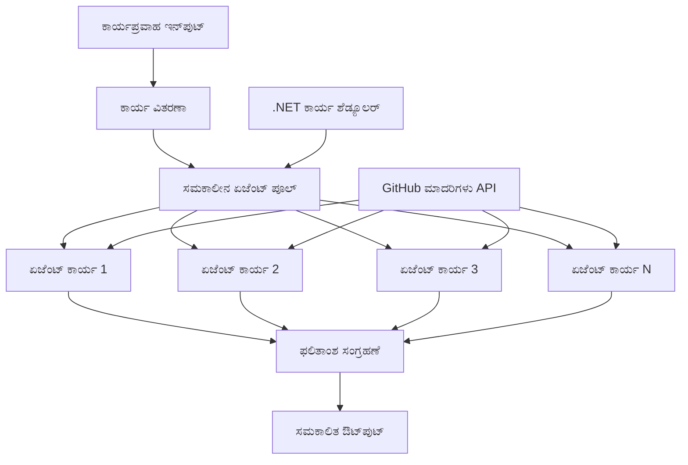

<!--
CO_OP_TRANSLATOR_METADATA:
{
  "original_hash": "b9c6e32c9b5f2fed20b6916984440d88",
  "translation_date": "2025-12-03T16:26:52+00:00",
  "source_file": "08-multi-agent/code_samples/workflows-agent-framework/dotNET/03.dotnet-agent-framework-workflow-ghmodel-concurrent.md",
  "language_code": "kn"
}
-->
# ⚡ GitHub ಮಾದರಿಗಳೊಂದಿಗೆ ಸಮಕಾಲಿಕ ಏಜೆಂಟ್ ಕಾರ್ಯಪ್ರವಾಹಗಳು (.NET)

## 📋 ಉನ್ನತ-ಪ್ರದರ್ಶನ ಸಮಕಾಲಿಕ ಪ್ರಕ್ರಿಯೆ ಟ್ಯುಟೋರಿಯಲ್

ಈ ನೋಟ್ಬುಕ್ **ಸಮಕಾಲಿಕ ಕಾರ್ಯಪ್ರವಾಹ ಮಾದರಿಗಳನ್ನು** Microsoft Agent Framework for .NET ಮತ್ತು GitHub ಮಾದರಿಗಳೊಂದಿಗೆ ಬಳಸುವ ವಿಧಾನವನ್ನು ತೋರಿಸುತ್ತದೆ. ನೀವು ಹಲವಾರು AI ಏಜೆಂಟ್‌ಗಳನ್ನು ಒಂದೇ ಸಮಯದಲ್ಲಿ ಕಾರ್ಯಗತಗೊಳಿಸುವ ಮೂಲಕ ಗತಿಯನ್ನು ಗರಿಷ್ಠಗೊಳಿಸುವ, ಉನ್ನತ-ಪ್ರದರ್ಶನದ ಸಮಕಾಲಿಕ ಪ್ರಕ್ರಿಯೆ ಕಾರ್ಯಪ್ರವಾಹಗಳನ್ನು ನಿರ್ಮಿಸುವುದನ್ನು ಕಲಿಯುತ್ತೀರಿ, ಜೊತೆಗೆ ಸಮನ್ವಯ ಮತ್ತು ಡೇಟಾ ಸಾಂದ್ರತೆಯನ್ನು ಕಾಪಾಡುತ್ತೀರಿ.

## 🎯 ಕಲಿಕೆಯ ಉದ್ದೇಶಗಳು

### 🚀 **ಸಮಕಾಲಿಕ ಪ್ರಕ್ರಿಯೆಯ ಮೂಲಭೂತಗಳು**
- **ಸಮಕಾಲಿಕ ಏಜೆಂಟ್ ಕಾರ್ಯಗತಗೊಳನೆ**: ಗರಿಷ್ಠ ಕಾರ್ಯಕ್ಷಮತೆಯಿಗಾಗಿ ಹಲವಾರು AI ಏಜೆಂಟ್‌ಗಳನ್ನು ಒಂದೇ ಸಮಯದಲ್ಲಿ ಚಲಾಯಿಸಿ
- **Async/Await ಮಾದರಿಗಳು**: ಸಮರ್ಥ ಸಮಕಾಲಿಕತೆಯಿಗಾಗಿ .NET ನ async ಪ್ರೋಗ್ರಾಮಿಂಗ್ ಮಾದರಿಯನ್ನು ಬಳಸಿಕೊಳ್ಳಿ
- **GitHub ಮಾದರಿಗಳ ಸಮಗ್ರೀಕರಣ**: GitHub ನ AI ಮಾದರಿ ನಿರ್ವಚನಾ ಸೇವೆಗೆ ಹಲವಾರು ಸಮಕಾಲಿಕ ಕರೆಗಳನ್ನು ಸಮನ್ವಯಗೊಳಿಸಿ
- **ಸಂಪತ್ತಿನ ನಿರ್ವಹಣೆ**: ಸಮಕಾಲಿಕ ಕಾರ್ಯಾಚರಣೆಗಳಲ್ಲಿ AI ಮಾದರಿ ಸಂಪತ್ತನ್ನು ಸಮರ್ಥವಾಗಿ ನಿರ್ವಹಿಸಿ

### 🏗️ **ಆಧುನಿಕ ಸಮಕಾಲಿಕ ಆರ್ಕಿಟೆಕ್ಚರ್**
- **Task-Based Parallelism**: ಸಮಕಾಲಿಕ ಕಾರ್ಯಗತಗತಿಗಾಗಿ .NET Task Parallel Library ಅನ್ನು ಬಳಸಿ
- **ಸಮನ್ವಯ ಮಾದರಿಗಳು**: ರೇಸ್ ಶರತ್ತುಗಳನ್ನು ತಪ್ಪಿಸುವಾಗ ಸಮಕಾಲಿಕ ಏಜೆಂಟ್‌ಗಳನ್ನು ಸಮನ್ವಯಗೊಳಿಸಿ
- **ಲೋಡ್ ಬಲಾನ್ವಯನ**: ಲಭ್ಯವಿರುವ ಸಮಕಾಲಿಕ ಪ್ರಕ್ರಿಯೆ ಸಾಮರ್ಥ್ಯದಾದ್ಯಂತ ಕೆಲಸವನ್ನು ಸಮರ್ಥವಾಗಿ ಹಂಚಿ
- **ದೋಷ ಸಹಿಷ್ಣುತೆ**: ಸಂಪೂರ್ಣ ಕಾರ್ಯಪ್ರವಾಹವನ್ನು ನಿಲ್ಲಿಸದೆ ವೈಯಕ್ತಿಕ ಏಜೆಂಟ್ ವೈಫಲ್ಯಗಳನ್ನು ನಿರ್ವಹಿಸಿ

### 🏢 **ಎಂಟರ್‌ಪ್ರೈಸ್ ಸಮಕಾಲಿಕ ಅಪ್ಲಿಕೇಶನ್‌ಗಳು**
- **ಹೆಚ್ಚು-ಪ್ರಮಾಣದ ಡಾಕ್ಯುಮೆಂಟ್ ಪ್ರಕ್ರಿಯೆ**: ಹಲವಾರು ಡಾಕ್ಯುಮೆಂಟ್‌ಗಳನ್ನು ಒಂದೇ ಸಮಯದಲ್ಲಿ ಪ್ರಕ್ರಿಯೆಗೊಳಿಸಿ
- **ರಿಯಲ್-ಟೈಮ್ ವಿಷಯ ವಿಶ್ಲೇಷಣೆ**: ಒಳಬರುವ ಡೇಟಾ ಸ್ಟ್ರೀಮ್‌ಗಳ ಸಮಕಾಲಿಕ ವಿಶ್ಲೇಷಣೆ
- **ಬ್ಯಾಚ್ ಪ್ರಕ್ರಿಯೆ ಆಪ್ಟಿಮೈಜೇಶನ್**: ದೊಡ್ಡ ಪ್ರಮಾಣದ ಡೇಟಾ ಪ್ರಕ್ರಿಯೆ ಕಾರ್ಯಾಚರಣೆಗಳಿಗಾಗಿ ಗತಿಯನ್ನು ಗರಿಷ್ಠಗೊಳಿಸಿ
- **ಮಲ್ಟಿ-ಮೋಡಲ್ ವಿಶ್ಲೇಷಣೆ**: ವಿಭಿನ್ನ ವಿಷಯ ಪ್ರಕಾರಗಳು ಮತ್ತು ಸ್ವರೂಪಗಳ ಸಮಕಾಲಿಕ ಪ್ರಕ್ರಿಯೆ

## ⚙️ ಪೂರ್ವಾಪೇಕ್ಷೆಗಳು ಮತ್ತು ಸೆಟಪ್

### 📦 **ಅಗತ್ಯವಿರುವ NuGet ಪ್ಯಾಕೇಜ್‌ಗಳು**

ಉನ್ನತ-ಪ್ರದರ್ಶನದ ಸಮಕಾಲಿಕ ಕಾರ್ಯಪ್ರವಾಹಗಳಿಗೆ ಅಗತ್ಯವಿರುವ ಪ್ಯಾಕೇಜ್‌ಗಳು:

```xml
<!-- Core AI Framework with Async Support -->
<PackageReference Include="Microsoft.Extensions.AI" Version="9.9.0" />

<!-- Client Model Abstractions for API Communication -->
<PackageReference Include="System.ClientModel" Version="1.6.1.0" />

<!-- Azure Identity and Async LINQ for Advanced Operations -->
<PackageReference Include="Azure.Identity" Version="1.15.0" />
<PackageReference Include="System.Linq.Async" Version="6.0.3" />

<!-- Local Agent Framework References -->
<!-- Microsoft.Agents.AI.dll - Core agent abstractions with async support -->
<!-- Microsoft.Agents.AI.OpenAI.dll - GitHub Models integration with concurrency -->
```

### 🔑 **GitHub ಮಾದರಿಗಳ ಸಂರಚನೆ**

**ಪರಿಸರ ಸೆಟಪ್ (.env ಫೈಲ್):**
```env
GITHUB_TOKEN=your_github_personal_access_token
GITHUB_ENDPOINT=https://models.inference.ai.azure.com
GITHUB_MODEL_ID=gpt-4o-mini
```

**ಸಮಕಾಲಿಕ ಪ್ರಕ್ರಿಯೆಯ ಪರಿಗಣನೆಗಳು:**
```csharp
// Configure for concurrent operations
var clientOptions = new OpenAIClientOptions()
{
    Endpoint = new Uri(githubEndpoint),
    // Configure connection pooling for concurrent requests
    NetworkTimeout = TimeSpan.FromMinutes(5)
};
```

### 🏗️ **ಸಮಕಾಲಿಕ ಕಾರ್ಯಪ್ರವಾಹ ಆರ್ಕಿಟೆಕ್ಚರ್**


**ಮುಖ್ಯ ಘಟಕಗಳು:**
- **Task Parallel Library**: ಸಮಕಾಲಿಕ ಕಾರ್ಯಾಚರಣೆಗಳಿಗೆ .NET ನ ಅಂತರ್ನಿಹಿತ ಬೆಂಬಲ
- **Agent Pool**: ಸಮಕಾಲಿಕ ಪ್ರಕ್ರಿಯೆಗಾಗಿ ಹಲವಾರು ಏಜೆಂಟ್ ಉದಾಹರಣೆಗಳು
- **Result Aggregation**: ಸಮಕಾಲಿಕ ಏಜೆಂಟ್ ಫಲಿತಾಂಶಗಳ ಸಮನ್ವಯ ಮತ್ತು ವಿಲೀನ
- **Synchronization Points**: ಸಮಕಾಲಿಕ ಕಾರ್ಯಾಚರಣೆಗಳಲ್ಲಿ ಡೇಟಾ ಸಾಂದ್ರತೆಯನ್ನು ಖಚಿತಪಡಿಸಿಕೊಳ್ಳಿ

## 🎨 **ಸಮಕಾಲಿಕ ಕಾರ್ಯಪ್ರವಾಹ ವಿನ್ಯಾಸ ಮಾದರಿಗಳು**

### 🔍 **ಸಮಕಾಲಿಕ ಸಂಶೋಧನೆ ಮತ್ತು ವಿಶ್ಲೇಷಣೆ**
```
Research Topic → Concurrent Research Agents → Result Synthesis → Final Report
```

### 📊 **ಬಹು-ಮೂಲ ಡೇಟಾ ಪ್ರಕ್ರಿಯೆ**
```
Data Sources → Parallel Processing Agents → Data Integration → Unified Output
```

### 🎭 **ವಿಷಯ ರಚನೆ ಪೈಪ್‌ಲೈನ್**
```
Content Requirements → Concurrent Content Generators → Quality Review → Final Content
```

### 🔄 **Fan-Out/Fan-In ಪ್ರಕ್ರಿಯೆ**
```
Single Input → Multiple Concurrent Processors → Result Aggregation → Single Output
```

## 🏢 **ಎಂಟರ್‌ಪ್ರೈಸ್ ಕಾರ್ಯಕ್ಷಮತೆಯ ಲಾಭಗಳು**

### ⚡ **ಗತಿಶೀಲತೆ ಮತ್ತು ವಿಸ್ತರಣಾ ಸಾಮರ್ಥ್ಯ**
- **ರೇಖೀಯ ಕಾರ್ಯಕ್ಷಮತೆಯ ವಿಸ್ತರಣೆ**: ಗತಿಯನ್ನು ಹೆಚ್ಚಿಸಲು ಹೆಚ್ಚು ಸಮಕಾಲಿಕ ಏಜೆಂಟ್‌ಗಳನ್ನು ಸೇರಿಸಿ
- **ಸಂಪತ್ತಿನ ಬಳಕೆ**: ಲಭ್ಯವಿರುವ AI ಮಾದರಿ ಸಾಮರ್ಥ್ಯದ ಗರಿಷ್ಠ ಕಾರ್ಯಕ್ಷಮತೆ
- **ಕಡಿತಗೊಂಡ ಪ್ರಕ್ರಿಯೆ ಸಮಯ**: ಸಮಕಾಲಿಕ ಕಾರ್ಯಗತಗತಿಯಿಂದ ಸಮಯದ ಪ್ರಮುಖ ಕಡಿತ
- **Elastic Scaling**: ಕೆಲಸದ ಒತ್ತಡದ ಆಧಾರದ ಮೇಲೆ ಸಮಕಾಲಿಕ ಏಜೆಂಟ್ ಸಂಖ್ಯೆಯನ್ನು ಡೈನಾಮಿಕ್‌ವಾಗಿ ಹೊಂದಿಸಿ

### 🛡️ **ನಂಬಿಕೆ ಮತ್ತು ಸ್ಥಿರತೆ**
- **ದೋಷ ಪ್ರತ್ಯೇಕತೆ**: ವೈಯಕ್ತಿಕ ಏಜೆಂಟ್ ವೈಫಲ್ಯಗಳು ಇತರ ಸಮಕಾಲಿಕ ಕಾರ್ಯಾಚರಣೆಗಳನ್ನು ಪ್ರಭಾವಿತಗೊಳಿಸುವುದಿಲ್ಲ
- **ಸೌಮ್ಯ ಕುಸಿತ**: ಕಡಿತಗೊಂಡ ಏಜೆಂಟ್ ಸಾಮರ್ಥ್ಯದಿಂದ ವ್ಯವಸ್ಥೆ ಕಾರ್ಯನಿರ್ವಹಿಸುತ್ತಿರುತ್ತದೆ
- **ದೋಷ ಪುನಃಪ್ರಯತ್ನ**: ವೈಫಲ್ಯಗೊಂಡ ಸಮಕಾಲಿಕ ಕಾರ್ಯಾಚರಣೆಗಳಿಗೆ ಸ್ವಯಂಚಾಲಿತ ಪುನಃಪ್ರಯತ್ನ ವ್ಯವಸ್ಥೆ
- **ಲೋಡ್ ವಿತರಣಾ**: ಲಭ್ಯವಿರುವ ಏಜೆಂಟ್‌ಗಳಾದ್ಯಂತ ಕೆಲಸವನ್ನು ಸಮಾನವಾಗಿ ಹಂಚಿಕೆ

### 📊 **ಕಾರ್ಯಕ್ಷಮತೆಯ ಮೇಲ್ವಿಚಾರಣೆ**
- **ಸಮಕಾಲಿಕ ಕಾರ್ಯಗತಗತಿ ಮೆಟ್ರಿಕ್‌ಗಳು**: ಎಲ್ಲಾ ಸಮಕಾಲಿಕ ಕಾರ್ಯಾಚರಣೆಗಳ ಕಾರ್ಯಕ್ಷಮತೆಯನ್ನು ಟ್ರ್ಯಾಕ್ ಮಾಡಿ
- **ಸಂಪತ್ತಿನ ಬಳಕೆ ವಿಶ್ಲೇಷಣೆ**: CPU, ಮೆಮೊರಿ, ಮತ್ತು ನೆಟ್‌ವರ್ಕ್ ಬಳಕೆಯನ್ನು ಮೇಲ್ವಿಚಾರಣೆ ಮಾಡಿ
- **ಗತಿಶೀಲ ವಿಶ್ಲೇಷಣೆ**: ಸಮಕಾಲಿಕ ಪ್ರಕ್ರಿಯೆಯಿಂದ ಲಭಿಸಿದ ಕಾರ್ಯಕ್ಷಮತೆಯ ಲಾಭಗಳನ್ನು ಅಳೆಯಿರಿ
- **ಬಾಟಲ್‌ನೆಕ್ ಪತ್ತೆ**: ಕಾರ್ಯಕ್ಷಮತೆಯ ನಿರ್ಬಂಧಗಳನ್ನು ಗುರುತಿಸಿ ಮತ್ತು ಪರಿಹರಿಸಿ

### 🔧 **ಅಭಿವೃದ್ಧಿ ಮತ್ತು ಕಾರ್ಯಾಚರಣೆಗಳು**
- **Async ಪ್ರೋಗ್ರಾಮಿಂಗ್ ಮಾದರಿ**: .NET ನ ಪರಿಪಕ್ವ async/await ಮಾದರಿಗಳನ್ನು ಬಳಸಿಕೊಳ್ಳಿ
- **Task ಸಮನ್ವಯ**: ಅಂತರ್ನಿಹಿತ ಟಾಸ್ಕ್ ನಿರ್ವಹಣೆ ಮತ್ತು ಸಮನ್ವಯ ಸಾಮರ್ಥ್ಯಗಳು
- **ಅಪವಾದ ನಿರ್ವಹಣೆ**: ಸಮಕಾಲಿಕ ಕಾರ್ಯಾಚರಣೆಗಳಿಗೆ ಸಮಗ್ರ ದೋಷ ನಿರ್ವಹಣೆ
- **ಡಿಬಗಿಂಗ್ ಬೆಂಬಲ**: ಸಮಕಾಲಿಕ ಕಾರ್ಯಪ್ರವಾಹಗಳಿಗೆ Visual Studio ಡಿಬಗಿಂಗ್ ಸಾಧನಗಳು

.NET ನೊಂದಿಗೆ ಉನ್ನತ-ಪ್ರದರ್ಶನದ ಸಮಕಾಲಿಕ AI ಕಾರ್ಯಪ್ರವಾಹಗಳನ್ನು ನಿರ್ಮಿಸೋಣ! 🚀

## 💻 ಕೋಡ್ ಚಲಾಯಿಸುವುದು

ಪೂರ್ಣ ಕಾರ್ಯಗತಗತಿಯನ್ನು `03.dotnet-agent-framework-workflow-ghmodel-concurrent.cs` ನಲ್ಲಿ ಲಭ್ಯವಿದೆ. ಈ ಫೈಲ್ **Fan-Out/Fan-In ಸಮಕಾಲಿಕ ಕಾರ್ಯಪ್ರವಾಹ**ವನ್ನು ಪ್ರಯಾಣ ಯೋಜನೆಗಾಗಿ ತೋರಿಸುತ್ತದೆ:

### 🏗️ **ಕಾರ್ಯಪ್ರವಾಹ ಆರ್ಕಿಟೆಕ್ಚರ್**

```
User Request → ConcurrentStartExecutor → [Researcher Agent || Planner Agent] → ConcurrentAggregationExecutor → Final Output
```

**ಮುಖ್ಯ ಘಟಕಗಳು:**

1. **ConcurrentStartExecutor**: ಬಳಕೆದಾರರ ವಿನಂತಿಯನ್ನು ಎಲ್ಲಾ ಏಜೆಂಟ್‌ಗಳಿಗೆ ಒಂದೇ ಸಮಯದಲ್ಲಿ ಪ್ರಸಾರ ಮಾಡುತ್ತದೆ
2. **Researcher Agent**: ಸ್ಥಳಗಳು ಮತ್ತು ಆಕರ್ಷಣೆಗಳನ್ನು ಸಮಕಾಲಿಕವಾಗಿ ವಿಶ್ಲೇಷಿಸುತ್ತದೆ
3. **Planner Agent**: ಸಮಕಾಲಿಕವಾಗಿ ವಿವರವಾದ ಪ್ರಯಾಣ ಯೋಜನೆಗಳನ್ನು ರಚಿಸುತ್ತದೆ
4. **ConcurrentAggregationExecutor**: ಎರಡೂ ಏಜೆಂಟ್‌ಗಳಿಂದ ಫಲಿತಾಂಶಗಳನ್ನು ಸಂಗ್ರಹಿಸಿ ವಿಲೀನಗೊಳಿಸುತ್ತದೆ

### 🎯 **Fan-Out/Fan-In ಮಾದರಿ**

ಈ ಕಾರ್ಯಪ್ರವಾಹವು ಶ್ರೇಣಿಯ **Fan-Out/Fan-In** ಮಾದರಿಯನ್ನು ತೋರಿಸುತ್ತದೆ:
- **Fan-Out**: ಒಂದು ಇನ್‌ಪುಟ್ ಸಂದೇಶವನ್ನು ಒಂದೇ ಸಮಯದಲ್ಲಿ ಹಲವಾರು ಏಜೆಂಟ್‌ಗಳಿಗೆ ಪ್ರಸಾರ ಮಾಡಲಾಗುತ್ತದೆ
- **ಸಮಕಾಲಿಕ ಪ್ರಕ್ರಿಯೆ**: ಹಲವಾರು ಏಜೆಂಟ್‌ಗಳು ಒಂದೇ ಕಾರ್ಯದಲ್ಲಿ ಸಮಕಾಲಿಕವಾಗಿ ಕೆಲಸ ಮಾಡುತ್ತವೆ
- **Fan-In**: ಎಲ್ಲಾ ಏಜೆಂಟ್‌ಗಳಿಂದ ಫಲಿತಾಂಶಗಳನ್ನು ಸಂಗ್ರಹಿಸಿ ಒಟ್ಟುಗೂಡಿಸಲಾಗುತ್ತದೆ

### 🚀 ಉದಾಹರಣೆಯನ್ನು ಚಲಾಯಿಸುವುದು

```bash
# ಸ್ಕ್ರಿಪ್ಟ್ ಅನ್ನು ಕಾರ್ಯನಿರ್ವಹಿಸಬಹುದಾದಂತೆ ಮಾಡಿ (ಯುನಿಕ್ಸ್/ಲಿನಕ್ಸ್/ಮ್ಯಾಕ್‌ಒಎಸ್)
chmod +x 03.dotnet-agent-framework-workflow-ghmodel-concurrent.cs

# ಸಮಕಾಲೀನ ಕಾರ್ಯಪ್ರವಾಹವನ್ನು ಚಲಾಯಿಸಿ
./03.dotnet-agent-framework-workflow-ghmodel-concurrent.cs
```

ಅಥವಾ Windows ನಲ್ಲಿ:
```powershell
dotnet run 03.dotnet-agent-framework-workflow-ghmodel-concurrent.cs
```

### 📝 ನಿರೀಕ್ಷಿತ ಫಲಿತಾಂಶ

ಕಾರ್ಯಪ್ರವಾಹವು:
1. **ವಿನಂತಿಯನ್ನು ಪ್ರಸಾರ ಮಾಡುತ್ತದೆ**: "ಡಿಸೆಂಬರ್‌ನಲ್ಲಿ ಸಿಯಾಟಲ್‌ಗೆ ಪ್ರಯಾಣ ಯೋಜನೆ ಮಾಡಿ" ಎಂಬ ಸಂದೇಶವನ್ನು ಎರಡೂ ಏಜೆಂಟ್‌ಗಳಿಗೆ ಕಳುಹಿಸುತ್ತದೆ
2. **ಸಮಕಾಲಿಕ ಪ್ರಕ್ರಿಯೆ**: ಎರಡೂ ಏಜೆಂಟ್‌ಗಳು ಒಂದೇ ಸಮಯದಲ್ಲಿ ಕೆಲಸ ಮಾಡುತ್ತವೆ:
   - Researcher ಆಕರ್ಷಣೆಗಳು ಮತ್ತು ವಿವರಗಳನ್ನು ಗುರುತಿಸುತ್ತದೆ
   - Planner ಪಠ್ಯಕ್ರಮ ಮತ್ತು ಲಾಜಿಸ್ಟಿಕ್ಸ್ ರಚಿಸುತ್ತದೆ
3. **Aggregation**: ಎರಡೂ ಪ್ರತಿಕ್ರಿಯೆಗಳನ್ನು ಸಮಗ್ರವಾಗಿ ವಿಲೀನಗೊಳಿಸುತ್ತದೆ
4. **ಫಲಿತಾಂಶಗಳನ್ನು ಪ್ರದರ್ಶಿಸುತ್ತದೆ**: ಎಲ್ಲಾ ಮಾಹಿತಿಯೊಂದಿಗೆ ವಿಲೀನಗೊಳಿಸಿದ ಪ್ರಯಾಣ ಯೋಜನೆಯನ್ನು ತೋರಿಸುತ್ತದೆ

### 🔧 ಕಸ್ಟಮೈಜೇಶನ್ ಆಯ್ಕೆಗಳು

**ಹೆಚ್ಚು ಸಮಕಾಲಿಕ ಏಜೆಂಟ್‌ಗಳನ್ನು ಸೇರಿಸಿ:**
```csharp
// Create additional specialized agents
AIAgent budgetAgent = openAIClient.GetChatClient(github_model_id).CreateAIAgent(
    name: "Budget-Agent", instructions: "Calculate travel costs...");

// Add to fan-out
var workflow = new WorkflowBuilder(startExecutor)
    .AddFanOutEdge(startExecutor, targets: [researcherAgent, plannerAgent, budgetAgent])
    .AddFanInEdge(aggregationExecutor, sources: [researcherAgent, plannerAgent, budgetAgent])
    .WithOutputFrom(aggregationExecutor)
    .Build();

// Update aggregation count
if (this._messages.Count == 3) { ... }
```

**ಏಜೆಂಟ್ ಸೂಚನೆಗಳನ್ನು ಬದಲಾಯಿಸಿ:**
```csharp
const string ResearcherAgentInstructions = "Your custom instructions for research...";
const string PlanAgentInstructions = "Your custom instructions for planning...";
```

**ಕಾರ್ಯವನ್ನು ಬದಲಾಯಿಸಿ:**
```csharp
StreamingRun run = await InProcessExecution.StreamAsync(
    workflow, 
    "Plan a European vacation for 2 weeks in summer"
);
```

### 🎯 ವಾಸ್ತವ ಜಗತ್ತಿನ ಅನ್ವಯಿಕೆಗಳು

ಈ ಸಮಕಾಲಿಕ ಮಾದರಿ ಈ ಕೆಳಗಿನವುಗಳಿಗೆ ಸೂಕ್ತವಾಗಿದೆ:
- **ವಿಷಯ ರಚನೆ**: ವಿಭಿನ್ನ ವಿಭಾಗಗಳನ್ನು ಒಂದೇ ಸಮಯದಲ್ಲಿ ರಚಿಸುವ ಹಲವಾರು ಬರಹಗಾರರು
- **ಕೋಡ್ ವಿಮರ್ಶೆ**: ವಿಭಿನ್ನ ದೃಷ್ಟಿಕೋನಗಳಿಂದ ಕೋಡ್ ವಿಶ್ಲೇಷಿಸುವ ಹಲವಾರು ವಿಮರ್ಶಕರು
- **ಮಾರ್ಕೆಟ್ ಸಂಶೋಧನೆ**: ವಿಭಿನ್ನ ಮಾರುಕಟ್ಟೆ ವಿಭಾಗಗಳ ಸಮಕಾಲಿಕ ವಿಶ್ಲೇಷಣೆ
- **ಡಾಕ್ಯುಮೆಂಟ್ ಪ್ರಕ್ರಿಯೆ**: ಸಮಕಾಲಿಕವಾಗಿ ಡಾಕ್ಯುಮೆಂಟ್‌ಗಳ ಹೊರತೆಗೆಯುವುದು, ವಿಶ್ಲೇಷಣೆ ಮತ್ತು ಮಾನ್ಯತೆ
- **ಬಹು-ದೃಷ್ಟಿಕೋನ ವಿಶ್ಲೇಷಣೆ**: ಒಂದೇ ಇನ್‌ಪುಟ್‌ಗಾಗಿ ವಿಭಿನ್ನ ದೃಷ್ಟಿಕೋನಗಳನ್ನು ಪಡೆಯುವುದು

### 🔍 ಕಸ್ಟಮ್ ಎಕ್ಸಿಕ್ಯೂಟರ್‌ಗಳನ್ನು ಅರ್ಥಮಾಡಿಕೊಳ್ಳುವುದು

**ConcurrentStartExecutor:**
- `IMessageHandler<string>` ಅನ್ನು ಅನುಸರಿಸುತ್ತದೆ ಮತ್ತು ಸ್ಟ್ರಿಂಗ್ ಇನ್‌ಪುಟ್ ಅನ್ನು ಸ್ವೀಕರಿಸುತ್ತದೆ
- ಸಂದೇಶಗಳನ್ನು ಎಲ್ಲಾ ಸಂಪರ್ಕಿತ ಏಜೆಂಟ್‌ಗಳಿಗೆ ಪ್ರಸಾರ ಮಾಡುತ್ತದೆ
- ಸಮಕಾಲಿಕ ಪ್ರಕ್ರಿಯೆಯನ್ನು ಪ್ರಾರಂಭಿಸಲು `TurnToken` ಅನ್ನು ಕಳುಹಿಸುತ್ತದೆ

**ConcurrentAggregationExecutor:**
- `IMessageHandler<ChatMessage>` ಅನ್ನು ಅನುಸರಿಸುತ್ತದೆ ಮತ್ತು ಏಜೆಂಟ್ ಪ್ರತಿಕ್ರಿಯೆಗಳನ್ನು ಸ್ವೀಕರಿಸುತ್ತದೆ
- ಸಂದೇಶಗಳನ್ನು ಥ್ರೆಡ್-ಸೇಫ್ ರೀತಿಯಲ್ಲಿ ಸಂಗ್ರಹಿಸುತ್ತದೆ
- ನಿರೀಕ್ಷಿತ ಪ್ರತಿಕ್ರಿಯೆಗಳು ಬಂದಾಗ ವಿಲೀನಗೊಳಿಸುತ್ತದೆ
- `context.YieldOutputAsync()` ಬಳಸಿ ಅಂತಿಮ ಔಟ್‌ಪುಟ್ ಅನ್ನು ನೀಡುತ್ತದೆ

### ⚡ ಕಾರ್ಯಕ್ಷಮತೆಯ ಲಾಭಗಳು

**ಸಮಕಾಲಿಕ vs ಕ್ರಮಬದ್ಧ:**
- ಕ್ರಮಬದ್ಧ: Agent1 (30s) → Agent2 (30s) = **60 ಸೆಕೆಂಡುಗಳ ಒಟ್ಟು**
- ಸಮಕಾಲಿಕ: Agent1 (30s) || Agent2 (30s) = **30 ಸೆಕೆಂಡುಗಳ ಒಟ್ಟು**

**ಗತಿಶೀಲತೆಯ ಸುಧಾರಣೆ**: ಕೆಲಸದ ಒತ್ತಡ ಮತ್ತು ಸಂಪತ್ತಿನ ಆಧಾರದ ಮೇಲೆ N ಸಮಕಾಲಿಕ ಏಜೆಂಟ್‌ಗಳಿಗೆ N× ವೇಗ

### 🛡️ ದೋಷ ನಿರ್ವಹಣೆ

ಕಾರ್ಯಪ್ರವಾಹವು ವೈಯಕ್ತಿಕ ಏಜೆಂಟ್ ವೈಫಲ್ಯಗಳನ್ನು ಸುಲಭವಾಗಿ ನಿರ್ವಹಿಸುತ್ತದೆ:
- ಒಂದು ಏಜೆಂಟ್ ವೈಫಲ್ಯಗೊಂಡರೆ, ಇತರರು ಪ್ರಕ್ರಿಯೆಯನ್ನು ಮುಂದುವರಿಸುತ್ತಾರೆ
- Aggregator ಟೈಮ್‌ಔಟ್ ಲಾಜಿಕ್ ಅನ್ನು ಅನುಷ್ಠಾನಗೊಳಿಸಬಹುದು
- ಅಗತ್ಯವಿದ್ದರೆ ಭಾಗಶಃ ಫಲಿತಾಂಶಗಳನ್ನು ಹಿಂತಿರುಗಿಸಬಹುದು

### 📊 ಪ್ರಗತಿಶೀಲ ವೈಶಿಷ್ಟ್ಯಗಳು

**ಡೈನಾಮಿಕ್ ಏಜೆಂಟ್ ಸಂಖ್ಯೆ:**
ವ್ಯತ್ಯಾಸದ ಏಜೆಂಟ್ ಸಂಖ್ಯೆಯನ್ನು ಬೆಂಬಲಿಸಲು ವಿಲೀನ ಲಾಜಿಕ್ ಅನ್ನು ಬದಲಾಯಿಸಿ:

```csharp
private int _expectedAgentCount;
private readonly List<ChatMessage> _messages = [];

public async ValueTask HandleAsync(ChatMessage message, IWorkflowContext context)
{
    this._messages.Add(message);
    if (this._messages.Count == _expectedAgentCount)
    {
        // Process aggregation
    }
}
```

ಈ ಸಮಕಾಲಿಕ ಕಾರ್ಯಪ್ರವಾಹ ಮಾದರಿ ಉನ್ನತ-ಪ್ರದರ್ಶನ, ವಿಸ್ತರಣಾ ಸಾಮರ್ಥ್ಯ ಹೊಂದಿರುವ AI ಏಜೆಂಟ್ ವ್ಯವಸ್ಥೆಗಳನ್ನು ನಿರ್ಮಿಸಲು ಅತ್ಯಗತ್ಯ!

---

<!-- CO-OP TRANSLATOR DISCLAIMER START -->
**ಅಸಮೀಕ್ಷೆ**:  
ಈ ದಾಖಲೆ AI ಅನುವಾದ ಸೇವೆ [Co-op Translator](https://github.com/Azure/co-op-translator) ಬಳಸಿ ಅನುವಾದಿಸಲಾಗಿದೆ. ನಾವು ಖಚಿತತೆಯನ್ನು ಸಾಧಿಸಲು ಪ್ರಯತ್ನಿಸುತ್ತಿದ್ದರೂ, ದಯವಿಟ್ಟು ಗಮನಿಸಿ, ಸ್ವಯಂಚಾಲಿತ ಅನುವಾದಗಳಲ್ಲಿ ದೋಷಗಳು ಅಥವಾ ಅಸಮರ್ಪಕತೆಗಳು ಇರಬಹುದು. ಮೂಲ ಭಾಷೆಯಲ್ಲಿರುವ ಮೂಲ ದಾಖಲೆ ಪ್ರಾಮಾಣಿಕ ಮೂಲವೆಂದು ಪರಿಗಣಿಸಬೇಕು. ಪ್ರಮುಖ ಮಾಹಿತಿಗಾಗಿ, ವೃತ್ತಿಪರ ಮಾನವ ಅನುವಾದವನ್ನು ಶಿಫಾರಸು ಮಾಡಲಾಗುತ್ತದೆ. ಈ ಅನುವಾದದ ಬಳಕೆಯಿಂದ ಉಂಟಾಗುವ ಯಾವುದೇ ತಪ್ಪುಅರ್ಥಗಳು ಅಥವಾ ತಪ್ಪುಅನ್ವಯಗಳುಗಾಗಿ ನಾವು ಹೊಣೆಗಾರರಲ್ಲ.
<!-- CO-OP TRANSLATOR DISCLAIMER END -->