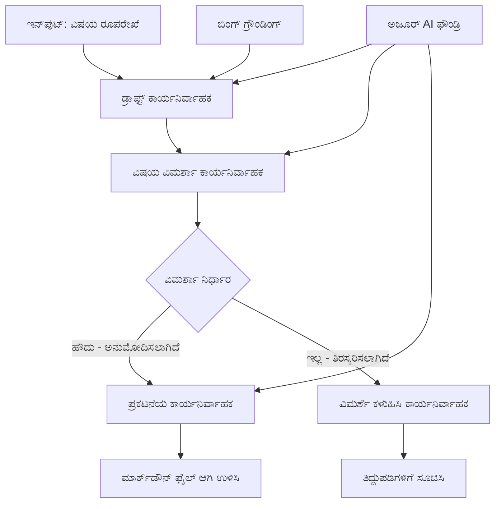

<!--
CO_OP_TRANSLATOR_METADATA:
{
  "original_hash": "8abd335151cee553293b637ee3d80d10",
  "translation_date": "2025-12-03T16:22:22+00:00",
  "source_file": "08-multi-agent/code_samples/workflows-agent-framework/dotNET/04.dotnet-agent-framework-workflow-aifoundry-condition.md",
  "language_code": "kn"
}
-->
# 🔀 Azure AI Foundry (.NET) ಬಳಸಿ ಷರತ್ತು ಆಧಾರಿತ ಏಜೆಂಟ್ ವರ್ಕ್‌ಫ್ಲೋಗಳು

## 📋 ಬುದ್ಧಿವಂತ ನಿರ್ಧಾರ ಆಧಾರಿತ ವರ್ಕ್‌ಫ್ಲೋ ಟ್ಯುಟೋರಿಯಲ್

ಈ ನೋಟುಬುಕ್ **ಷರತ್ತು ಆಧಾರಿತ ವರ್ಕ್‌ಫ್ಲೋ ಮಾದರಿಗಳನ್ನು** Azure AI Foundry ಮತ್ತು Microsoft Agent Framework for .NET ಬಳಸಿ ತೋರಿಸುತ್ತದೆ. AI ವಿಶ್ಲೇಷಣೆ, ವ್ಯವಹಾರ ನಿಯಮಗಳು, ಮತ್ತು ಡೈನಾಮಿಕ್ ಷರತ್ತುಗಳನ್ನು ಆಧರಿಸಿ ಪ್ರಕ್ರಿಯೆಯನ್ನು ಬುದ್ಧಿವಂತವಾಗಿ ಮಾರ್ಗೀಕರಿಸುವ, ನಿರ್ಧಾರ ಚಾಲಿತ ವರ್ಕ್‌ಫ್ಲೋಗಳನ್ನು ನಿರ್ಮಿಸುವುದು ಹೇಗೆ ಎಂಬುದನ್ನು ನೀವು ಕಲಿಯುತ್ತೀರಿ.

## 🎯 ಕಲಿಕೆಯ ಉದ್ದೇಶಗಳು

### 🧠 **ಬುದ್ಧಿವಂತ ನಿರ್ಧಾರ ಆರ್ಕಿಟೆಕ್ಚರ್**
- **ಷರತ್ತು ಲಾಜಿಕ್ ಅನುಷ್ಠಾನ**: ಬಹು ಶಾಖೆಗಳನ್ನು ಹೊಂದಿರುವ ಸಂಕೀರ್ಣ ನಿರ್ಧಾರ ಮರಗಳನ್ನು ನಿರ್ಮಿಸಿ
- **AI-ಚಾಲಿತ ಮಾರ್ಗೀಕರಣ**: ಬುದ್ಧಿವಂತ ಮಾರ್ಗೀಕರಣ ನಿರ್ಧಾರಗಳನ್ನು ಮಾಡಲು Azure AI Foundry ಮಾದರಿಗಳನ್ನು ಬಳಸಿ
- **ಡೈನಾಮಿಕ್ ವರ್ಕ್‌ಫ್ಲೋ ಅಡಾಪ್ಟೇಶನ್**: ರನ್‌ಟೈಮ್ ವಿಶ್ಲೇಷಣೆ ಮತ್ತು ಷರತ್ತುಗಳನ್ನು ಆಧರಿಸಿ ವರ್ಕ್‌ಫ್ಲೋ ವರ್ತನೆಯನ್ನು ಬದಲಾಯಿಸಿ
- **ಎಂಟರ್‌ಪ್ರೈಸ್ ನಿಯಮ ಸಂಯೋಜನೆ**: ವರ್ಕ್‌ಫ್ಲೋಗಳಲ್ಲಿ ವ್ಯವಹಾರ ಲಾಜಿಕ್ ಮತ್ತು ಅನುಕೂಲತೆ ಅಗತ್ಯಗಳನ್ನು ಸೇರಿಸಿ

### 🔀 **ಅಡ್ವಾನ್ಸ್ ಷರತ್ತು ಮಾದರಿಗಳು**
- **ಬಹು-ಮಾಪನ ನಿರ್ಧಾರ ಮಾಡುವುದು**: ಮಾರ್ಗೀಕರಣ ನಿರ್ಧಾರಗಳಿಗೆ ಹಲವಾರು ಅಂಶಗಳನ್ನು ಮೌಲ್ಯಮಾಪನ ಮಾಡಿ
- **ಸಂದರ್ಭ-ಜಾಗೃತ ಪ್ರಕ್ರಿಯೆ**: ಸಂಗ್ರಹಿತ ವರ್ಕ್‌ಫ್ಲೋ ಸಂದರ್ಭ ಮತ್ತು ಇತಿಹಾಸವನ್ನು ಆಧರಿಸಿ ನಿರ್ಧಾರಗಳನ್ನು ಮಾಡಿ
- **ಅಡಾಪ್ಟಿವ್ ವರ್ಕ್‌ಫ್ಲೋ ಬದಲಾವಣೆ**: ರಿಯಲ್-ಟೈಮ್ ಷರತ್ತುಗಳನ್ನು ಆಧರಿಸಿ ಪ್ರಕ್ರಿಯೆ ಮಾರ್ಗಗಳನ್ನು ಡೈನಾಮಿಕ್ ಆಗಿ ಹೊಂದಿಸಿ
- **ನಿಯಮ ಎಂಜಿನ್ ಸಂಯೋಜನೆ**: ವರ್ಕ್‌ಫ್ಲೋಗಳಲ್ಲಿ ಸಂಕೀರ್ಣ ವ್ಯವಹಾರ ನಿಯಮ ಎಂಜಿನ್‌ಗಳನ್ನು ಅನುಷ್ಠಾನಗೊಳಿಸಿ

### 🏢 **ಎಂಟರ್‌ಪ್ರೈಸ್ ಷರತ್ತು ಆಧಾರಿತ ಅಪ್ಲಿಕೇಶನ್‌ಗಳು**
- **ಡಾಕ್ಯುಮೆಂಟ್ ವರ್ಗೀಕರಣ ಮತ್ತು ಮಾರ್ಗೀಕರಣ**: ಡಾಕ್ಯುಮೆಂಟ್‌ಗಳನ್ನು ಸ್ವಯಂಚಾಲಿತವಾಗಿ ವರ್ಗೀಕರಿಸಿ ಮತ್ತು ಸೂಕ್ತ ವರ್ಕ್‌ಫ್ಲೋಗಳಿಗೆ ಮಾರ್ಗೀಕರಿಸಿ
- **ಗ್ರಾಹಕ ಸೇವಾ ತ್ರೈಯಾಜ್**: ಗ್ರಾಹಕ ಪ್ರಶ್ನೆಗಳನ್ನು ವಿಶೇಷ ಹ್ಯಾಂಡ್ಲಿಂಗ್ ತಂಡಗಳಿಗೆ ಬುದ್ಧಿವಂತವಾಗಿ ಮಾರ್ಗೀಕರಿಸಿ
- **ಅನುಕೂಲತೆ ಮತ್ತು ಅಪಾಯ ಪ್ರಕ್ರಿಯೆ**: ಅಪಾಯ ಮೌಲ್ಯಮಾಪನವನ್ನು ಆಧರಿಸಿ ವಿಭಿನ್ನ ಮಾನ್ಯತೆ ಮತ್ತು ವಿಮರ್ಶಾ ಪ್ರಕ್ರಿಯೆಗಳನ್ನು ಅನ್ವಯಿಸಿ
- **ಗುಣಮಟ್ಟದ ಖಾತರಿ ವರ್ಕ್‌ಫ್ಲೋಗಳು**: ಗುಣಮಟ್ಟದ ಮೆಟ್ರಿಕ್‌ಗಳನ್ನು ಆಧರಿಸಿ ವಿಷಯವನ್ನು ಸೂಕ್ತ ವಿಮರ್ಶಾ ಪ್ರಕ್ರಿಯೆಗಳಲ್ಲಿ ಮಾರ್ಗೀಕರಿಸಿ

## ⚙️ ಪೂರ್ವಾಪೇಕ್ಷೆಗಳು ಮತ್ತು ಸೆಟಪ್

### 📦 **ಅಗತ್ಯವಿರುವ NuGet ಪ್ಯಾಕೇಜ್‌ಗಳು**

ಷರತ್ತು ಆಧಾರಿತ ವರ್ಕ್‌ಫ್ಲೋ ಪ್ರಕ್ರಿಯೆಗಾಗಿ ಅಡ್ವಾನ್ಸ್ ಪ್ಯಾಕೇಜ್‌ಗಳು:

```xml
<!-- Core AI Framework -->
<PackageReference Include="Microsoft.Extensions.AI" Version="9.9.0" />

<!-- Azure AI Agents with Persistent State -->
<PackageReference Include="Azure.AI.Agents.Persistent" Version="1.2.0-beta.5" />

<!-- Azure Identity and Utilities -->
<PackageReference Include="Azure.Identity" Version="1.15.0" />
<PackageReference Include="System.Linq.Async" Version="6.0.3" />
<PackageReference Include="DotNetEnv" Version="3.1.1" />

<!-- Local Workflow Framework References -->
<!-- Microsoft.Agents.Workflows.dll - Advanced workflow orchestration -->
<!-- Microsoft.Agents.AI.AzureAI.dll - Azure AI Foundry integration -->
<!-- Microsoft.Agents.AI.dll - Core agent abstractions -->
```

### 🔑 **Azure AI Foundry ಸಂರಚನೆ**

**ಅಗತ್ಯವಿರುವ Azure ಸಂಪತ್ತುಗಳು:**
- ಷರತ್ತು ಪ್ರಕ್ರಿಯೆ ಮಾದರಿಗಳನ್ನು ಹೊಂದಿರುವ Azure AI Foundry ಕಾರ್ಯಾಗಾರ
- ಸೂಕ್ತ ಕಂಪ್ಯೂಟ್ ಕೋಟಾ ಮತ್ತು ಅನುಮತಿಗಳನ್ನು ಹೊಂದಿರುವ Azure ಚಂದಾದಾರಿಕೆ
- ನಿರ್ಧಾರ ಮಾಡುವುದು ಮತ್ತು ವಿಷಯ ವಿಶ್ಲೇಷಣೆಗಾಗಿ ನಿಯೋಜಿತ AI ಮಾದರಿಗಳು
- (ಐಚ್ಛಿಕ) Bing Search API ಸಂಪರ್ಕ ನೆಲೆಯ ಸಾಮರ್ಥ್ಯಕ್ಕಾಗಿ

**ಪರಿಸರ ಸಂರಚನೆ (.env ಫೈಲ್):**
```env
# Azure AI Foundry Configuration
AZURE_AI_PROJECT_ENDPOINT=https://your-project.cognitiveservices.azure.com/
BING_CONNECTION_ID=your-bing-connection-id
```

**ಪ್ರಮಾಣೀಕರಣ ಸೆಟಪ್:**
```csharp
// Azure CLI or Managed Identity authentication
using Azure.Identity;
var credential = new AzureCliCredential();

// Load environment configuration
DotNetEnv.Env.Load("../../../.env");
```

### 🏗️ **ಷರತ್ತು ಆಧಾರಿತ ವರ್ಕ್‌ಫ್ಲೋ ಆರ್ಕಿಟೆಕ್ಚರ್**


**ಮುಖ್ಯ ಘಟಕಗಳು:**
- **ಡ್ರಾಫ್ಟ್ ಎಕ್ಸಿಕ್ಯೂಟರ್**: ರೇಖಾಚಿತ್ರಗಳಿಂದ ಪ್ರಾರಂಭಿಕ ವಿಷಯ ಡ್ರಾಫ್ಟ್‌ಗಳನ್ನು ರಚಿಸುವ AI ಏಜೆಂಟ್
- **ಕಂಟೆಂಟ್ ರಿವ್ಯೂ ಎಕ್ಸಿಕ್ಯೂಟರ್**: ಡ್ರಾಫ್ಟ್ ಗುಣಮಟ್ಟ ಮತ್ತು ಅನುಕೂಲತೆ ಮೌಲ್ಯಮಾಪನ ಮಾಡುವ AI ಏಜೆಂಟ್
- **ಷರತ್ತು ಮಾರ್ಗೀಕರಣ**: ವಿಮರ್ಶಾ ಫಲಿತಾಂಶಗಳನ್ನು ಆಧರಿಸಿ ನಿರ್ಧಾರ ಲಾಜಿಕ್ ಮಾರ್ಗೀಕರಿಸುತ್ತದೆ
- **ಪ್ರಕಟನೆ/ವಿಮರ್ಶಾ ಮಾರ್ಗಗಳು**: ಅನುಮೋದಿತ ಮತ್ತು ತಿರಸ್ಕೃತ ವಿಷಯಕ್ಕಾಗಿ ಪ್ರತ್ಯೇಕ ಪ್ರಕ್ರಿಯೆ ಮಾರ್ಗಗಳು
- **ಸ್ಥಿತಿ ನಿರ್ವಹಣೆ**: ವರ್ಕ್‌ಫ್ಲೋದಲ್ಲಿ ವಿಷಯ ಮತ್ತು ವಿಮರ್ಶಾ ಸಂದರ್ಭವನ್ನು ನಿರ್ವಹಿಸುತ್ತದೆ

## 🎨 **ಷರತ್ತು ಆಧಾರಿತ ವರ್ಕ್‌ಫ್ಲೋ ವಿನ್ಯಾಸ ಮಾದರಿಗಳು**

### 📋 **ಗುಣಮಟ್ಟದ ಗೇಟ್‌ಗಳೊಂದಿಗೆ ವಿಷಯ ಉತ್ಪಾದನೆ**
```
Outline → Draft Creation → Quality Review → {Approve: Publish | Reject: Revise}
```

### 🎯 **ಅಪಾಯ ಆಧಾರಿತ ಡಾಕ್ಯುಮೆಂಟ್ ಪ್ರಕ್ರಿಯೆ**
```
Document → Risk Assessment → {Low: Standard | High: Enhanced Review}
```

### 🔍 **ಬುದ್ಧಿವಂತ ಗ್ರಾಹಕ ಸೇವಾ ಮಾರ್ಗೀಕರಣ**
```
Customer Query → Analysis → {Simple: FAQ Bot | Complex: Human Agent}
```

### 💼 **ಅನುಕೂಲತೆ-ಚಾಲಿತ ವರ್ಕ್‌ಫ್ಲೋಗಳು**
```
Content → Compliance Check → {Pass: Publish | Fail: Legal Review}
```

## 🏢 **ಎಂಟರ್‌ಪ್ರೈಸ್ ಷರತ್ತು ಆಧಾರಿತ ಪ್ರಯೋಜನಗಳು**

### 🎯 **ಬುದ್ಧಿವಂತ ಸ್ವಯಂಚಾಲನೆ**
- **ಸ್ಮಾರ್ಟ್ ನಿರ್ಧಾರ ಮಾಡುವುದು**: ವಿಷಯ ವಿಶ್ಲೇಷಣೆ ಮತ್ತು ಸಂದರ್ಭವನ್ನು ಆಧರಿಸಿ AI-ಚಾಲಿತ ಮಾರ್ಗೀಕರಣ ನಿರ್ಧಾರಗಳು
- **ಅಡಾಪ್ಟಿವ್ ಪ್ರಕ್ರಿಯೆ**: ಬದಲಾಯಿಸುತ್ತಿರುವ ಷರತ್ತುಗಳನ್ನು ಆಧರಿಸಿ ಸ್ವಯಂಚಾಲಿತವಾಗಿ ವರ್ಕ್‌ಫ್ಲೋಗಳನ್ನು ಹೊಂದಿಸಿ
- **ವ್ಯವಹಾರ ನಿಯಮ ಜಾರಿಗೊಳಿಸುವುದು**: ಸಂಕೀರ್ಣ ವ್ಯವಹಾರ ಲಾಜಿಕ್ ಮತ್ತು ನೀತಿಗಳನ್ನು ಸ್ವಯಂಚಾಲಿತವಾಗಿ ಅನ್ವಯಿಸಿ
- **ಸಂದರ್ಭ-ಜಾಗೃತ ಮಾರ್ಗೀಕರಣ**: ಸಂಪೂರ್ಣ ವರ್ಕ್‌ಫ್ಲೋ ಇತಿಹಾಸ ಮತ್ತು ಸಂಗ್ರಹಿತ ಸಂದರ್ಭವನ್ನು ಆಧರಿಸಿ ನಿರ್ಧಾರಗಳು

### 📈 **ಆಪರೇಷನಲ್ ಎಕ್ಸಲೆನ್ಸ್**
- **ಆಪ್ಟಿಮೈಜ್ಡ್ ಸಂಪತ್ತು ಹಂಚಿಕೆ**: ಕೆಲಸವನ್ನು ಅತ್ಯುತ್ತಮ ತಜ್ಞರು ಮತ್ತು ಪ್ರಕ್ರಿಯೆಗಳಿಗೆ ಮಾರ್ಗೀಕರಿಸಿ
- **ಕಡಿಮೆ ಮಾನವ ಹಸ್ತಕ್ಷೇಪ**: ಸ್ವಯಂಚಾಲಿತ ನಿರ್ಧಾರ ಮಾಡುವುದು ಮಾನವ ಮಾರ್ಗೀಕರಣದ ಅಗತ್ಯವನ್ನು ಕಡಿಮೆ ಮಾಡುತ್ತದೆ
- **ವೇಗದ ಪರಿಹಾರ ಸಮಯಗಳು**: ಸೂಕ್ತ ತಜ್ಞತೆ ಮತ್ತು ಪ್ರಕ್ರಿಯೆ ಸಾಮರ್ಥ್ಯಗಳಿಗೆ ನೇರ ಮಾರ್ಗೀಕರಣ
- **ಸಮತೋಲನ ಅನ್ವಯಣೆ**: ವ್ಯವಹಾರ ನಿಯಮಗಳು ಮತ್ತು ನಿರ್ಧಾರ ಮಾನದಂಡಗಳ ಏಕರೂಪ ಅನ್ವಯಣೆ

### 🛡️ **ಅಪಾಯ ನಿರ್ವಹಣೆ ಮತ್ತು ಅನುಕೂಲತೆ**
- **ಸ್ವಯಂಚಾಲಿತ ಅಪಾಯ ಮೌಲ್ಯಮಾಪನ**: ವಿಷಯ ಮತ್ತು ಪರಿಸ್ಥಿತಿ ಅಪಾಯ ಮಟ್ಟಗಳ AI-ಚಾಲಿತ ಮೌಲ್ಯಮಾಪನ
- **ಅನುಕೂಲತೆ ಜಾರಿಗೊಳಿಸುವುದು**: ಅಗತ್ಯವಿರುವ ನಿಯಂತ್ರಣ ಪ್ರಕ್ರಿಯೆಗಳಲ್ಲಿ ಸ್ವಯಂಚಾಲಿತ ಮಾರ್ಗೀಕರಣ
- **ಭದ್ರತಾ ಪ್ರೋಟೋಕಾಲ್ ಅನ್ವಯಣೆ**: ಅಪಾಯ ಮೌಲ್ಯಮಾಪನವನ್ನು ಆಧರಿಸಿ ಹೆಚ್ಚಿದ ಭದ್ರತಾ ಕ್ರಮಗಳು
- **ಆಡಿಟ್ ಟ್ರೈಲ್ ನಿರ್ವಹಣೆ**: ಮಾರ್ಗೀಕರಣ ನಿರ್ಧಾರಗಳು ಮತ್ತು ಕಾರಣಗಳ ಸಂಪೂರ್ಣ ದಾಖಲೆ

### 📊 **ವಿಶ್ಲೇಷಣೆ ಮತ್ತು ನಿರಂತರ ಸುಧಾರಣೆ**
- **ನಿರ್ಧಾರ ವಿಶ್ಲೇಷಣೆ**: ಮಾರ್ಗೀಕರಣ ನಿರ್ಧಾರಗಳ ಪರಿಣಾಮಕಾರಿತ್ವ ಮತ್ತು ಶುದ್ಧತೆಯನ್ನು ಟ್ರ್ಯಾಕ್ ಮಾಡಿ
- **ಮಾದರಿ ಗುರುತಿಸುವುದು**: ಸಮಯದೊಂದಿಗೆ ಮಾರ್ಗೀಕರಣ ನಿರ್ಧಾರಗಳಲ್ಲಿ ಪ್ರವೃತ್ತಿಗಳು ಮತ್ತು ಮಾದರಿಗಳನ್ನು ಗುರುತಿಸಿ
- **ಪ್ರದರ್ಶನ ಆಪ್ಟಿಮೈಜೇಶನ್**: ನಿರ್ಧಾರ ಮಾನದಂಡಗಳು ಮತ್ತು ಮಾರ್ಗೀಕರಣ ದಕ್ಷತೆಯ ನಿರಂತರ ಸುಧಾರಣೆ
- **ವ್ಯವಹಾರ ಬುದ್ಧಿವಂತಿಕೆ**: ವಿಷಯ ಲಕ್ಷಣಗಳು ಮತ್ತು ಪ್ರಕ್ರಿಯೆ ಅಗತ್ಯಗಳ ಬಗ್ಗೆ ಒಳನೋಟ

### 🔧 **ತಾಂತ್ರಿಕ ಶ್ರೇಷ್ಟತೆ**
- **ಸ್ಥಿರ ಸ್ಥಿತಿ ನಿರ್ವಹಣೆ**: ವರ್ಕ್‌ಫ್ಲೋ ಕಾರ್ಯಾಚರಣೆಯಾದರಲ್ಲಿಯೇ ಸಂಕೀರ್ಣ ಸ್ಥಿತಿಯನ್ನು ನಿರ್ವಹಿಸಿ
- **ಸ್ಕೇಲಬಲ್ ಆರ್ಕಿಟೆಕ್ಚರ್**: ಹೆಚ್ಚಿನ ಪ್ರಮಾಣದ ಷರತ್ತು ಪ್ರಕ್ರಿಯೆ ಅಗತ್ಯಗಳನ್ನು ನಿರ್ವಹಿಸಿ
- **ಸಂಯೋಜನೆ ಸಾಮರ್ಥ್ಯಗಳು**: ಅಸ್ತಿತ್ವದಲ್ಲಿರುವ ವ್ಯವಹಾರ ವ್ಯವಸ್ಥೆ ಮತ್ತು ಪ್ರಕ್ರಿಯೆಗಳಿಗೆ ಸುಲಭ ಸಂಯೋಜನೆ
- **ಮೋನಿಟರಿಂಗ್ ಮತ್ತು ಅವಲೋಕನ**: ವರ್ಕ್‌ಫ್ಲೋ ಕಾರ್ಯಕ್ಷಮತೆ ಮತ್ತು ನಿರ್ಧಾರಗಳ ಸಮಗ್ರ ಟ್ರ್ಯಾಕಿಂಗ್

.NET ಬಳಸಿ ಬುದ್ಧಿವಂತ, ನಿರ್ಧಾರ-ಚಾಲಿತ ಎಂಟರ್‌ಪ್ರೈಸ್ ವರ್ಕ್‌ಫ್ಲೋಗಳನ್ನು ನಿರ್ಮಿಸೋಣ! 🚀

## 💻 ಕೋಡ್ ಚಲಾಯಿಸುವುದು

ಪೂರ್ಣ ಅನುಷ್ಠಾನವನ್ನು `04.dotnet-agent-framework-workflow-aifoundry-condition.cs` ನಲ್ಲಿ ಲಭ್ಯವಿದೆ. ಇದು **ಗುಣಮಟ್ಟದ ಗೇಟ್‌ಗಳೊಂದಿಗೆ ವಿಷಯ ಉತ್ಪಾದನೆ ವರ್ಕ್‌ಫ್ಲೋ** ಅನ್ನು ತೋರಿಸುತ್ತದೆ:

### 🏗️ **ವರ್ಕ್‌ಫ್ಲೋ ಆರ್ಕಿಟೆಕ್ಚರ್**

```
Content Outline → Draft Creation → Quality Review → Conditional Routing:
                                                      ├─ Approved (>200 words) → Publish
                                                      └─ Rejected (<200 words) → Review Notification
```

**ವರ್ಕ್‌ಫ್ಲೋದಲ್ಲಿನ ಏಜೆಂಟ್‌ಗಳು:**
1. **ಎವೆಂಜಲಿಸ್ಟ್ ಏಜೆಂಟ್**: Bing ನೆಲೆಯನ್ನು ಹೊಂದಿರುವ ರೇಖಾಚಿತ್ರಗಳಿಂದ ಟ್ಯುಟೋರಿಯಲ್ ಡ್ರಾಫ್ಟ್‌ಗಳನ್ನು ರಚಿಸುತ್ತದೆ
2. **ಕಂಟೆಂಟ್ ರಿವ್ಯೂಯರ್ ಏಜೆಂಟ್**: ಡ್ರಾಫ್ಟ್ ಗುಣಮಟ್ಟವನ್ನು (ಪದಗಳ ಸಂಖ್ಯೆ, ಪೂರ್ಣತೆ) ಮೌಲ್ಯಮಾಪನ ಮಾಡುತ್ತದೆ
3. **ಪಬ್ಲಿಷರ್ ಏಜೆಂಟ್**: ಅನುಮೋದಿತ ವಿಷಯವನ್ನು ಟೈಮ್‌ಸ್ಟ್ಯಾಂಪ್ ಮಾಡಿದ Markdown ಫೈಲ್‌ಗಳಾಗಿ ಉಳಿಸುತ್ತದೆ

**ಕಸ್ಟಮ್ ಎಕ್ಸಿಕ್ಯೂಟರ್‌ಗಳು:**
1. **DraftExecutor**: ಡ್ರಾಫ್ಟ್ ರಚನೆಯನ್ನು ಸಂಯೋಜಿಸುತ್ತದೆ
2. **ContentReviewExecutor**: ಗುಣಮಟ್ಟದ ಮೌಲ್ಯಮಾಪನವನ್ನು ನಡೆಸುತ್ತದೆ
3. **PublishExecutor**: ಅನುಮೋದಿತ ವಿಷಯದ ಪ್ರಕಟಣೆಯನ್ನು ನಿರ್ವಹಿಸುತ್ತದೆ
4. **SendReviewExecutor**: ತಿರಸ್ಕೃತ ವಿಷಯದ ಅಧಿಸೂಚನೆಗಳನ್ನು ನಿರ್ವಹಿಸುತ್ತದೆ

### 🚀 ಉದಾಹರಣೆಯನ್ನು ಚಲಾಯಿಸುವುದು

**ಪೂರ್ವಾಪೇಕ್ಷೆಗಳು:**
- ಸಂರಚಿತ Azure AI Foundry ಕಾರ್ಯಾಗಾರ
- Azure CLI ಪ್ರಮಾಣೀಕರಣ (`az login`)
- (ಐಚ್ಛಿಕ) Bing Search ಸಂಪರ್ಕ ನೆಲೆಗೆ

```bash
# ಸ್ಕ್ರಿಪ್ಟ್ ಅನ್ನು ಕಾರ್ಯನಿರ್ವಹಣೀಯವಾಗಿಸಿ (ಯುನಿಕ್ಸ್/ಲಿನಕ್ಸ್/ಮ್ಯಾಕ್‌ಒಎಸ್)
chmod +x 04.dotnet-agent-framework-workflow-aifoundry-condition.cs

# ಶರತ್ತುಬದ್ಧ ಕಾರ್ಯಪ್ರವಾಹವನ್ನು ಚಲಾಯಿಸಿ
./04.dotnet-agent-framework-workflow-aifoundry-condition.cs
```

Windows ನಲ್ಲಿ:
```powershell
dotnet run 04.dotnet-agent-framework-workflow-aifoundry-condition.cs
```

### 📝 ನಿರೀಕ್ಷಿತ ಔಟ್‌ಪುಟ್

ವರ್ಕ್‌ಫ್ಲೋ ಈ ಕೆಳಗಿನವುಗಳನ್ನು ಮಾಡುತ್ತದೆ:
1. **ಏಜೆಂಟ್‌ಗಳನ್ನು ರಚಿಸಿ**: ಮೂರು ವಿಶೇಷ Azure AI Foundry ಏಜೆಂಟ್‌ಗಳನ್ನು ಪ್ರಾರಂಭಿಸಿ
2. **ಡ್ರಾಫ್ಟ್ ರಚಿಸಿ**: ಎವೆಂಜಲಿಸ್ಟ್ ಏಜೆಂಟ್ ರೇಖಾಚಿತ್ರದಿಂದ ಟ್ಯುಟೋರಿಯಲ್ ಡ್ರಾಫ್ಟ್ ಅನ್ನು ರಚಿಸುತ್ತದೆ
3. **ವಿಷಯವನ್ನು ವಿಮರ್ಶಿಸಿ**: ಕಂಟೆಂಟ್ ರಿವ್ಯೂಯರ್ ಡ್ರಾಫ್ಟ್ ಗುಣಮಟ್ಟವನ್ನು ಮೌಲ್ಯಮಾಪನ ಮಾಡುತ್ತದೆ
4. **ಷರತ್ತು ಮಾರ್ಗೀಕರಣ**:
   - **ಅನುಮೋದಿತ (>200 ಪದಗಳು)**: ಪಬ್ಲಿಷ್ ಎಕ್ಸಿಕ್ಯೂಟರ್ Markdown ಫೈಲ್‌ಗಳಾಗಿ ಉಳಿಸುತ್ತದೆ
   - **ತಿರಸ್ಕೃತ (<200 ಪದಗಳು)**: ವಿಮರ್ಶಾ ಅಧಿಸೂಚನೆ ಕಳುಹಿಸಿ
5. **ಫಲಿತಾಂಶಗಳನ್ನು ತೋರಿಸಿ**: ಅಂತಿಮ ವರ್ಕ್‌ಫ್ಲೋ ಫಲಿತಾಂಶವನ್ನು ತೋರಿಸಿ

### 🔧 ಕಸ್ಟಮೈಸೇಶನ್ ಆಯ್ಕೆಗಳು

**ವಿಮರ್ಶಾ ಮಾನದಂಡಗಳನ್ನು ಬದಲಾಯಿಸಿ:**
```csharp
const string ContentReviewerInstructions = @"
You are a content reviewer...
1. Check if content is more than 500 words (instead of 200)
2. Verify technical accuracy
3. Ensure proper formatting
...";
```

**ಹೆಚ್ಚು ಷರತ್ತು ಮಾರ್ಗಗಳನ್ನು ಸೇರಿಸಿ:**
```csharp
var workflow = new WorkflowBuilder(draftExecutor)
    .AddEdge(draftExecutor, contentReviewerExecutor)
    .AddEdge(contentReviewerExecutor, publishExecutor, condition: GetCondition("Excellent"))
    .AddEdge(contentReviewerExecutor, editExecutor, condition: GetCondition("Good"))
    .AddEdge(contentReviewerExecutor, sendReviewerExecutor, condition: GetCondition("Poor"))
    .Build();
```

**ವಿಷಯ ಅಗತ್ಯಗಳನ್ನು ಬದಲಾಯಿಸಿ:**
```csharp
string OUTLINE_Content = @"
# Your Custom Topic
## Section 1
https://your-reference-url
## Section 2
...
";
```

### 🎯 ವಾಸ್ತವ ಜಗತ್ತಿನ ಅಪ್ಲಿಕೇಶನ್‌ಗಳು

ಈ ಷರತ್ತು ಆಧಾರಿತ ವರ್ಕ್‌ಫ್ಲೋ ಮಾದರಿ ಈ ಕೆಳಗಿನವುಗಳಿಗೆ ಸೂಕ್ತವಾಗಿದೆ:
- **ಕಂಟೆಂಟ್ ಮ್ಯಾನೇಜ್‌ಮೆಂಟ್ ಸಿಸ್ಟಮ್‌ಗಳು**: ಗುಣಮಟ್ಟದ ಗೇಟ್‌ಗಳೊಂದಿಗೆ ಸ್ವಯಂಚಾಲಿತ ಸಂಪಾದನಾ ವರ್ಕ್‌ಫ್ಲೋಗಳು
- **ಡಾಕ್ಯುಮೆಂಟ್ ಪ್ರಕ್ರಿಯೆ**: ವರ್ಗೀಕರಣ ಮತ್ತು ಅನುಕೂಲತೆಯನ್ನು ಆಧರಿಸಿ ಡಾಕ್ಯುಮೆಂಟ್‌ಗಳನ್ನು ಮಾರ್ಗೀಕರಿಸಿ
- **ಗ್ರಾಹಕ ಬೆಂಬಲ**: ಸಂಕೀರ್ಣತೆ ಮತ್ತು ತುರ್ತುತೆಯನ್ನು ಆಧರಿಸಿ ಬುದ್ಧಿವಂತ ಟಿಕೆಟ್ ಮಾರ್ಗೀಕರಣ
- **ಕಾನೂನು ವಿಮರ್ಶೆ**: ಅಪಾಯ ಮೌಲ್ಯಮಾಪನ ಮತ್ತು ಮೌಲ್ಯವನ್ನು ಆಧರಿಸಿ ಒಪ್ಪಂದಗಳನ್ನು ಮಾರ್ಗೀಕರಿಸಿ
- **HR ಪ್ರಕ್ರಿಯೆಗಳು**: ಸೂಕ್ತ ಸ್ಕ್ರೀನಿಂಗ್ ವರ್ಕ್‌ಫ್ಲೋಗಳ ಮೂಲಕ ಅರ್ಜಿಗಳನ್ನು ಮಾರ್ಗೀಕರಿಸಿ

### 🔍 ಷರತ್ತು ಲಾಜಿಕ್ ಅನ್ನು ಅರ್ಥಮಾಡಿಕೊಳ್ಳುವುದು

**Condition Function:**
```csharp
public Func<object?, bool> GetCondition(string expectedResult) =>
    reviewResult => reviewResult is ReviewResult review && review.Result == expectedResult;
```

ಈ ಫಂಕ್ಷನ್ ಒಂದು ಪ್ರಿಡಿಕೇಟ್ ಅನ್ನು ರಚಿಸುತ್ತದೆ:
1. ಫಲಿತಾಂಶವು `ReviewResult` ಪ್ರಕಾರದದ್ದೇ ಎಂದು ಪರಿಶೀಲಿಸುತ್ತದೆ
2. `Result` ಆಸ್ತಿ ನಿರೀಕ್ಷಿತ ಮೌಲ್ಯಕ್ಕೆ ಹೋಲಿಸುತ್ತದೆ
3. ಮಾರ್ಗೀಕರಣವನ್ನು ನಿರ್ಧರಿಸಲು true/false ಅನ್ನು ಹಿಂತಿರುಗಿಸುತ್ತದೆ

**ಷರತ್ತುಗಳೊಂದಿಗೆ ವರ್ಕ್‌ಫ್ಲೋ ಎಡ್ಜ್‌ಗಳು:**
```csharp
.AddEdge(contentReviewerExecutor, publishExecutor, condition: GetCondition("Yes"))
.AddEdge(contentReviewerExecutor, sendReviewerExecutor, condition: GetCondition("No"))
```

### 📊 ಅಡ್ವಾನ್ಸ್ ವೈಶಿಷ್ಟ್ಯಗಳು

**JSON Schema Validation:**
ವರ್ಕ್‌ಫ್ಲೋ ರಚಿತ ಪ್ರತಿಕ್ರಿಯೆಗಳನ್ನು ಖಚಿತಪಡಿಸಲು JSON schemas ಅನ್ನು ಬಳಸುತ್ತದೆ:

```csharp
// Define response structure
public class ReviewResult
{
    [JsonPropertyName("review_result")]
    public string Result { get; set; } = string.Empty;
    
    [JsonPropertyName("reason")]
    public string Reason { get; set; } = string.Empty;
    
    [JsonPropertyName("draft_content")]
    public string DraftContent { get; set; } = string.Empty;
}

// Apply to agent
ResponseFormat = ChatResponseFormat.ForJsonSchema(
    AIJsonUtilities.CreateJsonSchema(typeof(ReviewResult)), 
    "ReviewResult", 
    "Review Result From DraftContent"
)
```

**Bing Grounding Integration:**
ಎವೆಂಜಲಿಸ್ಟ್ ಏಜೆಂಟ್ Bing ನೆಲೆಯನ್ನು ಬಳಸಿಕೊಂಡು ನಿಜ-ಸಮಯ ಮಾಹಿತಿಯನ್ನು ಪ್ರವೇಶಿಸುತ್ತದೆ:

```csharp
var bingGroundingConfig = new BingGroundingSearchConfiguration(bing_conn_id);
BingGroundingToolDefinition bingGroundingTool = new(
    new BingGroundingSearchToolParameters([bingGroundingConfig])
);
```

ಇದು ಏಜೆಂಟ್‌ಗೆ ರೇಖಾಚಿತ್ರದಲ್ಲಿನ URL‌ಗಳನ್ನು ಅನುಸರಿಸಲು ಮತ್ತು ಪ್ರಸ್ತುತ ಮಾಹಿತಿಯನ್ನು ಹೊರತೆಗೆದುಕೊಳ್ಳಲು ಸಾಧ್ಯವಾಗುತ್ತದೆ.

### 🛡️ ದೋಷ ನಿರ್ವಹಣೆ

ವರ್ಕ್‌ಫ್ಲೋ ತಿರಸ್ಕೃತ ವಿಷಯಕ್ಕಾಗಿ ಬಲವಾದ ದೋಷ ನಿರ್ವಹಣೆಯನ್ನು ಒಳಗೊಂಡಿದೆ:
- ವಿಮರ್ಶಾ ವೈಫಲ್ಯಗಳು ಪರ್ಯಾಯ ಮಾರ್ಗವನ್ನು ಪ್ರಾರಂಭಿಸುತ್ತವೆ
- ತಿರಸ್ಕಾರ ಕಾರಣಗಳನ್ನು ಸ್ಪಷ್ಟವಾಗಿ ನೀಡುವ ಅಧಿಸೂಚನೆಗಳು
- ಪರಿಷ್ಕರಣೆಗಾಗಿ ವಿಷಯವನ್ನು ಸಂರಕ್ಷಿಸಲಾಗುತ್ತದೆ

### 🔄 ವರ್ಕ್‌ಫ್ಲೋ ವಿಸ್ತರಿಸುವುದು

**ಪರಿಷ್ಕರಣೆ ಲೂಪ್ ಸೇರಿಸಿ:**
ಸ್ವಯಂಚಾಲಿತವಾಗಿ ವಿಷಯವನ್ನು ಪುನಃ ಡ್ರಾಫ್ಟ್ ಮಾಡುವ ಪ್ರತಿಕ್ರಿಯಾ ಲೂಪ್ ಅನ್ನು ರಚಿಸಿ:

```csharp
.AddEdge(contentReviewerExecutor, publishExecutor, condition: GetCondition("Yes"))
.AddEdge(contentReviewerExecutor, draftExecutor, condition: GetCondition("No")) // Loop back
```

**ಬಹು-ಮಟ್ಟದ ವಿಮರ್ಶೆಯನ್ನು ಅನುಷ್ಠಾನಗೊಳಿಸಿ:**
ವಿವಿಧ ಮಾನದಂಡಗಳೊಂದಿಗೆ ಹಲವಾರು ವಿಮರ್ಶಾ ಹಂತಗಳನ್ನು ಸೇರಿಸಿ:

```csharp
.AddEdge(draftExecutor, technicalReviewer)
.AddEdge(technicalReviewer, editorialReviewer, condition: GetCondition("TechPass"))
.AddEdge(editorialReviewer, publishExecutor, condition: GetCondition("EditPass"))
```

ಈ ಷರತ್ತು ಆಧಾರಿತ ವರ್ಕ್‌ಫ್ಲೋ ಮಾದರಿ ಬುದ್ಧಿವಂತ, ಎಂಟರ್‌ಪ್ರೈಸ್ ಸ್ವಯಂಚಾಲಿತ ವ್ಯವಸ್ಥೆಗಳನ್ನು ನಿರ್ಮಿಸಲು ಆಧಾರವನ್ನು ಒದಗಿಸುತ್ತದೆ! 🚀

---

<!-- CO-OP TRANSLATOR DISCLAIMER START -->
**ಅಸಮೀಕ್ಷೆ**:  
ಈ ದಾಖಲೆ AI ಅನುವಾದ ಸೇವೆ [Co-op Translator](https://github.com/Azure/co-op-translator) ಬಳಸಿ ಅನುವಾದಿಸಲಾಗಿದೆ. ನಾವು ನಿಖರತೆಯನ್ನು ಸಾಧಿಸಲು ಪ್ರಯತ್ನಿಸುತ್ತಿದ್ದರೂ, ದಯವಿಟ್ಟು ಗಮನಿಸಿ, ಸ್ವಯಂಚಾಲಿತ ಅನುವಾದಗಳಲ್ಲಿ ದೋಷಗಳು ಅಥವಾ ಅಸಮರ್ಪಕತೆಗಳು ಇರಬಹುದು. ಮೂಲ ಭಾಷೆಯಲ್ಲಿರುವ ಮೂಲ ದಾಖಲೆ ಪ್ರಾಮಾಣಿಕ ಮೂಲವೆಂದು ಪರಿಗಣಿಸಬೇಕು. ಪ್ರಮುಖ ಮಾಹಿತಿಗಾಗಿ, ವೃತ್ತಿಪರ ಮಾನವ ಅನುವಾದವನ್ನು ಶಿಫಾರಸು ಮಾಡಲಾಗುತ್ತದೆ. ಈ ಅನುವಾದದ ಬಳಕೆಯಿಂದ ಉಂಟಾಗುವ ಯಾವುದೇ ತಪ್ಪುಅರ್ಥಗಳು ಅಥವಾ ತಪ್ಪುಅರ್ಥೈಸುವಿಕೆಗೆ ನಾವು ಹೊಣೆಗಾರರಲ್ಲ.
<!-- CO-OP TRANSLATOR DISCLAIMER END -->