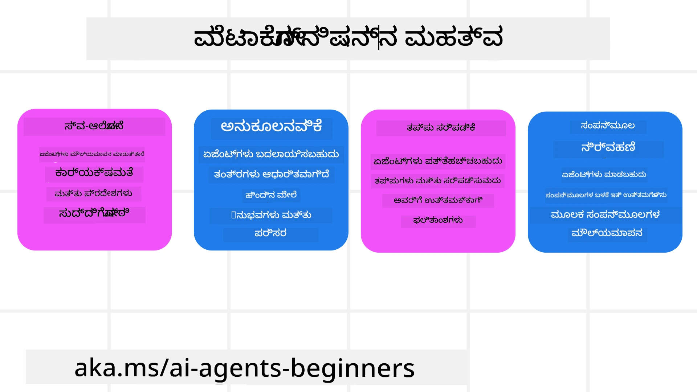
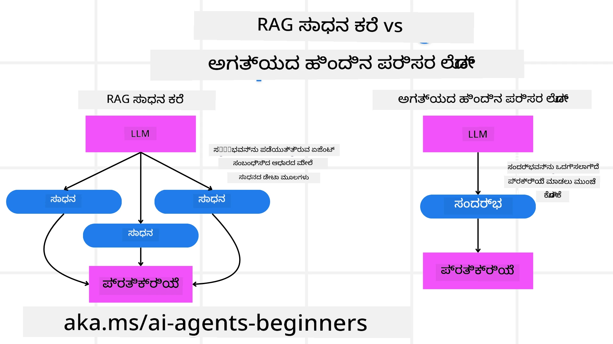

<!--
CO_OP_TRANSLATOR_METADATA:
{
  "original_hash": "5f0deef171fc3a68d5d3d770a8bfb03d",
  "translation_date": "2025-12-03T15:45:57+00:00",
  "source_file": "09-metacognition/README.md",
  "language_code": "kn"
}
-->
[](https://youtu.be/His9R6gw6Ec?si=3_RMb8VprNvdLRhX)

> _(ಮೇಲಿನ ಚಿತ್ರವನ್ನು ಕ್ಲಿಕ್ ಮಾಡಿ ಈ ಪಾಠದ ವೀಡಿಯೊವನ್ನು ವೀಕ್ಷಿಸಿ)_
# AI ಏಜೆಂಟ್‌ಗಳಲ್ಲಿ ಮೆಟಾಕಾಗ್ನಿಷನ್

## ಪರಿಚಯ

AI ಏಜೆಂಟ್‌ಗಳಲ್ಲಿ ಮೆಟಾಕಾಗ್ನಿಷನ್ ಕುರಿತು ಪಾಠಕ್ಕೆ ಸ್ವಾಗತ! ಈ ಅಧ್ಯಾಯವು ಪ್ರಾರಂಭಿಕರಿಗಾಗಿ ವಿನ್ಯಾಸಗೊಳಿಸಲಾಗಿದೆ, AI ಏಜೆಂಟ್‌ಗಳು ತಮ್ಮದೇ ಆದ ಚಿಂತನೆ ಪ್ರಕ್ರಿಯೆಗಳ ಬಗ್ಗೆ ಯೋಚಿಸಲು ಹೇಗೆ ಸಾಧ್ಯವಿದೆ ಎಂಬುದರ ಬಗ್ಗೆ ಕುತೂಹಲವಿರುವವರಿಗೆ. ಈ ಪಾಠದ ಅಂತ್ಯದ ವೇಳೆಗೆ, ನೀವು ಪ್ರಮುಖ ತತ್ವಗಳನ್ನು ಅರ್ಥಮಾಡಿಕೊಳ್ಳುತ್ತೀರಿ ಮತ್ತು AI ಏಜೆಂಟ್ ವಿನ್ಯಾಸದಲ್ಲಿ ಮೆಟಾಕಾಗ್ನಿಷನ್ ಅನ್ನು ಅನ್ವಯಿಸಲು ಪ್ರಾಯೋಗಿಕ ಉದಾಹರಣೆಗಳನ್ನು ಹೊಂದಿರುತ್ತೀರಿ.

## ಕಲಿಕೆಯ ಗುರಿಗಳು

ಈ ಪಾಠವನ್ನು ಪೂರ್ಣಗೊಳಿಸಿದ ನಂತರ, ನೀವು:

1. ಏಜೆಂಟ್ ವ್ಯಾಖ್ಯಾನಗಳಲ್ಲಿ ತಾರ್ಕಿಕ ಲೂಪ್ಗಳ ಪರಿಣಾಮಗಳನ್ನು ಅರ್ಥಮಾಡಿಕೊಳ್ಳಲು.
2. ಸ್ವಯಂ-ತಿದ್ದುಪಡಿ ಮಾಡಬಹುದಾದ ಏಜೆಂಟ್‌ಗಳಿಗೆ ಯೋಜನೆ ಮತ್ತು ಮೌಲ್ಯಮಾಪನ ತಂತ್ರಗಳನ್ನು ಬಳಸಲು.
3. ಕಾರ್ಯಗಳನ್ನು ಸಾಧಿಸಲು ಕೋಡ್ ಅನ್ನು ಹೇರಳವಾಗಿ ಬಳಸುವ ನಿಮ್ಮದೇ ಆದ ಏಜೆಂಟ್‌ಗಳನ್ನು ರಚಿಸಲು.

## ಮೆಟಾಕಾಗ್ನಿಷನ್ ಪರಿಚಯ

ಮೆಟಾಕಾಗ್ನಿಷನ್ ಎಂದರೆ ಒಬ್ಬರದೇ ಆದ ಚಿಂತನೆಗಳ ಬಗ್ಗೆ ಯೋಚಿಸುವ ಉನ್ನತ-ಆದೇಶದ ಜ್ಞಾನ ಪ್ರಕ್ರಿಯೆ. AI ಏಜೆಂಟ್‌ಗಳಿಗೆ, ಇದು ಸ್ವಯಂ-ಜಾಗೃತತೆ ಮತ್ತು ಹಳೆಯ ಅನುಭವಗಳ ಆಧಾರದ ಮೇಲೆ ತಮ್ಮ ಕ್ರಿಯೆಗಳನ್ನು ಮೌಲ್ಯಮಾಪನ ಮತ್ತು ಹೊಂದಿಸಲು ಸಾಧ್ಯವಾಗುತ್ತದೆ. ಮೆಟಾಕಾಗ್ನಿಷನ್, ಅಥವಾ "ಯೋಚನೆಯ ಬಗ್ಗೆ ಯೋಚನೆ," ಏಜೆಂಟಿಕ್ AI ವ್ಯವಸ್ಥೆಗಳ ಅಭಿವೃದ್ಧಿಯಲ್ಲಿ ಪ್ರಮುಖ ತತ್ವವಾಗಿದೆ. ಇದು AI ವ್ಯವಸ್ಥೆಗಳು ತಮ್ಮದೇ ಆದ ಆಂತರಿಕ ಪ್ರಕ್ರಿಯೆಗಳ ಬಗ್ಗೆ ಜಾಗೃತವಾಗಿರಲು ಮತ್ತು ತಮ್ಮ ವರ್ತನೆಯನ್ನು ನಿಯಂತ್ರಿಸಲು, ಹೊಂದಿಸಲು ಮತ್ತು ತಿದ್ದುಪಡಿ ಮಾಡಲು ಸಾಧ್ಯವಾಗುತ್ತದೆ. ನಾವು ಸಮಸ್ಯೆಯನ್ನು ನೋಡಿದಾಗ ಅಥವಾ ಪರಿಸ್ಥಿತಿಯನ್ನು ಅರ್ಥಮಾಡಿಕೊಳ್ಳುವಂತೆ. ಈ ಸ್ವಯಂ-ಜಾಗೃತತೆ AI ವ್ಯವಸ್ಥೆಗಳಿಗೆ ಉತ್ತಮ ನಿರ್ಧಾರಗಳನ್ನು ತೆಗೆದುಕೊಳ್ಳಲು, ದೋಷಗಳನ್ನು ಗುರುತಿಸಲು ಮತ್ತು ಸಮಯದೊಂದಿಗೆ ತಮ್ಮ ಕಾರ್ಯಕ್ಷಮತೆಯನ್ನು ಸುಧಾರಿಸಲು ಸಹಾಯ ಮಾಡುತ್ತದೆ - ಮತ್ತೆ ಟ್ಯೂರಿಂಗ್ ಪರೀಕ್ಷೆ ಮತ್ತು AI ಪ್ರಪಂಚವನ್ನು ಹಿಡಿಯುವ ಬಗ್ಗೆ ಚರ್ಚೆಗೆ ಸಂಪರ್ಕಿಸುತ್ತದೆ.

ಏಜೆಂಟಿಕ್ AI ವ್ಯವಸ್ಥೆಗಳ ಸಂದರ್ಭದಲ್ಲಿ, ಮೆಟಾಕಾಗ್ನಿಷನ್ ಹಲವಾರು ಸವಾಲುಗಳನ್ನು ಪರಿಹರಿಸಲು ಸಹಾಯ ಮಾಡುತ್ತದೆ, ಉದಾಹರಣೆಗೆ:
- ಪಾರದರ್ಶಕತೆ: AI ವ್ಯವಸ್ಥೆಗಳು ತಮ್ಮ ತಾರ್ಕಿಕತೆ ಮತ್ತು ನಿರ್ಧಾರಗಳನ್ನು ವಿವರಿಸಲು ಸಾಧ್ಯವಾಗುತ್ತದೆ.
- ತಾರ್ಕಿಕತೆ: AI ವ್ಯವಸ್ಥೆಗಳ ಮಾಹಿತಿ ಸಂಶ್ಲೇಷಣೆ ಮತ್ತು ಶ್ರೇಷ್ಟ ನಿರ್ಧಾರಗಳನ್ನು ತೆಗೆದುಕೊಳ್ಳುವ ಸಾಮರ್ಥ್ಯವನ್ನು ಹೆಚ್ಚಿಸುತ್ತದೆ.
- ಹೊಂದಿಕೆ: ಹೊಸ ಪರಿಸರಗಳು ಮತ್ತು ಬದಲಾದ ಪರಿಸ್ಥಿತಿಗಳಿಗೆ AI ವ್ಯವಸ್ಥೆಗಳು ಹೊಂದಿಕೊಳ್ಳಲು ಸಾಧ್ಯವಾಗುತ್ತದೆ.
- ಗ್ರಹಣೆ: AI ವ್ಯವಸ್ಥೆಗಳು ತಮ್ಮ ಪರಿಸರದಿಂದ ಡೇಟಾವನ್ನು ಗುರುತಿಸುವ ಮತ್ತು ವ್ಯಾಖ್ಯಾನಿಸುವ ಶ್ರೇಷ್ಟತೆಯನ್ನು ಸುಧಾರಿಸುತ್ತದೆ.

### ಮೆಟಾಕಾಗ್ನಿಷನ್ ಎಂದರೇನು?

ಮೆಟಾಕಾಗ್ನಿಷನ್, ಅಥವಾ "ಯೋಚನೆಯ ಬಗ್ಗೆ ಯೋಚನೆ," ಒಂದು ಉನ್ನತ-ಆದೇಶದ ಜ್ಞಾನ ಪ್ರಕ್ರಿಯೆ, ಇದು ಒಬ್ಬರದೇ ಆದ ಜ್ಞಾನ ಪ್ರಕ್ರಿಯೆಗಳ ಸ್ವಯಂ-ಜಾಗೃತತೆ ಮತ್ತು ಸ್ವಯಂ-ನಿಯಂತ್ರಣವನ್ನು ಒಳಗೊಂಡಿದೆ. AI ಕ್ಷೇತ್ರದಲ್ಲಿ, ಮೆಟಾಕಾಗ್ನಿಷನ್ ಏಜೆಂಟ್‌ಗಳಿಗೆ ತಮ್ಮ ತಂತ್ರಗಳು ಮತ್ತು ಕ್ರಿಯೆಗಳನ್ನು ಮೌಲ್ಯಮಾಪನ ಮತ್ತು ಹೊಂದಿಸಲು ಶಕ್ತಿಯುತವಾಗುತ್ತದೆ, ಇದು ಸುಧಾರಿತ ಸಮಸ್ಯೆ ಪರಿಹಾರ ಮತ್ತು ನಿರ್ಧಾರ ತೆಗೆದುಕೊಳ್ಳುವ ಸಾಮರ್ಥ್ಯವನ್ನು ಉಂಟುಮಾಡುತ್ತದೆ. ಮೆಟಾಕಾಗ್ನಿಷನ್ ಅನ್ನು ಅರ್ಥಮಾಡಿಕೊಳ್ಳುವ ಮೂಲಕ, ನೀವು ಹೆಚ್ಚು ಬುದ್ಧಿವಂತ, ಹೊಂದಿಕೊಳ್ಳುವ ಮತ್ತು ಪರಿಣಾಮಕಾರಿಯಾದ AI ಏಜೆಂಟ್‌ಗಳನ್ನು ವಿನ್ಯಾಸಗೊಳಿಸಬಹುದು. ನಿಜವಾದ ಮೆಟಾಕಾಗ್ನಿಷನ್‌ನಲ್ಲಿ, ನೀವು AI ತನ್ನದೇ ಆದ ತಾರ್ಕಿಕತೆಯ ಬಗ್ಗೆ ಸ್ಪಷ್ಟವಾಗಿ ಯೋಚಿಸುತ್ತಿರುವುದನ್ನು ನೋಡುತ್ತೀರಿ.

ಉದಾಹರಣೆ: “ನಾನು ಕಡಿಮೆ ದರದ ವಿಮಾನಗಳನ್ನು ಆದ್ಯತೆ ನೀಡಿದೆ... ನಾನು ನೇರ ವಿಮಾನಗಳನ್ನು ತಪ್ಪಿಸುತ್ತಿರುವೆನೋ ಎಂದು ಮರುಪರಿಶೀಲಿಸುತ್ತೇನೆ.”.
ತಾನು ಏಕೆ ಅಥವಾ ಹೇಗೆ ಒಂದು ಮಾರ್ಗವನ್ನು ಆಯ್ಕೆ ಮಾಡಿತೋ ಎಂಬುದನ್ನು ಗಮನಿಸುವುದು.
- ತಾನು ಹಿಂದಿನ ಬಳಕೆದಾರರ ಆದ್ಯತೆಯನ್ನು ಹೆಚ್ಚು ನಂಬಿದ್ದರಿಂದ ದೋಷಗಳನ್ನು ಮಾಡಿದೆ ಎಂದು ಗಮನಿಸಿ, ತನ್ನ ನಿರ್ಧಾರ ತೆಗೆದುಕೊಳ್ಳುವ ತಂತ್ರವನ್ನು ತಿದ್ದುಪಡಿ ಮಾಡುತ್ತದೆ, ಅಂತಿಮ ಶಿಫಾರಸ್ಸನ್ನು ಮಾತ್ರವಲ್ಲ.
- ಮಾದರಿಗಳನ್ನು ವಿಶ್ಲೇಷಿಸುವುದು, “ಬಳಕೆದಾರನು ‘ತುಂಬಾ ಜನಸಂದಣಿ’ ಎಂದು ಹೇಳಿದಾಗ, ನಾನು ಕೆಲವು ಆಕರ್ಷಣಗಳನ್ನು ಮಾತ್ರ ತೆಗೆದುಹಾಕುವುದಿಲ್ಲ, ಆದರೆ ನಾನು ‘ಅತ್ಯುತ್ತಮ ಆಕರ್ಷಣೆ’ಗಳನ್ನು ಆಯ್ಕೆ ಮಾಡುವ ವಿಧಾನವು ಜನಪ್ರಿಯತೆಯ ಆಧಾರದ ಮೇಲೆ ಶ್ರೇಣೀಕರಿಸಿದಾಗ ದೋಷಪೂರ್ಣವಾಗಿದೆ ಎಂದು ಪರಿಗಣಿಸಬೇಕು.”

### AI ಏಜೆಂಟ್‌ಗಳಲ್ಲಿ ಮೆಟಾಕಾಗ್ನಿಷನ್ ಮಹತ್ವ

ಮೆಟಾಕಾಗ್ನಿಷನ್ AI ಏಜೆಂಟ್ ವಿನ್ಯಾಸದಲ್ಲಿ ಹಲವಾರು ಕಾರಣಗಳಿಗೆ ಪ್ರಮುಖ ಪಾತ್ರ ವಹಿಸುತ್ತದೆ:



- ಸ್ವಯಂ-ಪರಿಶೀಲನೆ: ಏಜೆಂಟ್‌ಗಳು ತಮ್ಮದೇ ಆದ ಕಾರ್ಯಕ್ಷಮತೆಯನ್ನು ಮೌಲ್ಯಮಾಪನ ಮಾಡಬಹುದು ಮತ್ತು ಸುಧಾರಣೆಗೆ ಪ್ರದೇಶಗಳನ್ನು ಗುರುತಿಸಬಹುದು.
- ಹೊಂದಿಕೆ: ಏಜೆಂಟ್‌ಗಳು ಹಿಂದಿನ ಅನುಭವಗಳು ಮತ್ತು ಬದಲಾದ ಪರಿಸರಗಳ ಆಧಾರದ ಮೇಲೆ ತಮ್ಮ ತಂತ್ರಗಳನ್ನು ತಿದ್ದುಪಡಿ ಮಾಡಬಹುದು.
- ದೋಷ ತಿದ್ದುಪಡಿ: ಏಜೆಂಟ್‌ಗಳು ಸ್ವಾಯತ್ತವಾಗಿ ದೋಷಗಳನ್ನು ಪತ್ತೆಹಚ್ಚಿ ತಿದ್ದುಪಡಿ ಮಾಡಬಹುದು, ಇದು ಹೆಚ್ಚು ನಿಖರವಾದ ಫಲಿತಾಂಶಗಳಿಗೆ ಕಾರಣವಾಗುತ್ತದೆ.
- ಸಂಪತ್ತು ನಿರ್ವಹಣೆ: ಏಜೆಂಟ್‌ಗಳು ತಮ್ಮ ಕ್ರಿಯೆಗಳನ್ನು ಯೋಜನೆ ಮತ್ತು ಮೌಲ್ಯಮಾಪನದ ಮೂಲಕ ಸಮಯ ಮತ್ತು ಗಣನೀಯ ಶಕ್ತಿಯಂತಹ ಸಂಪತ್ತಿನ ಬಳಕೆಯನ್ನು ಆಪ್ಟಿಮೈಸ್ ಮಾಡಬಹುದು.

## AI ಏಜೆಂಟ್‌ನ ಘಟಕಗಳು

ಮೆಟಾಕಾಗ್ನಿಷನ್ ಪ್ರಕ್ರಿಯೆಗಳಿಗೆ ಮುನ್ನ, AI ಏಜೆಂಟ್‌ನ ಮೂಲಭೂತ ಘಟಕಗಳನ್ನು ಅರ್ಥಮಾಡಿಕೊಳ್ಳುವುದು ಅಗತ್ಯ. ಸಾಮಾನ್ಯವಾಗಿ AI ಏಜೆಂಟ್ ಹೊಂದಿರುತ್ತದೆ:

- ವ್ಯಕ್ತಿತ್ವ: ಏಜೆಂಟ್‌ಗಳ ವ್ಯಕ್ತಿತ್ವ ಮತ್ತು ಲಕ್ಷಣಗಳು, ಇದು ಬಳಕೆದಾರರೊಂದಿಗೆ ಹೇಗೆ ಸಂವಹನ ಮಾಡುತ್ತದೆ ಎಂಬುದನ್ನು ವ್ಯಾಖ್ಯಾನಿಸುತ್ತದೆ.
- ಸಾಧನಗಳು: ಏಜೆಂಟ್‌ಗಳು ನಿರ್ವಹಿಸಬಹುದಾದ ಸಾಮರ್ಥ್ಯಗಳು ಮತ್ತು ಕಾರ್ಯಗಳು.
- ಕೌಶಲಗಳು: ಏಜೆಂಟ್‌ಗಳು ಹೊಂದಿರುವ ಜ್ಞಾನ ಮತ್ತು ಪರಿಣತಿ.

ಈ ಘಟಕಗಳು "ಪರಿಣತಿ ಘಟಕ"ವನ್ನು ರಚಿಸಲು ಒಟ್ಟುಗೂಡುತ್ತವೆ, ಇದು ನಿರ್ದಿಷ್ಟ ಕಾರ್ಯಗಳನ್ನು ನಿರ್ವಹಿಸಲು ಶಕ್ತಿಯುತವಾಗಿದೆ.

**ಉದಾಹರಣೆ**:
ಒಂದು ಪ್ರವಾಸ ಏಜೆಂಟ್, ಏಜೆಂಟ್ ಸೇವೆಗಳನ್ನು ಪರಿಗಣಿಸಿ, ಇದು ನಿಮ್ಮ ರಜೆಯನ್ನು ಯೋಜನೆ ಮಾಡುತ್ತದೆ ಮಾತ್ರವಲ್ಲ, ರಿಯಲ್-ಟೈಮ್ ಡೇಟಾ ಮತ್ತು ಹಿಂದಿನ ಗ್ರಾಹಕರ ಅನುಭವಗಳ ಆಧಾರದ ಮೇಲೆ ತನ್ನ ಮಾರ್ಗವನ್ನು ಹೊಂದಿಸುತ್ತದೆ.

### ಉದಾಹರಣೆ: ಪ್ರವಾಸ ಏಜೆಂಟ್ ಸೇವೆಯಲ್ಲಿ ಮೆಟಾಕಾಗ್ನಿಷನ್

ನೀವು AI ಶಕ್ತಿಯುತ ಪ್ರವಾಸ ಏಜೆಂಟ್ ಸೇವೆಯನ್ನು ವಿನ್ಯಾಸಗೊಳಿಸುತ್ತಿದ್ದೀರಿ ಎಂದು ಕಲ್ಪಿಸಿ. ಈ ಏಜೆಂಟ್, "ಪ್ರವಾಸ ಏಜೆಂಟ್," ಬಳಕೆದಾರರಿಗೆ ತಮ್ಮ ರಜಾ ಯೋಜನೆಗಳಲ್ಲಿ ಸಹಾಯ ಮಾಡುತ್ತದೆ. ಮೆಟಾಕಾಗ್ನಿಷನ್ ಅನ್ನು ಸೇರಿಸಲು, ಪ್ರವಾಸ ಏಜೆಂಟ್ ತನ್ನ ಕ್ರಿಯೆಗಳನ್ನು ಸ್ವಯಂ-ಜಾಗೃತತೆ ಮತ್ತು ಹಿಂದಿನ ಅನುಭವಗಳ ಆಧಾರದ ಮೇಲೆ ಮೌಲ್ಯಮಾಪನ ಮತ್ತು ಹೊಂದಿಸಬೇಕಾಗಿದೆ. ಮೆಟಾಕಾಗ್ನಿಷನ್ ಹೇಗೆ ಪಾತ್ರ ವಹಿಸಬಹುದು ಎಂಬುದನ್ನು ಇಲ್ಲಿ ನೋಡಿ:

#### ಪ್ರಸ್ತುತ ಕಾರ್ಯ

ಪ್ರಸ್ತುತ ಕಾರ್ಯವು ಬಳಕೆದಾರನಿಗೆ ಪ್ಯಾರಿಸ್‌ಗೆ ಪ್ರವಾಸವನ್ನು ಯೋಜಿಸಲು ಸಹಾಯ ಮಾಡುವುದು.

#### ಕಾರ್ಯವನ್ನು ಪೂರ್ಣಗೊಳಿಸಲು ಹಂತಗಳು

1. **ಬಳಕೆದಾರರ ಆದ್ಯತೆಗಳನ್ನು ಸಂಗ್ರಹಿಸಿ**: ಬಳಕೆದಾರನ ಪ್ರಯಾಣದ ದಿನಾಂಕಗಳು, ಬಜೆಟ್, ಆಸಕ್ತಿಗಳು (ಉದಾ: ಮ್ಯೂಸಿಯಂಗಳು, ಆಹಾರ, ಶಾಪಿಂಗ್), ಮತ್ತು ಯಾವುದೇ ವಿಶೇಷ ಅಗತ್ಯಗಳನ್ನು ಕೇಳಿ.
2. **ಮಾಹಿತಿಯನ್ನು ಹಿಂಪಡೆಯಿರಿ**: ಬಳಕೆದಾರರ ಆದ್ಯತೆಗಳಿಗೆ ಹೊಂದುವ ವಿಮಾನ ಆಯ್ಕೆಗಳು, ವಸತಿ, ಆಕರ್ಷಣೆಗಳು ಮತ್ತು ರೆಸ್ಟೋರೆಂಟ್‌ಗಳನ್ನು ಹುಡುಕಿ.
3. **ಶಿಫಾರಸುಗಳನ್ನು ರಚಿಸಿ**: ವಿಮಾನ ವಿವರಗಳು, ಹೋಟೆಲ್ ಕಾಯ್ದಿರಿಸುವಿಕೆಗಳು ಮತ್ತು ಶಿಫಾರಸಾದ ಚಟುವಟಿಕೆಗಳೊಂದಿಗೆ ವೈಯಕ್ತಿಕ ಪಠ್ಯವನ್ನು ಒದಗಿಸಿ.
4. **ಪ್ರತಿಕ್ರಿಯೆಯ ಆಧಾರದ ಮೇಲೆ ಹೊಂದಿಸಿ**: ಶಿಫಾರಸುಗಳ ಮೇಲೆ ಬಳಕೆದಾರನ ಪ್ರತಿಕ್ರಿಯೆಯನ್ನು ಕೇಳಿ ಮತ್ತು ಅಗತ್ಯ ಹೊಂದಾಣಿಕೆಗಳನ್ನು ಮಾಡಿ.

#### ಅಗತ್ಯ ಸಂಪತ್ತುಗಳು

- ವಿಮಾನ ಮತ್ತು ಹೋಟೆಲ್ ಕಾಯ್ದಿರಿಸುವ ಡೇಟಾಬೇಸ್‌ಗಳಿಗೆ ಪ್ರವೇಶ.
- ಪ್ಯಾರಿಸ್ ಆಕರ್ಷಣೆಗಳು ಮತ್ತು ರೆಸ್ಟೋರೆಂಟ್‌ಗಳ ಮಾಹಿತಿ.
- ಹಿಂದಿನ ಸಂವಹನಗಳಿಂದ ಬಳಕೆದಾರ ಪ್ರತಿಕ್ರಿಯೆ ಡೇಟಾ.

#### ಅನುಭವ ಮತ್ತು ಸ್ವಯಂ-ಪರಿಶೀಲನೆ

ಪ್ರವಾಸ ಏಜೆಂಟ್ ತನ್ನ ಕಾರ್ಯಕ್ಷಮತೆಯನ್ನು ಮೌಲ್ಯಮಾಪನ ಮಾಡಲು ಮತ್ತು ಹಿಂದಿನ ಅನುಭವಗಳಿಂದ ಕಲಿಯಲು ಮೆಟಾಕಾಗ್ನಿಷನ್ ಅನ್ನು ಬಳಸುತ್ತದೆ. ಉದಾಹರಣೆಗೆ:

1. **ಬಳಕೆದಾರ ಪ್ರತಿಕ್ರಿಯೆಯನ್ನು ವಿಶ್ಲೇಷಿಸುವುದು**: ಪ್ರವಾಸ ಏಜೆಂಟ್ ಯಾವ ಶಿಫಾರಸುಗಳು ಉತ್ತಮವಾಗಿ ಸ್ವೀಕರಿಸಲ್ಪಟ್ಟವು ಮತ್ತು ಯಾವವು ಸ್ವೀಕರಿಸಲ್ಪಟ್ಟಿಲ್ಲ ಎಂಬುದನ್ನು ನಿರ್ಧರಿಸಲು ಬಳಕೆದಾರ ಪ್ರತಿಕ್ರಿಯೆಯನ್ನು ಪರಿಶೀಲಿಸುತ್ತದೆ. ಇದು ತನ್ನ ಭವಿಷ್ಯದ ಶಿಫಾರಸುಗಳನ್ನು ಹೊಂದಿಸುತ್ತದೆ.
2. **ಹೊಂದಿಕೆ ಸಾಮರ್ಥ್ಯ**: ಬಳಕೆದಾರನು ಹಿಂದಿನದಾಗಿ ಜನಸಂದಣಿಯ ಸ್ಥಳಗಳನ್ನು ಇಷ್ಟಪಡದಿರುವುದನ್ನು ಉಲ್ಲೇಖಿಸಿದರೆ, ಪ್ರವಾಸ ಏಜೆಂಟ್ ಮುಂದಿನ ಬಾರಿ ಜನಪ್ರಿಯ ಪ್ರವಾಸಿ ಸ್ಥಳಗಳನ್ನು ತೊಡಗಿಸದಂತೆ ಶಿಫಾರಸು ಮಾಡುತ್ತದೆ.
3. **ದೋಷ ತಿದ್ದುಪಡಿ**: ಪ್ರವಾಸ ಏಜೆಂಟ್ ಹಿಂದಿನ ಕಾಯ್ದಿರಿಸುವಿಕೆಯಲ್ಲಿ ದೋಷವನ್ನು ಮಾಡಿದ್ದರೆ, ಉದಾ: ಸಂಪೂರ್ಣವಾಗಿ ಕಾಯ್ದಿರಿಸಲಾದ ಹೋಟೆಲ್ ಅನ್ನು ಶಿಫಾರಸು ಮಾಡುವುದು, ಇದು ಶಿಫಾರಸುಗಳನ್ನು ಮಾಡುವ ಮೊದಲು ಲಭ್ಯತೆಯನ್ನು ಹೆಚ್ಚು ಕಠಿಣವಾಗಿ ಪರಿಶೀಲಿಸಲು ಕಲಿಯುತ್ತದೆ.

#### ಪ್ರಾಯೋಗಿಕ ಡೆವಲಪರ್ ಉದಾಹರಣೆ

```python
class Travel_Agent:
    def __init__(self):
        self.user_preferences = {}
        self.experience_data = []

    def gather_preferences(self, preferences):
        self.user_preferences = preferences

    def retrieve_information(self):
        # ಪ್ರಾಧಾನ್ಯತೆಗಳ ಆಧಾರದ ಮೇಲೆ ವಿಮಾನಗಳು, ಹೋಟೆಲ್‌ಗಳು ಮತ್ತು ಆಕರ್ಷಣೆಗಳನ್ನು ಹುಡುಕಿ
        flights = search_flights(self.user_preferences)
        hotels = search_hotels(self.user_preferences)
        attractions = search_attractions(self.user_preferences)
        return flights, hotels, attractions

    def generate_recommendations(self):
        flights, hotels, attractions = self.retrieve_information()
        itinerary = create_itinerary(flights, hotels, attractions)
        return itinerary

    def adjust_based_on_feedback(self, feedback):
        self.experience_data.append(feedback)
        # ಪ್ರತಿಕ್ರಿಯೆಯನ್ನು ವಿಶ್ಲೇಷಿಸಿ ಮತ್ತು ಭವಿಷ್ಯದ ಶಿಫಾರಸುಗಳನ್ನು ಹೊಂದಿಸಿ
        self.user_preferences = adjust_preferences(self.user_preferences, feedback)

# ಉದಾಹರಣೆಯ ಬಳಕೆ
travel_agent = Travel_Agent()
preferences = {
    "destination": "Paris",
    "dates": "2025-04-01 to 2025-04-10",
    "budget": "moderate",
    "interests": ["museums", "cuisine"]
}
travel_agent.gather_preferences(preferences)
itinerary = travel_agent.generate_recommendations()
print("Suggested Itinerary:", itinerary)
feedback = {"liked": ["Louvre Museum"], "disliked": ["Eiffel Tower (too crowded)"]}
travel_agent.adjust_based_on_feedback(feedback)
```

#### ಮೆಟಾಕಾಗ್ನಿಷನ್ ಏಕೆ ಮುಖ್ಯವಾಗಿದೆ

- **ಸ್ವಯಂ-ಪರಿಶೀಲನೆ**: ಏಜೆಂಟ್‌ಗಳು ತಮ್ಮ ಕಾರ್ಯಕ್ಷಮತೆಯನ್ನು ವಿಶ್ಲೇಷಿಸಿ ಸುಧಾರಣೆಗೆ ಪ್ರದೇಶಗಳನ್ನು ಗುರುತಿಸಬಹುದು.
- **ಹೊಂದಿಕೆ**: ಏಜೆಂಟ್‌ಗಳು ಪ್ರತಿಕ್ರಿಯೆ ಮತ್ತು ಬದಲಾದ ಪರಿಸ್ಥಿತಿಗಳ ಆಧಾರದ ಮೇಲೆ ತಂತ್ರಗಳನ್ನು ತಿದ್ದುಪಡಿ ಮಾಡಬಹುದು.
- **ದೋಷ ತಿದ್ದುಪಡಿ**: ಏಜೆಂಟ್‌ಗಳು ಸ್ವಾಯತ್ತವಾಗಿ ದೋಷಗಳನ್ನು ಪತ್ತೆಹಚ್ಚಿ ತಿದ್ದುಪಡಿ ಮಾಡಬಹುದು.
- **ಸಂಪತ್ತು ನಿರ್ವಹಣೆ**: ಏಜೆಂಟ್‌ಗಳು ಸಮಯ ಮತ್ತು ಗಣನೀಯ ಶಕ್ತಿಯಂತಹ ಸಂಪತ್ತಿನ ಬಳಕೆಯನ್ನು ಆಪ್ಟಿಮೈಸ್ ಮಾಡಬಹುದು.

ಮೆಟಾಕಾಗ್ನಿಷನ್ ಅನ್ನು ಸೇರಿಸುವ ಮೂಲಕ, ಪ್ರವಾಸ ಏಜೆಂಟ್ ಹೆಚ್ಚು ವೈಯಕ್ತಿಕ ಮತ್ತು ನಿಖರವಾದ ಪ್ರವಾಸ ಶಿಫಾರಸುಗಳನ್ನು ಒದಗಿಸಬಹುದು, ಒಟ್ಟು ಬಳಕೆದಾರ ಅನುಭವವನ್ನು ಸುಧಾರಿಸುತ್ತದೆ.

---

## 2. ಏಜೆಂಟ್‌ಗಳಲ್ಲಿ ಯೋಜನೆ

ಯೋಜನೆ AI ಏಜೆಂಟ್ ವರ್ತನೆಯ ಪ್ರಮುಖ ಘಟಕವಾಗಿದೆ. ಇದು ಗುರಿಯನ್ನು ಸಾಧಿಸಲು ಅಗತ್ಯವಿರುವ ಹಂತಗಳನ್ನು ರೂಪಿಸುವುದನ್ನು ಒಳಗೊಂಡಿದೆ, ಪ್ರಸ್ತುತ ಸ್ಥಿತಿ, ಸಂಪತ್ತುಗಳು ಮತ್ತು ಸಾಧ್ಯವಾದ ಅಡಚಣೆಗಳನ್ನು ಪರಿಗಣಿಸುತ್ತದೆ.

### ಯೋಜನೆಯ ಅಂಶಗಳು

- **ಪ್ರಸ್ತುತ ಕಾರ್ಯ**: ಕಾರ್ಯವನ್ನು ಸ್ಪಷ್ಟವಾಗಿ ವ್ಯಾಖ್ಯಾನಿಸಿ.
- **ಕಾರ್ಯವನ್ನು ಪೂರ್ಣಗೊಳಿಸಲು ಹಂತಗಳು**: ಕಾರ್ಯವನ್ನು ನಿರ್ವಹಿಸಬಹುದಾದ ಹಂತಗಳಿಗೆ ವಿಭಜಿಸಿ.
- **ಅಗತ್ಯ ಸಂಪತ್ತುಗಳು**: ಅಗತ್ಯ ಸಂಪತ್ತುಗಳನ್ನು ಗುರುತಿಸಿ.
- **ಅನುಭವ**: ಯೋಜನೆಗೆ ಮಾಹಿತಿ ನೀಡಲು ಹಿಂದಿನ ಅನುಭವಗಳನ್ನು ಬಳಸಿಕೊಳ್ಳಿ.

**ಉದಾಹರಣೆ**:
ಪ್ರವಾಸ ಏಜೆಂಟ್ ಬಳಕೆದಾರನಿಗೆ ಅವರ ಪ್ರವಾಸವನ್ನು ಪರಿಣಾಮಕಾರಿಯಾಗಿ ಯೋಜಿಸಲು ಸಹಾಯ ಮಾಡಲು ತೆಗೆದುಕೊಳ್ಳಬೇಕಾದ ಹಂತಗಳು ಇಲ್ಲಿವೆ:

### ಪ್ರವಾಸ ಏಜೆಂಟ್‌ಗಾಗಿ ಹಂತಗಳು

1. **ಬಳಕೆದಾರರ ಆದ್ಯತೆಗಳನ್ನು ಸಂಗ್ರಹಿಸಿ**
   - ಪ್ರಯಾಣದ ದಿನಾಂಕಗಳು, ಬಜೆಟ್, ಆಸಕ್ತಿಗಳು ಮತ್ತು ಯಾವುದೇ ವಿಶೇಷ ಅಗತ್ಯಗಳ ಬಗ್ಗೆ ಬಳಕೆದಾರನಿಂದ ವಿವರಗಳನ್ನು ಕೇಳಿ.
   - ಉದಾಹರಣೆಗಳು: "ನೀವು ಯಾವಾಗ ಪ್ರಯಾಣಿಸಲು ಯೋಜಿಸುತ್ತಿದ್ದೀರಿ?" "ನಿಮ್ಮ ಬಜೆಟ್ ಶ್ರೇಣಿಯು ಏನು?" "ನೀವು ರಜಾದಿನದಲ್ಲಿ ಯಾವ ಚಟುವಟಿಕೆಗಳನ್ನು ಆನಂದಿಸುತ್ತೀರಿ?"

2. **ಮಾಹಿತಿಯನ್ನು ಹಿಂಪಡೆಯಿರಿ**
   - ಬಳಕೆದಾರರ ಆದ್ಯತೆಗಳ ಆಧಾರದ ಮೇಲೆ ಸಂಬಂಧಿತ ಪ್ರಯಾಣ ಆಯ್ಕೆಗಳನ್ನು ಹುಡುಕಿ.
   - **ವಿಮಾನಗಳು**: ಬಳಕೆದಾರನ ಬಜೆಟ್ ಮತ್ತು ಆದ್ಯತೆಯ ಪ್ರಯಾಣ ದಿನಾಂಕಗಳ ಒಳಗೆ ಲಭ್ಯವಿರುವ ವಿಮಾನಗಳನ್ನು ಹುಡುಕಿ.
   - **ವಸತಿ**: ಸ್ಥಳ, ಬೆಲೆ ಮತ್ತು ಸೌಲಭ್ಯಗಳಿಗಾಗಿ ಬಳಕೆದಾರನ ಆದ್ಯತೆಗಳಿಗೆ ಹೊಂದುವ ಹೋಟೆಲ್ ಅಥವಾ ಬಾಡಿಗೆ ಆಸ್ತಿಗಳನ್ನು ಹುಡುಕಿ.
   - **ಆಕರ್ಷಣೆಗಳು ಮತ್ತು ರೆಸ್ಟೋರೆಂಟ್‌ಗಳು**: ಬಳಕೆದಾರನ ಆಸಕ್ತಿಗಳಿಗೆ ಹೊಂದುವ ಜನಪ್ರಿಯ ಆಕರ್ಷಣೆಗಳು, ಚಟುವಟಿಕೆಗಳು ಮತ್ತು ಊಟದ ಆಯ್ಕೆಗಳನ್ನು ಗುರುತಿಸಿ.

3. **ಶಿಫಾರಸುಗಳನ್ನು ರಚಿಸಿ**
   - ಸಂಗ್ರಹಿಸಿದ ಮಾಹಿತಿಯನ್ನು ವೈಯಕ್ತಿಕ ಪಠ್ಯದಲ್ಲಿ ಸಂಗ್ರಹಿಸಿ.
   - ವಿಮಾನ ಆಯ್ಕೆಗಳು, ಹೋಟೆಲ್ ಕಾಯ್ದಿರಿಸುವಿಕೆಗಳು ಮತ್ತು ಶಿಫಾರಸಾದ ಚಟುವಟಿಕೆಗಳ ವಿವರಗಳನ್ನು ಒದಗಿಸಿ, ಶಿಫಾರಸುಗಳನ್ನು ಬಳಕೆದಾರನ ಆದ್ಯತೆಗಳಿಗೆ ಹೊಂದಿಸಲು ಖಚಿತಪಡಿಸಿ.

4. **ಪಠ್ಯವನ್ನು ಬಳಕೆದಾರನಿಗೆ ಪ್ರಸ್ತುತಪಡಿಸಿ**
   - ಬಳಕೆದಾರನ ವಿಮರ್ಶೆಗೆ ಪ್ರಸ್ತಾಪಿತ ಪಠ್ಯವನ್ನು ಹಂಚಿಕೊಳ್ಳಿ.
   - ಉದಾಹರಣೆ: "ಇದು ಪ್ಯಾರಿಸ್‌ಗೆ ನಿಮ್ಮ ಪ್ರವಾಸಕ್ಕಾಗಿ ಶಿಫಾರಸಾದ ಪಠ್ಯವಾಗಿದೆ. ಇದು ವಿಮಾನ ವಿವರಗಳು, ಹೋಟೆಲ್ ಕಾಯ್ದಿರಿಸುವಿಕೆಗಳು ಮತ್ತು ಶಿಫಾರಸಾದ ಚಟುವಟಿಕೆಗಳು ಮತ್ತು ರೆಸ್ಟೋರೆಂಟ್‌ಗಳ ಪಟ್ಟಿ ಒಳಗೊಂಡಿದೆ. ನಿಮ್ಮ ಅಭಿಪ್ರಾಯವನ್ನು ನನಗೆ ತಿಳಿಸಿ!"

5. **ಪ್ರತಿಕ್ರಿಯೆಯನ್ನು ಸಂಗ್ರಹಿಸಿ**
   - ಶಿಫಾರಸಿತ ಪಠ್ಯದ ಮೇಲೆ ಬಳಕೆದಾರನ ಪ್ರತಿಕ್ರಿಯೆಯನ್ನು ಕೇಳಿ.
   - ಉದಾಹರಣೆಗಳು: "ನೀವು ವಿಮಾನ ಆಯ್ಕೆಗಳನ್ನು ಇಷ್ಟಪಡುತ್ತೀರಾ?" "ಹೋಟೆಲ್ ನಿಮ್ಮ ಅಗತ್ಯಗಳಿಗೆ ಸೂಕ್ತವಾಗಿದೆಯೇ?" "ನೀವು ಯಾವುದೇ ಚಟುವಟಿಕೆಗಳನ್ನು ಸೇರಿಸಲು ಅಥವಾ ತೆಗೆದುಹಾಕಲು ಬಯಸುತ್ತೀರಾ?"

6. **ಪ್ರತಿಕ್ರಿಯೆಯ ಆಧಾರದ ಮೇಲೆ ಹೊಂದಿಸಿ**
   - ಬಳಕೆದಾರನ ಪ್ರತಿಕ್ರಿಯೆಯ ಆಧಾರದ ಮೇಲೆ ಪಠ್ಯವನ್ನು ತಿದ್ದುಪಡಿ ಮಾಡಿ.
   - ಬಳಕೆದಾರನ ಆದ್ಯತೆಗಳಿಗೆ ಉತ್ತಮವಾಗಿ ಹೊಂದಲು ವಿಮಾನ, ವಸತಿ ಮತ್ತು ಚಟುವಟಿಕೆ ಶಿಫಾರಸುಗಳಲ್ಲಿ ಅಗತ್ಯ ಬದಲಾವಣೆಗಳನ್ನು ಮಾಡಿ.

7. **ಅಂತಿಮ ದೃಢೀಕರಣ**
   - ಬಳಕೆದಾರನಿಗೆ ಅಂತಿಮ ದೃಢೀಕರಣಕ್ಕಾಗಿ ನವೀಕರಿಸಿದ ಪಠ್ಯವನ್ನು ಪ್ರಸ್ತುತಪಡಿಸಿ.
   - ಉದಾಹರಣೆ: "ನಾನು ನಿಮ್ಮ ಪ್ರತಿಕ್ರಿಯೆಯ ಆಧಾರದ ಮೇಲೆ ಬದಲಾವಣೆಗಳನ್ನು ಮಾಡಿದ್ದೇನೆ. ಇದು ನವೀಕರಿಸಿದ ಪಠ್ಯ. ಎಲ್ಲವೂ ನಿಮಗೆ ಸರಿಯಾಗಿದೆಯೇ?"

8. **ಕಾಯ್ದಿರಿಸುವಿಕೆ ಮತ್ತು ದೃಢೀಕರಣಗಳನ್ನು ಮಾಡಿ**
   - ಬಳಕೆದಾರನು ಪಠ್ಯವನ್ನು ಅನುಮೋದಿಸಿದ ನಂತರ, ವಿಮಾನಗಳು, ವಸತಿ ಮತ್ತು ಯಾವುದೇ ಪೂರ್ವ-ಯೋಜಿತ ಚಟುವಟಿಕೆಗಳನ್ನು ಕಾಯ್ದಿರಿಸಲು ಮುಂದುವರಿಯಿರಿ.
   - ದೃಢೀಕರಣ ವಿವರಗಳನ್ನು ಬಳಕೆದಾರನಿಗೆ ಕಳುಹಿಸಿ.

9. **ನಿರಂತರ ಬೆಂಬಲವನ್ನು ಒದಗಿಸಿ**
   - ಪ್ರಯಾಣದ ಮೊದಲು ಮತ್ತು ಸಮಯದಲ್ಲಿ ಯಾವುದೇ ಬದಲಾವಣೆಗಳು ಅಥವಾ ಹೆಚ್ಚುವರಿ ವಿನಂತಿಗಳಿಗೆ ಬಳಕೆದಾರನಿಗೆ ಸಹಾಯ ಮಾಡಲು ಲಭ್ಯವಿರಿರಿ.
   - ಉದಾಹರಣೆ: "ನೀವು ನಿಮ್ಮ ಪ್ರಯಾಣದ ಸಮಯದಲ್ಲಿ ಯಾವುದೇ ಹೆಚ್ಚುವರಿ ಸಹಾಯವನ್ನು ಬಯಸಿದರೆ, ಯಾವಾಗಲಾದರೂ ನನ್ನನ್ನು ಸಂಪರ್ಕಿಸಲು ಮುಕ್ತವಾಗಿರಿ!"

### ಸಂಭಾಷಣೆಯ ಉದಾಹರಣೆ

```python
class Travel_Agent:
    def __init__(self):
        self.user_preferences = {}
        self.experience_data = []

    def gather_preferences(self, preferences):
        self.user_preferences = preferences

    def retrieve_information(self):
        flights = search_flights(self.user_preferences)
        hotels = search_hotels(self.user_preferences)
        attractions = search_attractions(self.user_preferences)
        return flights, hotels, attractions

    def generate_recommendations(self):
        flights, hotels, attractions = self.retrieve_information()
        itinerary = create_itinerary(flights, hotels, attractions)
        return itinerary

    def adjust_based_on_feedback(self, feedback):
        self.experience_data.append(feedback)
        self.user_preferences = adjust_preferences(self.user_preferences, feedback)

# ಬೂಕಿಂಗ್ ವಿನಂತಿಯೊಳಗಿನ ಉದಾಹರಣೆ ಬಳಕೆ
travel_agent = Travel_Agent()
preferences = {
    "destination": "Paris",
    "dates": "2025-04-01 to 2025-04-10",
    "budget": "moderate",
    "interests": ["museums", "cuisine"]
}
travel_agent.gather_preferences(preferences)
itinerary = travel_agent.generate_recommendations()
print("Suggested Itinerary:", itinerary)
feedback = {"liked": ["Louvre Museum"], "disliked": ["Eiffel Tower (too crowded)"]}
travel_agent.adjust_based_on_feedback(feedback)
```

## 3. ತಿದ್ದುಪಡಿ RAG ವ್ಯವಸ್ಥೆ

ಮೊದಲು RAG ಸಾಧನ ಮತ್ತು ಪೂರ್ವ-ಪ್ರಸಂಗ ಲೋಡ್ ನಡುವಿನ ವ್ಯತ್ಯಾಸವನ್ನು ಅರ್ಥಮಾಡಿಕೊಳ್ಳೋಣ



### ರಿಟ್ರೀವಲ್-ಆಗ್ಮೆಂಟೆಡ್ ಜನರೇಷನ್ (RAG)

RAG ಒಂದು ರಿಟ್ರೀವಲ್ ವ್ಯವಸ್ಥೆಯನ್ನು ಜನರೇಟಿವ್ ಮಾದರಿಯೊಂದಿಗೆ ಸಂಯೋಜಿಸುತ್ತದೆ. ಒಂದು ಪ್ರಶ್ನೆಯನ್ನು ಕೇಳಿದಾಗ, ರಿಟ್ರೀವಲ್ ವ್ಯವಸ್ಥೆ ಬಾಹ್ಯ ಮೂಲದಿಂದ ಸಂಬಂಧಿತ ದಾಖಲೆಗಳು ಅಥವಾ ಡೇಟಾವನ್ನು ಹಿಂಪಡೆಯುತ್ತದೆ, ಮತ್ತು ಈ ಹಿಂಪಡೆಯಲಾದ ಮಾಹಿತಿಯನ್ನು ಜನರೇಟ
ಪೂರ್ವಭಾವಿ ಪ್ರಾಸಂಗಿಕ ಲೋಡ್ ಮಾಡುವುದು ಎಂದರೆ, ಪ್ರಶ್ನೆಯನ್ನು ಪ್ರಕ್ರಿಯೆಗೊಳಿಸುವ ಮೊದಲು ಸಂಬಂಧಿತ ಪ್ರಾಸಂಗಿಕ ಅಥವಾ ಹಿನ್ನೆಲೆ ಮಾಹಿತಿಯನ್ನು ಮಾದರಿಯಲ್ಲಿ ಲೋಡ್ ಮಾಡುವುದು. ಇದರಿಂದ ಮಾದರಿಯು ಪ್ರಾರಂಭದಿಂದಲೇ ಈ ಮಾಹಿತಿಗೆ ಪ್ರವೇಶ ಪಡೆಯುತ್ತದೆ, ಇದು ಪ್ರಕ್ರಿಯೆಯ ಸಮಯದಲ್ಲಿ ಹೆಚ್ಚುವರಿ ಡೇಟಾವನ್ನು ಹಿಂಪಡೆಯುವ ಅಗತ್ಯವಿಲ್ಲದೆ ಹೆಚ್ಚು ಮಾಹಿತಿ ಹೊಂದಿದ ಪ್ರತಿಕ್ರಿಯೆಗಳನ್ನು ರಚಿಸಲು ಸಹಾಯ ಮಾಡುತ್ತದೆ.

ಇದು Python ನಲ್ಲಿ ಪ್ರವಾಸ ಏಜೆಂಟ್ ಅಪ್ಲಿಕೇಶನ್‌ಗೆ ಪೂರ್ವಭಾವಿ ಪ್ರಾಸಂಗಿಕ ಲೋಡ್ ಹೇಗಿರಬಹುದು ಎಂಬ ಸರಳ ಉದಾಹರಣೆ:

```python
class TravelAgent:
    def __init__(self):
        # ಜನಪ್ರಿಯ ಗಮ್ಯಸ್ಥಾನಗಳು ಮತ್ತು ಅವುಗಳ ಮಾಹಿತಿಯನ್ನು ಪೂರ್ವ-ಲೋಡ್ ಮಾಡಿ
        self.context = {
            "Paris": {"country": "France", "currency": "Euro", "language": "French", "attractions": ["Eiffel Tower", "Louvre Museum"]},
            "Tokyo": {"country": "Japan", "currency": "Yen", "language": "Japanese", "attractions": ["Tokyo Tower", "Shibuya Crossing"]},
            "New York": {"country": "USA", "currency": "Dollar", "language": "English", "attractions": ["Statue of Liberty", "Times Square"]},
            "Sydney": {"country": "Australia", "currency": "Dollar", "language": "English", "attractions": ["Sydney Opera House", "Bondi Beach"]}
        }

    def get_destination_info(self, destination):
        # ಪೂರ್ವ-ಲೋಡ್ ಮಾಡಿದ ಸಂದರ್ಭದಿಂದ ಗಮ್ಯಸ್ಥಾನದ ಮಾಹಿತಿಯನ್ನು ತರಿಸಿ
        info = self.context.get(destination)
        if info:
            return f"{destination}:\nCountry: {info['country']}\nCurrency: {info['currency']}\nLanguage: {info['language']}\nAttractions: {', '.join(info['attractions'])}"
        else:
            return f"Sorry, we don't have information on {destination}."

# ಉದಾಹರಣೆಯ ಬಳಕೆ
travel_agent = TravelAgent()
print(travel_agent.get_destination_info("Paris"))
print(travel_agent.get_destination_info("Tokyo"))
```

#### ವಿವರಣೆ

1. **ಆರಂಭಿಕೀಕರಣ (`__init__` ವಿಧಾನ)**: `TravelAgent` ಕ್ಲಾಸ್ ಪ್ಯಾರಿಸ್, ಟೋಕಿಯೋ, ನ್ಯೂಯಾರ್ಕ್ ಮತ್ತು ಸಿಡ್ನಿ ಮುಂತಾದ ಜನಪ್ರಿಯ ಸ್ಥಳಗಳ ಮಾಹಿತಿಯನ್ನು ಒಳಗೊಂಡ ಡಿಕ್ಷನರಿಯನ್ನು ಪೂರ್ವ-ಲೋಡ್ ಮಾಡುತ್ತದೆ. ಈ ಡಿಕ್ಷನರಿಯಲ್ಲಿ ಪ್ರತಿ ಸ್ಥಳದ ದೇಶ, ಕರೆನ್ಸಿ, ಭಾಷೆ ಮತ್ತು ಪ್ರಮುಖ ಆಕರ್ಷಣೆಗಳಂತಹ ವಿವರಗಳನ್ನು ಒಳಗೊಂಡಿರುತ್ತದೆ.

2. **ಮಾಹಿತಿಯನ್ನು ಹಿಂಪಡೆಯುವುದು (`get_destination_info` ವಿಧಾನ)**: ಬಳಕೆದಾರರು ನಿರ್ದಿಷ್ಟ ಸ್ಥಳದ ಬಗ್ಗೆ ಪ್ರಶ್ನೆ ಮಾಡಿದಾಗ, `get_destination_info` ವಿಧಾನವು ಪೂರ್ವ-ಲೋಡ್ ಮಾಡಿದ ಪ್ರಾಸಂಗಿಕ ಡಿಕ್ಷನರಿಯಿಂದ ಸಂಬಂಧಿತ ಮಾಹಿತಿಯನ್ನು ಹಿಂಪಡೆಯುತ್ತದೆ.

ಪ್ರಾಸಂಗಿಕವನ್ನು ಪೂರ್ವ-ಲೋಡ್ ಮಾಡುವ ಮೂಲಕ, ಪ್ರವಾಸ ಏಜೆಂಟ್ ಅಪ್ಲಿಕೇಶನ್ ಬಳಕೆದಾರರ ಪ್ರಶ್ನೆಗಳಿಗೆ ತಕ್ಷಣ ಪ್ರತಿಕ್ರಿಯಿಸಲು ಸಾಧ್ಯವಾಗುತ್ತದೆ, ಇದರಿಂದ ರಿಯಲ್-ಟೈಮ್‌ನಲ್ಲಿ ಈ ಮಾಹಿತಿಯನ್ನು ಹೊರಗಿನ ಮೂಲದಿಂದ ಹಿಂಪಡೆಯುವ ಅಗತ್ಯವಿಲ್ಲ. ಇದು ಅಪ್ಲಿಕೇಶನ್ ಅನ್ನು ಹೆಚ್ಚು ಪರಿಣಾಮಕಾರಿಯಾಗಿ ಮತ್ತು ಸ್ಪಂದನಶೀಲವಾಗಿಸುತ್ತದೆ.

### ಗುರಿಯೊಂದಿಗೆ ಯೋಜನೆಯನ್ನು ಆರಂಭಿಸುವುದು

ಗುರಿಯೊಂದಿಗೆ ಯೋಜನೆಯನ್ನು ಆರಂಭಿಸುವುದು ಎಂದರೆ, ಪ್ರಾರಂಭದಲ್ಲೇ ಸ್ಪಷ್ಟವಾದ ಉದ್ದೇಶ ಅಥವಾ ಗುರಿಯನ್ನು ಹೊಂದಿರುವುದು. ಈ ಗುರಿಯನ್ನು ಮುಂಚಿತವಾಗಿ ವ್ಯಾಖ್ಯಾನಿಸುವ ಮೂಲಕ, ಮಾದರಿಯು ಪ್ರತಿ ಪುನರಾವೃತ್ತಿಯಲ್ಲೂ ಈ ಗುರಿಯನ್ನು ಸಾಧಿಸಲು ಹತ್ತಿರವಾಗಲು ಮಾರ್ಗದರ್ಶಕ ತತ್ವವಾಗಿ ಬಳಸಬಹುದು. ಇದು ಪ್ರಕ್ರಿಯೆಯನ್ನು ಹೆಚ್ಚು ಪರಿಣಾಮಕಾರಿಯಾಗಿ ಮತ್ತು ಕೇಂದ್ರೀಕೃತವಾಗಿಸುತ್ತದೆ.

ಇದು Python ನಲ್ಲಿ ಪ್ರವಾಸ ಏಜೆಂಟ್‌ಗೆ ಗುರಿಯೊಂದಿಗೆ ಪ್ರವಾಸ ಯೋಜನೆಯನ್ನು ಹೇಗೆ ಆರಂಭಿಸಬಹುದು ಎಂಬುದರ ಉದಾಹರಣೆ:

### ಪರಿಸ್ಥಿತಿ

ಪ್ರವಾಸ ಏಜೆಂಟ್ ಗ್ರಾಹಕರಿಗೆ ಕಸ್ಟಮೈಸ್ ಮಾಡಿದ ರಜಾ ಯೋಜನೆಯನ್ನು ರೂಪಿಸಲು ಬಯಸುತ್ತಾರೆ. ಗುರಿಯು ಗ್ರಾಹಕರ ತೃಪ್ತಿಯನ್ನು ಅವರ ಆದ್ಯತೆಗಳು ಮತ್ತು ಬಜೆಟ್ ಆಧಾರದ ಮೇಲೆ ಗರಿಷ್ಠಗೊಳಿಸುವ ಪ್ರವಾಸ ಯೋಜನೆಯನ್ನು ರಚಿಸುವುದು.

### ಹಂತಗಳು

1. ಗ್ರಾಹಕರ ಆದ್ಯತೆಗಳು ಮತ್ತು ಬಜೆಟ್ ಅನ್ನು ವ್ಯಾಖ್ಯಾನಿಸಿ.
2. ಈ ಆದ್ಯತೆಗಳ ಆಧಾರದ ಮೇಲೆ ಪ್ರಾರಂಭಿಕ ಯೋಜನೆಯನ್ನು ರೂಪಿಸಿ.
3. ಯೋಜನೆಯನ್ನು ಪುನರಾವರ್ತಿಸಿ, ಗ್ರಾಹಕರ ತೃಪ್ತಿಯನ್ನು ಗರಿಷ್ಠಗೊಳಿಸಲು ಅದನ್ನು ಸುಧಾರಿಸಿ.

#### Python ಕೋಡ್

```python
class TravelAgent:
    def __init__(self, destinations):
        self.destinations = destinations

    def bootstrap_plan(self, preferences, budget):
        plan = []
        total_cost = 0

        for destination in self.destinations:
            if total_cost + destination['cost'] <= budget and self.match_preferences(destination, preferences):
                plan.append(destination)
                total_cost += destination['cost']

        return plan

    def match_preferences(self, destination, preferences):
        for key, value in preferences.items():
            if destination.get(key) != value:
                return False
        return True

    def iterate_plan(self, plan, preferences, budget):
        for i in range(len(plan)):
            for destination in self.destinations:
                if destination not in plan and self.match_preferences(destination, preferences) and self.calculate_cost(plan, destination) <= budget:
                    plan[i] = destination
                    break
        return plan

    def calculate_cost(self, plan, new_destination):
        return sum(destination['cost'] for destination in plan) + new_destination['cost']

# ಉದಾಹರಣೆಯ ಬಳಕೆ
destinations = [
    {"name": "Paris", "cost": 1000, "activity": "sightseeing"},
    {"name": "Tokyo", "cost": 1200, "activity": "shopping"},
    {"name": "New York", "cost": 900, "activity": "sightseeing"},
    {"name": "Sydney", "cost": 1100, "activity": "beach"},
]

preferences = {"activity": "sightseeing"}
budget = 2000

travel_agent = TravelAgent(destinations)
initial_plan = travel_agent.bootstrap_plan(preferences, budget)
print("Initial Plan:", initial_plan)

refined_plan = travel_agent.iterate_plan(initial_plan, preferences, budget)
print("Refined Plan:", refined_plan)
```

#### ಕೋಡ್ ವಿವರಣೆ

1. **ಆರಂಭಿಕೀಕರಣ (`__init__` ವಿಧಾನ)**: `TravelAgent` ಕ್ಲಾಸ್ ಅನ್ನು ಪೋಟೆನ್ಷಿಯಲ್ ಡೆಸ್ಟಿನೇಶನ್‌ಗಳ ಪಟ್ಟಿಯೊಂದಿಗೆ ಪ್ರಾರಂಭಿಸಲಾಗುತ್ತದೆ, ಪ್ರತಿ ಸ್ಥಳವು ಹೆಸರು, ವೆಚ್ಚ ಮತ್ತು ಚಟುವಟಿಕೆ ಪ್ರಕಾರದಂತಹ ಗುಣಲಕ್ಷಣಗಳನ್ನು ಹೊಂದಿರುತ್ತದೆ.

2. **ಯೋಜನೆಯನ್ನು ಆರಂಭಿಸುವುದು (`bootstrap_plan` ವಿಧಾನ)**: ಈ ವಿಧಾನವು ಗ್ರಾಹಕರ ಆದ್ಯತೆಗಳು ಮತ್ತು ಬಜೆಟ್ ಆಧಾರದ ಮೇಲೆ ಪ್ರಾರಂಭಿಕ ಪ್ರವಾಸ ಯೋಜನೆಯನ್ನು ರಚಿಸುತ್ತದೆ. ಇದು ಸ್ಥಳಗಳ ಪಟ್ಟಿಯ ಮೂಲಕ ಪುನರಾವರ್ತಿಸುತ್ತದೆ ಮತ್ತು ಅವುಗಳನ್ನು ಯೋಜನೆಗೆ ಸೇರಿಸುತ್ತದೆ, ಅವು ಗ್ರಾಹಕರ ಆದ್ಯತೆಗಳಿಗೆ ಹೊಂದಿಕೆಯಾಗಿದ್ದರೆ ಮತ್ತು ಬಜೆಟ್ ಒಳಗೆ ಇದ್ದರೆ.

3. **ಆದ್ಯತೆಗಳನ್ನು ಹೊಂದಿಸುವುದು (`match_preferences` ವಿಧಾನ)**: ಈ ವಿಧಾನವು ಸ್ಥಳವು ಗ್ರಾಹಕರ ಆದ್ಯತೆಗಳಿಗೆ ಹೊಂದಿಕೆಯಾಗುತ್ತದೆಯೇ ಎಂದು ಪರಿಶೀಲಿಸುತ್ತದೆ.

4. **ಯೋಜನೆಯನ್ನು ಪುನರಾವರ್ತಿಸುವುದು (`iterate_plan` ವಿಧಾನ)**: ಈ ವಿಧಾನವು ಪ್ರಾರಂಭಿಕ ಯೋಜನೆಯನ್ನು ಸುಧಾರಿಸುತ್ತದೆ, ಪ್ರತಿ ಸ್ಥಳವನ್ನು ಉತ್ತಮ ಹೊಂದಾಣಿಕೆಯೊಂದಿಗೆ ಬದಲಾಯಿಸಲು ಪ್ರಯತ್ನಿಸುತ್ತದೆ, ಗ್ರಾಹಕರ ಆದ್ಯತೆಗಳು ಮತ್ತು ಬಜೆಟ್ ನಿರ್ಬಂಧಗಳನ್ನು ಪರಿಗಣಿಸುತ್ತದೆ.

5. **ವೆಚ್ಚವನ್ನು ಲೆಕ್ಕಹಾಕುವುದು (`calculate_cost` ವಿಧಾನ)**: ಈ ವಿಧಾನವು ಪ್ರಸ್ತುತ ಯೋಜನೆಯ ಒಟ್ಟು ವೆಚ್ಚವನ್ನು ಲೆಕ್ಕಹಾಕುತ್ತದೆ, ಹೊಸ ಸ್ಥಳವನ್ನು ಸೇರಿಸುವ ಸಾಧ್ಯತೆಯನ್ನು ಒಳಗೊಂಡಂತೆ.

#### ಉದಾಹರಣೆಯ ಬಳಕೆ

- **ಪ್ರಾರಂಭಿಕ ಯೋಜನೆ**: ಪ್ರವಾಸ ಏಜೆಂಟ್ ಗ್ರಾಹಕರ ಆದ್ಯತೆಗಳ ಆಧಾರದ ಮೇಲೆ ಪ್ರಾರಂಭಿಕ ಯೋಜನೆಯನ್ನು ರಚಿಸುತ್ತಾರೆ, ಉದಾಹರಣೆಗೆ ಸೈಟ್‌ಸೀಯಿಂಗ್ ಮತ್ತು $2000 ಬಜೆಟ್.
- **ಸುಧಾರಿತ ಯೋಜನೆ**: ಪ್ರವಾಸ ಏಜೆಂಟ್ ಯೋಜನೆಯನ್ನು ಪುನರಾವರ್ತಿಸುತ್ತಾರೆ, ಗ್ರಾಹಕರ ಆದ್ಯತೆಗಳು ಮತ್ತು ಬಜೆಟ್‌ಗೆ ಅನುಗುಣವಾಗಿ ಅದನ್ನು ಸುಧಾರಿಸುತ್ತಾರೆ.

ಗುರಿಯೊಂದಿಗೆ (ಉದಾ: ಗ್ರಾಹಕರ ತೃಪ್ತಿಯನ್ನು ಗರಿಷ್ಠಗೊಳಿಸುವುದು) ಪ್ರಾರಂಭಿಸಿ ಮತ್ತು ಯೋಜನೆಯನ್ನು ಸುಧಾರಿಸಲು ಪುನರಾವರ್ತಿಸುವ ಮೂಲಕ, ಪ್ರವಾಸ ಏಜೆಂಟ್ ಗ್ರಾಹಕರಿಗೆ ಕಸ್ಟಮೈಸ್ ಮಾಡಿದ ಮತ್ತು ಸುಧಾರಿತ ಪ್ರವಾಸ ಯೋಜನೆಯನ್ನು ರಚಿಸಬಹುದು. ಈ ವಿಧಾನವು ಪ್ರವಾಸ ಯೋಜನೆ ಪ್ರಾರಂಭದಿಂದಲೇ ಗ್ರಾಹಕರ ಆದ್ಯತೆಗಳು ಮತ್ತು ಬಜೆಟ್‌ಗೆ ಹೊಂದಿಕೆಯಾಗುವಂತೆ ಮಾಡುತ್ತದೆ ಮತ್ತು ಪ್ರತಿ ಪುನರಾವರ್ತನೆಯೊಂದಿಗೆ ಸುಧಾರಿಸುತ್ತದೆ.

### LLM ಅನ್ನು ಪುನಃ-ಶ್ರೇಣೀಕರಣ ಮತ್ತು ಅಂಕಗಳಿಗಾಗಿ ಬಳಸುವುದು

ಮಹಾ ಭಾಷಾ ಮಾದರಿಗಳನ್ನು (LLMs) ಪುನಃ-ಶ್ರೇಣೀಕರಣ ಮತ್ತು ಅಂಕಗಳಿಗಾಗಿ ಬಳಸಬಹುದು, ಹಿಂಪಡೆಯಲಾದ ಡಾಕ್ಯುಮೆಂಟ್‌ಗಳು ಅಥವಾ ರಚಿಸಲಾದ ಪ್ರತಿಕ್ರಿಯೆಗಳ ಪ್ರಾಸಂಗಿಕತೆ ಮತ್ತು ಗುಣಮಟ್ಟವನ್ನು ಮೌಲ್ಯಮಾಪನ ಮಾಡುವ ಮೂಲಕ. ಇದು ಹೇಗೆ ಕಾರ್ಯನಿರ್ವಹಿಸುತ್ತದೆ:

**ಹಿಂಪಡೆಯುವುದು:** ಪ್ರಾರಂಭಿಕ ಹಿಂಪಡೆಯುವ ಹಂತವು ಪ್ರಶ್ನೆಯ ಆಧಾರದ ಮೇಲೆ ಅಭ್ಯರ್ಥಿ ಡಾಕ್ಯುಮೆಂಟ್‌ಗಳು ಅಥವಾ ಪ್ರತಿಕ್ರಿಯೆಗಳ ಸಮೂಹವನ್ನು ಹಿಂಪಡೆಯುತ್ತದೆ.

**ಪುನಃ-ಶ್ರೇಣೀಕರಣ:** LLM ಈ ಅಭ್ಯರ್ಥಿಗಳನ್ನು ಮೌಲ್ಯಮಾಪನ ಮಾಡುತ್ತದೆ ಮತ್ತು ಅವುಗಳ ಪ್ರಾಸಂಗಿಕತೆ ಮತ್ತು ಗುಣಮಟ್ಟದ ಆಧಾರದ ಮೇಲೆ ಪುನಃ-ಶ್ರೇಣೀಕರಿಸುತ್ತದೆ. ಈ ಹಂತವು ಅತ್ಯಂತ ಪ್ರಾಸಂಗಿಕ ಮತ್ತು ಉತ್ತಮ ಗುಣಮಟ್ಟದ ಮಾಹಿತಿಯನ್ನು ಮೊದಲಿಗೆ ಪ್ರಸ್ತುತಪಡಿಸುತ್ತದೆ.

**ಅಂಕಗಳನ್ನು ನೀಡುವುದು:** LLM ಪ್ರತಿ ಅಭ್ಯರ್ಥಿಗೆ ಅಂಕಗಳನ್ನು ನೀಡುತ್ತದೆ, ಅವುಗಳ ಪ್ರಾಸಂಗಿಕತೆ ಮತ್ತು ಗುಣಮಟ್ಟವನ್ನು ಪ್ರತಿಬಿಂಬಿಸುತ್ತದೆ. ಇದು ಬಳಕೆದಾರರಿಗೆ ಅತ್ಯುತ್ತಮ ಪ್ರತಿಕ್ರಿಯೆ ಅಥವಾ ಡಾಕ್ಯುಮೆಂಟ್ ಅನ್ನು ಆಯ್ಕೆ ಮಾಡಲು ಸಹಾಯ ಮಾಡುತ್ತದೆ.

LLMಗಳನ್ನು ಪುನಃ-ಶ್ರೇಣೀಕರಣ ಮತ್ತು ಅಂಕಗಳಿಗಾಗಿ ಬಳಸುವುದರಿಂದ, ವ್ಯವಸ್ಥೆ ಹೆಚ್ಚು ನಿಖರವಾದ ಮತ್ತು ಪ್ರಾಸಂಗಿಕ ಮಾಹಿತಿಯನ್ನು ಒದಗಿಸಬಹುದು, ಇದರಿಂದ ಒಟ್ಟಾರೆ ಬಳಕೆದಾರ ಅನುಭವವನ್ನು ಸುಧಾರಿಸುತ್ತದೆ.

ಇದು Python ನಲ್ಲಿ ಬಳಕೆದಾರರ ಆದ್ಯತೆಗಳ ಆಧಾರದ ಮೇಲೆ ಪ್ರವಾಸ ಸ್ಥಳಗಳನ್ನು ಪುನಃ-ಶ್ರೇಣೀಕರಿಸಲು ಮತ್ತು ಅಂಕಗಳನ್ನು ನೀಡಲು ಮಹಾ ಭಾಷಾ ಮಾದರಿಯನ್ನು (LLM) ಪ್ರವಾಸ ಏಜೆಂಟ್ ಹೇಗೆ ಬಳಸಬಹುದು ಎಂಬುದರ ಉದಾಹರಣೆ:

#### ಪರಿಸ್ಥಿತಿ - ಆದ್ಯತೆ ಆಧಾರಿತ ಪ್ರವಾಸ

ಪ್ರವಾಸ ಏಜೆಂಟ್ ಗ್ರಾಹಕರ ಆದ್ಯತೆಗಳ ಆಧಾರದ ಮೇಲೆ ಅತ್ಯುತ್ತಮ ಪ್ರವಾಸ ಸ್ಥಳಗಳನ್ನು ಶಿಫಾರಸು ಮಾಡಲು ಬಯಸುತ್ತಾರೆ. LLM ಸ್ಥಳಗಳನ್ನು ಪುನಃ-ಶ್ರೇಣೀಕರಿಸಲು ಮತ್ತು ಅಂಕಗಳನ್ನು ನೀಡಲು ಸಹಾಯ ಮಾಡುತ್ತದೆ, ಅತ್ಯಂತ ಪ್ರಾಸಂಗಿಕ ಆಯ್ಕೆಗಳು ಪ್ರಸ್ತುತಪಡಿಸಲಾಗುವಂತೆ ನೋಡಿಕೊಳ್ಳುತ್ತದೆ.

#### ಹಂತಗಳು:

1. ಬಳಕೆದಾರರ ಆದ್ಯತೆಗಳನ್ನು ಸಂಗ್ರಹಿಸಿ.
2. ಸಾಧ್ಯವಿರುವ ಪ್ರವಾಸ ಸ್ಥಳಗಳ ಪಟ್ಟಿಯನ್ನು ಹಿಂಪಡೆಯಿರಿ.
3. ಬಳಕೆದಾರರ ಆದ್ಯತೆಗಳ ಆಧಾರದ ಮೇಲೆ ಸ್ಥಳಗಳನ್ನು ಪುನಃ-ಶ್ರೇಣೀಕರಿಸಲು ಮತ್ತು ಅಂಕಗಳನ್ನು ನೀಡಲು LLM ಅನ್ನು ಬಳಸಿ.

ಇದನ್ನು Azure OpenAI ಸೇವೆಯನ್ನು ಬಳಸಲು ಹೀಗೆ ಅಪ್‌ಡೇಟ್ ಮಾಡಬಹುದು:

#### ಅಗತ್ಯತೆಗಳು

1. ನಿಮ್ಮ ಬಳಿ Azure ಚಂದಾದಾರಿಕೆ ಇರಬೇಕು.
2. Azure OpenAI ಸಂಪತ್ತನ್ನು ರಚಿಸಿ ಮತ್ತು ನಿಮ್ಮ API ಕೀ ಪಡೆಯಿರಿ.

#### Python ಕೋಡ್ ಉದಾಹರಣೆ

```python
import requests
import json

class TravelAgent:
    def __init__(self, destinations):
        self.destinations = destinations

    def get_recommendations(self, preferences, api_key, endpoint):
        # Azure OpenAI ಗೆ ಪ್ರಾಂಪ್ಟ್ ಅನ್ನು ರಚಿಸಿ
        prompt = self.generate_prompt(preferences)
        
        # ವಿನಂತಿಗಾಗಿ ಹೆಡರ್‌ಗಳು ಮತ್ತು ಪೇಲೋಡ್ ಅನ್ನು ವ್ಯಾಖ್ಯಾನಿಸಿ
        headers = {
            'Content-Type': 'application/json',
            'Authorization': f'Bearer {api_key}'
        }
        payload = {
            "prompt": prompt,
            "max_tokens": 150,
            "temperature": 0.7
        }
        
        # ಮರು-ರ್ಯಾಂಕ್ ಮತ್ತು ಅಂಕಿತ ಗಮ್ಯಸ್ಥಾನಗಳನ್ನು ಪಡೆಯಲು Azure OpenAI API ಅನ್ನು ಕರೆ ಮಾಡಿ
        response = requests.post(endpoint, headers=headers, json=payload)
        response_data = response.json()
        
        # ಶಿಫಾರಸುಗಳನ್ನು ಹೊರತೆಗೆಯಿ ಮತ್ತು ಹಿಂತಿರುಗಿಸಿ
        recommendations = response_data['choices'][0]['text'].strip().split('\n')
        return recommendations

    def generate_prompt(self, preferences):
        prompt = "Here are the travel destinations ranked and scored based on the following user preferences:\n"
        for key, value in preferences.items():
            prompt += f"{key}: {value}\n"
        prompt += "\nDestinations:\n"
        for destination in self.destinations:
            prompt += f"- {destination['name']}: {destination['description']}\n"
        return prompt

# ಉದಾಹರಣೆಯ ಬಳಕೆ
destinations = [
    {"name": "Paris", "description": "City of lights, known for its art, fashion, and culture."},
    {"name": "Tokyo", "description": "Vibrant city, famous for its modernity and traditional temples."},
    {"name": "New York", "description": "The city that never sleeps, with iconic landmarks and diverse culture."},
    {"name": "Sydney", "description": "Beautiful harbour city, known for its opera house and stunning beaches."},
]

preferences = {"activity": "sightseeing", "culture": "diverse"}
api_key = 'your_azure_openai_api_key'
endpoint = 'https://your-endpoint.com/openai/deployments/your-deployment-name/completions?api-version=2022-12-01'

travel_agent = TravelAgent(destinations)
recommendations = travel_agent.get_recommendations(preferences, api_key, endpoint)
print("Recommended Destinations:")
for rec in recommendations:
    print(rec)
```

#### ಕೋಡ್ ವಿವರಣೆ - ಆದ್ಯತೆ ಬುಕ್ಕರ್

1. **ಆರಂಭಿಕೀಕರಣ**: `TravelAgent` ಕ್ಲಾಸ್ ಅನ್ನು ಪೋಟೆನ್ಷಿಯಲ್ ಪ್ರವಾಸ ಸ್ಥಳಗಳ ಪಟ್ಟಿಯೊಂದಿಗೆ ಪ್ರಾರಂಭಿಸಲಾಗುತ್ತದೆ, ಪ್ರತಿ ಸ್ಥಳವು ಹೆಸರು ಮತ್ತು ವಿವರಣೆಯಂತಹ ಗುಣಲಕ್ಷಣಗಳನ್ನು ಹೊಂದಿರುತ್ತದೆ.

2. **ಶಿಫಾರಸುಗಳನ್ನು ಪಡೆಯುವುದು (`get_recommendations` ವಿಧಾನ)**: ಈ ವಿಧಾನವು ಬಳಕೆದಾರರ ಆದ್ಯತೆಗಳ ಆಧಾರದ ಮೇಲೆ Azure OpenAI ಸೇವೆಗೆ ಪ್ರಾಂಪ್ಟ್ ಅನ್ನು ರಚಿಸುತ್ತದೆ ಮತ್ತು ಪುನಃ-ಶ್ರೇಣೀಕರಿಸಿದ ಮತ್ತು ಅಂಕಗಳನ್ನು ನೀಡಿದ ಸ್ಥಳಗಳನ್ನು ಪಡೆಯಲು Azure OpenAI API ಗೆ HTTP POST ವಿನಂತಿಯನ್ನು ಮಾಡುತ್ತದೆ.

3. **ಪ್ರಾಂಪ್ಟ್ ರಚನೆ (`generate_prompt` ವಿಧಾನ)**: ಈ ವಿಧಾನವು ಬಳಕೆದಾರರ ಆದ್ಯತೆಗಳು ಮತ್ತು ಸ್ಥಳಗಳ ಪಟ್ಟಿಯನ್ನು ಒಳಗೊಂಡಂತೆ Azure OpenAI ಗೆ ಪ್ರಾಂಪ್ಟ್ ಅನ್ನು ರಚಿಸುತ್ತದೆ. ಈ ಪ್ರಾಂಪ್ಟ್ ಮಾದರಿಯನ್ನು ಪುನಃ-ಶ್ರೇಣೀಕರಿಸಲು ಮತ್ತು ನೀಡಲಾದ ಆದ್ಯತೆಗಳ ಆಧಾರದ ಮೇಲೆ ಸ್ಥಳಗಳಿಗೆ ಅಂಕಗಳನ್ನು ನೀಡಲು ಮಾರ್ಗದರ್ಶಿಸುತ್ತದೆ.

4. **API ಕರೆ**: `requests` ಲೈಬ್ರರಿಯನ್ನು ಬಳಸಿಕೊಂಡು Azure OpenAI API ಎಂಡ್‌ಪಾಯಿಂಟ್‌ಗೆ HTTP POST ವಿನಂತಿಯನ್ನು ಮಾಡಲಾಗುತ್ತದೆ. ಪ್ರತಿಕ್ರಿಯೆಯಲ್ಲಿ ಪುನಃ-ಶ್ರೇಣೀಕರಿಸಿದ ಮತ್ತು ಅಂಕಗಳನ್ನು ನೀಡಿದ ಸ್ಥಳಗಳು ಒಳಗೊಂಡಿರುತ್ತವೆ.

5. **ಉದಾಹರಣೆಯ ಬಳಕೆ**: ಪ್ರವಾಸ ಏಜೆಂಟ್ ಬಳಕೆದಾರರ ಆದ್ಯತೆಗಳನ್ನು ಸಂಗ್ರಹಿಸುತ್ತಾರೆ (ಉದಾ: ಸೈಟ್‌ಸೀಯಿಂಗ್ ಮತ್ತು ವೈವಿಧ್ಯಮಯ ಸಂಸ್ಕೃತಿಯ ಆಸಕ್ತಿ) ಮತ್ತು Azure OpenAI ಸೇವೆಯನ್ನು ಬಳಸಿಕೊಂಡು ಪ್ರವಾಸ ಸ್ಥಳಗಳಿಗಾಗಿ ಪುನಃ-ಶ್ರೇಣೀಕರಿಸಿದ ಮತ್ತು ಅಂಕಗಳನ್ನು ನೀಡಿದ ಶಿಫಾರಸುಗಳನ್ನು ಪಡೆಯುತ್ತಾರೆ.

`your_azure_openai_api_key` ಅನ್ನು ನಿಮ್ಮ ನಿಜವಾದ Azure OpenAI API ಕೀ ಮತ್ತು `https://your-endpoint.com/...` ಅನ್ನು ನಿಮ್ಮ Azure OpenAI ನಿಯೋಜನೆಯ ನಿಜವಾದ ಎಂಡ್‌ಪಾಯಿಂಟ್ URL ನೊಂದಿಗೆ ಬದಲಾಯಿಸಲು ಖಚಿತಪಡಿಸಿಕೊಳ್ಳಿ.

LLM ಅನ್ನು ಪುನಃ-ಶ್ರೇಣೀಕರಣ ಮತ್ತು ಅಂಕಗಳಿಗಾಗಿ ಬಳಸುವ ಮೂಲಕ, ಪ್ರವಾಸ ಏಜೆಂಟ್ ಗ್ರಾಹಕರಿಗೆ ಹೆಚ್ಚು ವೈಯಕ್ತಿಕ ಮತ್ತು ಪ್ರಾಸಂಗಿಕ ಪ್ರವಾಸ ಶಿಫಾರಸುಗಳನ್ನು ಒದಗಿಸಬಹುದು, ಅವರ ಒಟ್ಟಾರೆ ಅನುಭವವನ್ನು ಸುಧಾರಿಸುತ್ತದೆ.

### RAG: ಪ್ರಾಂಪ್ಟಿಂಗ್ ತಂತ್ರ vs ಸಾಧನ

Retrieval-Augmented Generation (RAG) ಅನ್ನು AI ಏಜೆಂಟ್‌ಗಳ ಅಭಿವೃದ್ಧಿಯಲ್ಲಿ ಪ್ರಾಂಪ್ಟಿಂಗ್ ತಂತ್ರ ಮತ್ತು ಸಾಧನ ಎರಡರಲ್ಲಿಯೂ ಬಳಸಬಹುದು. ಈ ಎರಡರ ನಡುವಿನ ವ್ಯತ್ಯಾಸವನ್ನು ಅರ್ಥಮಾಡಿಕೊಳ್ಳುವುದರಿಂದ ನಿಮ್ಮ ಯೋಜನೆಗಳಲ್ಲಿ RAG ಅನ್ನು ಹೆಚ್ಚು ಪರಿಣಾಮಕಾರಿಯಾಗಿ ಬಳಸಲು ಸಹಾಯ ಮಾಡುತ್ತದೆ.

#### RAG ಪ್ರಾಂಪ್ಟಿಂಗ್ ತಂತ್ರವಾಗಿ

**ಇದು ಏನು?**

- ಪ್ರಾಂಪ್ಟಿಂಗ್ ತಂತ್ರವಾಗಿ, RAG ದೊಡ್ಡ ಕಾರ್ಪಸ್ ಅಥವಾ ಡೇಟಾಬೇಸ್‌ನಿಂದ ಸಂಬಂಧಿತ ಮಾಹಿತಿಯನ್ನು ಹಿಂಪಡೆಯಲು ನಿರ್ದಿಷ್ಟ ಪ್ರಶ್ನೆಗಳು ಅಥವಾ ಪ್ರಾಂಪ್ಟ್‌ಗಳನ್ನು ರೂಪಿಸುವುದನ್ನು ಒಳಗೊಂಡಿರುತ್ತದೆ. ಈ ಮಾಹಿತಿಯನ್ನು ನಂತರ ಪ್ರತಿಕ್ರಿಯೆಗಳನ್ನು ಅಥವಾ ಕ್ರಿಯೆಗಳನ್ನು ರಚಿಸಲು ಬಳಸಲಾಗುತ್ತದೆ.

**ಇದು ಹೇಗೆ ಕಾರ್ಯನಿರ್ವಹಿಸುತ್ತದೆ:**

1. **ಪ್ರಾಂಪ್ಟ್‌ಗಳನ್ನು ರೂಪಿಸಿ**: ಕಾರ್ಯ ಅಥವಾ ಬಳಕೆದಾರರ ಇನ್‌ಪುಟ್ ಆಧಾರದ ಮೇಲೆ ಚೆನ್ನಾಗಿ ರಚಿಸಲಾದ ಪ್ರಾಂಪ್ಟ್‌ಗಳನ್ನು ರಚಿಸಿ.
2. **ಮಾಹಿತಿಯನ್ನು ಹಿಂಪಡೆಯಿರಿ**: ಪೂರ್ವ-ಅಸ್ತಿತ್ವದಲ್ಲಿರುವ ಜ್ಞಾನ ಆಧಾರ ಅಥವಾ ಡೇಟಾಸೆಟ್‌ನಿಂದ ಪ್ರಾಸಂಗಿಕ ಡೇಟಾವನ್ನು ಹುಡುಕಲು ಪ್ರಾಂಪ್ಟ್‌ಗಳನ್ನು ಬಳಸಿ.
3. **ಪ್ರತಿಕ್ರಿಯೆಯನ್ನು ರಚಿಸಿ**: ಹಿಂಪಡೆಯಲಾದ ಮಾಹಿತಿಯನ್ನು ಜನರೇಟಿವ್ AI ಮಾದರಿಗಳೊಂದಿಗೆ ಸಂಯೋಜಿಸಿ ಸಮಗ್ರ ಮತ್ತು ಸಮ್ಮತ ಪ್ರತಿಕ್ರಿಯೆಯನ್ನು ಉತ್ಪಾದಿಸಲು.

**ಪ್ರವಾಸ ಏಜೆಂಟ್‌ನಲ್ಲಿ ಉದಾಹರಣೆ**:

- ಬಳಕೆದಾರರ ಇನ್‌ಪುಟ್: "ನಾನು ಪ್ಯಾರಿಸ್‌ನಲ್ಲಿ ಮ್ಯೂಸಿಯಂಗಳನ್ನು ಭೇಟಿ ಮಾಡಲು ಬಯಸುತ್ತೇನೆ."
- ಪ್ರಾಂಪ್ಟ್: "ಪ್ಯಾರಿಸ್‌ನ ಟಾಪ್ ಮ್ಯೂಸಿಯಂಗಳನ್ನು ಹುಡುಕಿ."
- ಹಿಂಪಡೆಯಲಾದ ಮಾಹಿತಿ: ಲೂವ್ರ್ ಮ್ಯೂಸಿಯಂ, ಮ್ಯೂಸೆ ಡಿ'ಆರ್ಸೆ ಮುಂತಾದ ವಿವರಗಳು.
- ರಚಿಸಲಾದ ಪ್ರತಿಕ್ರಿಯೆ: "ಇಲ್ಲಿ ಪ್ಯಾರಿಸ್‌ನ ಕೆಲವು ಟಾಪ್ ಮ್ಯೂಸಿಯಂಗಳಿವೆ: ಲೂವ್ರ್ ಮ್ಯೂಸಿಯಂ, ಮ್ಯೂಸೆ ಡಿ'ಆರ್ಸೆ, ಮತ್ತು ಸೆಂಟರ್ ಪೊಂಪಿಡೌ."

#### RAG ಸಾಧನವಾಗಿ

**ಇದು ಏನು?**

- ಸಾಧನವಾಗಿ, RAG ಒಂದು ಸಮಗ್ರ ವ್ಯವಸ್ಥೆಯಾಗಿದ್ದು, ಪ್ರತಿ ಪ್ರಶ್ನೆಗೆ ಪ್ರಾಂಪ್ಟ್‌ಗಳನ್ನು ಕೈಯಾರೆ ರಚಿಸದೆ ಸಂಕೀರ್ಣ AI ಕಾರ್ಯಕ್ಷಮತೆಯನ್ನು ಅನುಷ್ಠಾನಗೊಳಿಸಲು ಡೆವಲಪರ್‌ಗಳಿಗೆ ಸುಲಭವಾಗಿಸುತ್ತದೆ.

**ಇದು ಹೇಗೆ ಕಾರ್ಯನಿರ್ವಹಿಸುತ್ತದೆ:**

1. **ಒಳಸೇರಿಕೆ**: RAG ಅನ್ನು AI ಏಜೆಂಟ್‌ನ ಆರ್ಕಿಟೆಕ್ಚರ್‌ನಲ್ಲಿ ಅಳವಡಿಸಿ, ಇದು ಹಿಂಪಡೆಯುವ ಮತ್ತು ರಚಿಸುವ ಕಾರ್ಯಗಳನ್ನು ಸ್ವಯಂಚಾಲಿತವಾಗಿ ನಿರ್ವಹಿಸಲು ಅನುಮತಿಸುತ್ತದೆ.
2. **ಸ್ವಯಂಚಾಲಿತತೆ**: ಸಾಧನವು ಸಂಪೂರ್ಣ ಪ್ರಕ್ರಿಯೆಯನ್ನು ನಿರ್ವಹಿಸುತ್ತದೆ, ಬಳಕೆದಾರರ ಇನ್‌ಪುಟ್ ಅನ್ನು ಸ್ವೀಕರಿಸುವುದರಿಂದ ಅಂತಿಮ ಪ್ರತಿಕ್ರಿಯೆಯನ್ನು ರಚಿಸುವವರೆಗೆ, ಪ್ರತಿ ಹಂತಕ್ಕೆ ಸ್ಪಷ್ಟ ಪ್ರಾಂಪ್ಟ್‌ಗಳನ್ನು ಅಗತ್ಯವಿಲ್ಲದೆ.
3. **ಪರಿಣಾಮಕಾರಿತ್ವ**: ಹಿಂಪಡೆಯುವ ಮತ್ತು ರಚಿಸುವ ಪ್ರಕ್ರಿಯೆಯನ್ನು ಸುಗಮಗೊಳಿಸುವ ಮೂಲಕ ಏಜೆಂಟ್‌ನ ಕಾರ್ಯಕ್ಷಮತೆಯನ್ನು ಸುಧಾರಿಸುತ್ತದೆ, ವೇಗವಾಗಿ ಮತ್ತು ಹೆಚ್ಚು ನಿಖರವಾದ ಪ್ರತಿಕ್ರಿಯೆಗಳನ್ನು ಸಕ್ರಿಯಗೊಳಿಸುತ್ತದೆ.

**ಪ್ರವಾಸ ಏಜೆಂಟ್‌ನಲ್ಲಿ ಉದಾಹರಣೆ**:

- ಬಳಕೆದಾರರ ಇನ್‌ಪುಟ್: "ನಾನು ಪ್ಯಾರಿಸ್‌ನಲ್ಲಿ ಮ್ಯೂಸಿಯಂಗಳನ್ನು ಭೇಟಿ ಮಾಡಲು ಬಯಸುತ್ತೇನೆ."
- RAG ಸಾಧನ: ಸ್ವಯಂಚಾಲಿತವಾಗಿ ಮ್ಯೂಸಿಯಂಗಳ ಬಗ್ಗೆ ಮಾಹಿತಿಯನ್ನು ಹಿಂಪಡೆಯುತ್ತದೆ ಮತ್ತು ಪ್ರತಿಕ್ರಿಯೆಯನ್ನು ರಚಿಸುತ್ತದೆ.
- ರಚಿಸಲಾದ ಪ್ರತಿಕ್ರಿಯೆ: "ಇಲ್ಲಿ ಪ್ಯಾರಿಸ್‌ನ ಕೆಲವು ಟಾಪ್ ಮ್ಯೂಸಿಯಂಗಳಿವೆ: ಲೂವ್ರ್ ಮ್ಯೂಸಿಯಂ, ಮ್ಯೂಸೆ ಡಿ'ಆರ್ಸೆ, ಮತ್ತು ಸೆಂಟರ್ ಪೊಂಪಿಡೌ."

### ಹೋಲಿಕೆ

| ಅಂಶ                  | ಪ್ರಾಂಪ್ಟಿಂಗ್ ತಂತ್ರ                                      | ಸಾಧನ                                                  |
|-----------------------|---------------------------------------------------------|-------------------------------------------------------|
| **ಕೈಯಾರೆ vs ಸ್ವಯಂಚಾಲಿತ**| ಪ್ರತಿ ಪ್ರಶ್ನೆಗೆ ಪ್ರಾಂಪ್ಟ್‌ಗಳನ್ನು ಕೈಯಾರೆ ರೂಪಿಸುವುದು.         | ಹಿಂಪಡೆಯುವ ಮತ್ತು ರಚಿಸುವ ಪ್ರಕ್ರಿಯೆಯ ಸ್ವಯಂಚಾಲಿತ ಪ್ರಕ್ರಿಯೆ.|
| **ನಿಯಂತ್ರಣ**         | ಹಿಂಪಡೆಯುವ ಪ್ರಕ್ರಿಯೆಯ ಮೇಲೆ ಹೆಚ್ಚು ನಿಯಂತ್ರಣವನ್ನು ಒದಗಿಸುತ್ತದೆ. | ಹಿಂಪಡೆಯುವ ಮತ್ತು ರಚಿಸುವ ಪ್ರಕ್ರಿಯೆಯನ್ನು ಸುಗಮಗೊಳಿಸುತ್ತದೆ.|
| **ಲಚಿಲತೆ**           | ನಿರ್ದಿಷ್ಟ ಅಗತ್ಯಗಳಿಗೆ ಆಧಾರಿತ ಕಸ್ಟಮೈಸ್ ಮಾಡಿದ ಪ್ರಾಂಪ್ಟ್‌ಗಳನ್ನು ಅನುಮತಿಸುತ್ತದೆ. | ದೊಡ್ಡ ಪ್ರಮಾಣದ ಅನುಷ್ಠಾನಗಳಿಗೆ ಹೆಚ್ಚು ಪರಿಣಾಮಕಾರಿ.       |
| **ಸಂಕೀರ್ಣತೆ**        | ಪ್ರಾಂಪ್ಟ್‌ಗಳನ್ನು ರಚಿಸುವ ಮತ್ತು ಟ್ಯೂನ್ ಮಾಡುವ ಅಗತ್ಯವಿರುತ್ತದೆ. | AI ಏಜೆಂಟ್‌ನ ಆರ್ಕಿಟೆಕ್ಚರ್‌ನಲ್ಲಿ ಸುಲಭವಾಗಿ ಅಳವಡಿಸಬಹುದು. |

### ಪ್ರಾಯೋಗಿಕ ಉದಾಹರಣೆಗಳು

**ಪ್ರಾಂಪ್ಟಿಂಗ್ ತಂತ್ರದ ಉದಾಹರಣೆ:**

```python
def search_museums_in_paris():
    prompt = "Find top museums in Paris"
    search_results = search_web(prompt)
    return search_results

museums = search_museums_in_paris()
print("Top Museums in Paris:", museums)
```

**ಸಾಧನದ ಉದಾಹರಣೆ:**

```python
class Travel_Agent:
    def __init__(self):
        self.rag_tool = RAGTool()

    def get_museums_in_paris(self):
        user_input = "I want to visit museums in Paris."
        response = self.rag_tool.retrieve_and_generate(user_input)
        return response

travel_agent = Travel_Agent()
museums = travel_agent.get_museums_in_paris()
print("Top Museums in Paris:", museums)
```

### ಪ್ರಾಸಂಗಿಕತೆಯನ್ನು ಮೌಲ್ಯಮಾಪನ ಮಾಡುವುದು

AI ಏಜೆಂಟ್ ಕಾರ್ಯಕ್ಷಮತೆಯ ಪ್ರಮುಖ ಅಂಶವೆಂದರೆ ಪ್ರಾಸಂಗಿಕತೆಯನ್ನು ಮೌಲ್ಯಮಾಪನ ಮಾಡುವುದು. ಇದು ಏಜೆಂಟ್ ಹಿಂಪಡೆಯುವ ಮತ್ತು ರಚಿಸುವ ಮಾಹಿತಿಯು ಬಳಕೆದಾರರಿಗೆ ಸೂಕ್ತ, ನಿಖರ ಮತ್ತು ಉಪಯುಕ್ತವಾಗಿರುವುದನ್ನು ಖಚಿತಪಡಿಸುತ್ತದೆ. AI ಏಜೆಂಟ್‌ಗಳಲ್ಲಿ ಪ್ರಾಸಂಗಿಕತೆಯನ್ನು ಮೌಲ್ಯಮಾಪನ ಮಾಡುವ ವಿಧಾನಗಳನ್ನು, ಪ್ರಾಯೋಗಿಕ ಉದಾಹರಣೆಗಳು ಮತ್ತು ತಂತ್ರಗಳನ್ನು ಅನ್ವೇಷಿಸೋಣ.

#### ಪ್ರಾಸಂಗಿಕತೆಯನ್ನು ಮೌಲ್ಯಮಾಪನ ಮಾಡುವ ಪ್ರಮುಖ ತತ್ವಗಳು

1. **ಪ್ರಸಂಗ ಜ್ಞಾನ**:
   - ಬಳಕೆದಾರರ ಪ್ರಶ್ನೆಯ ಪ್ರಸಂಗವನ್ನು ಏಜೆಂಟ್ ಅರ್ಥಮಾಡಿಕೊಳ್ಳಬೇಕು.
   - ಉದಾಹರಣೆ: "ಪ್ಯಾರಿಸ್‌ನಲ್ಲಿ ಉತ್ತಮ ರೆಸ್ಟೋರೆಂಟ್‌ಗಳು" ಕೇಳಿದಾಗ, ಬಳಕೆದಾರರ ಆಹಾರ ಪ್ರಕಾರ ಮತ್ತು ಬಜೆಟ್ ಅನ್ನು ಪರಿಗಣಿಸಬೇಕು.

2. **ನಿಖರತೆ**:
   - ಏಜೆಂಟ್ ಒದಗಿಸುವ ಮಾಹಿತಿ ವಾಸ್ತವಿಕವಾಗಿ ಸರಿಯಾಗಿರಬೇಕು.
   - ಉದಾಹರಣೆ: ಮುಚ್ಚಿದ ಅಥವಾ ಹಳೆಯ ಆಯ್ಕೆಗಳ ಬದಲು ಪ್ರಸ್ತುತ ತೆರೆದಿರುವ ಉತ್ತಮ ವಿಮರ್ಶೆ ಹೊಂದಿರುವ ರೆಸ್ಟೋರೆಂಟ್‌ಗಳನ್ನು ಶಿಫಾರಸು ಮಾಡುವುದು.

3. **ಬ
1. **ಬಳಕೆದಾರರ ಪ್ರಾಶಸ್ತ್ಯಗಳನ್ನು ಸಂಗ್ರಹಿಸುವುದು**

   ```python
   class Travel_Agent:
       def __init__(self):
           self.user_preferences = {}

       def gather_preferences(self, preferences):
           self.user_preferences = preferences
   ```

2. **ಬಳಕೆದಾರರ ಉದ್ದೇಶವನ್ನು ಅರ್ಥಮಾಡಿಕೊಳ್ಳುವುದು**

   ```python
   def identify_intent(query):
       if "book" in query or "purchase" in query:
           return "transactional"
       elif "website" in query or "official" in query:
           return "navigational"
       else:
           return "informational"
   ```

3. **ಸಂದರ್ಭದ ಅರಿವು**

   ```python
   def analyze_context(query, user_history):
       # ಬಳಕೆದಾರರ ಇತಿಹಾಸದೊಂದಿಗೆ ಪ್ರಸ್ತುತ ಪ್ರಶ್ನೆಯನ್ನು ಸಂಯೋಜಿಸಿ ಪ್ರಸ್ತಾವನೆಯನ್ನು ಅರ್ಥಮಾಡಿಕೊಳ್ಳಲು
       context = {
           "current_query": query,
           "user_history": user_history
       }
       return context
   ```

4. **ಹುಡುಕಾಟ ಮತ್ತು ಫಲಿತಾಂಶಗಳನ್ನು ವೈಯಕ್ತೀಕರಿಸುವುದು**

   ```python
   def search_with_intent(query, preferences, user_history):
       intent = identify_intent(query)
       context = analyze_context(query, user_history)
       if intent == "informational":
           search_results = search_information(query, preferences)
       elif intent == "navigational":
           search_results = search_navigation(query)
       elif intent == "transactional":
           search_results = search_transaction(query, preferences)
       personalized_results = personalize_results(search_results, user_history)
       return personalized_results

   def search_information(query, preferences):
       # ಮಾಹಿತಿಯ ಉದ್ದೇಶಕ್ಕಾಗಿ ಉದಾಹರಣಾ ಹುಡುಕಾಟ ತರ್ಕ
       results = search_web(f"best {preferences['interests']} in {preferences['destination']}")
       return results

   def search_navigation(query):
       # ನಾವಿಗೇಶನಲ್ ಉದ್ದೇಶಕ್ಕಾಗಿ ಉದಾಹರಣಾ ಹುಡುಕಾಟ ತರ್ಕ
       results = search_web(query)
       return results

   def search_transaction(query, preferences):
       # ವ್ಯವಹಾರಿಕ ಉದ್ದೇಶಕ್ಕಾಗಿ ಉದಾಹರಣಾ ಹುಡುಕಾಟ ತರ್ಕ
       results = search_web(f"book {query} to {preferences['destination']}")
       return results

   def personalize_results(results, user_history):
       # ಉದಾಹರಣಾ ವೈಯಕ್ತಿಕೀಕರಣ ತರ್ಕ
       personalized = [result for result in results if result not in user_history]
       return personalized[:10]  # ಟಾಪ್ 10 ವೈಯಕ್ತಿಕೀಕೃತ ಫಲಿತಾಂಶಗಳನ್ನು ಹಿಂತಿರುಗಿಸಿ
   ```

5. **ಉದಾಹರಣೆಯ ಬಳಕೆ**

   ```python
   travel_agent = Travel_Agent()
   preferences = {
       "destination": "Paris",
       "interests": ["museums", "cuisine"]
   }
   travel_agent.gather_preferences(preferences)
   user_history = ["Louvre Museum website", "Book flight to Paris"]
   query = "best museums in Paris"
   results = search_with_intent(query, preferences, user_history)
   print("Search Results:", results)
   ```

---

## 4. ಸಾಧನವಾಗಿ ಕೋಡ್ ರಚನೆ

ಕೋಡ್ ರಚಿಸುವ ಏಜೆಂಟ್‌ಗಳು AI ಮಾದರಿಗಳನ್ನು ಬಳಸಿಕೊಂಡು ಕೋಡ್ ಬರೆಯಲು ಮತ್ತು ಕಾರ್ಯಗತಗೊಳಿಸಲು, ಸಂಕೀರ್ಣ ಸಮಸ್ಯೆಗಳನ್ನು ಪರಿಹರಿಸಲು ಮತ್ತು ಕಾರ್ಯಗಳನ್ನು ಸ್ವಯಂಚಾಲಿತಗೊಳಿಸಲು ಸಹಾಯ ಮಾಡುತ್ತವೆ.

### ಕೋಡ್ ರಚಿಸುವ ಏಜೆಂಟ್‌ಗಳು

ಕೋಡ್ ರಚಿಸುವ ಏಜೆಂಟ್‌ಗಳು ಜನರೇಟಿವ್ AI ಮಾದರಿಗಳನ್ನು ಬಳಸಿಕೊಂಡು ಕೋಡ್ ಬರೆಯಲು ಮತ್ತು ಕಾರ್ಯಗತಗೊಳಿಸಲು ಸಹಾಯ ಮಾಡುತ್ತವೆ. ಈ ಏಜೆಂಟ್‌ಗಳು ಸಂಕೀರ್ಣ ಸಮಸ್ಯೆಗಳನ್ನು ಪರಿಹರಿಸಲು, ಕಾರ್ಯಗಳನ್ನು ಸ್ವಯಂಚಾಲಿತಗೊಳಿಸಲು, ಮತ್ತು ವಿವಿಧ ಪ್ರೋಗ್ರಾಮಿಂಗ್ ಭಾಷೆಗಳಲ್ಲಿ ಕೋಡ್ ರಚನೆ ಮತ್ತು ಕಾರ್ಯಗತಗೊಳನೆಯ ಮೂಲಕ ಅಮೂಲ್ಯವಾದ ಒಳನೋಟಗಳನ್ನು ಒದಗಿಸುತ್ತವೆ.

#### ಪ್ರಾಯೋಗಿಕ ಅನ್ವಯಗಳು

1. **ಸ್ವಯಂಚಾಲಿತ ಕೋಡ್ ರಚನೆ**: ಡೇಟಾ ವಿಶ್ಲೇಷಣೆ, ವೆಬ್ ಸ್ಕ್ರೇಪಿಂಗ್, ಅಥವಾ ಮೆಷಿನ್ ಲರ್ನಿಂಗ್ ಮುಂತಾದ ನಿರ್ದಿಷ್ಟ ಕಾರ್ಯಗಳಿಗಾಗಿ ಕೋಡ್ ಭಾಗಗಳನ್ನು ರಚಿಸಿ.
2. **SQL as a RAG**: ಡೇಟಾಬೇಸ್‌ಗಳಿಂದ ಡೇಟಾವನ್ನು ಪಡೆಯಲು ಮತ್ತು ನಿರ್ವಹಿಸಲು SQL ಪ್ರಶ್ನೆಗಳನ್ನು ಬಳಸಿ.
3. **ಸಮಸ್ಯೆ ಪರಿಹಾರ**: ನಿರ್ದಿಷ್ಟ ಸಮಸ್ಯೆಗಳನ್ನು ಪರಿಹರಿಸಲು ಕೋಡ್ ರಚಿಸಿ ಮತ್ತು ಕಾರ್ಯಗತಗೊಳಿಸಿ, ಉದಾಹರಣೆಗೆ ಆಲ್ಗಾರಿಥಮ್‌ಗಳನ್ನು ಆಪ್ಟಿಮೈಸ್ ಮಾಡುವುದು ಅಥವಾ ಡೇಟಾವನ್ನು ವಿಶ್ಲೇಷಿಸುವುದು.

#### ಉದಾಹರಣೆ: ಡೇಟಾ ವಿಶ್ಲೇಷಣೆಗೆ ಕೋಡ್ ರಚಿಸುವ ಏಜೆಂಟ್

ನೀವು ಕೋಡ್ ರಚಿಸುವ ಏಜೆಂಟ್ ಅನ್ನು ವಿನ್ಯಾಸಗೊಳಿಸುತ್ತಿದ್ದೀರಿ ಎಂದು ಕಲ್ಪಿಸಿ. ಇದು ಹೇಗೆ ಕಾರ್ಯನಿರ್ವಹಿಸಬಹುದು:

1. **ಕಾರ್ಯ**: ಡೇಟಾಸೆಟ್ ಅನ್ನು ವಿಶ್ಲೇಷಿಸಿ ಪ್ರವೃತ್ತಿಗಳು ಮತ್ತು ಮಾದರಿಗಳನ್ನು ಗುರುತಿಸಲು.
2. **ಹಂತಗಳು**:
   - ಡೇಟಾಸೆಟ್ ಅನ್ನು ಡೇಟಾ ವಿಶ್ಲೇಷಣಾ ಸಾಧನದಲ್ಲಿ ಲೋಡ್ ಮಾಡಿ.
   - SQL ಪ್ರಶ್ನೆಗಳನ್ನು ರಚಿಸಿ ಡೇಟಾವನ್ನು ಫಿಲ್ಟರ್ ಮತ್ತು ಒಗ್ಗೂಡಿಸಲು.
   - ಪ್ರಶ್ನೆಗಳನ್ನು ಕಾರ್ಯಗತಗೊಳಿಸಿ ಮತ್ತು ಫಲಿತಾಂಶಗಳನ್ನು ಪಡೆಯಿರಿ.
   - ಫಲಿತಾಂಶಗಳನ್ನು ಬಳಸಿಕೊಂಡು ದೃಶ್ಯೀಕರಣಗಳು ಮತ್ತು ಒಳನೋಟಗಳನ್ನು ರಚಿಸಿ.
3. **ಅವಶ್ಯಕ ಸಂಪತ್ತುಗಳು**: ಡೇಟಾಸೆಟ್‌ಗೆ ಪ್ರವೇಶ, ಡೇಟಾ ವಿಶ್ಲೇಷಣಾ ಸಾಧನಗಳು, ಮತ್ತು SQL ಸಾಮರ್ಥ್ಯಗಳು.
4. **ಅನುಭವ**: ಭವಿಷ್ಯದ ವಿಶ್ಲೇಷಣೆಯ ನಿಖರತೆ ಮತ್ತು ಪ್ರಾಸಂಗಿಕತೆಯನ್ನು ಸುಧಾರಿಸಲು ಹಳೆಯ ವಿಶ್ಲೇಷಣಾ ಫಲಿತಾಂಶಗಳನ್ನು ಬಳಸುವುದು.

### ಉದಾಹರಣೆ: ಟ್ರಾವೆಲ್ ಏಜೆಂಟ್‌ಗಾಗಿ ಕೋಡ್ ರಚಿಸುವ ಏಜೆಂಟ್

ಈ ಉದಾಹರಣೆಯಲ್ಲಿ, ನಾವು ಟ್ರಾವೆಲ್ ಏಜೆಂಟ್ ಎಂಬ ಕೋಡ್ ರಚಿಸುವ ಏಜೆಂಟ್ ಅನ್ನು ವಿನ್ಯಾಸಗೊಳಿಸುತ್ತೇವೆ, ಇದು ಜನರೇಟಿವ್ AI ಬಳಸಿ ಕೋಡ್ ರಚನೆ ಮತ್ತು ಕಾರ್ಯಗತಗೊಳನೆಯ ಮೂಲಕ ಬಳಕೆದಾರರಿಗೆ ಅವರ ಪ್ರಯಾಣವನ್ನು ಯೋಜಿಸಲು ಸಹಾಯ ಮಾಡುತ್ತದೆ. ಈ ಏಜೆಂಟ್ ಪ್ರಯಾಣದ ಆಯ್ಕೆಗಳನ್ನು ಪಡೆಯುವುದು, ಫಲಿತಾಂಶಗಳನ್ನು ಫಿಲ್ಟರ್ ಮಾಡುವುದು, ಮತ್ತು ವೈಯಕ್ತೀಕರಿಸಿದ ಪ್ಲಾನ್ ಅನ್ನು ಸಂಗ್ರಹಿಸುವಂತಹ ಕಾರ್ಯಗಳನ್ನು ನಿರ್ವಹಿಸಬಹುದು.

#### ಕೋಡ್ ರಚಿಸುವ ಏಜೆಂಟ್‌ನ ಅವಲೋಕನ

1. **ಬಳಕೆದಾರರ ಪ್ರಾಶಸ್ತ್ಯಗಳನ್ನು ಸಂಗ್ರಹಿಸುವುದು**: ಗಮ್ಯಸ್ಥಾನ, ಪ್ರಯಾಣದ ದಿನಾಂಕಗಳು, ಬಜೆಟ್, ಮತ್ತು ಆಸಕ್ತಿಗಳಂತಹ ಬಳಕೆದಾರರ ಇನ್‌ಪುಟ್‌ಗಳನ್ನು ಸಂಗ್ರಹಿಸುತ್ತದೆ.
2. **ಡೇಟಾವನ್ನು ಪಡೆಯಲು ಕೋಡ್ ರಚನೆ**: ವಿಮಾನಗಳು, ಹೋಟೆಲ್‌ಗಳು, ಮತ್ತು ಆಕರ್ಷಣೆಗಳ ಬಗ್ಗೆ ಡೇಟಾವನ್ನು ಪಡೆಯಲು ಕೋಡ್ ಭಾಗಗಳನ್ನು ರಚಿಸುತ್ತದೆ.
3. **ರಚಿಸಿದ ಕೋಡ್ ಅನ್ನು ಕಾರ್ಯಗತಗೊಳಿಸುವುದು**: ರಿಯಲ್-ಟೈಮ್ ಮಾಹಿತಿಯನ್ನು ಪಡೆಯಲು ರಚಿಸಿದ ಕೋಡ್ ಅನ್ನು ಕಾರ್ಯಗತಗೊಳಿಸುತ್ತದೆ.
4. **ಪ್ರಯಾಣ ಪ್ಲಾನ್ ರಚನೆ**: ಸಂಗ್ರಹಿಸಿದ ಡೇಟಾವನ್ನು ವೈಯಕ್ತೀಕರಿಸಿದ ಪ್ರಯಾಣ ಯೋಜನೆಗೆ ಸಂಗ್ರಹಿಸುತ್ತದೆ.
5. **ಪ್ರತಿಕ್ರಿಯೆ ಆಧರಿಸಿ ಹೊಂದಾಣಿಕೆ**: ಬಳಕೆದಾರರ ಪ್ರತಿಕ್ರಿಯೆಯನ್ನು ಸ್ವೀಕರಿಸಿ, ಫಲಿತಾಂಶಗಳನ್ನು ಸುಧಾರಿಸಲು ಕೋಡ್ ಅನ್ನು ಪುನಃ ರಚಿಸುತ್ತದೆ.

#### ಹಂತಗಳ ಆಧಾರಿತ ಅನುಷ್ಠಾನ

1. **ಬಳಕೆದಾರರ ಪ್ರಾಶಸ್ತ್ಯಗಳನ್ನು ಸಂಗ್ರಹಿಸುವುದು**

   ```python
   class Travel_Agent:
       def __init__(self):
           self.user_preferences = {}

       def gather_preferences(self, preferences):
           self.user_preferences = preferences
   ```

2. **ಡೇಟಾವನ್ನು ಪಡೆಯಲು ಕೋಡ್ ರಚನೆ**

   ```python
   def generate_code_to_fetch_data(preferences):
       # ಉದಾಹರಣೆ: ಬಳಕೆದಾರರ ಪ್ರಾಧಾನ್ಯತೆಗಳ ಆಧಾರದ ಮೇಲೆ ವಿಮಾನಗಳನ್ನು ಹುಡುಕಲು ಕೋಡ್ ರಚಿಸಿ
       code = f"""
       def search_flights():
           import requests
           response = requests.get('https://api.example.com/flights', params={preferences})
           return response.json()
       """
       return code

   def generate_code_to_fetch_hotels(preferences):
       # ಉದಾಹರಣೆ: ಹೋಟೆಲ್‌ಗಳನ್ನು ಹುಡುಕಲು ಕೋಡ್ ರಚಿಸಿ
       code = f"""
       def search_hotels():
           import requests
           response = requests.get('https://api.example.com/hotels', params={preferences})
           return response.json()
       """
       return code
   ```

3. **ರಚಿಸಿದ ಕೋಡ್ ಅನ್ನು ಕಾರ್ಯಗತಗೊಳಿಸುವುದು**

   ```python
   def execute_code(code):
       # ತಯಾರಿಸಲಾದ ಕೋಡ್ ಅನ್ನು exec ಬಳಸಿ ಕಾರ್ಯಗತಗೊಳಿಸಿ
       exec(code)
       result = locals()
       return result

   travel_agent = Travel_Agent()
   preferences = {
       "destination": "Paris",
       "dates": "2025-04-01 to 2025-04-10",
       "budget": "moderate",
       "interests": ["museums", "cuisine"]
   }
   travel_agent.gather_preferences(preferences)
   
   flight_code = generate_code_to_fetch_data(preferences)
   hotel_code = generate_code_to_fetch_hotels(preferences)
   
   flights = execute_code(flight_code)
   hotels = execute_code(hotel_code)

   print("Flight Options:", flights)
   print("Hotel Options:", hotels)
   ```

4. **ಪ್ರಯಾಣ ಪ್ಲಾನ್ ರಚನೆ**

   ```python
   def generate_itinerary(flights, hotels, attractions):
       itinerary = {
           "flights": flights,
           "hotels": hotels,
           "attractions": attractions
       }
       return itinerary

   attractions = search_attractions(preferences)
   itinerary = generate_itinerary(flights, hotels, attractions)
   print("Suggested Itinerary:", itinerary)
   ```

5. **ಪ್ರತಿಕ್ರಿಯೆ ಆಧರಿಸಿ ಹೊಂದಾಣಿಕೆ**

   ```python
   def adjust_based_on_feedback(feedback, preferences):
       # ಬಳಕೆದಾರರ ಪ್ರತಿಕ್ರಿಯೆಯ ಆಧಾರದ ಮೇಲೆ ಆದ್ಯತೆಯನ್ನು ಹೊಂದಿಸಿ
       if "liked" in feedback:
           preferences["favorites"] = feedback["liked"]
       if "disliked" in feedback:
           preferences["avoid"] = feedback["disliked"]
       return preferences

   feedback = {"liked": ["Louvre Museum"], "disliked": ["Eiffel Tower (too crowded)"]}
   updated_preferences = adjust_based_on_feedback(feedback, preferences)
   
   # ನವೀಕರಿಸಿದ ಆದ್ಯತೆಗಳೊಂದಿಗೆ ಕೋಡ್ ಅನ್ನು ಪುನಃ ರಚಿಸಿ ಮತ್ತು ಕಾರ್ಯಗತಗೊಳಿಸಿ
   updated_flight_code = generate_code_to_fetch_data(updated_preferences)
   updated_hotel_code = generate_code_to_fetch_hotels(updated_preferences)
   
   updated_flights = execute_code(updated_flight_code)
   updated_hotels = execute_code(updated_hotel_code)
   
   updated_itinerary = generate_itinerary(updated_flights, updated_hotels, attractions)
   print("Updated Itinerary:", updated_itinerary)
   ```

### ಪರಿಸರದ ಅರಿವು ಮತ್ತು ತಾರ್ಕಿಕತೆಯನ್ನು ಬಳಸುವುದು

ಟೇಬಲ್‌ನ ಸ್ಕೀಮಾ ಆಧರಿಸಿ ಪ್ರಶ್ನೆ ರಚನೆ ಪ್ರಕ್ರಿಯೆಯನ್ನು ಸುಧಾರಿಸಲು ಪರಿಸರದ ಅರಿವು ಮತ್ತು ತಾರ್ಕಿಕತೆಯನ್ನು ಬಳಸಬಹುದು.

ಇದು ಹೇಗೆ ಮಾಡಬಹುದು ಎಂಬುದರ ಉದಾಹರಣೆ ಇಲ್ಲಿದೆ:

1. **ಸ್ಕೀಮಾ ಅರ್ಥಮಾಡಿಕೊಳ್ಳುವುದು**: ಸಿಸ್ಟಮ್ ಟೇಬಲ್‌ನ ಸ್ಕೀಮಾವನ್ನು ಅರ್ಥಮಾಡಿಕೊಳ್ಳುತ್ತದೆ ಮತ್ತು ಈ ಮಾಹಿತಿಯನ್ನು ಪ್ರಶ್ನೆ ರಚನೆಗೆ ಬಳಸುತ್ತದೆ.
2. **ಪ್ರತಿಕ್ರಿಯೆ ಆಧರಿಸಿ ಹೊಂದಾಣಿಕೆ**: ಸಿಸ್ಟಮ್ ಬಳಕೆದಾರರ ಪ್ರತಿಕ್ರಿಯೆ ಆಧರಿಸಿ ಪ್ರಾಶಸ್ತ್ಯಗಳನ್ನು ಹೊಂದಿಸುತ್ತದೆ ಮತ್ತು ಸ್ಕೀಮಾದಲ್ಲಿ ಯಾವ ಕ್ಷೇತ್ರಗಳನ್ನು ಅಪ್ಡೇಟ್ ಮಾಡಬೇಕೆಂದು ತಾರ್ಕಿಕವಾಗಿ ನಿರ್ಧರಿಸುತ್ತದೆ.
3. **ಪ್ರಶ್ನೆಗಳನ್ನು ರಚಿಸಿ ಮತ್ತು ಕಾರ್ಯಗತಗೊಳಿಸುವುದು**: ಸಿಸ್ಟಮ್ ಹೊಸ ಪ್ರಾಶಸ್ತ್ಯಗಳ ಆಧಾರದ ಮೇಲೆ ಅಪ್ಡೇಟೆಡ್ ವಿಮಾನ ಮತ್ತು ಹೋಟೆಲ್ ಡೇಟಾವನ್ನು ಪಡೆಯಲು ಪ್ರಶ್ನೆಗಳನ್ನು ರಚಿಸುತ್ತದೆ ಮತ್ತು ಕಾರ್ಯಗತಗೊಳಿಸುತ್ತದೆ.

ಇವುಗಳನ್ನು ಒಳಗೊಂಡಿರುವ Python ಕೋಡ್ ಉದಾಹರಣೆ ಇಲ್ಲಿದೆ:

```python
def adjust_based_on_feedback(feedback, preferences, schema):
    # ಬಳಕೆದಾರ ಪ್ರತಿಕ್ರಿಯೆ ಆಧರಿಸಿ ಆಯ್ಕೆಗಳನ್ನು ಹೊಂದಿಸಿ
    if "liked" in feedback:
        preferences["favorites"] = feedback["liked"]
    if "disliked" in feedback:
        preferences["avoid"] = feedback["disliked"]
    # ಇತರ ಸಂಬಂಧಿತ ಆಯ್ಕೆಗಳನ್ನು ಹೊಂದಿಸಲು ಸ್ಕೀಮಾ ಆಧರಿಸಿದ ತಾರ್ಕಿಕತೆ
    for field in schema:
        if field in preferences:
            preferences[field] = adjust_based_on_environment(feedback, field, schema)
    return preferences

def adjust_based_on_environment(feedback, field, schema):
    # ಸ್ಕೀಮಾ ಮತ್ತು ಪ್ರತಿಕ್ರಿಯೆ ಆಧರಿಸಿ ಆಯ್ಕೆಗಳನ್ನು ಹೊಂದಿಸಲು ಕಸ್ಟಮ್ ಲಾಜಿಕ್
    if field in feedback["liked"]:
        return schema[field]["positive_adjustment"]
    elif field in feedback["disliked"]:
        return schema[field]["negative_adjustment"]
    return schema[field]["default"]

def generate_code_to_fetch_data(preferences):
    # ನವೀಕರಿಸಿದ ಆಯ್ಕೆಗಳನ್ನು ಆಧರಿಸಿ ವಿಮಾನ ಡೇಟಾವನ್ನು ಪಡೆಯಲು ಕೋಡ್ ರಚಿಸಿ
    return f"fetch_flights(preferences={preferences})"

def generate_code_to_fetch_hotels(preferences):
    # ನವೀಕರಿಸಿದ ಆಯ್ಕೆಗಳನ್ನು ಆಧರಿಸಿ ಹೋಟೆಲ್ ಡೇಟಾವನ್ನು ಪಡೆಯಲು ಕೋಡ್ ರಚಿಸಿ
    return f"fetch_hotels(preferences={preferences})"

def execute_code(code):
    # ಕೋಡ್ ಕಾರ್ಯಗತಗೊಳಿಸುವಿಕೆಯನ್ನು ಅನುಕರಿಸಿ ಮತ್ತು ಮಾದರಿ ಡೇಟಾವನ್ನು ಹಿಂತಿರುಗಿಸಿ
    return {"data": f"Executed: {code}"}

def generate_itinerary(flights, hotels, attractions):
    # ವಿಮಾನಗಳು, ಹೋಟೆಲ್‌ಗಳು ಮತ್ತು ಆಕರ್ಷಣೆಗಳನ್ನು ಆಧರಿಸಿ ಪ್ರವಾಸ ಯೋಜನೆ ರಚಿಸಿ
    return {"flights": flights, "hotels": hotels, "attractions": attractions}

# ಉದಾಹರಣೆಯ ಸ್ಕೀಮಾ
schema = {
    "favorites": {"positive_adjustment": "increase", "negative_adjustment": "decrease", "default": "neutral"},
    "avoid": {"positive_adjustment": "decrease", "negative_adjustment": "increase", "default": "neutral"}
}

# ಉದಾಹರಣೆಯ ಬಳಕೆ
preferences = {"favorites": "sightseeing", "avoid": "crowded places"}
feedback = {"liked": ["Louvre Museum"], "disliked": ["Eiffel Tower (too crowded)"]}
updated_preferences = adjust_based_on_feedback(feedback, preferences, schema)

# ನವೀಕರಿಸಿದ ಆಯ್ಕೆಗಳನ್ನು ಹೊಂದಿಸಿ ಕೋಡ್ ಅನ್ನು ಪುನಃ ರಚಿಸಿ ಮತ್ತು ಕಾರ್ಯಗತಗೊಳಿಸಿ
updated_flight_code = generate_code_to_fetch_data(updated_preferences)
updated_hotel_code = generate_code_to_fetch_hotels(updated_preferences)

updated_flights = execute_code(updated_flight_code)
updated_hotels = execute_code(updated_hotel_code)

updated_itinerary = generate_itinerary(updated_flights, updated_hotels, feedback["liked"])
print("Updated Itinerary:", updated_itinerary)
```

#### ವಿವರಣೆ - ಪ್ರತಿಕ್ರಿಯೆ ಆಧರಿಸಿದ ಬುಕ್ಕಿಂಗ್

1. **ಸ್ಕೀಮಾ ಅರಿವು**: `schema` ಡಿಕ್ಷನರಿ ಪ್ರತಿಕ್ರಿಯೆ ಆಧರಿಸಿ ಪ್ರಾಶಸ್ತ್ಯಗಳನ್ನು ಹೇಗೆ ಹೊಂದಿಸಬೇಕು ಎಂಬುದನ್ನು ವ್ಯಾಖ್ಯಾನಿಸುತ್ತದೆ. ಇದರಲ್ಲಿ `favorites` ಮತ್ತು `avoid` ಮುಂತಾದ ಕ್ಷೇತ್ರಗಳು ಮತ್ತು ಸಂಬಂಧಿತ ಹೊಂದಾಣಿಕೆಗಳಿವೆ.
2. **ಪ್ರಾಶಸ್ತ್ಯಗಳನ್ನು ಹೊಂದಿಸುವುದು (`adjust_based_on_feedback` ವಿಧಾನ)**: ಈ ವಿಧಾನ ಬಳಕೆದಾರರ ಪ್ರತಿಕ್ರಿಯೆ ಮತ್ತು ಸ್ಕೀಮಾ ಆಧರಿಸಿ ಪ್ರಾಶಸ್ತ್ಯಗಳನ್ನು ಹೊಂದಿಸುತ್ತದೆ.
3. **ಪರಿಸರ ಆಧಾರಿತ ಹೊಂದಾಣಿಕೆ (`adjust_based_on_environment` ವಿಧಾನ)**: ಈ ವಿಧಾನ ಸ್ಕೀಮಾ ಮತ್ತು ಪ್ರತಿಕ್ರಿಯೆ ಆಧರಿಸಿ ಹೊಂದಾಣಿಕೆಗಳನ್ನು ಕಸ್ಟಮೈಸ್ ಮಾಡುತ್ತದೆ.
4. **ಪ್ರಶ್ನೆಗಳನ್ನು ರಚಿಸಿ ಮತ್ತು ಕಾರ್ಯಗತಗೊಳಿಸುವುದು**: ಸಿಸ್ಟಮ್ ಹೊಸ ಪ್ರಾಶಸ್ತ್ಯಗಳ ಆಧಾರದ ಮೇಲೆ ಅಪ್ಡೇಟೆಡ್ ವಿಮಾನ ಮತ್ತು ಹೋಟೆಲ್ ಡೇಟಾವನ್ನು ಪಡೆಯಲು ಕೋಡ್ ರಚಿಸುತ್ತದೆ ಮತ್ತು ಈ ಪ್ರಶ್ನೆಗಳನ್ನು ಕಾರ್ಯಗತಗೊಳಿಸುವುದನ್ನು ಅನುಕರಿಸುತ್ತದೆ.
5. **ಪ್ರಯಾಣ ಪ್ಲಾನ್ ರಚನೆ**: ಹೊಸ ವಿಮಾನ, ಹೋಟೆಲ್, ಮತ್ತು ಆಕರ್ಷಣೆಗಳ ಡೇಟಾ ಆಧರಿಸಿ ಸಿಸ್ಟಮ್ ಅಪ್ಡೇಟೆಡ್ ಪ್ಲಾನ್ ಅನ್ನು ರಚಿಸುತ್ತದೆ.

ಸಿಸ್ಟಮ್ ಪರಿಸರ-ಅರಿವನ್ನು ಹೊಂದಿರುವುದರಿಂದ ಮತ್ತು ಸ್ಕೀಮಾ ಆಧರಿಸಿ ತಾರ್ಕಿಕತೆಯನ್ನು ಬಳಸುವುದರಿಂದ, ಇದು ಹೆಚ್ಚು ನಿಖರವಾದ ಮತ್ತು ಪ್ರಾಸಂಗಿಕ ಪ್ರಶ್ನೆಗಳನ್ನು ರಚಿಸಬಹುದು, ಇದು ಉತ್ತಮ ಪ್ರಯಾಣ ಶಿಫಾರಸುಗಳನ್ನು ಮತ್ತು ಹೆಚ್ಚು ವೈಯಕ್ತೀಕರಿಸಿದ ಬಳಕೆದಾರ ಅನುಭವವನ್ನು ಒದಗಿಸುತ್ತದೆ.

### SQL ಅನ್ನು Retrieval-Augmented Generation (RAG) ತಂತ್ರವಾಗಿ ಬಳಸುವುದು

SQL (ಸ್ಟ್ರಕ್ಚರ್ಡ್ ಕ್ವೆರಿ ಲ್ಯಾಂಗ್ವೇಜ್) ಡೇಟಾಬೇಸ್‌ಗಳೊಂದಿಗೆ ಸಂವಹನ ಮಾಡಲು ಶಕ್ತಿಯುತ ಸಾಧನವಾಗಿದೆ. Retrieval-Augmented Generation (RAG) ವಿಧಾನದಲ್ಲಿ SQL ಅನ್ನು ಬಳಸಿದಾಗ, SQL ಡೇಟಾಬೇಸ್‌ಗಳಿಂದ ಸಂಬಂಧಿತ ಡೇಟಾವನ್ನು ಪಡೆಯಲು ಮತ್ತು AI ಏಜೆಂಟ್‌ಗಳಲ್ಲಿ ಪ್ರತಿಕ್ರಿಯೆಗಳನ್ನು ಅಥವಾ ಕ್ರಿಯೆಗಳನ್ನು ರಚಿಸಲು ಸಹಾಯ ಮಾಡುತ್ತದೆ. SQL ಅನ್ನು RAG ತಂತ್ರವಾಗಿ ಬಳಸುವ ವಿಧಾನವನ್ನು ಟ್ರಾವೆಲ್ ಏಜೆಂಟ್‌ನ ಸಂದರ್ಭದಲ್ಲಿ ಪರಿಶೀಲಿಸೋಣ.

#### ಮುಖ್ಯ ತತ್ವಗಳು

1. **ಡೇಟಾಬೇಸ್ ಸಂವಹನ**:
   - SQL ಅನ್ನು ಡೇಟಾಬೇಸ್‌ಗಳನ್ನು ಪ್ರಶ್ನಿಸಲು, ಸಂಬಂಧಿತ ಮಾಹಿತಿಯನ್ನು ಪಡೆಯಲು, ಮತ್ತು ಡೇಟಾವನ್ನು ನಿರ್ವಹಿಸಲು ಬಳಸಲಾಗುತ್ತದೆ.
   - ಉದಾಹರಣೆ: ಪ್ರಯಾಣ ಡೇಟಾಬೇಸ್‌ನಿಂದ ವಿಮಾನ ವಿವರಗಳು, ಹೋಟೆಲ್ ಮಾಹಿತಿ, ಮತ್ತು ಆಕರ್ಷಣೆಗಳನ್ನು ಪಡೆಯುವುದು.

2. **RAG ಜೊತೆ ಏಕೀಕರಣ**:
   - SQL ಪ್ರಶ್ನೆಗಳನ್ನು ಬಳಕೆದಾರರ ಇನ್‌ಪುಟ್ ಮತ್ತು ಪ್ರಾಶಸ್ತ್ಯಗಳ ಆಧಾರದ ಮೇಲೆ ರಚಿಸಲಾಗುತ್ತದೆ.
   - ಪಡೆದ ಡೇಟಾವನ್ನು ವೈಯಕ್ತೀಕರಿಸಿದ ಶಿಫಾರಸುಗಳು ಅಥವಾ ಕ್ರಿಯೆಗಳನ್ನು ರಚಿಸಲು ಬಳಸಲಾಗುತ್ತದೆ.

3. **ಡೈನಾಮಿಕ್ ಕ್ವೆರಿ ರಚನೆ**:
   - AI ಏಜೆಂಟ್ ಬಳಕೆದಾರರ ಅಗತ್ಯಗಳು ಮತ್ತು ಸಂದರ್ಭದ ಆಧಾರದ ಮೇಲೆ ಡೈನಾಮಿಕ್ SQL ಪ್ರಶ್ನೆಗಳನ್ನು ರಚಿಸುತ್ತದೆ.
   - ಉದಾಹರಣೆ: ಬಜೆಟ್, ದಿನಾಂಕಗಳು, ಮತ್ತು ಆಸಕ್ತಿಗಳ ಆಧಾರದ ಮೇಲೆ ಫಲಿತಾಂಶಗಳನ್ನು ಫಿಲ್ಟರ್ ಮಾಡಲು SQL ಪ್ರಶ್ನೆಗಳನ್ನು ಕಸ್ಟಮೈಸ್ ಮಾಡುವುದು.

#### ಅನ್ವಯಗಳು

- **ಸ್ವಯಂಚಾಲಿತ ಕೋಡ್ ರಚನೆ**: ನಿರ್ದಿಷ್ಟ ಕಾರ್ಯಗಳಿಗಾಗಿ ಕೋಡ್ ಭಾಗಗಳನ್ನು ರಚಿಸಿ.
- **SQL as a RAG**: SQL ಪ್ರಶ್ನೆಗಳನ್ನು ಡೇಟಾವನ್ನು ನಿರ್ವಹಿಸಲು ಬಳಸುವುದು.
- **ಸಮಸ್ಯೆ ಪರಿಹಾರ**: ಸಮಸ್ಯೆಗಳನ್ನು ಪರಿಹರಿಸಲು ಕೋಡ್ ರಚಿಸಿ ಮತ್ತು ಕಾರ್ಯಗತಗೊಳಿಸಿ.

**ಉದಾಹರಣೆ**:
ಡೇಟಾ ವಿಶ್ಲೇಷಣಾ ಏಜೆಂಟ್:

1. **ಕಾರ್ಯ**: ಡೇಟಾಸೆಟ್ ಅನ್ನು ವಿಶ್ಲೇಷಿಸಿ ಪ್ರವೃತ್ತಿಗಳನ್ನು ಹುಡುಕುವುದು.
2. **ಹಂತಗಳು**:
   - ಡೇಟಾಸೆಟ್ ಅನ್ನು ಲೋಡ್ ಮಾಡಿ.
   - SQL ಪ್ರಶ್ನೆಗಳನ್ನು ರಚಿಸಿ ಡೇಟಾವನ್ನು ಫಿಲ್ಟರ್ ಮಾಡಲು.
   - ಪ್ರಶ್ನೆಗಳನ್ನು ಕಾರ್ಯಗತಗೊಳಿಸಿ ಮತ್ತು ಫಲಿತಾಂಶಗಳನ್ನು ಪಡೆಯಿರಿ.
   - ದೃಶ್ಯೀಕರಣಗಳು ಮತ್ತು ಒಳನೋಟಗಳನ್ನು ರಚಿಸಿ.
3. **ಸಂಪತ್ತುಗಳು**: ಡೇಟಾಸೆಟ್ ಪ್ರವೇಶ, SQL ಸಾಮರ್ಥ್ಯಗಳು.
4. **ಅನುಭವ**: ಹಳೆಯ ಫಲಿತಾಂಶಗಳನ್ನು ಬಳಸಿಕೊಂಡು ಭವಿಷ್ಯದ ವಿಶ್ಲೇಷಣೆಯನ್ನು ಸುಧಾರಿಸಲು.

#### ಪ್ರಾಯೋಗಿಕ ಉದಾಹರಣೆ: ಟ್ರಾವೆಲ್ ಏಜೆಂಟ್‌ನಲ್ಲಿ SQL ಬಳಕೆ

1. **ಬಳಕೆದಾರರ ಪ್ರಾಶಸ್ತ್ಯಗಳನ್ನು ಸಂಗ್ರಹಿಸುವುದು**

   ```python
   class Travel_Agent:
       def __init__(self):
           self.user_preferences = {}

       def gather_preferences(self, preferences):
           self.user_preferences = preferences
   ```

2. **SQL ಪ್ರಶ್ನೆಗಳನ್ನು ರಚಿಸುವುದು**

   ```python
   def generate_sql_query(table, preferences):
       query = f"SELECT * FROM {table} WHERE "
       conditions = []
       for key, value in preferences.items():
           conditions.append(f"{key}='{value}'")
       query += " AND ".join(conditions)
       return query
   ```

3. **SQL ಪ್ರಶ್ನೆಗಳನ್ನು ಕಾರ್ಯಗತಗೊಳಿಸುವುದು**

   ```python
   import sqlite3

   def execute_sql_query(query, database="travel.db"):
       connection = sqlite3.connect(database)
       cursor = connection.cursor()
       cursor.execute(query)
       results = cursor.fetchall()
       connection.close()
       return results
   ```

4. **ಶಿಫಾರಸುಗಳನ್ನು ರಚಿಸುವುದು**

   ```python
   def generate_recommendations(preferences):
       flight_query = generate_sql_query("flights", preferences)
       hotel_query = generate_sql_query("hotels", preferences)
       attraction_query = generate_sql_query("attractions", preferences)
       
       flights = execute_sql_query(flight_query)
       hotels = execute_sql_query(hotel_query)
       attractions = execute_sql_query(attraction_query)
       
       itinerary = {
           "flights": flights,
           "hotels": hotels,
           "attractions": attractions
       }
       return itinerary

   travel_agent = Travel_Agent()
   preferences = {
       "destination": "Paris",
       "dates": "2025-04-01 to 2025-04-10",
       "budget": "moderate",
       "interests": ["museums", "cuisine"]
   }
   travel_agent.gather_preferences(preferences)
   itinerary = generate_recommendations(preferences)
   print("Suggested Itinerary:", itinerary)
   ```

#### SQL ಪ್ರಶ್ನೆಗಳ ಉದಾಹರಣೆಗಳು

1. **ವಿಮಾನ ಪ್ರಶ್ನೆ**

   ```sql
   SELECT * FROM flights WHERE destination='Paris' AND dates='2025-04-01 to 2025-04-10' AND budget='moderate';
   ```

2. **ಹೋಟೆಲ್ ಪ್ರಶ್ನೆ**

   ```sql
   SELECT * FROM hotels WHERE destination='Paris' AND budget='moderate';
   ```

3. **ಆಕರ್ಷಣೆ ಪ್ರಶ್ನೆ**

   ```sql
   SELECT * FROM attractions WHERE destination='Paris' AND interests='museums, cuisine';
   ```

SQL ಅನ್ನು Retrieval-Augmented Generation (RAG) ತಂತ್ರದ ಭಾಗವಾಗಿ ಬಳಸುವುದರಿಂದ, ಟ್ರಾವೆಲ್ ಏಜೆಂಟ್ ಮುಂತಾದ AI ಏಜೆಂಟ್‌ಗಳು ಡೈನಾಮಿಕ್‌ವಾಗಿ ಸಂಬಂಧಿತ ಡೇಟಾವನ್ನು ಪಡೆಯಲು ಮತ್ತು ವೈಯಕ್ತೀಕರಿಸಿದ ಶಿಫಾರಸುಗಳನ್ನು ಒದಗಿಸಲು ಸಹಾಯ ಮಾಡುತ್ತವೆ.

### ಮೆಟಾಕಾಗ್ನಿಷನ್‌ನ ಉದಾಹರಣೆ

ಮೆಟಾಕಾಗ್ನಿಷನ್ ಅನ್ನು ಅನುಷ್ಠಾನಗೊಳಿಸುವುದನ್ನು ತೋರಿಸಲು, ಸಮಸ್ಯೆಯನ್ನು ಪರಿಹರಿಸುವಾಗ ತನ್ನ ನಿರ್ಧಾರ ಪ್ರಕ್ರಿಯೆಯನ್ನು *ಪುನರ್‌ವಿಚಾರಿಸುವ* ಸರಳ ಏಜೆಂಟ್ ಅನ್ನು ರಚಿಸೋಣ. ಈ ಉದಾಹರಣೆಯಲ್ಲಿ, ಏಜೆಂಟ್ ಹೋಟೆಲ್ ಆಯ್ಕೆಯನ್ನು ಆಪ್ಟಿಮೈಸ್ ಮಾಡಲು ಪ್ರಯತ್ನಿಸುತ್ತದೆ, ಆದರೆ ತನ್ನ reasoning ಅನ್ನು ಮೌಲ್ಯಮಾಪನ ಮಾಡಿ, ತಪ್ಪುಗಳು ಅಥವಾ ಅಲ್ಪಮಟ್ಟದ ಆಯ್ಕೆಗಳು ಮಾಡಿದಾಗ ತನ್ನ ತಂತ್ರವನ್ನು ಹೊಂದಿಸುತ್ತದೆ.

ನಾವು ಇದನ್ನು ಹೋಟೆಲ್‌ಗಳನ್ನು ಬೆಲೆ ಮತ್ತು ಗುಣಮಟ್ಟದ ಸಂಯೋಜನೆಯ ಆಧಾರದ ಮೇಲೆ ಆಯ್ಕೆ ಮಾಡುವ ಏಜೆಂಟ್‌ನ ಮೂಲ ಉದಾಹರಣೆಯ ಮೂಲಕ ಅನುಕರಿಸುತ್ತೇವೆ, ಆದರೆ ಇದು ತನ್ನ "reflection" ಮೂಲಕ ತನ್ನ ನಿರ್ಧಾರಗಳನ್ನು ಸುಧಾರಿಸುತ್ತದೆ.

#### ಇದು ಮೆಟಾಕಾಗ್ನಿಷನ್ ಅನ್ನು ಹೇಗೆ ಚಿತ್ರಿಸುತ್ತದೆ:

1. **ಪ್ರಾರಂಭಿಕ ನಿರ್ಧಾರ**: ಏಜೆಂಟ್ ಅತ್ಯಂತ ಕಡಿಮೆ ಬೆಲೆಯ ಹೋಟೆಲ್ ಅನ್ನು ಆಯ್ಕೆ ಮಾಡುತ್ತದೆ, ಗುಣಮಟ್ಟದ ಪರಿಣಾಮವನ್ನು ಅರ್ಥಮಾಡಿಕೊಳ್ಳದೆ.
2. **ಪುನರ್‌ವಿಚಾರ ಮತ್ತು ಮೌಲ್ಯಮಾಪನ**: ಪ್ರಾರಂಭಿಕ ಆಯ್ಕೆಯ ನಂತರ, ಏಜೆಂಟ್ ಹೋಟೆಲ್ "ಕೆಟ್ಟ" ಆಯ್ಕೆಯಾಗಿದೆ ಎಂದು ಬಳಕೆದಾರರ ಪ್ರತಿಕ್ರಿಯೆ ಮೂಲಕ ಪರಿಶೀಲಿಸುತ್ತದೆ. ಹೋಟೆಲ್‌ನ ಗುಣಮಟ್ಟ ತುಂಬಾ ಕಡಿಮೆ ಎಂದು ಕಂಡುಹಿಡಿದರೆ, ಇದು reasoning ಅನ್ನು ಪುನರ್‌ವಿಚಾರಿಸುತ್ತದೆ.
3. **ತಂತ್ರವನ್ನು ಹೊಂದಿಸುವುದು**: ಏಜೆಂಟ್ ತನ್ನ reasoning ಅನ್ನು ಪುನರ್‌ವಿಚಾರಿಸಿ "cheapest" ನಿಂದ "highest_quality" ಗೆ ಬದಲಾಯಿಸುತ್ತದೆ, ಈ ಮೂಲಕ ಭವಿಷ್ಯದ ನಿರ್ಧಾರ ಪ್ರಕ್ರಿಯೆಯನ್ನು ಸುಧಾರಿಸುತ್ತದೆ.

ಇದಕ್ಕೆ ಉದಾಹರಣೆ ಇಲ್ಲಿದೆ:

```python
class HotelRecommendationAgent:
    def __init__(self):
        self.previous_choices = []  # ಹಿಂದಿನ ಆಯ್ಕೆ ಮಾಡಿದ ಹೋಟೆಲ್‌ಗಳನ್ನು ಸಂಗ್ರಹಿಸುತ್ತದೆ
        self.corrected_choices = []  # ಸರಿಪಡಿಸಿದ ಆಯ್ಕೆಗಳನ್ನು ಸಂಗ್ರಹಿಸುತ್ತದೆ
        self.recommendation_strategies = ['cheapest', 'highest_quality']  # ಲಭ್ಯವಿರುವ ತಂತ್ರಗಳು

    def recommend_hotel(self, hotels, strategy):
        """
        Recommend a hotel based on the chosen strategy.
        The strategy can either be 'cheapest' or 'highest_quality'.
        """
        if strategy == 'cheapest':
            recommended = min(hotels, key=lambda x: x['price'])
        elif strategy == 'highest_quality':
            recommended = max(hotels, key=lambda x: x['quality'])
        else:
            recommended = None
        self.previous_choices.append((strategy, recommended))
        return recommended

    def reflect_on_choice(self):
        """
        Reflect on the last choice made and decide if the agent should adjust its strategy.
        The agent considers if the previous choice led to a poor outcome.
        """
        if not self.previous_choices:
            return "No choices made yet."

        last_choice_strategy, last_choice = self.previous_choices[-1]
        # ಕೊನೆಯ ಆಯ್ಕೆ ಉತ್ತಮವಾಗಿದೆಯೇ ಇಲ್ಲವೇ ಎಂಬುದನ್ನು ತಿಳಿಸುವ ಬಳಕೆದಾರ ಪ್ರತಿಕ್ರಿಯೆ ಇದೆ ಎಂದು ಊಹಿಸೋಣ
        user_feedback = self.get_user_feedback(last_choice)

        if user_feedback == "bad":
            # ಹಿಂದಿನ ಆಯ್ಕೆ ಅಸಂತೋಷಕರವಾಗಿದ್ದರೆ ತಂತ್ರವನ್ನು ಹೊಂದಿಸಿ
            new_strategy = 'highest_quality' if last_choice_strategy == 'cheapest' else 'cheapest'
            self.corrected_choices.append((new_strategy, last_choice))
            return f"Reflecting on choice. Adjusting strategy to {new_strategy}."
        else:
            return "The choice was good. No need to adjust."

    def get_user_feedback(self, hotel):
        """
        Simulate user feedback based on hotel attributes.
        For simplicity, assume if the hotel is too cheap, the feedback is "bad".
        If the hotel has quality less than 7, feedback is "bad".
        """
        if hotel['price'] < 100 or hotel['quality'] < 7:
            return "bad"
        return "good"

# ಹೋಟೆಲ್‌ಗಳ ಪಟ್ಟಿ (ಬೆಲೆ ಮತ್ತು ಗುಣಮಟ್ಟ) ಅನ್ನು ಅನುಕರಿಸುತ್ತದೆ
hotels = [
    {'name': 'Budget Inn', 'price': 80, 'quality': 6},
    {'name': 'Comfort Suites', 'price': 120, 'quality': 8},
    {'name': 'Luxury Stay', 'price': 200, 'quality': 9}
]

# ಏಜೆಂಟ್ ಅನ್ನು ರಚಿಸಿ
agent = HotelRecommendationAgent()

# ಹಂತ 1: ಏಜೆಂಟ್ "ಅತ್ಯಂತ ಕಡಿಮೆ ಬೆಲೆ" ತಂತ್ರವನ್ನು ಬಳಸಿಕೊಂಡು ಹೋಟೆಲ್‌ನ್ನು ಶಿಫಾರಸು ಮಾಡುತ್ತದೆ
recommended_hotel = agent.recommend_hotel(hotels, 'cheapest')
print(f"Recommended hotel (cheapest): {recommended_hotel['name']}")

# ಹಂತ 2: ಏಜೆಂಟ್ ಆಯ್ಕೆಯನ್ನು ಪರಿಗಣಿಸಿ ಮತ್ತು ಅಗತ್ಯವಿದ್ದರೆ ತಂತ್ರವನ್ನು ಹೊಂದಿಸುತ್ತದೆ
reflection_result = agent.reflect_on_choice()
print(reflection_result)

# ಹಂತ 3: ಏಜೆಂಟ್ ಮರುಶಿಫಾರಸು ಮಾಡುತ್ತದೆ, ಈ ಬಾರಿ ಹೊಂದಿಸಿದ ತಂತ್ರವನ್ನು ಬಳಸಿಕೊಂಡು
adjusted_recommendation = agent.recommend_hotel(hotels, 'highest_quality')
print(f"Adjusted hotel recommendation (highest_quality): {adjusted_recommendation['name']}")
```

#### ಏಜೆಂಟ್‌ಗಳ ಮೆಟಾಕಾಗ್ನಿಷನ್ ಸಾಮರ್ಥ್ಯಗಳು

ಇಲ್ಲಿ ಮುಖ್ಯವಾದುದು ಏಜೆಂಟ್‌ನ ಸಾಮರ್ಥ್ಯ:
- ತನ್ನ ಹಿಂದಿನ ಆಯ್ಕೆಗಳನ್ನು ಮತ್ತು reasoning ಪ್ರಕ್ರಿಯೆಯನ್ನು ಮೌಲ್ಯಮಾಪನ ಮಾಡುವುದು.
- ಆ reflection ಆಧರಿಸಿ ತನ್ನ ತಂತ್ರವನ್ನು ಹೊಂದಿಸುವುದು, ಅಂದರೆ, ಮೆಟಾಕಾಗ್ನಿಷನ್ ಕಾರ್ಯಗತಗತಗೊಳಿಸುವುದು.

ಇದು ಮೆಟಾಕಾಗ್ನಿಷನ್‌ನ ಸರಳ ರೂಪವಾಗಿದೆ, ಅಲ್ಲಿ ಸಿಸ್ಟಮ್ ತನ್ನ reasoning ಪ್ರಕ್ರಿಯೆಯನ್ನು ಒಳಗಿನ feedback ಆಧರಿಸಿ ಹೊಂದಿಸಲು ಸಾಮರ್ಥ್ಯವನ್ನು ಹೊಂದಿದೆ.

### ತೀರ್ಮಾನ

ಮೆಟಾಕಾಗ್ನಿಷನ್ AI ಏಜೆಂಟ್‌ಗಳ ಸಾಮರ್ಥ್ಯವನ್ನು ಬಹಳಷ್ಟು ಸುಧಾರಿಸಲು ಶಕ್ತಿಯುತ ಸಾಧನವಾಗಿದೆ. ಮೆಟಾಕಾಗ್ನಿಷನ್ ಪ್ರಕ್ರಿಯೆಗಳನ್ನು ಒಳಗೊಂಡು, ನೀವು ಹೆಚ್ಚು ಬುದ್ಧಿವಂತ, ಹೊಂದಿಕೊಳ್ಳುವ, ಮತ್ತು ಪರಿಣಾಮಕಾರಿ ಏಜೆಂಟ್‌ಗಳನ್ನು ವಿನ್ಯಾಸಗೊಳಿಸಬಹುದು. AI ಏಜೆಂಟ್‌ಗಳಲ್ಲಿ ಮೆಟಾಕಾಗ್ನಿಷನ್‌ನ ಆಕರ್ಷಕ ಜಗತ್ತನ್ನು ಇನ್ನಷ್ಟು ಅನ್ವೇಷಿಸಲು ಹೆಚ್ಚುವರಿ ಸಂಪತ್ತುಗಳನ್ನು ಬಳಸಿಕೊಳ್ಳಿ.

### ಮೆಟಾಕಾಗ್ನಿಷನ್ ವಿನ್ಯಾಸ ಮಾದರಿಯ ಬಗ್ಗೆ ಇನ್ನಷ್ಟು ಪ್ರಶ್ನೆಗಳಿದೆಯೇ?

[Azure AI Foundry Discord](https://aka.ms/ai-agents/discord) ಗೆ ಸೇರಿ, ಇತರ ಕಲಿಯುವವರನ್ನು ಭೇಟಿಯಾಗಿ, ಆಫೀಸ್ ಅವರ್ಸ್‌ನಲ್ಲಿ ಭಾಗವಹಿಸಿ ಮತ್ತು ನಿಮ್ಮ AI ಏಜೆಂಟ್‌ಗಳ ಪ್ರಶ್ನೆಗಳಿಗೆ ಉತ್ತರ ಪಡೆಯಿರಿ.

## ಹಿಂದಿನ ಪಾಠ

[ಮಲ್ಟಿ-ಏಜೆಂಟ್ ವಿನ್ಯಾಸ ಮಾದರಿ](../08-multi-agent/README.md)

## ಮುಂದಿನ ಪಾಠ

[ಉತ್ಪಾದನೆಯಲ್ಲಿ AI ಏಜೆಂಟ್‌ಗಳು](../10-ai-agents-production/README.md)

---

<!-- CO-OP TRANSLATOR DISCLAIMER START -->
**ಅಸಮೀಕ್ಷೆ**:  
ಈ ದಾಖಲೆ AI ಅನುವಾದ ಸೇವೆ [Co-op Translator](https://github.com/Azure/co-op-translator) ಬಳಸಿ ಅನುವಾದಿಸಲಾಗಿದೆ. ನಾವು ಖಚಿತತೆಯನ್ನು ಸಾಧಿಸಲು ಪ್ರಯತ್ನಿಸುತ್ತಿದ್ದರೂ, ದಯವಿಟ್ಟು ಗಮನಿಸಿ, ಸ್ವಯಂಚಾಲಿತ ಅನುವಾದಗಳಲ್ಲಿ ದೋಷಗಳು ಅಥವಾ ಅಸಮರ್ಪಕತೆಗಳು ಇರಬಹುದು. ಮೂಲ ಭಾಷೆಯಲ್ಲಿರುವ ಮೂಲ ದಾಖಲೆ ಪ್ರಾಮಾಣಿಕ ಮೂಲವೆಂದು ಪರಿಗಣಿಸಬೇಕು. ಪ್ರಮುಖ ಮಾಹಿತಿಗಾಗಿ, ವೃತ್ತಿಪರ ಮಾನವ ಅನುವಾದವನ್ನು ಶಿಫಾರಸು ಮಾಡಲಾಗುತ್ತದೆ. ಈ ಅನುವಾದದ ಬಳಕೆಯಿಂದ ಉಂಟಾಗುವ ಯಾವುದೇ ತಪ್ಪುಅರ್ಥಗಳು ಅಥವಾ ತಪ್ಪುಅನುವಾದಗಳಿಗೆ ನಾವು ಹೊಣೆಗಾರರಾಗಿರುವುದಿಲ್ಲ.
<!-- CO-OP TRANSLATOR DISCLAIMER END -->