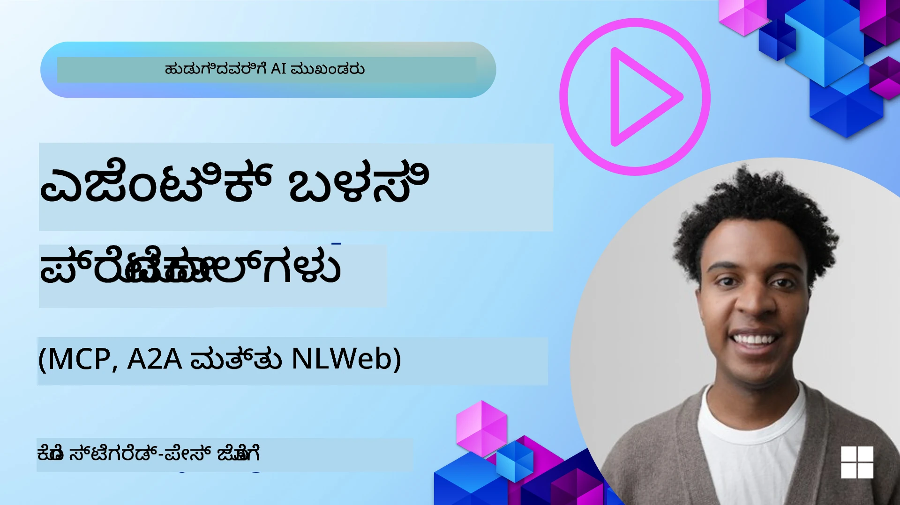
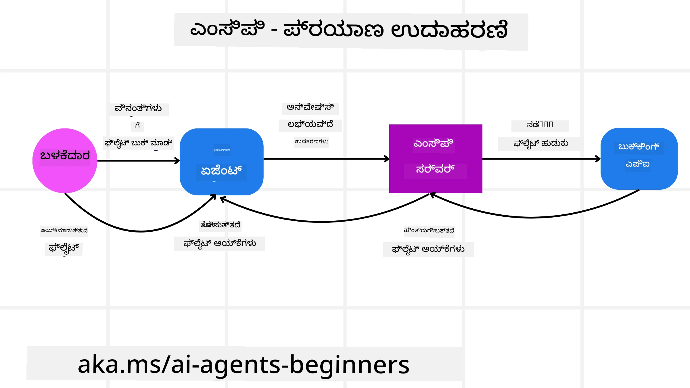
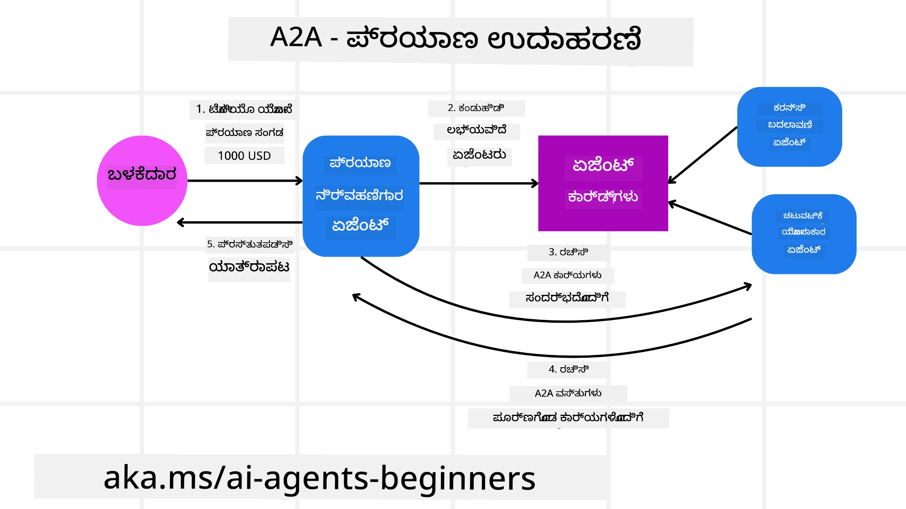
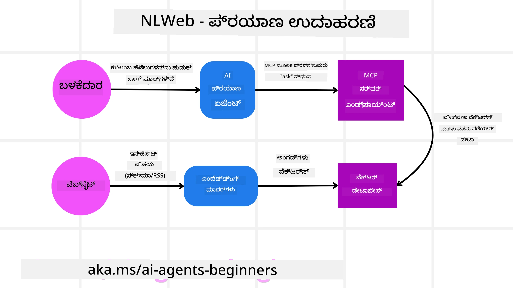

<!--
CO_OP_TRANSLATOR_METADATA:
{
  "original_hash": "aff92c6f019b4627ca9399c6e3882e17",
  "translation_date": "2025-12-03T17:32:37+00:00",
  "source_file": "11-agentic-protocols/README.md",
  "language_code": "kn"
}
-->
# ಏಜೆಂಟಿಕ್ ಪ್ರೋಟೋಕಾಲ್‌ಗಳನ್ನು (MCP, A2A ಮತ್ತು NLWeb) ಬಳಸುವುದು

> _(ಈ ಪಾಠದ ವೀಡಿಯೊವನ್ನು ವೀಕ್ಷಿಸಲು ಮೇಲಿನ ಚಿತ್ರವನ್ನು ಕ್ಲಿಕ್ ಮಾಡಿ)_

AI ಏಜೆಂಟ್‌ಗಳ ಬಳಕೆ ಹೆಚ್ಚಾದಂತೆ, ಮಾನಕೀಕರಣ, ಭದ್ರತೆ ಮತ್ತು ಮುಕ್ತ ನಾವೀನ್ಯತೆಗೆ ಬೆಂಬಲ ನೀಡುವ ಪ್ರೋಟೋಕಾಲ್‌ಗಳ ಅಗತ್ಯವೂ ಹೆಚ್ಚುತ್ತಿದೆ. ಈ ಪಾಠದಲ್ಲಿ, ಈ ಅಗತ್ಯವನ್ನು ಪೂರೈಸಲು ಪ್ರಯತ್ನಿಸುತ್ತಿರುವ ಮೂರು ಪ್ರೋಟೋಕಾಲ್‌ಗಳಾದ **Model Context Protocol (MCP)**, **Agent to Agent (A2A)** ಮತ್ತು **Natural Language Web (NLWeb)** ಕುರಿತು ಚರ್ಚಿಸುತ್ತೇವೆ.

## ಪರಿಚಯ

ಈ ಪಾಠದಲ್ಲಿ ನಾವು ಚರ್ಚಿಸುವ ವಿಷಯಗಳು:

• **MCP** ಹೇಗೆ AI ಏಜೆಂಟ್‌ಗಳಿಗೆ ಬಾಹ್ಯ ಸಾಧನಗಳು ಮತ್ತು ಡೇಟಾವನ್ನು ಪ್ರವೇಶಿಸಲು ಮತ್ತು ಬಳಕೆದಾರರ ಕಾರ್ಯಗಳನ್ನು ಪೂರ್ಣಗೊಳಿಸಲು ಸಹಾಯ ಮಾಡುತ್ತದೆ.

• **A2A** ಹೇಗೆ ವಿಭಿನ್ನ AI ಏಜೆಂಟ್‌ಗಳ ನಡುವೆ ಸಂವಹನ ಮತ್ತು ಸಹಕಾರವನ್ನು ಸಾಧ್ಯವಾಗಿಸುತ್ತದೆ.

• **NLWeb** ಹೇಗೆ ಯಾವುದೇ ವೆಬ್‌ಸೈಟ್‌ಗೆ ನೈಸರ್ಗಿಕ ಭಾಷಾ ಇಂಟರ್ಫೇಸ್‌ಗಳನ್ನು ತರುತ್ತದೆ, AI ಏಜೆಂಟ್‌ಗಳಿಗೆ ವಿಷಯವನ್ನು ಕಂಡುಹಿಡಿಯಲು ಮತ್ತು ಸಂವಹನ ಮಾಡಲು ಅನುಕೂಲ ಮಾಡುತ್ತದೆ.

## ಕಲಿಕೆಯ ಗುರಿಗಳು

• AI ಏಜೆಂಟ್‌ಗಳ ಸಂದರ್ಭದಲ್ಲಿ MCP, A2A, ಮತ್ತು NLWeb‌ಗಳ ಮೂಲ ಉದ್ದೇಶ ಮತ್ತು ಲಾಭಗಳನ್ನು **ಗುರುತಿಸಿ**.

• ಪ್ರತಿ ಪ್ರೋಟೋಕಾಲ್ ಹೇಗೆ LLM‌ಗಳು, ಸಾಧನಗಳು ಮತ್ತು ಇತರ ಏಜೆಂಟ್‌ಗಳ ನಡುವೆ ಸಂವಹನ ಮತ್ತು ಸಂವಹನವನ್ನು **ವಿವರಿಸುತ್ತದೆ** ಎಂಬುದನ್ನು **ವಿವರಿಸಿ**.

• ಸಂಕೀರ್ಣ ಏಜೆಂಟಿಕ್ ವ್ಯವಸ್ಥೆಗಳನ್ನು ನಿರ್ಮಿಸಲು ಪ್ರತಿ ಪ್ರೋಟೋಕಾಲ್‌ಗಳ ವಿಭಿನ್ನ ಪಾತ್ರಗಳನ್ನು **ಅರಿತುಕೊಳ್ಳಿ**.

## ಮಾದರಿ ಸಂಧರ್ಭ ಪ್ರೋಟೋಕಾಲ್ (MCP)

**Model Context Protocol (MCP)** ಒಂದು ಮುಕ್ತ ಮಾನದಂಡವಾಗಿದ್ದು, LLM‌ಗಳಿಗೆ ಸಂಧರ್ಭ ಮತ್ತು ಸಾಧನಗಳನ್ನು ಒದಗಿಸಲು ಆ್ಯಪ್ಲಿಕೇಶನ್‌ಗಳಿಗೆ ಮಾನಕೀಕೃತ ಮಾರ್ಗವನ್ನು ಒದಗಿಸುತ್ತದೆ. ಇದು AI ಏಜೆಂಟ್‌ಗಳು ವಿವಿಧ ಡೇಟಾ ಮೂಲಗಳು ಮತ್ತು ಸಾಧನಗಳಿಗೆ ಸತತವಾಗಿ ಸಂಪರ್ಕಿಸಲು "ಯುನಿವರ್ಸಲ್ ಅಡಾಪ್ಟರ್" ಅನ್ನು ಸಕ್ರಿಯಗೊಳಿಸುತ್ತದೆ.

MCP‌ಯ ಅಂಶಗಳು, ನೇರ API ಬಳಕೆಯೊಂದಿಗೆ ಹೋಲಿಸಿದಾಗ ಅದರ ಲಾಭಗಳು, ಮತ್ತು AI ಏಜೆಂಟ್‌ಗಳು MCP ಸರ್ವರ್ ಅನ್ನು ಹೇಗೆ ಬಳಸಬಹುದು ಎಂಬ ಉದಾಹರಣೆಯನ್ನು ನೋಡೋಣ.

### MCP ಮೂಲ ಅಂಶಗಳು

MCP **ಕ್ಲೈಂಟ್-ಸರ್ವರ್ ಆರ್ಕಿಟೆಕ್ಚರ್** ಮೇಲೆ ಕಾರ್ಯನಿರ್ವಹಿಸುತ್ತದೆ ಮತ್ತು ಅದರ ಮೂಲ ಅಂಶಗಳು:

• **ಹೋಸ್ಟ್‌ಗಳು**: LLM ಆ್ಯಪ್ಲಿಕೇಶನ್‌ಗಳು (ಉದಾಹರಣೆಗೆ VSCode ಎಂಬ ಕೋಡ್ ಎಡಿಟರ್) MCP ಸರ್ವರ್‌ಗಳಿಗೆ ಸಂಪರ್ಕವನ್ನು ಪ್ರಾರಂಭಿಸುತ್ತವೆ.

• **ಕ್ಲೈಂಟ್‌ಗಳು**: ಹೋಸ್ಟ್ ಆ್ಯಪ್ಲಿಕೇಶನ್‌ನೊಳಗಿನ ಅಂಶಗಳು, ಸರ್ವರ್‌ಗಳೊಂದಿಗೆ ಒನ್-ಟು-ಒನ್ ಸಂಪರ್ಕವನ್ನು ನಿರ್ವಹಿಸುತ್ತವೆ.

• **ಸರ್ವರ್‌ಗಳು**: ನಿರ್ದಿಷ್ಟ ಸಾಮರ್ಥ್ಯಗಳನ್ನು ಒದಗಿಸುವ ತೂಕದ ಕಡಿಮೆ ಪ್ರೋಗ್ರಾಮ್‌ಗಳು.

MCP ಸರ್ವರ್‌ಗಳ ಸಾಮರ್ಥ್ಯಗಳಲ್ಲಿ ಮೂರು ಪ್ರಮುಖ ಅಂಶಗಳು ಸೇರಿವೆ:

• **ಸಾಧನಗಳು**: AI ಏಜೆಂಟ್‌ಗಳು ಕಾರ್ಯವನ್ನು ನಿರ್ವಹಿಸಲು ಕರೆ ಮಾಡಬಹುದಾದ ಪ್ರತ್ಯೇಕ ಕ್ರಿಯೆಗಳು ಅಥವಾ ಕಾರ್ಯಗಳು. ಉದಾಹರಣೆಗೆ, ಹವಾಮಾನ ಸೇವೆ "ಹವಾಮಾನ ಪಡೆಯಿರಿ" ಸಾಧನವನ್ನು ಒದಗಿಸಬಹುದು, ಅಥವಾ ಇ-ಕಾಮರ್ಸ್ ಸರ್ವರ್ "ಉತ್ಪನ್ನವನ್ನು ಖರೀದಿಸಿ" ಸಾಧನವನ್ನು ಒದಗಿಸಬಹುದು. MCP ಸರ್ವರ್‌ಗಳು ಪ್ರತಿ ಸಾಧನದ ಹೆಸರು, ವಿವರಣೆ, ಮತ್ತು ಇನ್‌ಪುಟ್/ಔಟ್‌ಪುಟ್ ಸ್ಕೀಮಾವನ್ನು ತಮ್ಮ ಸಾಮರ್ಥ್ಯಗಳ ಪಟ್ಟಿಯಲ್ಲಿ ಪ್ರಚಾರ ಮಾಡುತ್ತವೆ.

• **ಸಂಪತ್ತುಗಳು**: MCP ಸರ್ವರ್ ಒದಗಿಸಬಹುದಾದ ಓದು-ಮಾತ್ರ ಡೇಟಾ ಐಟಂಗಳು ಅಥವಾ ಡಾಕ್ಯುಮೆಂಟ್‌ಗಳು, ಮತ್ತು ಕ್ಲೈಂಟ್‌ಗಳು ಅವುಗಳನ್ನು ಬೇಡಿಕೆಯ ಮೇರೆಗೆ ಪಡೆಯಬಹುದು. ಉದಾಹರಣೆಗಳು: ಫೈಲ್ ವಿಷಯಗಳು, ಡೇಟಾಬೇಸ್ ದಾಖಲೆಗಳು, ಅಥವಾ ಲಾಗ್ ಫೈಲ್‌ಗಳು. ಸಂಪತ್ತುಗಳು ಪಠ್ಯ (ಕೋಡ್ ಅಥವಾ JSON) ಅಥವಾ ಬೈನರಿ (ಚಿತ್ರಗಳು ಅಥವಾ PDF) ಆಗಿರಬಹುದು.

• **ಪ್ರಾಂಪ್ಟ್‌ಗಳು**: ಪೂರ್ವನಿರ್ಧರಿತ ಟೆಂಪ್ಲೇಟ್‌ಗಳು, ಜಟಿಲ ಕಾರ್ಯಪ್ರವಾಹಗಳಿಗೆ ಸೂಚನೆಗಳನ್ನು ಒದಗಿಸುತ್ತವೆ.

### MCP ಲಾಭಗಳು

MCP AI ಏಜೆಂಟ್‌ಗಳಿಗೆ ಪ್ರಮುಖ ಲಾಭಗಳನ್ನು ಒದಗಿಸುತ್ತದೆ:

• **ಡೈನಾಮಿಕ್ ಸಾಧನ ಪತ್ತೆ**: ಏಜೆಂಟ್‌ಗಳು ಸರ್ವರ್‌ನಿಂದ ಲಭ್ಯವಿರುವ ಸಾಧನಗಳ ಪಟ್ಟಿಯನ್ನು ವಿವರಣೆಗಳೊಂದಿಗೆ ಡೈನಾಮಿಕ್ ಆಗಿ ಪಡೆಯಬಹುದು. ಇದು ಪರಂಪರागत API‌ಗಳೊಂದಿಗೆ ಹೋಲಿಸಿದಾಗ, ಹೆಚ್ಚಿನ ಹೊಂದಿಕೊಳ್ಳುವಿಕೆಯನ್ನು ಒದಗಿಸುತ್ತದೆ.

• **LLM‌ಗಳ ನಡುವೆ ಪರಸ್ಪರ ಕಾರ್ಯನಿರ್ವಹಣೆ**: MCP ವಿಭಿನ್ನ LLM‌ಗಳಲ್ಲಿ ಕಾರ್ಯನಿರ್ವಹಿಸುತ್ತದೆ, ಉತ್ತಮ ಕಾರ್ಯಕ್ಷಮತೆಯನ್ನು ಮೌಲ್ಯಮಾಪನ ಮಾಡಲು ಕೋರ್ ಮಾದರಿಗಳನ್ನು ಬದಲಾಯಿಸಲು ಅನುಕೂಲವನ್ನು ಒದಗಿಸುತ್ತದೆ.

• **ಮಾನಕೀಕೃತ ಭದ್ರತೆ**: MCP ಮಾನಕೀಕೃತ ದೃಢೀಕರಣ ವಿಧಾನವನ್ನು ಒಳಗೊಂಡಿದೆ, ಇದು ಹೆಚ್ಚುವರಿ MCP ಸರ್ವರ್‌ಗಳಿಗೆ ಪ್ರವೇಶವನ್ನು ಸೇರಿಸುವಾಗ ಸ್ಕೇಲಬಿಲಿಟಿಯನ್ನು ಸುಧಾರಿಸುತ್ತದೆ.

### MCP ಉದಾಹರಣೆ

ಒಂದು ಬಳಕೆದಾರ MCP ಮೂಲಕ ಕಾರ್ಯನಿರ್ವಹಿಸುವ AI ಸಹಾಯಕರನ್ನು ಬಳಸಿಕೊಂಡು ವಿಮಾನವನ್ನು ಬುಕ್ ಮಾಡಲು ಬಯಸುತ್ತಾನೆ ಎಂದು ಕಲ್ಪಿಸೋಣ.

1. **ಸಂಪರ್ಕ**: AI ಸಹಾಯಕ (MCP ಕ್ಲೈಂಟ್) ವಿಮಾನಯಾನ ಕಂಪನಿಯ MCP ಸರ್ವರ್‌ಗೆ ಸಂಪರ್ಕಿಸುತ್ತದೆ.

2. **ಸಾಧನ ಪತ್ತೆ**: ಕ್ಲೈಂಟ್ MCP ಸರ್ವರ್‌ಗೆ "ನಿಮ್ಮಲ್ಲಿ ಯಾವ ಸಾಧನಗಳು ಲಭ್ಯವಿವೆ?" ಎಂದು ಕೇಳುತ್ತದೆ. ಸರ್ವರ್ "ವಿಮಾನ ಹುಡುಕಿ" ಮತ್ತು "ವಿಮಾನ ಬುಕ್ ಮಾಡಿ" ಎಂಬ ಸಾಧನಗಳನ್ನು ಪ್ರತಿಕ್ರಿಯೆ ನೀಡುತ್ತದೆ.

3. **ಸಾಧನ ಕರೆಯುವುದು**: ಬಳಕೆದಾರ AI ಸಹಾಯಕರಿಗೆ "ಪೋರ್ಟ್‌ಲ್ಯಾಂಡ್‌ನಿಂದ ಹೋನೊಲುಲುಗೆ ವಿಮಾನ ಹುಡುಕಿ" ಎಂದು ಕೇಳುತ್ತಾನೆ. AI ಸಹಾಯಕ, ತನ್ನ LLM ಅನ್ನು ಬಳಸಿಕೊಂಡು, "ವಿಮಾನ ಹುಡುಕಿ" ಸಾಧನವನ್ನು ಕರೆ ಮಾಡಬೇಕೆಂದು ಗುರುತಿಸುತ್ತದೆ ಮತ್ತು MCP ಸರ್ವರ್‌ಗೆ ಸಂಬಂಧಿತ ಪ್ಯಾರಾಮೀಟರ್‌ಗಳನ್ನು (ಮೂಲ, ಗಮ್ಯಸ್ಥಾನ) ಕಳುಹಿಸುತ್ತದೆ.

4. **ಕಾರ್ಯನಿರ್ವಹಣೆ ಮತ್ತು ಪ್ರತಿಕ್ರಿಯೆ**: MCP ಸರ್ವರ್, ವಿಮಾನಯಾನ ಕಂಪನಿಯ ಆಂತರಿಕ APIಗೆ ಕರೆ ಮಾಡುತ್ತದೆ, ವಿಮಾನ ಮಾಹಿತಿಯನ್ನು (ಉದಾಹರಣೆಗೆ JSON ಡೇಟಾ) ಪಡೆಯುತ್ತದೆ ಮತ್ತು AI ಸಹಾಯಕರಿಗೆ ಕಳುಹಿಸುತ್ತದೆ.

5. **ಹೆಚ್ಚಿನ ಸಂವಹನ**: AI ಸಹಾಯಕ ವಿಮಾನ ಆಯ್ಕೆಯನ್ನು ಪ್ರಸ್ತುತಪಡಿಸುತ್ತದೆ. ನೀವು ವಿಮಾನವನ್ನು ಆಯ್ಕೆ ಮಾಡಿದ ನಂತರ, ಸಹಾಯಕ "ವಿಮಾನ ಬುಕ್ ಮಾಡಿ" ಸಾಧನವನ್ನು MCP ಸರ್ವರ್‌ನಲ್ಲಿ ಕರೆ ಮಾಡಬಹುದು, ಬುಕ್ಕಿಂಗ್ ಅನ್ನು ಪೂರ್ಣಗೊಳಿಸುತ್ತದೆ.

## ಏಜೆಂಟ್-ಟು-ಏಜೆಂಟ್ ಪ್ರೋಟೋಕಾಲ್ (A2A)

MCP LLM‌ಗಳನ್ನು ಸಾಧನಗಳಿಗೆ ಸಂಪರ್ಕಿಸುವುದರ ಮೇಲೆ ಕೇಂದ್ರೀಕರಿಸಿದರೆ, **Agent-to-Agent (A2A) ಪ್ರೋಟೋಕಾಲ್** ವಿಭಿನ್ನ AI ಏಜೆಂಟ್‌ಗಳ ನಡುವೆ ಸಂವಹನ ಮತ್ತು ಸಹಕಾರವನ್ನು ಸಾಧ್ಯವಾಗಿಸುತ್ತದೆ. A2A ವಿಭಿನ್ನ ಸಂಸ್ಥೆಗಳು, ಪರಿಸರಗಳು ಮತ್ತು ತಂತ್ರಜ್ಞಾನಗಳ ನಡುವೆ ಏಜೆಂಟ್‌ಗಳನ್ನು ಸಂಪರ್ಕಿಸುತ್ತದೆ, ಹಂಚಿದ ಕಾರ್ಯವನ್ನು ಪೂರ್ಣಗೊಳಿಸಲು.

A2A‌ಯ ಅಂಶಗಳು, ಲಾಭಗಳು ಮತ್ತು ನಮ್ಮ ಪ್ರಯಾಣ ಆ್ಯಪ್ಲಿಕೇಶನ್‌ನಲ್ಲಿ ಇದನ್ನು ಹೇಗೆ ಅನ್ವಯಿಸಬಹುದು ಎಂಬುದರ ಉದಾಹರಣೆಯನ್ನು ನೋಡೋಣ.

### A2A ಮೂಲ ಅಂಶಗಳು

A2A ಏಜೆಂಟ್‌ಗಳ ನಡುವೆ ಸಂವಹನವನ್ನು ಸಕ್ರಿಯಗೊಳಿಸುವ ಮತ್ತು ಬಳಕೆದಾರರ ಉಪಕಾರ್ಯವನ್ನು ಪೂರ್ಣಗೊಳಿಸಲು ಅವುಗಳನ್ನು ಒಟ್ಟಿಗೆ ಕೆಲಸ ಮಾಡಲು ಸಕ್ರಿಯಗೊಳಿಸುವುದರ ಮೇಲೆ ಕೇಂದ್ರೀಕರಿಸುತ್ತದೆ. ಪ್ರೋಟೋಕಾಲ್‌ನ ಪ್ರತಿ ಅಂಶ ಇದಕ್ಕೆ ಕೊಡುಗೆ ನೀಡುತ್ತದೆ:

#### ಏಜೆಂಟ್ ಕಾರ್ಡ್

MCP ಸರ್ವರ್ ಸಾಧನಗಳ ಪಟ್ಟಿಯನ್ನು ಹಂಚಿಕೊಳ್ಳುವ ರೀತಿಯಲ್ಲೇ, ಏಜೆಂಟ್ ಕಾರ್ಡ್ ಹೊಂದಿದೆ:
- ಏಜೆಂಟ್‌ನ ಹೆಸರು.
- ಅದು ಪೂರ್ಣಗೊಳಿಸುವ ಸಾಮಾನ್ಯ ಕಾರ್ಯಗಳ **ವಿವರಣೆ**.
- **ನಿರ್ದಿಷ್ಟ ಕೌಶಲ್ಯಗಳ ಪಟ್ಟಿ** ಮತ್ತು ಅವುಗಳ ವಿವರಣೆ.
- ಏಜೆಂಟ್‌ನ **ಪ್ರಸ್ತುತ ಎಂಡ್‌ಪಾಯಿಂಟ್ URL**.
- ಏಜೆಂಟ್‌ನ **ಆವೃತ್ತಿ** ಮತ್ತು **ಸಾಮರ್ಥ್ಯಗಳು** (ಉದಾಹರಣೆಗೆ ಸ್ಟ್ರೀಮಿಂಗ್ ಪ್ರತಿಕ್ರಿಯೆಗಳು, ಪುಶ್ ಅಧಿಸೂಚನೆಗಳು).

#### ಏಜೆಂಟ್ ಎಕ್ಸಿಕ್ಯೂಟರ್

ಏಜೆಂಟ್ ಎಕ್ಸಿಕ್ಯೂಟರ್ ಬಳಕೆದಾರರ ಚಾಟ್‌ನ ಸಂಧರ್ಭವನ್ನು ದೂರದ ಏಜೆಂಟ್‌ಗೆ **ಕಳುಹಿಸಲು** ಹೊಣೆಗಾರನಾಗಿರುತ್ತದೆ. A2A ಸರ್ವರ್‌ನಲ್ಲಿ, ಏಜೆಂಟ್ ತನ್ನದೇ ಆದ LLM ಅನ್ನು ಬಳಸಿಕೊಂಡು ಬರುವ ವಿನಂತಿಗಳನ್ನು ವಿಶ್ಲೇಷಿಸುತ್ತದೆ ಮತ್ತು ತನ್ನ ಆಂತರಿಕ ಸಾಧನಗಳನ್ನು ಬಳಸಿಕೊಂಡು ಕಾರ್ಯಗಳನ್ನು ನಿರ್ವಹಿಸುತ್ತದೆ.

#### ಆರ್ಟಿಫ್ಯಾಕ್ಟ್

ದೂರದ ಏಜೆಂಟ್ ವಿನಂತಿಸಿದ ಕಾರ್ಯವನ್ನು ಪೂರ್ಣಗೊಳಿಸಿದ ನಂತರ, ಅದರ ಕೆಲಸದ ಉತ್ಪನ್ನವನ್ನು ಆರ್ಟಿಫ್ಯಾಕ್ಟ್ ಎಂದು ಕರೆಯಲಾಗುತ್ತದೆ. ಆರ್ಟಿಫ್ಯಾಕ್ಟ್ **ಏಜೆಂಟ್‌ನ ಕೆಲಸದ ಫಲಿತಾಂಶವನ್ನು**, **ಪೂರ್ಣಗೊಳಿಸಿದ ಕಾರ್ಯದ ವಿವರಣೆಯನ್ನು**, ಮತ್ತು **ಪಠ್ಯ ಸಂಧರ್ಭವನ್ನು** ಒಳಗೊಂಡಿರುತ್ತದೆ. 

#### ಈವೆಂಟ್ ಕ್ಯೂ

ಈ ಅಂಶ **ಅಪ್ಡೇಟ್‌ಗಳನ್ನು ನಿರ್ವಹಿಸಲು ಮತ್ತು ಸಂದೇಶಗಳನ್ನು ಕಳುಹಿಸಲು** ಬಳಸಲಾಗುತ್ತದೆ. 

### A2A ಲಾಭಗಳು

• **ವರ್ಧಿತ ಸಹಕಾರ**: ಇದು ವಿಭಿನ್ನ ಪ್ಲಾಟ್‌ಫಾರ್ಮ್‌ಗಳ ಏಜೆಂಟ್‌ಗಳಿಗೆ ಪರಸ್ಪರ ಸಂವಹನ ಮಾಡಲು ಮತ್ತು ಸಹಕರಿಸಲು ಅನುಮತಿಸುತ್ತದೆ.

• **ಮಾದರಿ ಆಯ್ಕೆ ಲಚ್ಯತೆ**: ಪ್ರತಿ A2A ಏಜೆಂಟ್ ತನ್ನ ವಿನಂತಿಗಳನ್ನು ಸೇವೆಗೊಳಿಸಲು ಯಾವ LLM ಅನ್ನು ಬಳಸಬೇಕು ಎಂಬುದನ್ನು ನಿರ್ಧರಿಸಬಹುದು.

• **ನಿರ್ಮಿತ ದೃಢೀಕರಣ**: ದೃಢೀಕರಣವನ್ನು ನೇರವಾಗಿ A2A ಪ್ರೋಟೋಕಾಲ್‌ನಲ್ಲಿ ಅಳವಡಿಸಲಾಗಿದೆ.

### A2A ಉದಾಹರಣೆ

ನಮ್ಮ ಪ್ರಯಾಣ ಬುಕ್ಕಿಂಗ್ ದೃಶ್ಯವನ್ನು A2A ಬಳಸಿ ವಿಸ್ತರಿಸೋಣ.

1. **ಬಳಕೆದಾರರ ವಿನಂತಿ**: ಬಳಕೆದಾರ "ಹೋನೊಲುಲುಗೆ ವಿಮಾನ, ಹೋಟೆಲ್ ಮತ್ತು ಕಾರ್ ರೆಂಟ್ ಮಾಡಿ" ಎಂದು ಕೇಳುತ್ತಾನೆ.

2. **ಪ್ರಯಾಣ ಏಜೆಂಟ್‌ನ ಸಂಯೋಜನೆ**: ಪ್ರಯಾಣ ಏಜೆಂಟ್ ಈ ಸಂಕೀರ್ಣ ವಿನಂತಿಯನ್ನು ಸ್ವೀಕರಿಸುತ್ತದೆ.

3. **ಏಜೆಂಟ್‌ಗಳ ನಡುವೆ ಸಂವಹನ**: ಪ್ರಯಾಣ ಏಜೆಂಟ್ A2A ಪ್ರೋಟೋಕಾಲ್ ಅನ್ನು ಬಳಸಿಕೊಂಡು "ವಿಮಾನ ಏಜೆಂಟ್," "ಹೋಟೆಲ್ ಏಜೆಂಟ್," ಮತ್ತು "ಕಾರ್ ರೆಂಟ್ ಏಜೆಂಟ್"‌ಗಳಿಗೆ ಸಂಪರ್ಕಿಸುತ್ತದೆ.

4. **ಕಾರ್ಯ ವಹಿಸುವಿಕೆ**: ಪ್ರಯಾಣ ಏಜೆಂಟ್ ಈ ವಿಶೇಷ ಏಜೆಂಟ್‌ಗಳಿಗೆ ನಿರ್ದಿಷ್ಟ ಕಾರ್ಯಗಳನ್ನು ಕಳುಹಿಸುತ್ತದೆ.

5. **ಸಂಯೋಜಿತ ಪ್ರತಿಕ್ರಿಯೆ**: ಎಲ್ಲಾ ಏಜೆಂಟ್‌ಗಳು ತಮ್ಮ ಕಾರ್ಯಗಳನ್ನು ಪೂರ್ಣಗೊಳಿಸಿದ ನಂತರ, ಪ್ರಯಾಣ ಏಜೆಂಟ್ ಫಲಿತಾಂಶಗಳನ್ನು ಸಂಯೋಜಿಸುತ್ತದೆ.

## ನೈಸರ್ಗಿಕ ಭಾಷಾ ವೆಬ್ (NLWeb)

ವೆಬ್‌ಸೈಟ್‌ಗಳು ಇಂಟರ್ನೆಟ್‌ನಲ್ಲಿ ಮಾಹಿತಿಯನ್ನು ಪ್ರವೇಶಿಸಲು ಪ್ರಮುಖ ಮಾರ್ಗವಾಗಿವೆ.

### NLWeb ಅಂಶಗಳು

- **NLWeb ಆ್ಯಪ್ಲಿಕೇಶನ್ (ಕೋರ್ ಸರ್ವಿಸ್ ಕೋಡ್)**: ನೈಸರ್ಗಿಕ ಭಾಷಾ ಪ್ರಶ್ನೆಗಳನ್ನು ಪ್ರಕ್ರಿಯೆಗೊಳಿಸುವ ವ್ಯವಸ್ಥೆ.

- **NLWeb ಪ್ರೋಟೋಕಾಲ್**: ವೆಬ್‌ಸೈಟ್‌ನೊಂದಿಗೆ ನೈಸರ್ಗಿಕ ಭಾಷಾ ಸಂವಹನಕ್ಕಾಗಿ ನಿಯಮಗಳ ಸಮೂಹ.

- **MCP ಸರ್ವರ್ (ಮಾದರಿ ಸಂಧರ್ಭ ಪ್ರೋಟೋಕಾಲ್ ಎಂಡ್‌ಪಾಯಿಂಟ್)**: ಪ್ರತಿ NLWeb ಸೆಟಪ್ MCP ಸರ್ವರ್ ಆಗಿ ಕಾರ್ಯನಿರ್ವಹಿಸುತ್ತದೆ.

- **ಎಂಬೆಡಿಂಗ್ ಮಾದರಿ**: ವೆಬ್‌ಸೈಟ್ ವಿಷಯವನ್ನು ಸಂಖ್ಯಾತ್ಮಕ ಪ್ರತಿನಿಧನೆಗೆ ಪರಿವರ್ತಿಸಲು ಬಳಸಲಾಗುತ್ತದೆ.

- **ವೆಕ್ಟರ್ ಡೇಟಾಬೇಸ್ (ಪುನಃಪ್ರಾಪ್ತಿ ಯಂತ್ರ)**: ವೆಬ್‌ಸೈಟ್ ವಿಷಯದ ಎಂಬೆಡಿಂಗ್‌ಗಳನ್ನು ಸಂಗ್ರಹಿಸುತ್ತದೆ.

### NLWeb ಉದಾಹರಣೆ

ನಮ್ಮ ಪ್ರಯಾಣ ಬುಕ್ಕಿಂಗ್ ವೆಬ್‌ಸೈಟ್‌ನ್ನು NLWeb ಮೂಲಕ ಪರಿವರ್ತಿಸೋಣ.

1. **ಡೇಟಾ ಇನ್‌ಜೆಕ್ಷನ್**: ವೆಬ್‌ಸೈಟ್‌ನ ಉತ್ಪನ್ನ ಕ್ಯಾಟಲಾಗ್‌ಗಳನ್ನು NLWeb ಇನ್‌ಜೆಸ್ಟ್ ಮಾಡುತ್ತದೆ.

2. **ನೈಸರ್ಗಿಕ ಭಾಷಾ ಪ್ರಶ್ನೆ**: ಬಳಕೆದಾರ "ಹೋನೊಲುಲುಗೆ ಫ್ಯಾಮಿಲಿ-ಫ್ರೆಂಡ್ಲಿ ಹೋಟೆಲ್ ಹುಡುಕಿ" ಎಂದು ಕೇಳುತ್ತಾನೆ.

3. **NLWeb ಪ್ರಕ್ರಿಯೆ**: NLWeb ಆ್ಯಪ್ಲಿಕೇಶನ್ ಈ ಪ್ರಶ್ನೆಯನ್ನು LLM ಗೆ ಕಳುಹಿಸುತ್ತದೆ.

4. **ನಿಖರವಾದ ಫಲಿತಾಂಶಗಳು**: LLM "ಫ್ಯಾಮಿಲಿ-ಫ್ರೆಂಡ್ಲಿ," "ಪೂಲ್," ಮತ್ತು "ಹೋನೊಲುಲು" ಮಾನದಂಡಗಳ ಆಧಾರದ ಮೇಲೆ ಉತ್ತಮ ಹೋಟೆಲ್‌ಗಳನ್ನು ಗುರುತಿಸುತ್ತದೆ.

5. **AI ಏಜೆಂಟ್ ಸಂವಹನ**: NLWeb MCP ಸರ್ವರ್ ಆಗಿ ಕಾರ್ಯನಿರ್ವಹಿಸುತ್ತಿರುವುದರಿಂದ, ಬಾಹ್ಯ AI ಏಜೆಂಟ್ ಕೂಡ ವೆಬ್‌ಸೈಟ್‌ನ NLWeb ಇನ್‌ಸ್ಟಾನ್ಸ್‌ಗೆ ಸಂಪರ್ಕಿಸಬಹುದು.

### MCP/A2A/NLWeb ಬಗ್ಗೆ ಇನ್ನಷ್ಟು ಪ್ರಶ್ನೆಗಳಿವೆಯೇ?

[Azure AI Foundry Discord](https://aka.ms/ai-agents/discord) ಗೆ ಸೇರಿ, ಇತರ ಕಲಿಯುವವರನ್ನು ಭೇಟಿಯಾಗಿ, ಆಫೀಸ್ ಅವರ್ಸ್‌ನಲ್ಲಿ ಭಾಗವಹಿಸಿ ಮತ್ತು ನಿಮ್ಮ AI ಏಜೆಂಟ್‌ಗಳ ಪ್ರಶ್ನೆಗಳಿಗೆ ಉತ್ತರ ಪಡೆಯಿರಿ.

## ಸಂಪತ್ತುಗಳು

- [MCP for Beginners](https://aka.ms/mcp-for-beginners)  
- [MCP Documentation](https://github.com/microsoft/semantic-kernel/tree/main/python/semantic-kernel/semantic_kernel/connectors/mcp)
- [NLWeb Repo](https://github.com/nlweb-ai/NLWeb)
- [Semantic Kernel Guides](https://learn.microsoft.com/semantic-kernel/)

---

<!-- CO-OP TRANSLATOR DISCLAIMER START -->
**ಅಸಮೀಕ್ಷೆ**:  
ಈ ದಸ್ತಾವೇಜನ್ನು AI ಅನುವಾದ ಸೇವೆ [Co-op Translator](https://github.com/Azure/co-op-translator) ಬಳಸಿ ಅನುವಾದಿಸಲಾಗಿದೆ. ನಾವು ನಿಖರತೆಯನ್ನು ಸಾಧಿಸಲು ಪ್ರಯತ್ನಿಸುತ್ತಿದ್ದರೂ, ದಯವಿಟ್ಟು ಗಮನಿಸಿ, ಸ್ವಯಂಚಾಲಿತ ಅನುವಾದಗಳಲ್ಲಿ ದೋಷಗಳು ಅಥವಾ ಅಸಮರ್ಪಕತೆಗಳು ಇರಬಹುದು. ಮೂಲ ಭಾಷೆಯಲ್ಲಿರುವ ಮೂಲ ದಸ್ತಾವೇಜನ್ನು ಪ್ರಾಮಾಣಿಕ ಮೂಲವೆಂದು ಪರಿಗಣಿಸಬೇಕು. ಪ್ರಮುಖ ಮಾಹಿತಿಗಾಗಿ, ವೃತ್ತಿಪರ ಮಾನವ ಅನುವಾದವನ್ನು ಶಿಫಾರಸು ಮಾಡಲಾಗುತ್ತದೆ. ಈ ಅನುವಾದದ ಬಳಕೆಯಿಂದ ಉಂಟಾಗುವ ಯಾವುದೇ ತಪ್ಪುಅರ್ಥಗಳು ಅಥವಾ ತಪ್ಪುಅರ್ಥೈಸುವಿಕೆಗೆ ನಾವು ಹೊಣೆಗಾರರಲ್ಲ.
<!-- CO-OP TRANSLATOR DISCLAIMER END -->