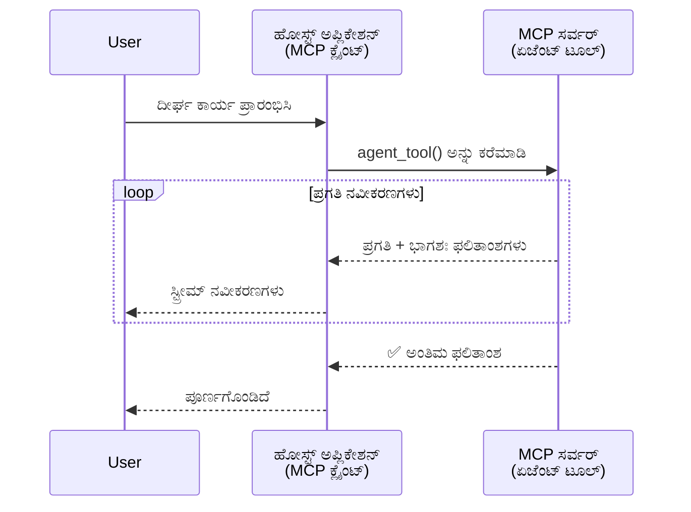
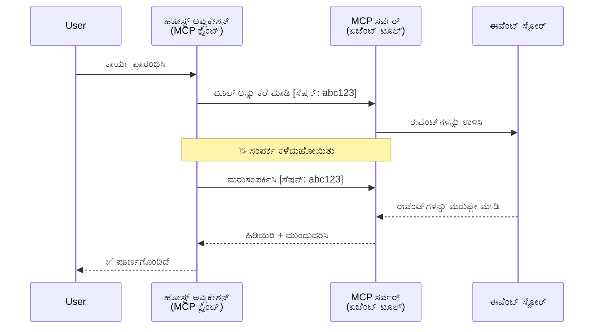
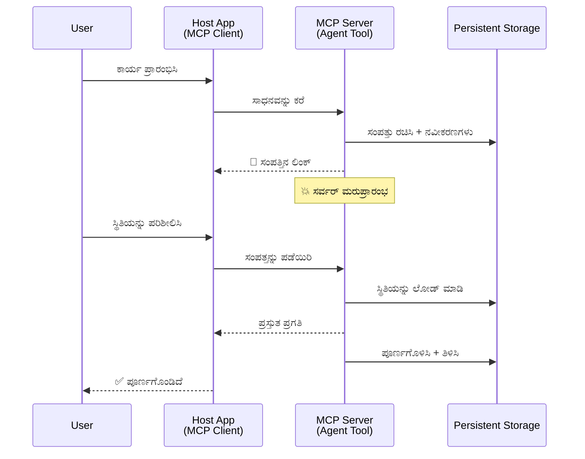
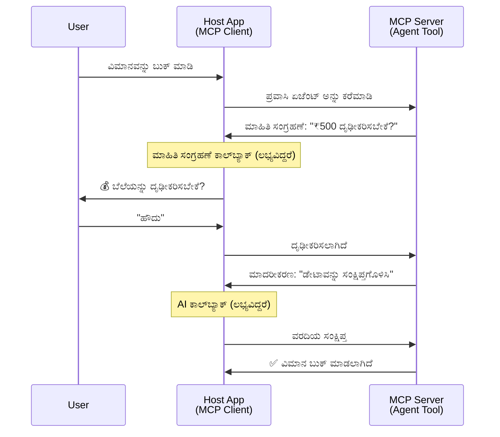

<!--
CO_OP_TRANSLATOR_METADATA:
{
  "original_hash": "5cc6836626047aa055e8960c8484a7d0",
  "translation_date": "2025-12-03T17:47:51+00:00",
  "source_file": "11-agentic-protocols/code_samples/mcp-agents/README.md",
  "language_code": "kn"
}
-->
# MCP ಬಳಸಿ ಏಜೆಂಟ್-ಟು-ಏಜೆಂಟ್ ಸಂವಹನ ವ್ಯವಸ್ಥೆಗಳನ್ನು ನಿರ್ಮಿಸುವುದು

> TL;DR - MCP ಮೇಲೆ Agent2Agent ಸಂವಹನವನ್ನು ನಿರ್ಮಿಸಬಹುದೇ? ಹೌದು!

MCP ತನ್ನ ಮೂಲ ಗುರಿಯಾದ "LLMs ಗೆ ಸಂದರ್ಭವನ್ನು ಒದಗಿಸುವುದು" ಎಂಬುದಕ್ಕಿಂತ ಬಹಳಷ್ಟು ಮುಂದುವರಿದಿದೆ. [ಪುನರಾರಂಭಿಸಬಹುದಾದ ಸ್ಟ್ರೀಮ್‌ಗಳು](https://modelcontextprotocol.io/docs/concepts/transports#resumability-and-redelivery), [ಎಲಿಸಿಟೇಶನ್](https://modelcontextprotocol.io/specification/2025-06-18/client/elicitation), [ಸ್ಯಾಂಪ್ಲಿಂಗ್](https://modelcontextprotocol.io/specification/2025-06-18/client/sampling), ಮತ್ತು [ಪ್ರಗತಿ](https://modelcontextprotocol.io/specification/2025-06-18/basic/utilities/progress) ಮತ್ತು [ಸಂಪತ್ತು](https://modelcontextprotocol.io/specification/2025-06-18/schema#resourceupdatednotification)ಗಳಂತಹ ನೋಟಿಫಿಕೇಶನ್‌ಗಳನ್ನು ಸೇರಿಸುವ ಮೂಲಕ MCP ಈಗ ಸಂಕೀರ್ಣ ಏಜೆಂಟ್-ಟು-ಏಜೆಂಟ್ ಸಂವಹನ ವ್ಯವಸ್ಥೆಗಳನ್ನು ನಿರ್ಮಿಸಲು ಶಕ್ತಿಯುತವಾದ ಆಧಾರವನ್ನು ಒದಗಿಸುತ್ತದೆ.

## ಏಜೆಂಟ್/ಟೂಲ್ ಬಗ್ಗೆ ತಪ್ಪು ಕಲ್ಪನೆ

ಏಜೆಂಟಿಕ್ ವರ್ತನೆ ಹೊಂದಿರುವ ಸಾಧನಗಳನ್ನು (ದೀರ್ಘಾವಧಿಯ ಕಾರ್ಯಾಚರಣೆ, ಕಾರ್ಯಾಚರಣೆಯ ಮಧ್ಯದಲ್ಲಿ ಹೆಚ್ಚುವರಿ ಇನ್‌ಪುಟ್ ಅಗತ್ಯವಿರಬಹುದು) ಅನ್ವೇಷಿಸುವಂತೆ ಹೆಚ್ಚು ಡೆವಲಪರ್‌ಗಳು MCP ಸರಿಯಾದ ಆಯ್ಕೆಯಲ್ಲ ಎಂಬ ಸಾಮಾನ್ಯ ತಪ್ಪು ಕಲ್ಪನೆ ಇದೆ, ಮುಖ್ಯವಾಗಿ ಅದರ ಟೂಲ್‌ಗಳ ಪ್ರಾಥಮಿಕ ಉದಾಹರಣೆಗಳು ಸರಳ ವಿನಂತಿ-ಪ್ರತಿಕ್ರಿಯಾ ಮಾದರಿಗಳ ಮೇಲೆ ಕೇಂದ್ರೀಕೃತವಾಗಿದ್ದವು.

ಈ ಕಲ್ಪನೆ ಈಗ ಹಳೆಯದಾಗಿದೆ. MCP ಸ್ಪೆಸಿಫಿಕೇಶನ್ ಕಳೆದ ಕೆಲವು ತಿಂಗಳಲ್ಲಿ ದೀರ್ಘಾವಧಿಯ ಏಜೆಂಟಿಕ್ ವರ್ತನೆ ನಿರ್ಮಿಸಲು ಅಗತ್ಯವಿರುವ ಸಾಮರ್ಥ್ಯಗಳನ್ನು ಒಳಗೊಂಡಂತೆ ಸಾಕಷ್ಟು ಸುಧಾರಣೆಗಳನ್ನು ಕಂಡಿದೆ:

- **ಸ್ಟ್ರೀಮಿಂಗ್ ಮತ್ತು ಭಾಗಶಃ ಫಲಿತಾಂಶಗಳು**: ಕಾರ್ಯಾಚರಣೆಯ ಸಮಯದಲ್ಲಿ ರಿಯಲ್-ಟೈಮ್ ಪ್ರಗತಿ ನವೀಕರಣಗಳು
- **ಪುನರಾರಂಭಿಸಬಹುದಾದತೆ**: ಡಿಸ್ಕನೆಕ್ಷನ್ ನಂತರ ಕ್ಲೈಂಟ್‌ಗಳು ಮರುಸಂಪರ್ಕಿಸಿ ಮುಂದುವರಿಯಬಹುದು
- **ದೀರ್ಘಕಾಲಿಕತೆ**: ಫಲಿತಾಂಶಗಳು ಸರ್ವರ್ ಮರುಪ್ರಾರಂಭಗಳ ನಂತರವೂ ಉಳಿಯುತ್ತವೆ (ಉದಾ., ಸಂಪತ್ತು ಲಿಂಕ್‌ಗಳ ಮೂಲಕ)
- **ಮಲ್ಟಿ-ಟರ್ನ್**: ಎಲಿಸಿಟೇಶನ್ ಮತ್ತು ಸ್ಯಾಂಪ್ಲಿಂಗ್ ಮೂಲಕ ಕಾರ್ಯಾಚರಣೆಯ ಮಧ್ಯದಲ್ಲಿ ಸಂವಾದಾತ್ಮಕ ಇನ್‌ಪುಟ್

ಈ ವೈಶಿಷ್ಟ್ಯಗಳನ್ನು ಸಂಯೋಜಿಸಿ ಸಂಕೀರ್ಣ ಏಜೆಂಟಿಕ್ ಮತ್ತು ಮಲ್ಟಿ-ಏಜೆಂಟ್ ಅಪ್ಲಿಕೇಶನ್‌ಗಳನ್ನು MCP ಪ್ರೋಟೋಕಾಲ್‌ನಲ್ಲಿ ನಿಯೋಜಿಸಬಹುದು.

ಉದಾಹರಣೆಗೆ, ನಾವು MCP ಸರ್ವರ್‌ನಲ್ಲಿ ಲಭ್ಯವಿರುವ "ಟೂಲ್" ಅನ್ನು ಏಜೆಂಟ್ ಎಂದು ಕರೆಯುತ್ತೇವೆ. ಇದು MCP ಕ್ಲೈಂಟ್ ಅನ್ನು ಅನುಷ್ಠಾನಗೊಳಿಸುವ ಹೋಸ್ಟ್ ಅಪ್ಲಿಕೇಶನ್‌ನ ಅಸ್ತಿತ್ವವನ್ನು ಸೂಚಿಸುತ್ತದೆ, ಇದು MCP ಸರ್ವರ್‌ನೊಂದಿಗೆ ಸೆಷನ್ ಸ್ಥಾಪಿಸುತ್ತದೆ ಮತ್ತು ಏಜೆಂಟ್ ಅನ್ನು ಕರೆ ಮಾಡುತ್ತದೆ.

## MCP ಟೂಲ್ "ಏಜೆಂಟಿಕ್" ಆಗಲು ಏನು ಮಾಡುತ್ತದೆ?

ಅನುಷ್ಠಾನಕ್ಕೆ ಮುನ್ನ, ದೀರ್ಘಾವಧಿಯ ಏಜೆಂಟ್‌ಗಳನ್ನು ಬೆಂಬಲಿಸಲು ಅಗತ್ಯವಿರುವ ಮೂಲಸೌಕರ್ಯ ಸಾಮರ್ಥ್ಯಗಳನ್ನು ಸ್ಥಾಪಿಸೋಣ.

> ನಾವು ಏಜೆಂಟ್ ಅನ್ನು ಸ್ವಾಯತ್ತವಾಗಿ ದೀರ್ಘಾವಧಿಯವರೆಗೆ ಕಾರ್ಯನಿರ್ವಹಿಸಲು, ಬಹುಸಂವಾದ ಅಥವಾ ರಿಯಲ್-ಟೈಮ್ ಪ್ರತಿಕ್ರಿಯೆ ಆಧಾರದ ಮೇಲೆ ಹೊಂದಾಣಿಕೆಗಳನ್ನು ನಿರ್ವಹಿಸಲು ಸಾಮರ್ಥ್ಯ ಹೊಂದಿರುವ ಘಟಕವೆಂದು ವ್ಯಾಖ್ಯಾನಿಸುತ್ತೇವೆ.

### 1. ಸ್ಟ್ರೀಮಿಂಗ್ ಮತ್ತು ಭಾಗಶಃ ಫಲಿತಾಂಶಗಳು

ಸಾಂಪ್ರದಾಯಿಕ ವಿನಂತಿ-ಪ್ರತಿಕ್ರಿಯಾ ಮಾದರಿಗಳು ದೀರ್ಘಾವಧಿಯ ಕಾರ್ಯಗಳಿಗೆ ಸೂಕ್ತವಲ್ಲ. ಏಜೆಂಟ್‌ಗಳು ಈ ಕೆಳಗಿನವುಗಳನ್ನು ಒದಗಿಸಬೇಕು:

- ರಿಯಲ್-ಟೈಮ್ ಪ್ರಗತಿ ನವೀಕರಣಗಳು
- ಮಧ್ಯಂತರ ಫಲಿತಾಂಶಗಳು

**MCP ಬೆಂಬಲ**: ಸಂಪತ್ತು ನವೀಕರಣ ನೋಟಿಫಿಕೇಶನ್‌ಗಳು ಭಾಗಶಃ ಫಲಿತಾಂಶಗಳನ್ನು ಸ್ಟ್ರೀಮ್ ಮಾಡಲು ಅನುಮತಿಸುತ್ತವೆ, ಆದರೆ ಇದು JSON-RPC ನ 1:1 ವಿನಂತಿ/ಪ್ರತಿಕ್ರಿಯಾ ಮಾದರಿಯೊಂದಿಗೆ ಸಂಘರ್ಷಗಳನ್ನು ತಪ್ಪಿಸಲು ಎಚ್ಚರಿಕೆಯಿಂದ ವಿನ್ಯಾಸಗೊಳಿಸಬೇಕಾಗಿದೆ.

| ವೈಶಿಷ್ಟ್ಯ                    | ಬಳಕೆ ಪ್ರಕರಣ                                                                                                                                                                       | MCP ಬೆಂಬಲ                                                                                |
| -------------------------- | ------------------------------------------------------------------------------------------------------------------------------------------------------------------------------ | ------------------------------------------------------------------------------------------ |
| ರಿಯಲ್-ಟೈಮ್ ಪ್ರಗತಿ ನವೀಕರಣಗಳು | ಬಳಕೆದಾರರು ಕೋಡ್‌ಬೇಸ್ ಮೈಗ್ರೇಶನ್ ಕಾರ್ಯವನ್ನು ವಿನಂತಿಸುತ್ತಾರೆ. ಏಜೆಂಟ್ ಪ್ರಗತಿಯನ್ನು ಸ್ಟ್ರೀಮ್ ಮಾಡುತ್ತದೆ: "10% - ಅವಲಂಬನೆಗಳನ್ನು ವಿಶ್ಲೇಷಿಸುತ್ತಿದೆ... 25% - ಟೈಪ್‌ಸ್ಕ್ರಿಪ್ಟ್ ಫೈಲ್‌ಗಳನ್ನು ಪರಿವರ್ತಿಸುತ್ತಿದೆ... 50% - ಇಂಪೋರ್ಟ್‌ಗಳನ್ನು ನವೀಕರಿಸುತ್ತಿದೆ..."          | ✅ ಪ್ರಗತಿ ನೋಟಿಫಿಕೇಶನ್                                                                  |
| ಭಾಗಶಃ ಫಲಿತಾಂಶಗಳು            | "ಪುಸ್ತಕವನ್ನು ರಚಿಸಿ" ಕಾರ್ಯ ಭಾಗಶಃ ಫಲಿತಾಂಶಗಳನ್ನು ಸ್ಟ್ರೀಮ್ ಮಾಡುತ್ತದೆ, ಉದಾ., 1) ಕಥಾ ವಕ್ರರೇಖೆಯ ರೂಪರೇಖೆ, 2) ಅಧ್ಯಾಯ ಪಟ್ಟಿ, 3) ಪ್ರತಿ ಅಧ್ಯಾಯವನ್ನು ಪೂರ್ಣಗೊಳಿಸಿದಂತೆ. ಹೋಸ್ಟ್ ಪರಿಶೀಲಿಸಬಹುದು, ರದ್ದು ಮಾಡಬಹುದು ಅಥವಾ ಯಾವುದೇ ಹಂತದಲ್ಲಿ ಮರುನಿರ್ದೇಶಿಸಬಹುದು. | ✅ ನೋಟಿಫಿಕೇಶನ್‌ಗಳನ್ನು "ವಿಸ್ತರಿಸಬಹುದು" ಭಾಗಶಃ ಫಲಿತಾಂಶಗಳನ್ನು ಸೇರಿಸಲು, PR 383, 776 ಪ್ರಸ್ತಾಪಗಳನ್ನು ನೋಡಿ |

<div align="center" style="font-style: italic; font-size: 0.95em; margin-bottom: 0.5em;">
<strong>ಚಿತ್ರ 1:</strong> ಈ ಚಿತ್ರ MCP ಏಜೆಂಟ್ ಹೇಗೆ ದೀರ್ಘಾವಧಿಯ ಕಾರ್ಯದ ಸಮಯದಲ್ಲಿ ರಿಯಲ್-ಟೈಮ್ ಪ್ರಗತಿ ನವೀಕರಣಗಳು ಮತ್ತು ಭಾಗಶಃ ಫಲಿತಾಂಶಗಳನ್ನು ಹೋಸ್ಟ್ ಅಪ್ಲಿಕೇಶನ್‌ಗೆ ಸ್ಟ್ರೀಮ್ ಮಾಡುತ್ತದೆ ಎಂಬುದನ್ನು ತೋರಿಸುತ್ತದೆ, ಬಳಕೆದಾರರು ಕಾರ್ಯನಿರ್ವಹಣೆಯನ್ನು ರಿಯಲ್-ಟೈಮ್‌ನಲ್ಲಿ ಮೇಲ್ವಿಚಾರಣೆ ಮಾಡಲು ಅನುಮತಿಸುತ್ತದೆ.
</div>


### 2. ಪುನರಾರಂಭಿಸಬಹುದಾದತೆ

ಏಜೆಂಟ್‌ಗಳು ನೆಟ್‌ವರ್ಕ್ ವ್ಯತ್ಯಯಗಳನ್ನು ಸುಗಮವಾಗಿ ನಿರ್ವಹಿಸಬೇಕು:

- (ಕ್ಲೈಂಟ್) ಡಿಸ್ಕನೆಕ್ಷನ್ ನಂತರ ಮರುಸಂಪರ್ಕಿಸಿ
- ಅವರು ಬಿಟ್ಟ ಸ್ಥಳದಿಂದ ಮುಂದುವರಿಯಿರಿ (ಸಂದೇಶ ಮರುವಿತರಣೆಯೊಂದಿಗೆ)

**MCP ಬೆಂಬಲ**: MCP StreamableHTTP ಟ್ರಾನ್ಸ್‌ಪೋರ್ಟ್ ಇಂದು ಸೆಷನ್ ಪುನರಾರಂಭ ಮತ್ತು ಸಂದೇಶ ಮರುವಿತರಣೆಯನ್ನು ಸೆಷನ್ ಐಡಿಗಳು ಮತ್ತು ಕೊನೆಯ ಈವೆಂಟ್ ಐಡಿಗಳೊಂದಿಗೆ ಬೆಂಬಲಿಸುತ್ತದೆ. ಇಲ್ಲಿ ಮುಖ್ಯವಾದ ವಿಷಯವೆಂದರೆ ಸರ್ವರ್ ಈವೆಂಟ್‌ಸ್ಟೋರ್ ಅನ್ನು ಅನುಷ್ಠಾನಗೊಳಿಸಬೇಕು, ಇದು ಕ್ಲೈಂಟ್ ಮರುಸಂಪರ್ಕದ ಮೇಲೆ ಈವೆಂಟ್‌ಗಳನ್ನು ಮರುಪ್ಲೇ ಮಾಡಲು ಅನುಮತಿಸುತ್ತದೆ.  
ಸಮುದಾಯ ಪ್ರಸ್ತಾಪ (PR #975) ಟ್ರಾನ್ಸ್‌ಪೋರ್ಟ್-ಅಗ್ನಾಸ್ಟಿಕ್ ಪುನರಾರಂಭಿಸಬಹುದಾದ ಸ್ಟ್ರೀಮ್‌ಗಳನ್ನು ಅನ್ವೇಷಿಸುತ್ತದೆ ಎಂಬುದನ್ನು ಗಮನಿಸಿ.

| ವೈಶಿಷ್ಟ್ಯ      | ಬಳಕೆ ಪ್ರಕರಣ                                                                                                                                                   | MCP ಬೆಂಬಲ                                                                |
| ------------ | ---------------------------------------------------------------------------------------------------------------------------------------------------------- | -------------------------------------------------------------------------- |
| ಪುನರಾರಂಭಿಸಬಹುದಾದತೆ | ದೀರ್ಘಾವಧಿಯ ಕಾರ್ಯದ ಸಮಯದಲ್ಲಿ ಕ್ಲೈಂಟ್ ಡಿಸ್ಕನೆಕ್ಟ್ ಆಗುತ್ತದೆ. ಮರುಸಂಪರ್ಕದ ಮೇಲೆ, ಸೆಷನ್ ಮಿಸ್ ಮಾಡಿದ ಈವೆಂಟ್‌ಗಳನ್ನು ಮರುಪ್ಲೇ ಮಾಡುತ್ತದೆ, ಬಿಟ್ಟ ಸ್ಥಳದಿಂದ ನಿರಂತರವಾಗಿ ಮುಂದುವರಿಯುತ್ತದೆ. | ✅ StreamableHTTP ಟ್ರಾನ್ಸ್‌ಪೋರ್ಟ್ ಸೆಷನ್ ಐಡಿಗಳು, ಈವೆಂಟ್ ಮರುಪ್ಲೇ, ಮತ್ತು ಈವೆಂಟ್‌ಸ್ಟೋರ್ |

<div align="center" style="font-style: italic; font-size: 0.95em; margin-bottom: 0.5em;">
<strong>ಚಿತ್ರ 2:</strong> ಈ ಚಿತ್ರ MCP ನ StreamableHTTP ಟ್ರಾನ್ಸ್‌ಪೋರ್ಟ್ ಮತ್ತು ಈವೆಂಟ್ ಸ್ಟೋರ್ ಹೇಗೆ ನಿರಂತರ ಸೆಷನ್ ಪುನರಾರಂಭವನ್ನು ಸಕ್ರಿಯಗೊಳಿಸುತ್ತದೆ ಎಂಬುದನ್ನು ತೋರಿಸುತ್ತದೆ: ಕ್ಲೈಂಟ್ ಡಿಸ್ಕನೆಕ್ಟ್ ಆದರೆ, ಅದು ಮರುಸಂಪರ್ಕಿಸಿ ಮಿಸ್ ಮಾಡಿದ ಈವೆಂಟ್‌ಗಳನ್ನು ಮರುಪ್ಲೇ ಮಾಡಬಹುದು, ಪ್ರಗತಿಯ ನಷ್ಟವಿಲ್ಲದೆ ಕಾರ್ಯವನ್ನು ಮುಂದುವರಿಸುತ್ತದೆ.
</div>


### 3. ದೀರ್ಘಕಾಲಿಕತೆ

ದೀರ್ಘಾವಧಿಯ ಏಜೆಂಟ್‌ಗಳಿಗೆ ಸ್ಥಿರ ಸ್ಥಿತಿ ಅಗತ್ಯವಿದೆ:

- ಫಲಿತಾಂಶಗಳು ಸರ್ವರ್ ಮರುಪ್ರಾರಂಭಗಳ ನಂತರ ಉಳಿಯುತ್ತವೆ
- ಸ್ಥಿತಿಯನ್ನು ಔಟ್-ಆಫ್-ಬ್ಯಾಂಡ್‌ನಲ್ಲಿ ಹಿಂಪಡೆಯಬಹುದು
- ಸೆಷನ್‌ಗಳಾದ್ಯಂತ ಪ್ರಗತಿ ಟ್ರ್ಯಾಕಿಂಗ್

**MCP ಬೆಂಬಲ**: MCP ಈಗ ಟೂಲ್ ಕರೆಗಳಿಗೆ ಸಂಪತ್ತು ಲಿಂಕ್ ರಿಟರ್ನ್ ಪ್ರಕಾರವನ್ನು ಬೆಂಬಲಿಸುತ್ತದೆ. ಇಂದು, ಸಾಮಾನ್ಯ ಮಾದರಿಯು ಸಂಪತ್ತನ್ನು ರಚಿಸುವ ಮತ್ತು ತಕ್ಷಣವೇ ಸಂಪತ್ತು ಲಿಂಕ್ ಅನ್ನು ಹಿಂತಿರುಗಿಸುವ ಟೂಲ್ ಅನ್ನು ವಿನ್ಯಾಸಗೊಳಿಸುವುದು. ಟೂಲ್ ಹಿಂಬದಿಯಲ್ಲಿ ಕಾರ್ಯವನ್ನು ನಿರ್ವಹಿಸಬಹುದು ಮತ್ತು ಸಂಪತ್ತನ್ನು ನವೀಕರಿಸಬಹುದು. ತದನಂತರ, ಕ್ಲೈಂಟ್ ಈ ಸಂಪತ್ತಿನ ಸ್ಥಿತಿಯನ್ನು ಭಾಗಶಃ ಅಥವಾ ಸಂಪೂರ್ಣ ಫಲಿತಾಂಶಗಳನ್ನು ಪಡೆಯಲು (ಸರ್ವರ್ ಒದಗಿಸುವ ಸಂಪತ್ತು ನವೀಕರಣಗಳ ಆಧಾರದ ಮೇಲೆ) ಅಥವಾ ನವೀಕರಣ ನೋಟಿಫಿಕೇಶನ್‌ಗಳಿಗೆ ಸಂಪತ್ತಿಗೆ ಚಂದಾದಾರರಾಗಲು ಆಯ್ಕೆ ಮಾಡಬಹುದು.

ಇಲ್ಲಿ ಒಂದು ಮಿತಿಯೆಂದರೆ ಸಂಪತ್ತನ್ನು ಪೋಲ್ ಮಾಡುವುದು ಅಥವಾ ನವೀಕರಣಗಳಿಗೆ ಚಂದಾದಾರರಾಗುವುದು ಪ್ರಮಾಣದಲ್ಲಿ ಪರಿಣಾಮಗಳನ್ನು ಹೊಂದಿರುವ ಸಂಪತ್ತನ್ನು ಬಳಕೆ ಮಾಡಬಹುದು. ವೆಬ್‌ಹುಕ್‌ಗಳು ಅಥವಾ ಟ್ರಿಗರ್‌ಗಳನ್ನು ಸೇರಿಸುವ ಸಾಧ್ಯತೆಯನ್ನು ಅನ್ವೇಷಿಸುವ ಸಮುದಾಯ ಪ್ರಸ್ತಾಪ (ಉದಾ., #992) ಇದೆ, ಇದು ನವೀಕರಣಗಳ ಬಗ್ಗೆ ಕ್ಲೈಂಟ್/ಹೋಸ್ಟ್ ಅಪ್ಲಿಕೇಶನ್‌ಗೆ ತಿಳಿಸಲು ಸರ್ವರ್ ಅನ್ನು ಕರೆ ಮಾಡಲು ಅನುಮತಿಸುತ್ತದೆ.

| ವೈಶಿಷ್ಟ್ಯ    | ಬಳಕೆ ಪ್ರಕರಣ                                                                                                                                        | MCP ಬೆಂಬಲ                                                        |
| ---------- | ----------------------------------------------------------------------------------------------------------------------------------------------- | ------------------------------------------------------------------ |
| ದೀರ್ಘಕಾಲಿಕತೆ | ಡೇಟಾ ಮೈಗ್ರೇಶನ್ ಕಾರ್ಯದ ಸಮಯದಲ್ಲಿ ಸರ್ವರ್ ಕ್ರ್ಯಾಶ್ ಆಗುತ್ತದೆ. ಫಲಿತಾಂಶಗಳು ಮತ್ತು ಪ್ರಗತಿ ಮರುಪ್ರಾರಂಭವನ್ನು ಉಳಿಸುತ್ತವೆ, ಕ್ಲೈಂಟ್ ಸ್ಥಿತಿಯನ್ನು ಪರಿಶೀಲಿಸಬಹುದು ಮತ್ತು ಸ್ಥಿರ ಸಂಪತ್ತಿನಿಂದ ಮುಂದುವರಿಯಬಹುದು. | ✅ ಸಂಪತ್ತು ಲಿಂಕ್‌ಗಳು ಸ್ಥಿರ ಸಂಗ್ರಹ ಮತ್ತು ಸ್ಥಿತಿ ನೋಟಿಫಿಕೇಶನ್‌ಗಳೊಂದಿಗೆ |

ಇಂದು, ಸಾಮಾನ್ಯ ಮಾದರಿಯು ಸಂಪತ್ತನ್ನು ರಚಿಸುವ ಮತ್ತು ತಕ್ಷಣವೇ ಸಂಪತ್ತು ಲಿಂಕ್ ಅನ್ನು ಹಿಂತಿರುಗಿಸುವ ಟೂಲ್ ಅನ್ನು ವಿನ್ಯಾಸಗೊಳಿಸುವುದು. ಟೂಲ್ ಹಿಂಬದಿಯಲ್ಲಿ ಕಾರ್ಯವನ್ನು ನಿರ್ವಹಿಸಬಹುದು, ಸಂಪತ್ತು ನೋಟಿಫಿಕೇಶನ್‌ಗಳನ್ನು ಪ್ರಗತಿ ನವೀಕರಣಗಳಾಗಿ ಅಥವಾ ಭಾಗಶಃ ಫಲಿತಾಂಶಗಳಾಗಿ ನೀಡಬಹುದು, ಮತ್ತು ಅಗತ್ಯವಿದ್ದಂತೆ ಸಂಪತ್ತಿನ ವಿಷಯವನ್ನು ನವೀಕರಿಸಬಹುದು.

<div align="center" style="font-style: italic; font-size: 0.95em; margin-bottom: 0.5em;">
<strong>ಚಿತ್ರ 3:</strong> ಈ ಚಿತ್ರ MCP ಏಜೆಂಟ್‌ಗಳು ದೀರ್ಘಾವಧಿಯ ಕಾರ್ಯಗಳು ಸರ್ವರ್ ಮರುಪ್ರಾರಂಭಗಳ ನಂತರ ಉಳಿಯಲು ಸ್ಥಿರ ಸಂಪತ್ತು ಮತ್ತು ಸ್ಥಿತಿ ನೋಟಿಫಿಕೇಶನ್‌ಗಳನ್ನು ಹೇಗೆ ಬಳಸುತ್ತವೆ ಎಂಬುದನ್ನು ತೋರಿಸುತ್ತದೆ, ಕ್ಲೈಂಟ್‌ಗಳು ಪ್ರಗತಿಯನ್ನು ಪರಿಶೀಲಿಸಲು ಮತ್ತು ವೈಫಲ್ಯಗಳ ನಂತರವೂ ಫಲಿತಾಂಶಗಳನ್ನು ಹಿಂಪಡೆಯಲು ಅನುಮತಿಸುತ್ತದೆ.
</div>


### 4. ಮಲ್ಟಿ-ಟರ್ನ್ ಸಂವಾದಗಳು

ಏಜೆಂಟ್‌ಗಳಿಗೆ ಕಾರ್ಯಾಚರಣೆಯ ಮಧ್ಯದಲ್ಲಿ ಹೆಚ್ಚುವರಿ ಇನ್‌ಪುಟ್ ಅಗತ್ಯವಿರಬಹುದು:

- ಮಾನವ ಸ್ಪಷ್ಟೀಕರಣ ಅಥವಾ ಅನುಮೋದನೆ
- ಸಂಕೀರ್ಣ ನಿರ್ಧಾರಗಳಿಗೆ AI ಸಹಾಯ
- ಡೈನಾಮಿಕ್ ಪ್ಯಾರಾಮೀಟರ್ ಹೊಂದಾಣಿಕೆ

**MCP ಬೆಂಬಲ**: ಸ್ಯಾಂಪ್ಲಿಂಗ್ (AI ಇನ್‌ಪುಟ್‌ಗಾಗಿ) ಮತ್ತು ಎಲಿಸಿಟೇಶನ್ (ಮಾನವ ಇನ್‌ಪುಟ್‌ಗಾಗಿ) ಮೂಲಕ ಸಂಪೂರ್ಣ ಬೆಂಬಲಿತವಾಗಿದೆ.

| ವೈಶಿಷ್ಟ್ಯ                 | ಬಳಕೆ ಪ್ರಕರಣ                                                                                                                                     | MCP ಬೆಂಬಲ                                           |
| ----------------------- | -------------------------------------------------------------------------------------------------------------------------------------------- | ----------------------------------------------------- |
| ಮಲ್ಟಿ-ಟರ್ನ್ ಸಂವಾದಗಳು | ಪ್ರಯಾಣ ಬುಕ್ಕಿಂಗ್ ಏಜೆಂಟ್ ಬಳಕೆದಾರರಿಂದ ಬೆಲೆ ದೃಢೀಕರಣವನ್ನು ವಿನಂತಿಸುತ್ತದೆ, ನಂತರ ಪ್ರಯಾಣದ ಡೇಟಾವನ್ನು ಸಂಕ್ಷಿಪ್ತಗೊಳಿಸಲು AI ಅನ್ನು ಕೇಳುತ್ತದೆ ಮತ್ತು ಬುಕ್ಕಿಂಗ್ ವ್ಯವಹಾರವನ್ನು ಪೂರ್ಣಗೊಳಿಸುತ್ತದೆ. | ✅ ಎಲಿಸಿಟೇಶನ್ ಮಾನವ ಇನ್‌ಪುಟ್‌ಗಾಗಿ, ಸ್ಯಾಂಪ್ಲಿಂಗ್ AI ಇನ್‌ಪುಟ್‌ಗಾಗಿ |

<div align="center" style="font-style: italic; font-size: 0.95em; margin-bottom: 0.5em;">
<strong>ಚಿತ್ರ 4:</strong> ಈ ಚಿತ್ರ MCP ಏಜೆಂಟ್‌ಗಳು ಕಾರ್ಯಾಚರಣೆಯ ಮಧ್ಯದಲ್ಲಿ ಮಾನವ ಇನ್‌ಪುಟ್ ಅನ್ನು ಸಂವಾದಾತ್ಮಕವಾಗಿ ಕೇಳಬಹುದು ಅಥವಾ ಸಂಕೀರ್ಣ, ಮಲ್ಟಿ-ಟರ್ನ್ ಕಾರ್ಯಪ್ರವೃತ್ತಿಗಳನ್ನು ಬೆಂಬಲಿಸುವ ನಿರ್ಧಾರಗಳನ್ನು ಕೈಗೊಳ್ಳಲು AI ಸಹಾಯವನ್ನು ಕೇಳಬಹುದು ಎಂಬುದನ್ನು ತೋರಿಸುತ್ತದೆ.
</div>


## MCP ಮೇಲೆ ದೀರ್ಘಾವಧಿಯ ಏಜೆಂಟ್‌ಗಳನ್ನು ಅನುಷ್ಠಾನಗೊಳಿಸುವುದು - ಕೋಡ್ ಅವಲೋಕನ

ಈ ಲೇಖನದ ಭಾಗವಾಗಿ, ನಾವು [ಕೋಡ್ ರೆಪೊಸಿಟರಿ](https://github.com/victordibia/ai-tutorials/tree/main/MCP%20Agents) ಅನ್ನು ಒದಗಿಸುತ್ತೇವೆ, ಇದು MCP Python SDK ಅನ್ನು StreamableHTTP ಟ್ರಾನ್ಸ್‌ಪೋರ್ಟ್‌ನೊಂದಿಗೆ ಬಳಸಿಕೊಂಡು ದೀರ್ಘಾವಧಿಯ ಏಜೆಂಟ್‌ಗಳ ಸಂಪೂರ್ಣ ಅನುಷ್ಠಾನವನ್ನು ಒಳಗೊಂಡಿದೆ. ಈ ಅನುಷ್ಠಾನವು MCP ಸಾಮರ್ಥ್ಯಗಳನ್ನು ಸಂಯೋಜಿಸುವ ಮೂಲಕ ಸುಧಾರಿತ ಏಜೆಂಟ್-ಹೋಲಿಕೆಯ ವರ್ತನೆಗಳನ್ನು ಹೇಗೆ ಸಕ್ರಿಯಗೊಳಿಸಬಹುದು ಎಂಬುದನ್ನು ತೋರಿಸುತ್ತದೆ.

ವಿಶೇಷವಾಗಿ, ನಾವು ಎರಡು ಪ್ರಾಥಮಿಕ ಏಜೆಂಟ್ ಟೂಲ್‌ಗಳೊಂದಿಗೆ ಸರ್ವರ್ ಅನ್ನು ಅನುಷ್ಠಾನಗೊಳಿಸುತ್ತೇವೆ:

- **ಪ್ರಯಾಣ ಏಜೆಂಟ್** - ಎಲಿಸಿಟೇಶನ್ ಮೂಲಕ ಬೆಲೆ ದೃಢೀಕರಣದೊಂದಿಗೆ ಪ್ರಯಾಣ ಬುಕ್ಕಿಂಗ್ ಸೇವೆಯನ್ನು ಅನುಕರಿಸುತ್ತದೆ
- **ಶೋಧ ಏಜೆಂಟ್** - ಸ್ಯಾಂಪ್ಲಿಂಗ್ ಮೂಲಕ AI-ಸಹಾಯಿತ ಸಂಕ್ಷೇಪಣೆಯೊಂದಿಗೆ ಸಂಶೋಧನಾ ಕಾರ್ಯಗಳನ್ನು ನಿರ್ವಹಿಸುತ್ತದೆ

ಎರಡೂ ಏಜೆಂಟ್‌ಗಳು ರಿಯಲ್-ಟೈಮ್ ಪ್ರಗತಿ ನವೀಕರಣಗಳು, ಸಂವಾದಾತ್ಮಕ ದೃಢೀಕರಣಗಳು, ಮತ್ತು ಸಂಪೂರ್ಣ ಸೆಷನ್ ಪುನರಾರಂಭ ಸಾಮರ್ಥ್ಯಗಳನ್ನು ತೋರಿಸುತ್ತವೆ.

### ಪ್ರಮುಖ ಅನುಷ್ಠಾನ ಪರಿಕಲ್ಪನೆಗಳು

ಪ್ರತಿ ಸಾಮರ್ಥ್ಯಕ್ಕಾಗಿ ಸರ್ವರ್-ಸೈಡ್ ಏಜೆಂಟ್ ಅನುಷ್ಠಾನ ಮತ್ತು ಕ್ಲೈಂಟ್-ಸೈಡ್ ಹೋಸ್ಟ್ ಹ್ಯಾಂಡ್ಲಿಂಗ್ ಅನ್ನು ಈ ಕೆಳಗಿನ ವಿಭಾಗಗಳು ತೋರಿಸುತ್ತವೆ:

#### ಸ್ಟ್ರೀಮಿಂಗ್ & ಪ್ರಗತಿ ನವೀಕರಣಗಳು - ರಿಯಲ್-ಟೈಮ್ ಕಾರ್ಯ ಸ್ಥಿತಿ

ಸ್ಟ್ರೀಮಿಂಗ್ ಏಜೆಂಟ್‌ಗಳಿಗೆ ದೀರ್ಘಾವಧಿಯ ಕಾರ್ಯಗಳ ಸಮಯದಲ್ಲಿ ರಿಯಲ್-ಟೈಮ್ ಪ್ರಗತಿ ನವೀಕರಣಗಳನ್ನು ಒದಗಿಸಲು, ಬಳಕೆದಾರರಿಗೆ ಕಾರ್ಯ ಸ್ಥಿತಿ ಮತ್ತು ಮಧ್ಯಂತರ ಫಲಿತಾಂಶಗಳ ಬಗ್ಗೆ ಮಾಹಿತಿ ನೀಡಲು ಅನುಮತಿಸುತ್ತದೆ.

**ಸರ್ವರ್ ಅನುಷ್ಠಾನ (ಏಜೆಂಟ್ ಪ್ರಗತಿ ನೋಟಿಫಿಕೇಶನ್‌ಗಳನ್ನು ಕಳುಹಿಸುತ್ತದೆ):**

```python
# ಸರ್ವರ್/ಸರ್ವರ್.py - ಪ್ರವಾಸ ಏಜೆಂಟ್ ಪ್ರಗತಿ ನವೀಕರಣಗಳನ್ನು ಕಳುಹಿಸುತ್ತಿದೆ
for i, step in enumerate(steps):
    await ctx.session.send_progress_notification(
        progress_token=ctx.request_id,
        progress=i * 25,
        total=100,
        message=step,
        related_request_id=str(ctx.request_id)
    )
    await anyio.sleep(2)  # ಕೆಲಸವನ್ನು ಅನುಕರಿಸಿ

# ಪರ್ಯಾಯ: ವಿವರವಾದ ಹಂತ-ಹಂತದ ನವೀಕರಣಗಳಿಗಾಗಿ ಲಾಗ್ ಸಂದೇಶಗಳು
await ctx.session.send_log_message(
    level="info",
    data=f"Processing step {current_step}/{steps} ({progress_percent}%)",
    logger="long_running_agent",
    related_request_id=ctx.request_id,
)
```

**ಕ್ಲೈಂಟ್ ಅನುಷ್ಠಾನ (ಹೋಸ್ಟ್ ಪ್ರಗತಿ ನವೀಕರಣಗಳನ್ನು ಸ್ವೀಕರಿಸುತ್ತದೆ):**

```python
# ಕ್ಲೈಂಟ್/ಕ್ಲೈಂಟ್.py - ಕ್ಲೈಂಟ್ ರಿಯಲ್-ಟೈಮ್ ಅಧಿಸೂಚನೆಗಳನ್ನು ನಿರ್ವಹಿಸುತ್ತಿದೆ
async def message_handler(message) -> None:
    if isinstance(message, types.ServerNotification):
        if isinstance(message.root, types.LoggingMessageNotification):
            console.print(f"📡 [dim]{message.root.params.data}[/dim]")
        elif isinstance(message.root, types.ProgressNotification):
            progress = message.root.params
            console.print(f"🔄 [yellow]{progress.message} ({progress.progress}/{progress.total})[/yellow]")

# ಸೆಷನ್ ರಚಿಸುವಾಗ ಸಂದೇಶ ಹ್ಯಾಂಡ್ಲರ್ ಅನ್ನು ನೋಂದಾಯಿಸಿ
async with ClientSession(
    read_stream, write_stream,
    message_handler=message_handler
) as session:
```

#### ಎಲಿಸಿಟೇಶನ್ - ಬಳಕೆದಾರ ಇನ್‌ಪುಟ್ ವಿನಂತಿಸುವುದು

ಎಲಿಸಿಟೇಶನ್ ಏಜೆಂಟ್‌ಗಳಿಗೆ ಕಾರ್ಯಾಚರಣೆಯ ಮಧ್ಯದಲ್ಲಿ ಬಳಕೆದಾರ ಇನ್‌ಪುಟ್ ಅನ್ನು ವಿನಂತಿಸಲು ಅನುಮತಿಸುತ್ತದೆ. ಇದು ದೃಢೀಕರಣಗಳು, ಸ್ಪಷ್ಟೀಕರಣಗಳು, ಅಥವಾ ದೀರ್ಘಾವಧಿಯ ಕಾರ್ಯಗಳ ಸಮಯದಲ್ಲಿ ಅನುಮೋದನೆಗಳಿಗೆ ಅಗತ್ಯವಿದೆ.

**ಸರ್ವರ್ ಅನುಷ್ಠಾನ (ಏಜೆಂಟ್ ದೃಢೀಕರಣವನ್ನು ವಿನಂತಿಸುತ್ತದೆ):**

```python
# ಸರ್ವರ್/ಸರ್ವರ್.py - ಪ್ರಯಾಣ ಏಜೆಂಟ್ ಬೆಲೆ ದೃಢೀಕರಣವನ್ನು ಕೇಳುತ್ತಿದೆ
elicit_result = await ctx.session.elicit(
    message=f"Please confirm the estimated price of $1200 for your trip to {destination}",
    requestedSchema=PriceConfirmationSchema.model_json_schema(),
    related_request_id=ctx.request_id,
)

if elicit_result and elicit_result.action == "accept":
    # ಬುಕಿಂಗ್ ಮುಂದುವರಿಸಿ
    logger.info(f"User confirmed price: {elicit_result.content}")
elif elicit_result and elicit_result.action == "decline":
    # ಬುಕಿಂಗ್ ರದ್ದುಮಾಡಿ
    booking_cancelled = True
```

**ಕ್ಲೈಂಟ್ ಅನುಷ್ಠಾನ (ಹೋಸ್ಟ್ ಎಲಿಸಿಟೇಶನ್ ಕಾಲ್‌ಬ್ಯಾಕ್ ಒದಗಿಸುತ್ತದೆ):**

```python
# ಕ್ಲೈಂಟ್/ಕ್ಲೈಂಟ್.py - ಕ್ಲೈಂಟ್ ಹ್ಯಾಂಡ್ಲಿಂಗ್ ಎಲಿಸಿಟೇಶನ್ ವಿನಂತಿಗಳು
async def elicitation_callback(context, params):
    console.print(f"💬 Server is asking for confirmation:")
    console.print(f"   {params.message}")

    response = console.input("Do you accept? (y/n): ").strip().lower()

    if response in ['y', 'yes']:
        return types.ElicitResult(
            action="accept",
            content={"confirm": True, "notes": "Confirmed by user"}
        )
    else:
        return types.ElicitResult(
            action="decline",
            content={"confirm": False, "notes": "Declined by user"}
        )

# ಸೆಷನ್ ರಚಿಸುವಾಗ ಕಾಲ್‌ಬ್ಯಾಕ್ ಅನ್ನು ನೋಂದಾಯಿಸಿ
async with ClientSession(
    read_stream, write_stream,
    elicitation_callback=elicitation_callback
) as session:
```

#### ಸ್ಯಾಂಪ್ಲಿಂಗ್ - AI ಸಹಾಯವನ್ನು ವಿನಂತಿಸುವುದು

ಸ್ಯಾಂಪ್ಲಿಂಗ್ ಏಜೆಂಟ್‌ಗಳಿಗೆ ಕಾರ್ಯನಿರ್ವಹಣೆಯ ಸಮಯದಲ್ಲಿ ಸಂಕೀರ್ಣ ನಿರ್ಧಾರಗಳು ಅಥವಾ ವಿಷಯ ರಚನೆಗಾಗಿ LLM ಸಹಾಯವನ್ನು ವಿನಂತಿಸಲು ಅನುಮತಿಸುತ್ತದೆ. ಇದು ಸಂಯುಕ್ತ ಮಾನವ-AI ಕಾರ್ಯಪ್ರವೃತ್ತಿಗಳನ್ನು ಸಕ್ರಿಯಗೊಳಿಸುತ್ತದೆ.

**ಸರ್ವರ್ ಅನುಷ್ಠಾನ (ಏಜೆಂಟ್ AI ಸಹಾಯವನ್ನು ವಿನಂತಿಸುತ್ತದೆ):**

```python
# ಸರ್ವರ್/ಸರ್ವರ್.py - ಸಂಶೋಧನಾ ಏಜೆಂಟ್ AI ಸಾರಾಂಶವನ್ನು ಕೇಳುತ್ತಿದೆ
sampling_result = await ctx.session.create_message(
    messages=[
        SamplingMessage(
            role="user",
            content=TextContent(type="text", text=f"Please summarize the key findings for research on: {topic}")
        )
    ],
    max_tokens=100,
    related_request_id=ctx.request_id,
)

if sampling_result and sampling_result.content:
    if sampling_result.content.type == "text":
        sampling_summary = sampling_result.content.text
        logger.info(f"Received sampling summary: {sampling_summary}")
```

**ಕ್ಲೈಂಟ್ ಅನುಷ್ಠಾನ (ಹೋಸ್ಟ್ ಸ್ಯಾಂಪ್ಲಿಂಗ್ ಕಾಲ್‌ಬ್ಯಾಕ್ ಒದಗಿಸುತ್ತದೆ):**

```python
# ಕ್ಲೈಂಟ್/ಕ್ಲೈಂಟ್.py - ಕ್ಲೈಂಟ್ ಮಾದರಿ ವಿನಂತಿಗಳನ್ನು ನಿರ್ವಹಿಸುತ್ತಿದೆ
async def sampling_callback(context, params):
    message_text = params.messages[0].content.text if params.messages else 'No message'
    console.print(f"🧠 Server requested sampling: {message_text}")

    # ನಿಜವಾದ ಅಪ್ಲಿಕೇಶನ್‌ನಲ್ಲಿ, ಇದು LLM API ಅನ್ನು ಕರೆ ಮಾಡಬಹುದು
    # ಡೆಮೋ ಉದ್ದೇಶಗಳಿಗಾಗಿ, ನಾವು ಒಂದು ಮೋಕ್ ಪ್ರತಿಕ್ರಿಯೆಯನ್ನು ಒದಗಿಸುತ್ತೇವೆ
    mock_response = "Based on current research, MCP has evolved significantly..."

    return types.CreateMessageResult(
        role="assistant",
        content=types.TextContent(type="text", text=mock_response),
        model="interactive-client",
        stopReason="endTurn"
    )

# ಸೆಷನ್ ರಚಿಸುವಾಗ ಕಾಲ್‌ಬ್ಯಾಕ್ ಅನ್ನು ನೋಂದಾಯಿಸಿ
async with ClientSession(
    read_stream, write_stream,
    sampling_callback=sampling_callback,
    elicitation_callback=elicitation_callback
) as session:
```

#### ಪುನರಾರಂಭಿಸಬಹುದಾದತೆ - ಡಿಸ್ಕನೆಕ್ಷನ್‌ಗಳಾದ್ಯಂತ ಸೆಷನ್ ನಿರಂತರತೆ

ಪುನರಾರಂಭಿಸಬಹುದಾದತೆ ದೀರ್ಘಾವಧಿಯ ಏಜೆಂಟ್ ಕಾರ್ಯಗಳು ಕ್ಲೈಂಟ್
ಒಟ್ಟಾರೆ, MCP ಪ್ರೋಟೋಕಾಲ್ ಸ್ಪೆಕ್ಸ್ ವೇಗವಾಗಿ ಅಭಿವೃದ್ಧಿಯಲ್ಲಿದೆ; ಓದುಗರನ್ನು ಇತ್ತೀಚಿನ ನವೀಕರಣಗಳಿಗಾಗಿ ಅಧಿಕೃತ ಡಾಕ್ಯುಮೆಂಟೇಶನ್ ವೆಬ್‌ಸೈಟ್ ಪರಿಶೀಲಿಸಲು ಪ್ರೋತ್ಸಾಹಿಸಲಾಗುತ್ತದೆ - https://modelcontextprotocol.io/introduction

---

<!-- CO-OP TRANSLATOR DISCLAIMER START -->
**ಅಸಮೀಕ್ಷೆ**:  
ಈ ದಾಖಲೆ [Co-op Translator](https://github.com/Azure/co-op-translator) ಎಂಬ AI ಅನುವಾದ ಸೇವೆಯನ್ನು ಬಳಸಿಕೊಂಡು ಅನುವಾದಿಸಲಾಗಿದೆ. ನಾವು ನಿಖರತೆಯನ್ನು ಸಾಧಿಸಲು ಪ್ರಯತ್ನಿಸುತ್ತಿದ್ದರೂ, ದಯವಿಟ್ಟು ಗಮನಿಸಿ, ಸ್ವಯಂಚಾಲಿತ ಅನುವಾದಗಳಲ್ಲಿ ದೋಷಗಳು ಅಥವಾ ಅಸಮಂಜಸತೆಗಳು ಇರಬಹುದು. ಮೂಲ ಭಾಷೆಯಲ್ಲಿರುವ ಮೂಲ ದಾಖಲೆ ಪ್ರಾಮಾಣಿಕ ಮೂಲವೆಂದು ಪರಿಗಣಿಸಬೇಕು. ಪ್ರಮುಖ ಮಾಹಿತಿಗಾಗಿ, ವೃತ್ತಿಪರ ಮಾನವ ಅನುವಾದವನ್ನು ಶಿಫಾರಸು ಮಾಡಲಾಗುತ್ತದೆ. ಈ ಅನುವಾದದ ಬಳಕೆಯಿಂದ ಉಂಟಾಗುವ ಯಾವುದೇ ತಪ್ಪುಅರ್ಥಗಳು ಅಥವಾ ತಪ್ಪುಅನುವಾದಗಳಿಗೆ ನಾವು ಹೊಣೆಗಾರರಾಗುವುದಿಲ್ಲ.
<!-- CO-OP TRANSLATOR DISCLAIMER END -->