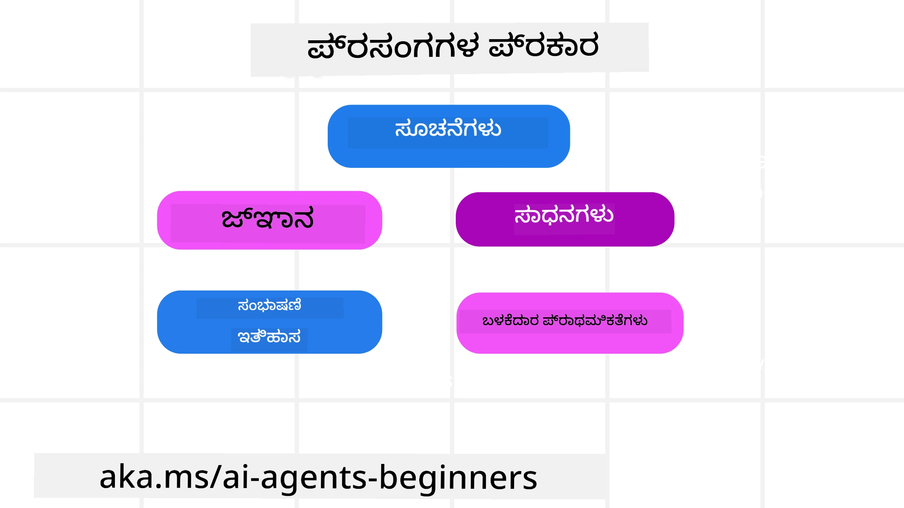
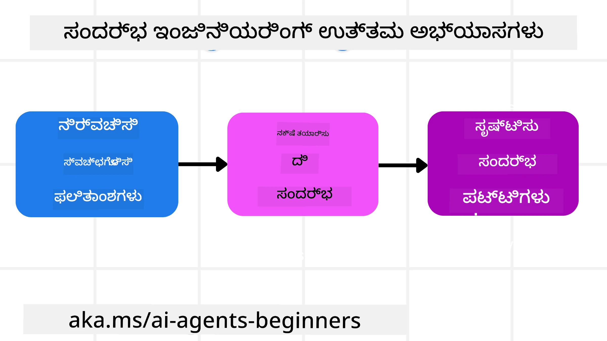

<!--
CO_OP_TRANSLATOR_METADATA:
{
  "original_hash": "cb7e50f471905ce6fdb92a30269a7a98",
  "translation_date": "2025-12-03T17:17:31+00:00",
  "source_file": "12-context-engineering/README.md",
  "language_code": "kn"
}
-->
# AI ಏಜೆಂಟ್‌ಗಳಿಗಾಗಿ ಕಂಟೆಕ್ಸ್‌ಟ್ ಎಂಜಿನಿಯರಿಂಗ್

> _(ಈ ಪಾಠದ ವಿಡಿಯೋವನ್ನು ನೋಡಲು ಮೇಲಿನ ಚಿತ್ರವನ್ನು ಕ್ಲಿಕ್ ಮಾಡಿ)_

ನೀವು AI ಏಜೆಂಟ್‌ಗಾಗಿ ನಿರ್ಮಿಸುತ್ತಿರುವ ಅಪ್ಲಿಕೇಶನ್‌ನ ಸಂಕೀರ್ಣತೆಯನ್ನು ಅರ್ಥಮಾಡಿಕೊಳ್ಳುವುದು ವಿಶ್ವಾಸಾರ್ಹ ಏಜೆಂಟ್ ನಿರ್ಮಿಸಲು ಮುಖ್ಯವಾಗಿದೆ. ಪ್ರಾಂಪ್ಟ್ ಎಂಜಿನಿಯರಿಂಗ್‌ನ ಪಾರಮ್ಯವನ್ನು ಮೀರಿ ಸಂಕೀರ್ಣ ಅಗತ್ಯಗಳನ್ನು ಪೂರೈಸಲು ಮಾಹಿತಿಯನ್ನು ಪರಿಣಾಮಕಾರಿಯಾಗಿ ನಿರ್ವಹಿಸುವ AI ಏಜೆಂಟ್‌ಗಳನ್ನು ನಾವು ನಿರ್ಮಿಸಬೇಕು.

ಈ ಪಾಠದಲ್ಲಿ, ಕಂಟೆಕ್ಸ್‌ಟ್ ಎಂಜಿನಿಯರಿಂಗ್ ಎಂದರೇನು ಮತ್ತು AI ಏಜೆಂಟ್‌ಗಳನ್ನು ನಿರ್ಮಿಸುವಲ್ಲಿ ಅದರ ಪಾತ್ರವನ್ನು ನಾವು ನೋಡುತ್ತೇವೆ.

## ಪರಿಚಯ

ಈ ಪಾಠದಲ್ಲಿ ನಾವು ಕವರ್ ಮಾಡುತ್ತೇವೆ:

• **ಕಂಟೆಕ್ಸ್‌ಟ್ ಎಂಜಿನಿಯರಿಂಗ್ ಎಂದರೇನು** ಮತ್ತು ಅದು ಪ್ರಾಂಪ್ಟ್ ಎಂಜಿನಿಯರಿಂಗ್‌ನಿಂದ ಹೇಗೆ ವಿಭಿನ್ನವಾಗಿದೆ.

• **ಪ್ರಭಾವಶೀಲ ಕಂಟೆಕ್ಸ್‌ಟ್ ಎಂಜಿನಿಯರಿಂಗ್ ತಂತ್ರಗಳು**, ಮಾಹಿತಿಯನ್ನು ಬರೆಯುವುದು, ಆಯ್ಕೆ ಮಾಡುವುದು, ಸಂಕ್ಷಿಪ್ತಗೊಳಿಸುವುದು ಮತ್ತು ಪ್ರತ್ಯೇಕಗೊಳಿಸುವುದು ಹೇಗೆ ಎಂಬುದನ್ನು ಒಳಗೊಂಡಂತೆ.

• **ಸಾಮಾನ್ಯ ಕಂಟೆಕ್ಸ್‌ಟ್ ವೈಫಲ್ಯಗಳು** ನಿಮ್ಮ AI ಏಜೆಂಟ್ ಅನ್ನು ಹಾಳುಮಾಡಬಹುದು ಮತ್ತು ಅವುಗಳನ್ನು ಸರಿಪಡಿಸುವುದು ಹೇಗೆ.

## ಕಲಿಕೆಯ ಗುರಿಗಳು

ಈ ಪಾಠವನ್ನು ಪೂರ್ಣಗೊಳಿಸಿದ ನಂತರ, ನೀವು ಅರ್ಥಮಾಡಿಕೊಳ್ಳುತ್ತೀರಿ:

• **ಕಂಟೆಕ್ಸ್‌ಟ್ ಎಂಜಿನಿಯರಿಂಗ್ ಅನ್ನು ವ್ಯಾಖ್ಯಾನಿಸಿ** ಮತ್ತು ಪ್ರಾಂಪ್ಟ್ ಎಂಜಿನಿಯರಿಂಗ್‌ನಿಂದ ಅದನ್ನು ವಿಭಜಿಸಿ.

• **ಕಂಟೆಕ್ಸ್‌ಟ್‌ನ ಪ್ರಮುಖ ಅಂಶಗಳನ್ನು ಗುರುತಿಸಿ** ಲಾರ್ಜ್ ಲ್ಯಾಂಗ್ವೇಜ್ ಮಾದರಿ (LLM) ಅಪ್ಲಿಕೇಶನ್‌ಗಳಲ್ಲಿ.

• **ಕಂಟೆಕ್ಸ್‌ಟ್ ಅನ್ನು ಬರೆಯುವುದು, ಆಯ್ಕೆ ಮಾಡುವುದು, ಸಂಕ್ಷಿಪ್ತಗೊಳಿಸುವುದು ಮತ್ತು ಪ್ರತ್ಯೇಕಗೊಳಿಸುವ ತಂತ್ರಗಳನ್ನು ಅನ್ವಯಿಸಿ** ಏಜೆಂಟ್ ಕಾರ್ಯಕ್ಷಮತೆಯನ್ನು ಸುಧಾರಿಸಲು.

• **ಸಾಮಾನ್ಯ ಕಂಟೆಕ್ಸ್‌ಟ್ ವೈಫಲ್ಯಗಳನ್ನು ಗುರುತಿಸಿ** ಉದಾಹರಣೆಗೆ ವಿಷಕಾರಕತೆ, ಗಮನಚಲನೆ, ಗೊಂದಲ, ಮತ್ತು ಸಂಘರ್ಷ, ಮತ್ತು ತಡೆಗಟ್ಟುವ ತಂತ್ರಗಳನ್ನು ಅನುಷ್ಠಾನಗೊಳಿಸಿ.

## ಕಂಟೆಕ್ಸ್‌ಟ್ ಎಂಜಿನಿಯರಿಂಗ್ ಎಂದರೇನು?

AI ಏಜೆಂಟ್‌ಗಳಿಗಾಗಿ, ಕಂಟೆಕ್ಸ್‌ಟ್ ಎಂಬುದು AI ಏಜೆಂಟ್ ನಿರ್ದಿಷ್ಟ ಕ್ರಿಯೆಗಳನ್ನು ಕೈಗೊಳ್ಳಲು ಯೋಜನೆ ರೂಪಿಸುವುದನ್ನು ಚಲಾಯಿಸುತ್ತದೆ. AI ಏಜೆಂಟ್‌ಗೆ ಕಾರ್ಯದ ಮುಂದಿನ ಹಂತವನ್ನು ಪೂರ್ಣಗೊಳಿಸಲು ಸರಿಯಾದ ಮಾಹಿತಿಯನ್ನು ಹೊಂದಿರುವುದನ್ನು ಖಚಿತಪಡಿಸಿಕೊಳ್ಳುವ ಅಭ್ಯಾಸವೇ ಕಂಟೆಕ್ಸ್‌ಟ್ ಎಂಜಿನಿಯರಿಂಗ್. ಕಂಟೆಕ್ಸ್‌ಟ್ ವಿಂಡೋ ಗಾತ್ರದಲ್ಲಿ ಸೀಮಿತವಾಗಿದೆ, ಆದ್ದರಿಂದ ಏಜೆಂಟ್ ನಿರ್ಮಾತೃಗಳು ನಾವು ಈ ಕಂಟೆಕ್ಸ್‌ಟ್ ವಿಂಡೋಗೆ ಮಾಹಿತಿಯನ್ನು ಸೇರಿಸುವುದು, ತೆಗೆದುಹಾಕುವುದು ಮತ್ತು ಸಂಕ್ಷಿಪ್ತಗೊಳಿಸುವ ವ್ಯವಸ್ಥೆಗಳನ್ನು ಮತ್ತು ಪ್ರಕ್ರಿಯೆಗಳನ್ನು ನಿರ್ಮಿಸಬೇಕು.

### ಪ್ರಾಂಪ್ಟ್ ಎಂಜಿನಿಯರಿಂಗ್ vs ಕಂಟೆಕ್ಸ್‌ಟ್ ಎಂಜಿನಿಯರಿಂಗ್

ಪ್ರಾಂಪ್ಟ್ ಎಂಜಿನಿಯರಿಂಗ್ AI ಏಜೆಂಟ್‌ಗಳನ್ನು ನಿಯಮಗಳ ಸಮೂಹದೊಂದಿಗೆ ಪರಿಣಾಮಕಾರಿಯಾಗಿ ಮಾರ್ಗದರ್ಶಿಸಲು ಒಂದು ಸ್ಥಿರ ಸೂಚನೆಗಳ ಸೆಟ್ ಮೇಲೆ ಕೇಂದ್ರೀಕೃತವಾಗಿದೆ. ಕಂಟೆಕ್ಸ್‌ಟ್ ಎಂಜಿನಿಯರಿಂಗ್ ಎಂಬುದು ಡೈನಾಮಿಕ್ ಮಾಹಿತಿಯ ಸೆಟ್ ಅನ್ನು ನಿರ್ವಹಿಸುವುದು, ಪ್ರಾರಂಭಿಕ ಪ್ರಾಂಪ್ಟ್ ಅನ್ನು ಒಳಗೊಂಡಂತೆ, AI ಏಜೆಂಟ್‌ಗೆ ಅವಶ್ಯಕತೆಯಾದ ಮಾಹಿತಿಯನ್ನು ಸಮಯದೊಂದಿಗೆ ಹೊಂದಿರುವುದನ್ನು ಖಚಿತಪಡಿಸಿಕೊಳ್ಳುವುದು. ಕಂಟೆಕ್ಸ್‌ಟ್ ಎಂಜಿನಿಯರಿಂಗ್‌ನ ಮುಖ್ಯ ಆಲೋಚನೆ ಈ ಪ್ರಕ್ರಿಯೆಯನ್ನು ಪುನರಾವರ್ತನೀಯ ಮತ್ತು ವಿಶ್ವಾಸಾರ್ಹವಾಗಿಸಲು ಆಗಿದೆ.

### ಕಂಟೆಕ್ಸ್‌ಟ್ ಪ್ರಕಾರಗಳು

ಕಂಟೆಕ್ಸ್‌ಟ್ ಒಂದು ವಿಷಯ ಮಾತ್ರವಲ್ಲ ಎಂಬುದನ್ನು ನೆನಪಿಡುವುದು ಮುಖ್ಯ. AI ಏಜೆಂಟ್‌ಗೆ ಅಗತ್ಯವಿರುವ ಮಾಹಿತಿಯು ವಿವಿಧ ಮೂಲಗಳಿಂದ ಬರಬಹುದು ಮತ್ತು ಈ ಮೂಲಗಳಿಗೆ ಏಜೆಂಟ್‌ಗೆ ಪ್ರವೇಶವನ್ನು ಖಚಿತಪಡಿಸುವುದು ನಮ್ಮ ಹೊಣೆಗಾರಿಕೆ:

AI ಏಜೆಂಟ್ ನಿರ್ವಹಿಸಬೇಕಾದ ಕಂಟೆಕ್ಸ್‌ಟ್ ಪ್ರಕಾರಗಳು:

• **ಸೂಚನೆಗಳು:** ಇವು ಏಜೆಂಟ್‌ನ "ನಿಯಮಗಳು" – ಪ್ರಾಂಪ್ಟ್‌ಗಳು, ಸಿಸ್ಟಮ್ ಸಂದೇಶಗಳು, ಫ್ಯೂ-ಶಾಟ್ ಉದಾಹರಣೆಗಳು (AIಗೆ ಏನಾದರೂ ಹೇಗೆ ಮಾಡುವುದು ಎಂದು ತೋರಿಸುವುದು), ಮತ್ತು ಅದು ಬಳಸಬಹುದಾದ ಸಾಧನಗಳ ವಿವರಣೆಗಳು. ಇದು ಪ್ರಾಂಪ್ಟ್ ಎಂಜಿನಿಯರಿಂಗ್ ಮತ್ತು ಕಂಟೆಕ್ಸ್‌ಟ್ ಎಂಜಿನಿಯರಿಂಗ್‌ಗಳ ಒಟ್ಟುಗೂಡಿಸುವ ಸ್ಥಳವಾಗಿದೆ.

• **ಜ್ಞಾನ:** ಇದು ತಥ್ಯಗಳು, ಡೇಟಾಬೇಸ್‌ಗಳಿಂದ ಹಿಂಪಡೆಯಲ್ಪಟ್ಟ ಮಾಹಿತಿಯನ್ನು ಅಥವಾ ಏಜೆಂಟ್ ಸಂಗ್ರಹಿಸಿರುವ ದೀರ್ಘಕಾಲದ ನೆನಪುಗಳನ್ನು ಒಳಗೊಂಡಿದೆ. ಇದು ಏಜೆಂಟ್‌ಗೆ ವಿವಿಧ ಜ್ಞಾನ ಸಂಗ್ರಹಣೆಗಳು ಮತ್ತು ಡೇಟಾಬೇಸ್‌ಗಳಿಗೆ ಪ್ರವೇಶವನ್ನು ಅಗತ್ಯವಿದ್ದಲ್ಲಿ Retrieval Augmented Generation (RAG) ವ್ಯವಸ್ಥೆಯನ್ನು ಸಂಯೋಜಿಸುವುದನ್ನು ಒಳಗೊಂಡಿದೆ.

• **ಸಾಧನಗಳು:** ಇವು ಬಾಹ್ಯ ಕಾರ್ಯಗಳು, APIಗಳು ಮತ್ತು MCP ಸರ್ವರ್‌ಗಳ ವ್ಯಾಖ್ಯಾನಗಳು, ಜೊತೆಗೆ ಅವುಗಳನ್ನು ಬಳಸುವಾಗ ಏಜೆಂಟ್‌ಗೆ ದೊರೆಯುವ ಪ್ರತಿಕ್ರಿಯೆ (ಫಲಿತಾಂಶಗಳು).

• **ಸಂಭಾಷಣಾ ಇತಿಹಾಸ:** ಬಳಕೆದಾರನೊಂದಿಗೆ ನಡೆಯುವ ಸಂಭಾಷಣೆ. ಸಮಯದೊಂದಿಗೆ, ಈ ಸಂಭಾಷಣೆಗಳು ಉದ್ದವಾಗುತ್ತವೆ ಮತ್ತು ಹೆಚ್ಚು ಸಂಕೀರ್ಣವಾಗುತ್ತವೆ, ಇದು ಕಂಟೆಕ್ಸ್‌ಟ್ ವಿಂಡೋದಲ್ಲಿ ಸ್ಥಳವನ್ನು ತೆಗೆದುಕೊಳ್ಳುತ್ತದೆ.

• **ಬಳಕೆದಾರರ ಪ್ರಾಧಾನ್ಯತೆಗಳು:** ಬಳಕೆದಾರನ ಇಷ್ಟಗಳು ಅಥವಾ ಅಸಮಾಧಾನಗಳ ಬಗ್ಗೆ ಸಮಯದೊಂದಿಗೆ ಕಲಿತ ಮಾಹಿತಿಯನ್ನು. ಮುಖ್ಯ ನಿರ್ಧಾರಗಳನ್ನು ತೆಗೆದುಕೊಳ್ಳುವಾಗ ಬಳಕೆದಾರನಿಗೆ ಸಹಾಯ ಮಾಡಲು ಇವು ಸಂಗ್ರಹಿಸಲಾಗಬಹುದು ಮತ್ತು ಕರೆಸಿಕೊಳ್ಳಬಹುದು.

## ಪ್ರಭಾವಶೀಲ ಕಂಟೆಕ್ಸ್‌ಟ್ ಎಂಜಿನಿಯರಿಂಗ್ ತಂತ್ರಗಳು

### ಯೋಜನಾ ತಂತ್ರಗಳು

ಉತ್ತಮ ಕಂಟೆಕ್ಸ್‌ಟ್ ಎಂಜಿನಿಯರಿಂಗ್ ಉತ್ತಮ ಯೋಜನೆಯಿಂದ ಪ್ರಾರಂಭವಾಗುತ್ತದೆ. ಕಂಟೆಕ್ಸ್‌ಟ್ ಎಂಜಿನಿಯರಿಂಗ್ ತತ್ವವನ್ನು ಅನ್ವಯಿಸಲು ಹೇಗೆ ಯೋಚಿಸಲು ಪ್ರಾರಂಭಿಸಲು ಇದು ಸಹಾಯ ಮಾಡುತ್ತದೆ:

1. **ಸ್ಪಷ್ಟ ಫಲಿತಾಂಶಗಳನ್ನು ವ್ಯಾಖ್ಯಾನಿಸಿ** - AI ಏಜೆಂಟ್‌ಗಳಿಗೆ ನೀಡಲಾಗುವ ಕಾರ್ಯಗಳ ಫಲಿತಾಂಶಗಳು ಸ್ಪಷ್ಟವಾಗಿ ವ್ಯಾಖ್ಯಾನಿಸಬೇಕು. ಈ ಪ್ರಶ್ನೆಗೆ ಉತ್ತರಿಸಿ - "AI ಏಜೆಂಟ್ ತನ್ನ ಕಾರ್ಯವನ್ನು ಪೂರ್ಣಗೊಳಿಸಿದ ನಂತರ ಜಗತ್ತು ಹೇಗೆ ಕಾಣುತ್ತದೆ?" ಅಂದರೆ, ಬಳಕೆದಾರ AI ಏಜೆಂಟ್‌ ಜೊತೆ ಸಂವಹನ ಮಾಡಿದ ನಂತರ ಯಾವ ಬದಲಾವಣೆ, ಮಾಹಿತಿ ಅಥವಾ ಪ್ರತಿಕ್ರಿಯೆಯನ್ನು ಹೊಂದಿರಬೇಕು.

2. **ಕಂಟೆಕ್ಸ್‌ಟ್ ಅನ್ನು ನಕ್ಷೆ ಮಾಡಿ** - AI ಏಜೆಂಟ್‌ನ ಫಲಿತಾಂಶಗಳನ್ನು ವ್ಯಾಖ್ಯಾನಿಸಿದ ನಂತರ, "AI ಏಜೆಂಟ್ ಈ ಕಾರ್ಯವನ್ನು ಪೂರ್ಣಗೊಳಿಸಲು ಯಾವ ಮಾಹಿತಿಯನ್ನು ಅಗತ್ಯವಿದೆ?" ಎಂಬ ಪ್ರಶ್ನೆಗೆ ಉತ್ತರಿಸಬೇಕು. ಈ ರೀತಿಯಾಗಿ ನೀವು ಆ ಮಾಹಿತಿಯನ್ನು ಎಲ್ಲಿ ಪತ್ತೆಹಚ್ಚಬಹುದು ಎಂಬುದರ ಕಂಟೆಕ್ಸ್‌ಟ್ ಅನ್ನು ನಕ್ಷೆ ಮಾಡಲು ಪ್ರಾರಂಭಿಸಬಹುದು.

3. **ಕಂಟೆಕ್ಸ್‌ಟ್ ಪೈಪ್‌ಲೈನ್‌ಗಳನ್ನು ರಚಿಸಿ** - ಈಗ ನೀವು ಮಾಹಿತಿಯ ಸ್ಥಳವನ್ನು ತಿಳಿದಿದ್ದೀರಿ, "ಏಜೆಂಟ್ ಈ ಮಾಹಿತಿಯನ್ನು ಹೇಗೆ ಪಡೆಯುತ್ತದೆ?" ಎಂಬ ಪ್ರಶ್ನೆಗೆ ಉತ್ತರಿಸಬೇಕು. ಇದನ್ನು RAG, MCP ಸರ್ವರ್‌ಗಳ ಬಳಕೆ ಮತ್ತು ಇತರ ಸಾಧನಗಳನ್ನು ಒಳಗೊಂಡಂತೆ ವಿವಿಧ ರೀತಿಯಲ್ಲಿ ಮಾಡಬಹುದು.

### ಪ್ರಾಯೋಗಿಕ ತಂತ್ರಗಳು

ಯೋಜನೆ ಮುಖ್ಯವಾಗಿದೆ ಆದರೆ ಮಾಹಿತಿಯು ನಮ್ಮ ಏಜೆಂಟ್‌ನ ಕಂಟೆಕ್ಸ್‌ಟ್ ವಿಂಡೋಗೆ ಹರಿಯಲು ಪ್ರಾರಂಭಿಸಿದ ನಂತರ, ಅದನ್ನು ನಿರ್ವಹಿಸಲು ಪ್ರಾಯೋಗಿಕ ತಂತ್ರಗಳನ್ನು ಹೊಂದಿರಬೇಕು:

#### ಕಂಟೆಕ್ಸ್‌ಟ್ ನಿರ್ವಹಣೆ

ಕೆಲವು ಮಾಹಿತಿಯನ್ನು ಸ್ವಯಂಚಾಲಿತವಾಗಿ ಕಂಟೆಕ್ಸ್‌ಟ್ ವಿಂಡೋಗೆ ಸೇರಿಸಲಾಗುತ್ತದೆ, ಆದರೆ ಕಂಟೆಕ್ಸ್‌ಟ್ ಎಂಜಿನಿಯರಿಂಗ್ ಈ ಮಾಹಿತಿಯ ಮೇಲೆ ಹೆಚ್ಚು ಸಕ್ರಿಯ ಪಾತ್ರವನ್ನು ವಹಿಸುವುದರ ಬಗ್ಗೆ:

 1. **ಏಜೆಂಟ್ ಸ್ಕ್ರಾಚ್‌ಪ್ಯಾಡ್**
 ಇದು AI ಏಜೆಂಟ್‌ಗೆ ಪ್ರಸ್ತುತ ಕಾರ್ಯಗಳು ಮತ್ತು ಬಳಕೆದಾರ ಸಂವಹನಗಳ ಬಗ್ಗೆ ಸಂಬಂಧಿತ ಮಾಹಿತಿಯನ್ನು ಒಂದು ಸೆಷನ್‌ನಲ್ಲಿ ಟಿಪ್ಪಣಿಗಳನ್ನು ತೆಗೆದುಕೊಳ್ಳಲು ಅವಕಾಶ ನೀಡುತ್ತದೆ. ಇದು ಕಂಟೆಕ್ಸ್‌ಟ್ ವಿಂಡೋ ಹೊರಗೆ ಫೈಲ್ ಅಥವಾ ರನ್‌ಟೈಮ್ ಆಬ್ಜೆಕ್ಟ್‌ನಲ್ಲಿ ಅಸ್ತಿತ್ವದಲ್ಲಿರಬೇಕು, ಏಜೆಂಟ್‌ಗೆ ಈ ಸೆಷನ್‌ನಲ್ಲಿ ಅಗತ್ಯವಿದ್ದರೆ ನಂತರದ ಸಮಯದಲ್ಲಿ ಹಿಂಪಡೆಯಲು.

 2. **ನೆನಪುಗಳು**
 ಸ್ಕ್ರಾಚ್‌ಪ್ಯಾಡ್‌ಗಳು ಒಂದು ಸೆಷನ್‌ನ ಕಂಟೆಕ್ಸ್‌ಟ್ ವಿಂಡೋ ಹೊರಗೆ ಮಾಹಿತಿಯನ್ನು ನಿರ್ವಹಿಸಲು ಉತ್ತಮವಾಗಿದೆ. ನೆನಪುಗಳು ಏಜೆಂಟ್‌ಗಳಿಗೆ ಬಹು ಸೆಷನ್‌ಗಳಲ್ಲಿ ಸಂಬಂಧಿತ ಮಾಹಿತಿಯನ್ನು ಸಂಗ್ರಹಿಸಲು ಮತ್ತು ಹಿಂಪಡೆಯಲು ಅವಕಾಶ ನೀಡುತ್ತದೆ. ಇದರಲ್ಲಿ ಸಾರಾಂಶಗಳು, ಬಳಕೆದಾರರ ಪ್ರಾಧಾನ್ಯತೆಗಳು ಮತ್ತು ಭವಿಷ್ಯದಲ್ಲಿ ಸುಧಾರಣೆಗಾಗಿ ಪ್ರತಿಕ್ರಿಯೆಗಳನ್ನು ಒಳಗೊಂಡಿರಬಹುದು.

 3. **ಕಂಟೆಕ್ಸ್‌ಟ್ ಸಂಕ್ಷಿಪ್ತಗೊಳಿಸುವುದು**
  ಕಂಟೆಕ್ಸ್‌ಟ್ ವಿಂಡೋ ಬೆಳೆಯುತ್ತಾ ಅದರ ಮಿತಿಯ ಹತ್ತಿರ ತಲುಪಿದಾಗ, ಸಾರಾಂಶಗೊಳಿಸುವಿಕೆ ಮತ್ತು ಕತ್ತರಿಸುವಂತಹ ತಂತ್ರಗಳನ್ನು ಬಳಸಬಹುದು. ಇದರಲ್ಲಿ ಅತ್ಯಂತ ಸಂಬಂಧಿತ ಮಾಹಿತಿಯನ್ನು ಮಾತ್ರ ಉಳಿಸುವುದು ಅಥವಾ ಹಳೆಯ ಸಂದೇಶಗಳನ್ನು ತೆಗೆದುಹಾಕುವುದು.

 4. **ಮಲ್ಟಿ-ಏಜೆಂಟ್ ಸಿಸ್ಟಮ್‌ಗಳು**
  ಮಲ್ಟಿ-ಏಜೆಂಟ್ ಸಿಸ್ಟಮ್‌ಗಳನ್ನು ಅಭಿವೃದ್ಧಿಪಡಿಸುವುದು ಕಂಟೆಕ್ಸ್‌ಟ್ ಎಂಜಿನಿಯರಿಂಗ್‌ನ ಒಂದು ರೂಪವಾಗಿದೆ ಏಕೆಂದರೆ ಪ್ರತಿ ಏಜೆಂಟ್‌ಗೆ ತನ್ನದೇ ಆದ ಕಂಟೆಕ್ಸ್‌ಟ್ ವಿಂಡೋ ಇರುತ್ತದೆ. ಈ ಕಂಟೆಕ್ಸ್‌ಟ್ ಅನ್ನು ವಿಭಿನ್ನ ಏಜೆಂಟ್‌ಗಳಿಗೆ ಹೇಗೆ ಹಂಚಲಾಗುತ್ತದೆ ಮತ್ತು ಪಾಸ್ ಮಾಡಲಾಗುತ್ತದೆ ಎಂಬುದನ್ನು ಈ ಸಿಸ್ಟಮ್‌ಗಳನ್ನು ನಿರ್ಮಿಸುವಾಗ ಯೋಜನೆ ಮಾಡಬೇಕು.

 5. **ಸ್ಯಾಂಡ್‌ಬಾಕ್ಸ್ ಪರಿಸರಗಳು**
  ಏಜೆಂಟ್‌ಗೆ ಕೆಲವು ಕೋಡ್ ಅನ್ನು ರನ್ ಮಾಡಲು ಅಥವಾ ಡಾಕ್ಯುಮೆಂಟ್‌ನಲ್ಲಿ ದೊಡ್ಡ ಪ್ರಮಾಣದ ಮಾಹಿತಿಯನ್ನು ಪ್ರಕ್ರಿಯೆಗೊಳಿಸಲು ಅಗತ್ಯವಿದ್ದರೆ, ಇದು ಫಲಿತಾಂಶಗಳನ್ನು ಪ್ರಕ್ರಿಯೆಗೊಳಿಸಲು ದೊಡ್ಡ ಪ್ರಮಾಣದ ಟೋಕನ್‌ಗಳನ್ನು ತೆಗೆದುಕೊಳ್ಳಬಹುದು. ಇದನ್ನು ಎಲ್ಲಾ ಕಂಟೆಕ್ಸ್‌ಟ್ ವಿಂಡೋದಲ್ಲಿ ಸಂಗ್ರಹಿಸುವ ಬದಲು, ಏಜೆಂಟ್ ಈ ಕೋಡ್ ಅನ್ನು ರನ್ ಮಾಡಲು ಮತ್ತು ಫಲಿತಾಂಶಗಳು ಮತ್ತು ಇತರ ಸಂಬಂಧಿತ ಮಾಹಿತಿಯನ್ನು ಮಾತ್ರ ಓದಲು ಸಾಧ್ಯವಾಗುವ ಸ್ಯಾಂಡ್‌ಬಾಕ್ಸ್ ಪರಿಸರವನ್ನು ಬಳಸಬಹುದು.

 6. **ರನ್‌ಟೈಮ್ ಸ್ಟೇಟ್ ಆಬ್ಜೆಕ್ಟ್‌ಗಳು**
   ಇದು ಏಜೆಂಟ್‌ಗೆ ನಿರ್ದಿಷ್ಟ ಮಾಹಿತಿಗೆ ಪ್ರವೇಶವನ್ನು ಹೊಂದಲು ಅಗತ್ಯವಿರುವ ಸಂದರ್ಭಗಳಲ್ಲಿ ಮಾಹಿತಿಯ ಕಂಟೈನರ್‌ಗಳನ್ನು ರಚಿಸುವ ಮೂಲಕ ಮಾಡಲಾಗುತ್ತದೆ. ಸಂಕೀರ್ಣ ಕಾರ್ಯಕ್ಕಾಗಿ, ಇದು ಪ್ರತಿ ಉಪಕಾರ್ಯದ ಫಲಿತಾಂಶಗಳನ್ನು ಹಂತ ಹಂತವಾಗಿ ಸಂಗ್ರಹಿಸಲು ಏಜೆಂಟ್‌ಗೆ ಅವಕಾಶ ನೀಡುತ್ತದೆ, ಕಂಟೆಕ್ಸ್‌ಟ್ ಅನ್ನು ಆ ಉಪಕಾರ್ಯದೊಂದಿಗೆ ಮಾತ್ರ ಸಂಪರ್ಕ ಹೊಂದಲು ಸಾಧ್ಯವಾಗುತ್ತದೆ.

### ಕಂಟೆಕ್ಸ್‌ಟ್ ಎಂಜಿನಿಯರಿಂಗ್ ಉದಾಹರಣೆ

ನಾವು AI ಏಜೆಂಟ್‌ನ್ನು **"ನನಗೆ ಪ್ಯಾರಿಸ್‌ಗೆ ಒಂದು ಪ್ರಯಾಣವನ್ನು ಬುಕ್ ಮಾಡಿ."** ಎಂದು ಕೇಳುತ್ತೇವೆ ಎಂದು ಹೇಳೋಣ.

• ಪ್ರಾಂಪ್ಟ್ ಎಂಜಿನಿಯರಿಂಗ್ ಮಾತ್ರ ಬಳಸುವ ಸರಳ ಏಜೆಂಟ್: **"ಸರಿ, ನೀವು ಯಾವಾಗ ಪ್ಯಾರಿಸ್‌ಗೆ ಹೋಗಲು ಬಯಸುತ್ತೀರಿ?"** ಎಂದು ಪ್ರತಿಕ್ರಿಯಿಸಬಹುದು. ಇದು ಬಳಕೆದಾರ ಕೇಳಿದ ಸಮಯದಲ್ಲಿ ನಿಮ್ಮ ನೇರ ಪ್ರಶ್ನೆಯನ್ನು ಮಾತ್ರ ಪ್ರಕ್ರಿಯೆಗೊಳಿಸಿದೆ.

• ಈ ಪಾಠದಲ್ಲಿ ಕವರಾದ ಕಂಟೆಕ್ಸ್‌ಟ್ ಎಂಜಿನಿಯರಿಂಗ್ ತಂತ್ರಗಳನ್ನು ಬಳಸುವ ಏಜೆಂಟ್ ಹೆಚ್ಚು ಮಾಡುತ್ತದೆ. ಪ್ರತಿಕ್ರಿಯಿಸುವ ಮೊದಲು, ಅದರ ಸಿಸ್ಟಮ್:

  ◦ **ನಿಮ್ಮ ಕ್ಯಾಲೆಂಡರ್ ಅನ್ನು ಪರಿಶೀಲಿಸಿ** ಲಭ್ಯವಿರುವ ದಿನಾಂಕಗಳಿಗಾಗಿ (ರಿಯಲ್-ಟೈಮ್ ಡೇಟಾವನ್ನು ಹಿಂಪಡೆಯುವುದು).

 ◦ **ಹಿಂದಿನ ಪ್ರಯಾಣದ ಪ್ರಾಧಾನ್ಯತೆಗಳನ್ನು ನೆನಪಿಡಿ** (ದೀರ್ಘಕಾಲದ ನೆನಪುಗಳಿಂದ) ನಿಮ್ಮ ಇಷ್ಟದ ವಿಮಾನ ಸಂಸ್ಥೆ, ಬಜೆಟ್, ಅಥವಾ ನೀವು ನೇರ ವಿಮಾನಗಳನ್ನು ಇಷ್ಟಪಡುತ್ತೀರಾ ಎಂಬುದನ್ನು.

 ◦ **ಲಭ್ಯವಿರುವ ಸಾಧನಗಳನ್ನು ಗುರುತಿಸಿ** ವಿಮಾನ ಮತ್ತು ಹೋಟೆಲ್ ಬುಕ್ಕಿಂಗ್‌ಗಾಗಿ.

- ನಂತರ, ಉದಾಹರಣೆಯ ಪ್ರತಿಕ್ರಿಯೆ: "ಹೇ [ನಿಮ್ಮ ಹೆಸರು]! ನಾನು ನೋಡುತ್ತಿದ್ದೇನೆ ನೀವು ಅಕ್ಟೋಬರ್ ಮೊದಲ ವಾರದಲ್ಲಿ ಮುಕ್ತರಾಗಿದ್ದೀರಿ. ನಾನು [ಪ್ರಿಯ ವಿಮಾನ ಸಂಸ್ಥೆ]ನಲ್ಲಿ ನೇರ ವಿಮಾನಗಳನ್ನು [ಬಜೆಟ್] ಒಳಗೆ ಹುಡುಕಬೇಕೆ?" ಎಂದು. ಈ ಸಮೃದ್ಧ, ಕಂಟೆಕ್ಸ್‌ಟ್-ಜ್ಞಾನಯುತ ಪ್ರತಿಕ್ರಿಯೆ ಕಂಟೆಕ್ಸ್‌ಟ್ ಎಂಜಿನಿಯರಿಂಗ್‌ನ ಶಕ್ತಿಯನ್ನು ತೋರಿಸುತ್ತದೆ.

## ಸಾಮಾನ್ಯ ಕಂಟೆಕ್ಸ್‌ಟ್ ವೈಫಲ್ಯಗಳು

### ಕಂಟೆಕ್ಸ್‌ಟ್ ವಿಷಕಾರಕತೆ

**ಇದು ಏನು:** ಹಲ್ಲುಸಿನೇಶನ್ (LLM ತಯಾರಿಸಿದ ತಪ್ಪು ಮಾಹಿತಿ) ಅಥವಾ ದೋಷವು ಕಂಟೆಕ್ಸ್‌ಟ್‌ಗೆ ಪ್ರವೇಶಿಸಿ, ನಿರಂತರವಾಗಿ ಉಲ್ಲೇಖಿಸಲಾಗುತ್ತದೆ, ಏಜೆಂಟ್‌ನ್ನು ಅಸಾಧ್ಯವಾದ ಗುರಿಗಳನ್ನು ಹಿಂಬಾಲಿಸಲು ಅಥವಾ ಅರ್ಥವಿಲ್ಲದ ತಂತ್ರಗಳನ್ನು ಅಭಿವೃದ್ಧಿಪಡಿಸಲು ಕಾರಣವಾಗುತ್ತದೆ.

**ಮಾಡಬೇಕಾದದ್ದು:** **ಕಂಟೆಕ್ಸ್‌ಟ್ ಮಾನ್ಯತೆ** ಮತ್ತು **ಕ್ವಾರಂಟೈನ್** ಅನ್ನು ಅನುಷ್ಠಾನಗೊಳಿಸಿ. ದೀರ್ಘಕಾಲದ ನೆನಪುಗಳಿಗೆ ಸೇರಿಸುವ ಮೊದಲು ಮಾಹಿತಿಯನ್ನು ಮಾನ್ಯಗೊಳಿಸಿ. ಸಾಧ್ಯವಾದ ವಿಷಕಾರಕತೆಯನ್ನು ಪತ್ತೆಹಚ್ಚಿದರೆ, ಕೆಟ್ಟ ಮಾಹಿತಿಯು ಹರಡುವುದನ್ನು ತಡೆಯಲು ಹೊಸ ಕಂಟೆಕ್ಸ್‌ಟ್ ಥ್ರೆಡ್‌ಗಳನ್ನು ಪ್ರಾರಂಭಿಸಿ.

**ಪ್ರಯಾಣ ಬುಕ್ಕಿಂಗ್ ಉದಾಹರಣೆ:** ನಿಮ್ಮ ಏಜೆಂಟ್ **ನೇರ ವಿಮಾನವನ್ನು ಒಂದು ಸಣ್ಣ ಸ್ಥಳೀಯ ವಿಮಾನ ನಿಲ್ದಾಣದಿಂದ ದೂರದ ಅಂತರರಾಷ್ಟ್ರೀಯ ನಗರಕ್ಕೆ** ಹಲ್ಲುಸಿನೇಶನ್ ಮಾಡುತ್ತದೆ, ಅದು ಅಂತರರಾಷ್ಟ್ರೀಯ ವಿಮಾನಗಳನ್ನು ವಾಸ್ತವವಾಗಿ ನೀಡುವುದಿಲ್ಲ. ಈ ಅಸ್ತಿತ್ವದಲ್ಲಿಲ್ಲದ ವಿಮಾನ ವಿವರವು ಕಂಟೆಕ್ಸ್‌ಟ್‌ಗೆ ಉಳಿಸಲಾಗುತ್ತದೆ. ನಂತರ, ನೀವು ಏಜೆಂಟ್‌ನ್ನು ಬುಕ್ ಮಾಡಲು ಕೇಳಿದಾಗ, ಇದು ಈ ಅಸಾಧ್ಯವಾದ ಮಾರ್ಗಕ್ಕಾಗಿ ಟಿಕೆಟ್‌ಗಳನ್ನು ಹುಡುಕಲು ಮುಂದುವರಿಯುತ್ತದೆ, ಪುನರಾವರ್ತಿತ ದೋಷಗಳಿಗೆ ಕಾರಣವಾಗುತ್ತದೆ.

**ಪರಿಹಾರ:** **ವಾಸ್ತವ-ಕಾಲ API** ಬಳಸಿ ವಿಮಾನ ಅಸ್ತಿತ್ವ ಮತ್ತು ಮಾರ್ಗಗಳನ್ನು ಮಾನ್ಯಗೊಳಿಸುವ ಹಂತವನ್ನು **ಕಂಟೆಕ್ಸ್‌ಟ್‌ಗೆ ವಿಮಾನ ವಿವರವನ್ನು ಸೇರಿಸುವ ಮೊದಲು** ಅನುಷ್ಠಾನಗೊಳಿಸಿ. ಮಾನ್ಯತೆ ವಿಫಲವಾದರೆ, ತಪ್ಪಾದ ಮಾಹಿತಿಯನ್ನು "ಕ್ವಾರಂಟೈನ್" ಮಾಡಲಾಗುತ್ತದೆ ಮತ್ತು ಮುಂದುವರೆಯುವಂತೆ ಬಳಸಲಾಗುವುದಿಲ್ಲ.

### ಕಂಟೆಕ್ಸ್‌ಟ್ ಗಮನಚಲನೆ

**ಇದು ಏನು:** ಕಂಟೆಕ್ಸ್‌ಟ್ ತುಂಬಾ ದೊಡ್ಡದಾಗಿದಾಗ, ಮಾದರಿ ತರಬೇತಿಯಲ್ಲಿ ಕಲಿತದ್ದನ್ನು ಬಳಸುವ ಬದಲು ಸಂಗ್ರಹಿತ ಇತಿಹಾಸದ ಮೇಲೆ ಹೆಚ್ಚು ಕೇಂದ್ರೀಕೃತವಾಗುತ್ತದೆ, ಪುನರಾವರ್ತಿತ ಅಥವಾ ಅನಾವಶ್ಯಕ ಕ್ರಿಯೆಗಳಿಗೆ ಕಾರಣವಾಗುತ್ತದೆ. ಕಂಟೆಕ್ಸ್‌ಟ್ ವಿಂಡೋ ತುಂಬುವ ಮೊದಲು ಮಾದರಿಗಳು ತಪ್ಪುಗಳನ್ನು ಮಾಡಲಾರಂಭಿಸಬಹುದು.

**ಮಾಡಬೇಕಾದದ್ದು:** **ಕಂಟೆಕ್ಸ್‌ಟ್ ಸಾರಾಂಶಗೊಳಿಸುವಿಕೆ** ಬಳಸಿ. ಅವಧಿಯಾಗಿ ಸಂಗ್ರಹಿತ ಮಾಹಿತಿಯನ್ನು ಚಿಕ್ಕ ಸಾರಾಂಶಗಳಲ್ಲಿ ಸಂಕ್ಷಿಪ್ತಗೊಳಿಸಿ, ಪ್ರಮುಖ ವಿವರಗಳನ್ನು ಉಳಿಸಿಕೊಂಡು ಪುನರಾವರ್ತಿತ ಇತಿಹಾಸವನ್ನು ತೆಗೆದುಹಾಕಿ. ಇದು "ಫೋಕಸ್ ಅನ್ನು ಮರುಹೊಂದಿಸಲು" ಸಹಾಯ ಮಾಡುತ್ತದೆ.

**ಪ್ರಯಾಣ ಬುಕ್ಕಿಂಗ್ ಉದಾಹರಣೆ:** ನೀವು ಹಲವು ಕನಸಿನ ಪ್ರಯಾಣದ ಸ್ಥಳಗಳ ಬಗ್ಗೆ ಚರ್ಚಿಸುತ್ತಿದ್ದೀರಿ, ಎರಡು ವರ್ಷಗಳ ಹಿಂದೆ ನಿಮ್ಮ ಬ್ಯಾಕ್‌ಪ್ಯಾಕಿಂಗ್ ಪ್ರಯಾಣದ ವಿವರವಾದ ವಿವರವನ್ನು ಒಳಗೊಂಡಂತೆ. ನೀವು ಕೊನೆಗೆ **"ನನಗೆ ಮುಂದಿನ ತಿಂಗಳಿಗಾಗಿ ಒಂದು ಅಗ್ಗದ ವಿಮಾನವನ್ನು ಹುಡುಕಿ"** ಎಂದು ಕೇಳಿದಾಗ, ಏಜೆಂಟ್ ಹಳೆಯ, ಅನಾವಶ್ಯಕ ವಿವರಗಳಲ್ಲಿ ತೊಡಗಿಸಿಕೊಂಡು ನಿಮ್ಮ ಬ್ಯಾಕ್‌ಪ್ಯಾಕಿಂಗ್ ಗೇರ್ ಅಥವಾ ಹಿಂದಿನ ಪಥಗಳ ಬಗ್ಗೆ ಕೇಳುತ್ತಾ, ನಿಮ್ಮ ಪ್ರಸ್ತುತ ವಿನಂತಿಯನ್ನು ನಿರ್ಲಕ್ಷಿಸುತ್ತದೆ.

**ಪರಿಹಾರ:** ಕೆಲವು ತಿರುಗುಗಳು ಅಥವಾ ಕಂಟೆಕ್ಸ್‌ಟ್ ತುಂಬಾ ದೊಡ್ಡದಾಗಿದ ನಂತರ, ಏಜೆಂಟ್ **ಸಂಭಾಷಣೆಯ

---

<!-- CO-OP TRANSLATOR DISCLAIMER START -->
**ಅಸ್ವೀಕಾರ**:  
ಈ ದಾಖಲೆ AI ಅನುವಾದ ಸೇವೆ [Co-op Translator](https://github.com/Azure/co-op-translator) ಬಳಸಿ ಅನುವಾದಿಸಲಾಗಿದೆ. ನಾವು ನಿಖರತೆಯನ್ನು ಸಾಧಿಸಲು ಪ್ರಯತ್ನಿಸುತ್ತಿದ್ದರೂ, ದಯವಿಟ್ಟು ಗಮನಿಸಿ, ಸ್ವಯಂಚಾಲಿತ ಅನುವಾದಗಳಲ್ಲಿ ದೋಷಗಳು ಅಥವಾ ಅಸಮರ್ಪಕತೆಗಳು ಇರಬಹುದು. ಮೂಲ ಭಾಷೆಯಲ್ಲಿರುವ ಮೂಲ ದಾಖಲೆ ಪ್ರಾಮಾಣಿಕ ಮೂಲವಾಗಿ ಪರಿಗಣಿಸಬೇಕು. ಪ್ರಮುಖ ಮಾಹಿತಿಗಾಗಿ, ವೃತ್ತಿಪರ ಮಾನವ ಅನುವಾದವನ್ನು ಶಿಫಾರಸು ಮಾಡಲಾಗುತ್ತದೆ. ಈ ಅನುವಾದದ ಬಳಕೆಯಿಂದ ಉಂಟಾಗುವ ಯಾವುದೇ ತಪ್ಪುಅರ್ಥಗಳು ಅಥವಾ ತಪ್ಪುಅರ್ಥೈಸುವಿಕೆಗೆ ನಾವು ಹೊಣೆಗಾರರಾಗುವುದಿಲ್ಲ.
<!-- CO-OP TRANSLATOR DISCLAIMER END -->